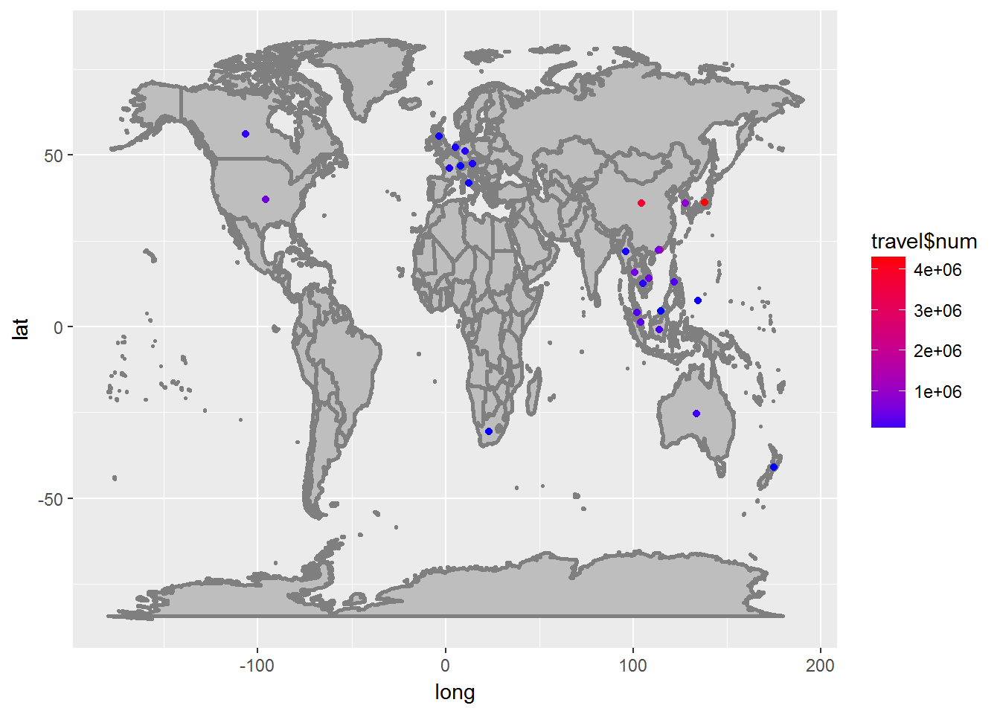
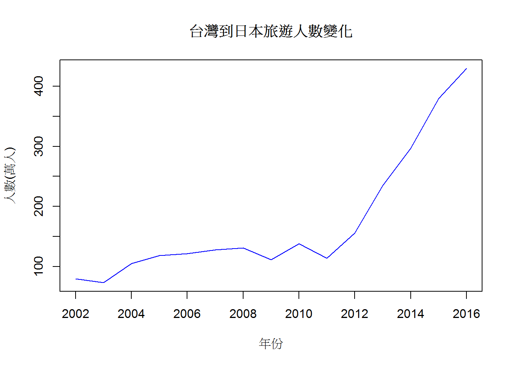
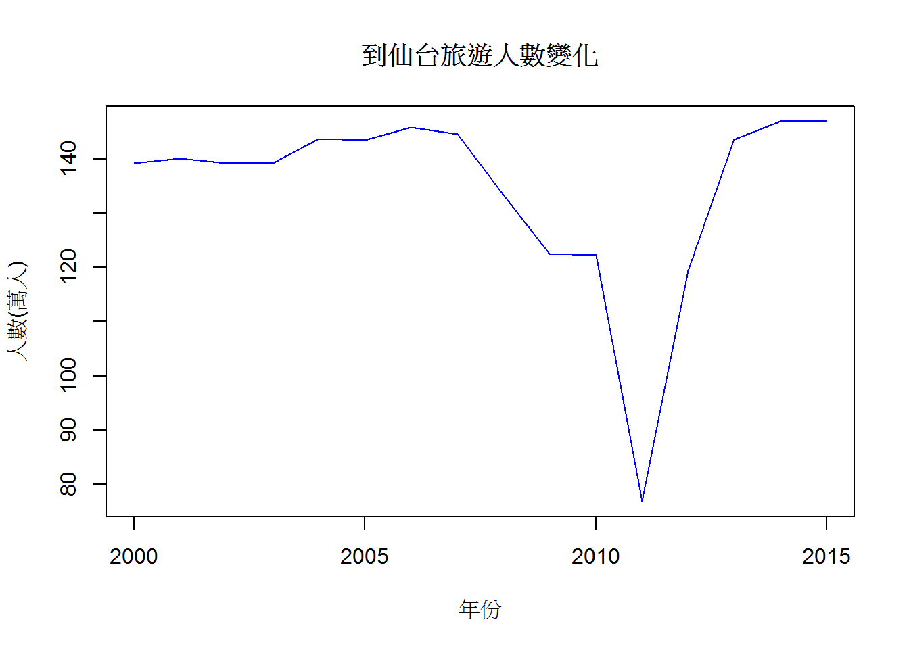
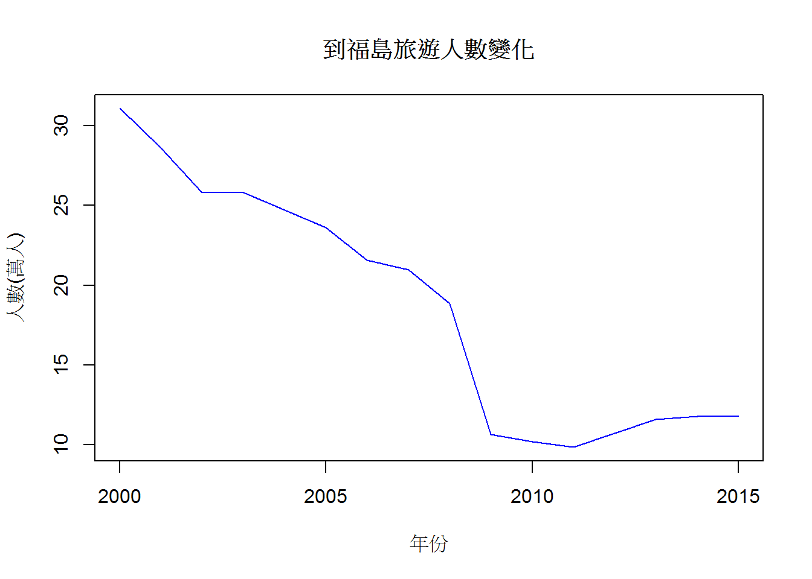

=================================================================  

一、資料介紹、來源及格式

1.桃園國際機場即時航班(6/5-6/7):
>桃園國際機場每天更新，當天及其前後兩天之航班狀況，當中包含往來地點、時間等資料。  
>X0605_0607
>CSV檔案
>http://data.gov.tw/node/26194

2.中華民國國民出國目的地人數統計(2016):  
>中華民國國民歷年來到各國家的人數統計  
>aborad(taiwan2016)  
>excel檔案  
>http://admin.taiwan.net.tw/statistics/year.aspx?no=134  

3.日本國內航班資料:  
>日本境內航班近年來變化的狀況  
>除上述兩檔案以外excel檔案  
>excel檔案  
>http://www.data.go.jp  
=================================================================

二、分析議題  
1.桃園機場各航空公司之航班的延誤比例  
2.台灣到各國旅遊的分布圖 
3.台灣到日本近年來旅遊人數的變化
4.日本仙台地區近15年(2000-2015)來國內航班的變化  
5.日本福島地區近15年(2000-2015)來國內航班的變化  
  

=================================================================

三、假設  
1.  
2.  
3.  

=================================================================


四、分析過程

##載入需要用到的packages

```r
library(readr)
```

```
## Warning: package 'readr' was built under R version 3.3.3
```

```r
library(readxl)
```

```
## Warning: package 'readxl' was built under R version 3.3.3
```

```r
library(magrittr)
library(ggmap)
```

```
## Warning: package 'ggmap' was built under R version 3.3.3
```

```
## Loading required package: ggplot2
```

```
## Warning: package 'ggplot2' was built under R version 3.3.3
```

```
## 
## Attaching package: 'ggmap'
```

```
## The following object is masked from 'package:magrittr':
## 
##     inset
```

```r
library(ggplot2)
```

##載入資料

```r
X0605_0607 <- read_csv("C:/Users/pig98/Desktop/FinalProject/0605_0607.csv", 
                       col_names = FALSE)
```

```
## Parsed with column specification:
## cols(
##   .default = col_character(),
##   X1 = col_integer(),
##   X7 = col_date(format = ""),
##   X8 = col_time(format = ""),
##   X9 = col_date(format = ""),
##   X10 = col_time(format = "")
## )
```

```
## See spec(...) for full column specifications.
```

```r
#桃園機場的CSV檔單獨讀入

temp = list.files(pattern="*.xls")
for (i in 1:length(temp)) 
  assign(temp[i], read_excel(temp[i]))
#其餘excel資料用迴圈讀入
```

##資料清洗

```r
#去除不需要的欄位以及中文名稱
X0605_0607<-X0605_0607[,c(-4,-11,-13,-14,-17,-18)] 
#新增欄位名稱
colnames(X0605_0607)=c("terminals","species","airline_id","flight","gate",
                       "scheduled_date","scheduled_time","expected_date","expected_time",
                       "destination","model","other destination","baggage claim","counter")
#依照航空公司代碼簡單排序資料
X0605_0607<-X0605_0607[order(X0605_0607$airline_id),]

knitr::kable(X0605_0607)
```


 terminals  species   airline_id   flight   gate   scheduled_date   scheduled_time   expected_date   expected_time   destination       model      other destination   baggage claim   counter 
----------  --------  -----------  -------  -----  ---------------  ---------------  --------------  --------------  ----------------  ---------  ------------------  --------------  --------
         1  A         3K           723      B3     2017-06-05       06:00:00         2017-06-05      05:33:11        Singapore         A320       NA                  NA              NA      
         1  A         3K           721      A2     2017-06-05       11:50:00         2017-06-05      11:43:26        Singapore         A320       NA                  NA              NA      
         1  A         3K           724      B1     2017-06-05       14:25:00         2017-06-05      13:42:11        Osaka Kansai      A320       NA                  NA              NA      
         1  A         3K           722      A4     2017-06-05       19:25:00         2017-06-05      18:47:54        Osaka Kansai      A320       NA                  5               NA      
         1  A         3K           721      B9     2017-06-06       11:50:00         2017-06-06      11:40:30        Singapore         A320       NA                  5               NA      
         1  A         3K           722      B1     2017-06-06       19:25:00         2017-06-06      19:25:00        Osaka Kansai      A320       NA                  3B              NA      
         1  A         3K           723      NA     2017-06-07       06:00:00         2017-06-07      06:00:00        Singapore         NA         NA                  NA              NA      
         1  A         3K           721      NA     2017-06-07       11:50:00         2017-06-07      11:50:00        Singapore         NA         NA                  NA              NA      
         1  A         3K           724      NA     2017-06-07       14:25:00         2017-06-07      14:25:00        Osaka Kansai      NA         NA                  NA              NA      
         1  A         3K           722      NA     2017-06-07       19:25:00         2017-06-07      19:25:00        Osaka Kansai      NA         NA                  NA              NA      
         1  D         3K           723      B3     2017-06-05       06:55:00         2017-06-05      06:46:24        Osaka Kansai      A320       NA                  NA              6       
         1  D         3K           721      A2     2017-06-05       12:40:00         2017-06-05      12:34:38        Osaka Kansai      A320       NA                  NA              6       
         1  D         3K           724      B1     2017-06-05       15:25:00         2017-06-05      15:25:21        Singapore         A320       NA                  NA              6       
         1  D         3K           722      A4     2017-06-05       20:20:00         2017-06-05      20:08:47        Singapore         A320       NA                  NA              6       
         1  D         3K           721      B9     2017-06-06       12:40:00         2017-06-06      12:44:55        Osaka Kansai      A320       NA                  NA              6       
         1  D         3K           722      B1     2017-06-06       20:20:00         2017-06-06      20:20:00        Singapore         A320       NA                  NA              6       
         1  D         3K           723      NA     2017-06-07       06:55:00         2017-06-07      06:55:00        Osaka Kansai      NA         NA                  NA              6       
         1  D         3K           721      NA     2017-06-07       12:40:00         2017-06-07      12:40:00        Osaka Kansai      NA         NA                  NA              6       
         1  D         3K           724      NA     2017-06-07       15:25:00         2017-06-07      15:25:00        Singapore         NA         NA                  NA              6       
         1  D         3K           722      NA     2017-06-07       20:20:00         2017-06-07      20:20:00        Singapore         NA         NA                  NA              6       
         1  A         3U           8957     A9     2017-06-05       18:10:00         2017-06-05      18:10:11        Kunming           A320       NA                  4A              NA      
         1  A         3U           8957     NA     2017-06-07       18:10:00         2017-06-07      18:10:00        Kunming           NA         NA                  NA              NA      
         1  D         3U           8958     A9     2017-06-05       19:10:00         2017-06-05      19:20:36        Kunming           A320       NA                  NA              8       
         1  D         3U           8958     NA     2017-06-07       19:10:00         2017-06-07      19:10:00        Kunming           NA         NA                  NA              8       
         1  A         5J           310      A5     2017-06-05       00:10:00         2017-06-05      00:21:53        Manila            A330-300   NA                  NA              NA      
         1  A         5J           96       A2     2017-06-05       22:15:00         2017-06-05      22:03:55        Kalibo            A320       NA                  1A              NA      
         1  A         5J           310      A9     2017-06-06       00:10:00         2017-06-06      00:10:34        Manila            A330-343   NA                  1B              NA      
         1  A         5J           310      NA     2017-06-07       00:10:00         2017-06-07      00:10:00        Manila            NA         NA                  NA              NA      
         1  A         5J           300      NA     2017-06-07       00:25:00         2017-06-07      00:25:00        Cebu              NA         NA                  NA              NA      
         1  D         5J           311      A5     2017-06-05       01:25:00         2017-06-05      01:35:55        Manila            A330-300   NA                  NA              5       
         1  D         5J           97       A2     2017-06-05       23:05:00         2017-06-05      22:59:52        Kalibo            A320       NA                  NA              5       
         1  D         5J           311      A9     2017-06-06       01:25:00         2017-06-06      01:30:57        Manila            A330-343   NA                  NA              5       
         1  D         5J           301      NA     2017-06-07       01:05:00         2017-06-07      01:05:00        Cebu              NA         NA                  NA              5       
         1  D         5J           311      NA     2017-06-07       01:25:00         2017-06-07      01:25:00        Manila            NA         NA                  NA              5       
         1  A         7C           2601     A1     2017-06-05       10:35:00         2017-06-05      10:59:43        Incheon           B737       NA                  NA              NA      
         1  A         7C           2653     A1     2017-06-05       23:30:00         2017-06-05      23:39:35        Busan             B737       NA                  3B              NA      
         1  A         7C           2601     A1     2017-06-06       10:35:00         2017-06-06      10:38:21        Incheon           B737       NA                  6               NA      
         1  A         7C           2651     B1     2017-06-06       11:45:00         2017-06-06      11:09:30        Busan             B737       NA                  5               NA      
         1  A         7C           2653     A1     2017-06-06       23:30:00         2017-06-06      23:30:00        Busan             B737       NA                  4B              NA      
         1  A         7C           2601     NA     2017-06-07       10:35:00         2017-06-07      10:35:00        Incheon           NA         NA                  NA              NA      
         1  A         7C           2653     NA     2017-06-07       23:30:00         2017-06-07      23:30:00        Busan             NA         NA                  NA              NA      
         1  D         7C           2654     A3     2017-06-05       02:50:00         2017-06-05      02:50:38        Busan             B737       NA                  NA              12      
         1  D         7C           2602     A1     2017-06-05       11:35:00         2017-06-05      11:56:50        Incheon           B737       NA                  NA              12      
         1  D         7C           2654     A1     2017-06-06       02:50:00         2017-06-06      02:51:57        Busan             B737       NA                  NA              12      
         1  D         7C           2602     A1     2017-06-06       11:35:00         2017-06-06      11:35:07        Incheon           B737       NA                  NA              12      
         1  D         7C           2652     B1     2017-06-06       13:10:00         2017-06-06      13:20:23        Busan             B737       NA                  NA              8       
         1  D         7C           2654     NA     2017-06-07       02:50:00         2017-06-07      02:50:00        Busan             NA         NA                  NA              12      
         1  D         7C           2602     NA     2017-06-07       11:35:00         2017-06-07      11:35:00        Incheon           NA         NA                  NA              12      
         1  A         9C           8951     B2     2017-06-05       10:15:00         2017-06-05      09:51:53        Shanghai          A320-200   NA                  NA              NA      
         1  A         9C           8561     B1     2017-06-05       18:50:00         2017-06-05      18:26:09        ShiJia Zhuang     A320-200   NA                  3B              NA      
         1  A         9C           8951     B1     2017-06-06       10:15:00         2017-06-06      09:35:49        Shanghai          A320-200   NA                  2               NA      
         1  A         9C           8561     NA     2017-06-07       18:50:00         2017-06-07      18:50:00        ShiJia Zhuang     NA         NA                  NA              NA      
         1  D         9C           8952     B2     2017-06-05       11:15:00         2017-06-05      10:55:12        Shanghai          A320-200   NA                  NA              6       
         1  D         9C           8562     B1     2017-06-05       19:50:00         2017-06-05      19:42:38        ShiJia Zhuang     A320-200   NA                  NA              6       
         1  D         9C           8952     B1     2017-06-06       11:15:00         2017-06-06      11:07:41        Shanghai          A320-200   NA                  NA              6       
         1  D         9C           8562     NA     2017-06-07       19:50:00         2017-06-07      19:50:00        ShiJia Zhuang     NA         NA                  NA              6       
         2  A         AA           8458     D3     2017-06-05       20:55:00         2017-06-05      20:23:51        Tokyo             NA         NA                  01              NA      
         2  A         AA           8458     D8     2017-06-06       20:55:00         2017-06-06      20:55:00        Tokyo             NA         NA                  01              NA      
         2  A         AA           8458     NA     2017-06-07       20:55:00         2017-06-07      20:55:00        Tokyo             NA         NA                  NA              NA      
         2  D         AA           8424     D4     2017-06-05       10:00:00         2017-06-05      10:04:20        Tokyo             NA         NA                  NA              3       
         2  D         AA           8490     D6     2017-06-05       12:50:00         2017-06-05      12:53:57        Tokyo             NA         NA                  NA              3       
         2  D         AA           8424     D7     2017-06-06       10:00:00         2017-06-06      09:57:39        Tokyo             NA         NA                  NA              3       
         2  D         AA           8490     D7     2017-06-06       12:50:00         2017-06-06      12:50:48        Tokyo             NA         NA                  NA              3       
         2  D         AA           8424     NA     2017-06-07       10:00:00         2017-06-07      10:00:00        Tokyo             NA         NA                  NA              3       
         2  D         AA           8490     NA     2017-06-07       12:50:00         2017-06-07      12:50:00        Tokyo             NA         NA                  NA              3       
         2  A         AC           6534     B8     2017-06-05       21:20:00         2017-06-05      20:59:59        Incheon           NA         NA                  07              NA      
         2  A         AC           6542     B7     2017-06-05       23:20:00         2017-06-05      23:03:43        Tokyo             NA         NA                  07              NA      
         2  A         AC           6534     B7     2017-06-06       21:20:00         2017-06-06      21:20:00        Incheon           NA         NA                  07              NA      
         2  A         AC           6542     C3     2017-06-06       23:20:00         2017-06-06      23:20:00        Tokyo             NA         NA                  06              NA      
         2  A         AC           6534     NA     2017-06-07       21:20:00         2017-06-07      21:20:00        Incheon           NA         NA                  NA              NA      
         2  A         AC           6542     NA     2017-06-07       23:20:00         2017-06-07      23:20:00        Tokyo             NA         NA                  NA              NA      
         2  D         AC           6535     C5R    2017-06-05       07:30:00         2017-06-05      07:29:18        Incheon           NA         NA                  NA              16      
         2  D         AC           6543     C6     2017-06-05       08:50:00         2017-06-05      08:49:40        Tokyo             NA         NA                  NA              9       
         2  D         AC           6543     C1     2017-06-06       08:50:00         2017-06-06      08:49:37        Tokyo             NA         NA                  NA              9       
         2  D         AC           6535     NA     2017-06-07       06:55:00         2017-06-07      06:55:00        Incheon           NA         NA                  NA              16      
         2  D         AC           6543     NA     2017-06-07       08:50:00         2017-06-07      08:50:00        Tokyo             NA         NA                  NA              9       
         2  A         AE           5008     D2     2017-06-05       09:50:00         2017-06-05      09:58:49        Nanjing           NA         NA                  NA              NA      
         2  A         AE           5004     NA     2017-06-05       10:20:00         2017-06-05      10:20:00        Ningbo            NA         NA                  NA              NA      
         2  A         AE           5100     D7     2017-06-05       10:25:00         2017-06-05      10:45:13        Xiamen            NA         NA                  NA              NA      
         2  A         AE           992      B8     2017-06-05       13:30:00         2017-06-05      14:02:00        Xiamen            A330-300   NA                  NA              NA      
         2  A         AE           5978     D6     2017-06-05       14:50:00         2017-06-05      14:48:51        Changsha          NA         NA                  NA              NA      
         2  A         AE           270      B8     2017-06-05       15:25:00         2017-06-05      15:03:00        Changchun         B737-800   NA                  01              NA      
         2  A         AE           5002     D3     2017-06-05       16:25:00         2017-06-05      17:10:32        Nanjing           NA         NA                  03              NA      
         2  A         AE           5976     C8     2017-06-05       18:05:00         2017-06-05      20:32:25        Shenyang          NA         NA                  03              NA      
         2  A         AE           990      D10    2017-06-05       20:45:00         2017-06-05      20:29:00        Ningbo            B737-800   NA                  05              NA      
         2  A         AE           5004     D2     2017-06-06       10:20:00         2017-06-06      10:05:41        Ningbo            NA         NA                  03              NA      
         2  A         AE           5100     D4     2017-06-06       10:25:00         2017-06-06      10:07:44        Xiamen            NA         NA                  04              NA      
         2  A         AE           5994     A9     2017-06-06       10:50:00         2017-06-06      10:44:21        Zhengzhou         NA         NA                  03              NA      
         2  A         AE           992      B8     2017-06-06       13:30:00         2017-06-06      13:35:00        Xiamen            A330-300   NA                  03              NA      
         2  A         AE           988      D4     2017-06-06       13:35:00         2017-06-06      13:28:00        Nanjing           B777-300   NA                  08              NA      
         2  A         AE           5002     B8     2017-06-06       16:25:00         2017-06-06      16:25:00        Nanjing           NA         NA                  01              NA      
         2  A         AE           5105     D9     2017-06-06       19:00:00         2017-06-06      19:00:00        Changsha          NA         NA                  02              NA      
         2  A         AE           976      D10    2017-06-06       23:20:00         2017-06-06      23:20:00        Shenyang          B737-800   NA                  08              NA      
         2  A         AE           5004     NA     2017-06-07       10:20:00         2017-06-07      10:20:00        Ningbo            NA         NA                  NA              NA      
         2  A         AE           5100     NA     2017-06-07       10:25:00         2017-06-07      10:25:00        Xiamen            NA         NA                  NA              NA      
         2  A         AE           5994     NA     2017-06-07       10:50:00         2017-06-07      10:50:00        Zhengzhou         NA         NA                  NA              NA      
         2  A         AE           5980     NA     2017-06-07       11:20:00         2017-06-07      11:20:00        Changchun         NA         NA                  NA              NA      
         2  A         AE           992      NA     2017-06-07       13:30:00         2017-06-07      13:30:00        Xiamen            NA         NA                  NA              NA      
         2  A         AE           5978     NA     2017-06-07       14:50:00         2017-06-07      14:50:00        Changsha          NA         NA                  NA              NA      
         2  A         AE           270      NA     2017-06-07       15:25:00         2017-06-07      15:25:00        Changchun         NA         NA                  NA              NA      
         2  A         AE           5002     NA     2017-06-07       16:25:00         2017-06-07      16:25:00        Nanjing           NA         NA                  NA              NA      
         2  A         AE           990      NA     2017-06-07       20:45:00         2017-06-07      20:45:00        Ningbo            NA         NA                  NA              NA      
         2  A         AE           994      NA     2017-06-07       21:55:00         2017-06-07      21:55:00        Zhengzhou         NA         NA                  NA              NA      
         2  D         AE           269      C5R    2017-06-05       07:05:00         2017-06-05      07:03:00        Changchun         B737-800   NA                  NA              7       
         2  D         AE           991      B7     2017-06-05       08:45:00         2017-06-05      08:44:00        Xiamen            A330-300   NA                  NA              2       
         2  D         AE           5003     NA     2017-06-05       11:15:00         2017-06-05      11:15:00        Ningbo            NA         NA                  NA              NA      
         2  D         AE           5101     D7     2017-06-05       11:25:00         2017-06-05      11:35:22        Xiamen            NA         NA                  NA              17      
         2  D         AE           5977     D6     2017-06-05       15:50:00         2017-06-05      15:50:09        Changsha          NA         NA                  NA              4       
         2  D         AE           989      C5R    2017-06-05       16:10:00         2017-06-05      16:17:00        Ningbo            B737-800   NA                  NA              2       
         2  D         AE           5001     D3     2017-06-05       17:20:00         2017-06-05      18:22:42        Nanjing           NA         NA                  NA              6       
         2  D         AE           5007     C5R    2017-06-05       18:00:00         2017-06-05      18:36:04        Nanjing           NA         NA                  NA              2       
         2  D         AE           5975     C8     2017-06-05       19:05:00         2017-06-05      21:28:13        Shenyang          NA         NA                  NA              4       
         2  D         AE           987      D7     2017-06-06       08:30:00         2017-06-06      08:33:00        Nanjing           B777-300   NA                  NA              6       
         2  D         AE           991      A9     2017-06-06       08:45:00         2017-06-06      08:52:00        Xiamen            A330-300   NA                  NA              2       
         2  D         AE           5003     D2     2017-06-06       11:15:00         2017-06-06      11:08:30        Ningbo            NA         NA                  NA              6       
         2  D         AE           5101     D4     2017-06-06       11:25:00         2017-06-06      11:36:17        Xiamen            NA         NA                  NA              17      
         2  D         AE           5993     A9     2017-06-06       11:50:00         2017-06-06      11:52:11        Zhengzhou         NA         NA                  NA              4       
         2  D         AE           5104     D5     2017-06-06       12:00:00         2017-06-06      12:14:13        Changsha          NA         NA                  NA              18      
         2  D         AE           975      A9     2017-06-06       15:30:00         2017-06-06      15:24:00        Shenyang          B737-800   NA                  NA              2       
         2  D         AE           5001     B8     2017-06-06       17:20:00         2017-06-06      17:20:00        Nanjing           NA         NA                  NA              6       
         2  D         AE           269      NA     2017-06-07       07:05:00         2017-06-07      07:05:00        Changchun         NA         NA                  NA              7       
         2  D         AE           991      NA     2017-06-07       08:45:00         2017-06-07      08:45:00        Xiamen            NA         NA                  NA              2       
         2  D         AE           5003     NA     2017-06-07       11:15:00         2017-06-07      11:15:00        Ningbo            NA         NA                  NA              6       
         2  D         AE           5101     NA     2017-06-07       11:25:00         2017-06-07      11:25:00        Xiamen            NA         NA                  NA              17      
         2  D         AE           5993     NA     2017-06-07       11:50:00         2017-06-07      11:50:00        Zhengzhou         NA         NA                  NA              5       
         2  D         AE           5979     NA     2017-06-07       12:20:00         2017-06-07      12:20:00        Changchun         NA         NA                  NA              5       
         2  D         AE           993      NA     2017-06-07       15:05:00         2017-06-07      15:05:00        Zhengzhou         NA         NA                  NA              9       
         2  D         AE           5977     NA     2017-06-07       15:50:00         2017-06-07      15:50:00        Changsha          NA         NA                  NA              4       
         2  D         AE           989      NA     2017-06-07       16:10:00         2017-06-07      16:10:00        Ningbo            NA         NA                  NA              18      
         2  D         AE           5001     NA     2017-06-07       17:20:00         2017-06-07      17:20:00        Nanjing           NA         NA                  NA              6       
         2  A         AF           8414     D7     2017-06-05       14:55:00         2017-06-05      14:50:51        Amsterdam         NA         NA                  NA              NA      
         2  A         AF           8415     D4     2017-06-05       22:30:00         2017-06-05      21:33:52        Manila            NA         NA                  02              NA      
         2  A         AF           8414     D8     2017-06-06       14:55:00         2017-06-06      14:27:47        Amsterdam         NA         NA                  01              NA      
         2  A         AF           8415     D8     2017-06-06       22:30:00         2017-06-06      22:30:00        Manila            NA         NA                  03              NA      
         2  A         AF           8414     NA     2017-06-07       14:55:00         2017-06-07      14:55:00        Amsterdam         NA         NA                  NA              NA      
         2  A         AF           8415     NA     2017-06-07       22:30:00         2017-06-07      22:30:00        Manila            NA         NA                  NA              NA      
         2  D         AF           8414     D7     2017-06-05       16:15:00         2017-06-05      16:05:29        Manila            NA         NA                  NA              NA      
         2  D         AF           8415     D4     2017-06-05       23:55:00         2017-06-05      23:48:13        Amsterdam         NA         NA                  NA              9       
         2  D         AF           8414     D8     2017-06-06       16:15:00         2017-06-06      16:15:00        Manila            NA         NA                  NA              NA      
         2  D         AF           8415     D8     2017-06-06       23:55:00         2017-06-06      23:55:00        Amsterdam         NA         NA                  NA              9       
         2  D         AF           8414     NA     2017-06-07       16:15:00         2017-06-07      16:15:00        Manila            NA         NA                  NA              NA      
         2  D         AF           8415     NA     2017-06-07       23:55:00         2017-06-07      23:55:00        Amsterdam         NA         NA                  NA              9       
         2  A         AI           7064     C3     2017-06-05       06:35:00         2017-06-05      06:19:22        Bangkok           NA         NA                  NA              NA      
         2  A         AI           7062     B9     2017-06-05       17:05:00         2017-06-05      16:43:47        Bangkok           NA         VIE                 NA              NA      
         2  A         AI           7058     C6     2017-06-05       17:45:00         2017-06-05      17:59:07        Singapore         NA         NA                  NA              NA      
         2  A         AI           7060     C5     2017-06-05       19:50:00         2017-06-05      19:43:26        Singapore         NA         NA                  05              NA      
         2  A         AI           7066     C6     2017-06-05       20:50:00         2017-06-05      20:45:05        Bangkok           NA         NA                  06              NA      
         2  A         AI           7054     C4     2017-06-05       21:15:00         2017-06-05      21:22:50        Bangkok           NA         LHR                 06              NA      
         2  A         AI           7064     C8     2017-06-06       07:05:00         2017-06-06      06:41:13        Bangkok           NA         NA                  07              NA      
         2  A         AI           7052     C10    2017-06-06       17:10:00         2017-06-06      16:57:00        Bangkok           NA         NA                  04              NA      
         2  A         AI           7058     C1     2017-06-06       17:45:00         2017-06-06      17:45:00        Singapore         NA         NA                  07              NA      
         2  A         AI           7060     C7     2017-06-06       19:50:00         2017-06-06      19:50:00        Singapore         NA         NA                  05              NA      
         2  A         AI           7054     C7     2017-06-06       21:15:00         2017-06-06      21:15:00        Bangkok           NA         LHR                 06              NA      
         2  A         AI           7064     NA     2017-06-07       07:05:00         2017-06-07      07:05:00        Bangkok           NA         NA                  NA              NA      
         2  A         AI           7062     NA     2017-06-07       17:05:00         2017-06-07      17:05:00        Bangkok           NA         VIE                 NA              NA      
         2  A         AI           7058     NA     2017-06-07       17:45:00         2017-06-07      17:45:00        Singapore         NA         NA                  NA              NA      
         2  A         AI           7060     NA     2017-06-07       19:50:00         2017-06-07      19:50:00        Singapore         NA         NA                  NA              NA      
         2  A         AI           7056     NA     2017-06-07       20:00:00         2017-06-07      20:00:00        Bangkok           NA         AMS                 NA              NA      
         2  A         AI           7054     NA     2017-06-07       21:15:00         2017-06-07      21:15:00        Bangkok           NA         LHR                 NA              NA      
         2  D         AI           7057     C7     2017-06-05       07:40:00         2017-06-05      07:39:43        Singapore         NA         NA                  NA              15      
         2  D         AI           7053     C5     2017-06-05       09:00:00         2017-06-05      09:01:41        Bangkok           NA         LHR                 NA              15      
         2  D         AI           7059     D1     2017-06-05       09:25:00         2017-06-05      09:23:53        Singapore         NA         NA                  NA              15      
         2  D         AI           7065     D8     2017-06-05       10:50:00         2017-06-05      10:52:55        Bangkok           NA         NA                  NA              12      
         2  D         AI           7063     C9     2017-06-05       20:45:00         2017-06-05      20:49:30        Bangkok           NA         NA                  NA              14      
         2  D         AI           7061     C10    2017-06-05       23:40:00         2017-06-05      23:52:58        Bangkok           NA         VIE                 NA              14      
         2  D         AI           7057     C4     2017-06-06       07:40:00         2017-06-06      07:39:11        Singapore         NA         NA                  NA              15      
         2  D         AI           7051     B7     2017-06-06       08:25:00         2017-06-06      08:27:09        Bangkok           NA         NA                  NA              15      
         2  D         AI           7055     C2     2017-06-06       08:30:00         2017-06-06      08:31:22        Bangkok           NA         AMS                 NA              15      
         2  D         AI           7053     C5     2017-06-06       09:00:00         2017-06-06      09:04:29        Bangkok           NA         LHR                 NA              15      
         2  D         AI           7059     C6     2017-06-06       09:25:00         2017-06-06      09:20:47        Singapore         NA         NA                  NA              15      
         2  D         AI           7067     C8     2017-06-06       21:40:00         2017-06-06      21:40:00        Bangkok           NA         NA                  NA              14      
         2  D         AI           7061     C5     2017-06-06       23:40:00         2017-06-06      23:40:00        Bangkok           NA         VIE                 NA              14      
         2  D         AI           7057     NA     2017-06-07       07:40:00         2017-06-07      07:40:00        Singapore         NA         NA                  NA              15      
         2  D         AI           7059     NA     2017-06-07       09:25:00         2017-06-07      09:25:00        Singapore         NA         NA                  NA              15      
         2  D         AI           7063     NA     2017-06-07       20:45:00         2017-06-07      20:45:00        Bangkok           NA         NA                  NA              12      
         1  A         AK           1510     A8     2017-06-05       09:30:00         2017-06-05      09:10:41        Kota Kinabalu     A320       NA                  NA              NA      
         1  A         AK           1510     A8     2017-06-06       09:30:00         2017-06-06      09:07:04        Kota Kinabalu     A320       NA                  1B              NA      
         1  A         AK           1510     NA     2017-06-07       09:30:00         2017-06-07      09:30:00        Kota Kinabalu     NA         NA                  NA              NA      
         1  D         AK           1511     A8     2017-06-05       09:55:00         2017-06-05      09:50:35        Kota Kinabalu     A320       NA                  NA              12      
         1  D         AK           1511     A8     2017-06-06       09:55:00         2017-06-06      09:52:43        Kota Kinabalu     A320       NA                  NA              12      
         1  D         AK           1511     NA     2017-06-07       09:55:00         2017-06-07      09:55:00        Kota Kinabalu     NA         NA                  NA              12      
         2  A         AV           4500     C8     2017-06-05       05:10:00         2017-06-05      04:53:03        Los Angeles       NA         NA                  NA              NA      
         2  A         AV           4506     B9     2017-06-05       05:15:00         2017-06-05      05:03:04        New York          NA         NA                  NA              NA      
         2  A         AV           4504     B8     2017-06-05       05:30:00         2017-06-05      05:35:58        San Francisco     NA         NA                  NA              NA      
         2  A         AV           4502     C10    2017-06-05       17:05:00         2017-06-05      16:37:49        Los Angeles       NA         NA                  03              NA      
         2  A         AV           4500     C2     2017-06-06       05:10:00         2017-06-06      04:28:42        Los Angeles       NA         NA                  06              NA      
         2  A         AV           4506     C3     2017-06-06       05:15:00         2017-06-06      04:51:24        New York          NA         NA                  04              NA      
         2  A         AV           4504     C4     2017-06-06       05:30:00         2017-06-06      04:53:34        San Francisco     NA         NA                  07              NA      
         2  A         AV           4502     C7     2017-06-06       17:05:00         2017-06-06      16:42:00        Los Angeles       NA         NA                  03              NA      
         2  A         AV           4500     NA     2017-06-07       05:10:00         2017-06-07      05:10:00        Los Angeles       NA         NA                  NA              NA      
         2  A         AV           4506     NA     2017-06-07       05:15:00         2017-06-07      05:15:00        New York          NA         NA                  NA              NA      
         2  A         AV           4504     NA     2017-06-07       05:30:00         2017-06-07      05:30:00        San Francisco     NA         NA                  NA              NA      
         2  A         AV           4502     NA     2017-06-07       17:05:00         2017-06-07      17:05:00        Los Angeles       NA         NA                  NA              NA      
         2  D         AV           4505     C1     2017-06-05       10:10:00         2017-06-05      10:14:53        Los Angeles       NA         NA                  NA              9       
         2  D         AV           4511     C7     2017-06-05       19:10:00         2017-06-05      19:22:34        New York          NA         NA                  NA              14      
         2  D         AV           4503     C5     2017-06-05       19:20:00         2017-06-05      19:22:21        Los Angeles       NA         NA                  NA              12      
         2  D         AV           4509     C1     2017-06-05       19:40:00         2017-06-05      19:39:57        San Francisco     NA         NA                  NA              12      
         2  D         AV           4507     C1     2017-06-05       23:30:00         2017-06-05      23:36:53        San Francisco     NA         NA                  NA              12      
         2  D         AV           4501     C4     2017-06-05       23:55:00         2017-06-05      23:58:30        Los Angeles       NA         NA                  NA              12      
         2  D         AV           4505     C8     2017-06-06       10:10:00         2017-06-06      10:04:50        Los Angeles       NA         NA                  NA              9       
         2  D         AV           4511     C8     2017-06-06       19:10:00         2017-06-06      19:10:00        New York          NA         NA                  NA              14      
         2  D         AV           4503     C7     2017-06-06       19:20:00         2017-06-06      19:20:00        Los Angeles       NA         NA                  NA              12      
         2  D         AV           4509     C1     2017-06-06       19:40:00         2017-06-06      19:40:00        San Francisco     NA         NA                  NA              12      
         2  D         AV           4507     C4     2017-06-06       23:30:00         2017-06-06      23:30:00        San Francisco     NA         NA                  NA              12      
         2  D         AV           4501     C7     2017-06-06       23:55:00         2017-06-06      23:55:00        Los Angeles       NA         NA                  NA              12      
         2  D         AV           4505     NA     2017-06-07       10:10:00         2017-06-07      10:10:00        Los Angeles       NA         NA                  NA              9       
         2  D         AV           4511     NA     2017-06-07       19:10:00         2017-06-07      19:10:00        New York          NA         NA                  NA              14      
         2  D         AV           4503     NA     2017-06-07       19:20:00         2017-06-07      19:20:00        Los Angeles       NA         NA                  NA              12      
         2  D         AV           4509     NA     2017-06-07       19:40:00         2017-06-07      19:40:00        San Francisco     NA         NA                  NA              12      
         2  D         AV           4507     NA     2017-06-07       23:30:00         2017-06-07      23:30:00        San Francisco     NA         NA                  NA              12      
         2  D         AV           4501     NA     2017-06-07       23:55:00         2017-06-07      23:55:00        Los Angeles       NA         NA                  NA              12      
         1  A         AZ           7680     NA     2017-06-07       13:40:00         2017-06-07      13:40:00        Rome              NA         NA                  NA              NA      
         1  D         AZ           7681     B5     2017-06-06       08:15:00         2017-06-06      08:20:00        Rome              NA         NA                  NA              6       
         2  A         B7           1030     D9     2017-06-05       06:15:00         2017-06-05      05:59:58        Ho Chi Minh       NA         NA                  NA              NA      
         2  A         B7           180      C5     2017-06-05       12:15:00         2017-06-05      12:08:36        Fuzhou            A321-200   NA                  NA              NA      
         2  A         B7           7027     C1     2017-06-05       13:35:00         2017-06-05      13:23:24        Incheon           NA         NA                  NA              NA      
         2  A         B7           192      B7     2017-06-05       16:00:00         2017-06-05      15:44:27        Chongqing         A321-200   NA                  03              NA      
         2  A         B7           7152     C5R    2017-06-05       16:00:00         2017-06-05      16:02:10        Shenzhen          NA         NA                  02              NA      
         2  A         B7           7031     C8     2017-06-05       16:20:00         2017-06-05      15:56:17        Wenzhou           NA         NA                  04              NA      
         2  A         B7           109      B9     2017-06-05       18:00:00         2017-06-05      17:49:59        Shenyang          A321-200   NA                  NA              NA      
         2  A         B7           188      C7     2017-06-05       21:35:00         2017-06-05      21:52:58        Shenzhen          B777-300   NA                  06              NA      
         2  A         B7           125      D6     2017-06-05       22:40:00         2017-06-05      23:19:47        Nanjing           A321-200   NA                  05              NA      
         2  A         B7           30       C5R    2017-06-06       06:15:00         2017-06-06      05:45:02        Ho Chi Minh       A321-200   NA                  04              NA      
         2  A         B7           7057     D7     2017-06-06       12:40:00         2017-06-06      13:16:50        Xian              NA         NA                  01              NA      
         2  A         B7           175      NA     2017-06-06       13:10:00         2017-06-06      13:10:00        Yan Cheng         A321       NA                  NA              NA      
         2  A         B7           169      C10    2017-06-06       13:35:00         2017-06-06      13:33:43        Incheon           A321-200   NA                  06              NA      
         2  A         B7           101      C6     2017-06-06       15:20:00         2017-06-06      15:37:00        Qingdao           A321-200   NA                  04              NA      
         2  A         B7           7101     D10    2017-06-06       15:45:00         2017-06-06      16:02:00        Qingdao           NA         NA                  01              NA      
         2  A         B7           7152     C5R    2017-06-06       16:00:00         2017-06-06      16:00:00        Shenzhen          NA         NA                  02              NA      
         2  A         B7           7031     NA     2017-06-06       16:20:00         2017-06-06      16:20:00        Wenzhou           NA         NA                  NA              NA      
         2  A         B7           7002     D10    2017-06-06       18:20:00         2017-06-06      18:20:00        Chongqing         NA         NA                  03              NA      
         2  A         B7           171      C9     2017-06-06       19:20:00         2017-06-06      19:20:00        Xian              A321-200   NA                  03              NA      
         2  A         B7           188      C1     2017-06-06       21:35:00         2017-06-06      21:35:00        Shenzhen          B777-300   NA                  05              NA      
         2  A         B7           105      C8     2017-06-06       23:10:00         2017-06-06      23:10:00        Dalian            A321-200   NA                  03              NA      
         2  A         B7           30       NA     2017-06-07       06:15:00         2017-06-07      06:15:00        Ho Chi Minh       NA         NA                  NA              NA      
         2  A         B7           7027     NA     2017-06-07       13:35:00         2017-06-07      13:35:00        Incheon           NA         NA                  NA              NA      
         2  A         B7           7152     NA     2017-06-07       16:00:00         2017-06-07      16:00:00        Shenzhen          NA         NA                  NA              NA      
         2  A         B7           7161     NA     2017-06-07       16:15:00         2017-06-07      16:15:00        Shenyang          NA         NA                  NA              NA      
         2  A         B7           7031     NA     2017-06-07       16:20:00         2017-06-07      16:20:00        Wenzhou           NA         NA                  NA              NA      
         2  A         B7           7002     NA     2017-06-07       18:20:00         2017-06-07      18:20:00        Chongqing         NA         NA                  NA              NA      
         2  A         B7           127      NA     2017-06-07       21:25:00         2017-06-07      21:25:00        Ningbo            NA         NA                  NA              NA      
         2  A         B7           125      NA     2017-06-07       22:40:00         2017-06-07      22:40:00        Nanjing           NA         NA                  NA              NA      
         2  D         B7           7028     C5R    2017-06-05       07:30:00         2017-06-05      07:29:18        Incheon           NA         NA                  NA              16      
         2  D         B7           179      C5R    2017-06-05       08:15:00         2017-06-05      08:22:48        Fuzhou            A321-200   NA                  NA              15      
         2  D         B7           193      D9     2017-06-05       08:15:00         2017-06-05      08:11:42        Chongqing         A321-200   NA                  NA              14      
         2  D         B7           110      D3     2017-06-05       10:30:00         2017-06-05      10:34:47        Shenyang          A321-200   NA                  NA              14      
         2  D         B7           187      C9     2017-06-05       16:25:00         2017-06-05      16:29:35        Shenzhen          B777-300   NA                  NA              14      
         2  D         B7           126      B7     2017-06-05       17:20:00         2017-06-05      17:18:04        Nanjing           A321-200   NA                  NA              13      
         2  D         B7           7032     C8     2017-06-05       17:20:00         2017-06-05      17:10:52        Wenzhou           NA         NA                  NA              7       
         2  D         B7           7151     C5R    2017-06-05       17:35:00         2017-06-05      17:37:51        Shenzhen          NA         NA                  NA              2       
         2  D         B7           29       C3     2017-06-05       19:35:00         2017-06-05      19:31:04        Ho Chi Minh       A321-200   NA                  NA              14      
         2  D         B7           176      NA     2017-06-06       07:15:00         2017-06-06      07:15:00        Yan Cheng         A321       NA                  NA              NA      
         2  D         B7           170      C5R    2017-06-06       07:30:00         2017-06-06      07:30:19        Incheon           A321-200   NA                  NA              16      
         2  D         B7           102      C5R    2017-06-06       09:15:00         2017-06-06      09:27:31        Qingdao           A321-200   NA                  NA              14      
         2  D         B7           172      D10    2017-06-06       10:50:00         2017-06-06      10:45:26        Xian              A321-200   NA                  NA              12      
         2  D         B7           7058     D7     2017-06-06       13:40:00         2017-06-06      14:09:06        Xian              NA         NA                  NA              16      
         2  D         B7           187      C4     2017-06-06       16:25:00         2017-06-06      16:25:00        Shenzhen          B777-300   NA                  NA              14      
         2  D         B7           106      C6     2017-06-06       16:35:00         2017-06-06      16:35:00        Dalian            A321-200   NA                  NA              14      
         2  D         B7           7102     D10    2017-06-06       16:45:00         2017-06-06      16:45:00        Qingdao           NA         NA                  NA              1       
         2  D         B7           7032     NA     2017-06-06       17:20:00         2017-06-06      17:20:00        Wenzhou           NA         NA                  NA              NA      
         2  D         B7           7151     C5R    2017-06-06       17:35:00         2017-06-06      17:35:00        Shenzhen          NA         NA                  NA              2       
         2  D         B7           7001     D10    2017-06-06       19:20:00         2017-06-06      19:20:00        Chongqing         NA         NA                  NA              7       
         2  D         B7           29       C3     2017-06-06       19:35:00         2017-06-06      19:35:00        Ho Chi Minh       A321-200   NA                  NA              14      
         2  D         B7           7028     NA     2017-06-07       06:55:00         2017-06-07      06:55:00        Incheon           NA         NA                  NA              16      
         2  D         B7           128      NA     2017-06-07       16:45:00         2017-06-07      16:45:00        Ningbo            NA         NA                  NA              13      
         2  D         B7           126      NA     2017-06-07       17:20:00         2017-06-07      17:20:00        Nanjing           NA         NA                  NA              13      
         2  D         B7           7162     NA     2017-06-07       17:20:00         2017-06-07      17:20:00        Shenyang          NA         NA                  NA              2       
         2  D         B7           7032     NA     2017-06-07       17:20:00         2017-06-07      17:20:00        Wenzhou           NA         NA                  NA              7       
         2  D         B7           7151     NA     2017-06-07       17:35:00         2017-06-07      17:35:00        Shenzhen          NA         NA                  NA              2       
         2  D         B7           7001     NA     2017-06-07       19:20:00         2017-06-07      19:20:00        Chongqing         NA         NA                  NA              7       
         2  D         B7           1029     NA     2017-06-07       19:35:00         2017-06-07      19:35:00        Ho Chi Minh       NA         NA                  NA              15      
         1  A         BL           162      A1     2017-06-06       12:10:00         2017-06-06      12:37:23        Da Nang           A320       NA                  2               NA      
         1  D         BL           163      A1     2017-06-06       13:10:00         2017-06-06      13:43:07        Da Nang           A320       NA                  NA              1       
         2  A         BR           179      D3     2017-06-05       00:10:00         2017-06-04      23:36:42        Osaka Kansai      A321-200   NA                  NA              NA      
         2  A         BR           2896     C1     2017-06-05       00:40:00         2017-06-05      00:16:26        Hong Kong         NA         NA                  NA              NA      
         2  A         BR           55       C2     2017-06-05       04:30:00         2017-06-05      04:11:28        Chicago           B777-300   NA                  NA              NA      
         2  A         BR           35       C7     2017-06-05       04:55:00         2017-06-05      04:36:41        Toronto           B777-300   NA                  NA              NA      
         2  A         BR           9        C9     2017-06-05       05:00:00         2017-06-05      04:48:06        Vancouver         B747-400   NA                  NA              NA      
         2  A         BR           25       C5     2017-06-05       05:10:00         2017-06-05      04:32:11        Seattle           B777-300   NA                  NA              NA      
         2  A         BR           11       C8     2017-06-05       05:10:00         2017-06-05      04:53:03        Los Angeles       B777-300   NA                  NA              NA      
         2  A         BR           31       B9     2017-06-05       05:15:00         2017-06-05      05:03:04        New York          B777-300   NA                  NA              NA      
         2  A         BR           7        C10    2017-06-05       05:15:00         2017-06-05      04:40:50        San Francisco     B777-300   NA                  NA              NA      
         2  A         BR           17       B8     2017-06-05       05:30:00         2017-06-05      05:35:58        San Francisco     B777-300   NA                  NA              NA      
         2  A         BR           15       C3     2017-06-05       05:45:00         2017-06-05      05:07:58        Los Angeles       B777-300   NA                  NA              NA      
         2  A         BR           51       C4     2017-06-05       05:55:00         2017-06-05      05:16:19        Houston           B777-300   NA                  NA              NA      
         2  A         BR           382      D9     2017-06-05       06:15:00         2017-06-05      05:59:58        Ho Chi Minh       A321-200   NA                  NA              NA      
         2  A         BR           262      C5R    2017-06-05       06:20:00         2017-06-05      05:57:41        Manila            A321-200   NA                  NA              NA      
         2  A         BR           88       C6     2017-06-05       06:30:00         2017-06-05      06:23:51        Paris             B777-300   NA                  NA              NA      
         2  A         BR           206      C3     2017-06-05       06:35:00         2017-06-05      06:19:22        Bangkok           B777-300   NA                  NA              NA      
         2  A         BR           149      C9     2017-06-05       08:55:00         2017-06-05      08:18:21        Incheon           A330-300   NA                  NA              NA      
         2  A         BR           828      C6     2017-06-05       09:10:00         2017-06-05      08:53:48        Hong Kong         A321-200   NA                  NA              NA      
         2  A         BR           113      C10    2017-06-05       10:55:00         2017-06-05      10:35:43        Okinawa           A321-200   NA                  NA              NA      
         2  A         BR           2719     D10    2017-06-05       10:55:00         2017-06-05      10:26:42        Jinan             NA         NA                  NA              NA      
         2  A         BR           2898     C4     2017-06-05       11:15:00         2017-06-05      11:10:35        Hong Kong         NA         NA                  NA              NA      
         2  A         BR           2771     D4     2017-06-05       11:20:00         2017-06-05      10:56:33        Hangzhou          NA         NA                  NA              NA      
         2  A         BR           892      C6     2017-06-05       11:30:00         2017-06-05      11:40:57        Hong Kong         B777-300   NA                  NA              NA      
         2  A         BR           2147     C7     2017-06-05       11:30:00         2017-06-05      11:20:34        Incheon           NA         NA                  NA              NA      
         2  A         BR           2761     D7     2017-06-05       11:45:00         2017-06-05      11:54:15        Beijing           NA         NA                  NA              NA      
         2  A         BR           852      C3     2017-06-05       12:50:00         2017-06-05      12:50:45        Hong Kong         A321-200   NA                  NA              NA      
         2  A         BR           177      C4     2017-06-05       13:05:00         2017-06-05      12:36:07        Osaka Kansai      A330-200   NA                  NA              NA      
         2  A         BR           2202     D6     2017-06-05       13:15:00         2017-06-05      12:57:02        Singapore         NA         NA                  NA              NA      
         2  A         BR           2781     D7     2017-06-05       13:25:00         2017-06-05      13:02:21        Shanghai          NA         NA                  NA              NA      
         2  A         BR           169      C1     2017-06-05       13:35:00         2017-06-05      13:23:24        Incheon           A321-200   NA                  NA              NA      
         2  A         BR           808      C7     2017-06-05       13:40:00         2017-06-05      13:36:40        Macau             A321-200   NA                  NA              NA      
         2  A         BR           105      C8     2017-06-05       13:40:00         2017-06-05      13:34:09        Fukuoka           A330-300   NA                  NA              NA      
         2  A         BR           2894     C10    2017-06-05       13:55:00         2017-06-05      13:46:21        Hong Kong         NA         NA                  NA              NA      
         2  A         BR           282      C2     2017-06-05       14:00:00         2017-06-05      13:49:09        Cebu              A321-200   NA                  NA              NA      
         2  A         BR           272      C6     2017-06-05       14:55:00         2017-06-05      15:23:44        Manila            B777-300   NA                  04              NA      
         2  A         BR           802      C5     2017-06-05       15:00:00         2017-06-05      15:05:37        Macau             A330-200   NA                  03              NA      
         2  A         BR           711      C7     2017-06-05       15:00:00         2017-06-05      14:58:41        Shanghai          B747-400   NA                  NA              NA      
         2  A         BR           131      C9     2017-06-05       15:05:00         2017-06-05      14:42:04        Osaka Kansai      B777-300   NA                  NA              NA      
         2  A         BR           708      C10    2017-06-05       15:20:00         2017-06-05      15:33:48        Guangzhou         A330-200   NA                  NA              NA      
         2  A         BR           868      B9     2017-06-05       15:25:00         2017-06-05      15:29:01        Hong Kong         A321-200   NA                  NA              NA      
         2  A         BR           2149     C5     2017-06-05       15:50:00         2017-06-05      16:30:21        Incheon           NA         NA                  NA              NA      
         2  A         BR           398      C3     2017-06-05       15:55:00         2017-06-05      15:49:13        Hanoi             A321-200   NA                  NA              NA      
         2  A         BR           165      C4     2017-06-05       16:20:00         2017-06-05      15:46:43        Sapporo           A321-200   NA                  NA              NA      
         2  A         BR           2204     D7     2017-06-05       16:40:00         2017-06-05      16:32:58        Singapore         NA         NA                  08              NA      
         2  A         BR           29       B8     2017-06-05       16:45:00         2017-06-05      16:56:43        New York          B777-300   NA                  04              NA      
         2  A         BR           197      C1     2017-06-05       16:50:00         2017-06-05      16:19:17        Tokyo             B777-300   NA                  NA              NA      
         2  A         BR           725      B6     2017-06-05       17:00:00         2017-06-05      16:35:18        TAIYUAN           A321-200   NA                  NA              NA      
         2  A         BR           62       B9     2017-06-05       17:05:00         2017-06-05      16:43:47        Bangkok           B777-300   VIE                 NA              NA      
         2  A         BR           5        C10    2017-06-05       17:05:00         2017-06-05      16:37:49        Los Angeles       B777-300   NA                  03              NA      
         2  A         BR           870      C5     2017-06-05       17:10:00         2017-06-05      17:31:54        Hong Kong         B777-300   NA                  NA              NA      
         2  A         BR           266      C9     2017-06-05       17:10:00         2017-06-05      16:52:02        Phnom Penh        A321-200   NA                  02              NA      
         2  A         BR           2765     D2     2017-06-05       17:10:00         2017-06-05      17:47:10        Beijing           NA         NA                  03              NA      
         2  A         BR           392      C7     2017-06-05       17:15:00         2017-06-05      17:02:42        Ho Chi Minh       B777-300   NA                  05              NA      
         2  A         BR           218      C3     2017-06-05       17:40:00         2017-06-05      17:15:56        Kuala Lumpur      A321-200   NA                  NA              NA      
         2  A         BR           226      C6     2017-06-05       17:45:00         2017-06-05      17:59:07        Singapore         B777-300   NA                  NA              NA      
         2  A         BR           2080     D4     2017-06-05       18:00:00         2017-06-05      17:36:43        Istanbul          NA         NA                  08              NA      
         2  A         BR           856      B9     2017-06-05       18:45:00         2017-06-05      18:42:27        Hong Kong         A330-200   NA                  NA              NA      
         2  A         BR           137      D3     2017-06-05       19:00:00         2017-06-05      18:20:27        Hakodate          A321-200   NA                  06              NA      
         2  A         BR           115      C10    2017-06-05       19:15:00         2017-06-05      18:40:22        Sapporo           A330-300   NA                  NA              NA      
         2  A         BR           727      D6     2017-06-05       19:20:00         2017-06-05      19:18:29        Hohhot            A321-200   NA                  NA              NA      
         2  A         BR           216      C5     2017-06-05       19:50:00         2017-06-05      19:43:26        Singapore         B777-300   NA                  05              NA      
         2  A         BR           2892     C7     2017-06-05       19:50:00         2017-06-05      19:40:12        Hong Kong         NA         NA                  06              NA      
         2  A         BR           2179     C4     2017-06-05       20:15:00         2017-06-05      20:03:37        Tokyo             NA         NA                  NA              NA      
         2  A         BR           396      C1     2017-06-05       20:20:00         2017-06-05      20:07:42        Ho Chi Minh       B777-300   NA                  NA              NA      
         2  A         BR           228      D2     2017-06-05       20:20:00         2017-06-05      19:59:38        Kuala Lumpur      A330-300   NA                  NA              NA      
         2  A         BR           129      B6     2017-06-05       20:30:00         2017-06-05      20:12:04        Osaka Kansai      A321-200   NA                  NA              NA      
         2  A         BR           238      C10    2017-06-05       20:45:00         2017-06-05      20:27:44        Jakarta           B777-300   NA                  NA              NA      
         2  A         BR           202      C6     2017-06-05       20:50:00         2017-06-05      20:45:05        Bangkok           B777-300   NA                  NA              NA      
         2  A         BR           185      C7     2017-06-05       20:55:00         2017-06-05      20:35:44        Okinawa           A321-200   NA                  NA              NA      
         2  A         BR           872      B9     2017-06-05       21:10:00         2017-06-05      21:13:31        Hong Kong         A330-200   NA                  04              NA      
         2  A         BR           278      C3     2017-06-05       21:10:00         2017-06-05      21:06:29        Manila            A321-200   NA                  NA              NA      
         2  A         BR           68       C4     2017-06-05       21:15:00         2017-06-05      21:22:50        Bangkok           B777-300   LHR                 NA              NA      
         2  A         BR           159      B8     2017-06-05       21:20:00         2017-06-05      20:59:59        Incheon           A330-300   NA                  NA              NA      
         2  A         BR           757      D6     2017-06-05       21:20:00         2017-06-05      21:09:21        Hangzhou          A330-200   NA                  NA              NA      
         2  A         BR           256      D7     2017-06-05       21:35:00         2017-06-05      21:37:32        Bali              A330-300   NA                  NA              NA      
         2  A         BR           157      B7     2017-06-05       21:50:00         2017-06-05      21:29:38        Komatsu           A321-200   NA                  05              NA      
         2  A         BR           721      C9     2017-06-05       22:00:00         2017-06-05      21:46:21        Shanghai          B747-400   NA                  NA              NA      
         2  A         BR           27       C8     2017-06-05       22:10:00         2017-06-05      21:48:50        San Francisco     B777-300   NA                  02              NA      
         2  A         BR           806      C3     2017-06-05       22:15:00         2017-06-05      21:57:50        Macau             A321-200   NA                  05              NA      
         1  A         BR           2220     B6     2017-06-05       22:20:00         2017-06-05      22:20:17        Bangkok           NA         NA                  NA              NA      
         2  A         BR           766      C8     2017-06-05       22:35:00         2017-06-05      22:51:46        Chengdu           A321-200   NA                  NA              NA      
         2  A         BR           858      C5     2017-06-05       22:40:00         2017-06-05      22:31:19        Hong Kong         A321-200   NA                  NA              NA      
         2  A         BR           195      B7     2017-06-05       23:20:00         2017-06-05      23:03:43        Tokyo             A321-200   NA                  07              NA      
         2  A         BR           810      C3     2017-06-05       23:30:00         2017-06-05      23:08:46        Hong Kong         A321-200   NA                  NA              NA      
         2  A         BR           761      C5     2017-06-05       23:40:00         2017-06-05      23:36:27        Jinan             A321-200   NA                  06              NA      
         2  A         BR           715      C6     2017-06-05       23:40:00         2017-06-05      23:58:24        Beijing           B777-300   NA                  07              NA      
         2  A         BR           179      C1     2017-06-06       00:10:00         2017-06-05      23:43:05        Osaka Kansai      A321-200   NA                  05              NA      
         2  A         BR           2896     C7     2017-06-06       00:40:00         2017-06-06      00:14:07        Hong Kong         NA         NA                  06              NA      
         2  A         BR           55       C8     2017-06-06       04:30:00         2017-06-06      04:10:06        Chicago           B777-300   NA                  04              NA      
         2  A         BR           35       C6     2017-06-06       04:55:00         2017-06-06      04:25:41        Toronto           B777-300   NA                  05              NA      
         2  A         BR           9        C1     2017-06-06       05:00:00         2017-06-06      04:22:05        Vancouver         B747-400   NA                  07              NA      
         2  A         BR           11       C2     2017-06-06       05:10:00         2017-06-06      04:28:42        Los Angeles       B777-300   NA                  06              NA      
         2  A         BR           25       C7     2017-06-06       05:10:00         2017-06-06      04:19:04        Seattle           B777-300   NA                  03              NA      
         2  A         BR           31       C3     2017-06-06       05:15:00         2017-06-06      04:51:24        New York          B777-300   NA                  04              NA      
         2  A         BR           17       C4     2017-06-06       05:30:00         2017-06-06      04:53:34        San Francisco     B777-300   NA                  07              NA      
         2  A         BR           15       C1     2017-06-06       05:45:00         2017-06-06      05:37:56        Los Angeles       B777-300   NA                  06              NA      
         2  A         BR           51       C8     2017-06-06       05:55:00         2017-06-06      04:56:28        Houston           B777-300   NA                  05              NA      
         2  A         BR           2382     C5R    2017-06-06       06:15:00         2017-06-06      05:45:02        Ho Chi Minh       NA         NA                  04              NA      
         2  A         BR           262      C5R    2017-06-06       06:20:00         2017-06-06      06:00:48        Manila            A321-200   NA                  05              NA      
         2  A         BR           88       C3     2017-06-06       06:30:00         2017-06-06      06:20:32        Paris             B777-300   NA                  07              NA      
         2  A         BR           206      C8     2017-06-06       07:05:00         2017-06-06      06:41:13        Bangkok           B777-300   NA                  08              NA      
         2  A         BR           149      B7     2017-06-06       08:55:00         2017-06-06      08:28:40        Incheon           A330-300   NA                  07              NA      
         2  A         BR           828      D10    2017-06-06       09:10:00         2017-06-06      08:59:03        Hong Kong         A321-200   NA                  06              NA      
         2  A         BR           113      C5     2017-06-06       10:55:00         2017-06-06      10:30:47        Okinawa           A321-200   NA                  07              NA      
         2  A         BR           2719     D1     2017-06-06       10:55:00         2017-06-06      10:46:47        Jinan             NA         NA                  04              NA      
         2  A         BR           2898     C10    2017-06-06       11:15:00         2017-06-06      11:04:40        Hong Kong         NA         NA                  06              NA      
         2  A         BR           2771     D10    2017-06-06       11:20:00         2017-06-06      11:07:21        Hangzhou          NA         NA                  02              NA      
         2  A         BR           892      C6     2017-06-06       11:30:00         2017-06-06      11:53:53        Hong Kong         A321-200   NA                  NA              NA      
         2  A         BR           2147     C7     2017-06-06       11:30:00         2017-06-06      11:37:26        Incheon           NA         NA                  06              NA      
         2  A         BR           2761     D4     2017-06-06       11:45:00         2017-06-06      12:39:44        Beijing           NA         NA                  01              NA      
         2  A         BR           852      C4     2017-06-06       12:50:00         2017-06-06      12:42:01        Hong Kong         A321-200   NA                  05              NA      
         2  A         BR           177      C8     2017-06-06       13:05:00         2017-06-06      12:49:20        Osaka Kansai      A330-200   NA                  06              NA      
         2  A         BR           2202     D8     2017-06-06       13:15:00         2017-06-06      12:59:52        Singapore         NA         NA                  08              NA      
         2  A         BR           2781     D7     2017-06-06       13:25:00         2017-06-06      16:10:00        Shanghai          NA         NA                  02              NA      
         2  A         BR           2169     C10    2017-06-06       13:35:00         2017-06-06      13:33:43        Incheon           NA         NA                  06              NA      
         2  A         BR           808      C5R    2017-06-06       13:40:00         2017-06-06      13:45:11        Macau             A321-200   NA                  04              NA      
         2  A         BR           105      C9     2017-06-06       13:40:00         2017-06-06      13:14:02        Fukuoka           A330-300   NA                  07              NA      
         2  A         BR           2894     C6     2017-06-06       13:55:00         2017-06-06      14:10:26        Hong Kong         NA         NA                  06              NA      
         2  A         BR           282      C7     2017-06-06       14:00:00         2017-06-06      13:40:26        Cebu              A321-200   NA                  05              NA      
         2  A         BR           23       C4     2017-06-06       14:50:00         2017-06-06      13:58:32        Seattle           B777-300   NA                  05              NA      
         2  A         BR           272      C2     2017-06-06       14:55:00         2017-06-06      14:54:01        Manila            B777-300   NA                  03              NA      
         2  A         BR           711      C5     2017-06-06       15:00:00         2017-06-06      15:25:00        Shanghai          B747-400   NA                  06              NA      
         2  A         BR           802      C5R    2017-06-06       15:00:00         2017-06-06      14:56:57        Macau             A321-200   NA                  04              NA      
         2  A         BR           131      C1     2017-06-06       15:05:00         2017-06-06      14:34:58        Osaka Kansai      B777-300   NA                  07              NA      
         2  A         BR           709      C10    2017-06-06       15:15:00         2017-06-06      15:00:08        Zhengzhou         A321-200   NA                  05              NA      
         2  A         BR           868      C3     2017-06-06       15:25:00         2017-06-06      15:22:39        Hong Kong         A321-200   NA                  05              NA      
         2  A         BR           2149     C8     2017-06-06       15:50:00         2017-06-06      16:30:00        Incheon           NA         NA                  07              NA      
         2  A         BR           398      C5R    2017-06-06       15:55:00         2017-06-06      15:49:00        Hanoi             A321-200   NA                  05              NA      
         2  A         BR           165      D4     2017-06-06       16:20:00         2017-06-06      15:36:00        Sapporo           A321-200   NA                  06              NA      
         2  A         BR           2204     D8     2017-06-06       16:40:00         2017-06-06      16:36:00        Singapore         NA         NA                  07              NA      
         2  A         BR           29       C4     2017-06-06       16:45:00         2017-06-06      16:48:00        New York          B777-300   NA                  05              NA      
         2  A         BR           197      C1     2017-06-06       16:50:00         2017-06-06      16:30:00        Tokyo             B777-300   NA                  06              NA      
         2  A         BR           715      C6     2017-06-06       16:55:00         2017-06-06      17:01:00        Beijing           B777-300   NA                  08              NA      
         2  A         BR           5        C7     2017-06-06       17:05:00         2017-06-06      16:42:00        Los Angeles       B777-300   NA                  03              NA      
         2  A         BR           212      C10    2017-06-06       17:10:00         2017-06-06      16:57:00        Bangkok           A330-200   NA                  04              NA      
         2  A         BR           870      C3     2017-06-06       17:10:00         2017-06-06      17:10:00        Hong Kong         A321-200   NA                  02              NA      
         2  A         BR           266      C9     2017-06-06       17:10:00         2017-06-06      16:48:00        Phnom Penh        A321-200   NA                  07              NA      
         2  A         BR           2765     D9     2017-06-06       17:10:00         2017-06-06      17:03:00        Beijing           NA         NA                  07              NA      
         2  A         BR           392      C5     2017-06-06       17:15:00         2017-06-06      17:11:00        Ho Chi Minh       B777-300   NA                  05              NA      
         2  A         BR           226      C1     2017-06-06       17:45:00         2017-06-06      17:45:00        Singapore         B777-300   NA                  07              NA      
         2  A         BR           2080     D6     2017-06-06       18:00:00         2017-06-06      18:06:00        Istanbul          NA         NA                  01              NA      
         2  A         BR           2770     D2     2017-06-06       18:35:00         2017-06-06      18:35:00        Chengdu           NA         NA                  04              NA      
         2  A         BR           856      B7     2017-06-06       18:45:00         2017-06-06      18:45:00        Hong Kong         A330-200   NA                  05              NA      
         2  A         BR           316      C6     2017-06-06       18:45:00         2017-06-06      19:02:00        Brisbane          A330-200   NA                  06              NA      
         2  A         BR           137      C10    2017-06-06       19:00:00         2017-06-06      18:09:00        Hakodate          A321-200   NA                  08              NA      
         2  A         BR           115      B9     2017-06-06       19:15:00         2017-06-06      18:51:00        Sapporo           A330-300   NA                  07              NA      
         2  A         BR           216      C7     2017-06-06       19:50:00         2017-06-06      19:50:00        Singapore         B777-300   NA                  05              NA      
         2  A         BR           2892     D1     2017-06-06       19:50:00         2017-06-06      19:50:00        Hong Kong         NA         NA                  04              NA      
         2  A         BR           2179     D3     2017-06-06       20:15:00         2017-06-06      20:15:00        Tokyo             NA         NA                  07              NA      
         2  A         BR           228      C1     2017-06-06       20:20:00         2017-06-06      20:20:00        Kuala Lumpur      A330-300   NA                  06              NA      
         2  A         BR           396      C5     2017-06-06       20:20:00         2017-06-06      20:20:00        Ho Chi Minh       B777-300   NA                  03              NA      
         2  A         BR           129      C3     2017-06-06       20:30:00         2017-06-06      20:30:00        Osaka Kansai      A321-200   NA                  05              NA      
         2  A         BR           238      C9     2017-06-06       20:45:00         2017-06-06      20:45:00        Jakarta           B777-300   NA                  04              NA      
         2  A         BR           185      B9     2017-06-06       20:55:00         2017-06-06      20:55:00        Okinawa           A321-200   NA                  06              NA      
         2  A         BR           278      C4     2017-06-06       21:10:00         2017-06-06      21:10:00        Manila            A321-200   NA                  04              NA      
         2  A         BR           872      C5R    2017-06-06       21:10:00         2017-06-06      21:10:00        Hong Kong         A321-200   NA                  05              NA      
         2  A         BR           68       C7     2017-06-06       21:15:00         2017-06-06      21:15:00        Bangkok           B777-300   LHR                 06              NA      
         2  A         BR           159      B7     2017-06-06       21:20:00         2017-06-06      21:20:00        Incheon           A330-300   NA                  07              NA      
         2  A         BR           256      B8     2017-06-06       21:35:00         2017-06-06      22:05:00        Bali              A330-300   NA                  04              NA      
         2  A         BR           157      C5R    2017-06-06       21:50:00         2017-06-06      21:50:00        Komatsu           A321-200   NA                  05              NA      
         2  A         BR           721      B9     2017-06-06       22:00:00         2017-06-06      22:00:00        Shanghai          B747-400   NA                  06              NA      
         2  A         BR           27       C8     2017-06-06       22:10:00         2017-06-06      21:33:00        San Francisco     B777-300   NA                  07              NA      
         2  A         BR           806      C3     2017-06-06       22:15:00         2017-06-06      22:15:00        Macau             A321-200   NA                  04              NA      
         1  A         BR           2220     B4     2017-06-06       22:20:00         2017-06-06      22:20:00        Bangkok           NA         NA                  NA              NA      
         2  A         BR           858      C1     2017-06-06       22:40:00         2017-06-06      22:40:00        Hong Kong         A330-200   NA                  05              NA      
         2  A         BR           760      B8     2017-06-06       22:55:00         2017-06-06      22:55:00        Guilin            A321-200   NA                  04              NA      
         2  A         BR           757      B9     2017-06-06       23:10:00         2017-06-06      23:10:00        Hangzhou          A321-200   NA                  07              NA      
         2  A         BR           195      C3     2017-06-06       23:20:00         2017-06-06      23:20:00        Tokyo             A321-200   NA                  06              NA      
         2  A         BR           810      C10    2017-06-06       23:30:00         2017-06-06      23:30:00        Hong Kong         A321-200   NA                  04              NA      
         2  A         BR           179      NA     2017-06-07       00:10:00         2017-06-07      00:10:00        Osaka Kansai      NA         NA                  NA              NA      
         2  A         BR           2896     NA     2017-06-07       00:40:00         2017-06-07      00:40:00        Hong Kong         NA         NA                  NA              NA      
         2  A         BR           55       NA     2017-06-07       04:30:00         2017-06-07      04:30:00        Chicago           NA         NA                  NA              NA      
         2  A         BR           35       NA     2017-06-07       04:55:00         2017-06-07      04:20:00        Toronto           NA         NA                  NA              NA      
         2  A         BR           9        NA     2017-06-07       05:00:00         2017-06-07      05:00:00        Vancouver         NA         NA                  NA              NA      
         2  A         BR           25       NA     2017-06-07       05:10:00         2017-06-07      05:10:00        Seattle           NA         NA                  NA              NA      
         2  A         BR           11       NA     2017-06-07       05:10:00         2017-06-07      05:10:00        Los Angeles       NA         NA                  NA              NA      
         2  A         BR           31       NA     2017-06-07       05:15:00         2017-06-07      05:15:00        New York          NA         NA                  NA              NA      
         2  A         BR           17       NA     2017-06-07       05:30:00         2017-06-07      05:30:00        San Francisco     NA         NA                  NA              NA      
         2  A         BR           15       NA     2017-06-07       05:45:00         2017-06-07      05:45:00        Los Angeles       NA         NA                  NA              NA      
         2  A         BR           51       NA     2017-06-07       05:55:00         2017-06-07      05:55:00        Houston           NA         NA                  NA              NA      
         2  A         BR           2382     NA     2017-06-07       06:15:00         2017-06-07      06:15:00        Ho Chi Minh       NA         NA                  NA              NA      
         2  A         BR           262      NA     2017-06-07       06:20:00         2017-06-07      06:20:00        Manila            NA         NA                  NA              NA      
         2  A         BR           88       NA     2017-06-07       06:30:00         2017-06-07      06:30:00        Paris             NA         NA                  NA              NA      
         2  A         BR           206      NA     2017-06-07       07:05:00         2017-06-07      07:05:00        Bangkok           NA         NA                  NA              NA      
         2  A         BR           149      NA     2017-06-07       08:55:00         2017-06-07      08:55:00        Incheon           NA         NA                  NA              NA      
         2  A         BR           828      NA     2017-06-07       09:10:00         2017-06-07      09:10:00        Hong Kong         NA         NA                  NA              NA      
         2  A         BR           113      NA     2017-06-07       10:55:00         2017-06-07      10:55:00        Okinawa           NA         NA                  NA              NA      
         2  A         BR           2719     NA     2017-06-07       10:55:00         2017-06-07      10:55:00        Jinan             NA         NA                  NA              NA      
         2  A         BR           2898     NA     2017-06-07       11:15:00         2017-06-07      11:15:00        Hong Kong         NA         NA                  NA              NA      
         2  A         BR           2771     NA     2017-06-07       11:20:00         2017-06-07      11:20:00        Hangzhou          NA         NA                  NA              NA      
         2  A         BR           892      NA     2017-06-07       11:30:00         2017-06-07      11:30:00        Hong Kong         NA         NA                  NA              NA      
         2  A         BR           2147     NA     2017-06-07       11:30:00         2017-06-07      11:30:00        Incheon           NA         NA                  NA              NA      
         2  A         BR           2761     NA     2017-06-07       11:45:00         2017-06-07      11:45:00        Beijing           NA         NA                  NA              NA      
         2  A         BR           852      NA     2017-06-07       12:50:00         2017-06-07      12:50:00        Hong Kong         NA         NA                  NA              NA      
         2  A         BR           177      NA     2017-06-07       13:05:00         2017-06-07      13:05:00        Osaka Kansai      NA         NA                  NA              NA      
         2  A         BR           232      NA     2017-06-07       13:05:00         2017-06-07      13:05:00        Surabaya          NA         NA                  NA              NA      
         2  A         BR           2202     NA     2017-06-07       13:15:00         2017-06-07      13:15:00        Singapore         NA         NA                  NA              NA      
         2  A         BR           2781     NA     2017-06-07       13:25:00         2017-06-07      13:25:00        Shanghai          NA         NA                  NA              NA      
         2  A         BR           169      NA     2017-06-07       13:35:00         2017-06-07      13:35:00        Incheon           NA         NA                  NA              NA      
         2  A         BR           105      NA     2017-06-07       13:40:00         2017-06-07      13:40:00        Fukuoka           NA         NA                  NA              NA      
         2  A         BR           808      NA     2017-06-07       13:40:00         2017-06-07      13:40:00        Macau             NA         NA                  NA              NA      
         2  A         BR           2894     NA     2017-06-07       13:55:00         2017-06-07      13:55:00        Hong Kong         NA         NA                  NA              NA      
         2  A         BR           282      NA     2017-06-07       14:00:00         2017-06-07      14:00:00        Cebu              NA         NA                  NA              NA      
         2  A         BR           272      NA     2017-06-07       14:55:00         2017-06-07      14:55:00        Manila            NA         NA                  NA              NA      
         2  A         BR           711      NA     2017-06-07       15:00:00         2017-06-07      15:00:00        Shanghai          NA         NA                  NA              NA      
         2  A         BR           802      NA     2017-06-07       15:00:00         2017-06-07      15:00:00        Macau             NA         NA                  NA              NA      
         2  A         BR           131      NA     2017-06-07       15:05:00         2017-06-07      15:05:00        Osaka Kansai      NA         NA                  NA              NA      
         2  A         BR           165      NA     2017-06-07       15:20:00         2017-06-07      15:20:00        Sapporo           NA         NA                  NA              NA      
         2  A         BR           868      NA     2017-06-07       15:25:00         2017-06-07      15:25:00        Hong Kong         NA         NA                  NA              NA      
         2  A         BR           2149     NA     2017-06-07       15:50:00         2017-06-07      15:50:00        Incheon           NA         NA                  NA              NA      
         2  A         BR           398      NA     2017-06-07       15:55:00         2017-06-07      15:55:00        Hanoi             NA         NA                  NA              NA      
         2  A         BR           2204     NA     2017-06-07       16:40:00         2017-06-07      16:40:00        Singapore         NA         NA                  NA              NA      
         2  A         BR           29       NA     2017-06-07       16:45:00         2017-06-07      16:45:00        New York          NA         NA                  NA              NA      
         2  A         BR           729      NA     2017-06-07       16:45:00         2017-06-07      16:45:00        Tianjin           NA         NA                  NA              NA      
         2  A         BR           197      NA     2017-06-07       16:50:00         2017-06-07      16:50:00        Tokyo             NA         NA                  NA              NA      
         2  A         BR           5        NA     2017-06-07       17:05:00         2017-06-07      17:05:00        Los Angeles       NA         NA                  NA              NA      
         2  A         BR           62       NA     2017-06-07       17:05:00         2017-06-07      17:05:00        Bangkok           NA         VIE                 NA              NA      
         2  A         BR           266      NA     2017-06-07       17:10:00         2017-06-07      17:10:00        Phnom Penh        NA         NA                  NA              NA      
         2  A         BR           870      NA     2017-06-07       17:10:00         2017-06-07      17:10:00        Hong Kong         NA         NA                  NA              NA      
         2  A         BR           392      NA     2017-06-07       17:15:00         2017-06-07      17:15:00        Ho Chi Minh       NA         NA                  NA              NA      
         2  A         BR           218      NA     2017-06-07       17:40:00         2017-06-07      17:40:00        Kuala Lumpur      NA         NA                  NA              NA      
         2  A         BR           226      NA     2017-06-07       17:45:00         2017-06-07      17:45:00        Singapore         NA         NA                  NA              NA      
         2  A         BR           19       NA     2017-06-07       18:00:00         2017-06-07      18:00:00        Guam              NA         NA                  NA              NA      
         2  A         BR           2080     NA     2017-06-07       18:00:00         2017-06-07      18:00:00        Istanbul          NA         NA                  NA              NA      
         2  A         BR           2722     NA     2017-06-07       18:30:00         2017-06-07      18:30:00        Guangzhou         NA         NA                  NA              NA      
         2  A         BR           856      NA     2017-06-07       18:45:00         2017-06-07      18:45:00        Hong Kong         NA         NA                  NA              NA      
         2  A         BR           316      NA     2017-06-07       18:45:00         2017-06-07      18:45:00        Brisbane          NA         NA                  NA              NA      
         2  A         BR           137      NA     2017-06-07       19:00:00         2017-06-07      19:00:00        Hakodate          NA         NA                  NA              NA      
         2  A         BR           115      NA     2017-06-07       19:15:00         2017-06-07      19:15:00        Sapporo           NA         NA                  NA              NA      
         2  A         BR           727      NA     2017-06-07       19:20:00         2017-06-07      19:20:00        Hohhot            NA         NA                  NA              NA      
         2  A         BR           216      NA     2017-06-07       19:50:00         2017-06-07      19:50:00        Singapore         NA         NA                  NA              NA      
         2  A         BR           2892     NA     2017-06-07       19:50:00         2017-06-07      19:50:00        Hong Kong         NA         NA                  NA              NA      
         2  A         BR           76       NA     2017-06-07       20:00:00         2017-06-07      20:00:00        Bangkok           NA         AMS                 NA              NA      
         2  A         BR           2179     NA     2017-06-07       20:15:00         2017-06-07      20:15:00        Tokyo             NA         NA                  NA              NA      
         2  A         BR           228      NA     2017-06-07       20:20:00         2017-06-07      20:20:00        Kuala Lumpur      NA         NA                  NA              NA      
         2  A         BR           396      NA     2017-06-07       20:20:00         2017-06-07      20:20:00        Ho Chi Minh       NA         NA                  NA              NA      
         2  A         BR           129      NA     2017-06-07       20:30:00         2017-06-07      20:30:00        Osaka Kansai      NA         NA                  NA              NA      
         2  A         BR           238      NA     2017-06-07       20:45:00         2017-06-07      20:45:00        Jakarta           NA         NA                  NA              NA      
         2  A         BR           185      NA     2017-06-07       20:55:00         2017-06-07      20:55:00        Okinawa           NA         NA                  NA              NA      
         2  A         BR           278      NA     2017-06-07       21:05:00         2017-06-07      21:05:00        Manila            NA         NA                  NA              NA      
         2  A         BR           872      NA     2017-06-07       21:10:00         2017-06-07      21:10:00        Hong Kong         NA         NA                  NA              NA      
         2  A         BR           68       NA     2017-06-07       21:15:00         2017-06-07      21:15:00        Bangkok           NA         LHR                 NA              NA      
         2  A         BR           757      NA     2017-06-07       21:20:00         2017-06-07      21:20:00        Hangzhou          NA         NA                  NA              NA      
         2  A         BR           159      NA     2017-06-07       21:20:00         2017-06-07      21:20:00        Incheon           NA         NA                  NA              NA      
         2  A         BR           256      NA     2017-06-07       21:35:00         2017-06-07      21:35:00        Bali              NA         NA                  NA              NA      
         2  A         BR           157      NA     2017-06-07       21:50:00         2017-06-07      21:50:00        Komatsu           NA         NA                  NA              NA      
         2  A         BR           721      NA     2017-06-07       22:00:00         2017-06-07      22:00:00        Shanghai          NA         NA                  NA              NA      
         2  A         BR           806      NA     2017-06-07       22:15:00         2017-06-07      22:15:00        Macau             NA         NA                  NA              NA      
         1  A         BR           2220     NA     2017-06-07       22:20:00         2017-06-07      22:20:00        Bangkok           NA         NA                  NA              NA      
         2  A         BR           858      NA     2017-06-07       22:40:00         2017-06-07      22:40:00        Hong Kong         NA         NA                  NA              NA      
         2  A         BR           715      NA     2017-06-07       22:55:00         2017-06-07      22:55:00        Beijing           NA         NA                  NA              NA      
         2  A         BR           769      NA     2017-06-07       23:00:00         2017-06-07      23:00:00        HuangShan Tunxi   NA         NA                  NA              NA      
         2  A         BR           195      NA     2017-06-07       23:20:00         2017-06-07      23:20:00        Tokyo             NA         NA                  NA              NA      
         2  D         BR           178      C6     2017-06-05       06:30:00         2017-06-05      06:29:55        Osaka Kansai      A330-200   NA                  NA              9       
         2  D         BR           217      D6     2017-06-05       06:35:00         2017-06-05      06:32:40        Kuala Lumpur      A321-200   NA                  NA              12      
         2  D         BR           112      C5R    2017-06-05       06:45:00         2017-06-05      06:51:53        Okinawa           A321-200   NA                  NA              12      
         2  D         BR           166      D3     2017-06-05       06:55:00         2017-06-05      06:51:45        Sapporo           A321-200   NA                  NA              9       
         2  D         BR           891      C9     2017-06-05       07:00:00         2017-06-05      07:11:10        Hong Kong         B777-300   NA                  NA              12      
         2  D         BR           281      C10    2017-06-05       07:10:00         2017-06-05      07:22:18        Cebu              A321-200   NA                  NA              9       
         2  D         BR           395      C5     2017-06-05       07:20:00         2017-06-05      07:22:49        Ho Chi Minh       B777-300   NA                  NA              15      
         2  D         BR           170      C5R    2017-06-05       07:30:00         2017-06-05      07:29:18        Incheon           A321-200   NA                  NA              16      
         2  D         BR           225      C7     2017-06-05       07:40:00         2017-06-05      07:39:43        Singapore         B777-300   NA                  NA              15      
         1  D         BR           2219     B4     2017-06-05       07:50:00         2017-06-05      07:49:23        Bangkok           NA         NA                  NA              5       
         2  D         BR           2895     C1     2017-06-05       08:00:00         2017-06-05      08:00:01        Hong Kong         NA         NA                  NA              13      
         2  D         BR           30       C2     2017-06-05       08:00:00         2017-06-05      08:05:50        New York          B777-300   NA                  NA              12      
         2  D         BR           106      C9     2017-06-05       08:10:00         2017-06-05      08:11:54        Fukuoka           A330-300   NA                  NA              9       
         2  D         BR           851      C5R    2017-06-05       08:20:00         2017-06-05      08:23:49        Hong Kong         A321-200   NA                  NA              12      
         2  D         BR           132      C8     2017-06-05       08:30:00         2017-06-05      08:29:04        Osaka Kansai      B777-300   NA                  NA              9       
         2  D         BR           265      C10    2017-06-05       08:45:00         2017-06-05      08:43:41        Phnom Penh        A321-200   NA                  NA              17      
         2  D         BR           2180     D3     2017-06-05       08:45:00         2017-06-05      08:43:37        Tokyo             NA         NA                  NA              14      
         2  D         BR           198      C6     2017-06-05       08:50:00         2017-06-05      08:49:40        Tokyo             B777-300   NA                  NA              9       
         2  D         BR           807      B9     2017-06-05       09:00:00         2017-06-05      09:12:36        Macau             A321-200   NA                  NA              12      
         2  D         BR           67       C5     2017-06-05       09:00:00         2017-06-05      09:01:41        Bangkok           B777-300   LHR                 NA              15      
         2  D         BR           237      C7     2017-06-05       09:00:00         2017-06-05      09:05:06        Jakarta           B777-300   NA                  NA              1       
         2  D         BR           397      C5R    2017-06-05       09:05:00         2017-06-05      09:02:55        Hanoi             A321-200   NA                  NA              16      
         2  D         BR           726      C2     2017-06-05       09:20:00         2017-06-05      09:19:21        TAIYUAN           A321-200   NA                  NA              13      
         2  D         BR           271      C3     2017-06-05       09:20:00         2017-06-05      09:30:32        Manila            B777-300   NA                  NA              17      
         2  D         BR           391      C4     2017-06-05       09:20:00         2017-06-05      09:24:08        Ho Chi Minh       B777-300   NA                  NA              16      
         2  D         BR           215      D1     2017-06-05       09:25:00         2017-06-05      09:23:53        Singapore         B777-300   NA                  NA              15      
         2  D         BR           227      B8     2017-06-05       09:30:00         2017-06-05      09:25:30        Kuala Lumpur      A330-300   NA                  NA              15      
         2  D         BR           138      D9     2017-06-05       09:50:00         2017-06-05      09:48:43        Hakodate          A321-200   NA                  NA              15      
         2  D         BR           707      B7     2017-06-05       10:00:00         2017-06-05      10:03:59        Guangzhou         A330-200   NA                  NA              16      
         2  D         BR           255      C9     2017-06-05       10:00:00         2017-06-05      09:56:59        Bali              A330-300   NA                  NA              16      
         2  D         BR           801      D6     2017-06-05       10:00:00         2017-06-05      10:04:38        Macau             A330-200   NA                  NA              12      
         2  D         BR           6        C1     2017-06-05       10:10:00         2017-06-05      10:14:53        Los Angeles       B777-300   NA                  NA              9       
         2  D         BR           116      C10    2017-06-05       10:10:00         2017-06-05      10:07:41        Sapporo           A330-300   NA                  NA              9       
         2  D         BR           712      C8     2017-06-05       10:10:00         2017-06-05      10:15:22        Shanghai          B747-400   NA                  NA              13      
         2  D         BR           867      C7     2017-06-05       10:20:00         2017-06-05      10:23:55        Hong Kong         A321-200   NA                  NA              12      
         2  D         BR           24       C5     2017-06-05       10:50:00         2017-06-05      10:53:05        Seattle           B777-300   NA                  NA              14      
         2  D         BR           201      D8     2017-06-05       10:50:00         2017-06-05      10:52:55        Bangkok           B777-300   NA                  NA              12      
         2  D         BR           728      C6     2017-06-05       10:55:00         2017-06-05      10:52:29        Hohhot            A321-200   NA                  NA              12      
         2  D         BR           2720     D10    2017-06-05       11:55:00         2017-06-05      12:00:44        Jinan             NA         NA                  NA              1       
         2  D         BR           2897     C4     2017-06-05       12:15:00         2017-06-05      12:10:43        Hong Kong         NA         NA                  NA              13      
         2  D         BR           2772     D4     2017-06-05       12:30:00         2017-06-05      12:26:00        Hangzhou          NA         NA                  NA              7       
         2  D         BR           869      C6     2017-06-05       12:40:00         2017-06-05      12:59:52        Hong Kong         B777-300   NA                  NA              12      
         2  D         BR           2148     C7     2017-06-05       12:55:00         2017-06-05      12:52:26        Incheon           NA         NA                  NA              15      
         2  D         BR           2762     D7     2017-06-05       13:00:00         2017-06-05      13:02:19        Beijing           NA         NA                  NA              7       
         2  D         BR           130      C10    2017-06-05       13:35:00         2017-06-05      13:29:50        Osaka Kansai      A321-200   NA                  NA              14      
         2  D         BR           855      C4     2017-06-05       14:10:00         2017-06-05      14:10:20        Hong Kong         A330-200   NA                  NA              12      
         2  D         BR           2201     D6     2017-06-05       14:20:00         2017-06-05      14:14:48        Singapore         NA         NA                  NA              5       
         2  D         BR           158      C1     2017-06-05       14:40:00         2017-06-05      14:42:08        Komatsu           A321-200   NA                  NA              12      
         2  D         BR           2782     D7     2017-06-05       14:40:00         2017-06-05      14:36:37        Shanghai          NA         NA                  NA              7       
         2  D         BR           765      C5     2017-06-05       14:45:00         2017-06-05      14:39:35        Chengdu           A321-200   NA                  NA              12      
         2  D         BR           811      C7     2017-06-05       14:45:00         2017-06-05      14:51:02        Macau             A321-200   NA                  NA              12      
         2  D         BR           2893     C10    2017-06-05       14:55:00         2017-06-05      14:56:04        Hong Kong         NA         NA                  NA              13      
         2  D         BR           277      C3     2017-06-05       15:05:00         2017-06-05      15:10:06        Manila            A321-200   NA                  NA              14      
         2  D         BR           160      C8     2017-06-05       15:15:00         2017-06-05      15:11:30        Incheon           A330-300   NA                  NA              14      
         2  D         BR           196      C2     2017-06-05       15:20:00         2017-06-05      15:24:08        Tokyo             A321-200   NA                  NA              14      
         2  D         BR           716      C6     2017-06-05       16:05:00         2017-06-05      16:56:50        Beijing           B777-300   NA                  NA              14      
         2  D         BR           186      B9     2017-06-05       16:25:00         2017-06-05      16:42:40        Okinawa           A321-200   NA                  NA              13      
         2  D         BR           758      C5     2017-06-05       16:25:00         2017-06-05      16:36:08        Hangzhou          A330-200   NA                  NA              14      
         2  D         BR           722      C7     2017-06-05       16:30:00         2017-06-05      16:44:00        Shanghai          B747-400   NA                  NA              13      
         2  D         BR           871      C10    2017-06-05       16:40:00         2017-06-05      16:49:44        Hong Kong         A330-200   NA                  NA              12      
         2  D         BR           2150     C5     2017-06-05       16:50:00         2017-06-05      17:32:35        Incheon           NA         NA                  NA              15      
         2  D         BR           762      C3     2017-06-05       17:15:00         2017-06-05      17:09:53        Jinan             A321-200   NA                  NA              13      
         2  D         BR           180      C4     2017-06-05       17:30:00         2017-06-05      17:22:05        Osaka Kansai      A321-200   NA                  NA              13      
         2  D         BR           2203     D7     2017-06-05       17:45:00         2017-06-05      17:39:25        Singapore         NA         NA                  NA              3       
         2  D         BR           857      B6     2017-06-05       18:10:00         2017-06-05      18:23:34        Hong Kong         A321-200   NA                  NA              14      
         2  D         BR           2766     D2     2017-06-05       18:25:00         2017-06-05      18:53:25        Beijing           NA         NA                  NA              7       
         2  D         BR           809      C9     2017-06-05       19:00:00         2017-06-05      18:53:48        Hong Kong         A321-200   NA                  NA              12      
         2  D         BR           32       C7     2017-06-05       19:10:00         2017-06-05      19:22:34        New York          B777-300   NA                  NA              14      
         2  D         BR           12       C5     2017-06-05       19:20:00         2017-06-05      19:22:21        Los Angeles       B777-300   NA                  NA              12      
         2  D         BR           2381     C3     2017-06-05       19:35:00         2017-06-05      19:31:04        Ho Chi Minh       NA         NA                  NA              14      
         2  D         BR           18       C1     2017-06-05       19:40:00         2017-06-05      19:39:57        San Francisco     B777-300   NA                  NA              12      
         2  D         BR           36       C6     2017-06-05       19:40:00         2017-06-05      19:51:34        Toronto           B777-300   NA                  NA              14      
         2  D         BR           56       C8     2017-06-05       19:50:00         2017-06-05      19:50:52        Chicago           B777-300   NA                  NA              14      
         2  D         BR           150      C10    2017-06-05       20:25:00         2017-06-05      20:26:43        Incheon           A330-300   NA                  NA              12      
         2  D         BR           261      D3     2017-06-05       20:30:00         2017-06-05      20:34:09        Manila            A321-200   NA                  NA              14      
         2  D         BR           205      C9     2017-06-05       20:45:00         2017-06-05      20:49:30        Bangkok           B777-300   NA                  NA              14      
         2  D         BR           2891     C7     2017-06-05       20:50:00         2017-06-05      20:39:50        Hong Kong         NA         NA                  NA              13      
         2  D         BR           2079     D4     2017-06-05       21:50:00         2017-06-05      21:53:29        Istanbul          NA         NA                  NA              5       
         2  D         BR           827      B6     2017-06-05       21:55:00         2017-06-05      22:01:40        Hong Kong         A321-200   NA                  NA              12      
         2  D         BR           52       C5     2017-06-05       22:00:00         2017-06-05      22:08:54        Houston           B777-300   NA                  NA              14      
         2  D         BR           315      B9     2017-06-05       23:00:00         2017-06-05      23:00:03        Brisbane          A330-200   NA                  NA              13      
         2  D         BR           28       C1     2017-06-05       23:30:00         2017-06-05      23:36:53        San Francisco     B777-300   NA                  NA              12      
         2  D         BR           61       C10    2017-06-05       23:40:00         2017-06-05      23:52:58        Bangkok           B777-300   VIE                 NA              14      
         2  D         BR           26       C6     2017-06-05       23:40:00         2017-06-06      00:09:31        Seattle           B777-300   NA                  NA              13      
         2  D         BR           87       C7     2017-06-05       23:40:00         2017-06-05      23:57:21        Paris             B777-300   NA                  NA              14      
         2  D         BR           16       C4     2017-06-05       23:55:00         2017-06-05      23:58:30        Los Angeles       B777-300   NA                  NA              12      
         2  D         BR           10       C9     2017-06-05       23:55:00         2017-06-06      00:07:47        Vancouver         B747-400   NA                  NA              13      
         2  D         BR           178      C9     2017-06-06       06:30:00         2017-06-06      06:27:12        Osaka Kansai      A330-200   NA                  NA              9       
         2  D         BR           112      B9     2017-06-06       06:45:00         2017-06-06      06:42:14        Okinawa           A321-200   NA                  NA              12      
         2  D         BR           166      C7     2017-06-06       06:55:00         2017-06-06      06:51:10        Sapporo           A321-200   NA                  NA              9       
         2  D         BR           891      D9     2017-06-06       07:00:00         2017-06-06      07:10:20        Hong Kong         A321-200   NA                  NA              12      
         2  D         BR           281      C10    2017-06-06       07:10:00         2017-06-06      07:03:27        Cebu              A321-200   NA                  NA              9       
         2  D         BR           395      C5     2017-06-06       07:20:00         2017-06-06      07:22:49        Ho Chi Minh       B777-300   NA                  NA              15      
         2  D         BR           2170     C5R    2017-06-06       07:30:00         2017-06-06      07:30:19        Incheon           NA         NA                  NA              16      
         2  D         BR           225      C4     2017-06-06       07:40:00         2017-06-06      07:39:11        Singapore         B777-300   NA                  NA              15      
         1  D         BR           2219     B6     2017-06-06       07:50:00         2017-06-06      07:52:11        Bangkok           NA         NA                  NA              5       
         2  D         BR           30       C6     2017-06-06       08:00:00         2017-06-06      08:11:02        New York          B777-300   NA                  NA              12      
         2  D         BR           2895     C9     2017-06-06       08:00:00         2017-06-06      07:54:45        Hong Kong         NA         NA                  NA              13      
         2  D         BR           106      B9     2017-06-06       08:10:00         2017-06-06      08:09:03        Fukuoka           A330-300   NA                  NA              9       
         2  D         BR           851      C5R    2017-06-06       08:20:00         2017-06-06      08:23:55        Hong Kong         A321-200   NA                  NA              12      
         2  D         BR           211      B7     2017-06-06       08:25:00         2017-06-06      08:27:09        Bangkok           A330-200   NA                  NA              15      
         2  D         BR           75       C2     2017-06-06       08:30:00         2017-06-06      08:31:22        Bangkok           B777-300   AMS                 NA              15      
         2  D         BR           710      C5R    2017-06-06       08:30:00         2017-06-06      08:38:25        Zhengzhou         A321-200   NA                  NA              14      
         2  D         BR           132      C7     2017-06-06       08:30:00         2017-06-06      08:30:09        Osaka Kansai      B777-300   NA                  NA              9       
         2  D         BR           265      C10    2017-06-06       08:45:00         2017-06-06      08:47:56        Phnom Penh        A321-200   NA                  NA              17      
         2  D         BR           2180     D3     2017-06-06       08:45:00         2017-06-06      08:45:42        Tokyo             NA         NA                  NA              14      
         2  D         BR           198      C1     2017-06-06       08:50:00         2017-06-06      08:49:37        Tokyo             B777-300   NA                  NA              9       
         2  D         BR           237      B8     2017-06-06       09:00:00         2017-06-06      09:02:16        Jakarta           B777-300   NA                  NA              1       
         2  D         BR           67       C5     2017-06-06       09:00:00         2017-06-06      09:04:29        Bangkok           B777-300   LHR                 NA              15      
         2  D         BR           807      C5R    2017-06-06       09:00:00         2017-06-06      09:24:36        Macau             A321-200   NA                  NA              12      
         2  D         BR           397      B6     2017-06-06       09:05:00         2017-06-06      09:01:59        Hanoi             A321-200   NA                  NA              16      
         2  D         BR           716      C9     2017-06-06       09:15:00         2017-06-06      09:27:25        Beijing           B777-300   NA                  NA              13      
         2  D         BR           271      C3     2017-06-06       09:20:00         2017-06-06      09:19:00        Manila            B777-300   NA                  NA              17      
         2  D         BR           391      C4     2017-06-06       09:20:00         2017-06-06      09:27:13        Ho Chi Minh       B777-300   NA                  NA              16      
         2  D         BR           215      C6     2017-06-06       09:25:00         2017-06-06      09:20:47        Singapore         B777-300   NA                  NA              15      
         2  D         BR           227      B9     2017-06-06       09:30:00         2017-06-06      09:42:49        Kuala Lumpur      A330-300   NA                  NA              15      
         2  D         BR           138      D6     2017-06-06       09:50:00         2017-06-06      09:46:08        Hakodate          A321-200   NA                  NA              15      
         2  D         BR           255      B7     2017-06-06       10:00:00         2017-06-06      10:31:08        Bali              A330-300   NA                  NA              16      
         2  D         BR           801      C10    2017-06-06       10:00:00         2017-06-06      09:57:10        Macau             A321-200   NA                  NA              12      
         2  D         BR           116      C2     2017-06-06       10:10:00         2017-06-06      10:06:01        Sapporo           A330-300   NA                  NA              9       
         2  D         BR           712      C7     2017-06-06       10:10:00         2017-06-06      10:11:56        Shanghai          B747-400   NA                  NA              13      
         2  D         BR           6        C8     2017-06-06       10:10:00         2017-06-06      10:04:50        Los Angeles       B777-300   NA                  NA              9       
         2  D         BR           867      C1     2017-06-06       10:20:00         2017-06-06      10:19:19        Hong Kong         A321-200   NA                  NA              12      
         2  D         BR           2720     D1     2017-06-06       11:55:00         2017-06-06      11:47:00        Jinan             NA         NA                  NA              1       
         2  D         BR           2897     C10    2017-06-06       12:15:00         2017-06-06      12:11:29        Hong Kong         NA         NA                  NA              13      
         2  D         BR           2772     D10    2017-06-06       12:30:00         2017-06-06      12:27:59        Hangzhou          NA         NA                  NA              7       
         2  D         BR           869      C5     2017-06-06       12:40:00         2017-06-06      12:43:04        Hong Kong         A321-200   NA                  NA              12      
         2  D         BR           2148     C7     2017-06-06       12:55:00         2017-06-06      12:56:38        Incheon           NA         NA                  NA              15      
         2  D         BR           2762     D4     2017-06-06       13:00:00         2017-06-06      13:48:09        Beijing           NA         NA                  NA              7       
         2  D         BR           130      C6     2017-06-06       13:35:00         2017-06-06      13:25:22        Osaka Kansai      A321-200   NA                  NA              12      
         2  D         BR           855      C8     2017-06-06       14:10:00         2017-06-06      14:13:03        Hong Kong         A330-200   NA                  NA              12      
         2  D         BR           2201     D8     2017-06-06       14:20:00         2017-06-06      14:14:16        Singapore         NA         NA                  NA              5       
         2  D         BR           158      C5     2017-06-06       14:40:00         2017-06-06      14:49:36        Komatsu           A321-200   NA                  NA              12      
         2  D         BR           2782     D7     2017-06-06       14:40:00         2017-06-06      17:10:00        Shanghai          NA         NA                  NA              7       
         2  D         BR           811      C10    2017-06-06       14:45:00         2017-06-06      14:49:13        Macau             A321-200   NA                  NA              12      
         2  D         BR           2893     C6     2017-06-06       14:55:00         2017-06-06      15:10:39        Hong Kong         NA         NA                  NA              13      
         2  D         BR           277      C5R    2017-06-06       15:05:00         2017-06-06      15:15:48        Manila            A321-200   NA                  NA              14      
         2  D         BR           160      C9     2017-06-06       15:15:00         2017-06-06      15:22:38        Incheon           A330-300   NA                  NA              14      
         2  D         BR           196      C7     2017-06-06       15:20:00         2017-06-06      15:20:00        Tokyo             A321-200   NA                  NA              14      
         2  D         BR           186      C5R    2017-06-06       16:25:00         2017-06-06      16:25:00        Okinawa           A321-200   NA                  NA              13      
         2  D         BR           722      C5     2017-06-06       16:30:00         2017-06-06      16:30:00        Shanghai          B747-400   NA                  NA              13      
         2  D         BR           871      C10    2017-06-06       16:40:00         2017-06-06      16:40:00        Hong Kong         A321-200   NA                  NA              12      
         2  D         BR           2150     C8     2017-06-06       16:50:00         2017-06-06      17:30:00        Incheon           NA         NA                  NA              15      
         2  D         BR           759      C3     2017-06-06       16:55:00         2017-06-06      16:55:00        Guilin            A321-200   NA                  NA              13      
         2  D         BR           180      C5R    2017-06-06       17:30:00         2017-06-06      17:30:00        Osaka Kansai      A321-200   NA                  NA              13      
         2  D         BR           2203     D8     2017-06-06       17:45:00         2017-06-06      17:45:00        Singapore         NA         NA                  NA              3       
         2  D         BR           857      C10    2017-06-06       18:10:00         2017-06-06      18:10:00        Hong Kong         A330-200   NA                  NA              12      
         2  D         BR           758      D4     2017-06-06       18:15:00         2017-06-06      18:15:00        Hangzhou          A321-200   NA                  NA              14      
         2  D         BR           2766     D9     2017-06-06       18:25:00         2017-06-06      18:25:00        Beijing           NA         NA                  NA              7       
         2  D         BR           809      C9     2017-06-06       19:00:00         2017-06-06      19:00:00        Hong Kong         A321-200   NA                  NA              12      
         2  D         BR           32       C8     2017-06-06       19:10:00         2017-06-06      19:10:00        New York          B777-300   NA                  NA              14      
         2  D         BR           12       C7     2017-06-06       19:20:00         2017-06-06      19:20:00        Los Angeles       B777-300   NA                  NA              12      
         2  D         BR           2381     C3     2017-06-06       19:35:00         2017-06-06      19:35:00        Ho Chi Minh       NA         NA                  NA              14      
         2  D         BR           18       C1     2017-06-06       19:40:00         2017-06-06      19:40:00        San Francisco     B777-300   NA                  NA              12      
         2  D         BR           36       C4     2017-06-06       19:40:00         2017-06-06      19:40:00        Toronto           B777-300   NA                  NA              14      
         2  D         BR           2769     D2     2017-06-06       19:45:00         2017-06-06      19:45:00        Chengdu           NA         NA                  NA              2       
         2  D         BR           56       C5     2017-06-06       19:50:00         2017-06-06      19:50:00        Chicago           B777-300   NA                  NA              14      
         2  D         BR           150      B9     2017-06-06       20:25:00         2017-06-06      20:25:00        Incheon           A330-300   NA                  NA              12      
         2  D         BR           261      C10    2017-06-06       20:30:00         2017-06-06      20:30:00        Manila            A321-200   NA                  NA              14      
         2  D         BR           2891     D1     2017-06-06       20:50:00         2017-06-06      20:50:00        Hong Kong         NA         NA                  NA              13      
         2  D         BR           203      C8     2017-06-06       21:40:00         2017-06-06      21:40:00        Bangkok           B777-300   NA                  NA              14      
         2  D         BR           2079     D6     2017-06-06       21:50:00         2017-06-06      21:50:00        Istanbul          NA         NA                  NA              5       
         2  D         BR           827      C3     2017-06-06       21:55:00         2017-06-06      21:55:00        Hong Kong         A321-200   NA                  NA              12      
         2  D         BR           52       C6     2017-06-06       22:00:00         2017-06-06      22:00:00        Houston           B777-300   NA                  NA              14      
         2  D         BR           315      C10    2017-06-06       23:00:00         2017-06-06      23:00:00        Brisbane          A330-200   NA                  NA              13      
         2  D         BR           28       C4     2017-06-06       23:30:00         2017-06-06      23:30:00        San Francisco     B777-300   NA                  NA              12      
         2  D         BR           61       C5     2017-06-06       23:40:00         2017-06-06      23:40:00        Bangkok           B777-300   VIE                 NA              14      
         2  D         BR           87       C6     2017-06-06       23:40:00         2017-06-06      23:40:00        Paris             B777-300   NA                  NA              14      
         2  D         BR           26       C9     2017-06-06       23:40:00         2017-06-06      23:40:00        Seattle           B777-300   NA                  NA              13      
         2  D         BR           16       C7     2017-06-06       23:55:00         2017-06-06      23:55:00        Los Angeles       B777-300   NA                  NA              12      
         2  D         BR           231      NA     2017-06-07       00:55:00         2017-06-07      00:55:00        Surabaya          NA         NA                  NA              12      
         2  D         BR           166      NA     2017-06-07       06:05:00         2017-06-07      06:05:00        Sapporo           NA         NA                  NA              9       
         2  D         BR           178      NA     2017-06-07       06:30:00         2017-06-07      06:30:00        Osaka Kansai      NA         NA                  NA              9       
         2  D         BR           217      NA     2017-06-07       06:35:00         2017-06-07      06:35:00        Kuala Lumpur      NA         NA                  NA              12      
         2  D         BR           112      NA     2017-06-07       06:45:00         2017-06-07      06:45:00        Okinawa           NA         NA                  NA              12      
         2  D         BR           170      NA     2017-06-07       06:55:00         2017-06-07      06:55:00        Incheon           NA         NA                  NA              16      
         2  D         BR           891      NA     2017-06-07       07:00:00         2017-06-07      07:00:00        Hong Kong         NA         NA                  NA              12      
         2  D         BR           281      NA     2017-06-07       07:10:00         2017-06-07      07:10:00        Cebu              NA         NA                  NA              9       
         2  D         BR           395      NA     2017-06-07       07:20:00         2017-06-07      07:20:00        Ho Chi Minh       NA         NA                  NA              15      
         2  D         BR           225      NA     2017-06-07       07:40:00         2017-06-07      07:40:00        Singapore         NA         NA                  NA              15      
         1  D         BR           2219     NA     2017-06-07       07:50:00         2017-06-07      07:50:00        Bangkok           NA         NA                  NA              5       
         2  D         BR           30       NA     2017-06-07       08:00:00         2017-06-07      08:00:00        New York          NA         NA                  NA              12      
         2  D         BR           2895     NA     2017-06-07       08:00:00         2017-06-07      08:00:00        Hong Kong         NA         NA                  NA              13      
         2  D         BR           106      NA     2017-06-07       08:10:00         2017-06-07      08:10:00        Fukuoka           NA         NA                  NA              9       
         2  D         BR           851      NA     2017-06-07       08:20:00         2017-06-07      08:20:00        Hong Kong         NA         NA                  NA              12      
         2  D         BR           20       NA     2017-06-07       08:25:00         2017-06-07      08:25:00        Guam              NA         NA                  NA              15      
         2  D         BR           132      NA     2017-06-07       08:30:00         2017-06-07      08:30:00        Osaka Kansai      NA         NA                  NA              9       
         2  D         BR           265      NA     2017-06-07       08:45:00         2017-06-07      08:45:00        Phnom Penh        NA         NA                  NA              17      
         2  D         BR           2180     NA     2017-06-07       08:45:00         2017-06-07      08:45:00        Tokyo             NA         NA                  NA              14      
         2  D         BR           198      NA     2017-06-07       08:50:00         2017-06-07      08:50:00        Tokyo             NA         NA                  NA              9       
         2  D         BR           237      NA     2017-06-07       09:00:00         2017-06-07      09:00:00        Jakarta           NA         NA                  NA              1       
         2  D         BR           807      NA     2017-06-07       09:00:00         2017-06-07      09:00:00        Macau             NA         NA                  NA              12      
         2  D         BR           397      NA     2017-06-07       09:05:00         2017-06-07      09:05:00        Hanoi             NA         NA                  NA              16      
         2  D         BR           271      NA     2017-06-07       09:20:00         2017-06-07      09:20:00        Manila            NA         NA                  NA              17      
         2  D         BR           391      NA     2017-06-07       09:20:00         2017-06-07      09:20:00        Ho Chi Minh       NA         NA                  NA              16      
         2  D         BR           730      NA     2017-06-07       09:25:00         2017-06-07      09:25:00        Tianjin           NA         NA                  NA              14      
         2  D         BR           215      NA     2017-06-07       09:25:00         2017-06-07      09:25:00        Singapore         NA         NA                  NA              15      
         2  D         BR           227      NA     2017-06-07       09:30:00         2017-06-07      09:30:00        Kuala Lumpur      NA         NA                  NA              15      
         2  D         BR           138      NA     2017-06-07       09:50:00         2017-06-07      09:50:00        Hakodate          NA         NA                  NA              15      
         2  D         BR           255      NA     2017-06-07       10:00:00         2017-06-07      10:00:00        Bali              NA         NA                  NA              16      
         2  D         BR           801      NA     2017-06-07       10:00:00         2017-06-07      10:00:00        Macau             NA         NA                  NA              12      
         2  D         BR           116      NA     2017-06-07       10:10:00         2017-06-07      10:10:00        Sapporo           NA         NA                  NA              9       
         2  D         BR           6        NA     2017-06-07       10:10:00         2017-06-07      10:10:00        Los Angeles       NA         NA                  NA              9       
         2  D         BR           712      NA     2017-06-07       10:10:00         2017-06-07      10:10:00        Shanghai          NA         NA                  NA              13      
         2  D         BR           867      NA     2017-06-07       10:20:00         2017-06-07      10:20:00        Hong Kong         NA         NA                  NA              12      
         2  D         BR           728      NA     2017-06-07       10:55:00         2017-06-07      10:55:00        Hohhot            NA         NA                  NA              12      
         2  D         BR           2720     NA     2017-06-07       11:55:00         2017-06-07      11:55:00        Jinan             NA         NA                  NA              1       
         2  D         BR           2897     NA     2017-06-07       12:15:00         2017-06-07      12:15:00        Hong Kong         NA         NA                  NA              13      
         2  D         BR           2772     NA     2017-06-07       12:30:00         2017-06-07      12:30:00        Hangzhou          NA         NA                  NA              7       
         2  D         BR           869      NA     2017-06-07       12:40:00         2017-06-07      12:40:00        Hong Kong         NA         NA                  NA              12      
         2  D         BR           2148     NA     2017-06-07       12:55:00         2017-06-07      12:55:00        Incheon           NA         NA                  NA              15      
         2  D         BR           2762     NA     2017-06-07       13:00:00         2017-06-07      13:00:00        Beijing           NA         NA                  NA              7       
         2  D         BR           2721     NA     2017-06-07       13:10:00         2017-06-07      13:10:00        Guangzhou         NA         NA                  NA              16      
         2  D         BR           130      NA     2017-06-07       13:35:00         2017-06-07      13:35:00        Osaka Kansai      NA         NA                  NA              14      
         2  D         BR           855      NA     2017-06-07       14:10:00         2017-06-07      14:10:00        Hong Kong         NA         NA                  NA              12      
         2  D         BR           2201     NA     2017-06-07       14:20:00         2017-06-07      14:20:00        Singapore         NA         NA                  NA              5       
         2  D         BR           158      NA     2017-06-07       14:40:00         2017-06-07      14:40:00        Komatsu           NA         NA                  NA              12      
         2  D         BR           2782     NA     2017-06-07       14:40:00         2017-06-07      14:40:00        Shanghai          NA         NA                  NA              7       
         2  D         BR           811      NA     2017-06-07       14:45:00         2017-06-07      14:45:00        Macau             NA         NA                  NA              12      
         2  D         BR           2893     NA     2017-06-07       14:55:00         2017-06-07      14:55:00        Hong Kong         NA         NA                  NA              13      
         2  D         BR           277      NA     2017-06-07       15:05:00         2017-06-07      15:05:00        Manila            NA         NA                  NA              14      
         2  D         BR           160      NA     2017-06-07       15:15:00         2017-06-07      15:15:00        Incheon           NA         NA                  NA              14      
         2  D         BR           716      NA     2017-06-07       15:20:00         2017-06-07      15:20:00        Beijing           NA         NA                  NA              14      
         2  D         BR           196      NA     2017-06-07       15:20:00         2017-06-07      15:20:00        Tokyo             NA         NA                  NA              14      
         2  D         BR           186      NA     2017-06-07       16:25:00         2017-06-07      16:25:00        Okinawa           NA         NA                  NA              13      
         2  D         BR           758      NA     2017-06-07       16:25:00         2017-06-07      16:25:00        Hangzhou          NA         NA                  NA              14      
         2  D         BR           722      NA     2017-06-07       16:30:00         2017-06-07      16:30:00        Shanghai          NA         NA                  NA              13      
         2  D         BR           871      NA     2017-06-07       16:40:00         2017-06-07      16:40:00        Hong Kong         NA         NA                  NA              12      
         2  D         BR           2150     NA     2017-06-07       16:50:00         2017-06-07      16:50:00        Incheon           NA         NA                  NA              15      
         2  D         BR           180      NA     2017-06-07       17:30:00         2017-06-07      17:30:00        Osaka Kansai      NA         NA                  NA              13      
         2  D         BR           2203     NA     2017-06-07       17:45:00         2017-06-07      17:45:00        Singapore         NA         NA                  NA              3       
         2  D         BR           857      NA     2017-06-07       18:10:00         2017-06-07      18:10:00        Hong Kong         NA         NA                  NA              15      
         2  D         BR           770      NA     2017-06-07       18:20:00         2017-06-07      18:20:00        HuangShan Tunxi   NA         NA                  NA              14      
         2  D         BR           32       NA     2017-06-07       19:10:00         2017-06-07      19:10:00        New York          NA         NA                  NA              14      
         2  D         BR           12       NA     2017-06-07       19:20:00         2017-06-07      19:20:00        Los Angeles       NA         NA                  NA              12      
         2  D         BR           381      NA     2017-06-07       19:35:00         2017-06-07      19:35:00        Ho Chi Minh       NA         NA                  NA              15      
         2  D         BR           18       NA     2017-06-07       19:40:00         2017-06-07      19:40:00        San Francisco     NA         NA                  NA              12      
         2  D         BR           56       NA     2017-06-07       19:50:00         2017-06-07      19:50:00        Chicago           NA         NA                  NA              14      
         2  D         BR           150      NA     2017-06-07       20:25:00         2017-06-07      20:25:00        Incheon           NA         NA                  NA              15      
         2  D         BR           261      NA     2017-06-07       20:30:00         2017-06-07      20:30:00        Manila            NA         NA                  NA              15      
         2  D         BR           205      NA     2017-06-07       20:45:00         2017-06-07      20:45:00        Bangkok           NA         NA                  NA              12      
         2  D         BR           2891     NA     2017-06-07       20:50:00         2017-06-07      20:50:00        Hong Kong         NA         NA                  NA              13      
         2  D         BR           2079     NA     2017-06-07       21:50:00         2017-06-07      21:50:00        Istanbul          NA         NA                  NA              5       
         2  D         BR           827      NA     2017-06-07       21:55:00         2017-06-07      21:55:00        Hong Kong         NA         NA                  NA              12      
         2  D         BR           52       NA     2017-06-07       22:00:00         2017-06-07      22:00:00        Houston           NA         NA                  NA              14      
         2  D         BR           28       NA     2017-06-07       23:30:00         2017-06-07      23:30:00        San Francisco     NA         NA                  NA              12      
         2  D         BR           87       NA     2017-06-07       23:40:00         2017-06-07      23:40:00        Paris             NA         NA                  NA              14      
         2  D         BR           26       NA     2017-06-07       23:40:00         2017-06-07      23:40:00        Seattle           NA         NA                  NA              13      
         2  D         BR           16       NA     2017-06-07       23:55:00         2017-06-07      23:55:00        Los Angeles       NA         NA                  NA              12      
         2  D         BR           10       NA     2017-06-07       23:55:00         2017-06-07      23:55:00        Vancouver         NA         NA                  NA              13      
         2  A         BX           793      C8     2017-06-05       12:30:00         2017-06-05      12:03:56        Busan             A321       NA                  NA              NA      
         2  A         BX           797      D7     2017-06-05       23:35:00         2017-06-05      23:17:11        Busan             A321       NA                  03              NA      
         2  A         BX           7933     C8     2017-06-06       11:15:00         2017-06-06      11:00:16        Busan             A321       NA                  05              NA      
         2  A         BX           793      C9     2017-06-06       12:30:00         2017-06-06      12:20:31        Busan             A321       NA                  06              NA      
         2  A         BX           797      D3     2017-06-06       23:35:00         2017-06-06      23:35:00        Busan             A320       NA                  05              NA      
         2  A         BX           793      NA     2017-06-07       12:30:00         2017-06-07      12:30:00        Busan             NA         NA                  NA              NA      
         2  A         BX           797      NA     2017-06-07       23:35:00         2017-06-07      23:35:00        Busan             NA         NA                  NA              NA      
         2  D         BX           798      D10    2017-06-05       03:20:00         2017-06-05      03:02:26        Busan             A320       NA                  NA              14      
         2  D         BX           794      C8     2017-06-05       13:20:00         2017-06-05      13:15:44        Busan             A321       NA                  NA              14      
         2  D         BX           798      D7     2017-06-06       03:20:00         2017-06-06      03:01:54        Busan             A320       NA                  NA              14      
         2  D         BX           7943     C8     2017-06-06       12:20:00         2017-06-06      12:24:04        Busan             A321       NA                  NA              14      
         2  D         BX           794      C9     2017-06-06       13:20:00         2017-06-06      13:16:41        Busan             A321       NA                  NA              14      
         2  D         BX           798      NA     2017-06-07       03:20:00         2017-06-07      03:20:00        Busan             NA         NA                  NA              14      
         2  D         BX           794      NA     2017-06-07       13:20:00         2017-06-07      13:20:00        Busan             NA         NA                  NA              14      
         2  A         CA           149      D4     2017-06-05       11:20:00         2017-06-05      10:56:33        Hangzhou          A321       NA                  NA              NA      
         2  A         CA           185      D7     2017-06-05       11:45:00         2017-06-05      11:54:15        Beijing           A321       NA                  NA              NA      
         2  A         CA           195      D7     2017-06-05       13:25:00         2017-06-05      13:02:21        Shanghai          A330       NA                  NA              NA      
         2  A         CA           5511     C7     2017-06-05       15:00:00         2017-06-05      14:58:41        Shanghai          NA         NA                  NA              NA      
         2  A         CA           5541     B7     2017-06-05       16:00:00         2017-06-05      15:44:27        Chongqing         NA         NA                  03              NA      
         2  A         CA           835      C8     2017-06-05       16:20:00         2017-06-05      15:56:17        Wenzhou           A319       NA                  04              NA      
         2  A         CA           189      D2     2017-06-05       17:10:00         2017-06-05      17:47:10        Beijing           A321       NA                  03              NA      
         2  A         CA           5527     D6     2017-06-05       21:20:00         2017-06-05      21:09:21        Hangzhou          NA         NA                  05              NA      
         2  A         CA           5521     C9     2017-06-05       22:00:00         2017-06-05      21:46:21        Shanghai          NA         NA                  NA              NA      
         2  A         CA           5525     C8     2017-06-05       22:35:00         2017-06-05      22:51:46        Chengdu           NA         NA                  03              NA      
         2  A         CA           5515     C6     2017-06-05       23:40:00         2017-06-05      23:58:24        Beijing           NA         NA                  07              NA      
         2  A         CA           149      D10    2017-06-06       11:20:00         2017-06-06      11:07:21        Hangzhou          A321       NA                  02              NA      
         2  A         CA           185      D4     2017-06-06       11:45:00         2017-06-06      12:39:44        Beijing           A330       NA                  01              NA      
         2  A         CA           195      D7     2017-06-06       13:25:00         2017-06-06      16:10:00        Shanghai          A330       NA                  02              NA      
         2  A         CA           5511     C5     2017-06-06       15:00:00         2017-06-06      15:25:00        Shanghai          NA         NA                  06              NA      
         2  A         CA           835      NA     2017-06-06       16:20:00         2017-06-06      16:20:00        Wenzhou           NA         NA                  NA              NA      
         2  A         CA           5515     C6     2017-06-06       16:55:00         2017-06-06      17:01:00        Beijing           NA         NA                  08              NA      
         2  A         CA           189      D9     2017-06-06       17:10:00         2017-06-06      17:03:00        Beijing           A330       NA                  01              NA      
         2  A         CA           409      D10    2017-06-06       18:20:00         2017-06-06      18:20:00        Chongqing         B737       NA                  03              NA      
         2  A         CA           417      D2     2017-06-06       18:35:00         2017-06-06      18:35:00        Chengdu           A321       NA                  04              NA      
         2  A         CA           5521     B9     2017-06-06       22:00:00         2017-06-06      22:00:00        Shanghai          NA         NA                  06              NA      
         2  A         CA           5527     B9     2017-06-06       23:10:00         2017-06-06      23:10:00        Hangzhou          NA         NA                  07              NA      
         2  A         CA           149      NA     2017-06-07       11:20:00         2017-06-07      11:20:00        Hangzhou          NA         NA                  NA              NA      
         2  A         CA           185      NA     2017-06-07       11:45:00         2017-06-07      11:45:00        Beijing           NA         NA                  NA              NA      
         2  A         CA           195      NA     2017-06-07       13:25:00         2017-06-07      13:25:00        Shanghai          NA         NA                  NA              NA      
         2  A         CA           5511     NA     2017-06-07       15:00:00         2017-06-07      15:00:00        Shanghai          NA         NA                  NA              NA      
         2  A         CA           835      NA     2017-06-07       16:20:00         2017-06-07      16:20:00        Wenzhou           NA         NA                  NA              NA      
         2  A         CA           409      NA     2017-06-07       18:20:00         2017-06-07      18:20:00        Chongqing         NA         NA                  NA              NA      
         2  A         CA           5527     NA     2017-06-07       21:20:00         2017-06-07      21:20:00        Hangzhou          NA         NA                  NA              NA      
         2  A         CA           5521     NA     2017-06-07       22:00:00         2017-06-07      22:00:00        Shanghai          NA         NA                  NA              NA      
         2  A         CA           5515     NA     2017-06-07       22:55:00         2017-06-07      22:55:00        Beijing           NA         NA                  NA              NA      
         2  D         CA           5542     D9     2017-06-05       08:15:00         2017-06-05      08:11:42        Chongqing         NA         NA                  NA              14      
         2  D         CA           5512     C8     2017-06-05       10:10:00         2017-06-05      10:15:22        Shanghai          NA         NA                  NA              13      
         2  D         CA           150      D4     2017-06-05       12:30:00         2017-06-05      12:26:00        Hangzhou          A321       NA                  NA              7       
         2  D         CA           186      D7     2017-06-05       13:00:00         2017-06-05      13:02:19        Beijing           A321       NA                  NA              7       
         2  D         CA           196      D7     2017-06-05       14:40:00         2017-06-05      14:36:37        Shanghai          A330       NA                  NA              7       
         2  D         CA           5526     C5     2017-06-05       14:45:00         2017-06-05      14:39:35        Chengdu           NA         NA                  NA              12      
         2  D         CA           5516     C6     2017-06-05       16:05:00         2017-06-05      16:56:50        Beijing           NA         NA                  NA              14      
         2  D         CA           5528     C5     2017-06-05       16:25:00         2017-06-05      16:36:08        Hangzhou          NA         NA                  NA              14      
         2  D         CA           5522     C7     2017-06-05       16:30:00         2017-06-05      16:44:00        Shanghai          NA         NA                  NA              13      
         2  D         CA           836      C8     2017-06-05       17:20:00         2017-06-05      17:10:52        Wenzhou           A319       NA                  NA              7       
         2  D         CA           190      D2     2017-06-05       18:25:00         2017-06-05      18:53:25        Beijing           A321       NA                  NA              7       
         2  D         CA           5516     C9     2017-06-06       09:15:00         2017-06-06      09:27:25        Beijing           NA         NA                  NA              13      
         2  D         CA           5512     C7     2017-06-06       10:10:00         2017-06-06      10:11:56        Shanghai          NA         NA                  NA              13      
         2  D         CA           150      D10    2017-06-06       12:30:00         2017-06-06      12:27:59        Hangzhou          A321       NA                  NA              7       
         2  D         CA           186      D4     2017-06-06       13:00:00         2017-06-06      13:48:09        Beijing           A330       NA                  NA              7       
         2  D         CA           196      D7     2017-06-06       14:40:00         2017-06-06      17:10:00        Shanghai          A330       NA                  NA              7       
         2  D         CA           5522     C5     2017-06-06       16:30:00         2017-06-06      16:30:00        Shanghai          NA         NA                  NA              13      
         2  D         CA           836      NA     2017-06-06       17:20:00         2017-06-06      17:20:00        Wenzhou           NA         NA                  NA              NA      
         2  D         CA           5528     D4     2017-06-06       18:15:00         2017-06-06      18:15:00        Hangzhou          NA         NA                  NA              14      
         2  D         CA           190      D9     2017-06-06       18:25:00         2017-06-06      18:25:00        Beijing           A330       NA                  NA              7       
         2  D         CA           410      D10    2017-06-06       19:20:00         2017-06-06      19:20:00        Chongqing         B737       NA                  NA              7       
         2  D         CA           418      D2     2017-06-06       19:45:00         2017-06-06      19:45:00        Chengdu           A321       NA                  NA              2       
         2  D         CA           5512     NA     2017-06-07       10:10:00         2017-06-07      10:10:00        Shanghai          NA         NA                  NA              13      
         2  D         CA           150      NA     2017-06-07       12:30:00         2017-06-07      12:30:00        Hangzhou          NA         NA                  NA              7       
         2  D         CA           186      NA     2017-06-07       13:00:00         2017-06-07      13:00:00        Beijing           NA         NA                  NA              7       
         2  D         CA           196      NA     2017-06-07       14:40:00         2017-06-07      14:40:00        Shanghai          NA         NA                  NA              7       
         2  D         CA           5516     NA     2017-06-07       15:20:00         2017-06-07      15:20:00        Beijing           NA         NA                  NA              14      
         2  D         CA           5528     NA     2017-06-07       16:25:00         2017-06-07      16:25:00        Hangzhou          NA         NA                  NA              14      
         2  D         CA           5522     NA     2017-06-07       16:30:00         2017-06-07      16:30:00        Shanghai          NA         NA                  NA              13      
         2  D         CA           836      NA     2017-06-07       17:20:00         2017-06-07      17:20:00        Wenzhou           NA         NA                  NA              7       
         2  D         CA           410      NA     2017-06-07       19:20:00         2017-06-07      19:20:00        Chongqing         NA         NA                  NA              7       
         1  A         CI           928      D1     2017-06-05       00:05:00         2017-06-05      00:29:00        Hong Kong         B747-400   NA                  NA              NA      
         1  A         CI           163D     D2     2017-06-05       00:05:00         2017-06-05      00:20:00        Incheon           NA         NA                  NA              NA      
         2  A         CI           7        A9     2017-06-05       05:30:00         2017-06-05      05:44:00        Los Angeles       B777-300   NA                  NA              NA      
         2  A         CI           11       D4     2017-06-05       05:30:00         2017-06-05      04:59:00        New York          B777-300   NA                  NA              NA      
         2  A         CI           564      D8     2017-06-05       05:35:00         2017-06-05      05:49:00        Urumqi            A330-300   NA                  NA              NA      
         1  A         CI           64       D2     2017-06-05       05:45:00         2017-06-05      05:20:00        Vienna            A350-900   NA                  NA              NA      
         2  A         CI           54       D1     2017-06-05       05:55:00         2017-06-05      05:51:00        Brisbane          A330-300   AKL                 NA              NA      
         2  A         CI           3        D5     2017-06-05       06:00:00         2017-06-05      05:25:00        San Francisco     A350-900   NA                  NA              NA      
         1  A         CI           62       A6     2017-06-05       06:10:00         2017-06-05      05:46:00        Frankfurt         B777-300   NA                  NA              NA      
         1  A         CI           9802     A2     2017-06-05       09:50:00         2017-06-05      09:44:33        Manila            NA         NA                  NA              NA      
         1  A         CI           9697     A5     2017-06-05       10:00:00         2017-06-05      09:42:30        Busan             NA         NA                  NA              NA      
         1  A         CI           678      A6     2017-06-05       10:00:00         2017-06-05      10:02:00        Hong Kong         A330-300   NA                  NA              NA      
         2  A         CI           113      C9     2017-06-05       10:40:00         2017-06-05      10:19:00        Hiroshima         B737-800   NA                  NA              NA      
         2  A         CI           8026     D5     2017-06-05       10:45:00         2017-06-05      10:10:29        Nanchang          NA         NA                  NA              NA      
         2  A         CI           9913     D1     2017-06-05       11:05:00         2017-06-05      10:38:28        Osaka Kansai      NA         NA                  NA              NA      
         2  A         CI           8028     D9     2017-06-05       11:10:00         2017-06-05      10:49:17        Jinan             NA         NA                  NA              NA      
         2  A         CI           8528     C1     2017-06-05       11:15:00         2017-06-05      11:13:25        Shenzhen          NA         NA                  NA              NA      
         2  A         CI           9921     D6     2017-06-05       11:45:00         2017-06-05      11:30:47        Nagoya            NA         NA                  NA              NA      
         1  A         CI           602      A5     2017-06-05       11:55:00         2017-06-05      11:56:00        Hong Kong         A330-300   NA                  NA              NA      
         2  A         CI           159      D8     2017-06-05       12:00:00         2017-06-05      11:33:00        Osaka Kansai      A330-300   NA                  NA              NA      
         1  A         CI           9065     A4     2017-06-05       12:05:00         2017-06-05      12:06:15        Incheon           NA         NA                  NA              NA      
         2  A         CI           107      A6     2017-06-05       12:10:00         2017-06-05      11:59:00        Tokyo             A330-300   NA                  NA              NA      
         2  A         CI           151      A7     2017-06-05       12:10:00         2017-06-05      11:46:00        Nagoya            A330-300   NA                  NA              NA      
         1  A         CI           726      A1     2017-06-05       12:20:00         2017-06-05      12:18:00        Kuala Lumpur      B737-800   NA                  NA              NA      
         2  A         CI           121      D9     2017-06-05       12:25:00         2017-06-05      12:10:00        Okinawa           B747-400   NA                  NA              NA      
         2  A         CI           111      D2     2017-06-05       12:30:00         2017-06-05      12:13:00        Fukuoka           A330-300   NA                  NA              NA      
         1  A         CI           702      A8     2017-06-05       12:35:00         2017-06-05      13:38:00        Manila            A330-300   NA                  NA              NA      
         1  A         CI           904      D1     2017-06-05       12:55:00         2017-06-05      12:47:00        Hong Kong         B747-400   NA                  NA              NA      
         1  A         CI           838      A9     2017-06-05       13:15:00         2017-06-05      13:08:00        Bangkok           A330-300   NA                  NA              NA      
         2  A         CI           279      C5R    2017-06-05       13:15:00         2017-06-05      12:59:00        Takamatsu         NA         NA                  NA              NA      
         1  A         CI           189      A2     2017-06-05       13:25:00         2017-06-05      12:54:00        Busan             B737-800   NA                  NA              NA      
         1  A         CI           642      D3     2017-06-05       13:30:00         2017-06-05      13:18:00        Hong Kong         B737-800   NA                  NA              NA      
         2  A         CI           8522     D8     2017-06-05       13:30:00         2017-06-05      13:26:00        Guangzhou         NA         NA                  NA              NA      
         2  A         CI           502      D5     2017-06-05       13:50:00         2017-06-05      13:52:00        Shanghai          B777-300   NA                  NA              NA      
         2  A         CI           8000     D2     2017-06-05       14:00:00         2017-06-05      14:04:47        Shanghai          NA         NA                  NA              NA      
         2  A         CI           9905     D10    2017-06-05       14:05:00         2017-06-05      13:57:02        Tokyo             NA         NA                  NA              NA      
         1  A         CI           161      A4     2017-06-05       14:10:00         2017-06-05      13:54:00        Incheon           B777-300   NA                  NA              NA      
         1  A         CI           9424     A3     2017-06-05       14:20:00         2017-06-05      14:35:34        Kuala Lumpur      NA         NA                  NA              NA      
         2  A         CI           9388     D7     2017-06-05       14:55:00         2017-06-05      14:50:51        Amsterdam         NA         NA                  NA              NA      
         2  A         CI           171      C1     2017-06-05       15:00:00         2017-06-05      14:44:00        Toyama            B737-800   NA                  NA              NA      
         1  A         CI           680      A9     2017-06-05       15:05:00         2017-06-05      15:36:00        Hong Kong         A330-300   CGK                 3B              NA      
         1  A         CI           752      A8     2017-06-05       15:10:00         2017-06-05      15:25:00        Singapore         A330-300   SUB                 4A              NA      
         1  A         CI           792      D4     2017-06-05       15:10:00         2017-06-05      15:12:00        Hanoi             B777-300   NA                  6               NA      
         2  A         CI           157      D9     2017-06-05       15:10:00         2017-06-05      14:54:00        Osaka Kansai      A350-900   NA                  NA              NA      
         1  A         CI           782      D1     2017-06-05       15:15:00         2017-06-05      15:21:00        Ho Chi Minh       A330-300   NA                  5               NA      
         1  A         CI           862      A2     2017-06-05       15:20:00         2017-06-05      15:15:00        Phnom Penh        B737-800   NA                  4B              NA      
         2  A         CI           512      D8     2017-06-05       15:35:00         2017-06-05      15:38:00        Beijing           B747-400   NA                  01              NA      
         1  A         CI           834      A7     2017-06-05       15:55:00         2017-06-05      15:53:00        Bangkok           B747-400   NA                  3A              NA      
         1  A         CI           910      D2     2017-06-05       15:55:00         2017-06-05      15:59:00        Hong Kong         A330-300   NA                  5               NA      
         2  A         CI           153      A6     2017-06-05       16:00:00         2017-06-05      15:51:00        Osaka Kansai      A350-900   NA                  08              NA      
         1  A         CI           7916     A4     2017-06-05       16:15:00         2017-06-05      16:08:00        Yangon            B737-800   NA                  6               NA      
         2  A         CI           8014     D10    2017-06-05       16:15:00         2017-06-05      21:25:20        Wuxi              NA         NA                  08              NA      
         2  A         CI           8502     A9     2017-06-05       16:35:00         2017-06-05      16:49:26        Shanghai          NA         NA                  01              NA      
         2  A         CI           101      A8     2017-06-05       17:15:00         2017-06-05      16:54:00        Tokyo             B747-400   NA                  07              NA      
         2  A         CI           8012     D1     2017-06-05       17:30:00         2017-06-05      18:22:41        Wuhan             NA         NA                  08              NA      
         1  A         CI           9067     A5     2017-06-05       17:40:00         2017-06-05      17:27:30        Incheon           NA         NA                  NA              NA      
         2  A         CI           8002     D9     2017-06-05       17:40:00         2017-06-05      17:40:57        Shanghai          NA         NA                  02              NA      
         2  A         CI           131      D6     2017-06-05       18:10:00         2017-06-05      17:54:00        Sapporo           A330-300   NA                  07              NA      
         1  A         CI           754      B7     2017-06-05       18:20:00         2017-06-05      20:15:00        Singapore         A350-900   NA                  4B              NA      
         1  A         CI           704      A6     2017-06-05       18:55:00         2017-06-05      18:51:00        Manila            B737-800   NA                  4A              NA      
         2  A         CI           550      D10    2017-06-05       19:20:00         2017-06-05      19:13:00        Xuzhou            B737-800   NA                  02              NA      
         1  A         CI           916      A2     2017-06-05       19:30:00         2017-06-05      19:15:00        Hong Kong         B737-800   NA                  4B              NA      
         1  A         CI           722      A9     2017-06-05       19:30:00         2017-06-05      19:04:00        Kuala Lumpur      B777-300   NA                  6               NA      
         2  A         CI           522      D7     2017-06-05       19:30:00         2017-06-05      20:20:00        Guangzhou         B747-400   NA                  08              NA      
         2  A         CI           528      D5     2017-06-05       19:50:00         2017-06-05      19:45:00        Shenzhen          B747-400   NA                  01              NA      
         1  A         CI           762      A6     2017-06-05       20:50:00         2017-06-05      20:16:00        Jakarta           B777-300   NA                  5               NA      
         2  A         CI           9909     D3     2017-06-05       20:55:00         2017-06-05      20:23:51        Tokyo             NA         NA                  01              NA      
         2  A         CI           5        A8     2017-06-05       21:05:00         2017-06-05      20:46:00        Los Angeles       B777-300   NA                  08              NA      
         1  A         CI           9400     B3     2017-06-05       21:05:00         2017-06-05      20:52:49        Kota Kinabalu     NA         NA                  NA              NA      
         1  A         CI           772      D1     2017-06-05       21:05:00         2017-06-05      20:33:00        Bali              B777-300   NA                  6               NA      
         2  A         CI           173      D2     2017-06-05       21:05:00         2017-06-05      21:20:00        Osaka Kansai      A330-300   NA                  03              NA      
         1  A         CI           9024     A2     2017-06-05       21:10:00         2017-06-05      20:58:38        Hanoi             NA         NA                  NA              NA      
         2  A         CI           15       A7     2017-06-05       21:10:00         2017-06-05      20:40:00        San Francisco     A350-900   NA                  02              NA      
         2  A         CI           17       A9     2017-06-05       21:10:00         2017-06-05      20:50:00        Tokyo             A330-300   HNL                 01              NA      
         2  A         CI           123      D5     2017-06-05       21:15:00         2017-06-05      21:18:00        Okinawa           B747-400   NA                  01              NA      
         2  A         CI           9915     D8     2017-06-05       21:35:00         2017-06-05      21:15:29        Osaka Kansai      NA         NA                  02              NA      
         1  A         CI           187      A3     2017-06-05       21:40:00         2017-06-05      21:11:00        Busan             B737-800   NA                  5               NA      
         2  A         CI           562      A8     2017-06-05       21:40:00         2017-06-05      21:41:00        Xian              A330-300   NA                  08              NA      
         2  A         CI           504      D4     2017-06-05       21:40:00         2017-06-06      01:28:00        Shanghai          B747-400   NA                  02              NA      
         2  A         CI           524      D5R    2017-06-05       21:40:00         2017-06-05      21:03:00        Haikou            NA         NA                  03              NA      
         2  A         CI           308      D5R    2017-06-05       21:45:00         2017-06-05      21:39:00        Kaohsiung         B737-800   NA                  01              NA      
         1  A         CI           836      A9     2017-06-05       21:55:00         2017-06-05      22:09:00        Bangkok           A330-300   NA                  6               NA      
         1  A         CI           920      B8     2017-06-05       22:05:00         2017-06-05      21:59:00        Hong Kong         B737-800   NA                  5               NA      
         1  A         CI           784      D3     2017-06-05       22:10:00         2017-06-05      22:16:00        Ho Chi Minh       B737-800   NA                  4A              NA      
         2  A         CI           117      D8     2017-06-05       22:10:00         2017-06-05      22:12:00        Fukuoka           A330-300   NA                  08              NA      
         1  A         CI           163      D2     2017-06-05       22:15:00         2017-06-05      22:22:00        Incheon           B777-300   NA                  4B              NA      
         2  A         CI           9387     D4     2017-06-05       22:30:00         2017-06-05      21:33:52        Manila            NA         NA                  02              NA      
         1  A         CI           924      A5     2017-06-05       23:25:00         2017-06-05      23:15:00        Hong Kong         A350-900   NA                  5               NA      
         1  A         CI           928      A8     2017-06-06       00:05:00         2017-06-06      00:16:00        Hong Kong         B747-400   NA                  5               NA      
         2  A         CI           31       D6     2017-06-06       05:20:00         2017-06-06      04:31:00        Vancouver         B747-400   NA                  08              NA      
         2  A         CI           7        D5     2017-06-06       05:30:00         2017-06-06      04:48:00        Los Angeles       B777-300   NA                  01              NA      
         2  A         CI           11       D7     2017-06-06       05:30:00         2017-06-06      05:01:00        New York          B777-300   NA                  08              NA      
         2  A         CI           58       A7     2017-06-06       05:55:00         2017-06-06      06:03:00        Melbourne         A330-300   NA                  01              NA      
         2  A         CI           52       A8     2017-06-06       05:55:00         2017-06-06      05:41:00        Sydney            A330-300   AKL                 03              NA      
         2  A         CI           54       A9     2017-06-06       05:55:00         2017-06-06      05:54:00        Brisbane          A330-300   AKL                 02              NA      
         2  A         CI           1        D1     2017-06-06       06:00:00         2017-06-06      05:15:00        Honolulu          A330-300   NA                  01              NA      
         2  A         CI           3        D2     2017-06-06       06:00:00         2017-06-06      05:08:00        San Francisco     A350-900   NA                  02              NA      
         1  A         CI           62       A6     2017-06-06       06:10:00         2017-06-06      05:57:00        Frankfurt         B777-300   NA                  4A              NA      
         1  A         CI           9802     A4     2017-06-06       09:50:00         2017-06-06      09:23:47        Manila            NA         NA                  NA              NA      
         1  A         CI           9697     A5     2017-06-06       10:00:00         2017-06-06      09:32:51        Busan             NA         NA                  NA              NA      
         1  A         CI           922      A6     2017-06-06       10:00:00         2017-06-06      10:15:00        Hong Kong         A330-300   NA                  4B              NA      
         2  A         CI           113      A7     2017-06-06       10:40:00         2017-06-06      10:12:00        Hiroshima         B737-800   NA                  01              NA      
         2  A         CI           9913     D8     2017-06-06       11:05:00         2017-06-06      10:35:42        Osaka Kansai      NA         NA                  08              NA      
         2  A         CI           8028     D3     2017-06-06       11:10:00         2017-06-06      10:52:39        Jinan             NA         NA                  01              NA      
         2  A         CI           9921     D7     2017-06-06       11:45:00         2017-06-06      11:31:46        Nagoya            NA         NA                  01              NA      
         1  A         CI           74       C1     2017-06-06       11:55:00         2017-06-06      11:28:00        Amsterdam         A350-900   NA                  6               NA      
         1  A         CI           602      D2     2017-06-06       11:55:00         2017-06-06      12:16:00        Hong Kong         A330-300   NA                  4B              NA      
         2  A         CI           159      C2     2017-06-06       12:00:00         2017-06-06      11:23:00        Osaka Kansai      A330-300   NA                  02              NA      
         1  A         CI           9122     A2     2017-06-06       12:05:00         2017-06-06      12:27:39        Hanoi             NA         NA                  5               NA      
         1  A         CI           9065     A5     2017-06-06       12:05:00         2017-06-06      12:35:17        Incheon           NA         NA                  NA              NA      
         2  A         CI           151      A7     2017-06-06       12:10:00         2017-06-06      11:34:00        Nagoya            A330-300   NA                  03              NA      
         2  A         CI           107      A9     2017-06-06       12:10:00         2017-06-06      11:57:00        Tokyo             A330-300   NA                  01              NA      
         1  A         CI           726      C3     2017-06-06       12:20:00         2017-06-06      12:33:00        Kuala Lumpur      B737-800   NA                  3A              NA      
         2  A         CI           121      D5     2017-06-06       12:25:00         2017-06-06      12:29:00        Okinawa           B747-400   NA                  07              NA      
         2  A         CI           111      D1     2017-06-06       12:30:00         2017-06-06      12:22:00        Fukuoka           A330-300   NA                  08              NA      
         1  A         CI           702      A8     2017-06-06       12:35:00         2017-06-06      12:56:00        Manila            A330-300   NA                  5               NA      
         1  A         CI           904      NA     2017-06-06       12:55:00         2017-06-06      12:55:00        Hong Kong         A330-300   NA                  NA              NA      
         1  A         CI           838      B9     2017-06-06       13:15:00         2017-06-06      13:04:00        Bangkok           A330-300   NA                  4B              NA      
         1  A         CI           189      A2     2017-06-06       13:25:00         2017-06-06      13:09:00        Busan             B737-800   NA                  3A              NA      
         2  A         CI           540      C5R    2017-06-06       13:25:00         2017-06-06      13:20:00        WEIHEI            NA         NA                  01              NA      
         1  A         CI           642      A4     2017-06-06       13:30:00         2017-06-06      13:42:00        Hong Kong         B747-400   NA                  5               NA      
         2  A         CI           119      D10    2017-06-06       13:30:00         2017-06-06      13:11:00        Kagoshima         B737-800   NA                  04              NA      
         2  A         CI           8522     D9     2017-06-06       13:30:00         2017-06-06      13:18:43        Guangzhou         NA         NA                  05              NA      
         2  A         CI           502      D6     2017-06-06       13:50:00         2017-06-06      13:55:00        Shanghai          B777-300   NA                  07              NA      
         2  A         CI           8000     D1     2017-06-06       14:00:00         2017-06-06      14:04:10        Shanghai          NA         NA                  02              NA      
         2  A         CI           9905     D3     2017-06-06       14:05:00         2017-06-06      14:01:01        Tokyo             NA         NA                  01              NA      
         1  A         CI           161      A5     2017-06-06       14:10:00         2017-06-06      13:48:00        Incheon           B777-300   NA                  6               NA      
         1  A         CI           9424     A1     2017-06-06       14:20:00         2017-06-06      14:20:31        Kuala Lumpur      NA         NA                  NA              NA      
         2  A         CI           155      A6     2017-06-06       14:30:00         2017-06-06      14:13:00        Nagoya            B737-800   NA                  08              NA      
         2  A         CI           9388     D8     2017-06-06       14:55:00         2017-06-06      14:27:47        Amsterdam         NA         NA                  01              NA      
         1  A         CI           680      D2     2017-06-06       15:05:00         2017-06-06      15:32:00        Hong Kong         A330-300   CGK                 4B              NA      
         1  A         CI           752      A7     2017-06-06       15:10:00         2017-06-06      14:38:00        Singapore         A330-300   SUB                 5               NA      
         1  A         CI           792      A8     2017-06-06       15:10:00         2017-06-06      15:10:00        Hanoi             A330-300   NA                  6               NA      
         2  A         CI           157      D5     2017-06-06       15:10:00         2017-06-06      14:31:00        Osaka Kansai      A350-900   NA                  02              NA      
         1  A         CI           782      D1     2017-06-06       15:15:00         2017-06-06      15:25:00        Ho Chi Minh       A330-300   NA                  4A              NA      
         1  A         CI           910      A6     2017-06-06       15:55:00         2017-06-06      16:00:00        Hong Kong         A330-300   NA                  6               NA      
         1  A         CI           834      A9     2017-06-06       15:55:00         2017-06-06      15:36:00        Bangkok           B747-400   NA                  3A              NA      
         2  A         CI           153      B7     2017-06-06       16:00:00         2017-06-06      15:31:00        Osaka Kansai      A330-300   NA                  08              NA      
         1  A         CI           7916     A4     2017-06-06       16:15:00         2017-06-06      16:15:00        Yangon            B737-800   NA                  5               NA      
         2  A         CI           8502     B9     2017-06-06       16:35:00         2017-06-06      16:35:00        Shanghai          NA         NA                  03              NA      
         2  A         CI           25       C5R    2017-06-06       16:35:00         2017-06-06      16:25:00        Guam              B737-800   NA                  02              NA      
         2  A         CI           552      A7     2017-06-06       16:40:00         2017-06-06      16:22:00        Chengdu           B747-400   NA                  08              NA      
         2  A         CI           101      D2     2017-06-06       17:15:00         2017-06-06      16:57:00        Tokyo             B747-400   NA                  08              NA      
         1  A         CI           9067     A5     2017-06-06       17:40:00         2017-06-06      17:40:00        Incheon           NA         NA                  NA              NA      
         2  A         CI           131      A9     2017-06-06       18:10:00         2017-06-06      17:45:00        Sapporo           A330-300   NA                  08              NA      
         1  A         CI           754      A6     2017-06-06       18:20:00         2017-06-06      18:04:00        Singapore         A350-900   NA                  4A              NA      
         1  A         CI           704      A8     2017-06-06       18:55:00         2017-06-06      18:55:00        Manila            A330-300   NA                  4A              NA      
         1  A         CI           916      A5     2017-06-06       19:30:00         2017-06-06      19:30:00        Hong Kong         B747-400   NA                  6               NA      
         1  A         CI           722      A6     2017-06-06       19:30:00         2017-06-06      19:22:00        Kuala Lumpur      B777-300   NA                  5               NA      
         2  A         CI           522      D5     2017-06-06       19:30:00         2017-06-06      19:30:00        Guangzhou         B747-400   NA                  01              NA      
         1  A         CI           762      A5     2017-06-06       20:50:00         2017-06-06      20:50:00        Jakarta           B777-300   NA                  6               NA      
         2  A         CI           9909     D8     2017-06-06       20:55:00         2017-06-06      20:55:00        Tokyo             NA         NA                  01              NA      
         1  A         CI           9400     A3     2017-06-06       21:05:00         2017-06-06      21:05:00        Kota Kinabalu     NA         NA                  NA              NA      
         1  A         CI           772      D2     2017-06-06       21:05:00         2017-06-06      21:05:00        Bali              B777-300   NA                  5               NA      
         2  A         CI           5        D5     2017-06-06       21:05:00         2017-06-06      20:22:00        Los Angeles       B777-300   NA                  08              NA      
         2  A         CI           173      D9     2017-06-06       21:05:00         2017-06-06      21:05:00        Osaka Kansai      A330-300   NA                  02              NA      
         1  A         CI           9024     A2     2017-06-06       21:10:00         2017-06-06      21:10:00        Hanoi             NA         NA                  NA              NA      
         2  A         CI           17       A6     2017-06-06       21:10:00         2017-06-06      21:10:00        Tokyo             A330-300   HNL                 03              NA      
         2  A         CI           123      A7     2017-06-06       21:15:00         2017-06-06      21:15:00        Okinawa           B747-400   NA                  01              NA      
         2  A         CI           9915     D10    2017-06-06       21:35:00         2017-06-06      21:35:00        Osaka Kansai      NA         NA                  02              NA      
         1  A         CI           187      D1     2017-06-06       21:40:00         2017-06-06      21:40:00        Busan             A330-300   NA                  3A              NA      
         2  A         CI           504      D7     2017-06-06       21:40:00         2017-06-06      21:40:00        Shanghai          A350-900   NA                  01              NA      
         2  A         CI           308      D5R    2017-06-06       21:45:00         2017-06-06      21:45:00        Kaohsiung         B737-800   NA                  NA              NA      
         2  A         CI           510      D5R    2017-06-06       21:45:00         2017-06-06      21:45:00        Wuxi              NA         NA                  03              NA      
         1  A         CI           836      A4     2017-06-06       21:55:00         2017-06-06      21:55:00        Bangkok           B747-400   NA                  6               NA      
         1  A         CI           732      B2     2017-06-06       22:00:00         2017-06-06      22:00:00        Penang            B737-800   NA                  3B              NA      
         1  A         CI           920      A3     2017-06-06       22:05:00         2017-06-06      22:05:00        Hong Kong         B737-800   NA                  5               NA      
         2  A         CI           169      D3     2017-06-06       22:05:00         2017-06-06      22:05:00        Shizuoka          B737-800   NA                  01              NA      
         2  A         CI           546      D5     2017-06-06       22:05:00         2017-06-06      22:05:00        Nanchang          B737-800   NA                  08              NA      
         1  A         CI           784      A6     2017-06-06       22:10:00         2017-06-06      22:10:00        Ho Chi Minh       A330-300   NA                  4A              NA      
         2  A         CI           117      D9     2017-06-06       22:10:00         2017-06-06      22:10:00        Fukuoka           A330-300   NA                  02              NA      
         1  A         CI           163      A8     2017-06-06       22:15:00         2017-06-06      22:15:00        Incheon           A330-300   NA                  3A              NA      
         1  A         CI           182      A7     2017-06-06       22:25:00         2017-06-06      22:25:00        Delhi             A330-300   NA                  6               NA      
         2  A         CI           9387     D8     2017-06-06       22:30:00         2017-06-06      22:30:00        Manila            NA         NA                  03              NA      
         1  A         CI           7543     A4     2017-06-06       22:55:00         2017-06-06      22:55:00        MUAN              B737-800   NA                  4A              NA      
         2  A         CI           518      D7     2017-06-06       23:15:00         2017-06-06      23:15:00        Beijing           B777-300   NA                  01              NA      
         1  A         CI           924      A6     2017-06-06       23:25:00         2017-06-06      23:25:00        Hong Kong         A330-300   NA                  5               NA      
         1  A         CI           928      NA     2017-06-07       00:05:00         2017-06-07      00:05:00        Hong Kong         NA         NA                  NA              NA      
         2  A         CI           7        NA     2017-06-07       05:30:00         2017-06-07      05:30:00        Los Angeles       NA         NA                  NA              NA      
         2  A         CI           11       NA     2017-06-07       05:30:00         2017-06-07      05:30:00        New York          NA         NA                  NA              NA      
         2  A         CI           564      NA     2017-06-07       05:35:00         2017-06-07      05:35:00        Urumqi            NA         NA                  NA              NA      
         1  A         CI           64       NA     2017-06-07       05:45:00         2017-06-07      05:45:00        Vienna            NA         NA                  NA              NA      
         2  A         CI           54       NA     2017-06-07       05:55:00         2017-06-07      05:55:00        Brisbane          NA         AKL                 NA              NA      
         2  A         CI           3        NA     2017-06-07       06:00:00         2017-06-07      06:00:00        San Francisco     NA         NA                  NA              NA      
         1  A         CI           62       NA     2017-06-07       06:10:00         2017-06-07      06:10:00        Frankfurt         NA         NA                  NA              NA      
         1  A         CI           9802     NA     2017-06-07       09:50:00         2017-06-07      09:50:00        Manila            NA         NA                  NA              NA      
         1  A         CI           678      NA     2017-06-07       10:00:00         2017-06-07      10:00:00        Hong Kong         NA         NA                  NA              NA      
         1  A         CI           9697     NA     2017-06-07       10:00:00         2017-06-07      10:00:00        Busan             NA         NA                  NA              NA      
         2  A         CI           113      NA     2017-06-07       10:40:00         2017-06-07      10:40:00        Hiroshima         NA         NA                  NA              NA      
         2  A         CI           9913     NA     2017-06-07       11:05:00         2017-06-07      11:05:00        Osaka Kansai      NA         NA                  NA              NA      
         2  A         CI           8028     NA     2017-06-07       11:10:00         2017-06-07      11:10:00        Jinan             NA         NA                  NA              NA      
         2  A         CI           8528     NA     2017-06-07       11:15:00         2017-06-07      11:15:00        Shenzhen          NA         NA                  NA              NA      
         2  A         CI           9921     NA     2017-06-07       11:45:00         2017-06-07      11:45:00        Nagoya            NA         NA                  NA              NA      
         1  A         CI           602      NA     2017-06-07       11:55:00         2017-06-07      11:55:00        Hong Kong         NA         NA                  NA              NA      
         2  A         CI           159      NA     2017-06-07       11:55:00         2017-06-07      11:55:00        Osaka Kansai      NA         NA                  NA              NA      
         2  A         CI           8008     NA     2017-06-07       12:00:00         2017-06-07      12:00:00        Xian              NA         NA                  NA              NA      
         1  A         CI           9065     NA     2017-06-07       12:05:00         2017-06-07      12:05:00        Incheon           NA         NA                  NA              NA      
         1  A         CI           9122     NA     2017-06-07       12:05:00         2017-06-07      12:05:00        Hanoi             NA         NA                  NA              NA      
         2  A         CI           151      NA     2017-06-07       12:10:00         2017-06-07      12:10:00        Nagoya            NA         NA                  NA              NA      
         2  A         CI           107      NA     2017-06-07       12:10:00         2017-06-07      12:10:00        Tokyo             NA         NA                  NA              NA      
         1  A         CI           726      NA     2017-06-07       12:20:00         2017-06-07      12:20:00        Kuala Lumpur      NA         NA                  NA              NA      
         2  A         CI           121      NA     2017-06-07       12:25:00         2017-06-07      12:25:00        Okinawa           NA         NA                  NA              NA      
         2  A         CI           111      NA     2017-06-07       12:30:00         2017-06-07      12:30:00        Fukuoka           NA         NA                  NA              NA      
         1  A         CI           702      NA     2017-06-07       12:35:00         2017-06-07      12:35:00        Manila            NA         NA                  NA              NA      
         1  A         CI           904      NA     2017-06-07       12:55:00         2017-06-07      12:55:00        Hong Kong         NA         NA                  NA              NA      
         2  A         CI           550      NA     2017-06-07       13:05:00         2017-06-07      13:05:00        Xuzhou            NA         NA                  NA              NA      
         1  A         CI           838      NA     2017-06-07       13:15:00         2017-06-07      13:15:00        Bangkok           NA         NA                  NA              NA      
         1  A         CI           189      NA     2017-06-07       13:25:00         2017-06-07      13:25:00        Busan             NA         NA                  NA              NA      
         1  A         CI           642      NA     2017-06-07       13:30:00         2017-06-07      13:30:00        Hong Kong         NA         NA                  NA              NA      
         2  A         CI           8522     NA     2017-06-07       13:30:00         2017-06-07      13:30:00        Guangzhou         NA         NA                  NA              NA      
         1  A         CI           76       NA     2017-06-07       13:40:00         2017-06-07      13:40:00        Rome              NA         NA                  NA              NA      
         2  A         CI           502      NA     2017-06-07       13:50:00         2017-06-07      13:50:00        Shanghai          NA         NA                  NA              NA      
         2  A         CI           8000     NA     2017-06-07       14:00:00         2017-06-07      14:00:00        Shanghai          NA         NA                  NA              NA      
         2  A         CI           9905     NA     2017-06-07       14:05:00         2017-06-07      14:05:00        Tokyo             NA         NA                  NA              NA      
         1  A         CI           161      NA     2017-06-07       14:10:00         2017-06-07      14:10:00        Incheon           NA         NA                  NA              NA      
         1  A         CI           9424     NA     2017-06-07       14:20:00         2017-06-07      14:20:00        Kuala Lumpur      NA         NA                  NA              NA      
         2  A         CI           125      NA     2017-06-07       14:30:00         2017-06-07      14:30:00        Isigakijima       NA         NA                  NA              NA      
         2  A         CI           157      NA     2017-06-07       14:55:00         2017-06-07      14:55:00        Osaka Kansai      NA         NA                  NA              NA      
         2  A         CI           9388     NA     2017-06-07       14:55:00         2017-06-07      14:55:00        Amsterdam         NA         NA                  NA              NA      
         1  A         CI           680      NA     2017-06-07       15:05:00         2017-06-07      15:05:00        Hong Kong         NA         CGK                 NA              NA      
         1  A         CI           752      NA     2017-06-07       15:10:00         2017-06-07      15:10:00        Singapore         NA         SUB                 NA              NA      
         1  A         CI           792      NA     2017-06-07       15:10:00         2017-06-07      15:10:00        Hanoi             NA         NA                  NA              NA      
         1  A         CI           782      NA     2017-06-07       15:15:00         2017-06-07      15:15:00        Ho Chi Minh       NA         NA                  NA              NA      
         1  A         CI           862      NA     2017-06-07       15:20:00         2017-06-07      15:20:00        Phnom Penh        NA         NA                  NA              NA      
         2  A         CI           512      NA     2017-06-07       15:35:00         2017-06-07      15:35:00        Beijing           NA         NA                  NA              NA      
         2  A         CI           532      NA     2017-06-07       15:40:00         2017-06-07      15:40:00        Qingdao           NA         NA                  NA              NA      
         1  A         CI           910      NA     2017-06-07       15:55:00         2017-06-07      15:55:00        Hong Kong         NA         NA                  NA              NA      
         1  A         CI           834      NA     2017-06-07       15:55:00         2017-06-07      15:55:00        Bangkok           NA         NA                  NA              NA      
         2  A         CI           153      NA     2017-06-07       16:00:00         2017-06-07      16:00:00        Osaka Kansai      NA         NA                  NA              NA      
         1  A         CI           7916     NA     2017-06-07       16:15:00         2017-06-07      16:15:00        Yangon            NA         NA                  NA              NA      
         2  A         CI           8014     NA     2017-06-07       16:15:00         2017-06-07      16:15:00        Wuxi              NA         NA                  NA              NA      
         2  A         CI           8502     NA     2017-06-07       16:35:00         2017-06-07      16:35:00        Shanghai          NA         NA                  NA              NA      
         2  A         CI           101      NA     2017-06-07       17:15:00         2017-06-07      17:15:00        Tokyo             NA         NA                  NA              NA      
         2  A         CI           25       NA     2017-06-07       17:25:00         2017-06-07      17:25:00        Guam              NA         NA                  NA              NA      
         1  A         CI           9067     NA     2017-06-07       17:40:00         2017-06-07      17:40:00        Incheon           NA         NA                  NA              NA      
         2  A         CI           8002     NA     2017-06-07       17:40:00         2017-06-07      17:40:00        Shanghai          NA         NA                  NA              NA      
         2  A         CI           131      NA     2017-06-07       18:10:00         2017-06-07      18:10:00        Sapporo           NA         NA                  NA              NA      
         1  A         CI           832      NA     2017-06-07       18:20:00         2017-06-07      18:20:00        Bangkok           NA         NA                  NA              NA      
         1  A         CI           754      NA     2017-06-07       18:20:00         2017-06-07      18:20:00        Singapore         NA         NA                  NA              NA      
         1  A         CI           704      NA     2017-06-07       18:55:00         2017-06-07      18:55:00        Manila            NA         NA                  NA              NA      
         1  A         CI           722      NA     2017-06-07       19:30:00         2017-06-07      19:30:00        Kuala Lumpur      NA         NA                  NA              NA      
         1  A         CI           916      NA     2017-06-07       19:30:00         2017-06-07      19:30:00        Hong Kong         NA         NA                  NA              NA      
         2  A         CI           8504     NA     2017-06-07       19:30:00         2017-06-07      19:30:00        Dalian            NA         NA                  NA              NA      
         2  A         CI           528      NA     2017-06-07       19:50:00         2017-06-07      19:50:00        Shenzhen          NA         NA                  NA              NA      
         2  A         CI           115      NA     2017-06-07       19:50:00         2017-06-07      19:50:00        Miyazaki          NA         NA                  NA              NA      
         2  A         CI           179      NA     2017-06-07       20:45:00         2017-06-07      20:45:00        Takamatsu         NA         NA                  NA              NA      
         1  A         CI           762      NA     2017-06-07       20:50:00         2017-06-07      20:50:00        Jakarta           NA         NA                  NA              NA      
         1  A         CI           772      NA     2017-06-07       20:55:00         2017-06-07      20:55:00        Bali              NA         NA                  NA              NA      
         2  A         CI           9909     NA     2017-06-07       20:55:00         2017-06-07      20:55:00        Tokyo             NA         NA                  NA              NA      
         2  A         CI           173      NA     2017-06-07       21:05:00         2017-06-07      21:05:00        Osaka Kansai      NA         NA                  NA              NA      
         2  A         CI           17       NA     2017-06-07       21:05:00         2017-06-07      21:05:00        Tokyo             NA         HNL                 NA              NA      
         1  A         CI           9400     NA     2017-06-07       21:05:00         2017-06-07      21:05:00        Kota Kinabalu     NA         NA                  NA              NA      
         1  A         CI           9024     NA     2017-06-07       21:10:00         2017-06-07      21:10:00        Hanoi             NA         NA                  NA              NA      
         2  A         CI           123      NA     2017-06-07       21:15:00         2017-06-07      21:15:00        Okinawa           NA         NA                  NA              NA      
         1  A         CI           187      NA     2017-06-07       21:35:00         2017-06-07      21:35:00        Busan             NA         NA                  NA              NA      
         2  A         CI           9915     NA     2017-06-07       21:35:00         2017-06-07      21:35:00        Osaka Kansai      NA         NA                  NA              NA      
         2  A         CI           504      NA     2017-06-07       21:40:00         2017-06-07      21:40:00        Shanghai          NA         NA                  NA              NA      
         2  A         CI           524      NA     2017-06-07       21:40:00         2017-06-07      21:40:00        Haikou            NA         NA                  NA              NA      
         1  A         CI           27       NA     2017-06-07       21:45:00         2017-06-07      21:45:00        Palau             NA         NA                  NA              NA      
         2  A         CI           308      NA     2017-06-07       21:45:00         2017-06-07      21:45:00        Kaohsiung         NA         NA                  NA              NA      
         2  A         CI           117      NA     2017-06-07       21:55:00         2017-06-07      21:55:00        Fukuoka           NA         NA                  NA              NA      
         1  A         CI           836      NA     2017-06-07       21:55:00         2017-06-07      21:55:00        Bangkok           NA         NA                  NA              NA      
         1  A         CI           732      NA     2017-06-07       22:00:00         2017-06-07      22:00:00        Penang            NA         NA                  NA              NA      
         2  A         CI           542      NA     2017-06-07       22:05:00         2017-06-07      22:05:00        Wuhan             NA         NA                  NA              NA      
         1  A         CI           920      NA     2017-06-07       22:05:00         2017-06-07      22:05:00        Hong Kong         NA         NA                  NA              NA      
         1  A         CI           784      NA     2017-06-07       22:10:00         2017-06-07      22:10:00        Ho Chi Minh       NA         NA                  NA              NA      
         2  A         CI           9387     NA     2017-06-07       22:30:00         2017-06-07      22:30:00        Manila            NA         NA                  NA              NA      
         2  A         CI           566      NA     2017-06-07       22:55:00         2017-06-07      22:55:00        Jinan             NA         NA                  NA              NA      
         1  A         CI           924      NA     2017-06-07       23:25:00         2017-06-07      23:25:00        Hong Kong         NA         NA                  NA              NA      
         1  D         CI           73       A4     2017-06-05       00:35:00         2017-06-05      00:41:00        Amsterdam         A350-900   NA                  NA              10      
         2  D         CI           110      D7     2017-06-05       06:50:00         2017-06-05      06:50:00        Fukuoka           A330-300   NA                  NA              2       
         1  D         CI           7915     A8     2017-06-05       07:00:00         2017-06-05      07:02:00        Yangon            B737-800   NA                  NA              6       
         2  D         CI           278      C5R    2017-06-05       07:00:00         2017-06-05      06:59:00        Takamatsu         NA         NA                  NA              7       
         2  D         CI           301      D10    2017-06-05       07:10:00         2017-06-05      07:09:00        Kaohsiung         B737-800   NA                  NA              NA      
         1  D         CI           833      A4     2017-06-05       07:20:00         2017-06-05      07:33:00        Bangkok           B747-400   NA                  NA              8       
         1  D         CI           601      B7     2017-06-05       07:25:00         2017-06-05      07:34:00        Hong Kong         A330-300   NA                  NA              10      
         1  D         CI           781      A7     2017-06-05       07:30:00         2017-06-05      07:29:00        Ho Chi Minh       A330-300   NA                  NA              10      
         1  D         CI           861      B1R    2017-06-05       07:30:00         2017-06-05      07:41:00        Phnom Penh        B737-800   NA                  NA              2       
         1  D         CI           701      D1     2017-06-05       07:35:00         2017-06-05      07:29:00        Manila            A330-300   NA                  NA              6       
         1  D         CI           160      A6     2017-06-05       07:45:00         2017-06-05      07:47:00        Incheon           B777-300   NA                  NA              11      
         2  D         CI           170      C5R    2017-06-05       07:45:00         2017-06-05      07:46:00        Toyama            NA         NA                  NA              2       
         1  D         CI           753      B9     2017-06-05       07:50:00         2017-06-05      07:51:00        Singapore         A350-900   NA                  NA              8       
         1  D         CI           188      B3     2017-06-05       07:55:00         2017-06-05      07:48:00        Busan             B737-800   NA                  NA              11      
         1  D         CI           9401     B1     2017-06-05       08:00:00         2017-06-05      08:07:18        Kota Kinabalu     NA         NA                  NA              2       
         2  D         CI           511      D6     2017-06-05       08:05:00         2017-06-05      08:10:00        Beijing           B747-400   NA                  NA              6       
         2  D         CI           120      D7     2017-06-05       08:10:00         2017-06-05      08:18:00        Okinawa           B747-400   NA                  NA              6       
         1  D         CI           903      B8     2017-06-05       08:15:00         2017-06-05      08:14:00        Hong Kong         B747-400   NA                  NA              10      
         2  D         CI           156      D2     2017-06-05       08:20:00         2017-06-05      08:29:00        Osaka Kansai      A350-900   NA                  NA              4       
         1  D         CI           791      A9     2017-06-05       08:25:00         2017-06-05      08:29:00        Hanoi             B777-300   NA                  NA              11      
         2  D         CI           9914     D10    2017-06-05       08:40:00         2017-06-05      08:37:29        Osaka Kansai      NA         NA                  NA              3       
         2  D         CI           130      D8     2017-06-05       08:40:00         2017-06-05      08:34:00        Sapporo           A330-300   NA                  NA              4       
         1  D         CI           761      A8     2017-06-05       08:45:00         2017-06-05      08:50:00        Jakarta           B777-300   NA                  NA              8       
         1  D         CI           721      A4     2017-06-05       08:50:00         2017-06-05      08:50:00        Kuala Lumpur      B777-300   NA                  NA              6       
         2  D         CI           501      D4     2017-06-05       08:50:00         2017-06-05      08:51:00        Shanghai          B777-300   NA                  NA              7       
         1  D         CI           641      A3     2017-06-05       08:55:00         2017-06-05      09:00:00        Hong Kong         B737-800   NA                  NA              10      
         2  D         CI           100      A7     2017-06-05       08:55:00         2017-06-05      09:04:00        Tokyo             B747-400   NA                  NA              2       
         2  D         CI           152      D5     2017-06-05       09:10:00         2017-06-05      09:15:00        Osaka Kansai      A350-900   NA                  NA              7       
         1  D         CI           771      A6     2017-06-05       09:15:00         2017-06-05      09:16:00        Bali              B777-300   NA                  NA              8       
         1  D         CI           9801     A1     2017-06-05       09:40:00         2017-06-05      09:39:41        Manila            NA         NA                  NA              5       
         2  D         CI           9902     D4     2017-06-05       10:00:00         2017-06-05      10:04:20        Tokyo             NA         NA                  NA              3       
         1  D         CI           909      A6     2017-06-05       11:00:00         2017-06-05      11:08:00        Hong Kong         A330-300   NA                  NA              10      
         1  D         CI           9698     A5     2017-06-05       11:35:00         2017-06-05      11:33:02        Busan             NA         NA                  NA              11      
         2  D         CI           8025     D5     2017-06-05       11:45:00         2017-06-05      11:43:23        Nanchang          NA         NA                  NA              5       
         2  D         CI           8027     D9     2017-06-05       12:10:00         2017-06-05      12:11:50        Jinan             NA         NA                  NA              6       
         2  D         CI           8527     C1     2017-06-05       12:15:00         2017-06-05      12:17:12        Shenzhen          NA         NA                  NA              4       
         2  D         CI           9916     D1     2017-06-05       12:15:00         2017-06-05      12:26:25        Osaka Kansai      NA         NA                  NA              3       
         2  D         CI           9904     D6     2017-06-05       12:50:00         2017-06-05      12:53:57        Tokyo             NA         NA                  NA              3       
         2  D         CI           561      D8     2017-06-05       13:10:00         2017-06-05      13:09:00        Xian              A330-300   NA                  NA              9       
         1  D         CI           9064     A4     2017-06-05       13:25:00         2017-06-05      13:27:03        Incheon           NA         NA                  NA              11      
         1  D         CI           703      A1     2017-06-05       13:30:00         2017-06-05      13:27:00        Manila            B737-800   NA                  NA              6       
         1  D         CI           835      A6     2017-06-05       13:30:00         2017-06-05      13:37:00        Bangkok           A330-300   NA                  NA              8       
         2  D         CI           549      C9     2017-06-05       13:30:00         2017-06-05      13:28:00        Xuzhou            B737-800   NA                  NA              9       
         1  D         CI           679      D2     2017-06-05       13:40:00         2017-06-05      13:36:00        Hong Kong         A330-300   CGK                 NA              10      
         1  D         CI           751      A7     2017-06-05       14:15:00         2017-06-05      14:06:00        Singapore         A330-300   SUB                 NA              8       
         2  D         CI           521      D9     2017-06-05       14:15:00         2017-06-05      14:15:00        Guangzhou         B747-400   NA                  NA              18      
         1  D         CI           783      A5     2017-06-05       14:20:00         2017-06-05      14:36:00        Ho Chi Minh       B737-800   NA                  NA              11      
         2  D         CI           172      A8     2017-06-05       14:20:00         2017-06-05      15:05:00        Osaka Kansai      A330-300   NA                  NA              1       
         1  D         CI           915      A2     2017-06-05       14:35:00         2017-06-05      14:36:00        Hong Kong         B737-800   NA                  NA              10      
         2  D         CI           8521     D8     2017-06-05       14:35:00         2017-06-05      14:30:26        Guangzhou         NA         NA                  NA              4       
         2  D         CI           18       A9     2017-06-05       14:40:00         2017-06-05      14:46:00        Tokyo             A330-300   HNL                 NA              2       
         2  D         CI           527      D1     2017-06-05       14:50:00         2017-06-05      15:05:00        Shenzhen          B747-400   NA                  NA              9       
         2  D         CI           8001     D2     2017-06-05       15:00:00         2017-06-05      15:42:13        Shanghai          NA         NA                  NA              6       
         1  D         CI           9425     A3     2017-06-05       15:10:00         2017-06-05      15:40:37        Kuala Lumpur      NA         NA                  NA              2       
         2  D         CI           523      D3     2017-06-05       15:30:00         2017-06-05      15:32:00        Haikou            B737-800   NA                  NA              1       
         2  D         CI           9922     D10    2017-06-05       15:45:00         2017-06-05      15:48:18        Nagoya            NA         NA                  NA              3       
         1  D         CI           162      A4     2017-06-05       16:00:00         2017-06-05      16:05:00        Incheon           B777-300   NA                  NA              8       
         1  D         CI           186      C1     2017-06-05       16:00:00         2017-06-05      16:03:00        Busan             B737-800   NA                  NA              8       
         2  D         CI           106      A9     2017-06-05       16:10:00         2017-06-05      16:41:00        Tokyo             A330-300   NA                  NA              18      
         2  D         CI           9388     D7     2017-06-05       16:15:00         2017-06-05      16:05:29        Manila            NA         NA                  NA              NA      
         2  D         CI           503      C5R    2017-06-05       16:40:00         2017-06-05      17:58:00        Shanghai          B747-400   NA                  NA              9       
         2  D         CI           116      A8     2017-06-05       16:45:00         2017-06-05      16:42:00        Fukuoka           A330-300   NA                  NA              18      
         1  D         CI           919      B8     2017-06-05       16:55:00         2017-06-05      17:02:00        Hong Kong         B737-800   NA                  NA              10      
         2  D         CI           112      D3     2017-06-05       16:55:00         2017-06-05      16:52:00        Hiroshima         B737-800   NA                  NA              1       
         2  D         CI           8013     D10    2017-06-05       17:05:00         2017-06-05      22:25:15        Wuxi              NA         NA                  NA              6       
         2  D         CI           150      D2     2017-06-05       17:05:00         2017-06-05      17:07:00        Nagoya            A330-300   NA                  NA              18      
         2  D         CI           122      A7     2017-06-05       17:10:00         2017-06-05      17:17:00        Okinawa           B747-400   NA                  NA              1       
         2  D         CI           158      D1     2017-06-05       17:10:00         2017-06-05      17:10:00        Osaka Kansai      A330-300   NA                  NA              5       
         2  D         CI           6        D4     2017-06-05       17:10:00         2017-06-05      17:33:00        Los Angeles       B777-300   NA                  NA              5       
         2  D         CI           12       D5     2017-06-05       17:30:00         2017-06-05      17:51:00        New York          B777-300   NA                  NA              9       
         2  D         CI           8501     C5R    2017-06-05       17:45:00         2017-06-05      19:50:37        Shanghai          NA         NA                  NA              4       
         1  D         CI           923      A6     2017-06-05       18:20:00         2017-06-05      18:28:00        Hong Kong         A350-900   NA                  NA              10      
         1  D         CI           725      A4     2017-06-05       18:40:00         2017-06-05      18:36:00        Kuala Lumpur      B737-800   NA                  NA              8       
         2  D         CI           8003     C5R    2017-06-05       18:40:00         2017-06-05      22:09:14        Shanghai          NA         NA                  NA              6       
         2  D         CI           8011     D1     2017-06-05       18:40:00         2017-06-05      19:14:38        Wuhan             NA         NA                  NA              6       
         1  D         CI           9066     A5     2017-06-05       18:50:00         2017-06-05      18:52:18        Incheon           NA         NA                  NA              11      
         1  D         CI           927      A8     2017-06-05       19:30:00         2017-06-05      19:39:00        Hong Kong         B747-400   NA                  NA              10      
         1  D         CI           9803     B2     2017-06-05       19:40:00         2017-06-05      20:11:44        Manila            NA         NA                  NA              6       
         1  D         CI           921      A4     2017-06-05       22:05:00         2017-06-05      22:22:00        Hong Kong         A330-300   NA                  NA              10      
         1  D         CI           837      A5     2017-06-05       22:05:00         2017-06-05      22:07:00        Bangkok           A330-300   NA                  NA              10      
         1  D         CI           63       A7     2017-06-05       23:10:00         2017-06-05      23:11:00        Vienna            A350-900   NA                  NA              10      
         1  D         CI           61       A6     2017-06-05       23:30:00         2017-06-05      23:26:57        Frankfurt         B777-300   NA                  NA              11      
         2  D         CI           4        D9     2017-06-05       23:35:00         2017-06-06      00:05:00        San Francisco     A350-900   NA                  NA              7       
         2  D         CI           53       A9     2017-06-05       23:50:00         2017-06-05      23:47:00        Brisbane          A330-300   AKL                 NA              6       
         2  D         CI           8        D1     2017-06-05       23:50:00         2017-06-06      00:03:00        Los Angeles       B777-300   NA                  NA              7       
         2  D         CI           9387     D4     2017-06-05       23:55:00         2017-06-05      23:48:13        Amsterdam         NA         NA                  NA              9       
         2  D         CI           110      D8     2017-06-06       06:50:00         2017-06-06      06:50:00        Fukuoka           A330-300   NA                  NA              4       
         1  D         CI           7915     A2     2017-06-06       07:00:00         2017-06-06      06:55:00        Yangon            B737-800   NA                  NA              6       
         2  D         CI           301      D10    2017-06-06       07:10:00         2017-06-06      07:02:00        Kaohsiung         B737-800   NA                  NA              NA      
         1  D         CI           181      D4     2017-06-06       07:10:00         2017-06-06      07:14:00        Delhi             A330-300   NA                  NA              11      
         2  D         CI           539      C5R    2017-06-06       07:15:00         2017-06-06      07:18:00        WEIHEI            NA         NA                  NA              7       
         1  D         CI           833      A4     2017-06-06       07:20:00         2017-06-06      07:24:00        Bangkok           B747-400   NA                  NA              8       
         2  D         CI           26       D3     2017-06-06       07:20:00         2017-06-06      07:28:00        Guam              B737-800   NA                  NA              4       
         1  D         CI           601      A9     2017-06-06       07:25:00         2017-06-06      07:22:00        Hong Kong         A330-300   NA                  NA              10      
         1  D         CI           781      A8     2017-06-06       07:30:00         2017-06-06      07:46:00        Ho Chi Minh       A330-300   NA                  NA              10      
         2  D         CI           154      B8     2017-06-06       07:30:00         2017-06-06      07:44:00        Nagoya            B737-800   NA                  NA              7       
         1  D         CI           701      A7     2017-06-06       07:35:00         2017-06-06      07:38:00        Manila            A330-300   NA                  NA              6       
         1  D         CI           160      A5     2017-06-06       07:45:00         2017-06-06      07:52:00        Incheon           B777-300   NA                  NA              11      
         1  D         CI           753      D2     2017-06-06       07:50:00         2017-06-06      07:51:00        Singapore         A350-900   NA                  NA              8       
         1  D         CI           188      B3     2017-06-06       07:55:00         2017-06-06      08:02:00        Busan             B737-800   NA                  NA              11      
         1  D         CI           9401     B2     2017-06-06       08:00:00         2017-06-06      08:03:06        Kota Kinabalu     NA         NA                  NA              2       
         2  D         CI           551      D6     2017-06-06       08:05:00         2017-06-06      08:14:00        Chengdu           B747-400   NA                  NA              6       
         2  D         CI           120      D8     2017-06-06       08:10:00         2017-06-06      08:22:00        Okinawa           B747-400   NA                  NA              6       
         1  D         CI           903      NA     2017-06-06       08:15:00         2017-06-06      08:15:00        Hong Kong         A330-300   NA                  NA              NA      
         1  D         CI           75       B5     2017-06-06       08:15:00         2017-06-06      08:20:00        Rome              A350-900   NA                  NA              6       
         2  D         CI           118      C5R    2017-06-06       08:15:00         2017-06-06      08:11:00        Kagoshima         NA         NA                  NA              2       
         2  D         CI           156      D9     2017-06-06       08:20:00         2017-06-06      08:22:00        Osaka Kansai      A350-900   NA                  NA              4       
         1  D         CI           791      D1     2017-06-06       08:25:00         2017-06-06      08:30:00        Hanoi             A330-300   NA                  NA              11      
         2  D         CI           9914     D10    2017-06-06       08:40:00         2017-06-06      08:44:29        Osaka Kansai      NA         NA                  NA              3       
         2  D         CI           130      D4     2017-06-06       08:40:00         2017-06-06      08:41:00        Sapporo           A330-300   NA                  NA              4       
         1  D         CI           761      A4     2017-06-06       08:45:00         2017-06-06      08:53:00        Jakarta           B777-300   NA                  NA              8       
         1  D         CI           721      A6     2017-06-06       08:50:00         2017-06-06      08:52:00        Kuala Lumpur      B777-300   NA                  NA              6       
         2  D         CI           501      D5     2017-06-06       08:50:00         2017-06-06      08:56:00        Shanghai          B777-300   NA                  NA              7       
         1  D         CI           641      A7     2017-06-06       08:55:00         2017-06-06      09:08:00        Hong Kong         B747-400   NA                  NA              10      
         2  D         CI           100      A8     2017-06-06       08:55:00         2017-06-06      09:04:00        Tokyo             B747-400   NA                  NA              2       
         2  D         CI           152      D2     2017-06-06       09:10:00         2017-06-06      09:13:00        Osaka Kansai      A330-300   NA                  NA              6       
         1  D         CI           771      A5     2017-06-06       09:15:00         2017-06-06      09:13:00        Bali              B777-300   NA                  NA              8       
         1  D         CI           9801     A3     2017-06-06       09:40:00         2017-06-06      09:55:58        Manila            NA         NA                  NA              5       
         2  D         CI           9902     D7     2017-06-06       10:00:00         2017-06-06      09:57:39        Tokyo             NA         NA                  NA              3       
         1  D         CI           909      A6     2017-06-06       11:00:00         2017-06-06      11:22:00        Hong Kong         A330-300   NA                  NA              10      
         1  D         CI           9698     A5     2017-06-06       11:35:00         2017-06-06      11:33:50        Busan             NA         NA                  NA              11      
         1  D         CI           731      A2     2017-06-06       11:40:00         2017-06-06      11:45:00        Penang            B737-800   NA                  NA              8       
         2  D         CI           8027     D3     2017-06-06       12:10:00         2017-06-06      12:04:19        Jinan             NA         NA                  NA              6       
         2  D         CI           9916     D8     2017-06-06       12:15:00         2017-06-06      12:15:03        Osaka Kansai      NA         NA                  NA              3       
         2  D         CI           9904     D7     2017-06-06       12:50:00         2017-06-06      12:50:48        Tokyo             NA         NA                  NA              3       
         1  D         CI           9123     A2     2017-06-06       13:20:00         2017-06-06      13:42:56        Hanoi             NA         NA                  NA              12      
         1  D         CI           9064     A5     2017-06-06       13:25:00         2017-06-06      13:41:52        Incheon           NA         NA                  NA              11      
         1  D         CI           835      A6     2017-06-06       13:30:00         2017-06-06      13:30:00        Bangkok           B747-400   NA                  NA              8       
         1  D         CI           703      A9     2017-06-06       13:30:00         2017-06-06      13:24:00        Manila            A330-300   NA                  NA              6       
         1  D         CI           679      D1     2017-06-06       13:40:00         2017-06-06      13:39:00        Hong Kong         A330-300   CGK                 NA              10      
         1  D         CI           751      A7     2017-06-06       14:15:00         2017-06-06      14:13:00        Singapore         A330-300   SUB                 NA              8       
         2  D         CI           521      D5     2017-06-06       14:15:00         2017-06-06      14:25:00        Guangzhou         B747-400   NA                  NA              9       
         1  D         CI           783      C2     2017-06-06       14:20:00         2017-06-06      14:21:00        Ho Chi Minh       A330-300   NA                  NA              11      
         2  D         CI           172      D2     2017-06-06       14:20:00         2017-06-06      14:25:00        Osaka Kansai      A330-300   NA                  NA              1       
         2  D         CI           168      C3     2017-06-06       14:30:00         2017-06-06      14:28:00        Shizuoka          B737-800   NA                  NA              9       
         1  D         CI           915      A4     2017-06-06       14:35:00         2017-06-06      14:56:00        Hong Kong         B747-400   NA                  NA              10      
         2  D         CI           8521     D9     2017-06-06       14:35:00         2017-06-06      14:36:42        Guangzhou         NA         NA                  NA              4       
         2  D         CI           18       A8     2017-06-06       14:40:00         2017-06-06      14:34:00        Tokyo             A330-300   HNL                 NA              2       
         2  D         CI           8001     D1     2017-06-06       15:00:00         2017-06-06      15:04:17        Shanghai          NA         NA                  NA              6       
         1  D         CI           9425     A1     2017-06-06       15:10:00         2017-06-06      15:23:51        Kuala Lumpur      NA         NA                  NA              2       
         2  D         CI           545      D10    2017-06-06       15:15:00         2017-06-06      15:20:00        Nanchang          B737-800   NA                  NA              18      
         2  D         CI           9922     D3     2017-06-06       15:45:00         2017-06-06      15:45:00        Nagoya            NA         NA                  NA              3       
         2  D         CI           517      D4     2017-06-06       15:45:00         2017-06-06      15:45:00        Beijing           B777-300   NA                  NA              18      
         1  D         CI           186      B8     2017-06-06       16:00:00         2017-06-06      16:00:00        Busan             A330-300   NA                  NA              8       
         1  D         CI           162      B9     2017-06-06       16:00:00         2017-06-06      16:00:00        Incheon           A330-300   NA                  NA              8       
         2  D         CI           509      C5R    2017-06-06       16:05:00         2017-06-06      16:05:00        Wuxi              NA         NA                  NA              18      
         2  D         CI           106      A7     2017-06-06       16:10:00         2017-06-06      16:10:00        Tokyo             A330-300   NA                  NA              18      
         2  D         CI           563      D2     2017-06-06       16:10:00         2017-06-06      16:10:00        Urumqi            A330-300   NA                  NA              1       
         2  D         CI           9388     D8     2017-06-06       16:15:00         2017-06-06      16:15:00        Manila            NA         NA                  NA              NA      
         2  D         CI           503      D9     2017-06-06       16:40:00         2017-06-06      16:40:00        Shanghai          A350-900   NA                  NA              9       
         2  D         CI           116      A8     2017-06-06       16:45:00         2017-06-06      16:45:00        Fukuoka           A330-300   NA                  NA              2       
         1  D         CI           919      A2     2017-06-06       16:55:00         2017-06-06      16:55:00        Hong Kong         B737-800   NA                  NA              10      
         2  D         CI           112      D3     2017-06-06       16:55:00         2017-06-06      16:55:00        Hiroshima         B737-800   NA                  NA              1       
         2  D         CI           150      D1     2017-06-06       17:05:00         2017-06-06      17:05:00        Nagoya            A330-300   NA                  NA              17      
         2  D         CI           158      A6     2017-06-06       17:10:00         2017-06-06      17:10:00        Osaka Kansai      A330-300   NA                  NA              5       
         2  D         CI           122      A9     2017-06-06       17:10:00         2017-06-06      17:10:00        Okinawa           B747-400   NA                  NA              17      
         2  D         CI           6        D6     2017-06-06       17:10:00         2017-06-06      17:10:00        Los Angeles       B777-300   NA                  NA              5       
         1  D         CI           7542     A1     2017-06-06       17:30:00         2017-06-06      17:30:00        MUAN              B737-800   NA                  NA              10      
         2  D         CI           12       D5     2017-06-06       17:30:00         2017-06-06      17:30:00        New York          B777-300   NA                  NA              9       
         2  D         CI           8501     B9     2017-06-06       17:45:00         2017-06-06      17:45:00        Shanghai          NA         NA                  NA              4       
         1  D         CI           923      B7     2017-06-06       18:20:00         2017-06-06      18:20:00        Hong Kong         A330-300   NA                  NA              10      
         1  D         CI           725      A4     2017-06-06       18:40:00         2017-06-06      18:40:00        Kuala Lumpur      B737-800   NA                  NA              8       
         1  D         CI           9066     A5     2017-06-06       18:50:00         2017-06-06      18:50:00        Incheon           NA         NA                  NA              11      
         1  D         CI           927      A7     2017-06-06       19:30:00         2017-06-06      19:30:00        Hong Kong         B747-400   NA                  NA              10      
         1  D         CI           9803     A1     2017-06-06       19:50:00         2017-06-06      19:50:00        Manila            NA         NA                  NA              6       
         1  D         CI           677      A8     2017-06-06       22:05:00         2017-06-06      22:05:00        Hong Kong         A330-300   NA                  NA              10      
         1  D         CI           837      A9     2017-06-06       22:05:00         2017-06-06      22:05:00        Bangkok           A330-300   NA                  NA              10      
         2  D         CI           51       D1     2017-06-06       23:00:00         2017-06-06      23:00:00        Sydney            A330-300   AKL                 NA              6       
         2  D         CI           32       D4     2017-06-06       23:15:00         2017-06-06      23:15:00        Vancouver         B747-400   NA                  NA              6       
         2  D         CI           57       NA     2017-06-06       23:25:00         2017-06-06      23:25:00        Melbourne         A330-300   NA                  NA              NA      
         1  D         CI           61       A5     2017-06-06       23:30:00         2017-06-06      23:30:00        Frankfurt         B777-300   NA                  NA              11      
         2  D         CI           4        D6     2017-06-06       23:35:00         2017-06-06      23:35:00        San Francisco     A350-900   NA                  NA              7       
         2  D         CI           8        D2     2017-06-06       23:50:00         2017-06-06      23:50:00        Los Angeles       B777-300   NA                  NA              7       
         2  D         CI           9387     D8     2017-06-06       23:55:00         2017-06-06      23:55:00        Amsterdam         NA         NA                  NA              9       
         1  D         CI           73       NA     2017-06-07       00:35:00         2017-06-07      00:35:00        Amsterdam         NA         NA                  NA              10      
         2  D         CI           110      NA     2017-06-07       06:50:00         2017-06-07      06:50:00        Fukuoka           NA         NA                  NA              6       
         1  D         CI           7915     NA     2017-06-07       07:00:00         2017-06-07      07:00:00        Yangon            NA         NA                  NA              6       
         2  D         CI           301      NA     2017-06-07       07:10:00         2017-06-07      07:10:00        Kaohsiung         NA         NA                  NA              NA      
         2  D         CI           549      NA     2017-06-07       07:10:00         2017-06-07      07:10:00        Xuzhou            NA         NA                  NA              7       
         1  D         CI           833      NA     2017-06-07       07:20:00         2017-06-07      07:20:00        Bangkok           NA         NA                  NA              8       
         1  D         CI           601      NA     2017-06-07       07:25:00         2017-06-07      07:25:00        Hong Kong         NA         NA                  NA              10      
         1  D         CI           861      NA     2017-06-07       07:30:00         2017-06-07      07:30:00        Phnom Penh        NA         NA                  NA              2       
         1  D         CI           781      NA     2017-06-07       07:30:00         2017-06-07      07:30:00        Ho Chi Minh       NA         NA                  NA              10      
         1  D         CI           701      NA     2017-06-07       07:35:00         2017-06-07      07:35:00        Manila            NA         NA                  NA              6       
         1  D         CI           160      NA     2017-06-07       07:45:00         2017-06-07      07:45:00        Incheon           NA         NA                  NA              11      
         1  D         CI           753      NA     2017-06-07       07:50:00         2017-06-07      07:50:00        Singapore         NA         NA                  NA              8       
         1  D         CI           188      NA     2017-06-07       07:55:00         2017-06-07      07:55:00        Busan             NA         NA                  NA              11      
         1  D         CI           9401     NA     2017-06-07       08:00:00         2017-06-07      08:00:00        Kota Kinabalu     NA         NA                  NA              2       
         2  D         CI           511      NA     2017-06-07       08:05:00         2017-06-07      08:05:00        Beijing           NA         NA                  NA              4       
         2  D         CI           120      NA     2017-06-07       08:10:00         2017-06-07      08:10:00        Okinawa           NA         NA                  NA              7       
         1  D         CI           903      NA     2017-06-07       08:15:00         2017-06-07      08:15:00        Hong Kong         NA         NA                  NA              10      
         2  D         CI           156      NA     2017-06-07       08:20:00         2017-06-07      08:20:00        Osaka Kansai      NA         NA                  NA              4       
         2  D         CI           26       NA     2017-06-07       08:20:00         2017-06-07      08:20:00        Guam              NA         NA                  NA              4       
         1  D         CI           791      NA     2017-06-07       08:25:00         2017-06-07      08:25:00        Hanoi             NA         NA                  NA              11      
         2  D         CI           130      NA     2017-06-07       08:40:00         2017-06-07      08:40:00        Sapporo           NA         NA                  NA              6       
         2  D         CI           9914     NA     2017-06-07       08:40:00         2017-06-07      08:40:00        Osaka Kansai      NA         NA                  NA              3       
         1  D         CI           761      NA     2017-06-07       08:45:00         2017-06-07      08:45:00        Jakarta           NA         NA                  NA              8       
         2  D         CI           501      NA     2017-06-07       08:50:00         2017-06-07      08:50:00        Shanghai          NA         NA                  NA              7       
         1  D         CI           721      NA     2017-06-07       08:50:00         2017-06-07      08:50:00        Kuala Lumpur      NA         NA                  NA              6       
         1  D         CI           641      NA     2017-06-07       08:55:00         2017-06-07      08:55:00        Hong Kong         NA         NA                  NA              10      
         2  D         CI           100      NA     2017-06-07       08:55:00         2017-06-07      08:55:00        Tokyo             NA         NA                  NA              2       
         2  D         CI           152      NA     2017-06-07       09:10:00         2017-06-07      09:10:00        Osaka Kansai      NA         NA                  NA              6       
         1  D         CI           771      NA     2017-06-07       09:15:00         2017-06-07      09:15:00        Bali              NA         NA                  NA              8       
         2  D         CI           531      NA     2017-06-07       09:30:00         2017-06-07      09:30:00        Qingdao           NA         NA                  NA              2       
         1  D         CI           831      NA     2017-06-07       09:40:00         2017-06-07      09:40:00        Bangkok           NA         NA                  NA              8       
         2  D         CI           9902     NA     2017-06-07       10:00:00         2017-06-07      10:00:00        Tokyo             NA         NA                  NA              3       
         1  D         CI           909      NA     2017-06-07       11:00:00         2017-06-07      11:00:00        Hong Kong         NA         NA                  NA              10      
         1  D         CI           9698     NA     2017-06-07       11:35:00         2017-06-07      11:35:00        Busan             NA         NA                  NA              11      
         1  D         CI           731      NA     2017-06-07       11:40:00         2017-06-07      11:40:00        Penang            NA         NA                  NA              8       
         2  D         CI           124      NA     2017-06-07       11:40:00         2017-06-07      11:40:00        Isigakijima       NA         NA                  NA              1       
         2  D         CI           8027     NA     2017-06-07       12:10:00         2017-06-07      12:10:00        Jinan             NA         NA                  NA              6       
         2  D         CI           8527     NA     2017-06-07       12:15:00         2017-06-07      12:15:00        Shenzhen          NA         NA                  NA              4       
         2  D         CI           9916     NA     2017-06-07       12:15:00         2017-06-07      12:15:00        Osaka Kansai      NA         NA                  NA              3       
         2  D         CI           9904     NA     2017-06-07       12:50:00         2017-06-07      12:50:00        Tokyo             NA         NA                  NA              3       
         2  D         CI           8007     NA     2017-06-07       13:00:00         2017-06-07      13:00:00        Xian              NA         NA                  NA              6       
         1  D         CI           28       NA     2017-06-07       13:15:00         2017-06-07      13:15:00        Palau             NA         NA                  NA              10      
         1  D         CI           9064     NA     2017-06-07       13:25:00         2017-06-07      13:25:00        Incheon           NA         NA                  NA              11      
         1  D         CI           703      NA     2017-06-07       13:30:00         2017-06-07      13:30:00        Manila            NA         NA                  NA              6       
         1  D         CI           835      NA     2017-06-07       13:30:00         2017-06-07      13:30:00        Bangkok           NA         NA                  NA              8       
         1  D         CI           9123     NA     2017-06-07       13:30:00         2017-06-07      13:30:00        Hanoi             NA         NA                  NA              12      
         1  D         CI           679      NA     2017-06-07       13:40:00         2017-06-07      13:40:00        Hong Kong         NA         CGK                 NA              10      
         1  D         CI           751      NA     2017-06-07       14:15:00         2017-06-07      14:15:00        Singapore         NA         SUB                 NA              8       
         2  D         CI           172      NA     2017-06-07       14:20:00         2017-06-07      14:20:00        Osaka Kansai      NA         NA                  NA              1       
         1  D         CI           783      NA     2017-06-07       14:20:00         2017-06-07      14:20:00        Ho Chi Minh       NA         NA                  NA              11      
         2  D         CI           114      NA     2017-06-07       14:25:00         2017-06-07      14:25:00        Miyazaki          NA         NA                  NA              2       
         2  D         CI           178      NA     2017-06-07       14:30:00         2017-06-07      14:30:00        Takamatsu         NA         NA                  NA              2       
         1  D         CI           915      NA     2017-06-07       14:35:00         2017-06-07      14:35:00        Hong Kong         NA         NA                  NA              10      
         2  D         CI           8521     NA     2017-06-07       14:35:00         2017-06-07      14:35:00        Guangzhou         NA         NA                  NA              4       
         2  D         CI           18       NA     2017-06-07       14:40:00         2017-06-07      14:40:00        Tokyo             NA         HNL                 NA              2       
         2  D         CI           527      NA     2017-06-07       14:50:00         2017-06-07      14:50:00        Shenzhen          NA         NA                  NA              18      
         2  D         CI           8001     NA     2017-06-07       15:00:00         2017-06-07      15:00:00        Shanghai          NA         NA                  NA              6       
         1  D         CI           9425     NA     2017-06-07       15:10:00         2017-06-07      15:10:00        Kuala Lumpur      NA         NA                  NA              2       
         2  D         CI           541      NA     2017-06-07       15:25:00         2017-06-07      15:25:00        Wuhan             NA         NA                  NA              9       
         2  D         CI           523      NA     2017-06-07       15:30:00         2017-06-07      15:30:00        Haikou            NA         NA                  NA              1       
         2  D         CI           9922     NA     2017-06-07       15:45:00         2017-06-07      15:45:00        Nagoya            NA         NA                  NA              3       
         1  D         CI           186      NA     2017-06-07       16:00:00         2017-06-07      16:00:00        Busan             NA         NA                  NA              8       
         2  D         CI           106      NA     2017-06-07       16:10:00         2017-06-07      16:10:00        Tokyo             NA         NA                  NA              5       
         2  D         CI           9388     NA     2017-06-07       16:15:00         2017-06-07      16:15:00        Manila            NA         NA                  NA              NA      
         2  D         CI           503      NA     2017-06-07       16:40:00         2017-06-07      16:40:00        Shanghai          NA         NA                  NA              9       
         2  D         CI           116      NA     2017-06-07       16:45:00         2017-06-07      16:45:00        Fukuoka           NA         NA                  NA              1       
         2  D         CI           112      NA     2017-06-07       16:55:00         2017-06-07      16:55:00        Hiroshima         NA         NA                  NA              1       
         1  D         CI           919      NA     2017-06-07       16:55:00         2017-06-07      16:55:00        Hong Kong         NA         NA                  NA              10      
         2  D         CI           565      NA     2017-06-07       17:05:00         2017-06-07      17:05:00        Jinan             NA         NA                  NA              17      
         2  D         CI           150      NA     2017-06-07       17:05:00         2017-06-07      17:05:00        Nagoya            NA         NA                  NA              17      
         2  D         CI           8013     NA     2017-06-07       17:05:00         2017-06-07      17:05:00        Wuxi              NA         NA                  NA              6       
         2  D         CI           122      NA     2017-06-07       17:10:00         2017-06-07      17:10:00        Okinawa           NA         NA                  NA              18      
         2  D         CI           158      NA     2017-06-07       17:10:00         2017-06-07      17:10:00        Osaka Kansai      NA         NA                  NA              5       
         2  D         CI           6        NA     2017-06-07       17:10:00         2017-06-07      17:10:00        Los Angeles       NA         NA                  NA              5       
         2  D         CI           8501     NA     2017-06-07       17:45:00         2017-06-07      17:45:00        Shanghai          NA         NA                  NA              4       
         1  D         CI           162      NA     2017-06-07       17:50:00         2017-06-07      17:50:00        Incheon           NA         NA                  NA              8       
         1  D         CI           923      NA     2017-06-07       18:20:00         2017-06-07      18:20:00        Hong Kong         NA         NA                  NA              10      
         2  D         CI           8003     NA     2017-06-07       18:40:00         2017-06-07      18:40:00        Shanghai          NA         NA                  NA              6       
         1  D         CI           9066     NA     2017-06-07       18:50:00         2017-06-07      18:50:00        Incheon           NA         NA                  NA              11      
         1  D         CI           927      NA     2017-06-07       19:30:00         2017-06-07      19:30:00        Hong Kong         NA         NA                  NA              10      
         1  D         CI           9803     NA     2017-06-07       19:40:00         2017-06-07      19:40:00        Manila            NA         NA                  NA              6       
         2  D         CI           8503     NA     2017-06-07       20:30:00         2017-06-07      20:30:00        Dalian            NA         NA                  NA              4       
         1  D         CI           837      NA     2017-06-07       22:05:00         2017-06-07      22:05:00        Bangkok           NA         NA                  NA              10      
         1  D         CI           921      NA     2017-06-07       22:05:00         2017-06-07      22:05:00        Hong Kong         NA         NA                  NA              10      
         2  D         CI           2        NA     2017-06-07       23:00:00         2017-06-07      23:00:00        Honolulu          NA         NA                  NA              6       
         2  D         CI           51       NA     2017-06-07       23:00:00         2017-06-07      23:00:00        Sydney            NA         AKL                 NA              4       
         1  D         CI           63       NA     2017-06-07       23:10:00         2017-06-07      23:10:00        Vienna            NA         NA                  NA              10      
         2  D         CI           32       NA     2017-06-07       23:15:00         2017-06-07      23:15:00        Vancouver         NA         NA                  NA              6       
         1  D         CI           61       NA     2017-06-07       23:30:00         2017-06-07      23:30:00        Frankfurt         NA         NA                  NA              10      
         2  D         CI           4        NA     2017-06-07       23:35:00         2017-06-07      23:35:00        San Francisco     NA         NA                  NA              7       
         2  D         CI           8        NA     2017-06-07       23:50:00         2017-06-07      23:50:00        Los Angeles       NA         NA                  NA              7       
         2  D         CI           9387     NA     2017-06-07       23:55:00         2017-06-07      23:55:00        Amsterdam         NA         NA                  NA              9       
         1  A         CX           408      B6     2017-06-05       00:35:00         2017-06-05      00:44:40        Hong Kong         B777-300   NA                  NA              NA      
         1  A         CX           496      B6     2017-06-05       08:55:00         2017-06-05      09:29:07        Hong Kong         B777-300   NA                  NA              NA      
         1  A         CX           5486     B3     2017-06-05       09:50:00         2017-06-05      09:48:17        Hong Kong         NA         NA                  NA              NA      
         1  A         CX           474      B5     2017-06-05       10:00:00         2017-06-05      10:06:18        Hong Kong         B777-300   NA                  NA              NA      
         1  A         CX           530      B6     2017-06-05       10:45:00         2017-06-05      10:52:47        Hong Kong         B777-300   NA                  NA              NA      
         1  A         CX           421      B7     2017-06-05       10:55:00         2017-06-05      10:31:03        Incheon           A330-300   NA                  NA              NA      
         1  A         CX           450      B7     2017-06-05       11:55:00         2017-06-05      12:22:34        Hong Kong         B777-300   NA                  NA              NA      
         1  A         CX           511      B5     2017-06-05       12:00:00         2017-06-05      11:23:43        Fukuoka           A330-300   NA                  NA              NA      
         1  A         CX           565      B6     2017-06-05       12:45:00         2017-06-05      12:25:18        Osaka Kansai      B777-200   NA                  NA              NA      
         1  A         CX           406      B5     2017-06-05       14:15:00         2017-06-05      13:44:17        Hong Kong         A330-300   NA                  NA              NA      
         1  A         CX           564      B4     2017-06-05       15:10:00         2017-06-05      14:47:00        Hong Kong         B777-200   NA                  NA              NA      
         1  A         CX           466      B6     2017-06-05       15:15:00         2017-06-05      14:56:10        Hong Kong         A330-300   NA                  NA              NA      
         1  A         CX           430      B5     2017-06-05       15:35:00         2017-06-05      15:19:11        Hong Kong         A330-300   NA                  1A              NA      
         1  A         CX           510      B4     2017-06-05       16:45:00         2017-06-05      16:22:32        Hong Kong         B777-200   NA                  1A              NA      
         1  A         CX           400      B5     2017-06-05       18:15:00         2017-06-05      17:56:24        Hong Kong         B777-300   NA                  2               NA      
         1  A         CX           451      B7     2017-06-05       18:25:00         2017-06-05      18:03:43        Tokyo             B777-300   NA                  1B              NA      
         1  A         CX           531      B6     2017-06-05       19:00:00         2017-06-05      19:06:49        Nagoya            B777-300   NA                  2               NA      
         1  A         CX           470      B8     2017-06-05       19:45:00         2017-06-05      19:02:08        Hong Kong         B777-300   NA                  1B              NA      
         1  A         CX           5482     B5     2017-06-05       20:10:00         2017-06-05      21:31:43        Hong Kong         NA         NA                  2               NA      
         1  A         CX           402      B5     2017-06-05       20:30:00         2017-06-05      20:18:40        Hong Kong         A330-300   NA                  1B              NA      
         1  A         CX           464      B4     2017-06-05       21:20:00         2017-06-05      20:55:45        Hong Kong         A330-300   NA                  1A              NA      
         1  A         CX           468      NA     2017-06-05       21:55:00         2017-06-05      21:55:00        Hong Kong         B777-300   NA                  NA              NA      
         1  A         CX           408      B4     2017-06-06       00:35:00         2017-06-06      00:25:18        Hong Kong         A330       NA                  2               NA      
         1  A         CX           474      B8     2017-06-06       10:00:00         2017-06-06      10:10:48        Hong Kong         A330       NA                  1B              NA      
         1  A         CX           530      B5     2017-06-06       10:45:00         2017-06-06      10:26:55        Hong Kong         B777-300   NA                  2               NA      
         1  A         CX           421      B6     2017-06-06       10:55:00         2017-06-06      10:57:15        Incheon           A330       NA                  1B              NA      
         1  A         CX           450      B8     2017-06-06       11:55:00         2017-06-06      11:59:41        Hong Kong         B777-300   NA                  1B              NA      
         1  A         CX           511      B7     2017-06-06       12:00:00         2017-06-06      11:21:41        Fukuoka           B777       NA                  2               NA      
         1  A         CX           494      B6     2017-06-06       12:20:00         2017-06-06      12:11:09        Hong Kong         B777-300   NA                  2               NA      
         1  A         CX           565      B5     2017-06-06       12:45:00         2017-06-06      12:25:04        Osaka Kansai      B777       NA                  1A              NA      
         1  A         CX           406      B6     2017-06-06       14:15:00         2017-06-06      13:52:23        Hong Kong         B777-300   NA                  1B              NA      
         1  A         CX           564      B4     2017-06-06       15:10:00         2017-06-06      14:45:58        Hong Kong         A330       NA                  1B              NA      
         1  A         CX           430      B5     2017-06-06       15:35:00         2017-06-06      15:07:33        Hong Kong         A330       NA                  1A              NA      
         1  A         CX           510      B6     2017-06-06       16:45:00         2017-06-06      16:27:00        Hong Kong         A330       NA                  1B              NA      
         1  A         CX           472      B5     2017-06-06       17:40:00         2017-06-06      17:40:00        Hong Kong         B777-300   NA                  2               NA      
         1  A         CX           400      B6     2017-06-06       18:15:00         2017-06-06      18:15:00        Hong Kong         B777-300   NA                  1B              NA      
         1  A         CX           451      B8     2017-06-06       18:25:00         2017-06-06      17:54:00        Tokyo             B777-300   NA                  2               NA      
         1  A         CX           531      B5     2017-06-06       19:00:00         2017-06-06      19:00:00        Nagoya            B777-300   NA                  1A              NA      
         1  A         CX           470      B6     2017-06-06       19:45:00         2017-06-06      19:45:00        Hong Kong         B777-300   NA                  1B              NA      
         1  A         CX           5482     B8     2017-06-06       20:10:00         2017-06-06      20:10:00        Hong Kong         NA         NA                  2               NA      
         1  A         CX           402      B4     2017-06-06       20:30:00         2017-06-06      20:30:00        Hong Kong         A350-900   NA                  1B              NA      
         1  A         CX           464      B6     2017-06-06       21:20:00         2017-06-06      21:20:00        Hong Kong         B777-300   NA                  1B              NA      
         1  A         CX           468      B5     2017-06-06       21:55:00         2017-06-06      21:55:00        Hong Kong         B777-300   NA                  1A              NA      
         1  A         CX           408      NA     2017-06-07       00:35:00         2017-06-07      00:35:00        Hong Kong         NA         NA                  NA              NA      
         1  A         CX           474      NA     2017-06-07       10:00:00         2017-06-07      10:00:00        Hong Kong         NA         NA                  NA              NA      
         1  A         CX           530      NA     2017-06-07       10:45:00         2017-06-07      10:45:00        Hong Kong         NA         NA                  NA              NA      
         1  A         CX           421      NA     2017-06-07       10:55:00         2017-06-07      10:55:00        Incheon           NA         NA                  NA              NA      
         1  A         CX           450      NA     2017-06-07       11:55:00         2017-06-07      11:55:00        Hong Kong         NA         NA                  NA              NA      
         1  A         CX           511      NA     2017-06-07       12:00:00         2017-06-07      12:00:00        Fukuoka           NA         NA                  NA              NA      
         1  A         CX           494      NA     2017-06-07       12:20:00         2017-06-07      12:20:00        Hong Kong         NA         NA                  NA              NA      
         1  A         CX           565      NA     2017-06-07       12:45:00         2017-06-07      12:45:00        Osaka Kansai      NA         NA                  NA              NA      
         1  A         CX           406      NA     2017-06-07       14:15:00         2017-06-07      14:15:00        Hong Kong         NA         NA                  NA              NA      
         1  A         CX           564      NA     2017-06-07       15:10:00         2017-06-07      15:10:00        Hong Kong         NA         NA                  NA              NA      
         1  A         CX           430      NA     2017-06-07       15:35:00         2017-06-07      15:35:00        Hong Kong         NA         NA                  NA              NA      
         1  A         CX           510      NA     2017-06-07       16:45:00         2017-06-07      16:45:00        Hong Kong         NA         NA                  NA              NA      
         1  A         CX           472      NA     2017-06-07       17:40:00         2017-06-07      17:40:00        Hong Kong         NA         NA                  NA              NA      
         1  A         CX           400      NA     2017-06-07       18:15:00         2017-06-07      18:15:00        Hong Kong         NA         NA                  NA              NA      
         1  A         CX           451      NA     2017-06-07       18:25:00         2017-06-07      18:25:00        Tokyo             NA         NA                  NA              NA      
         1  A         CX           531      NA     2017-06-07       19:00:00         2017-06-07      19:00:00        Nagoya            NA         NA                  NA              NA      
         1  A         CX           470      NA     2017-06-07       19:45:00         2017-06-07      19:45:00        Hong Kong         NA         NA                  NA              NA      
         1  A         CX           5482     NA     2017-06-07       20:10:00         2017-06-07      20:10:00        Hong Kong         NA         NA                  NA              NA      
         1  A         CX           402      NA     2017-06-07       20:30:00         2017-06-07      20:30:00        Hong Kong         NA         NA                  NA              NA      
         1  A         CX           464      NA     2017-06-07       21:20:00         2017-06-07      21:20:00        Hong Kong         NA         NA                  NA              NA      
         1  A         CX           468      NA     2017-06-07       21:55:00         2017-06-07      21:55:00        Hong Kong         NA         NA                  NA              NA      
         1  D         CX           463      B7     2017-06-05       06:00:00         2017-06-05      05:56:19        Hong Kong         A350-900   NA                  NA              3       
         1  D         CX           465      B5     2017-06-05       07:05:00         2017-06-05      07:01:51        Hong Kong         A330-300   NA                  NA              3       
         1  D         CX           407      B6     2017-06-05       08:00:00         2017-06-05      08:00:27        Hong Kong         B777-300   NA                  NA              3       
         1  D         CX           471      B5     2017-06-05       08:55:00         2017-06-05      08:56:54        Hong Kong         A330-300   NA                  NA              3       
         1  D         CX           403      B4     2017-06-05       09:10:00         2017-06-05      09:12:49        Hong Kong         A330-300   NA                  NA              3       
         1  D         CX           469      B6     2017-06-05       10:00:00         2017-06-05      10:26:58        Hong Kong         B777-300   NA                  NA              3       
         1  D         CX           5487     B3     2017-06-05       10:50:00         2017-06-05      10:58:48        Hong Kong         NA         NA                  NA              3       
         1  D         CX           475      B5     2017-06-05       11:05:00         2017-06-05      11:13:38        Hong Kong         B777-300   NA                  NA              3       
         1  D         CX           530      B6     2017-06-05       11:45:00         2017-06-05      11:57:32        Nagoya            B777-300   NA                  NA              2       
         1  D         CX           421      B7     2017-06-05       11:55:00         2017-06-05      11:56:10        Hong Kong         A330-300   NA                  NA              3       
         1  D         CX           511      B5     2017-06-05       13:00:00         2017-06-05      13:01:46        Hong Kong         A330-300   NA                  NA              3       
         1  D         CX           450      B7     2017-06-05       13:00:00         2017-06-05      13:52:20        Tokyo             B777-300   NA                  NA              2       
         1  D         CX           565      B6     2017-06-05       13:45:00         2017-06-05      13:40:39        Hong Kong         B777-200   NA                  NA              3       
         1  D         CX           467      B5     2017-06-05       15:20:00         2017-06-05      15:20:31        Hong Kong         A330-300   NA                  NA              3       
         1  D         CX           564      B4     2017-06-05       16:10:00         2017-06-05      16:04:43        Osaka Kansai      B777-200   NA                  NA              3       
         1  D         CX           405      B6     2017-06-05       16:20:00         2017-06-05      16:12:52        Hong Kong         A330-300   NA                  NA              3       
         1  D         CX           430      B5     2017-06-05       16:35:00         2017-06-05      16:52:58        Incheon           A330-300   NA                  NA              3       
         1  D         CX           510      B4     2017-06-05       17:45:00         2017-06-05      17:37:49        Fukuoka           B777-200   NA                  NA              3       
         1  D         CX           409      B5     2017-06-05       19:20:00         2017-06-05      19:21:47        Hong Kong         B777-300   NA                  NA              3       
         1  D         CX           451      B7     2017-06-05       19:30:00         2017-06-05      19:33:44        Hong Kong         B777-300   NA                  NA              3       
         1  D         CX           531      B6     2017-06-05       20:00:00         2017-06-05      20:11:46        Hong Kong         B777-300   NA                  NA              3       
         1  D         CX           5483     B5     2017-06-05       21:10:00         2017-06-05      22:43:35        Hong Kong         NA         NA                  NA              3       
         1  D         CX           463      B5     2017-06-06       06:00:00         2017-06-06      06:04:03        Hong Kong         A330       NA                  NA              3       
         1  D         CX           465      NA     2017-06-06       07:05:00         2017-06-06      07:05:00        Hong Kong         NA         NA                  NA              NA      
         1  D         CX           407      B4     2017-06-06       08:00:00         2017-06-06      07:55:55        Hong Kong         A330       NA                  NA              3       
         1  D         CX           403      B4     2017-06-06       09:10:00         2017-06-06      09:04:22        Hong Kong         B777-300   NA                  NA              3       
         1  D         CX           469      B5     2017-06-06       10:00:00         2017-06-06      09:54:57        Hong Kong         A330       NA                  NA              3       
         1  D         CX           475      B8     2017-06-06       11:05:00         2017-06-06      11:17:15        Hong Kong         A330       NA                  NA              3       
         1  D         CX           530      B5     2017-06-06       11:45:00         2017-06-06      11:37:06        Nagoya            B777-300   NA                  NA              2       
         1  D         CX           421      B6     2017-06-06       11:55:00         2017-06-06      11:56:59        Hong Kong         A330       NA                  NA              3       
         1  D         CX           511      B7     2017-06-06       13:00:00         2017-06-06      12:54:09        Hong Kong         B777       NA                  NA              3       
         1  D         CX           450      B8     2017-06-06       13:00:00         2017-06-06      13:04:25        Tokyo             B777-300   NA                  NA              2       
         1  D         CX           495      B6     2017-06-06       13:25:00         2017-06-06      13:27:18        Hong Kong         B777-300   NA                  NA              3       
         1  D         CX           565      B5     2017-06-06       13:45:00         2017-06-06      13:39:49        Hong Kong         B777       NA                  NA              3       
         1  D         CX           564      B4     2017-06-06       16:10:00         2017-06-06      16:10:00        Osaka Kansai      A330       NA                  NA              3       
         1  D         CX           405      B6     2017-06-06       16:20:00         2017-06-06      16:20:00        Hong Kong         B777-300   NA                  NA              3       
         1  D         CX           430      B5     2017-06-06       16:35:00         2017-06-06      16:35:00        Incheon           A330       NA                  NA              3       
         1  D         CX           510      B6     2017-06-06       17:45:00         2017-06-06      17:45:00        Fukuoka           A330       NA                  NA              3       
         1  D         CX           473      B5     2017-06-06       18:45:00         2017-06-06      18:45:00        Hong Kong         B777-300   NA                  NA              3       
         1  D         CX           409      B6     2017-06-06       19:20:00         2017-06-06      19:20:00        Hong Kong         B777-300   NA                  NA              3       
         1  D         CX           451      B8     2017-06-06       19:30:00         2017-06-06      19:30:00        Hong Kong         B777-300   NA                  NA              3       
         1  D         CX           531      B5     2017-06-06       20:00:00         2017-06-06      20:00:00        Hong Kong         B777-300   NA                  NA              3       
         1  D         CX           5483     B8     2017-06-06       21:10:00         2017-06-06      21:10:00        Hong Kong         NA         NA                  NA              3       
         1  D         CX           463      NA     2017-06-07       06:00:00         2017-06-07      06:00:00        Hong Kong         NA         NA                  NA              3       
         1  D         CX           465      NA     2017-06-07       07:05:00         2017-06-07      07:05:00        Hong Kong         NA         NA                  NA              3       
         1  D         CX           407      NA     2017-06-07       08:00:00         2017-06-07      08:00:00        Hong Kong         NA         NA                  NA              3       
         1  D         CX           403      NA     2017-06-07       09:10:00         2017-06-07      09:10:00        Hong Kong         NA         NA                  NA              3       
         1  D         CX           469      NA     2017-06-07       10:00:00         2017-06-07      10:00:00        Hong Kong         NA         NA                  NA              3       
         1  D         CX           475      NA     2017-06-07       11:05:00         2017-06-07      11:05:00        Hong Kong         NA         NA                  NA              3       
         1  D         CX           530      NA     2017-06-07       11:45:00         2017-06-07      11:45:00        Nagoya            NA         NA                  NA              2       
         1  D         CX           421      NA     2017-06-07       11:55:00         2017-06-07      11:55:00        Hong Kong         NA         NA                  NA              3       
         1  D         CX           511      NA     2017-06-07       13:00:00         2017-06-07      13:00:00        Hong Kong         NA         NA                  NA              3       
         1  D         CX           450      NA     2017-06-07       13:00:00         2017-06-07      13:00:00        Tokyo             NA         NA                  NA              2       
         1  D         CX           495      NA     2017-06-07       13:25:00         2017-06-07      13:25:00        Hong Kong         NA         NA                  NA              3       
         1  D         CX           565      NA     2017-06-07       13:45:00         2017-06-07      13:45:00        Hong Kong         NA         NA                  NA              3       
         1  D         CX           564      NA     2017-06-07       16:10:00         2017-06-07      16:10:00        Osaka Kansai      NA         NA                  NA              3       
         1  D         CX           405      NA     2017-06-07       16:20:00         2017-06-07      16:20:00        Hong Kong         NA         NA                  NA              3       
         1  D         CX           430      NA     2017-06-07       16:35:00         2017-06-07      16:35:00        Incheon           NA         NA                  NA              3       
         1  D         CX           510      NA     2017-06-07       17:45:00         2017-06-07      17:45:00        Fukuoka           NA         NA                  NA              3       
         1  D         CX           473      NA     2017-06-07       18:45:00         2017-06-07      18:45:00        Hong Kong         NA         NA                  NA              3       
         1  D         CX           409      NA     2017-06-07       19:20:00         2017-06-07      19:20:00        Hong Kong         NA         NA                  NA              3       
         1  D         CX           451      NA     2017-06-07       19:30:00         2017-06-07      19:30:00        Hong Kong         NA         NA                  NA              3       
         1  D         CX           531      NA     2017-06-07       20:00:00         2017-06-07      20:00:00        Hong Kong         NA         NA                  NA              3       
         1  D         CX           5483     NA     2017-06-07       21:10:00         2017-06-07      21:10:00        Hong Kong         NA         NA                  NA              3       
         2  A         CZ           4813     D8     2017-06-05       05:35:00         2017-06-05      05:49:00        Urumqi            NA         NA                  NA              NA      
         2  A         CZ           3087     C1     2017-06-05       11:15:00         2017-06-05      11:13:25        Shenzhen          A330       NA                  NA              NA      
         2  A         CZ           3021     A9     2017-06-05       11:20:00         2017-06-05      11:06:17        Guiyang           B737       NA                  NA              NA      
         2  A         CZ           3009     D2     2017-06-05       11:30:00         2017-06-05      11:03:44        Harbin            A320       NA                  NA              NA      
         2  A         CZ           3097     D8     2017-06-05       13:30:00         2017-06-05      13:26:00        Guangzhou         A330       NA                  NA              NA      
         2  A         CZ           4804     D5     2017-06-05       13:50:00         2017-06-05      13:52:00        Shanghai          NA         NA                  NA              NA      
         2  A         CZ           3025     C4     2017-06-05       14:45:00         2017-06-05      14:12:22        Zhangjiajie       A320       NA                  NA              NA      
         2  A         CZ           3017     D6     2017-06-05       14:50:00         2017-06-05      14:48:51        Changsha          A321       NA                  NA              NA      
         2  A         CZ           4758     B8     2017-06-05       15:25:00         2017-06-05      15:03:00        Changchun         NA         NA                  01              NA      
         2  A         CZ           3095     A9     2017-06-05       16:35:00         2017-06-05      16:49:26        Shanghai          A321       NA                  01              NA      
         2  A         CZ           3019     D5     2017-06-05       17:55:00         2017-06-05      17:52:10        Guilin            B737       NA                  01              NA      
         2  A         CZ           3011     C8     2017-06-05       18:05:00         2017-06-05      20:32:25        Shenyang          A320       NA                  03              NA      
         2  A         CZ           4802     D7     2017-06-05       19:30:00         2017-06-05      20:20:00        Guangzhou         NA         NA                  08              NA      
         2  A         CZ           4808     D5     2017-06-05       19:50:00         2017-06-05      19:45:00        Shenzhen          NA         NA                  01              NA      
         2  A         CZ           4806     D4     2017-06-05       21:40:00         2017-06-06      01:28:00        Shanghai          NA         NA                  02              NA      
         2  A         CZ           3023     A9     2017-06-06       10:50:00         2017-06-06      10:44:21        Zhengzhou         B737       NA                  03              NA      
         2  A         CZ           3021     NA     2017-06-06       11:20:00         2017-06-06      11:20:00        Guiyang           NA         NA                  NA              NA      
         2  A         CZ           3097     D9     2017-06-06       13:30:00         2017-06-06      13:18:43        Guangzhou         A330       NA                  05              NA      
         2  A         CZ           4804     D6     2017-06-06       13:50:00         2017-06-06      13:55:00        Shanghai          NA         NA                  07              NA      
         2  A         CZ           3025     C9     2017-06-06       14:35:00         2017-06-06      15:19:20        Zhangjiajie       A320       NA                  03              NA      
         2  A         CZ           3095     B9     2017-06-06       16:35:00         2017-06-06      16:35:00        Shanghai          A321       NA                  03              NA      
         2  A         CZ           3045     D10    2017-06-06       17:00:00         2017-06-06      16:44:00        Nanning           B737       NA                  01              NA      
         2  A         CZ           3019     NA     2017-06-06       18:00:00         2017-06-06      18:00:00        Guilin            NA         NA                  NA              NA      
         2  A         CZ           7409     D9     2017-06-06       19:00:00         2017-06-06      19:00:00        Changsha          NA         NA                  02              NA      
         2  A         CZ           4802     D5     2017-06-06       19:30:00         2017-06-06      19:30:00        Guangzhou         NA         NA                  01              NA      
         2  A         CZ           4806     D7     2017-06-06       21:40:00         2017-06-06      21:40:00        Shanghai          NA         NA                  01              NA      
         2  A         CZ           4754     D10    2017-06-06       23:20:00         2017-06-06      23:20:00        Shenyang          NA         NA                  08              NA      
         2  A         CZ           4813     NA     2017-06-07       05:35:00         2017-06-07      05:35:00        Urumqi            NA         NA                  NA              NA      
         2  A         CZ           3023     NA     2017-06-07       10:50:00         2017-06-07      10:50:00        Zhengzhou         NA         NA                  NA              NA      
         2  A         CZ           3087     NA     2017-06-07       11:15:00         2017-06-07      11:15:00        Shenzhen          NA         NA                  NA              NA      
         2  A         CZ           3021     NA     2017-06-07       11:20:00         2017-06-07      11:20:00        Guiyang           NA         NA                  NA              NA      
         2  A         CZ           3051     NA     2017-06-07       11:20:00         2017-06-07      11:20:00        Changchun         NA         NA                  NA              NA      
         2  A         CZ           3009     NA     2017-06-07       11:30:00         2017-06-07      11:30:00        Harbin            NA         NA                  NA              NA      
         2  A         CZ           3097     NA     2017-06-07       13:30:00         2017-06-07      13:30:00        Guangzhou         NA         NA                  NA              NA      
         2  A         CZ           4804     NA     2017-06-07       13:50:00         2017-06-07      13:50:00        Shanghai          NA         NA                  NA              NA      
         2  A         CZ           3025     NA     2017-06-07       14:35:00         2017-06-07      14:35:00        Zhangjiajie       NA         NA                  NA              NA      
         2  A         CZ           3017     NA     2017-06-07       14:50:00         2017-06-07      14:50:00        Changsha          NA         NA                  NA              NA      
         2  A         CZ           4758     NA     2017-06-07       15:25:00         2017-06-07      15:25:00        Changchun         NA         NA                  NA              NA      
         2  A         CZ           3095     NA     2017-06-07       16:35:00         2017-06-07      16:35:00        Shanghai          NA         NA                  NA              NA      
         2  A         CZ           3019     NA     2017-06-07       17:55:00         2017-06-07      17:55:00        Guilin            NA         NA                  NA              NA      
         2  A         CZ           3013     NA     2017-06-07       19:30:00         2017-06-07      19:30:00        Dalian            NA         NA                  NA              NA      
         2  A         CZ           4808     NA     2017-06-07       19:50:00         2017-06-07      19:50:00        Shenzhen          NA         NA                  NA              NA      
         2  A         CZ           4806     NA     2017-06-07       21:40:00         2017-06-07      21:40:00        Shanghai          NA         NA                  NA              NA      
         2  A         CZ           4752     NA     2017-06-07       21:55:00         2017-06-07      21:55:00        Zhengzhou         NA         NA                  NA              NA      
         2  A         CZ           4810     NA     2017-06-07       22:05:00         2017-06-07      22:05:00        Wuhan             NA         NA                  NA              NA      
         2  D         CZ           4757     C5R    2017-06-05       07:05:00         2017-06-05      07:03:00        Changchun         NA         NA                  NA              7       
         2  D         CZ           4803     D4     2017-06-05       08:50:00         2017-06-05      08:51:00        Shanghai          NA         NA                  NA              7       
         2  D         CZ           3088     C1     2017-06-05       12:15:00         2017-06-05      12:17:12        Shenzhen          A330       NA                  NA              4       
         2  D         CZ           3022     A9     2017-06-05       12:25:00         2017-06-05      12:19:06        Guiyang           B737       NA                  NA              2       
         2  D         CZ           3010     D2     2017-06-05       12:30:00         2017-06-05      12:18:22        Harbin            A320       NA                  NA              4       
         2  D         CZ           4801     D9     2017-06-05       14:15:00         2017-06-05      14:15:00        Guangzhou         NA         NA                  NA              18      
         2  D         CZ           3098     D8     2017-06-05       14:35:00         2017-06-05      14:30:26        Guangzhou         A330       NA                  NA              4       
         2  D         CZ           4807     D1     2017-06-05       14:50:00         2017-06-05      15:05:00        Shenzhen          NA         NA                  NA              9       
         2  D         CZ           3026     C4     2017-06-05       15:45:00         2017-06-05      15:32:58        Zhangjiajie       A320       NA                  NA              4       
         2  D         CZ           3018     D6     2017-06-05       15:50:00         2017-06-05      15:50:09        Changsha          A321       NA                  NA              4       
         2  D         CZ           4805     C5R    2017-06-05       16:40:00         2017-06-05      17:58:00        Shanghai          NA         NA                  NA              9       
         2  D         CZ           3096     C5R    2017-06-05       17:45:00         2017-06-05      19:50:37        Shanghai          A321       NA                  NA              4       
         2  D         CZ           3020     D5     2017-06-05       18:45:00         2017-06-05      18:38:33        Guilin            B737       NA                  NA              4       
         2  D         CZ           3012     C8     2017-06-05       19:05:00         2017-06-05      21:28:13        Shenyang          A320       NA                  NA              4       
         2  D         CZ           4803     D5     2017-06-06       08:50:00         2017-06-06      08:56:00        Shanghai          NA         NA                  NA              7       
         2  D         CZ           3024     A9     2017-06-06       11:50:00         2017-06-06      11:52:11        Zhengzhou         B737       NA                  NA              4       
         2  D         CZ           7410     D5     2017-06-06       12:00:00         2017-06-06      12:14:13        Changsha          NA         NA                  NA              18      
         2  D         CZ           3022     NA     2017-06-06       12:25:00         2017-06-06      12:25:00        Guiyang           NA         NA                  NA              NA      
         2  D         CZ           4801     D5     2017-06-06       14:15:00         2017-06-06      14:25:00        Guangzhou         NA         NA                  NA              9       
         2  D         CZ           3098     D9     2017-06-06       14:35:00         2017-06-06      14:36:42        Guangzhou         A330       NA                  NA              4       
         2  D         CZ           4753     A9     2017-06-06       15:30:00         2017-06-06      15:24:00        Shenyang          NA         NA                  NA              2       
         2  D         CZ           3026     C9     2017-06-06       15:40:00         2017-06-06      16:00:00        Zhangjiajie       A320       NA                  NA              4       
         2  D         CZ           4814     D2     2017-06-06       16:10:00         2017-06-06      16:10:00        Urumqi            NA         NA                  NA              1       
         2  D         CZ           4805     D9     2017-06-06       16:40:00         2017-06-06      16:40:00        Shanghai          NA         NA                  NA              9       
         2  D         CZ           3096     B9     2017-06-06       17:45:00         2017-06-06      17:45:00        Shanghai          A321       NA                  NA              4       
         2  D         CZ           3046     D10    2017-06-06       17:50:00         2017-06-06      17:50:00        Nanning           B737       NA                  NA              4       
         2  D         CZ           3020     NA     2017-06-06       18:50:00         2017-06-06      18:50:00        Guilin            NA         NA                  NA              NA      
         2  D         CZ           4757     NA     2017-06-07       07:05:00         2017-06-07      07:05:00        Changchun         NA         NA                  NA              7       
         2  D         CZ           4803     NA     2017-06-07       08:50:00         2017-06-07      08:50:00        Shanghai          NA         NA                  NA              7       
         2  D         CZ           3024     NA     2017-06-07       11:50:00         2017-06-07      11:50:00        Zhengzhou         NA         NA                  NA              5       
         2  D         CZ           3088     NA     2017-06-07       12:15:00         2017-06-07      12:15:00        Shenzhen          NA         NA                  NA              4       
         2  D         CZ           3052     NA     2017-06-07       12:20:00         2017-06-07      12:20:00        Changchun         NA         NA                  NA              5       
         2  D         CZ           3022     NA     2017-06-07       12:25:00         2017-06-07      12:25:00        Guiyang           NA         NA                  NA              5       
         2  D         CZ           3010     NA     2017-06-07       12:30:00         2017-06-07      12:30:00        Harbin            NA         NA                  NA              4       
         2  D         CZ           3098     NA     2017-06-07       14:35:00         2017-06-07      14:35:00        Guangzhou         NA         NA                  NA              4       
         2  D         CZ           4807     NA     2017-06-07       14:50:00         2017-06-07      14:50:00        Shenzhen          NA         NA                  NA              18      
         2  D         CZ           4751     NA     2017-06-07       15:05:00         2017-06-07      15:05:00        Zhengzhou         NA         NA                  NA              9       
         2  D         CZ           4809     NA     2017-06-07       15:25:00         2017-06-07      15:25:00        Wuhan             NA         NA                  NA              9       
         2  D         CZ           3018     NA     2017-06-07       15:50:00         2017-06-07      15:50:00        Changsha          NA         NA                  NA              4       
         2  D         CZ           3026     NA     2017-06-07       16:00:00         2017-06-07      16:00:00        Zhangjiajie       NA         NA                  NA              4       
         2  D         CZ           4805     NA     2017-06-07       16:40:00         2017-06-07      16:40:00        Shanghai          NA         NA                  NA              9       
         2  D         CZ           3096     NA     2017-06-07       17:45:00         2017-06-07      17:45:00        Shanghai          NA         NA                  NA              4       
         2  D         CZ           3020     NA     2017-06-07       18:45:00         2017-06-07      18:45:00        Guilin            NA         NA                  NA              4       
         2  D         CZ           3014     NA     2017-06-07       20:30:00         2017-06-07      20:30:00        Dalian            NA         NA                  NA              4       
         1  A         D7           372      A5     2017-06-05       14:40:00         2017-06-05      15:01:12        Kuala Lumpur      A330-300   NA                  3B              NA      
         1  A         D7           376      A4     2017-06-05       22:25:00         2017-06-05      22:38:30        Kuala Lumpur      A330-300   NA                  1A              NA      
         1  A         D7           372      A3     2017-06-06       14:40:00         2017-06-06      14:51:06        Kuala Lumpur      A330-300   NA                  3A              NA      
         1  A         D7           376      A9     2017-06-06       22:25:00         2017-06-06      22:25:00        Kuala Lumpur      A330-300   NA                  2               NA      
         1  A         D7           372      NA     2017-06-07       14:40:00         2017-06-07      14:40:00        Kuala Lumpur      NA         NA                  NA              NA      
         1  A         D7           376      NA     2017-06-07       22:25:00         2017-06-07      22:25:00        Kuala Lumpur      NA         NA                  NA              NA      
         1  D         D7           373      A5     2017-06-05       15:55:00         2017-06-05      16:01:55        Kuala Lumpur      A330-300   NA                  NA              12      
         1  D         D7           377      A4     2017-06-05       23:45:00         2017-06-05      23:45:53        Kuala Lumpur      A330-300   NA                  NA              12      
         1  D         D7           373      A3     2017-06-06       15:55:00         2017-06-06      15:55:00        Kuala Lumpur      A330-300   NA                  NA              12      
         1  D         D7           377      A9     2017-06-06       23:45:00         2017-06-06      23:45:00        Kuala Lumpur      A330-300   NA                  NA              12      
         1  D         D7           373      NA     2017-06-07       15:55:00         2017-06-07      15:55:00        Kuala Lumpur      NA         NA                  NA              12      
         1  D         D7           377      NA     2017-06-07       23:45:00         2017-06-07      23:45:00        Kuala Lumpur      NA         NA                  NA              12      
         2  A         DL           7730     A9     2017-06-05       05:30:00         2017-06-05      05:44:00        Los Angeles       NA         NA                  NA              NA      
         2  A         DL           7731     D5     2017-06-05       06:00:00         2017-06-05      05:25:00        San Francisco     NA         NA                  NA              NA      
         1  A         DL           7694     A4     2017-06-05       12:05:00         2017-06-05      12:06:15        Incheon           NA         NA                  NA              NA      
         2  A         DL           7746     A6     2017-06-05       12:10:00         2017-06-05      11:59:00        Tokyo             NA         NA                  NA              NA      
         2  A         DL           7722     A7     2017-06-05       12:10:00         2017-06-05      11:46:00        Nagoya            NA         NA                  NA              NA      
         2  A         DL           7747     D9     2017-06-05       12:25:00         2017-06-05      12:10:00        Okinawa           NA         NA                  NA              NA      
         1  A         DL           7718     A4     2017-06-05       14:10:00         2017-06-05      13:54:00        Incheon           NA         NA                  NA              NA      
         1  A         DL           7737     D4     2017-06-05       15:10:00         2017-06-05      15:12:00        Hanoi             NA         NA                  NA              NA      
         2  A         DL           7744     A8     2017-06-05       17:15:00         2017-06-05      16:54:00        Tokyo             NA         NA                  07              NA      
         1  A         DL           7733     A9     2017-06-05       19:30:00         2017-06-05      19:04:00        Kuala Lumpur      NA         NA                  NA              NA      
         2  A         DL           7734     A8     2017-06-05       21:05:00         2017-06-05      20:46:00        Los Angeles       NA         NA                  08              NA      
         1  A         DL           7727     D1     2017-06-05       21:05:00         2017-06-05      20:33:00        Bali              NA         NA                  NA              NA      
         2  A         DL           7715     A7     2017-06-05       21:10:00         2017-06-05      20:40:00        San Francisco     NA         NA                  02              NA      
         2  A         DL           7724     A9     2017-06-05       21:10:00         2017-06-05      20:50:00        Tokyo             NA         HNL                 01              NA      
         2  A         DL           7748     D5     2017-06-05       21:15:00         2017-06-05      21:18:00        Okinawa           NA         NA                  01              NA      
         1  A         DL           7720     D2     2017-06-05       22:15:00         2017-06-05      22:22:00        Incheon           NA         NA                  NA              NA      
         2  A         DL           7730     D5     2017-06-06       05:30:00         2017-06-06      04:48:00        Los Angeles       NA         NA                  01              NA      
         2  A         DL           7731     D2     2017-06-06       06:00:00         2017-06-06      05:08:00        San Francisco     NA         NA                  02              NA      
         1  A         DL           7694     A5     2017-06-06       12:05:00         2017-06-06      12:35:17        Incheon           NA         NA                  NA              NA      
         2  A         DL           7722     A7     2017-06-06       12:10:00         2017-06-06      11:34:00        Nagoya            NA         NA                  03              NA      
         2  A         DL           7746     A9     2017-06-06       12:10:00         2017-06-06      11:57:00        Tokyo             NA         NA                  01              NA      
         2  A         DL           7747     D5     2017-06-06       12:25:00         2017-06-06      12:29:00        Okinawa           NA         NA                  07              NA      
         1  A         DL           7718     A5     2017-06-06       14:10:00         2017-06-06      13:48:00        Incheon           NA         NA                  NA              NA      
         1  A         DL           7737     A8     2017-06-06       15:10:00         2017-06-06      15:10:00        Hanoi             NA         NA                  NA              NA      
         2  A         DL           7744     D2     2017-06-06       17:15:00         2017-06-06      16:57:00        Tokyo             NA         NA                  08              NA      
         1  A         DL           7733     A6     2017-06-06       19:30:00         2017-06-06      19:22:00        Kuala Lumpur      NA         NA                  NA              NA      
         1  A         DL           7727     D2     2017-06-06       21:05:00         2017-06-06      21:05:00        Bali              NA         NA                  NA              NA      
         2  A         DL           7734     D5     2017-06-06       21:05:00         2017-06-06      20:22:00        Los Angeles       NA         NA                  08              NA      
         2  A         DL           7724     A6     2017-06-06       21:10:00         2017-06-06      21:10:00        Tokyo             NA         HNL                 03              NA      
         2  A         DL           7748     A7     2017-06-06       21:15:00         2017-06-06      21:15:00        Okinawa           NA         NA                  01              NA      
         1  A         DL           7743     B2     2017-06-06       22:00:00         2017-06-06      22:00:00        Penang            NA         NA                  NA              NA      
         1  A         DL           7720     A8     2017-06-06       22:15:00         2017-06-06      22:15:00        Incheon           NA         NA                  NA              NA      
         2  A         DL           7730     NA     2017-06-07       05:30:00         2017-06-07      05:30:00        Los Angeles       NA         NA                  NA              NA      
         2  A         DL           7731     NA     2017-06-07       06:00:00         2017-06-07      06:00:00        San Francisco     NA         NA                  NA              NA      
         1  A         DL           7694     NA     2017-06-07       12:05:00         2017-06-07      12:05:00        Incheon           NA         NA                  NA              NA      
         2  A         DL           7722     NA     2017-06-07       12:10:00         2017-06-07      12:10:00        Nagoya            NA         NA                  NA              NA      
         2  A         DL           7746     NA     2017-06-07       12:10:00         2017-06-07      12:10:00        Tokyo             NA         NA                  NA              NA      
         2  A         DL           7747     NA     2017-06-07       12:25:00         2017-06-07      12:25:00        Okinawa           NA         NA                  NA              NA      
         1  A         DL           7718     NA     2017-06-07       14:10:00         2017-06-07      14:10:00        Incheon           NA         NA                  NA              NA      
         1  A         DL           7737     NA     2017-06-07       15:10:00         2017-06-07      15:10:00        Hanoi             NA         NA                  NA              NA      
         2  A         DL           7744     NA     2017-06-07       17:15:00         2017-06-07      17:15:00        Tokyo             NA         NA                  NA              NA      
         1  A         DL           7733     NA     2017-06-07       19:30:00         2017-06-07      19:30:00        Kuala Lumpur      NA         NA                  NA              NA      
         1  A         DL           7727     NA     2017-06-07       20:55:00         2017-06-07      20:55:00        Bali              NA         NA                  NA              NA      
         2  A         DL           7724     NA     2017-06-07       21:05:00         2017-06-07      21:05:00        Tokyo             NA         HNL                 NA              NA      
         2  A         DL           7748     NA     2017-06-07       21:15:00         2017-06-07      21:15:00        Okinawa           NA         NA                  NA              NA      
         1  A         DL           7743     NA     2017-06-07       22:00:00         2017-06-07      22:00:00        Penang            NA         NA                  NA              NA      
         2  D         DL           7740     D10    2017-06-05       07:10:00         2017-06-05      07:09:00        Kaohsiung         NA         NA                  NA              NA      
         1  D         DL           7717     A6     2017-06-05       07:45:00         2017-06-05      07:47:00        Incheon           NA         NA                  NA              11      
         2  D         DL           7749     D7     2017-06-05       08:10:00         2017-06-05      08:18:00        Okinawa           NA         NA                  NA              6       
         1  D         DL           7738     A9     2017-06-05       08:25:00         2017-06-05      08:29:00        Hanoi             NA         NA                  NA              11      
         1  D         DL           7736     A4     2017-06-05       08:50:00         2017-06-05      08:50:00        Kuala Lumpur      NA         NA                  NA              6       
         2  D         DL           7741     A7     2017-06-05       08:55:00         2017-06-05      09:04:00        Tokyo             NA         NA                  NA              2       
         1  D         DL           7726     A6     2017-06-05       09:15:00         2017-06-05      09:16:00        Bali              NA         NA                  NA              8       
         1  D         DL           7866     A4     2017-06-05       13:25:00         2017-06-05      13:27:03        Incheon           NA         NA                  NA              11      
         2  D         DL           7723     A9     2017-06-05       14:40:00         2017-06-05      14:46:00        Tokyo             NA         HNL                 NA              2       
         1  D         DL           7719     A4     2017-06-05       16:00:00         2017-06-05      16:05:00        Incheon           NA         NA                  NA              8       
         2  D         DL           7745     A9     2017-06-05       16:10:00         2017-06-05      16:41:00        Tokyo             NA         NA                  NA              18      
         2  D         DL           7721     D2     2017-06-05       17:05:00         2017-06-05      17:07:00        Nagoya            NA         NA                  NA              18      
         2  D         DL           7732     D4     2017-06-05       17:10:00         2017-06-05      17:33:00        Los Angeles       NA         NA                  NA              5       
         2  D         DL           7725     D9     2017-06-05       23:35:00         2017-06-06      00:05:00        San Francisco     NA         NA                  NA              7       
         2  D         DL           7735     D1     2017-06-05       23:50:00         2017-06-06      00:03:00        Los Angeles       NA         NA                  NA              7       
         2  D         DL           7740     D10    2017-06-06       07:10:00         2017-06-06      07:02:00        Kaohsiung         NA         NA                  NA              NA      
         1  D         DL           7717     A5     2017-06-06       07:45:00         2017-06-06      07:52:00        Incheon           NA         NA                  NA              11      
         2  D         DL           7749     D8     2017-06-06       08:10:00         2017-06-06      08:22:00        Okinawa           NA         NA                  NA              6       
         1  D         DL           7738     D1     2017-06-06       08:25:00         2017-06-06      08:30:00        Hanoi             NA         NA                  NA              11      
         1  D         DL           7736     A6     2017-06-06       08:50:00         2017-06-06      08:52:00        Kuala Lumpur      NA         NA                  NA              6       
         2  D         DL           7741     A8     2017-06-06       08:55:00         2017-06-06      09:04:00        Tokyo             NA         NA                  NA              2       
         1  D         DL           7726     A5     2017-06-06       09:15:00         2017-06-06      09:13:00        Bali              NA         NA                  NA              8       
         1  D         DL           7742     A2     2017-06-06       11:40:00         2017-06-06      11:45:00        Penang            NA         NA                  NA              8       
         1  D         DL           7866     A5     2017-06-06       13:25:00         2017-06-06      13:41:52        Incheon           NA         NA                  NA              11      
         2  D         DL           7723     A8     2017-06-06       14:40:00         2017-06-06      14:34:00        Tokyo             NA         HNL                 NA              2       
         1  D         DL           7719     B9     2017-06-06       16:00:00         2017-06-06      16:00:00        Incheon           NA         NA                  NA              8       
         2  D         DL           7745     A7     2017-06-06       16:10:00         2017-06-06      16:10:00        Tokyo             NA         NA                  NA              18      
         2  D         DL           7721     D1     2017-06-06       17:05:00         2017-06-06      17:05:00        Nagoya            NA         NA                  NA              17      
         2  D         DL           7732     D6     2017-06-06       17:10:00         2017-06-06      17:10:00        Los Angeles       NA         NA                  NA              5       
         2  D         DL           7725     D6     2017-06-06       23:35:00         2017-06-06      23:35:00        San Francisco     NA         NA                  NA              7       
         2  D         DL           7735     D2     2017-06-06       23:50:00         2017-06-06      23:50:00        Los Angeles       NA         NA                  NA              7       
         2  D         DL           7740     NA     2017-06-07       07:10:00         2017-06-07      07:10:00        Kaohsiung         NA         NA                  NA              NA      
         1  D         DL           7717     NA     2017-06-07       07:45:00         2017-06-07      07:45:00        Incheon           NA         NA                  NA              NA      
         2  D         DL           7749     NA     2017-06-07       08:10:00         2017-06-07      08:10:00        Okinawa           NA         NA                  NA              7       
         1  D         DL           7738     NA     2017-06-07       08:25:00         2017-06-07      08:25:00        Hanoi             NA         NA                  NA              11      
         1  D         DL           7736     NA     2017-06-07       08:50:00         2017-06-07      08:50:00        Kuala Lumpur      NA         NA                  NA              6       
         2  D         DL           7741     NA     2017-06-07       08:55:00         2017-06-07      08:55:00        Tokyo             NA         NA                  NA              2       
         1  D         DL           7726     NA     2017-06-07       09:15:00         2017-06-07      09:15:00        Bali              NA         NA                  NA              8       
         1  D         DL           7742     NA     2017-06-07       11:40:00         2017-06-07      11:40:00        Penang            NA         NA                  NA              8       
         1  D         DL           7866     NA     2017-06-07       13:25:00         2017-06-07      13:25:00        Incheon           NA         NA                  NA              11      
         2  D         DL           7723     NA     2017-06-07       14:40:00         2017-06-07      14:40:00        Tokyo             NA         HNL                 NA              2       
         2  D         DL           7745     NA     2017-06-07       16:10:00         2017-06-07      16:10:00        Tokyo             NA         NA                  NA              5       
         2  D         DL           7721     NA     2017-06-07       17:05:00         2017-06-07      17:05:00        Nagoya            NA         NA                  NA              17      
         2  D         DL           7732     NA     2017-06-07       17:10:00         2017-06-07      17:10:00        Los Angeles       NA         NA                  NA              5       
         1  D         DL           7719     NA     2017-06-07       17:50:00         2017-06-07      17:50:00        Incheon           NA         NA                  NA              8       
         2  D         DL           7725     NA     2017-06-07       23:35:00         2017-06-07      23:35:00        San Francisco     NA         NA                  NA              7       
         2  D         DL           7735     NA     2017-06-07       23:50:00         2017-06-07      23:50:00        Los Angeles       NA         NA                  NA              7       
         1  A         EK           366      C2     2017-06-05       16:15:00         2017-06-05      16:10:59        DUBAI (DXB)       A380-800   NA                  4A              NA      
         1  A         EK           366      C2     2017-06-06       16:15:00         2017-06-06      16:15:00        DUBAI (DXB)       A380       NA                  4A              NA      
         1  A         EK           366      NA     2017-06-07       16:15:00         2017-06-07      16:15:00        DUBAI (DXB)       NA         NA                  NA              NA      
         1  D         EK           2631     B7     2017-06-05       00:30:00         2017-06-05      00:16:14        DUBAI (DXB)       B777       NA                  NA              8       
         1  D         EK           367      C2     2017-06-05       23:35:00         2017-06-05      23:29:14        DUBAI (DXB)       A380-800   NA                  NA              8       
         1  D         EK           367      C2     2017-06-06       23:35:00         2017-06-06      23:35:00        DUBAI (DXB)       A380       NA                  NA              8       
         1  D         EK           367      NA     2017-06-07       23:35:00         2017-06-07      23:35:00        DUBAI (DXB)       NA         NA                  NA              8       
         1  A         FE           502      A4     2017-06-05       00:40:00         2017-06-05      00:59:54        SIEM REAP         MD83       NA                  NA              NA      
         1  A         FE           621      B2     2017-06-05       17:00:00         2017-06-05      16:59:59        Niigata           MD83       NA                  2               NA      
         1  A         FE           116      A5     2017-06-06       15:45:00         2017-06-06      16:23:00        YINCHUAN          MD83       NA                  3A              NA      
         1  D         FE           622      B1R    2017-06-05       08:30:00         2017-06-05      09:39:19        Niigata           MD83       NA                  NA              5       
         1  D         FE           301      NA     2017-06-05       18:00:00         2017-06-05      18:00:00        Da Nang           M82        NA                  NA              NA      
         1  D         FE           115      B1R    2017-06-06       07:40:00         2017-06-06      07:44:00        YINCHUAN          MD83       NA                  NA              5       
         1  A         GA           9995     A8     2017-06-05       15:10:00         2017-06-05      15:25:00        Singapore         NA         SUB                 NA              NA      
         1  A         GA           9980     A6     2017-06-05       20:50:00         2017-06-05      20:16:00        Jakarta           NA         NA                  NA              NA      
         1  A         GA           9982     D1     2017-06-05       21:05:00         2017-06-05      20:33:00        Bali              NA         NA                  NA              NA      
         1  A         GA           9995     A7     2017-06-06       15:10:00         2017-06-06      14:38:00        Singapore         NA         SUB                 NA              NA      
         1  A         GA           9980     A5     2017-06-06       20:50:00         2017-06-06      20:50:00        Jakarta           NA         NA                  NA              NA      
         1  A         GA           9982     D2     2017-06-06       21:05:00         2017-06-06      21:05:00        Bali              NA         NA                  NA              NA      
         1  A         GA           9995     NA     2017-06-07       15:10:00         2017-06-07      15:10:00        Singapore         NA         SUB                 NA              NA      
         1  A         GA           9980     NA     2017-06-07       20:50:00         2017-06-07      20:50:00        Jakarta           NA         NA                  NA              NA      
         1  A         GA           9982     NA     2017-06-07       20:55:00         2017-06-07      20:55:00        Bali              NA         NA                  NA              NA      
         1  D         GA           9981     A8     2017-06-05       08:45:00         2017-06-05      08:50:00        Jakarta           NA         NA                  NA              8       
         1  D         GA           9983     A6     2017-06-05       09:15:00         2017-06-05      09:16:00        Bali              NA         NA                  NA              8       
         1  D         GA           9994     A7     2017-06-05       14:15:00         2017-06-05      14:06:00        Singapore         NA         SUB                 NA              8       
         1  D         GA           9981     A4     2017-06-06       08:45:00         2017-06-06      08:53:00        Jakarta           NA         NA                  NA              8       
         1  D         GA           9983     A5     2017-06-06       09:15:00         2017-06-06      09:13:00        Bali              NA         NA                  NA              8       
         1  D         GA           9994     A7     2017-06-06       14:15:00         2017-06-06      14:13:00        Singapore         NA         SUB                 NA              8       
         1  D         GA           9981     NA     2017-06-07       08:45:00         2017-06-07      08:45:00        Jakarta           NA         NA                  NA              8       
         1  D         GA           9983     NA     2017-06-07       09:15:00         2017-06-07      09:15:00        Bali              NA         NA                  NA              8       
         1  D         GA           9994     NA     2017-06-07       14:15:00         2017-06-07      14:15:00        Singapore         NA         SUB                 NA              8       
         1  A         GK           51       A7     2017-06-05       00:25:00         2017-06-04      23:56:03        Osaka Kansai      A320       NA                  NA              NA      
         1  A         GK           11       A2     2017-06-05       23:55:00         2017-06-05      23:50:52        Tokyo             A320       NA                  4A              NA      
         1  A         GK           51       A7     2017-06-06       00:25:00         2017-06-05      23:55:29        Osaka Kansai      A320       NA                  4B              NA      
         1  A         GK           11       A2     2017-06-06       23:55:00         2017-06-06      23:55:00        Tokyo             A320       NA                  3B              NA      
         1  A         GK           93       NA     2017-06-07       00:40:00         2017-06-07      00:40:00        Nagoya            NA         NA                  NA              NA      
         1  A         GK           11       NA     2017-06-07       23:55:00         2017-06-07      23:55:00        Tokyo             NA         NA                  NA              NA      
         1  D         GK           50       A7     2017-06-05       01:25:00         2017-06-05      01:26:42        Osaka Kansai      A320       NA                  NA              6       
         1  D         GK           12       A1     2017-06-05       01:40:00         2017-06-05      02:07:26        Tokyo             A320       NA                  NA              6       
         1  D         GK           50       A7     2017-06-06       01:25:00         2017-06-06      01:32:15        Osaka Kansai      A320       NA                  NA              6       
         1  D         GK           12       A2     2017-06-06       01:40:00         2017-06-06      01:55:00        Tokyo             A320       NA                  NA              6       
         1  D         GK           92       NA     2017-06-07       01:25:00         2017-06-07      01:25:00        Nagoya            NA         NA                  NA              6       
         1  D         GK           12       NA     2017-06-07       01:40:00         2017-06-07      01:40:00        Tokyo             NA         NA                  NA              6       
         1  A         HA           2834     A7     2017-06-05       15:55:00         2017-06-05      15:53:00        Bangkok           NA         NA                  NA              NA      
         1  A         HA           2854     B7     2017-06-05       18:20:00         2017-06-05      20:15:00        Singapore         NA         NA                  NA              NA      
         1  A         HA           2822     A9     2017-06-05       19:30:00         2017-06-05      19:04:00        Kuala Lumpur      NA         NA                  NA              NA      
         2  A         HA           2801     D1     2017-06-06       06:00:00         2017-06-06      05:15:00        Honolulu          NA         NA                  01              NA      
         1  A         HA           2834     A9     2017-06-06       15:55:00         2017-06-06      15:36:00        Bangkok           NA         NA                  NA              NA      
         1  A         HA           2854     A6     2017-06-06       18:20:00         2017-06-06      18:04:00        Singapore         NA         NA                  NA              NA      
         1  A         HA           2822     A6     2017-06-06       19:30:00         2017-06-06      19:22:00        Kuala Lumpur      NA         NA                  NA              NA      
         1  A         HA           2834     NA     2017-06-07       15:55:00         2017-06-07      15:55:00        Bangkok           NA         NA                  NA              NA      
         1  A         HA           2854     NA     2017-06-07       18:20:00         2017-06-07      18:20:00        Singapore         NA         NA                  NA              NA      
         1  A         HA           2822     NA     2017-06-07       19:30:00         2017-06-07      19:30:00        Kuala Lumpur      NA         NA                  NA              NA      
         1  D         HA           2833     A4     2017-06-05       07:20:00         2017-06-05      07:33:00        Bangkok           NA         NA                  NA              8       
         1  D         HA           2853     B9     2017-06-05       07:50:00         2017-06-05      07:51:00        Singapore         NA         NA                  NA              8       
         1  D         HA           2821     A4     2017-06-05       08:50:00         2017-06-05      08:50:00        Kuala Lumpur      NA         NA                  NA              6       
         1  D         HA           2833     A4     2017-06-06       07:20:00         2017-06-06      07:24:00        Bangkok           NA         NA                  NA              8       
         1  D         HA           2853     D2     2017-06-06       07:50:00         2017-06-06      07:51:00        Singapore         NA         NA                  NA              8       
         1  D         HA           2821     A6     2017-06-06       08:50:00         2017-06-06      08:52:00        Kuala Lumpur      NA         NA                  NA              6       
         1  D         HA           2833     NA     2017-06-07       07:20:00         2017-06-07      07:20:00        Bangkok           NA         NA                  NA              8       
         1  D         HA           2853     NA     2017-06-07       07:50:00         2017-06-07      07:50:00        Singapore         NA         NA                  NA              8       
         1  D         HA           2821     NA     2017-06-07       08:50:00         2017-06-07      08:50:00        Kuala Lumpur      NA         NA                  NA              6       
         2  D         HA           2802     NA     2017-06-07       23:00:00         2017-06-07      23:00:00        Honolulu          NA         NA                  NA              6       
         1  A         HO           1309     B1     2017-06-05       11:50:00         2017-06-05      11:48:50        Shanghai          A320       NA                  NA              NA      
         1  A         HO           1309     B3     2017-06-06       11:50:00         2017-06-06      11:26:21        Shanghai          A320       NA                  3A              NA      
         1  D         HO           1310     B1     2017-06-05       12:40:00         2017-06-05      13:12:07        Shanghai          A320       NA                  NA              1       
         1  D         HO           1310     B3     2017-06-06       12:40:00         2017-06-06      12:43:39        Shanghai          A320       NA                  NA              1       
         2  A         HU           7987     D3     2017-06-05       11:15:00         2017-06-05      11:36:42        Beijing           B737       NA                  NA              NA      
         2  A         HU           7917     D10    2017-06-05       12:20:00         2017-06-05      12:01:47        Lanzhou           B737       NA                  NA              NA      
         2  A         HU           8121     C10    2017-06-05       15:20:00         2017-06-05      15:33:48        Guangzhou         NA         NA                  NA              NA      
         2  A         HU           7947     D10    2017-06-05       17:55:00         2017-06-05      17:23:46        Haikou            B737       NA                  01              NA      
         2  A         HU           7979     D7     2017-06-06       12:40:00         2017-06-06      13:16:50        Xian              B737       NA                  01              NA      
         2  A         HU           7947     D3     2017-06-06       17:50:00         2017-06-06      17:50:00        Haikou            B737       NA                  02              NA      
         2  A         HU           8127     C9     2017-06-06       19:20:00         2017-06-06      19:20:00        Xian              NA         NA                  03              NA      
         2  A         HU           8123     C8     2017-06-06       23:10:00         2017-06-06      23:10:00        Dalian            NA         NA                  03              NA      
         2  A         HU           7987     NA     2017-06-07       12:00:00         2017-06-07      12:00:00        Beijing           NA         NA                  NA              NA      
         2  A         HU           7917     NA     2017-06-07       12:20:00         2017-06-07      12:20:00        Lanzhou           NA         NA                  NA              NA      
         2  A         HU           7981     NA     2017-06-07       18:30:00         2017-06-07      18:30:00        Guangzhou         NA         NA                  NA              NA      
         2  D         HU           8122     B7     2017-06-05       10:00:00         2017-06-05      10:03:59        Guangzhou         NA         NA                  NA              16      
         2  D         HU           7988     D3     2017-06-05       13:00:00         2017-06-05      12:56:06        Beijing           B737       NA                  NA              16      
         2  D         HU           7918     D10    2017-06-05       13:15:00         2017-06-05      13:09:20        Lanzhou           B737       NA                  NA              16      
         2  D         HU           7948     D10    2017-06-05       19:00:00         2017-06-05      18:59:31        Haikou            B737       NA                  NA              16      
         2  D         HU           8128     D10    2017-06-06       10:50:00         2017-06-06      10:45:26        Xian              NA         NA                  NA              12      
         2  D         HU           7980     D7     2017-06-06       13:40:00         2017-06-06      14:09:06        Xian              B737       NA                  NA              16      
         2  D         HU           8124     C6     2017-06-06       16:35:00         2017-06-06      16:35:00        Dalian            NA         NA                  NA              14      
         2  D         HU           7948     D3     2017-06-06       18:50:00         2017-06-06      18:50:00        Haikou            B737       NA                  NA              16      
         2  D         HU           7982     NA     2017-06-07       13:10:00         2017-06-07      13:10:00        Guangzhou         NA         NA                  NA              16      
         2  D         HU           7918     NA     2017-06-07       13:15:00         2017-06-07      13:15:00        Lanzhou           NA         NA                  NA              16      
         2  D         HU           7988     NA     2017-06-07       19:40:00         2017-06-07      19:40:00        Beijing           NA         NA                  NA              16      
         2  A         HX           284      C1     2017-06-05       00:40:00         2017-06-05      00:16:26        Hong Kong         A330-300   NA                  NA              NA      
         2  A         HX           1828     C6     2017-06-05       09:10:00         2017-06-05      08:53:48        Hong Kong         NA         NA                  NA              NA      
         2  A         HX           252      C4     2017-06-05       11:15:00         2017-06-05      11:10:35        Hong Kong         A330-300   NA                  NA              NA      
         2  A         HX           1892     C6     2017-06-05       11:30:00         2017-06-05      11:40:57        Hong Kong         NA         NA                  NA              NA      
         2  A         HX           1852     C3     2017-06-05       12:50:00         2017-06-05      12:50:45        Hong Kong         NA         NA                  NA              NA      
         2  A         HX           264      C10    2017-06-05       13:55:00         2017-06-05      13:46:21        Hong Kong         A330-200   NA                  NA              NA      
         2  A         HX           1868     B9     2017-06-05       15:25:00         2017-06-05      15:29:01        Hong Kong         NA         NA                  NA              NA      
         2  A         HX           1870     C5     2017-06-05       17:10:00         2017-06-05      17:31:54        Hong Kong         NA         NA                  NA              NA      
         2  A         HX           1856     B9     2017-06-05       18:45:00         2017-06-05      18:42:27        Hong Kong         NA         NA                  NA              NA      
         2  A         HX           282      C7     2017-06-05       19:50:00         2017-06-05      19:40:12        Hong Kong         A330-200   NA                  06              NA      
         2  A         HX           1872     B9     2017-06-05       21:10:00         2017-06-05      21:13:31        Hong Kong         NA         NA                  04              NA      
         2  A         HX           1858     C5     2017-06-05       22:40:00         2017-06-05      22:31:19        Hong Kong         NA         NA                  06              NA      
         2  A         HX           1810     C3     2017-06-05       23:30:00         2017-06-05      23:08:46        Hong Kong         NA         NA                  04              NA      
         2  A         HX           284      C7     2017-06-06       00:40:00         2017-06-06      00:14:07        Hong Kong         A330-300   NA                  06              NA      
         2  A         HX           1828     D10    2017-06-06       09:10:00         2017-06-06      08:59:03        Hong Kong         NA         NA                  06              NA      
         2  A         HX           252      C10    2017-06-06       11:15:00         2017-06-06      11:04:40        Hong Kong         A330-300   NA                  06              NA      
         2  A         HX           1892     C6     2017-06-06       11:30:00         2017-06-06      11:53:53        Hong Kong         NA         NA                  NA              NA      
         2  A         HX           1852     C4     2017-06-06       12:50:00         2017-06-06      12:42:01        Hong Kong         NA         NA                  05              NA      
         2  A         HX           264      C6     2017-06-06       13:55:00         2017-06-06      14:10:26        Hong Kong         A330-200   NA                  06              NA      
         2  A         HX           1868     C3     2017-06-06       15:25:00         2017-06-06      15:22:39        Hong Kong         NA         NA                  05              NA      
         2  A         HX           1870     C3     2017-06-06       17:10:00         2017-06-06      17:10:00        Hong Kong         NA         NA                  02              NA      
         2  A         HX           1856     B7     2017-06-06       18:45:00         2017-06-06      18:45:00        Hong Kong         NA         NA                  05              NA      
         2  A         HX           282      D1     2017-06-06       19:50:00         2017-06-06      19:50:00        Hong Kong         A330-200   NA                  04              NA      
         2  A         HX           1872     C5R    2017-06-06       21:10:00         2017-06-06      21:10:00        Hong Kong         NA         NA                  05              NA      
         2  A         HX           1858     C1     2017-06-06       22:40:00         2017-06-06      22:40:00        Hong Kong         NA         NA                  05              NA      
         2  A         HX           1810     C10    2017-06-06       23:30:00         2017-06-06      23:30:00        Hong Kong         NA         NA                  04              NA      
         2  A         HX           284      NA     2017-06-07       00:40:00         2017-06-07      00:40:00        Hong Kong         NA         NA                  NA              NA      
         2  A         HX           1828     NA     2017-06-07       09:10:00         2017-06-07      09:10:00        Hong Kong         NA         NA                  NA              NA      
         2  A         HX           252      NA     2017-06-07       11:15:00         2017-06-07      11:15:00        Hong Kong         NA         NA                  NA              NA      
         2  A         HX           1892     NA     2017-06-07       11:30:00         2017-06-07      11:30:00        Hong Kong         NA         NA                  NA              NA      
         2  A         HX           1852     NA     2017-06-07       12:50:00         2017-06-07      12:50:00        Hong Kong         NA         NA                  NA              NA      
         2  A         HX           264      NA     2017-06-07       13:55:00         2017-06-07      13:55:00        Hong Kong         NA         NA                  NA              NA      
         2  A         HX           1868     NA     2017-06-07       15:25:00         2017-06-07      15:25:00        Hong Kong         NA         NA                  NA              NA      
         2  A         HX           1870     NA     2017-06-07       17:10:00         2017-06-07      17:10:00        Hong Kong         NA         NA                  NA              NA      
         2  A         HX           1856     NA     2017-06-07       18:45:00         2017-06-07      18:45:00        Hong Kong         NA         NA                  NA              NA      
         2  A         HX           282      NA     2017-06-07       19:50:00         2017-06-07      19:50:00        Hong Kong         NA         NA                  NA              NA      
         2  A         HX           1872     NA     2017-06-07       21:10:00         2017-06-07      21:10:00        Hong Kong         NA         NA                  NA              NA      
         2  A         HX           1858     NA     2017-06-07       22:40:00         2017-06-07      22:40:00        Hong Kong         NA         NA                  NA              NA      
         2  D         HX           1891     C9     2017-06-05       07:00:00         2017-06-05      07:11:10        Hong Kong         NA         NA                  NA              12      
         2  D         HX           285      C1     2017-06-05       08:00:00         2017-06-05      08:00:01        Hong Kong         A330-300   NA                  NA              13      
         2  D         HX           1851     C5R    2017-06-05       08:20:00         2017-06-05      08:23:49        Hong Kong         NA         NA                  NA              12      
         2  D         HX           1867     C7     2017-06-05       10:20:00         2017-06-05      10:23:55        Hong Kong         NA         NA                  NA              12      
         2  D         HX           253      C4     2017-06-05       12:15:00         2017-06-05      12:10:43        Hong Kong         A330-300   NA                  NA              13      
         2  D         HX           1869     C6     2017-06-05       12:40:00         2017-06-05      12:59:52        Hong Kong         NA         NA                  NA              12      
         2  D         HX           1855     C4     2017-06-05       14:10:00         2017-06-05      14:10:20        Hong Kong         NA         NA                  NA              12      
         2  D         HX           265      C10    2017-06-05       14:55:00         2017-06-05      14:56:04        Hong Kong         A330-200   NA                  NA              13      
         2  D         HX           1871     C10    2017-06-05       16:40:00         2017-06-05      16:49:44        Hong Kong         NA         NA                  NA              12      
         2  D         HX           1857     B6     2017-06-05       18:10:00         2017-06-05      18:23:34        Hong Kong         NA         NA                  NA              14      
         2  D         HX           1809     C9     2017-06-05       19:00:00         2017-06-05      18:53:48        Hong Kong         NA         NA                  NA              12      
         2  D         HX           283      C7     2017-06-05       20:50:00         2017-06-05      20:39:50        Hong Kong         A330-200   NA                  NA              13      
         2  D         HX           1827     B6     2017-06-05       21:55:00         2017-06-05      22:01:40        Hong Kong         NA         NA                  NA              12      
         2  D         HX           1891     D9     2017-06-06       07:00:00         2017-06-06      07:10:20        Hong Kong         NA         NA                  NA              12      
         2  D         HX           285      C9     2017-06-06       08:00:00         2017-06-06      07:54:45        Hong Kong         A330-300   NA                  NA              13      
         2  D         HX           1851     C5R    2017-06-06       08:20:00         2017-06-06      08:23:55        Hong Kong         NA         NA                  NA              12      
         2  D         HX           1867     C1     2017-06-06       10:20:00         2017-06-06      10:19:19        Hong Kong         NA         NA                  NA              12      
         2  D         HX           253      C10    2017-06-06       12:15:00         2017-06-06      12:11:29        Hong Kong         A330-300   NA                  NA              13      
         2  D         HX           1869     C5     2017-06-06       12:40:00         2017-06-06      12:43:04        Hong Kong         NA         NA                  NA              12      
         2  D         HX           1855     C8     2017-06-06       14:10:00         2017-06-06      14:13:03        Hong Kong         NA         NA                  NA              12      
         2  D         HX           265      C6     2017-06-06       14:55:00         2017-06-06      15:10:39        Hong Kong         A330-200   NA                  NA              13      
         2  D         HX           1871     C10    2017-06-06       16:40:00         2017-06-06      16:40:00        Hong Kong         NA         NA                  NA              12      
         2  D         HX           1857     C10    2017-06-06       18:10:00         2017-06-06      18:10:00        Hong Kong         NA         NA                  NA              12      
         2  D         HX           1809     C9     2017-06-06       19:00:00         2017-06-06      19:00:00        Hong Kong         NA         NA                  NA              12      
         2  D         HX           283      D1     2017-06-06       20:50:00         2017-06-06      20:50:00        Hong Kong         A330-200   NA                  NA              13      
         2  D         HX           1827     C3     2017-06-06       21:55:00         2017-06-06      21:55:00        Hong Kong         NA         NA                  NA              12      
         2  D         HX           1891     NA     2017-06-07       07:00:00         2017-06-07      07:00:00        Hong Kong         NA         NA                  NA              12      
         2  D         HX           285      NA     2017-06-07       08:00:00         2017-06-07      08:00:00        Hong Kong         NA         NA                  NA              13      
         2  D         HX           1851     NA     2017-06-07       08:20:00         2017-06-07      08:20:00        Hong Kong         NA         NA                  NA              12      
         2  D         HX           1867     NA     2017-06-07       10:20:00         2017-06-07      10:20:00        Hong Kong         NA         NA                  NA              12      
         2  D         HX           253      NA     2017-06-07       12:15:00         2017-06-07      12:15:00        Hong Kong         NA         NA                  NA              13      
         2  D         HX           1869     NA     2017-06-07       12:40:00         2017-06-07      12:40:00        Hong Kong         NA         NA                  NA              12      
         2  D         HX           1855     NA     2017-06-07       14:10:00         2017-06-07      14:10:00        Hong Kong         NA         NA                  NA              12      
         2  D         HX           265      NA     2017-06-07       14:55:00         2017-06-07      14:55:00        Hong Kong         NA         NA                  NA              13      
         2  D         HX           1871     NA     2017-06-07       16:40:00         2017-06-07      16:40:00        Hong Kong         NA         NA                  NA              12      
         2  D         HX           1857     NA     2017-06-07       18:10:00         2017-06-07      18:10:00        Hong Kong         NA         NA                  NA              15      
         2  D         HX           283      NA     2017-06-07       20:50:00         2017-06-07      20:50:00        Hong Kong         NA         NA                  NA              13      
         2  D         HX           1827     NA     2017-06-07       21:55:00         2017-06-07      21:55:00        Hong Kong         NA         NA                  NA              12      
         1  A         IT           506      B1R    2017-06-05       00:10:00         2017-06-05      00:24:45        DMK               A320-232   NA                  NA              NA      
         1  A         IT           308      B1R    2017-06-05       00:45:00         2017-06-05      00:32:42        Macau             A320-232   NA                  NA              NA      
         1  A         IT           217      B1R    2017-06-05       08:10:00         2017-06-05      07:39:05        Haneda            A320-232   NA                  NA              NA      
         1  A         IT           231      A3     2017-06-05       10:45:00         2017-06-05      10:29:10        Okinawa           A320-232   NA                  NA              NA      
         1  A         IT           302      B9     2017-06-05       11:05:00         2017-06-05      10:41:53        Macau             A320-232   NA                  NA              NA      
         1  A         IT           201      B2     2017-06-05       14:20:00         2017-06-05      14:08:24        Tokyo             A320-232   NA                  NA              NA      
         1  A         IT           211      A3     2017-06-05       15:45:00         2017-06-05      15:42:12        Osaka Kansai      A320-232   NA                  2               NA      
         1  A         IT           237      B3     2017-06-05       15:45:00         2017-06-05      15:08:13        Hakodate          A320-232   NA                  3A              NA      
         1  A         IT           304      A7     2017-06-05       17:55:00         2017-06-05      17:30:04        Macau             A320-232   NA                  4B              NA      
         1  A         IT           215      A3     2017-06-05       19:25:00         2017-06-05      18:44:42        Okayama           A320-232   NA                  6               NA      
         1  A         IT           213      B1     2017-06-05       20:15:00         2017-06-05      20:09:52        Osaka Kansai      A320-232   NA                  4A              NA      
         1  A         IT           306      B1R    2017-06-05       21:50:00         2017-06-05      21:43:52        Macau             A320-232   NA                  4A              NA      
         1  A         IT           233      A5     2017-06-05       22:10:00         2017-06-05      21:55:20        Okinawa           A320-232   NA                  3A              NA      
         1  A         IT           203      B3     2017-06-05       22:25:00         2017-06-05      22:02:05        Tokyo             A320-232   NA                  3B              NA      
         1  A         IT           607      A1     2017-06-05       22:40:00         2017-06-05      21:51:23        Busan             A320-232   NA                  4B              NA      
         1  A         IT           506      B3     2017-06-06       00:10:00         2017-06-05      23:45:19        DMK               A320-232   NA                  6               NA      
         1  A         IT           308      B8     2017-06-06       00:45:00         2017-06-06      01:20:16        Macau             A320-232   NA                  4B              NA      
         1  A         IT           217      A1     2017-06-06       08:10:00         2017-06-06      07:32:29        Haneda            A320-232   NA                  4A              NA      
         1  A         IT           231      A3     2017-06-06       10:45:00         2017-06-06      10:23:53        Okinawa           A320-232   NA                  3A              NA      
         1  A         IT           302      B1R    2017-06-06       11:05:00         2017-06-06      10:49:53        Macau             A320-232   NA                  3B              NA      
         1  A         IT           655      B1R    2017-06-06       11:20:00         2017-06-06      11:14:12        Jeju              A320-232   NA                  4A              NA      
         1  A         IT           241      B1R    2017-06-06       12:10:00         2017-06-06      12:02:51        Fukuoka           A320-232   NA                  3B              NA      
         1  A         IT           211      B3     2017-06-06       12:55:00         2017-06-06      13:02:52        Osaka Kansai      A320-232   NA                  3B              NA      
         1  A         IT           207      B2     2017-06-06       15:35:00         2017-06-06      15:15:14        Nagoya            A320-232   NA                  3B              NA      
         1  A         IT           201      A3     2017-06-06       16:15:00         2017-06-06      15:56:00        Tokyo             A320-232   NA                  3B              NA      
         1  A         IT           304      A2     2017-06-06       17:55:00         2017-06-06      17:55:00        Macau             A320-232   NA                  6               NA      
         1  A         IT           213      B2     2017-06-06       20:15:00         2017-06-06      20:15:00        Osaka Kansai      A320-232   NA                  4A              NA      
         1  A         IT           255      B3     2017-06-06       21:45:00         2017-06-06      21:45:00        Sendai            A320-232   NA                  3A              NA      
         1  A         IT           306      B1R    2017-06-06       21:50:00         2017-06-06      21:50:00        Macau             A320-232   NA                  4B              NA      
         1  A         IT           233      A1     2017-06-06       22:10:00         2017-06-06      22:10:00        Okinawa           A320-232   NA                  2               NA      
         1  A         IT           611      B1R    2017-06-06       22:10:00         2017-06-06      22:10:00        Taegu             A320-232   NA                  4B              NA      
         1  A         IT           203      A2     2017-06-06       22:25:00         2017-06-06      22:25:00        Tokyo             A320-232   NA                  3B              NA      
         1  A         IT           506      NA     2017-06-07       00:10:00         2017-06-07      00:10:00        DMK               NA         NA                  NA              NA      
         1  A         IT           308      NA     2017-06-07       00:45:00         2017-06-07      00:45:00        Macau             NA         NA                  NA              NA      
         1  A         IT           217      NA     2017-06-07       08:10:00         2017-06-07      08:10:00        Haneda            NA         NA                  NA              NA      
         1  A         IT           231      NA     2017-06-07       10:45:00         2017-06-07      10:45:00        Okinawa           NA         NA                  NA              NA      
         1  A         IT           655      NA     2017-06-07       11:45:00         2017-06-07      11:45:00        Jeju              NA         NA                  NA              NA      
         1  A         IT           241      NA     2017-06-07       12:10:00         2017-06-07      12:10:00        Fukuoka           NA         NA                  NA              NA      
         1  A         IT           211      NA     2017-06-07       12:55:00         2017-06-07      12:55:00        Osaka Kansai      NA         NA                  NA              NA      
         1  A         IT           302      NA     2017-06-07       13:20:00         2017-06-07      13:20:00        Macau             NA         NA                  NA              NA      
         1  A         IT           201      NA     2017-06-07       14:20:00         2017-06-07      14:20:00        Tokyo             NA         NA                  NA              NA      
         1  A         IT           207      NA     2017-06-07       15:35:00         2017-06-07      15:35:00        Nagoya            NA         NA                  NA              NA      
         1  A         IT           237      NA     2017-06-07       15:45:00         2017-06-07      15:45:00        Hakodate          NA         NA                  NA              NA      
         1  A         IT           304      NA     2017-06-07       17:55:00         2017-06-07      17:55:00        Macau             NA         NA                  NA              NA      
         1  A         IT           213      NA     2017-06-07       20:15:00         2017-06-07      20:15:00        Osaka Kansai      NA         NA                  NA              NA      
         1  A         IT           306      NA     2017-06-07       21:45:00         2017-06-07      21:45:00        Macau             NA         NA                  NA              NA      
         1  A         IT           233      NA     2017-06-07       22:10:00         2017-06-07      22:10:00        Okinawa           NA         NA                  NA              NA      
         1  A         IT           255      NA     2017-06-07       22:10:00         2017-06-07      22:10:00        Sendai            NA         NA                  NA              NA      
         1  A         IT           203      NA     2017-06-07       22:25:00         2017-06-07      22:25:00        Tokyo             NA         NA                  NA              NA      
         1  D         IT           216      B1R    2017-06-05       00:20:00         2017-06-05      00:20:58        Haneda            A320-232   NA                  NA              7       
         1  D         IT           200      A1     2017-06-05       06:35:00         2017-06-05      06:33:41        Tokyo             A320-232   NA                  NA              7       
         1  D         IT           301      A3     2017-06-05       06:35:00         2017-06-05      06:28:44        Macau             A320-232   NA                  NA              7       
         1  D         IT           210      B1R    2017-06-05       06:40:00         2017-06-05      06:46:47        Osaka Kansai      A320-232   NA                  NA              7       
         1  D         IT           230      B1R    2017-06-05       06:50:00         2017-06-05      06:52:45        Okinawa           A320-232   NA                  NA              7       
         1  D         IT           236      B1     2017-06-05       07:00:00         2017-06-05      06:53:01        Hakodate          A320-232   NA                  NA              7       
         1  D         IT           303      B2     2017-06-05       08:20:00         2017-06-05      08:18:40        Macau             A320-232   NA                  NA              7       
         1  D         IT           214      B1R    2017-06-05       12:55:00         2017-06-05      12:53:03        Okayama           A320-232   NA                  NA              7       
         1  D         IT           212      A3     2017-06-05       13:55:00         2017-06-05      13:51:33        Osaka Kansai      A320-232   NA                  NA              7       
         1  D         IT           202      B9     2017-06-05       14:35:00         2017-06-05      14:27:19        Tokyo             A320-232   NA                  NA              7       
         1  D         IT           505      A7     2017-06-05       15:35:00         2017-06-05      15:50:18        DMK               A320-232   NA                  NA              7       
         1  D         IT           606      B2     2017-06-05       16:25:00         2017-06-05      16:12:33        Busan             A320-232   NA                  NA              7       
         1  D         IT           305      B3     2017-06-05       17:05:00         2017-06-05      17:04:53        Macau             A320-232   NA                  NA              7       
         1  D         IT           232      A3     2017-06-05       18:20:00         2017-06-05      18:20:14        Okinawa           A320-232   NA                  NA              7       
         1  D         IT           307      A7     2017-06-05       20:15:00         2017-06-05      20:06:54        Macau             A320-232   NA                  NA              7       
         1  D         IT           216      B1R    2017-06-06       00:20:00         2017-06-06      00:21:53        Haneda            A320-232   NA                  NA              7       
         1  D         IT           654      B8     2017-06-06       06:25:00         2017-06-06      06:15:01        Jeju              A320-232   NA                  NA              7       
         1  D         IT           240      B3     2017-06-06       06:30:00         2017-06-06      06:31:07        Fukuoka           A320-232   NA                  NA              7       
         1  D         IT           301      B1R    2017-06-06       06:35:00         2017-06-06      06:33:11        Macau             A320-232   NA                  NA              7       
         1  D         IT           200      B1R    2017-06-06       06:35:00         2017-06-06      06:33:09        Tokyo             A320-232   NA                  NA              7       
         1  D         IT           210      B1R    2017-06-06       06:40:00         2017-06-06      06:45:13        Osaka Kansai      A320-232   NA                  NA              7       
         1  D         IT           230      B2     2017-06-06       06:50:00         2017-06-06      06:46:11        Okinawa           A320-232   NA                  NA              7       
         1  D         IT           303      A2     2017-06-06       08:20:00         2017-06-06      08:08:26        Macau             A320-232   NA                  NA              7       
         1  D         IT           206      A1     2017-06-06       09:05:00         2017-06-06      09:05:56        Nagoya            A320-232   NA                  NA              7       
         1  D         IT           254      A3     2017-06-06       13:45:00         2017-06-06      13:41:45        Sendai            A320-232   NA                  NA              7       
         1  D         IT           212      B1R    2017-06-06       13:55:00         2017-06-06      14:03:09        Osaka Kansai      A320-232   NA                  NA              7       
         1  D         IT           202      B1R    2017-06-06       14:35:00         2017-06-06      14:42:06        Tokyo             A320-232   NA                  NA              7       
         1  D         IT           505      B1R    2017-06-06       15:35:00         2017-06-06      15:35:00        DMK               A320-232   NA                  NA              7       
         1  D         IT           610      B3     2017-06-06       16:25:00         2017-06-06      16:25:00        Taegu             A320-232   NA                  NA              7       
         1  D         IT           305      B4     2017-06-06       17:05:00         2017-06-06      17:05:00        Macau             A320-232   NA                  NA              7       
         1  D         IT           232      A3     2017-06-06       18:20:00         2017-06-06      18:20:00        Okinawa           A320-232   NA                  NA              7       
         1  D         IT           307      A2     2017-06-06       20:15:00         2017-06-06      20:15:00        Macau             A320-232   NA                  NA              7       
         1  D         IT           216      NA     2017-06-07       00:05:00         2017-06-07      00:05:00        Haneda            NA         NA                  NA              7       
         1  D         IT           240      NA     2017-06-07       06:30:00         2017-06-07      06:30:00        Fukuoka           NA         NA                  NA              7       
         1  D         IT           200      NA     2017-06-07       06:35:00         2017-06-07      06:35:00        Tokyo             NA         NA                  NA              7       
         1  D         IT           301      NA     2017-06-07       06:35:00         2017-06-07      06:35:00        Macau             NA         NA                  NA              7       
         1  D         IT           210      NA     2017-06-07       06:40:00         2017-06-07      06:40:00        Osaka Kansai      NA         NA                  NA              7       
         1  D         IT           230      NA     2017-06-07       06:50:00         2017-06-07      06:50:00        Okinawa           NA         NA                  NA              7       
         1  D         IT           654      NA     2017-06-07       06:55:00         2017-06-07      06:55:00        Jeju              NA         NA                  NA              7       
         1  D         IT           236      NA     2017-06-07       07:00:00         2017-06-07      07:00:00        Hakodate          NA         NA                  NA              7       
         1  D         IT           303      NA     2017-06-07       08:30:00         2017-06-07      08:30:00        Macau             NA         NA                  NA              7       
         1  D         IT           206      NA     2017-06-07       09:00:00         2017-06-07      09:00:00        Nagoya            NA         NA                  NA              7       
         1  D         IT           254      NA     2017-06-07       13:45:00         2017-06-07      13:45:00        Sendai            NA         NA                  NA              7       
         1  D         IT           212      NA     2017-06-07       13:55:00         2017-06-07      13:55:00        Osaka Kansai      NA         NA                  NA              7       
         1  D         IT           202      NA     2017-06-07       14:35:00         2017-06-07      14:35:00        Tokyo             NA         NA                  NA              7       
         1  D         IT           505      NA     2017-06-07       15:35:00         2017-06-07      15:35:00        DMK               NA         NA                  NA              7       
         1  D         IT           305      NA     2017-06-07       17:20:00         2017-06-07      17:20:00        Macau             NA         NA                  NA              7       
         1  D         IT           232      NA     2017-06-07       18:20:00         2017-06-07      18:20:00        Okinawa           NA         NA                  NA              7       
         1  D         IT           307      NA     2017-06-07       20:15:00         2017-06-07      20:15:00        Macau             NA         NA                  NA              7       
         2  A         JL           5119     C9     2017-06-05       10:40:00         2017-06-05      10:19:00        Hiroshima         NA         NA                  NA              NA      
         2  A         JL           813      D1     2017-06-05       11:05:00         2017-06-05      10:38:28        Osaka Kansai      B787-8     NA                  NA              NA      
         2  A         JL           821      D6     2017-06-05       11:45:00         2017-06-05      11:30:47        Nagoya            B737-800   NA                  NA              NA      
         2  A         JL           5101     D8     2017-06-05       12:00:00         2017-06-05      11:33:00        Osaka Kansai      NA         NA                  NA              NA      
         2  A         JL           5045     A6     2017-06-05       12:10:00         2017-06-05      11:59:00        Tokyo             NA         NA                  NA              NA      
         2  A         JL           5111     A7     2017-06-05       12:10:00         2017-06-05      11:46:00        Nagoya            NA         NA                  NA              NA      
         2  A         JL           5133     D9     2017-06-05       12:25:00         2017-06-05      12:10:00        Okinawa           NA         NA                  NA              NA      
         2  A         JL           5125     D2     2017-06-05       12:30:00         2017-06-05      12:13:00        Fukuoka           NA         NA                  NA              NA      
         2  A         JL           5121     C5R    2017-06-05       13:15:00         2017-06-05      12:59:00        Takamatsu         NA         NA                  NA              NA      
         2  A         JL           805      D10    2017-06-05       14:05:00         2017-06-05      13:57:02        Tokyo             B737-800   NA                  NA              NA      
         2  A         JL           5117     C1     2017-06-05       15:00:00         2017-06-05      14:44:00        Toyama            NA         NA                  NA              NA      
         2  A         JL           5103     D9     2017-06-05       15:10:00         2017-06-05      14:54:00        Osaka Kansai      NA         NA                  NA              NA      
         2  A         JL           5105     A6     2017-06-05       16:00:00         2017-06-05      15:51:00        Osaka Kansai      NA         NA                  08              NA      
         2  A         JL           5047     A8     2017-06-05       17:15:00         2017-06-05      16:54:00        Tokyo             NA         NA                  07              NA      
         2  A         JL           5109     D6     2017-06-05       18:10:00         2017-06-05      17:54:00        Sapporo           NA         NA                  07              NA      
         2  A         JL           809      D3     2017-06-05       20:55:00         2017-06-05      20:23:51        Tokyo             B767-300   NA                  01              NA      
         2  A         JL           5107     D2     2017-06-05       21:05:00         2017-06-05      21:20:00        Osaka Kansai      NA         NA                  03              NA      
         2  A         JL           5049     A9     2017-06-05       21:10:00         2017-06-05      20:50:00        Tokyo             NA         HNL                 01              NA      
         2  A         JL           5135     D5     2017-06-05       21:15:00         2017-06-05      21:18:00        Okinawa           NA         NA                  01              NA      
         2  A         JL           815      D8     2017-06-05       21:35:00         2017-06-05      21:15:29        Osaka Kansai      B737-800   NA                  02              NA      
         2  A         JL           5127     D8     2017-06-05       22:10:00         2017-06-05      22:12:00        Fukuoka           NA         NA                  08              NA      
         2  A         JL           5119     A7     2017-06-06       10:40:00         2017-06-06      10:12:00        Hiroshima         NA         NA                  01              NA      
         2  A         JL           813      D8     2017-06-06       11:05:00         2017-06-06      10:35:42        Osaka Kansai      B787-8     NA                  08              NA      
         2  A         JL           821      D7     2017-06-06       11:45:00         2017-06-06      11:31:46        Nagoya            B737-800   NA                  01              NA      
         2  A         JL           5101     C2     2017-06-06       12:00:00         2017-06-06      11:23:00        Osaka Kansai      NA         NA                  02              NA      
         2  A         JL           5111     A7     2017-06-06       12:10:00         2017-06-06      11:34:00        Nagoya            NA         NA                  03              NA      
         2  A         JL           5045     A9     2017-06-06       12:10:00         2017-06-06      11:57:00        Tokyo             NA         NA                  01              NA      
         2  A         JL           5133     D5     2017-06-06       12:25:00         2017-06-06      12:29:00        Okinawa           NA         NA                  07              NA      
         2  A         JL           5125     D1     2017-06-06       12:30:00         2017-06-06      12:22:00        Fukuoka           NA         NA                  08              NA      
         2  A         JL           5131     D10    2017-06-06       13:30:00         2017-06-06      13:11:00        Kagoshima         NA         NA                  04              NA      
         2  A         JL           805      D3     2017-06-06       14:05:00         2017-06-06      14:01:01        Tokyo             B737-800   NA                  01              NA      
         2  A         JL           5113     A6     2017-06-06       14:30:00         2017-06-06      14:13:00        Nagoya            NA         NA                  08              NA      
         2  A         JL           5103     D5     2017-06-06       15:10:00         2017-06-06      14:31:00        Osaka Kansai      NA         NA                  02              NA      
         2  A         JL           5105     B7     2017-06-06       16:00:00         2017-06-06      15:31:00        Osaka Kansai      NA         NA                  08              NA      
         2  A         JL           5047     D2     2017-06-06       17:15:00         2017-06-06      16:57:00        Tokyo             NA         NA                  08              NA      
         2  A         JL           5109     A9     2017-06-06       18:10:00         2017-06-06      17:45:00        Sapporo           NA         NA                  08              NA      
         2  A         JL           809      D8     2017-06-06       20:55:00         2017-06-06      20:55:00        Tokyo             B787-8     NA                  01              NA      
         2  A         JL           5107     D9     2017-06-06       21:05:00         2017-06-06      21:05:00        Osaka Kansai      NA         NA                  02              NA      
         2  A         JL           5049     A6     2017-06-06       21:10:00         2017-06-06      21:10:00        Tokyo             NA         HNL                 03              NA      
         2  A         JL           5135     A7     2017-06-06       21:15:00         2017-06-06      21:15:00        Okinawa           NA         NA                  01              NA      
         2  A         JL           815      D10    2017-06-06       21:35:00         2017-06-06      21:35:00        Osaka Kansai      B737-800   NA                  08              NA      
         2  A         JL           5115     D3     2017-06-06       22:05:00         2017-06-06      22:05:00        Shizuoka          NA         NA                  01              NA      
         2  A         JL           5127     D9     2017-06-06       22:10:00         2017-06-06      22:10:00        Fukuoka           NA         NA                  02              NA      
         2  A         JL           5119     NA     2017-06-07       10:40:00         2017-06-07      10:40:00        Hiroshima         NA         NA                  NA              NA      
         2  A         JL           813      NA     2017-06-07       11:05:00         2017-06-07      11:05:00        Osaka Kansai      NA         NA                  NA              NA      
         2  A         JL           821      NA     2017-06-07       11:45:00         2017-06-07      11:45:00        Nagoya            NA         NA                  NA              NA      
         2  A         JL           5101     NA     2017-06-07       11:55:00         2017-06-07      11:55:00        Osaka Kansai      NA         NA                  NA              NA      
         2  A         JL           5111     NA     2017-06-07       12:10:00         2017-06-07      12:10:00        Nagoya            NA         NA                  NA              NA      
         2  A         JL           5045     NA     2017-06-07       12:10:00         2017-06-07      12:10:00        Tokyo             NA         NA                  NA              NA      
         2  A         JL           5133     NA     2017-06-07       12:25:00         2017-06-07      12:25:00        Okinawa           NA         NA                  NA              NA      
         2  A         JL           5125     NA     2017-06-07       12:30:00         2017-06-07      12:30:00        Fukuoka           NA         NA                  NA              NA      
         2  A         JL           805      NA     2017-06-07       14:05:00         2017-06-07      14:05:00        Tokyo             NA         NA                  NA              NA      
         2  A         JL           5137     NA     2017-06-07       14:30:00         2017-06-07      14:30:00        Isigakijima       NA         NA                  NA              NA      
         2  A         JL           5103     NA     2017-06-07       14:55:00         2017-06-07      14:55:00        Osaka Kansai      NA         NA                  NA              NA      
         2  A         JL           5105     NA     2017-06-07       16:00:00         2017-06-07      16:00:00        Osaka Kansai      NA         NA                  NA              NA      
         2  A         JL           5047     NA     2017-06-07       17:15:00         2017-06-07      17:15:00        Tokyo             NA         NA                  NA              NA      
         2  A         JL           5109     NA     2017-06-07       18:10:00         2017-06-07      18:10:00        Sapporo           NA         NA                  NA              NA      
         2  A         JL           5129     NA     2017-06-07       19:50:00         2017-06-07      19:50:00        Miyazaki          NA         NA                  NA              NA      
         2  A         JL           5123     NA     2017-06-07       20:45:00         2017-06-07      20:45:00        Takamatsu         NA         NA                  NA              NA      
         2  A         JL           809      NA     2017-06-07       20:55:00         2017-06-07      20:55:00        Tokyo             NA         NA                  NA              NA      
         2  A         JL           5107     NA     2017-06-07       21:05:00         2017-06-07      21:05:00        Osaka Kansai      NA         NA                  NA              NA      
         2  A         JL           5049     NA     2017-06-07       21:05:00         2017-06-07      21:05:00        Tokyo             NA         HNL                 NA              NA      
         2  A         JL           5135     NA     2017-06-07       21:15:00         2017-06-07      21:15:00        Okinawa           NA         NA                  NA              NA      
         2  A         JL           815      NA     2017-06-07       21:35:00         2017-06-07      21:35:00        Osaka Kansai      NA         NA                  NA              NA      
         2  A         JL           5127     NA     2017-06-07       21:55:00         2017-06-07      21:55:00        Fukuoka           NA         NA                  NA              NA      
         2  D         JL           5126     D7     2017-06-05       06:50:00         2017-06-05      06:50:00        Fukuoka           NA         NA                  NA              2       
         2  D         JL           5122     C5R    2017-06-05       07:00:00         2017-06-05      06:59:00        Takamatsu         NA         NA                  NA              7       
         2  D         JL           5118     C5R    2017-06-05       07:45:00         2017-06-05      07:46:00        Toyama            NA         NA                  NA              2       
         2  D         JL           5134     D7     2017-06-05       08:10:00         2017-06-05      08:18:00        Okinawa           NA         NA                  NA              6       
         2  D         JL           5102     D2     2017-06-05       08:20:00         2017-06-05      08:29:00        Osaka Kansai      NA         NA                  NA              4       
         2  D         JL           814      D10    2017-06-05       08:40:00         2017-06-05      08:37:29        Osaka Kansai      B737-800   NA                  NA              3       
         2  D         JL           5100     D8     2017-06-05       08:40:00         2017-06-05      08:34:00        Sapporo           NA         NA                  NA              4       
         2  D         JL           5046     A7     2017-06-05       08:55:00         2017-06-05      09:04:00        Tokyo             NA         NA                  NA              2       
         2  D         JL           5104     D5     2017-06-05       09:10:00         2017-06-05      09:15:00        Osaka Kansai      NA         NA                  NA              7       
         2  D         JL           802      D4     2017-06-05       10:00:00         2017-06-05      10:04:20        Tokyo             B767-300   NA                  NA              3       
         2  D         JL           816      D1     2017-06-05       12:15:00         2017-06-05      12:26:25        Osaka Kansai      B787-8     NA                  NA              3       
         2  D         JL           804      D6     2017-06-05       12:50:00         2017-06-05      12:53:57        Tokyo             B737-800   NA                  NA              3       
         2  D         JL           5106     A8     2017-06-05       14:20:00         2017-06-05      15:05:00        Osaka Kansai      NA         NA                  NA              1       
         2  D         JL           5048     A9     2017-06-05       14:40:00         2017-06-05      14:46:00        Tokyo             NA         HNL                 NA              2       
         2  D         JL           822      D10    2017-06-05       15:45:00         2017-06-05      15:48:18        Nagoya            B737-800   NA                  NA              3       
         2  D         JL           5040     A9     2017-06-05       16:10:00         2017-06-05      16:41:00        Tokyo             NA         NA                  NA              18      
         2  D         JL           5128     A8     2017-06-05       16:45:00         2017-06-05      16:42:00        Fukuoka           NA         NA                  NA              18      
         2  D         JL           5110     D3     2017-06-05       16:55:00         2017-06-05      16:52:00        Hiroshima         NA         NA                  NA              1       
         2  D         JL           5114     D2     2017-06-05       17:05:00         2017-06-05      17:07:00        Nagoya            NA         NA                  NA              18      
         2  D         JL           5136     A7     2017-06-05       17:10:00         2017-06-05      17:17:00        Okinawa           NA         NA                  NA              1       
         2  D         JL           5108     D1     2017-06-05       17:10:00         2017-06-05      17:10:00        Osaka Kansai      NA         NA                  NA              5       
         2  D         JL           5126     D8     2017-06-06       06:50:00         2017-06-06      06:50:00        Fukuoka           NA         NA                  NA              4       
         2  D         JL           5112     B8     2017-06-06       07:30:00         2017-06-06      07:44:00        Nagoya            NA         NA                  NA              7       
         2  D         JL           5134     D8     2017-06-06       08:10:00         2017-06-06      08:22:00        Okinawa           NA         NA                  NA              6       
         2  D         JL           5132     C5R    2017-06-06       08:15:00         2017-06-06      08:11:00        Kagoshima         NA         NA                  NA              2       
         2  D         JL           5102     D9     2017-06-06       08:20:00         2017-06-06      08:22:00        Osaka Kansai      NA         NA                  NA              4       
         2  D         JL           814      D10    2017-06-06       08:40:00         2017-06-06      08:44:29        Osaka Kansai      B737-800   NA                  NA              3       
         2  D         JL           5100     D4     2017-06-06       08:40:00         2017-06-06      08:41:00        Sapporo           NA         NA                  NA              4       
         2  D         JL           5046     A8     2017-06-06       08:55:00         2017-06-06      09:04:00        Tokyo             NA         NA                  NA              2       
         2  D         JL           5104     D2     2017-06-06       09:10:00         2017-06-06      09:13:00        Osaka Kansai      NA         NA                  NA              6       
         2  D         JL           802      D7     2017-06-06       10:00:00         2017-06-06      09:57:39        Tokyo             B767-300   NA                  NA              3       
         2  D         JL           816      D8     2017-06-06       12:15:00         2017-06-06      12:15:03        Osaka Kansai      B787-8     NA                  NA              3       
         2  D         JL           804      D7     2017-06-06       12:50:00         2017-06-06      12:50:48        Tokyo             B737-800   NA                  NA              3       
         2  D         JL           5106     D2     2017-06-06       14:20:00         2017-06-06      14:25:00        Osaka Kansai      NA         NA                  NA              1       
         2  D         JL           5116     C3     2017-06-06       14:30:00         2017-06-06      14:28:00        Shizuoka          NA         NA                  NA              9       
         2  D         JL           5048     A8     2017-06-06       14:40:00         2017-06-06      14:34:00        Tokyo             NA         HNL                 NA              2       
         2  D         JL           822      D3     2017-06-06       15:45:00         2017-06-06      15:45:00        Nagoya            B737-800   NA                  NA              3       
         2  D         JL           5040     A7     2017-06-06       16:10:00         2017-06-06      16:10:00        Tokyo             NA         NA                  NA              18      
         2  D         JL           5128     A8     2017-06-06       16:45:00         2017-06-06      16:45:00        Fukuoka           NA         NA                  NA              2       
         2  D         JL           5110     D3     2017-06-06       16:55:00         2017-06-06      16:55:00        Hiroshima         NA         NA                  NA              1       
         2  D         JL           5114     D1     2017-06-06       17:05:00         2017-06-06      17:05:00        Nagoya            NA         NA                  NA              17      
         2  D         JL           5108     A6     2017-06-06       17:10:00         2017-06-06      17:10:00        Osaka Kansai      NA         NA                  NA              5       
         2  D         JL           5136     A9     2017-06-06       17:10:00         2017-06-06      17:10:00        Okinawa           NA         NA                  NA              17      
         2  D         JL           5126     NA     2017-06-07       06:50:00         2017-06-07      06:50:00        Fukuoka           NA         NA                  NA              6       
         2  D         JL           5134     NA     2017-06-07       08:10:00         2017-06-07      08:10:00        Okinawa           NA         NA                  NA              7       
         2  D         JL           5102     NA     2017-06-07       08:20:00         2017-06-07      08:20:00        Osaka Kansai      NA         NA                  NA              4       
         2  D         JL           814      NA     2017-06-07       08:40:00         2017-06-07      08:40:00        Osaka Kansai      NA         NA                  NA              3       
         2  D         JL           5100     NA     2017-06-07       08:40:00         2017-06-07      08:40:00        Sapporo           NA         NA                  NA              6       
         2  D         JL           5046     NA     2017-06-07       08:55:00         2017-06-07      08:55:00        Tokyo             NA         NA                  NA              2       
         2  D         JL           5104     NA     2017-06-07       09:10:00         2017-06-07      09:10:00        Osaka Kansai      NA         NA                  NA              6       
         2  D         JL           802      NA     2017-06-07       10:00:00         2017-06-07      10:00:00        Tokyo             NA         NA                  NA              3       
         2  D         JL           5138     NA     2017-06-07       11:40:00         2017-06-07      11:40:00        Isigakijima       NA         NA                  NA              1       
         2  D         JL           816      NA     2017-06-07       12:15:00         2017-06-07      12:15:00        Osaka Kansai      NA         NA                  NA              3       
         2  D         JL           804      NA     2017-06-07       12:50:00         2017-06-07      12:50:00        Tokyo             NA         NA                  NA              3       
         2  D         JL           5106     NA     2017-06-07       14:20:00         2017-06-07      14:20:00        Osaka Kansai      NA         NA                  NA              1       
         2  D         JL           5120     NA     2017-06-07       14:25:00         2017-06-07      14:25:00        Miyazaki          NA         NA                  NA              2       
         2  D         JL           5124     NA     2017-06-07       14:30:00         2017-06-07      14:30:00        Takamatsu         NA         NA                  NA              2       
         2  D         JL           5048     NA     2017-06-07       14:40:00         2017-06-07      14:40:00        Tokyo             NA         HNL                 NA              2       
         2  D         JL           822      NA     2017-06-07       15:45:00         2017-06-07      15:45:00        Nagoya            NA         NA                  NA              3       
         2  D         JL           5040     NA     2017-06-07       16:10:00         2017-06-07      16:10:00        Tokyo             NA         NA                  NA              5       
         2  D         JL           5128     NA     2017-06-07       16:45:00         2017-06-07      16:45:00        Fukuoka           NA         NA                  NA              1       
         2  D         JL           5110     NA     2017-06-07       16:55:00         2017-06-07      16:55:00        Hiroshima         NA         NA                  NA              1       
         2  D         JL           5114     NA     2017-06-07       17:05:00         2017-06-07      17:05:00        Nagoya            NA         NA                  NA              17      
         2  D         JL           5108     NA     2017-06-07       17:10:00         2017-06-07      17:10:00        Osaka Kansai      NA         NA                  NA              5       
         2  D         JL           5136     NA     2017-06-07       17:10:00         2017-06-07      17:10:00        Okinawa           NA         NA                  NA              18      
         1  A         JW           177      B3     2017-06-05       00:30:00         2017-06-05      02:26:23        Osaka Kansai      A320-200   NA                  NA              NA      
         1  A         JW           107      B7     2017-06-05       00:55:00         2017-06-05      00:50:35        Tokyo             A320-214   NA                  NA              NA      
         1  A         JW           102      B2     2017-06-05       06:20:00         2017-06-05      06:14:45        Ho Chi Minh       A320       NA                  NA              NA      
         1  A         JW           101      A1     2017-06-05       12:15:00         2017-06-05      15:10:18        Tokyo             A320       NA                  2               NA      
         1  A         JW           103      B1     2017-06-05       15:50:00         2017-06-05      15:31:02        Tokyo             A320       NA                  1B              NA      
         1  A         JW           105      B2     2017-06-05       21:20:00         2017-06-05      21:27:26        Tokyo             A320       NA                  3B              NA      
         1  A         JW           177      A6     2017-06-06       00:30:00         2017-06-06      01:14:43        Osaka Kansai      A320       NA                  3A              NA      
         1  A         JW           107      B1     2017-06-06       00:35:00         2017-06-06      00:34:54        Tokyo             A320       NA                  1A              NA      
         1  A         JW           102      B1     2017-06-06       06:20:00         2017-06-06      07:24:36        Ho Chi Minh       A320       NA                  2               NA      
         1  A         JW           101      B1R    2017-06-06       12:15:00         2017-06-06      11:50:51        Tokyo             A320       NA                  3A              NA      
         1  A         JW           103      B1     2017-06-06       15:50:00         2017-06-06      15:28:00        Tokyo             A320       NA                  2               NA      
         1  A         JW           105      B1     2017-06-06       21:20:00         2017-06-06      21:20:00        Tokyo             A320       NA                  2               NA      
         1  A         JW           177      NA     2017-06-07       00:30:00         2017-06-07      00:30:00        Osaka Kansai      NA         NA                  NA              NA      
         1  A         JW           107      NA     2017-06-07       00:35:00         2017-06-07      00:35:00        Tokyo             NA         NA                  NA              NA      
         1  A         JW           102      NA     2017-06-07       06:20:00         2017-06-07      06:20:00        Ho Chi Minh       NA         NA                  NA              NA      
         1  A         JW           101      NA     2017-06-07       12:15:00         2017-06-07      12:15:00        Tokyo             NA         NA                  NA              NA      
         1  A         JW           103      NA     2017-06-07       15:50:00         2017-06-07      15:50:00        Tokyo             NA         NA                  NA              NA      
         1  A         JW           105      NA     2017-06-07       21:15:00         2017-06-07      21:15:00        Tokyo             NA         NA                  NA              NA      
         1  D         JW           100      B7     2017-06-05       01:45:00         2017-06-05      01:57:53        Tokyo             A320-214   NA                  NA              5       
         1  D         JW           172      B3     2017-06-05       05:00:00         2017-06-05      05:05:37        Osaka Kansai      A320-200   NA                  NA              5       
         1  D         JW           180      B2     2017-06-05       06:10:00         2017-06-05      06:06:01        Okinawa           A320       NA                  NA              5       
         1  D         JW           102      B2     2017-06-05       07:20:00         2017-06-05      07:24:29        Tokyo             A320       NA                  NA              5       
         1  D         JW           104      A1     2017-06-05       13:05:00         2017-06-05      16:16:09        Tokyo             A320       NA                  NA              5       
         1  D         JW           108      B1     2017-06-05       16:40:00         2017-06-05      16:43:33        Tokyo             A320       NA                  NA              5       
         1  D         JW           105      B2     2017-06-05       22:20:00         2017-06-05      22:43:06        Ho Chi Minh       A320       NA                  NA              5       
         1  D         JW           100      B1     2017-06-06       01:45:00         2017-06-06      01:47:04        Tokyo             A320       NA                  NA              5       
         1  D         JW           172      A6     2017-06-06       05:00:00         2017-06-06      05:17:48        Osaka Kansai      A320       NA                  NA              5       
         1  D         JW           102      B1     2017-06-06       07:30:00         2017-06-06      08:29:55        Tokyo             A320       NA                  NA              5       
         1  D         JW           104      B1R    2017-06-06       13:05:00         2017-06-06      13:14:13        Tokyo             A320       NA                  NA              5       
         1  D         JW           108      B1     2017-06-06       16:40:00         2017-06-06      17:00:00        Tokyo             A320       NA                  NA              5       
         1  D         JW           105      B1     2017-06-06       22:20:00         2017-06-06      22:20:00        Ho Chi Minh       A320       NA                  NA              5       
         1  D         JW           100      NA     2017-06-07       01:45:00         2017-06-07      01:45:00        Tokyo             NA         NA                  NA              5       
         1  D         JW           172      NA     2017-06-07       05:00:00         2017-06-07      05:00:00        Osaka Kansai      NA         NA                  NA              5       
         1  D         JW           102      NA     2017-06-07       07:20:00         2017-06-07      07:20:00        Tokyo             NA         NA                  NA              5       
         1  D         JW           104      NA     2017-06-07       13:10:00         2017-06-07      13:10:00        Tokyo             NA         NA                  NA              5       
         1  D         JW           108      NA     2017-06-07       17:00:00         2017-06-07      17:00:00        Tokyo             NA         NA                  NA              5       
         1  D         JW           105      NA     2017-06-07       22:20:00         2017-06-07      22:20:00        Ho Chi Minh       NA         NA                  NA              5       
         1  A         KA           5408     B6     2017-06-05       00:35:00         2017-06-05      00:44:40        Hong Kong         NA         NA                  NA              NA      
         1  A         KA           5496     B6     2017-06-05       08:55:00         2017-06-05      09:29:07        Hong Kong         NA         NA                  NA              NA      
         1  A         KA           486      B3     2017-06-05       09:50:00         2017-06-05      09:48:17        Hong Kong         A320       NA                  NA              NA      
         1  A         KA           5474     B5     2017-06-05       10:00:00         2017-06-05      10:06:18        Hong Kong         NA         NA                  NA              NA      
         1  A         KA           5530     B6     2017-06-05       10:45:00         2017-06-05      10:52:47        Hong Kong         NA         NA                  NA              NA      
         1  A         KA           5450     B7     2017-06-05       11:55:00         2017-06-05      12:22:34        Hong Kong         NA         NA                  NA              NA      
         1  A         KA           5406     B5     2017-06-05       14:15:00         2017-06-05      13:44:17        Hong Kong         NA         NA                  NA              NA      
         1  A         KA           5564     B4     2017-06-05       15:10:00         2017-06-05      14:47:00        Hong Kong         NA         NA                  NA              NA      
         1  A         KA           5466     B6     2017-06-05       15:15:00         2017-06-05      14:56:10        Hong Kong         NA         NA                  NA              NA      
         1  A         KA           5430     B5     2017-06-05       15:35:00         2017-06-05      15:19:11        Hong Kong         NA         NA                  1A              NA      
         1  A         KA           5510     B4     2017-06-05       16:45:00         2017-06-05      16:22:32        Hong Kong         NA         NA                  1A              NA      
         1  A         KA           5400     B5     2017-06-05       18:15:00         2017-06-05      17:56:24        Hong Kong         NA         NA                  2               NA      
         1  A         KA           5470     B8     2017-06-05       19:45:00         2017-06-05      19:02:08        Hong Kong         NA         NA                  1B              NA      
         1  A         KA           482      B5     2017-06-05       20:10:00         2017-06-05      21:31:43        Hong Kong         A330-300   NA                  2               NA      
         1  A         KA           5402     B5     2017-06-05       20:30:00         2017-06-05      20:18:40        Hong Kong         NA         NA                  1B              NA      
         1  A         KA           5464     B4     2017-06-05       21:20:00         2017-06-05      20:55:45        Hong Kong         NA         NA                  1A              NA      
         1  A         KA           5468     NA     2017-06-05       21:55:00         2017-06-05      21:55:00        Hong Kong         NA         NA                  NA              NA      
         1  A         KA           5408     B4     2017-06-06       00:35:00         2017-06-06      00:25:18        Hong Kong         NA         NA                  2               NA      
         1  A         KA           5474     B8     2017-06-06       10:00:00         2017-06-06      10:10:48        Hong Kong         NA         NA                  1B              NA      
         1  A         KA           5530     B5     2017-06-06       10:45:00         2017-06-06      10:26:55        Hong Kong         NA         NA                  2               NA      
         1  A         KA           5450     B8     2017-06-06       11:55:00         2017-06-06      11:59:41        Hong Kong         NA         NA                  1B              NA      
         1  A         KA           5494     B6     2017-06-06       12:20:00         2017-06-06      12:11:09        Hong Kong         NA         NA                  2               NA      
         1  A         KA           5406     B6     2017-06-06       14:15:00         2017-06-06      13:52:23        Hong Kong         NA         NA                  1B              NA      
         1  A         KA           5564     B4     2017-06-06       15:10:00         2017-06-06      14:45:58        Hong Kong         NA         NA                  1B              NA      
         1  A         KA           5430     B5     2017-06-06       15:35:00         2017-06-06      15:07:33        Hong Kong         NA         NA                  1A              NA      
         1  A         KA           5510     B6     2017-06-06       16:45:00         2017-06-06      16:27:00        Hong Kong         NA         NA                  1B              NA      
         1  A         KA           5472     B5     2017-06-06       17:40:00         2017-06-06      17:40:00        Hong Kong         NA         NA                  2               NA      
         1  A         KA           5400     B6     2017-06-06       18:15:00         2017-06-06      18:15:00        Hong Kong         NA         NA                  1B              NA      
         1  A         KA           5470     B6     2017-06-06       19:45:00         2017-06-06      19:45:00        Hong Kong         NA         NA                  1B              NA      
         1  A         KA           482      B8     2017-06-06       20:10:00         2017-06-06      20:10:00        Hong Kong         A330-300   NA                  2               NA      
         1  A         KA           5402     B4     2017-06-06       20:30:00         2017-06-06      20:30:00        Hong Kong         NA         NA                  1B              NA      
         1  A         KA           5464     B6     2017-06-06       21:20:00         2017-06-06      21:20:00        Hong Kong         NA         NA                  1B              NA      
         1  A         KA           5468     B5     2017-06-06       21:55:00         2017-06-06      21:55:00        Hong Kong         NA         NA                  1A              NA      
         1  A         KA           5408     NA     2017-06-07       00:35:00         2017-06-07      00:35:00        Hong Kong         NA         NA                  NA              NA      
         1  A         KA           5474     NA     2017-06-07       10:00:00         2017-06-07      10:00:00        Hong Kong         NA         NA                  NA              NA      
         1  A         KA           5530     NA     2017-06-07       10:45:00         2017-06-07      10:45:00        Hong Kong         NA         NA                  NA              NA      
         1  A         KA           5450     NA     2017-06-07       11:55:00         2017-06-07      11:55:00        Hong Kong         NA         NA                  NA              NA      
         1  A         KA           5494     NA     2017-06-07       12:20:00         2017-06-07      12:20:00        Hong Kong         NA         NA                  NA              NA      
         1  A         KA           5406     NA     2017-06-07       14:15:00         2017-06-07      14:15:00        Hong Kong         NA         NA                  NA              NA      
         1  A         KA           5564     NA     2017-06-07       15:10:00         2017-06-07      15:10:00        Hong Kong         NA         NA                  NA              NA      
         1  A         KA           5430     NA     2017-06-07       15:35:00         2017-06-07      15:35:00        Hong Kong         NA         NA                  NA              NA      
         1  A         KA           5510     NA     2017-06-07       16:45:00         2017-06-07      16:45:00        Hong Kong         NA         NA                  NA              NA      
         1  A         KA           5472     NA     2017-06-07       17:40:00         2017-06-07      17:40:00        Hong Kong         NA         NA                  NA              NA      
         1  A         KA           5400     NA     2017-06-07       18:15:00         2017-06-07      18:15:00        Hong Kong         NA         NA                  NA              NA      
         1  A         KA           5470     NA     2017-06-07       19:45:00         2017-06-07      19:45:00        Hong Kong         NA         NA                  NA              NA      
         1  A         KA           482      NA     2017-06-07       20:10:00         2017-06-07      20:10:00        Hong Kong         NA         NA                  NA              NA      
         1  A         KA           5402     NA     2017-06-07       20:30:00         2017-06-07      20:30:00        Hong Kong         NA         NA                  NA              NA      
         1  A         KA           5464     NA     2017-06-07       21:20:00         2017-06-07      21:20:00        Hong Kong         NA         NA                  NA              NA      
         1  A         KA           5468     NA     2017-06-07       21:55:00         2017-06-07      21:55:00        Hong Kong         NA         NA                  NA              NA      
         1  D         KA           5463     B7     2017-06-05       06:00:00         2017-06-05      05:56:19        Hong Kong         NA         NA                  NA              3       
         1  D         KA           5465     B5     2017-06-05       07:05:00         2017-06-05      07:01:51        Hong Kong         NA         NA                  NA              3       
         1  D         KA           5407     B6     2017-06-05       08:00:00         2017-06-05      08:00:27        Hong Kong         NA         NA                  NA              3       
         1  D         KA           5471     B5     2017-06-05       08:55:00         2017-06-05      08:56:54        Hong Kong         NA         NA                  NA              3       
         1  D         KA           5403     B4     2017-06-05       09:10:00         2017-06-05      09:12:49        Hong Kong         NA         NA                  NA              3       
         1  D         KA           5469     B6     2017-06-05       10:00:00         2017-06-05      10:26:58        Hong Kong         NA         NA                  NA              3       
         1  D         KA           487      B3     2017-06-05       10:50:00         2017-06-05      10:58:48        Hong Kong         A320       NA                  NA              3       
         1  D         KA           5475     B5     2017-06-05       11:05:00         2017-06-05      11:13:38        Hong Kong         NA         NA                  NA              3       
         1  D         KA           5421     B7     2017-06-05       11:55:00         2017-06-05      11:56:10        Hong Kong         NA         NA                  NA              3       
         1  D         KA           5511     B5     2017-06-05       13:00:00         2017-06-05      13:01:46        Hong Kong         NA         NA                  NA              3       
         1  D         KA           5565     B6     2017-06-05       13:45:00         2017-06-05      13:40:39        Hong Kong         NA         NA                  NA              3       
         1  D         KA           5467     B5     2017-06-05       15:20:00         2017-06-05      15:20:31        Hong Kong         NA         NA                  NA              3       
         1  D         KA           5405     B6     2017-06-05       16:20:00         2017-06-05      16:12:52        Hong Kong         NA         NA                  NA              3       
         1  D         KA           5409     B5     2017-06-05       19:20:00         2017-06-05      19:21:47        Hong Kong         NA         NA                  NA              3       
         1  D         KA           5451     B7     2017-06-05       19:30:00         2017-06-05      19:33:44        Hong Kong         NA         NA                  NA              3       
         1  D         KA           5531     B6     2017-06-05       20:00:00         2017-06-05      20:11:46        Hong Kong         NA         NA                  NA              3       
         1  D         KA           483      B5     2017-06-05       21:10:00         2017-06-05      22:43:35        Hong Kong         A330-300   NA                  NA              3       
         1  D         KA           5463     B5     2017-06-06       06:00:00         2017-06-06      06:04:03        Hong Kong         NA         NA                  NA              3       
         1  D         KA           5465     NA     2017-06-06       07:05:00         2017-06-06      07:05:00        Hong Kong         NA         NA                  NA              NA      
         1  D         KA           5407     B4     2017-06-06       08:00:00         2017-06-06      07:55:55        Hong Kong         NA         NA                  NA              3       
         1  D         KA           5403     B4     2017-06-06       09:10:00         2017-06-06      09:04:22        Hong Kong         NA         NA                  NA              3       
         1  D         KA           5469     B5     2017-06-06       10:00:00         2017-06-06      09:54:57        Hong Kong         NA         NA                  NA              3       
         1  D         KA           5475     B8     2017-06-06       11:05:00         2017-06-06      11:17:15        Hong Kong         NA         NA                  NA              3       
         1  D         KA           5421     B6     2017-06-06       11:55:00         2017-06-06      11:56:59        Hong Kong         NA         NA                  NA              3       
         1  D         KA           5511     B7     2017-06-06       13:00:00         2017-06-06      12:54:09        Hong Kong         NA         NA                  NA              3       
         1  D         KA           5495     B6     2017-06-06       13:25:00         2017-06-06      13:27:18        Hong Kong         NA         NA                  NA              3       
         1  D         KA           5565     B5     2017-06-06       13:45:00         2017-06-06      13:39:49        Hong Kong         NA         NA                  NA              3       
         1  D         KA           5405     B6     2017-06-06       16:20:00         2017-06-06      16:20:00        Hong Kong         NA         NA                  NA              3       
         1  D         KA           5473     B5     2017-06-06       18:45:00         2017-06-06      18:45:00        Hong Kong         NA         NA                  NA              3       
         1  D         KA           5409     B6     2017-06-06       19:20:00         2017-06-06      19:20:00        Hong Kong         NA         NA                  NA              3       
         1  D         KA           5451     B8     2017-06-06       19:30:00         2017-06-06      19:30:00        Hong Kong         NA         NA                  NA              3       
         1  D         KA           5531     B5     2017-06-06       20:00:00         2017-06-06      20:00:00        Hong Kong         NA         NA                  NA              3       
         1  D         KA           483      B8     2017-06-06       21:10:00         2017-06-06      21:10:00        Hong Kong         A330-300   NA                  NA              3       
         1  D         KA           5463     NA     2017-06-07       06:00:00         2017-06-07      06:00:00        Hong Kong         NA         NA                  NA              3       
         1  D         KA           5465     NA     2017-06-07       07:05:00         2017-06-07      07:05:00        Hong Kong         NA         NA                  NA              3       
         1  D         KA           5407     NA     2017-06-07       08:00:00         2017-06-07      08:00:00        Hong Kong         NA         NA                  NA              3       
         1  D         KA           5403     NA     2017-06-07       09:10:00         2017-06-07      09:10:00        Hong Kong         NA         NA                  NA              3       
         1  D         KA           5469     NA     2017-06-07       10:00:00         2017-06-07      10:00:00        Hong Kong         NA         NA                  NA              3       
         1  D         KA           5475     NA     2017-06-07       11:05:00         2017-06-07      11:05:00        Hong Kong         NA         NA                  NA              3       
         1  D         KA           5421     NA     2017-06-07       11:55:00         2017-06-07      11:55:00        Hong Kong         NA         NA                  NA              3       
         1  D         KA           5511     NA     2017-06-07       13:00:00         2017-06-07      13:00:00        Hong Kong         NA         NA                  NA              3       
         1  D         KA           5495     NA     2017-06-07       13:25:00         2017-06-07      13:25:00        Hong Kong         NA         NA                  NA              3       
         1  D         KA           5565     NA     2017-06-07       13:45:00         2017-06-07      13:45:00        Hong Kong         NA         NA                  NA              3       
         1  D         KA           5405     NA     2017-06-07       16:20:00         2017-06-07      16:20:00        Hong Kong         NA         NA                  NA              3       
         1  D         KA           5473     NA     2017-06-07       18:45:00         2017-06-07      18:45:00        Hong Kong         NA         NA                  NA              3       
         1  D         KA           5409     NA     2017-06-07       19:20:00         2017-06-07      19:20:00        Hong Kong         NA         NA                  NA              3       
         1  D         KA           5451     NA     2017-06-07       19:30:00         2017-06-07      19:30:00        Hong Kong         NA         NA                  NA              3       
         1  D         KA           5531     NA     2017-06-07       20:00:00         2017-06-07      20:00:00        Hong Kong         NA         NA                  NA              3       
         1  D         KA           483      NA     2017-06-07       21:10:00         2017-06-07      21:10:00        Hong Kong         NA         NA                  NA              3       
         1  A         KE           5233     A3     2017-06-05       09:25:00         2017-06-05      09:04:40        Incheon           NA         NA                  NA              NA      
         1  A         KE           697      A5     2017-06-05       10:00:00         2017-06-05      09:42:30        Busan             B737       NA                  NA              NA      
         1  A         KE           691      A4     2017-06-05       12:05:00         2017-06-05      12:06:15        Incheon           A330       NA                  NA              NA      
         1  A         KE           5695     A2     2017-06-05       13:25:00         2017-06-05      12:54:00        Busan             NA         NA                  NA              NA      
         1  A         KE           5691     A4     2017-06-05       14:10:00         2017-06-05      13:54:00        Incheon           NA         NA                  NA              NA      
         1  A         KE           693      A5     2017-06-05       17:40:00         2017-06-05      17:27:30        Incheon           A330       NA                  5               NA      
         1  A         KE           5697     A3     2017-06-05       21:40:00         2017-06-05      21:11:00        Busan             NA         NA                  NA              NA      
         1  A         KE           5693     D2     2017-06-05       22:15:00         2017-06-05      22:22:00        Incheon           NA         NA                  NA              NA      
         1  A         KE           5233     A2     2017-06-06       09:25:00         2017-06-06      09:03:19        Incheon           NA         NA                  NA              NA      
         1  A         KE           697      A5     2017-06-06       10:00:00         2017-06-06      09:32:51        Busan             B737       NA                  6               NA      
         1  A         KE           691      A5     2017-06-06       12:05:00         2017-06-06      12:35:17        Incheon           A330       NA                  6               NA      
         1  A         KE           5695     A2     2017-06-06       13:25:00         2017-06-06      13:09:00        Busan             NA         NA                  NA              NA      
         1  A         KE           5691     A5     2017-06-06       14:10:00         2017-06-06      13:48:00        Incheon           NA         NA                  NA              NA      
         1  A         KE           693      A5     2017-06-06       17:40:00         2017-06-06      17:40:00        Incheon           A330       NA                  5               NA      
         1  A         KE           5697     D1     2017-06-06       21:40:00         2017-06-06      21:40:00        Busan             NA         NA                  NA              NA      
         1  A         KE           5693     A8     2017-06-06       22:15:00         2017-06-06      22:15:00        Incheon           NA         NA                  NA              NA      
         1  A         KE           5233     NA     2017-06-07       09:25:00         2017-06-07      09:25:00        Incheon           NA         NA                  NA              NA      
         1  A         KE           697      NA     2017-06-07       10:00:00         2017-06-07      10:00:00        Busan             NA         NA                  NA              NA      
         1  A         KE           691      NA     2017-06-07       12:05:00         2017-06-07      12:05:00        Incheon           NA         NA                  NA              NA      
         1  A         KE           5695     NA     2017-06-07       13:25:00         2017-06-07      13:25:00        Busan             NA         NA                  NA              NA      
         1  A         KE           5691     NA     2017-06-07       14:10:00         2017-06-07      14:10:00        Incheon           NA         NA                  NA              NA      
         1  A         KE           693      NA     2017-06-07       17:40:00         2017-06-07      17:40:00        Incheon           NA         NA                  NA              NA      
         1  A         KE           5697     NA     2017-06-07       21:35:00         2017-06-07      21:35:00        Busan             NA         NA                  NA              NA      
         1  D         KE           5692     A6     2017-06-05       07:45:00         2017-06-05      07:47:00        Incheon           NA         NA                  NA              11      
         1  D         KE           5696     B3     2017-06-05       07:55:00         2017-06-05      07:48:00        Busan             NA         NA                  NA              11      
         1  D         KE           5234     A3     2017-06-05       10:25:00         2017-06-05      10:23:13        Incheon           NA         NA                  NA              6       
         1  D         KE           698      A5     2017-06-05       11:35:00         2017-06-05      11:33:02        Busan             B737       NA                  NA              11      
         1  D         KE           692      A4     2017-06-05       13:25:00         2017-06-05      13:27:03        Incheon           A330       NA                  NA              11      
         1  D         KE           5694     A4     2017-06-05       16:00:00         2017-06-05      16:05:00        Incheon           NA         NA                  NA              8       
         1  D         KE           5698     C1     2017-06-05       16:00:00         2017-06-05      16:03:00        Busan             NA         NA                  NA              8       
         1  D         KE           694      A5     2017-06-05       18:50:00         2017-06-05      18:52:18        Incheon           A330       NA                  NA              11      
         1  D         KE           5692     A5     2017-06-06       07:45:00         2017-06-06      07:52:00        Incheon           NA         NA                  NA              11      
         1  D         KE           5696     B3     2017-06-06       07:55:00         2017-06-06      08:02:00        Busan             NA         NA                  NA              11      
         1  D         KE           5234     A2     2017-06-06       10:25:00         2017-06-06      10:25:06        Incheon           NA         NA                  NA              6       
         1  D         KE           698      A5     2017-06-06       11:35:00         2017-06-06      11:33:50        Busan             B737       NA                  NA              11      
         1  D         KE           9694     A4     2017-06-06       12:35:00         2017-06-06      12:38:06        Incheon           B777-200   NA                  NA              11      
         1  D         KE           692      A5     2017-06-06       13:25:00         2017-06-06      13:41:52        Incheon           A330       NA                  NA              11      
         1  D         KE           5698     B8     2017-06-06       16:00:00         2017-06-06      16:00:00        Busan             NA         NA                  NA              8       
         1  D         KE           5694     B9     2017-06-06       16:00:00         2017-06-06      16:00:00        Incheon           NA         NA                  NA              8       
         1  D         KE           694      A5     2017-06-06       18:50:00         2017-06-06      18:50:00        Incheon           A330       NA                  NA              11      
         1  D         KE           9692     A4     2017-06-06       20:30:00         2017-06-06      20:30:00        Incheon           B777-200   NA                  NA              11      
         1  D         KE           5692     NA     2017-06-07       07:45:00         2017-06-07      07:45:00        Incheon           NA         NA                  NA              11      
         1  D         KE           5696     NA     2017-06-07       07:55:00         2017-06-07      07:55:00        Busan             NA         NA                  NA              11      
         1  D         KE           5234     NA     2017-06-07       10:25:00         2017-06-07      10:25:00        Incheon           NA         NA                  NA              6       
         1  D         KE           698      NA     2017-06-07       11:35:00         2017-06-07      11:35:00        Busan             NA         NA                  NA              11      
         1  D         KE           692      NA     2017-06-07       13:25:00         2017-06-07      13:25:00        Incheon           NA         NA                  NA              11      
         1  D         KE           5698     NA     2017-06-07       16:00:00         2017-06-07      16:00:00        Busan             NA         NA                  NA              8       
         1  D         KE           5694     NA     2017-06-07       17:50:00         2017-06-07      17:50:00        Incheon           NA         NA                  NA              8       
         1  D         KE           694      NA     2017-06-07       18:50:00         2017-06-07      18:50:00        Incheon           NA         NA                  NA              11      
         2  A         KL           807      D7     2017-06-05       14:55:00         2017-06-05      14:50:51        Amsterdam         B777       NA                  NA              NA      
         2  A         KL           4981     D5     2017-06-05       21:15:00         2017-06-05      21:18:00        Okinawa           NA         NA                  01              NA      
         1  A         KL           4995     A3     2017-06-05       21:40:00         2017-06-05      21:11:00        Busan             NA         NA                  NA              NA      
         2  A         KL           4997     D5R    2017-06-05       21:45:00         2017-06-05      21:39:00        Kaohsiung         NA         NA                  01              NA      
         2  A         KL           4987     D8     2017-06-05       22:10:00         2017-06-05      22:12:00        Fukuoka           NA         NA                  08              NA      
         2  A         KL           808      D4     2017-06-05       22:30:00         2017-06-05      21:33:52        Manila            B777       NA                  02              NA      
         1  A         KL           209      C1     2017-06-06       11:55:00         2017-06-06      11:28:00        Amsterdam         NA         NA                  NA              NA      
         2  A         KL           807      D8     2017-06-06       14:55:00         2017-06-06      14:27:47        Amsterdam         B777       NA                  01              NA      
         2  A         KL           4981     A7     2017-06-06       21:15:00         2017-06-06      21:15:00        Okinawa           NA         NA                  01              NA      
         1  A         KL           4995     D1     2017-06-06       21:40:00         2017-06-06      21:40:00        Busan             NA         NA                  NA              NA      
         2  A         KL           4997     D5R    2017-06-06       21:45:00         2017-06-06      21:45:00        Kaohsiung         NA         NA                  03              NA      
         2  A         KL           4982     D3     2017-06-06       22:05:00         2017-06-06      22:05:00        Shizuoka          NA         NA                  01              NA      
         2  A         KL           4987     D9     2017-06-06       22:10:00         2017-06-06      22:10:00        Fukuoka           NA         NA                  02              NA      
         2  A         KL           808      D8     2017-06-06       22:30:00         2017-06-06      22:30:00        Manila            B777       NA                  03              NA      
         2  A         KL           807      NA     2017-06-07       14:55:00         2017-06-07      14:55:00        Amsterdam         NA         NA                  NA              NA      
         2  A         KL           2839     NA     2017-06-07       19:50:00         2017-06-07      19:50:00        Miyazaki          NA         NA                  NA              NA      
         2  A         KL           4986     NA     2017-06-07       20:45:00         2017-06-07      20:45:00        Takamatsu         NA         NA                  NA              NA      
         2  A         KL           4981     NA     2017-06-07       21:15:00         2017-06-07      21:15:00        Okinawa           NA         NA                  NA              NA      
         1  A         KL           4995     NA     2017-06-07       21:35:00         2017-06-07      21:35:00        Busan             NA         NA                  NA              NA      
         2  A         KL           4997     NA     2017-06-07       21:45:00         2017-06-07      21:45:00        Kaohsiung         NA         NA                  NA              NA      
         2  A         KL           4987     NA     2017-06-07       21:55:00         2017-06-07      21:55:00        Fukuoka           NA         NA                  NA              NA      
         2  A         KL           808      NA     2017-06-07       22:30:00         2017-06-07      22:30:00        Manila            NA         NA                  NA              NA      
         1  D         KL           210      A4     2017-06-05       00:35:00         2017-06-05      00:41:00        Amsterdam         NA         NA                  NA              10      
         2  D         KL           4996     D10    2017-06-05       07:10:00         2017-06-05      07:09:00        Kaohsiung         NA         NA                  NA              NA      
         1  D         KL           4994     C1     2017-06-05       16:00:00         2017-06-05      16:03:00        Busan             NA         NA                  NA              8       
         2  D         KL           807      D7     2017-06-05       16:15:00         2017-06-05      16:05:29        Manila            B777       NA                  NA              NA      
         2  D         KL           4988     A8     2017-06-05       16:45:00         2017-06-05      16:42:00        Fukuoka           NA         NA                  NA              18      
         2  D         KL           4998     D2     2017-06-05       17:05:00         2017-06-05      17:07:00        Nagoya            NA         NA                  NA              18      
         2  D         KL           4980     A7     2017-06-05       17:10:00         2017-06-05      17:17:00        Okinawa           NA         NA                  NA              1       
         2  D         KL           808      D4     2017-06-05       23:55:00         2017-06-05      23:48:13        Amsterdam         B777       NA                  NA              9       
         2  D         KL           4996     D10    2017-06-06       07:10:00         2017-06-06      07:02:00        Kaohsiung         NA         NA                  NA              NA      
         2  D         KL           4999     C3     2017-06-06       14:30:00         2017-06-06      14:28:00        Shizuoka          NA         NA                  NA              9       
         1  D         KL           4994     B8     2017-06-06       16:00:00         2017-06-06      16:00:00        Busan             NA         NA                  NA              8       
         2  D         KL           807      D8     2017-06-06       16:15:00         2017-06-06      16:15:00        Manila            B777       NA                  NA              NA      
         2  D         KL           4988     A8     2017-06-06       16:45:00         2017-06-06      16:45:00        Fukuoka           NA         NA                  NA              2       
         2  D         KL           4998     D1     2017-06-06       17:05:00         2017-06-06      17:05:00        Nagoya            NA         NA                  NA              17      
         2  D         KL           4980     A9     2017-06-06       17:10:00         2017-06-06      17:10:00        Okinawa           NA         NA                  NA              17      
         2  D         KL           808      D8     2017-06-06       23:55:00         2017-06-06      23:55:00        Amsterdam         B777       NA                  NA              9       
         1  D         KL           210      NA     2017-06-07       00:35:00         2017-06-07      00:35:00        Amsterdam         NA         NA                  NA              10      
         2  D         KL           4996     NA     2017-06-07       07:10:00         2017-06-07      07:10:00        Kaohsiung         NA         NA                  NA              NA      
         2  D         KL           4989     NA     2017-06-07       14:25:00         2017-06-07      14:25:00        Miyazaki          NA         NA                  NA              2       
         2  D         KL           4985     NA     2017-06-07       14:30:00         2017-06-07      14:30:00        Takamatsu         NA         NA                  NA              2       
         1  D         KL           4994     NA     2017-06-07       16:00:00         2017-06-07      16:00:00        Busan             NA         NA                  NA              8       
         2  D         KL           807      NA     2017-06-07       16:15:00         2017-06-07      16:15:00        Manila            NA         NA                  NA              NA      
         2  D         KL           4988     NA     2017-06-07       16:45:00         2017-06-07      16:45:00        Fukuoka           NA         NA                  NA              1       
         2  D         KL           4998     NA     2017-06-07       17:05:00         2017-06-07      17:05:00        Nagoya            NA         NA                  NA              17      
         2  D         KL           4980     NA     2017-06-07       17:10:00         2017-06-07      17:10:00        Okinawa           NA         NA                  NA              18      
         2  D         KL           808      NA     2017-06-07       23:55:00         2017-06-07      23:55:00        Amsterdam         NA         NA                  NA              9       
         1  A         LH           9722     B6     2017-06-05       22:20:00         2017-06-05      22:20:17        Bangkok           NA         NA                  NA              NA      
         1  A         LH           9722     B4     2017-06-06       22:20:00         2017-06-06      22:20:00        Bangkok           NA         NA                  NA              NA      
         1  A         LH           9722     NA     2017-06-07       22:20:00         2017-06-07      22:20:00        Bangkok           NA         NA                  NA              NA      
         1  A         LJ           81       A3     2017-06-05       09:25:00         2017-06-05      09:04:40        Incheon           B737       NA                  NA              NA      
         1  A         LJ           81       A2     2017-06-06       09:25:00         2017-06-06      09:03:19        Incheon           B737       NA                  3B              NA      
         1  A         LJ           81       NA     2017-06-07       09:25:00         2017-06-07      09:25:00        Incheon           NA         NA                  NA              NA      
         1  D         LJ           82       A3     2017-06-05       10:25:00         2017-06-05      10:23:13        Incheon           B737       NA                  NA              6       
         1  D         LJ           82       A2     2017-06-06       10:25:00         2017-06-06      10:25:06        Incheon           B737       NA                  NA              6       
         1  D         LJ           82       NA     2017-06-07       10:25:00         2017-06-07      10:25:00        Incheon           NA         NA                  NA              6       
         2  A         MF           879      D6     2017-06-05       10:25:00         2017-06-05      10:23:39        Fuzhou            B737       NA                  NA              NA      
         2  A         MF           887      D7     2017-06-05       10:25:00         2017-06-05      10:45:13        Xiamen            B737       NA                  NA              NA      
         2  A         MF           9023     B8     2017-06-05       13:30:00         2017-06-05      14:02:00        Xiamen            NA         NA                  NA              NA      
         2  A         MF           9215     D6     2017-06-05       14:50:00         2017-06-05      14:48:51        Changsha          NA         NA                  NA              NA      
         2  A         MF           887      D4     2017-06-06       10:25:00         2017-06-06      10:07:44        Xiamen            B737       NA                  04              NA      
         2  A         MF           879      D7     2017-06-06       10:25:00         2017-06-06      10:17:55        Fuzhou            B737       NA                  05              NA      
         2  A         MF           859      D5     2017-06-06       10:45:00         2017-06-06      10:41:52        JinJiang          B737       NA                  02              NA      
         2  A         MF           9023     B8     2017-06-06       13:30:00         2017-06-06      13:35:00        Xiamen            NA         NA                  03              NA      
         2  A         MF           889      D9     2017-06-06       19:00:00         2017-06-06      19:00:00        Changsha          B737       NA                  02              NA      
         2  A         MF           887      NA     2017-06-07       10:25:00         2017-06-07      10:25:00        Xiamen            NA         NA                  NA              NA      
         2  A         MF           879      NA     2017-06-07       10:25:00         2017-06-07      10:25:00        Fuzhou            NA         NA                  NA              NA      
         2  A         MF           9023     NA     2017-06-07       13:30:00         2017-06-07      13:30:00        Xiamen            NA         NA                  NA              NA      
         2  A         MF           9215     NA     2017-06-07       14:50:00         2017-06-07      14:50:00        Changsha          NA         NA                  NA              NA      
         2  D         MF           9024     B7     2017-06-05       08:45:00         2017-06-05      08:44:00        Xiamen            NA         NA                  NA              2       
         2  D         MF           880      D6     2017-06-05       11:25:00         2017-06-05      11:34:10        Fuzhou            B737       NA                  NA              17      
         2  D         MF           888      D7     2017-06-05       11:25:00         2017-06-05      11:35:22        Xiamen            B737       NA                  NA              17      
         2  D         MF           9216     D6     2017-06-05       15:50:00         2017-06-05      15:50:09        Changsha          NA         NA                  NA              4       
         2  D         MF           9024     A9     2017-06-06       08:45:00         2017-06-06      08:52:00        Xiamen            NA         NA                  NA              2       
         2  D         MF           888      D4     2017-06-06       11:25:00         2017-06-06      11:36:17        Xiamen            B737       NA                  NA              17      
         2  D         MF           880      D7     2017-06-06       11:25:00         2017-06-06      11:38:32        Fuzhou            B737       NA                  NA              17      
         2  D         MF           890      D5     2017-06-06       12:00:00         2017-06-06      12:14:13        Changsha          B737       NA                  NA              18      
         2  D         MF           860      D9     2017-06-06       20:00:00         2017-06-06      20:00:00        JinJiang          B737       NA                  NA              17      
         2  D         MF           9024     NA     2017-06-07       08:45:00         2017-06-07      08:45:00        Xiamen            NA         NA                  NA              2       
         2  D         MF           880      NA     2017-06-07       11:25:00         2017-06-07      11:25:00        Fuzhou            NA         NA                  NA              17      
         2  D         MF           888      NA     2017-06-07       11:25:00         2017-06-07      11:25:00        Xiamen            NA         NA                  NA              17      
         2  D         MF           9216     NA     2017-06-07       15:50:00         2017-06-07      15:50:00        Changsha          NA         NA                  NA              4       
         2  A         MH           5597     D9     2017-06-05       12:25:00         2017-06-05      12:10:00        Okinawa           NA         NA                  NA              NA      
         2  A         MH           9125     D10    2017-06-05       14:05:00         2017-06-05      13:57:02        Tokyo             NA         NA                  NA              NA      
         1  A         MH           366      A3     2017-06-05       14:20:00         2017-06-05      14:35:34        Kuala Lumpur      B737       NA                  NA              NA      
         1  A         MH           5600     A9     2017-06-05       19:30:00         2017-06-05      19:04:00        Kuala Lumpur      NA         NA                  NA              NA      
         1  A         MH           68       B3     2017-06-05       21:05:00         2017-06-05      20:52:49        Kota Kinabalu     B737       NA                  4A              NA      
         2  A         MH           5597     D5     2017-06-06       12:25:00         2017-06-06      12:29:00        Okinawa           NA         NA                  07              NA      
         2  A         MH           9125     D3     2017-06-06       14:05:00         2017-06-06      14:01:01        Tokyo             NA         NA                  01              NA      
         1  A         MH           366      A1     2017-06-06       14:20:00         2017-06-06      14:20:31        Kuala Lumpur      B737       NA                  4A              NA      
         1  A         MH           5600     A6     2017-06-06       19:30:00         2017-06-06      19:22:00        Kuala Lumpur      NA         NA                  NA              NA      
         1  A         MH           68       A3     2017-06-06       21:05:00         2017-06-06      21:05:00        Kota Kinabalu     B737       NA                  4A              NA      
         1  A         MH           5598     B2     2017-06-06       22:00:00         2017-06-06      22:00:00        Penang            NA         NA                  NA              NA      
         2  A         MH           5597     NA     2017-06-07       12:25:00         2017-06-07      12:25:00        Okinawa           NA         NA                  NA              NA      
         2  A         MH           9125     NA     2017-06-07       14:05:00         2017-06-07      14:05:00        Tokyo             NA         NA                  NA              NA      
         1  A         MH           366      NA     2017-06-07       14:20:00         2017-06-07      14:20:00        Kuala Lumpur      NA         NA                  NA              NA      
         1  A         MH           5600     NA     2017-06-07       19:30:00         2017-06-07      19:30:00        Kuala Lumpur      NA         NA                  NA              NA      
         1  A         MH           68       NA     2017-06-07       21:05:00         2017-06-07      21:05:00        Kota Kinabalu     NA         NA                  NA              NA      
         1  A         MH           5598     NA     2017-06-07       22:00:00         2017-06-07      22:00:00        Penang            NA         NA                  NA              NA      
         1  D         MH           69       B1     2017-06-05       08:00:00         2017-06-05      08:07:18        Kota Kinabalu     B737       NA                  NA              2       
         1  D         MH           5601     A4     2017-06-05       08:50:00         2017-06-05      08:50:00        Kuala Lumpur      NA         NA                  NA              6       
         2  D         MH           9124     D6     2017-06-05       12:50:00         2017-06-05      12:53:57        Tokyo             NA         NA                  NA              3       
         1  D         MH           367      A3     2017-06-05       15:10:00         2017-06-05      15:40:37        Kuala Lumpur      B737       NA                  NA              2       
         2  D         MH           5596     A7     2017-06-05       17:10:00         2017-06-05      17:17:00        Okinawa           NA         NA                  NA              1       
         1  D         MH           69       B2     2017-06-06       08:00:00         2017-06-06      08:03:06        Kota Kinabalu     B737       NA                  NA              2       
         1  D         MH           5601     A6     2017-06-06       08:50:00         2017-06-06      08:52:00        Kuala Lumpur      NA         NA                  NA              6       
         1  D         MH           5599     A2     2017-06-06       11:40:00         2017-06-06      11:45:00        Penang            NA         NA                  NA              8       
         2  D         MH           9124     D7     2017-06-06       12:50:00         2017-06-06      12:50:48        Tokyo             NA         NA                  NA              3       
         1  D         MH           367      A1     2017-06-06       15:10:00         2017-06-06      15:23:51        Kuala Lumpur      B737       NA                  NA              2       
         2  D         MH           5596     A9     2017-06-06       17:10:00         2017-06-06      17:10:00        Okinawa           NA         NA                  NA              17      
         1  D         MH           69       NA     2017-06-07       08:00:00         2017-06-07      08:00:00        Kota Kinabalu     NA         NA                  NA              2       
         1  D         MH           5601     NA     2017-06-07       08:50:00         2017-06-07      08:50:00        Kuala Lumpur      NA         NA                  NA              6       
         1  D         MH           5599     NA     2017-06-07       11:40:00         2017-06-07      11:40:00        Penang            NA         NA                  NA              8       
         2  D         MH           9124     NA     2017-06-07       12:50:00         2017-06-07      12:50:00        Tokyo             NA         NA                  NA              3       
         1  D         MH           367      NA     2017-06-07       15:10:00         2017-06-07      15:10:00        Kuala Lumpur      NA         NA                  NA              2       
         2  D         MH           5596     NA     2017-06-07       17:10:00         2017-06-07      17:10:00        Okinawa           NA         NA                  NA              18      
         1  A         MM           859      B3     2017-06-05       08:25:00         2017-06-05      08:27:54        Haneda            A320       NA                  NA              NA      
         1  A         MM           921      B2     2017-06-05       08:55:00         2017-06-05      08:47:24        Okinawa           A320       NA                  NA              NA      
         1  A         MM           23       B4     2017-06-05       10:20:00         2017-06-05      10:16:53        Osaka Kansai      A320       NA                  NA              NA      
         1  A         MM           927      B8     2017-06-05       17:25:00         2017-06-05      18:14:52        Okinawa           A320       NA                  6               NA      
         1  A         MM           27       B3     2017-06-05       17:50:00         2017-06-05      18:06:42        Osaka Kansai      A320       NA                  5               NA      
         1  A         MM           29       B9     2017-06-05       20:00:00         2017-06-05      19:56:42        Osaka Kansai      A320       NA                  2               NA      
         1  A         MM           859      B3     2017-06-06       08:25:00         2017-06-06      08:12:02        Haneda            A320       NA                  2               NA      
         1  A         MM           921      B1     2017-06-06       08:55:00         2017-06-06      08:43:26        Okinawa           A320       NA                  2               NA      
         1  A         MM           23       B2     2017-06-06       10:20:00         2017-06-06      09:59:29        Osaka Kansai      A320       NA                  3A              NA      
         1  A         MM           927      B3     2017-06-06       17:25:00         2017-06-06      17:25:00        Okinawa           A320       NA                  3A              NA      
         1  A         MM           27       B4     2017-06-06       17:50:00         2017-06-06      17:50:00        Osaka Kansai      A320       NA                  3B              NA      
         1  A         MM           29       B7     2017-06-06       20:00:00         2017-06-06      20:00:00        Osaka Kansai      A320       NA                  3A              NA      
         1  A         MM           859      NA     2017-06-07       08:25:00         2017-06-07      08:25:00        Haneda            NA         NA                  NA              NA      
         1  A         MM           921      NA     2017-06-07       08:55:00         2017-06-07      08:55:00        Okinawa           NA         NA                  NA              NA      
         1  A         MM           23       NA     2017-06-07       10:20:00         2017-06-07      10:20:00        Osaka Kansai      NA         NA                  NA              NA      
         1  A         MM           927      NA     2017-06-07       17:25:00         2017-06-07      17:25:00        Okinawa           NA         NA                  NA              NA      
         1  A         MM           27       NA     2017-06-07       17:50:00         2017-06-07      17:50:00        Osaka Kansai      NA         NA                  NA              NA      
         1  A         MM           29       NA     2017-06-07       20:00:00         2017-06-07      20:00:00        Osaka Kansai      NA         NA                  NA              NA      
         1  D         MM           22       B3     2017-06-05       09:15:00         2017-06-05      09:34:12        Osaka Kansai      A320       NA                  NA              1       
         1  D         MM           922      B2     2017-06-05       09:30:00         2017-06-05      09:37:34        Okinawa           A320       NA                  NA              1       
         1  D         MM           24       B4     2017-06-05       11:00:00         2017-06-05      11:17:57        Osaka Kansai      A320       NA                  NA              1       
         1  D         MM           928      B8     2017-06-05       18:00:00         2017-06-05      19:03:18        Okinawa           A320       NA                  NA              1       
         1  D         MM           28       B3     2017-06-05       18:30:00         2017-06-05      19:17:05        Osaka Kansai      A320       NA                  NA              1       
         1  D         MM           858      B9     2017-06-05       20:40:00         2017-06-05      20:58:46        Haneda            A320       NA                  NA              1       
         1  D         MM           22       B3     2017-06-06       09:15:00         2017-06-06      09:41:49        Osaka Kansai      A320       NA                  NA              1       
         1  D         MM           922      B1     2017-06-06       09:30:00         2017-06-06      09:42:58        Okinawa           A320       NA                  NA              1       
         1  D         MM           24       B2     2017-06-06       11:00:00         2017-06-06      11:10:49        Osaka Kansai      A320       NA                  NA              1       
         1  D         MM           928      B3     2017-06-06       18:00:00         2017-06-06      18:00:00        Okinawa           A320       NA                  NA              1       
         1  D         MM           28       B4     2017-06-06       18:30:00         2017-06-06      18:30:00        Osaka Kansai      A320       NA                  NA              1       
         1  D         MM           858      B7     2017-06-06       20:40:00         2017-06-06      20:40:00        Haneda            A320       NA                  NA              1       
         1  D         MM           22       NA     2017-06-07       09:15:00         2017-06-07      09:15:00        Osaka Kansai      NA         NA                  NA              1       
         1  D         MM           922      NA     2017-06-07       09:30:00         2017-06-07      09:30:00        Okinawa           NA         NA                  NA              1       
         1  D         MM           24       NA     2017-06-07       11:00:00         2017-06-07      11:00:00        Osaka Kansai      NA         NA                  NA              1       
         1  D         MM           928      NA     2017-06-07       18:00:00         2017-06-07      18:00:00        Okinawa           NA         NA                  NA              1       
         1  D         MM           28       NA     2017-06-07       18:30:00         2017-06-07      18:30:00        Osaka Kansai      NA         NA                  NA              1       
         1  D         MM           858      NA     2017-06-07       20:40:00         2017-06-07      20:40:00        Haneda            NA         NA                  NA              1       
         2  A         MU           2981     D2     2017-06-05       09:50:00         2017-06-05      09:58:49        Nanjing           A320       NA                  NA              NA      
         2  A         MU           2009     NA     2017-06-05       10:20:00         2017-06-05      10:20:00        Ningbo            NA         NA                  NA              NA      
         2  A         MU           2047     D5     2017-06-05       10:45:00         2017-06-05      10:10:29        Nanchang          A320       NA                  NA              NA      
         2  A         MU           2049     D9     2017-06-05       11:10:00         2017-06-05      10:49:17        Jinan             A320       NA                  NA              NA      
         2  A         MU           5091     D4     2017-06-05       13:05:00         2017-06-05      13:05:13        Lijiang           B737       NA                  NA              NA      
         2  A         MU           8902     D5     2017-06-05       13:50:00         2017-06-05      13:52:00        Shanghai          NA         NA                  NA              NA      
         2  A         MU           5007     D2     2017-06-05       14:00:00         2017-06-05      14:04:47        Shanghai          A330       NA                  NA              NA      
         2  A         MU           2931     D10    2017-06-05       16:15:00         2017-06-05      21:25:20        Wuxi              A321       NA                  08              NA      
         2  A         MU           5001     D3     2017-06-05       16:25:00         2017-06-05      17:10:32        Nanjing           A321       NA                  03              NA      
         2  A         MU           2911     C5R    2017-06-05       16:30:00         2017-06-05      17:35:10        Huaian            A320       NA                  01              NA      
         2  A         MU           2087     D1     2017-06-05       17:30:00         2017-06-05      18:22:41        Wuhan             B737       NA                  08              NA      
         2  A         MU           5005     D9     2017-06-05       17:40:00         2017-06-05      17:40:57        Shanghai          A330       NA                  02              NA      
         2  A         MU           8914     D10    2017-06-05       20:45:00         2017-06-05      20:29:00        Ningbo            NA         NA                  05              NA      
         2  A         MU           8908     A8     2017-06-05       21:40:00         2017-06-05      21:41:00        Xian              NA         NA                  08              NA      
         2  A         MU           8904     D4     2017-06-05       21:40:00         2017-06-06      01:28:00        Shanghai          NA         NA                  02              NA      
         2  A         MU           2009     D2     2017-06-06       10:20:00         2017-06-06      10:05:41        Ningbo            A320       NA                  03              NA      
         2  A         MU           2049     D3     2017-06-06       11:10:00         2017-06-06      10:52:39        Jinan             A320       NA                  01              NA      
         2  A         MU           5011     D9     2017-06-06       11:25:00         2017-06-06      11:45:20        TAIYUAN           B737       NA                  08              NA      
         2  A         MU           2027     C4     2017-06-06       11:30:00         2017-06-06      11:47:50        Kunming           B737       NA                  04              NA      
         2  A         MU           2013     D6     2017-06-06       12:15:00         2017-06-06      11:19:31        Lanzhou           A320       NA                  05              NA      
         2  A         MU           8912     D4     2017-06-06       13:35:00         2017-06-06      13:28:00        Nanjing           NA         NA                  08              NA      
         2  A         MU           8902     D6     2017-06-06       13:50:00         2017-06-06      13:55:00        Shanghai          NA         NA                  07              NA      
         2  A         MU           5007     D1     2017-06-06       14:00:00         2017-06-06      14:04:10        Shanghai          A330       NA                  02              NA      
         2  A         MU           5001     B8     2017-06-06       16:25:00         2017-06-06      16:25:00        Nanjing           A321       NA                  01              NA      
         2  A         MU           2001     D8     2017-06-06       18:45:00         2017-06-06      18:45:00        YINCHUAN          A320       NA                  01              NA      
         2  A         MU           2909     NA     2017-06-06       21:25:00         2017-06-06      21:25:00        Changzhou         NA         NA                  NA              NA      
         2  A         MU           8904     D7     2017-06-06       21:40:00         2017-06-06      21:40:00        Shanghai          NA         NA                  01              NA      
         2  A         MU           8924     D5R    2017-06-06       21:45:00         2017-06-06      21:45:00        Wuxi              NA         NA                  03              NA      
         2  A         MU           8920     D5     2017-06-06       22:05:00         2017-06-06      22:05:00        Nanchang          NA         NA                  08              NA      
         2  A         MU           2009     NA     2017-06-07       10:20:00         2017-06-07      10:20:00        Ningbo            NA         NA                  NA              NA      
         2  A         MU           2049     NA     2017-06-07       11:10:00         2017-06-07      11:10:00        Jinan             NA         NA                  NA              NA      
         2  A         MU           2037     NA     2017-06-07       12:00:00         2017-06-07      12:00:00        Xian              NA         NA                  NA              NA      
         2  A         MU           8902     NA     2017-06-07       13:50:00         2017-06-07      13:50:00        Shanghai          NA         NA                  NA              NA      
         2  A         MU           5007     NA     2017-06-07       14:00:00         2017-06-07      14:00:00        Shanghai          NA         NA                  NA              NA      
         2  A         MU           8910     NA     2017-06-07       15:40:00         2017-06-07      15:40:00        Qingdao           NA         NA                  NA              NA      
         2  A         MU           2931     NA     2017-06-07       16:15:00         2017-06-07      16:15:00        Wuxi              NA         NA                  NA              NA      
         2  A         MU           5001     NA     2017-06-07       16:25:00         2017-06-07      16:25:00        Nanjing           NA         NA                  NA              NA      
         2  A         MU           5005     NA     2017-06-07       17:40:00         2017-06-07      17:40:00        Shanghai          NA         NA                  NA              NA      
         2  A         MU           8914     NA     2017-06-07       20:45:00         2017-06-07      20:45:00        Ningbo            NA         NA                  NA              NA      
         2  A         MU           8904     NA     2017-06-07       21:40:00         2017-06-07      21:40:00        Shanghai          NA         NA                  NA              NA      
         2  A         MU           8916     NA     2017-06-07       22:05:00         2017-06-07      22:05:00        Wuhan             NA         NA                  NA              NA      
         2  A         MU           8922     NA     2017-06-07       22:55:00         2017-06-07      22:55:00        Jinan             NA         NA                  NA              NA      
         2  D         MU           8901     D4     2017-06-05       08:50:00         2017-06-05      08:51:00        Shanghai          NA         NA                  NA              7       
         2  D         MU           2912     D2     2017-06-05       10:50:00         2017-06-05      10:49:35        Huaian            A320       NA                  NA              6       
         2  D         MU           2010     NA     2017-06-05       11:15:00         2017-06-05      11:15:00        Ningbo            NA         NA                  NA              NA      
         2  D         MU           2048     D5     2017-06-05       11:45:00         2017-06-05      11:43:23        Nanchang          A320       NA                  NA              5       
         2  D         MU           2050     D9     2017-06-05       12:10:00         2017-06-05      12:11:50        Jinan             A320       NA                  NA              6       
         2  D         MU           8907     D8     2017-06-05       13:10:00         2017-06-05      13:09:00        Xian              NA         NA                  NA              9       
         2  D         MU           5092     D4     2017-06-05       14:30:00         2017-06-05      14:24:38        Lijiang           B737       NA                  NA              6       
         2  D         MU           5008     D2     2017-06-05       15:00:00         2017-06-05      15:42:13        Shanghai          A330       NA                  NA              6       
         2  D         MU           8913     C5R    2017-06-05       16:10:00         2017-06-05      16:17:00        Ningbo            NA         NA                  NA              2       
         2  D         MU           8903     C5R    2017-06-05       16:40:00         2017-06-05      17:58:00        Shanghai          NA         NA                  NA              9       
         2  D         MU           2932     D10    2017-06-05       17:05:00         2017-06-05      22:25:15        Wuxi              A321       NA                  NA              6       
         2  D         MU           5002     D3     2017-06-05       17:20:00         2017-06-05      18:22:42        Nanjing           A321       NA                  NA              6       
         2  D         MU           2982     C5R    2017-06-05       18:00:00         2017-06-05      18:36:04        Nanjing           A320       NA                  NA              2       
         2  D         MU           5006     C5R    2017-06-05       18:40:00         2017-06-05      22:09:14        Shanghai          A330       NA                  NA              6       
         2  D         MU           2088     D1     2017-06-05       18:40:00         2017-06-05      19:14:38        Wuhan             B737       NA                  NA              6       
         2  D         MU           8911     D7     2017-06-06       08:30:00         2017-06-06      08:33:00        Nanjing           NA         NA                  NA              6       
         2  D         MU           8901     D5     2017-06-06       08:50:00         2017-06-06      08:56:00        Shanghai          NA         NA                  NA              7       
         2  D         MU           2010     D2     2017-06-06       11:15:00         2017-06-06      11:08:30        Ningbo            A320       NA                  NA              6       
         2  D         MU           2050     D3     2017-06-06       12:10:00         2017-06-06      12:04:19        Jinan             A320       NA                  NA              6       
         2  D         MU           5012     D9     2017-06-06       12:25:00         2017-06-06      12:35:42        TAIYUAN           B737       NA                  NA              5       
         2  D         MU           2028     C4     2017-06-06       12:30:00         2017-06-06      12:45:31        Kunming           B737       NA                  NA              5       
         2  D         MU           2014     D6     2017-06-06       13:15:00         2017-06-06      13:06:53        Lanzhou           A320       NA                  NA              6       
         2  D         MU           5008     D1     2017-06-06       15:00:00         2017-06-06      15:04:17        Shanghai          A330       NA                  NA              6       
         2  D         MU           8919     D10    2017-06-06       15:15:00         2017-06-06      15:20:00        Nanchang          NA         NA                  NA              18      
         2  D         MU           8923     C5R    2017-06-06       16:05:00         2017-06-06      16:05:00        Wuxi              NA         NA                  NA              18      
         2  D         MU           8903     D9     2017-06-06       16:40:00         2017-06-06      16:40:00        Shanghai          NA         NA                  NA              9       
         2  D         MU           5002     B8     2017-06-06       17:20:00         2017-06-06      17:20:00        Nanjing           A321       NA                  NA              6       
         2  D         MU           2002     D8     2017-06-06       19:45:00         2017-06-06      19:45:00        YINCHUAN          A320       NA                  NA              6       
         2  D         MU           2910     NA     2017-06-06       22:25:00         2017-06-06      22:25:00        Changzhou         NA         NA                  NA              NA      
         2  D         MU           8901     NA     2017-06-07       08:50:00         2017-06-07      08:50:00        Shanghai          NA         NA                  NA              7       
         2  D         MU           8909     NA     2017-06-07       09:30:00         2017-06-07      09:30:00        Qingdao           NA         NA                  NA              2       
         2  D         MU           2010     NA     2017-06-07       11:15:00         2017-06-07      11:15:00        Ningbo            NA         NA                  NA              6       
         2  D         MU           2050     NA     2017-06-07       12:10:00         2017-06-07      12:10:00        Jinan             NA         NA                  NA              6       
         2  D         MU           2038     NA     2017-06-07       13:00:00         2017-06-07      13:00:00        Xian              NA         NA                  NA              6       
         2  D         MU           5008     NA     2017-06-07       15:00:00         2017-06-07      15:00:00        Shanghai          NA         NA                  NA              6       
         2  D         MU           8915     NA     2017-06-07       15:25:00         2017-06-07      15:25:00        Wuhan             NA         NA                  NA              9       
         2  D         MU           8913     NA     2017-06-07       16:10:00         2017-06-07      16:10:00        Ningbo            NA         NA                  NA              18      
         2  D         MU           8903     NA     2017-06-07       16:40:00         2017-06-07      16:40:00        Shanghai          NA         NA                  NA              9       
         2  D         MU           8921     NA     2017-06-07       17:05:00         2017-06-07      17:05:00        Jinan             NA         NA                  NA              17      
         2  D         MU           2932     NA     2017-06-07       17:05:00         2017-06-07      17:05:00        Wuxi              NA         NA                  NA              6       
         2  D         MU           5002     NA     2017-06-07       17:20:00         2017-06-07      17:20:00        Nanjing           NA         NA                  NA              6       
         2  D         MU           5006     NA     2017-06-07       18:40:00         2017-06-07      18:40:00        Shanghai          NA         NA                  NA              6       
         2  A         NH           5841     D3     2017-06-05       00:10:00         2017-06-04      23:36:42        Osaka Kansai      NA         NA                  NA              NA      
         2  A         NH           5835     C10    2017-06-05       10:55:00         2017-06-05      10:35:43        Okinawa           NA         NA                  NA              NA      
         2  A         NH           5833     C4     2017-06-05       13:05:00         2017-06-05      12:36:07        Osaka Kansai      NA         NA                  NA              NA      
         2  A         NH           5801     C8     2017-06-05       13:40:00         2017-06-05      13:34:09        Fukuoka           NA         NA                  NA              NA      
         2  A         NH           5811     C9     2017-06-05       15:05:00         2017-06-05      14:42:04        Osaka Kansai      NA         NA                  NA              NA      
         2  A         NH           5837     C4     2017-06-05       16:20:00         2017-06-05      15:46:43        Sapporo           NA         NA                  NA              NA      
         2  A         NH           5807     C1     2017-06-05       16:50:00         2017-06-05      16:19:17        Tokyo             NA         NA                  NA              NA      
         2  A         NH           5813     D3     2017-06-05       19:00:00         2017-06-05      18:20:27        Hakodate          NA         NA                  06              NA      
         2  A         NH           5815     C10    2017-06-05       19:15:00         2017-06-05      18:40:22        Sapporo           NA         NA                  NA              NA      
         2  A         NH           823      C4     2017-06-05       20:15:00         2017-06-05      20:03:37        Tokyo             B767-300   NA                  NA              NA      
         2  A         NH           5827     B6     2017-06-05       20:30:00         2017-06-05      20:12:04        Osaka Kansai      NA         NA                  NA              NA      
         2  A         NH           5809     C7     2017-06-05       20:55:00         2017-06-05      20:35:44        Okinawa           NA         NA                  NA              NA      
         2  A         NH           5819     B7     2017-06-05       21:50:00         2017-06-05      21:29:38        Komatsu           NA         NA                  05              NA      
         2  A         NH           5805     B7     2017-06-05       23:20:00         2017-06-05      23:03:43        Tokyo             NA         NA                  07              NA      
         2  A         NH           5841     C1     2017-06-06       00:10:00         2017-06-05      23:43:05        Osaka Kansai      NA         NA                  05              NA      
         2  A         NH           5835     C5     2017-06-06       10:55:00         2017-06-06      10:30:47        Okinawa           NA         NA                  07              NA      
         2  A         NH           5833     C8     2017-06-06       13:05:00         2017-06-06      12:49:20        Osaka Kansai      NA         NA                  06              NA      
         2  A         NH           5801     C9     2017-06-06       13:40:00         2017-06-06      13:14:02        Fukuoka           NA         NA                  07              NA      
         2  A         NH           5811     C1     2017-06-06       15:05:00         2017-06-06      14:34:58        Osaka Kansai      NA         NA                  07              NA      
         2  A         NH           5837     D4     2017-06-06       16:20:00         2017-06-06      15:36:00        Sapporo           NA         NA                  06              NA      
         2  A         NH           5807     C1     2017-06-06       16:50:00         2017-06-06      16:30:00        Tokyo             NA         NA                  06              NA      
         2  A         NH           5813     C10    2017-06-06       19:00:00         2017-06-06      18:09:00        Hakodate          NA         NA                  08              NA      
         2  A         NH           5815     B9     2017-06-06       19:15:00         2017-06-06      18:51:00        Sapporo           NA         NA                  07              NA      
         2  A         NH           823      D3     2017-06-06       20:15:00         2017-06-06      20:15:00        Tokyo             B767-300   NA                  07              NA      
         2  A         NH           5827     C3     2017-06-06       20:30:00         2017-06-06      20:30:00        Osaka Kansai      NA         NA                  05              NA      
         2  A         NH           5809     B9     2017-06-06       20:55:00         2017-06-06      20:55:00        Okinawa           NA         NA                  06              NA      
         2  A         NH           5819     C5R    2017-06-06       21:50:00         2017-06-06      21:50:00        Komatsu           NA         NA                  05              NA      
         2  A         NH           5805     C3     2017-06-06       23:20:00         2017-06-06      23:20:00        Tokyo             NA         NA                  06              NA      
         2  A         NH           5841     NA     2017-06-07       00:10:00         2017-06-07      00:10:00        Osaka Kansai      NA         NA                  NA              NA      
         2  A         NH           5835     NA     2017-06-07       10:55:00         2017-06-07      10:55:00        Okinawa           NA         NA                  NA              NA      
         2  A         NH           5833     NA     2017-06-07       13:05:00         2017-06-07      13:05:00        Osaka Kansai      NA         NA                  NA              NA      
         2  A         NH           5801     NA     2017-06-07       13:40:00         2017-06-07      13:40:00        Fukuoka           NA         NA                  NA              NA      
         2  A         NH           5811     NA     2017-06-07       15:05:00         2017-06-07      15:05:00        Osaka Kansai      NA         NA                  NA              NA      
         2  A         NH           5837     NA     2017-06-07       15:20:00         2017-06-07      15:20:00        Sapporo           NA         NA                  NA              NA      
         2  A         NH           5807     NA     2017-06-07       16:50:00         2017-06-07      16:50:00        Tokyo             NA         NA                  NA              NA      
         2  A         NH           5813     NA     2017-06-07       19:00:00         2017-06-07      19:00:00        Hakodate          NA         NA                  NA              NA      
         2  A         NH           5815     NA     2017-06-07       19:15:00         2017-06-07      19:15:00        Sapporo           NA         NA                  NA              NA      
         2  A         NH           823      NA     2017-06-07       20:15:00         2017-06-07      20:15:00        Tokyo             NA         NA                  NA              NA      
         2  A         NH           5827     NA     2017-06-07       20:30:00         2017-06-07      20:30:00        Osaka Kansai      NA         NA                  NA              NA      
         2  A         NH           5809     NA     2017-06-07       20:55:00         2017-06-07      20:55:00        Okinawa           NA         NA                  NA              NA      
         2  A         NH           5819     NA     2017-06-07       21:50:00         2017-06-07      21:50:00        Komatsu           NA         NA                  NA              NA      
         2  A         NH           5805     NA     2017-06-07       23:20:00         2017-06-07      23:20:00        Tokyo             NA         NA                  NA              NA      
         2  D         NH           5834     C6     2017-06-05       06:30:00         2017-06-05      06:29:55        Osaka Kansai      NA         NA                  NA              9       
         2  D         NH           5836     C5R    2017-06-05       06:45:00         2017-06-05      06:51:53        Okinawa           NA         NA                  NA              12      
         2  D         NH           5838     D3     2017-06-05       06:55:00         2017-06-05      06:51:45        Sapporo           NA         NA                  NA              9       
         2  D         NH           5802     C9     2017-06-05       08:10:00         2017-06-05      08:11:54        Fukuoka           NA         NA                  NA              9       
         2  D         NH           5812     C8     2017-06-05       08:30:00         2017-06-05      08:29:04        Osaka Kansai      NA         NA                  NA              9       
         2  D         NH           824      D3     2017-06-05       08:45:00         2017-06-05      08:43:37        Tokyo             B767-300   NA                  NA              14      
         2  D         NH           5808     C6     2017-06-05       08:50:00         2017-06-05      08:49:40        Tokyo             NA         NA                  NA              9       
         2  D         NH           5814     D9     2017-06-05       09:50:00         2017-06-05      09:48:43        Hakodate          NA         NA                  NA              15      
         2  D         NH           5816     C10    2017-06-05       10:10:00         2017-06-05      10:07:41        Sapporo           NA         NA                  NA              9       
         2  D         NH           5828     C10    2017-06-05       13:35:00         2017-06-05      13:29:50        Osaka Kansai      NA         NA                  NA              14      
         2  D         NH           5820     C1     2017-06-05       14:40:00         2017-06-05      14:42:08        Komatsu           NA         NA                  NA              12      
         2  D         NH           5806     C2     2017-06-05       15:20:00         2017-06-05      15:24:08        Tokyo             NA         NA                  NA              14      
         2  D         NH           5810     B9     2017-06-05       16:25:00         2017-06-05      16:42:40        Okinawa           NA         NA                  NA              13      
         2  D         NH           5842     C4     2017-06-05       17:30:00         2017-06-05      17:22:05        Osaka Kansai      NA         NA                  NA              13      
         2  D         NH           5834     C9     2017-06-06       06:30:00         2017-06-06      06:27:12        Osaka Kansai      NA         NA                  NA              9       
         2  D         NH           5836     B9     2017-06-06       06:45:00         2017-06-06      06:42:14        Okinawa           NA         NA                  NA              12      
         2  D         NH           5838     C7     2017-06-06       06:55:00         2017-06-06      06:51:10        Sapporo           NA         NA                  NA              9       
         2  D         NH           5802     B9     2017-06-06       08:10:00         2017-06-06      08:09:03        Fukuoka           NA         NA                  NA              9       
         2  D         NH           5812     C7     2017-06-06       08:30:00         2017-06-06      08:30:09        Osaka Kansai      NA         NA                  NA              9       
         2  D         NH           824      D3     2017-06-06       08:45:00         2017-06-06      08:45:42        Tokyo             B767-300   NA                  NA              14      
         2  D         NH           5808     C1     2017-06-06       08:50:00         2017-06-06      08:49:37        Tokyo             NA         NA                  NA              9       
         2  D         NH           5814     D6     2017-06-06       09:50:00         2017-06-06      09:46:08        Hakodate          NA         NA                  NA              15      
         2  D         NH           5816     C2     2017-06-06       10:10:00         2017-06-06      10:06:01        Sapporo           NA         NA                  NA              9       
         2  D         NH           5828     C6     2017-06-06       13:35:00         2017-06-06      13:25:22        Osaka Kansai      NA         NA                  NA              12      
         2  D         NH           5820     C5     2017-06-06       14:40:00         2017-06-06      14:49:36        Komatsu           NA         NA                  NA              12      
         2  D         NH           5806     C7     2017-06-06       15:20:00         2017-06-06      15:20:00        Tokyo             NA         NA                  NA              14      
         2  D         NH           5810     C5R    2017-06-06       16:25:00         2017-06-06      16:25:00        Okinawa           NA         NA                  NA              13      
         2  D         NH           5842     C5R    2017-06-06       17:30:00         2017-06-06      17:30:00        Osaka Kansai      NA         NA                  NA              13      
         2  D         NH           5838     NA     2017-06-07       06:05:00         2017-06-07      06:05:00        Sapporo           NA         NA                  NA              9       
         2  D         NH           5834     NA     2017-06-07       06:30:00         2017-06-07      06:30:00        Osaka Kansai      NA         NA                  NA              9       
         2  D         NH           5836     NA     2017-06-07       06:45:00         2017-06-07      06:45:00        Okinawa           NA         NA                  NA              12      
         2  D         NH           5802     NA     2017-06-07       08:10:00         2017-06-07      08:10:00        Fukuoka           NA         NA                  NA              9       
         2  D         NH           5812     NA     2017-06-07       08:30:00         2017-06-07      08:30:00        Osaka Kansai      NA         NA                  NA              9       
         2  D         NH           824      NA     2017-06-07       08:45:00         2017-06-07      08:45:00        Tokyo             NA         NA                  NA              14      
         2  D         NH           5808     NA     2017-06-07       08:50:00         2017-06-07      08:50:00        Tokyo             NA         NA                  NA              9       
         2  D         NH           5814     NA     2017-06-07       09:50:00         2017-06-07      09:50:00        Hakodate          NA         NA                  NA              15      
         2  D         NH           5816     NA     2017-06-07       10:10:00         2017-06-07      10:10:00        Sapporo           NA         NA                  NA              9       
         2  D         NH           5828     NA     2017-06-07       13:35:00         2017-06-07      13:35:00        Osaka Kansai      NA         NA                  NA              14      
         2  D         NH           5820     NA     2017-06-07       14:40:00         2017-06-07      14:40:00        Komatsu           NA         NA                  NA              12      
         2  D         NH           5806     NA     2017-06-07       15:20:00         2017-06-07      15:20:00        Tokyo             NA         NA                  NA              14      
         2  D         NH           5810     NA     2017-06-07       16:25:00         2017-06-07      16:25:00        Okinawa           NA         NA                  NA              13      
         2  D         NH           5842     NA     2017-06-07       17:30:00         2017-06-07      17:30:00        Osaka Kansai      NA         NA                  NA              13      
         1  A         NX           602      B1     2017-06-05       10:35:00         2017-06-05      10:12:40        Macau             A319       NA                  NA              NA      
         1  A         NX           610      B3     2017-06-05       13:40:00         2017-06-05      13:59:57        Macau             A319       NA                  NA              NA      
         1  A         NX           618      B3     2017-06-05       19:15:00         2017-06-05      19:11:08        Macau             A321       NA                  3B              NA      
         1  A         NX           620      B1     2017-06-05       22:30:00         2017-06-05      22:07:14        Macau             A321       NA                  1B              NA      
         1  A         NX           602      B3     2017-06-06       10:35:00         2017-06-06      10:02:42        Macau             A320       NA                  6               NA      
         1  A         NX           610      B1     2017-06-06       13:40:00         2017-06-06      13:38:19        Macau             A319       NA                  2               NA      
         1  A         NX           618      B3     2017-06-06       19:15:00         2017-06-06      19:15:00        Macau             A321       NA                  3A              NA      
         1  A         NX           620      B1     2017-06-06       22:30:00         2017-06-06      22:30:00        Macau             A321       NA                  3A              NA      
         1  A         NX           602      NA     2017-06-07       10:35:00         2017-06-07      10:35:00        Macau             NA         NA                  NA              NA      
         1  A         NX           610      NA     2017-06-07       13:40:00         2017-06-07      13:40:00        Macau             NA         NA                  NA              NA      
         1  A         NX           618      NA     2017-06-07       19:15:00         2017-06-07      19:15:00        Macau             NA         NA                  NA              NA      
         1  A         NX           620      NA     2017-06-07       22:30:00         2017-06-07      22:30:00        Macau             NA         NA                  NA              NA      
         1  D         NX           619      B1     2017-06-05       09:20:00         2017-06-05      09:22:40        Macau             A321       NA                  NA              7       
         1  D         NX           601      B1     2017-06-05       11:20:00         2017-06-05      11:15:29        Macau             A319       NA                  NA              7       
         1  D         NX           609      B3     2017-06-05       14:40:00         2017-06-05      14:50:50        Macau             A319       NA                  NA              7       
         1  D         NX           615      B3     2017-06-05       20:05:00         2017-06-05      20:04:52        Macau             A321       NA                  NA              7       
         1  D         NX           619      B2     2017-06-06       09:20:00         2017-06-06      09:19:55        Macau             A321       NA                  NA              7       
         1  D         NX           601      B3     2017-06-06       11:20:00         2017-06-06      11:17:35        Macau             A320       NA                  NA              7       
         1  D         NX           609      B1     2017-06-06       14:40:00         2017-06-06      14:38:31        Macau             A319       NA                  NA              7       
         1  D         NX           615      B3     2017-06-06       20:05:00         2017-06-06      20:05:00        Macau             A321       NA                  NA              7       
         1  D         NX           619      NA     2017-06-07       09:20:00         2017-06-07      09:20:00        Macau             NA         NA                  NA              7       
         1  D         NX           601      NA     2017-06-07       11:20:00         2017-06-07      11:20:00        Macau             NA         NA                  NA              7       
         1  D         NX           609      NA     2017-06-07       14:40:00         2017-06-07      14:40:00        Macau             NA         NA                  NA              7       
         1  D         NX           615      NA     2017-06-07       20:05:00         2017-06-07      20:05:00        Macau             NA         NA                  NA              7       
         1  A         OD           632      B2     2017-06-05       11:45:00         2017-06-05      12:15:45        Kuala Lumpur      B737-900   NA                  NA              NA      
         1  A         OD           634      A3     2017-06-05       23:10:00         2017-06-05      22:54:18        Kota Kinabalu     B737       NA                  3A              NA      
         1  A         OD           632      B2     2017-06-06       11:45:00         2017-06-06      12:13:43        Kuala Lumpur      B737-900   NA                  6               NA      
         1  A         OD           632      NA     2017-06-07       11:45:00         2017-06-07      11:45:00        Kuala Lumpur      NA         NA                  NA              NA      
         1  A         OD           634      NA     2017-06-07       23:10:00         2017-06-07      23:10:00        Kota Kinabalu     NA         NA                  NA              NA      
         1  D         OD           633      B2     2017-06-05       12:45:00         2017-06-05      13:18:46        Kuala Lumpur      B737-900   NA                  NA              12      
         1  D         OD           635      A3     2017-06-06       06:15:00         2017-06-06      06:09:43        Kota Kinabalu     B737       NA                  NA              11      
         1  D         OD           633      B2     2017-06-06       12:45:00         2017-06-06      13:11:43        Kuala Lumpur      B737-900   NA                  NA              12      
         1  D         OD           633      NA     2017-06-07       12:45:00         2017-06-07      12:45:00        Kuala Lumpur      NA         NA                  NA              12      
         2  A         OZ           6877     C9     2017-06-05       08:55:00         2017-06-05      08:18:21        Incheon           NA         NA                  NA              NA      
         2  A         OZ           711      C7     2017-06-05       11:30:00         2017-06-05      11:20:34        Incheon           B747-400   NA                  NA              NA      
         2  A         OZ           9743     C8     2017-06-05       12:30:00         2017-06-05      12:03:56        Busan             NA         NA                  NA              NA      
         2  A         OZ           6873     C1     2017-06-05       13:35:00         2017-06-05      13:23:24        Incheon           NA         NA                  NA              NA      
         2  A         OZ           713      C5     2017-06-05       15:50:00         2017-06-05      16:30:21        Incheon           A330-300   NA                  NA              NA      
         2  A         OZ           6871     B8     2017-06-05       21:20:00         2017-06-05      20:59:59        Incheon           NA         NA                  NA              NA      
         2  A         OZ           9747     D7     2017-06-05       23:35:00         2017-06-05      23:17:11        Busan             NA         NA                  03              NA      
         2  A         OZ           6877     B7     2017-06-06       08:55:00         2017-06-06      08:28:40        Incheon           NA         NA                  07              NA      
         2  A         OZ           711      C7     2017-06-06       11:30:00         2017-06-06      11:37:26        Incheon           B747       NA                  06              NA      
         2  A         OZ           9743     C9     2017-06-06       12:30:00         2017-06-06      12:20:31        Busan             NA         NA                  06              NA      
         2  A         OZ           713      C8     2017-06-06       15:50:00         2017-06-06      16:30:00        Incheon           A321       NA                  07              NA      
         2  A         OZ           6871     B7     2017-06-06       21:20:00         2017-06-06      21:20:00        Incheon           NA         NA                  07              NA      
         2  A         OZ           9747     D3     2017-06-06       23:35:00         2017-06-06      23:35:00        Busan             NA         NA                  05              NA      
         2  A         OZ           6877     NA     2017-06-07       08:55:00         2017-06-07      08:55:00        Incheon           NA         NA                  NA              NA      
         2  A         OZ           711      NA     2017-06-07       11:30:00         2017-06-07      11:30:00        Incheon           NA         NA                  NA              NA      
         2  A         OZ           9743     NA     2017-06-07       12:30:00         2017-06-07      12:30:00        Busan             NA         NA                  NA              NA      
         2  A         OZ           6873     NA     2017-06-07       13:35:00         2017-06-07      13:35:00        Incheon           NA         NA                  NA              NA      
         2  A         OZ           713      NA     2017-06-07       15:50:00         2017-06-07      15:50:00        Incheon           NA         NA                  NA              NA      
         2  A         OZ           6871     NA     2017-06-07       21:20:00         2017-06-07      21:20:00        Incheon           NA         NA                  NA              NA      
         2  A         OZ           9747     NA     2017-06-07       23:35:00         2017-06-07      23:35:00        Busan             NA         NA                  NA              NA      
         2  D         OZ           9748     D10    2017-06-05       03:20:00         2017-06-05      03:02:26        Busan             NA         NA                  NA              14      
         2  D         OZ           6874     C5R    2017-06-05       07:30:00         2017-06-05      07:29:18        Incheon           NA         NA                  NA              16      
         2  D         OZ           712      C7     2017-06-05       12:55:00         2017-06-05      12:52:26        Incheon           B747-400   NA                  NA              15      
         2  D         OZ           9744     C8     2017-06-05       13:20:00         2017-06-05      13:15:44        Busan             NA         NA                  NA              14      
         2  D         OZ           6872     C8     2017-06-05       15:15:00         2017-06-05      15:11:30        Incheon           NA         NA                  NA              14      
         2  D         OZ           714      C5     2017-06-05       16:50:00         2017-06-05      17:32:35        Incheon           A330-300   NA                  NA              15      
         2  D         OZ           6878     C10    2017-06-05       20:25:00         2017-06-05      20:26:43        Incheon           NA         NA                  NA              12      
         2  D         OZ           9748     D7     2017-06-06       03:20:00         2017-06-06      03:01:54        Busan             NA         NA                  NA              14      
         2  D         OZ           712      C7     2017-06-06       12:55:00         2017-06-06      12:56:38        Incheon           B747       NA                  NA              15      
         2  D         OZ           9744     C9     2017-06-06       13:20:00         2017-06-06      13:16:41        Busan             NA         NA                  NA              14      
         2  D         OZ           6872     C9     2017-06-06       15:15:00         2017-06-06      15:22:38        Incheon           NA         NA                  NA              14      
         2  D         OZ           714      C8     2017-06-06       16:50:00         2017-06-06      17:30:00        Incheon           A321       NA                  NA              15      
         2  D         OZ           6878     B9     2017-06-06       20:25:00         2017-06-06      20:25:00        Incheon           NA         NA                  NA              12      
         2  D         OZ           9748     NA     2017-06-07       03:20:00         2017-06-07      03:20:00        Busan             NA         NA                  NA              14      
         2  D         OZ           6874     NA     2017-06-07       06:55:00         2017-06-07      06:55:00        Incheon           NA         NA                  NA              16      
         2  D         OZ           712      NA     2017-06-07       12:55:00         2017-06-07      12:55:00        Incheon           NA         NA                  NA              15      
         2  D         OZ           9744     NA     2017-06-07       13:20:00         2017-06-07      13:20:00        Busan             NA         NA                  NA              14      
         2  D         OZ           6872     NA     2017-06-07       15:15:00         2017-06-07      15:15:00        Incheon           NA         NA                  NA              14      
         2  D         OZ           714      NA     2017-06-07       16:50:00         2017-06-07      16:50:00        Incheon           NA         NA                  NA              15      
         2  D         OZ           6878     NA     2017-06-07       20:25:00         2017-06-07      20:25:00        Incheon           NA         NA                  NA              15      
         1  A         PG           4907     A9     2017-06-05       13:15:00         2017-06-05      13:08:00        Bangkok           NA         NA                  NA              NA      
         1  A         PG           4901     A7     2017-06-05       15:55:00         2017-06-05      15:53:00        Bangkok           NA         NA                  NA              NA      
         1  A         PG           4903     A9     2017-06-05       21:55:00         2017-06-05      22:09:00        Bangkok           NA         NA                  NA              NA      
         1  A         PG           4907     B9     2017-06-06       13:15:00         2017-06-06      13:04:00        Bangkok           NA         NA                  NA              NA      
         1  A         PG           4901     A9     2017-06-06       15:55:00         2017-06-06      15:36:00        Bangkok           NA         NA                  NA              NA      
         1  A         PG           4903     A4     2017-06-06       21:55:00         2017-06-06      21:55:00        Bangkok           NA         NA                  NA              NA      
         1  A         PG           4907     NA     2017-06-07       13:15:00         2017-06-07      13:15:00        Bangkok           NA         NA                  NA              NA      
         1  A         PG           4901     NA     2017-06-07       15:55:00         2017-06-07      15:55:00        Bangkok           NA         NA                  NA              NA      
         1  A         PG           4903     NA     2017-06-07       21:55:00         2017-06-07      21:55:00        Bangkok           NA         NA                  NA              NA      
         1  D         PG           4900     A4     2017-06-05       07:20:00         2017-06-05      07:33:00        Bangkok           NA         NA                  NA              8       
         1  D         PG           4902     A6     2017-06-05       13:30:00         2017-06-05      13:37:00        Bangkok           NA         NA                  NA              8       
         1  D         PG           4906     A5     2017-06-05       22:05:00         2017-06-05      22:07:00        Bangkok           NA         NA                  NA              10      
         1  D         PG           4900     A4     2017-06-06       07:20:00         2017-06-06      07:24:00        Bangkok           NA         NA                  NA              8       
         1  D         PG           4902     A6     2017-06-06       13:30:00         2017-06-06      13:30:00        Bangkok           NA         NA                  NA              8       
         1  D         PG           4906     A9     2017-06-06       22:05:00         2017-06-06      22:05:00        Bangkok           NA         NA                  NA              10      
         1  D         PG           4900     NA     2017-06-07       07:20:00         2017-06-07      07:20:00        Bangkok           NA         NA                  NA              8       
         1  D         PG           4902     NA     2017-06-07       13:30:00         2017-06-07      13:30:00        Bangkok           NA         NA                  NA              8       
         1  D         PG           4906     NA     2017-06-07       22:05:00         2017-06-07      22:05:00        Bangkok           NA         NA                  NA              10      
         1  A         PR           896      A2     2017-06-05       09:50:00         2017-06-05      09:44:33        Manila            A321       NA                  NA              NA      
         1  A         PR           872      A8     2017-06-05       12:35:00         2017-06-05      13:38:00        Manila            NA         NA                  NA              NA      
         1  A         PR           897      B2     2017-06-05       18:40:00         2017-06-05      18:01:40        Osaka Kansai      A321       NA                  3A              NA      
         1  A         PR           874      A6     2017-06-05       18:55:00         2017-06-05      18:51:00        Manila            NA         NA                  NA              NA      
         1  A         PR           890      A3     2017-06-05       20:00:00         2017-06-05      19:54:47        Cebu              A321       NA                  3A              NA      
         1  A         PR           896      A4     2017-06-06       09:50:00         2017-06-06      09:23:47        Manila            A321       NA                  5               NA      
         1  A         PR           872      A8     2017-06-06       12:35:00         2017-06-06      12:56:00        Manila            NA         NA                  NA              NA      
         1  A         PR           897      A1     2017-06-06       18:50:00         2017-06-06      18:50:00        Osaka Kansai      A321       NA                  4B              NA      
         1  A         PR           874      A8     2017-06-06       18:55:00         2017-06-06      18:55:00        Manila            NA         NA                  NA              NA      
         1  A         PR           898      A7     2017-06-06       20:00:00         2017-06-06      20:00:00        Puerto Princesa   A321       NA                  4B              NA      
         1  A         PR           896      NA     2017-06-07       09:50:00         2017-06-07      09:50:00        Manila            NA         NA                  NA              NA      
         1  A         PR           872      NA     2017-06-07       12:35:00         2017-06-07      12:35:00        Manila            NA         NA                  NA              NA      
         1  A         PR           897      NA     2017-06-07       18:40:00         2017-06-07      18:40:00        Osaka Kansai      NA         NA                  NA              NA      
         1  A         PR           874      NA     2017-06-07       18:55:00         2017-06-07      18:55:00        Manila            NA         NA                  NA              NA      
         1  A         PR           892      NA     2017-06-07       22:30:00         2017-06-07      22:30:00        Kalibo            NA         NA                  NA              NA      
         1  D         PR           871      D1     2017-06-05       07:35:00         2017-06-05      07:29:00        Manila            NA         NA                  NA              6       
         1  D         PR           895      A1     2017-06-05       09:40:00         2017-06-05      09:39:41        Manila            A321       NA                  NA              5       
         1  D         PR           896      A2     2017-06-05       10:50:00         2017-06-05      10:51:13        Osaka Kansai      A321       NA                  NA              5       
         1  D         PR           873      A1     2017-06-05       13:30:00         2017-06-05      13:27:00        Manila            NA         NA                  NA              6       
         1  D         PR           897      B2     2017-06-05       19:40:00         2017-06-05      20:11:44        Manila            A321       NA                  NA              6       
         1  D         PR           871      A7     2017-06-06       07:35:00         2017-06-06      07:38:00        Manila            NA         NA                  NA              6       
         1  D         PR           895      A3     2017-06-06       09:40:00         2017-06-06      09:55:58        Manila            A321       NA                  NA              5       
         1  D         PR           896      A4     2017-06-06       10:50:00         2017-06-06      10:48:45        Osaka Kansai      A321       NA                  NA              5       
         1  D         PR           873      A9     2017-06-06       13:30:00         2017-06-06      13:24:00        Manila            NA         NA                  NA              6       
         1  D         PR           897      A1     2017-06-06       19:50:00         2017-06-06      19:50:00        Manila            A321       NA                  NA              6       
         1  D         PR           871      NA     2017-06-07       07:35:00         2017-06-07      07:35:00        Manila            NA         NA                  NA              6       
         1  D         PR           899      NA     2017-06-07       09:40:00         2017-06-07      09:40:00        Puerto Princesa   NA         NA                  NA              5       
         1  D         PR           896      NA     2017-06-07       10:50:00         2017-06-07      10:50:00        Osaka Kansai      NA         NA                  NA              5       
         1  D         PR           873      NA     2017-06-07       13:30:00         2017-06-07      13:30:00        Manila            NA         NA                  NA              6       
         1  D         PR           897      NA     2017-06-07       19:40:00         2017-06-07      19:40:00        Manila            NA         NA                  NA              6       
         1  A         QD           668      NA     2017-06-05       19:10:00         2017-06-05      19:10:00        Phnom Penh        NA         NA                  NA              NA      
         1  A         QD           668      NA     2017-06-06       19:10:00         2017-06-06      19:10:00        Phnom Penh        A320       NA                  NA              NA      
         1  A         QD           662      NA     2017-06-07       20:45:00         2017-06-07      20:45:00        SIEM REAP         NA         NA                  NA              NA      
         1  D         QD           667      NA     2017-06-05       20:10:00         2017-06-05      20:10:00        Phnom Penh        NA         NA                  NA              NA      
         1  D         QD           667      NA     2017-06-06       20:10:00         2017-06-06      20:10:00        Phnom Penh        A320       NA                  NA              NA      
         1  D         QD           667      NA     2017-06-07       21:45:00         2017-06-07      21:45:00        Phnom Penh        NA         NA                  NA              1       
         2  A         QF           387      D1     2017-06-05       05:55:00         2017-06-05      05:51:00        Brisbane          NA         AKL                 NA              NA      
         1  A         QF           4245     B3     2017-06-05       06:00:00         2017-06-05      05:33:11        Singapore         NA         NA                  NA              NA      
         1  A         QF           4267     A2     2017-06-05       11:50:00         2017-06-05      11:43:26        Singapore         NA         NA                  NA              NA      
         2  A         QF           360      A7     2017-06-06       05:55:00         2017-06-06      06:03:00        Melbourne         NA         NA                  01              NA      
         2  A         QF           389      A8     2017-06-06       05:55:00         2017-06-06      05:41:00        Sydney            NA         AKL                 03              NA      
         2  A         QF           387      A9     2017-06-06       05:55:00         2017-06-06      05:54:00        Brisbane          NA         AKL                 02              NA      
         1  A         QF           4267     B9     2017-06-06       11:50:00         2017-06-06      11:40:30        Singapore         NA         NA                  NA              NA      
         2  A         QF           387      NA     2017-06-07       05:55:00         2017-06-07      05:55:00        Brisbane          NA         AKL                 NA              NA      
         1  A         QF           4245     NA     2017-06-07       06:00:00         2017-06-07      06:00:00        Singapore         NA         NA                  NA              NA      
         1  A         QF           4267     NA     2017-06-07       11:50:00         2017-06-07      11:50:00        Singapore         NA         NA                  NA              NA      
         1  D         QF           4246     B1     2017-06-05       15:25:00         2017-06-05      15:25:21        Singapore         NA         NA                  NA              6       
         1  D         QF           4268     A4     2017-06-05       20:20:00         2017-06-05      20:08:47        Singapore         NA         NA                  NA              6       
         2  D         QF           388      A9     2017-06-05       23:50:00         2017-06-05      23:47:00        Brisbane          NA         AKL                 NA              6       
         1  D         QF           4268     B1     2017-06-06       20:20:00         2017-06-06      20:20:00        Singapore         NA         NA                  NA              6       
         2  D         QF           390      D1     2017-06-06       23:00:00         2017-06-06      23:00:00        Sydney            NA         AKL                 NA              6       
         2  D         QF           357      NA     2017-06-06       23:25:00         2017-06-06      23:25:00        Melbourne         NA         NA                  NA              NA      
         1  D         QF           4246     NA     2017-06-07       15:25:00         2017-06-07      15:25:00        Singapore         NA         NA                  NA              6       
         1  D         QF           4268     NA     2017-06-07       20:20:00         2017-06-07      20:20:00        Singapore         NA         NA                  NA              6       
         2  D         QF           390      NA     2017-06-07       23:00:00         2017-06-07      23:00:00        Sydney            NA         AKL                 NA              4       
         2  A         SC           4097     D10    2017-06-05       10:55:00         2017-06-05      10:26:42        Jinan             B737       NA                  NA              NA      
         2  A         SC           4077     D8     2017-06-05       18:50:00         2017-06-05      19:25:22        Yantai            B737       NA                  01              NA      
         2  A         SC           103      C5     2017-06-05       23:40:00         2017-06-05      23:36:27        Jinan             NA         NA                  06              NA      
         2  A         SC           4097     D1     2017-06-06       10:55:00         2017-06-06      10:46:47        Jinan             B737       NA                  04              NA      
         2  A         SC           101      C6     2017-06-06       15:20:00         2017-06-06      15:37:00        Qingdao           NA         NA                  04              NA      
         2  A         SC           4085     D10    2017-06-06       15:45:00         2017-06-06      16:02:00        Qingdao           B737       NA                  01              NA      
         2  A         SC           4077     NA     2017-06-06       18:50:00         2017-06-06      18:50:00        Yantai            NA         NA                  NA              NA      
         2  A         SC           4097     NA     2017-06-07       10:55:00         2017-06-07      10:55:00        Jinan             NA         NA                  NA              NA      
         2  A         SC           4077     NA     2017-06-07       18:50:00         2017-06-07      18:50:00        Yantai            NA         NA                  NA              NA      
         2  D         SC           4098     D10    2017-06-05       11:55:00         2017-06-05      12:00:44        Jinan             B737       NA                  NA              1       
         2  D         SC           104      C3     2017-06-05       17:15:00         2017-06-05      17:09:53        Jinan             NA         NA                  NA              13      
         2  D         SC           4078     D8     2017-06-05       19:50:00         2017-06-05      20:16:00        Yantai            B737       NA                  NA              1       
         2  D         SC           102      C5R    2017-06-06       09:15:00         2017-06-06      09:27:31        Qingdao           NA         NA                  NA              14      
         2  D         SC           4098     D1     2017-06-06       11:55:00         2017-06-06      11:47:00        Jinan             B737       NA                  NA              1       
         2  D         SC           4086     D10    2017-06-06       16:45:00         2017-06-06      16:45:00        Qingdao           B737       NA                  NA              1       
         2  D         SC           4078     NA     2017-06-06       19:50:00         2017-06-06      19:50:00        Yantai            NA         NA                  NA              NA      
         2  D         SC           4098     NA     2017-06-07       11:55:00         2017-06-07      11:55:00        Jinan             NA         NA                  NA              1       
         2  D         SC           4078     NA     2017-06-07       19:50:00         2017-06-07      19:50:00        Yantai            NA         NA                  NA              1       
         2  A         SQ           5821     C2     2017-06-05       04:30:00         2017-06-05      04:11:28        Chicago           NA         NA                  NA              NA      
         2  A         SQ           5835     C7     2017-06-05       04:55:00         2017-06-05      04:36:41        Toronto           NA         NA                  NA              NA      
         2  A         SQ           5809     C9     2017-06-05       05:00:00         2017-06-05      04:48:06        Vancouver         NA         NA                  NA              NA      
         2  A         SQ           5825     C5     2017-06-05       05:10:00         2017-06-05      04:32:11        Seattle           NA         NA                  NA              NA      
         2  A         SQ           5811     C8     2017-06-05       05:10:00         2017-06-05      04:53:03        Los Angeles       NA         NA                  NA              NA      
         2  A         SQ           5831     B9     2017-06-05       05:15:00         2017-06-05      05:03:04        New York          NA         NA                  NA              NA      
         2  A         SQ           5807     C10    2017-06-05       05:15:00         2017-06-05      04:40:50        San Francisco     NA         NA                  NA              NA      
         2  A         SQ           5817     B8     2017-06-05       05:30:00         2017-06-05      05:35:58        San Francisco     NA         NA                  NA              NA      
         2  A         SQ           5815     C3     2017-06-05       05:45:00         2017-06-05      05:07:58        Los Angeles       NA         NA                  NA              NA      
         2  A         SQ           5813     C10    2017-06-05       10:55:00         2017-06-05      10:35:43        Okinawa           NA         NA                  NA              NA      
         2  A         SQ           876      D6     2017-06-05       13:15:00         2017-06-05      12:57:02        Singapore         A330       NA                  NA              NA      
         2  A         SQ           878      D7     2017-06-05       16:40:00         2017-06-05      16:32:58        Singapore         A330       NA                  08              NA      
         2  A         SQ           5833     B8     2017-06-05       16:45:00         2017-06-05      16:56:43        New York          NA         NA                  04              NA      
         2  A         SQ           5819     C10    2017-06-05       17:05:00         2017-06-05      16:37:49        Los Angeles       NA         NA                  03              NA      
         2  A         SQ           5806     C6     2017-06-05       17:45:00         2017-06-05      17:59:07        Singapore         NA         NA                  NA              NA      
         2  A         SQ           5804     C5     2017-06-05       19:50:00         2017-06-05      19:43:26        Singapore         NA         NA                  05              NA      
         2  A         SQ           5827     C8     2017-06-05       22:10:00         2017-06-05      21:48:50        San Francisco     NA         NA                  02              NA      
         2  A         SQ           5821     C8     2017-06-06       04:30:00         2017-06-06      04:10:06        Chicago           NA         NA                  04              NA      
         2  A         SQ           5835     C6     2017-06-06       04:55:00         2017-06-06      04:25:41        Toronto           NA         NA                  05              NA      
         2  A         SQ           5809     C1     2017-06-06       05:00:00         2017-06-06      04:22:05        Vancouver         NA         NA                  07              NA      
         2  A         SQ           5811     C2     2017-06-06       05:10:00         2017-06-06      04:28:42        Los Angeles       NA         NA                  06              NA      
         2  A         SQ           5825     C7     2017-06-06       05:10:00         2017-06-06      04:19:04        Seattle           NA         NA                  03              NA      
         2  A         SQ           5831     C3     2017-06-06       05:15:00         2017-06-06      04:51:24        New York          NA         NA                  04              NA      
         2  A         SQ           5817     C4     2017-06-06       05:30:00         2017-06-06      04:53:34        San Francisco     NA         NA                  07              NA      
         2  A         SQ           5815     C1     2017-06-06       05:45:00         2017-06-06      05:37:56        Los Angeles       NA         NA                  06              NA      
         2  A         SQ           5813     C5     2017-06-06       10:55:00         2017-06-06      10:30:47        Okinawa           NA         NA                  07              NA      
         2  A         SQ           876      D8     2017-06-06       13:15:00         2017-06-06      12:59:52        Singapore         A330       NA                  08              NA      
         2  A         SQ           5823     C4     2017-06-06       14:50:00         2017-06-06      13:58:32        Seattle           NA         NA                  05              NA      
         2  A         SQ           878      D8     2017-06-06       16:40:00         2017-06-06      16:36:00        Singapore         A330       NA                  07              NA      
         2  A         SQ           5833     C4     2017-06-06       16:45:00         2017-06-06      16:48:00        New York          NA         NA                  05              NA      
         2  A         SQ           5819     C7     2017-06-06       17:05:00         2017-06-06      16:42:00        Los Angeles       NA         NA                  03              NA      
         2  A         SQ           5806     C1     2017-06-06       17:45:00         2017-06-06      17:45:00        Singapore         NA         NA                  07              NA      
         2  A         SQ           5804     C7     2017-06-06       19:50:00         2017-06-06      19:50:00        Singapore         NA         NA                  05              NA      
         2  A         SQ           5827     C8     2017-06-06       22:10:00         2017-06-06      21:33:00        San Francisco     NA         NA                  07              NA      
         2  A         SQ           5821     NA     2017-06-07       04:30:00         2017-06-07      04:30:00        Chicago           NA         NA                  NA              NA      
         2  A         SQ           5835     NA     2017-06-07       04:55:00         2017-06-07      04:20:00        Toronto           NA         NA                  NA              NA      
         2  A         SQ           5809     NA     2017-06-07       05:00:00         2017-06-07      05:00:00        Vancouver         NA         NA                  NA              NA      
         2  A         SQ           5825     NA     2017-06-07       05:10:00         2017-06-07      05:10:00        Seattle           NA         NA                  NA              NA      
         2  A         SQ           5811     NA     2017-06-07       05:10:00         2017-06-07      05:10:00        Los Angeles       NA         NA                  NA              NA      
         2  A         SQ           5831     NA     2017-06-07       05:15:00         2017-06-07      05:15:00        New York          NA         NA                  NA              NA      
         2  A         SQ           5817     NA     2017-06-07       05:30:00         2017-06-07      05:30:00        San Francisco     NA         NA                  NA              NA      
         2  A         SQ           5815     NA     2017-06-07       05:45:00         2017-06-07      05:45:00        Los Angeles       NA         NA                  NA              NA      
         2  A         SQ           5813     NA     2017-06-07       10:55:00         2017-06-07      10:55:00        Okinawa           NA         NA                  NA              NA      
         2  A         SQ           876      NA     2017-06-07       13:15:00         2017-06-07      13:15:00        Singapore         NA         NA                  NA              NA      
         2  A         SQ           878      NA     2017-06-07       16:40:00         2017-06-07      16:40:00        Singapore         NA         NA                  NA              NA      
         2  A         SQ           5833     NA     2017-06-07       16:45:00         2017-06-07      16:45:00        New York          NA         NA                  NA              NA      
         2  A         SQ           5819     NA     2017-06-07       17:05:00         2017-06-07      17:05:00        Los Angeles       NA         NA                  NA              NA      
         2  A         SQ           5806     NA     2017-06-07       17:45:00         2017-06-07      17:45:00        Singapore         NA         NA                  NA              NA      
         2  A         SQ           5829     NA     2017-06-07       18:00:00         2017-06-07      18:00:00        Guam              NA         NA                  NA              NA      
         2  A         SQ           5804     NA     2017-06-07       19:50:00         2017-06-07      19:50:00        Singapore         NA         NA                  NA              NA      
         2  D         SQ           5805     C7     2017-06-05       07:40:00         2017-06-05      07:39:43        Singapore         NA         NA                  NA              15      
         2  D         SQ           5834     C2     2017-06-05       08:00:00         2017-06-05      08:05:50        New York          NA         NA                  NA              12      
         2  D         SQ           5803     D1     2017-06-05       09:25:00         2017-06-05      09:23:53        Singapore         NA         NA                  NA              15      
         2  D         SQ           5820     C1     2017-06-05       10:10:00         2017-06-05      10:14:53        Los Angeles       NA         NA                  NA              9       
         2  D         SQ           5824     C5     2017-06-05       10:50:00         2017-06-05      10:53:05        Seattle           NA         NA                  NA              14      
         2  D         SQ           877      D6     2017-06-05       14:20:00         2017-06-05      14:14:48        Singapore         A330       NA                  NA              5       
         2  D         SQ           5814     B9     2017-06-05       16:25:00         2017-06-05      16:42:40        Okinawa           NA         NA                  NA              13      
         2  D         SQ           879      D7     2017-06-05       17:45:00         2017-06-05      17:39:25        Singapore         A330       NA                  NA              3       
         2  D         SQ           5832     C7     2017-06-05       19:10:00         2017-06-05      19:22:34        New York          NA         NA                  NA              14      
         2  D         SQ           5812     C5     2017-06-05       19:20:00         2017-06-05      19:22:21        Los Angeles       NA         NA                  NA              12      
         2  D         SQ           5818     C1     2017-06-05       19:40:00         2017-06-05      19:39:57        San Francisco     NA         NA                  NA              12      
         2  D         SQ           5836     C6     2017-06-05       19:40:00         2017-06-05      19:51:34        Toronto           NA         NA                  NA              14      
         2  D         SQ           5822     C8     2017-06-05       19:50:00         2017-06-05      19:50:52        Chicago           NA         NA                  NA              14      
         2  D         SQ           5828     C1     2017-06-05       23:30:00         2017-06-05      23:36:53        San Francisco     NA         NA                  NA              12      
         2  D         SQ           5826     C6     2017-06-05       23:40:00         2017-06-06      00:09:31        Seattle           NA         NA                  NA              13      
         2  D         SQ           5816     C4     2017-06-05       23:55:00         2017-06-05      23:58:30        Los Angeles       NA         NA                  NA              12      
         2  D         SQ           5810     C9     2017-06-05       23:55:00         2017-06-06      00:07:47        Vancouver         NA         NA                  NA              13      
         2  D         SQ           5805     C4     2017-06-06       07:40:00         2017-06-06      07:39:11        Singapore         NA         NA                  NA              15      
         2  D         SQ           5834     C6     2017-06-06       08:00:00         2017-06-06      08:11:02        New York          NA         NA                  NA              12      
         2  D         SQ           5803     C6     2017-06-06       09:25:00         2017-06-06      09:20:47        Singapore         NA         NA                  NA              15      
         2  D         SQ           5820     C8     2017-06-06       10:10:00         2017-06-06      10:04:50        Los Angeles       NA         NA                  NA              9       
         2  D         SQ           877      D8     2017-06-06       14:20:00         2017-06-06      14:14:16        Singapore         A330       NA                  NA              5       
         2  D         SQ           5814     C5R    2017-06-06       16:25:00         2017-06-06      16:25:00        Okinawa           NA         NA                  NA              13      
         2  D         SQ           879      D8     2017-06-06       17:45:00         2017-06-06      17:45:00        Singapore         A330       NA                  NA              3       
         2  D         SQ           5832     C8     2017-06-06       19:10:00         2017-06-06      19:10:00        New York          NA         NA                  NA              14      
         2  D         SQ           5812     C7     2017-06-06       19:20:00         2017-06-06      19:20:00        Los Angeles       NA         NA                  NA              12      
         2  D         SQ           5818     C1     2017-06-06       19:40:00         2017-06-06      19:40:00        San Francisco     NA         NA                  NA              12      
         2  D         SQ           5836     C4     2017-06-06       19:40:00         2017-06-06      19:40:00        Toronto           NA         NA                  NA              14      
         2  D         SQ           5822     C5     2017-06-06       19:50:00         2017-06-06      19:50:00        Chicago           NA         NA                  NA              14      
         2  D         SQ           5828     C4     2017-06-06       23:30:00         2017-06-06      23:30:00        San Francisco     NA         NA                  NA              12      
         2  D         SQ           5826     C9     2017-06-06       23:40:00         2017-06-06      23:40:00        Seattle           NA         NA                  NA              13      
         2  D         SQ           5816     C7     2017-06-06       23:55:00         2017-06-06      23:55:00        Los Angeles       NA         NA                  NA              12      
         2  D         SQ           5805     NA     2017-06-07       07:40:00         2017-06-07      07:40:00        Singapore         NA         NA                  NA              15      
         2  D         SQ           5834     NA     2017-06-07       08:00:00         2017-06-07      08:00:00        New York          NA         NA                  NA              12      
         2  D         SQ           5830     NA     2017-06-07       08:25:00         2017-06-07      08:25:00        Guam              NA         NA                  NA              15      
         2  D         SQ           5803     NA     2017-06-07       09:25:00         2017-06-07      09:25:00        Singapore         NA         NA                  NA              15      
         2  D         SQ           5820     NA     2017-06-07       10:10:00         2017-06-07      10:10:00        Los Angeles       NA         NA                  NA              9       
         2  D         SQ           877      NA     2017-06-07       14:20:00         2017-06-07      14:20:00        Singapore         NA         NA                  NA              5       
         2  D         SQ           5814     NA     2017-06-07       16:25:00         2017-06-07      16:25:00        Okinawa           NA         NA                  NA              13      
         2  D         SQ           879      NA     2017-06-07       17:45:00         2017-06-07      17:45:00        Singapore         NA         NA                  NA              3       
         2  D         SQ           5832     NA     2017-06-07       19:10:00         2017-06-07      19:10:00        New York          NA         NA                  NA              14      
         2  D         SQ           5812     NA     2017-06-07       19:20:00         2017-06-07      19:20:00        Los Angeles       NA         NA                  NA              12      
         2  D         SQ           5818     NA     2017-06-07       19:40:00         2017-06-07      19:40:00        San Francisco     NA         NA                  NA              12      
         2  D         SQ           5822     NA     2017-06-07       19:50:00         2017-06-07      19:50:00        Chicago           NA         NA                  NA              14      
         2  D         SQ           5828     NA     2017-06-07       23:30:00         2017-06-07      23:30:00        San Francisco     NA         NA                  NA              12      
         2  D         SQ           5826     NA     2017-06-07       23:40:00         2017-06-07      23:40:00        Seattle           NA         NA                  NA              13      
         2  D         SQ           5816     NA     2017-06-07       23:55:00         2017-06-07      23:55:00        Los Angeles       NA         NA                  NA              12      
         2  D         SQ           5810     NA     2017-06-07       23:55:00         2017-06-07      23:55:00        Vancouver         NA         NA                  NA              13      
         2  A         TG           6349     C2     2017-06-05       04:30:00         2017-06-05      04:11:28        Chicago           NA         NA                  NA              NA      
         2  A         TG           6347     C7     2017-06-05       04:55:00         2017-06-05      04:36:41        Toronto           NA         NA                  NA              NA      
         2  A         TG           6345     C9     2017-06-05       05:00:00         2017-06-05      04:48:06        Vancouver         NA         NA                  NA              NA      
         2  A         TG           6337     C5     2017-06-05       05:10:00         2017-06-05      04:32:11        Seattle           NA         NA                  NA              NA      
         2  A         TG           6325     C8     2017-06-05       05:10:00         2017-06-05      04:53:03        Los Angeles       NA         NA                  NA              NA      
         2  A         TG           6343     B9     2017-06-05       05:15:00         2017-06-05      05:03:04        New York          NA         NA                  NA              NA      
         2  A         TG           6329     C10    2017-06-05       05:15:00         2017-06-05      04:40:50        San Francisco     NA         NA                  NA              NA      
         2  A         TG           6331     B8     2017-06-05       05:30:00         2017-06-05      05:35:58        San Francisco     NA         NA                  NA              NA      
         2  A         TG           6327     C3     2017-06-05       05:45:00         2017-06-05      05:07:58        Los Angeles       NA         NA                  NA              NA      
         2  A         TG           6339     C4     2017-06-05       05:55:00         2017-06-05      05:16:19        Houston           NA         NA                  NA              NA      
         2  A         TG           6306     C3     2017-06-05       06:35:00         2017-06-05      06:19:22        Bangkok           NA         NA                  NA              NA      
         1  A         TG           634      B4     2017-06-05       11:50:00         2017-06-05      11:38:38        Bangkok           B777-300   NA                  NA              NA      
         2  A         TG           6341     B8     2017-06-05       16:45:00         2017-06-05      16:56:43        New York          NA         NA                  04              NA      
         2  A         TG           6300     B9     2017-06-05       17:05:00         2017-06-05      16:43:47        Bangkok           NA         VIE                 NA              NA      
         2  A         TG           6323     C10    2017-06-05       17:05:00         2017-06-05      16:37:49        Los Angeles       NA         NA                  03              NA      
         1  A         TG           635      B4     2017-06-05       19:00:00         2017-06-05      18:36:12        Incheon           B777-300   NA                  1A              NA      
         2  A         TG           6310     C6     2017-06-05       20:50:00         2017-06-05      20:45:05        Bangkok           NA         NA                  NA              NA      
         2  A         TG           6302     C4     2017-06-05       21:15:00         2017-06-05      21:22:50        Bangkok           NA         LHR                 06              NA      
         2  A         TG           6333     C8     2017-06-05       22:10:00         2017-06-05      21:48:50        San Francisco     NA         NA                  02              NA      
         1  A         TG           636      B6     2017-06-05       22:20:00         2017-06-05      22:20:17        Bangkok           A330-300   NA                  2               NA      
         2  A         TG           6349     C8     2017-06-06       04:30:00         2017-06-06      04:10:06        Chicago           NA         NA                  04              NA      
         2  A         TG           6347     C6     2017-06-06       04:55:00         2017-06-06      04:25:41        Toronto           NA         NA                  05              NA      
         2  A         TG           6345     C1     2017-06-06       05:00:00         2017-06-06      04:22:05        Vancouver         NA         NA                  07              NA      
         2  A         TG           6325     C2     2017-06-06       05:10:00         2017-06-06      04:28:42        Los Angeles       NA         NA                  06              NA      
         2  A         TG           6337     C7     2017-06-06       05:10:00         2017-06-06      04:19:04        Seattle           NA         NA                  03              NA      
         2  A         TG           6343     C3     2017-06-06       05:15:00         2017-06-06      04:51:24        New York          NA         NA                  04              NA      
         2  A         TG           6331     C4     2017-06-06       05:30:00         2017-06-06      04:53:34        San Francisco     NA         NA                  07              NA      
         2  A         TG           6327     C1     2017-06-06       05:45:00         2017-06-06      05:37:56        Los Angeles       NA         NA                  06              NA      
         2  A         TG           6339     C8     2017-06-06       05:55:00         2017-06-06      04:56:28        Houston           NA         NA                  05              NA      
         2  A         TG           6306     C8     2017-06-06       07:05:00         2017-06-06      06:41:13        Bangkok           NA         NA                  08              NA      
         1  A         TG           634      B4     2017-06-06       11:50:00         2017-06-06      12:05:22        Bangkok           B777-300   NA                  4A              NA      
         2  A         TG           6341     C4     2017-06-06       16:45:00         2017-06-06      16:48:00        New York          NA         NA                  05              NA      
         2  A         TG           6323     C7     2017-06-06       17:05:00         2017-06-06      16:42:00        Los Angeles       NA         NA                  03              NA      
         2  A         TG           6308     C10    2017-06-06       17:10:00         2017-06-06      16:57:00        Bangkok           NA         NA                  04              NA      
         1  A         TG           635      B4     2017-06-06       19:00:00         2017-06-06      19:00:00        Incheon           B777-300   NA                  2               NA      
         2  A         TG           6302     C7     2017-06-06       21:15:00         2017-06-06      21:15:00        Bangkok           NA         LHR                 06              NA      
         2  A         TG           6333     C8     2017-06-06       22:10:00         2017-06-06      21:33:00        San Francisco     NA         NA                  07              NA      
         1  A         TG           636      B4     2017-06-06       22:20:00         2017-06-06      22:20:00        Bangkok           A330-300   NA                  1A              NA      
         2  A         TG           6349     NA     2017-06-07       04:30:00         2017-06-07      04:30:00        Chicago           NA         NA                  NA              NA      
         2  A         TG           6347     NA     2017-06-07       04:55:00         2017-06-07      04:20:00        Toronto           NA         NA                  NA              NA      
         2  A         TG           6345     NA     2017-06-07       05:00:00         2017-06-07      05:00:00        Vancouver         NA         NA                  NA              NA      
         2  A         TG           6337     NA     2017-06-07       05:10:00         2017-06-07      05:10:00        Seattle           NA         NA                  NA              NA      
         2  A         TG           6325     NA     2017-06-07       05:10:00         2017-06-07      05:10:00        Los Angeles       NA         NA                  NA              NA      
         2  A         TG           6343     NA     2017-06-07       05:15:00         2017-06-07      05:15:00        New York          NA         NA                  NA              NA      
         2  A         TG           6331     NA     2017-06-07       05:30:00         2017-06-07      05:30:00        San Francisco     NA         NA                  NA              NA      
         2  A         TG           6327     NA     2017-06-07       05:45:00         2017-06-07      05:45:00        Los Angeles       NA         NA                  NA              NA      
         2  A         TG           6339     NA     2017-06-07       05:55:00         2017-06-07      05:55:00        Houston           NA         NA                  NA              NA      
         2  A         TG           6306     NA     2017-06-07       07:05:00         2017-06-07      07:05:00        Bangkok           NA         NA                  NA              NA      
         1  A         TG           634      NA     2017-06-07       11:50:00         2017-06-07      11:50:00        Bangkok           NA         NA                  NA              NA      
         2  A         TG           6341     NA     2017-06-07       16:45:00         2017-06-07      16:45:00        New York          NA         NA                  NA              NA      
         2  A         TG           6323     NA     2017-06-07       17:05:00         2017-06-07      17:05:00        Los Angeles       NA         NA                  NA              NA      
         2  A         TG           6300     NA     2017-06-07       17:05:00         2017-06-07      17:05:00        Bangkok           NA         VIE                 NA              NA      
         1  A         TG           635      NA     2017-06-07       19:00:00         2017-06-07      19:00:00        Incheon           NA         NA                  NA              NA      
         2  A         TG           6304     NA     2017-06-07       20:00:00         2017-06-07      20:00:00        Bangkok           NA         AMS                 NA              NA      
         2  A         TG           6302     NA     2017-06-07       21:15:00         2017-06-07      21:15:00        Bangkok           NA         LHR                 NA              NA      
         1  A         TG           636      NA     2017-06-07       22:20:00         2017-06-07      22:20:00        Bangkok           NA         NA                  NA              NA      
         1  D         TG           637      B4     2017-06-05       07:50:00         2017-06-05      07:49:23        Bangkok           A330-300   NA                  NA              5       
         2  D         TG           6340     C2     2017-06-05       08:00:00         2017-06-05      08:05:50        New York          NA         NA                  NA              12      
         2  D         TG           6303     C5     2017-06-05       09:00:00         2017-06-05      09:01:41        Bangkok           NA         LHR                 NA              15      
         2  D         TG           6322     C1     2017-06-05       10:10:00         2017-06-05      10:14:53        Los Angeles       NA         NA                  NA              9       
         2  D         TG           6311     D8     2017-06-05       10:50:00         2017-06-05      10:52:55        Bangkok           NA         NA                  NA              12      
         1  D         TG           634      B4     2017-06-05       12:50:00         2017-06-05      12:51:53        Incheon           B777-300   NA                  NA              5       
         2  D         TG           6342     C7     2017-06-05       19:10:00         2017-06-05      19:22:34        New York          NA         NA                  NA              14      
         2  D         TG           6324     C5     2017-06-05       19:20:00         2017-06-05      19:22:21        Los Angeles       NA         NA                  NA              12      
         2  D         TG           6328     C1     2017-06-05       19:40:00         2017-06-05      19:39:57        San Francisco     NA         NA                  NA              12      
         2  D         TG           6346     C6     2017-06-05       19:40:00         2017-06-05      19:51:34        Toronto           NA         NA                  NA              14      
         2  D         TG           6348     C8     2017-06-05       19:50:00         2017-06-05      19:50:52        Chicago           NA         NA                  NA              14      
         1  D         TG           635      B4     2017-06-05       20:05:00         2017-06-05      19:59:03        Bangkok           B777-300   NA                  NA              5       
         2  D         TG           6307     C9     2017-06-05       20:45:00         2017-06-05      20:49:30        Bangkok           NA         NA                  NA              14      
         2  D         TG           6338     C5     2017-06-05       22:00:00         2017-06-05      22:08:54        Houston           NA         NA                  NA              14      
         2  D         TG           6330     C1     2017-06-05       23:30:00         2017-06-05      23:36:53        San Francisco     NA         NA                  NA              12      
         2  D         TG           6301     C10    2017-06-05       23:40:00         2017-06-05      23:52:58        Bangkok           NA         VIE                 NA              14      
         2  D         TG           6336     C6     2017-06-05       23:40:00         2017-06-06      00:09:31        Seattle           NA         NA                  NA              13      
         2  D         TG           6326     C4     2017-06-05       23:55:00         2017-06-05      23:58:30        Los Angeles       NA         NA                  NA              12      
         2  D         TG           6344     C9     2017-06-05       23:55:00         2017-06-06      00:07:47        Vancouver         NA         NA                  NA              13      
         1  D         TG           637      B6     2017-06-06       07:50:00         2017-06-06      07:52:11        Bangkok           A330-300   NA                  NA              5       
         2  D         TG           6340     C6     2017-06-06       08:00:00         2017-06-06      08:11:02        New York          NA         NA                  NA              12      
         2  D         TG           6309     B7     2017-06-06       08:25:00         2017-06-06      08:27:09        Bangkok           NA         NA                  NA              15      
         2  D         TG           6305     C2     2017-06-06       08:30:00         2017-06-06      08:31:22        Bangkok           NA         AMS                 NA              15      
         2  D         TG           6303     C5     2017-06-06       09:00:00         2017-06-06      09:04:29        Bangkok           NA         LHR                 NA              15      
         2  D         TG           6322     C8     2017-06-06       10:10:00         2017-06-06      10:04:50        Los Angeles       NA         NA                  NA              9       
         1  D         TG           634      B4     2017-06-06       12:50:00         2017-06-06      13:15:20        Incheon           B777-300   NA                  NA              5       
         2  D         TG           6342     C8     2017-06-06       19:10:00         2017-06-06      19:10:00        New York          NA         NA                  NA              14      
         2  D         TG           6324     C7     2017-06-06       19:20:00         2017-06-06      19:20:00        Los Angeles       NA         NA                  NA              12      
         2  D         TG           6328     C1     2017-06-06       19:40:00         2017-06-06      19:40:00        San Francisco     NA         NA                  NA              12      
         2  D         TG           6346     C4     2017-06-06       19:40:00         2017-06-06      19:40:00        Toronto           NA         NA                  NA              14      
         2  D         TG           6348     C5     2017-06-06       19:50:00         2017-06-06      19:50:00        Chicago           NA         NA                  NA              14      
         1  D         TG           635      B4     2017-06-06       20:05:00         2017-06-06      20:05:00        Bangkok           B777-300   NA                  NA              5       
         2  D         TG           6312     C8     2017-06-06       21:40:00         2017-06-06      21:40:00        Bangkok           NA         NA                  NA              14      
         2  D         TG           6338     C6     2017-06-06       22:00:00         2017-06-06      22:00:00        Houston           NA         NA                  NA              14      
         2  D         TG           6330     C4     2017-06-06       23:30:00         2017-06-06      23:30:00        San Francisco     NA         NA                  NA              12      
         2  D         TG           6301     C5     2017-06-06       23:40:00         2017-06-06      23:40:00        Bangkok           NA         VIE                 NA              14      
         2  D         TG           6336     C9     2017-06-06       23:40:00         2017-06-06      23:40:00        Seattle           NA         NA                  NA              13      
         2  D         TG           6326     C7     2017-06-06       23:55:00         2017-06-06      23:55:00        Los Angeles       NA         NA                  NA              12      
         1  D         TG           637      NA     2017-06-07       07:50:00         2017-06-07      07:50:00        Bangkok           NA         NA                  NA              5       
         2  D         TG           6340     NA     2017-06-07       08:00:00         2017-06-07      08:00:00        New York          NA         NA                  NA              12      
         2  D         TG           6322     NA     2017-06-07       10:10:00         2017-06-07      10:10:00        Los Angeles       NA         NA                  NA              9       
         1  D         TG           634      NA     2017-06-07       12:50:00         2017-06-07      12:50:00        Incheon           NA         NA                  NA              5       
         2  D         TG           6342     NA     2017-06-07       19:10:00         2017-06-07      19:10:00        New York          NA         NA                  NA              14      
         2  D         TG           6324     NA     2017-06-07       19:20:00         2017-06-07      19:20:00        Los Angeles       NA         NA                  NA              12      
         2  D         TG           6328     NA     2017-06-07       19:40:00         2017-06-07      19:40:00        San Francisco     NA         NA                  NA              12      
         2  D         TG           6348     NA     2017-06-07       19:50:00         2017-06-07      19:50:00        Chicago           NA         NA                  NA              14      
         1  D         TG           635      NA     2017-06-07       20:05:00         2017-06-07      20:05:00        Bangkok           NA         NA                  NA              5       
         2  D         TG           6307     NA     2017-06-07       20:45:00         2017-06-07      20:45:00        Bangkok           NA         NA                  NA              12      
         2  D         TG           6338     NA     2017-06-07       22:00:00         2017-06-07      22:00:00        Houston           NA         NA                  NA              14      
         2  D         TG           6330     NA     2017-06-07       23:30:00         2017-06-07      23:30:00        San Francisco     NA         NA                  NA              12      
         2  D         TG           6336     NA     2017-06-07       23:40:00         2017-06-07      23:40:00        Seattle           NA         NA                  NA              13      
         2  D         TG           6326     NA     2017-06-07       23:55:00         2017-06-07      23:55:00        Los Angeles       NA         NA                  NA              12      
         2  D         TG           6344     NA     2017-06-07       23:55:00         2017-06-07      23:55:00        Vancouver         NA         NA                  NA              13      
         2  A         TK           24       D4     2017-06-05       18:00:00         2017-06-05      17:36:43        Istanbul          B777       NA                  08              NA      
         2  A         TK           24       D6     2017-06-06       18:00:00         2017-06-06      18:06:00        Istanbul          B777       NA                  01              NA      
         2  A         TK           24       NA     2017-06-07       18:00:00         2017-06-07      18:00:00        Istanbul          NA         NA                  NA              NA      
         2  D         TK           25       D4     2017-06-05       21:50:00         2017-06-05      21:53:29        Istanbul          B777       NA                  NA              5       
         2  D         TK           25       D6     2017-06-06       21:50:00         2017-06-06      21:50:00        Istanbul          B777       NA                  NA              5       
         2  D         TK           25       NA     2017-06-07       21:50:00         2017-06-07      21:50:00        Istanbul          NA         NA                  NA              5       
         1  A         TR           2994     B4     2017-06-05       13:45:00         2017-06-05      13:30:03        Singapore         A320       NA                  NA              NA      
         1  A         TR           2996     A1     2017-06-05       16:35:00         2017-06-05      17:12:49        Singapore         A320       NA                  3B              NA      
         1  A         TR           2994     B2     2017-06-06       13:45:00         2017-06-06      13:31:27        Singapore         A320       NA                  1A              NA      
         1  A         TR           2994     NA     2017-06-07       13:45:00         2017-06-07      13:45:00        Singapore         NA         NA                  NA              NA      
         1  D         TR           2995     B4     2017-06-05       14:25:00         2017-06-05      14:37:37        Singapore         A320       NA                  NA              6       
         1  D         TR           2997     A1     2017-06-05       17:25:00         2017-06-05      18:11:12        Singapore         A320       NA                  NA              6       
         1  D         TR           2995     B2     2017-06-06       14:25:00         2017-06-06      14:11:01        Singapore         A320       NA                  NA              6       
         1  D         TR           2995     NA     2017-06-07       14:25:00         2017-06-07      14:25:00        Singapore         NA         NA                  NA              6       
         1  A         TW           663      A2     2017-06-05       00:05:00         2017-06-05      00:12:23        Taegu             B737-800   NA                  NA              NA      
         1  A         TW           663      NA     2017-06-07       00:05:00         2017-06-07      00:05:00        Taegu             NA         NA                  NA              NA      
         1  D         TW           664      A2     2017-06-05       02:05:00         2017-06-05      02:02:27        Taegu             B737-800   NA                  NA              10      
         1  D         TW           664      NA     2017-06-07       02:05:00         2017-06-07      02:05:00        Taegu             NA         NA                  NA              10      
         1  A         TZ           205      B9     2017-06-05       00:20:00         2017-06-05      00:06:54        Incheon           B787-9     NA                  NA              NA      
         1  A         TZ           202      A5     2017-06-05       05:40:00         2017-06-05      05:12:48        Singapore         B787-9     NA                  NA              NA      
         1  A         TZ           201      A6     2017-06-05       14:45:00         2017-06-05      14:38:39        Tokyo             B787-9     NA                  NA              NA      
         1  A         TZ           202      B4     2017-06-06       05:40:00         2017-06-06      05:19:48        Singapore         B787-9     NA                  2               NA      
         1  A         TZ           216      A8     2017-06-06       11:00:00         2017-06-06      10:33:15        Singapore         B787-8     NA                  5               NA      
         1  A         TZ           201      B7     2017-06-06       14:45:00         2017-06-06      14:16:23        Tokyo             B787-9     NA                  2               NA      
         1  A         TZ           215      B7     2017-06-06       23:10:00         2017-06-06      23:10:00        Sapporo           B787-8     NA                  1B              NA      
         1  A         TZ           202      NA     2017-06-07       05:40:00         2017-06-07      05:40:00        Singapore         NA         NA                  NA              NA      
         1  A         TZ           201      NA     2017-06-07       14:45:00         2017-06-07      14:45:00        Tokyo             NA         NA                  NA              NA      
         1  A         TZ           206      NA     2017-06-07       16:55:00         2017-06-07      16:55:00        Singapore         NA         NA                  NA              NA      
         1  D         TZ           205      B9     2017-06-05       01:20:00         2017-06-05      01:20:34        Singapore         B787-9     NA                  NA              1       
         1  D         TZ           202      A5     2017-06-05       06:40:00         2017-06-05      06:47:09        Tokyo             B787-9     NA                  NA              1       
         1  D         TZ           201      A6     2017-06-05       15:45:00         2017-06-05      15:51:01        Singapore         B787-9     NA                  NA              1       
         1  D         TZ           202      B4     2017-06-06       06:40:00         2017-06-06      07:02:39        Tokyo             B787-9     NA                  NA              1       
         1  D         TZ           216      A8     2017-06-06       12:00:00         2017-06-06      12:09:40        Sapporo           B787-8     NA                  NA              1       
         1  D         TZ           201      B7     2017-06-06       15:45:00         2017-06-06      15:45:00        Singapore         B787-9     NA                  NA              1       
         1  D         TZ           215      NA     2017-06-07       00:10:00         2017-06-07      00:10:00        Singapore         NA         NA                  NA              1       
         1  D         TZ           202      NA     2017-06-07       06:40:00         2017-06-07      06:40:00        Tokyo             NA         NA                  NA              1       
         1  D         TZ           201      NA     2017-06-07       15:45:00         2017-06-07      15:45:00        Singapore         NA         NA                  NA              1       
         1  D         TZ           206      NA     2017-06-07       17:55:00         2017-06-07      17:55:00        Incheon           NA         NA                  NA              1       
         2  A         UA           871      D7     2017-06-05       18:30:00         2017-06-05      18:17:38        San Francisco     B747-400   NA                  02              NA      
         2  A         UA           7943     C4     2017-06-05       20:15:00         2017-06-05      20:03:37        Tokyo             NA         NA                  07              NA      
         2  A         UA           871      D7     2017-06-06       18:30:00         2017-06-06      18:30:00        San Francisco     B747-400   NA                  07              NA      
         2  A         UA           7943     D3     2017-06-06       20:15:00         2017-06-06      20:15:00        Tokyo             NA         NA                  07              NA      
         2  A         UA           871      NA     2017-06-07       18:30:00         2017-06-07      18:30:00        San Francisco     NA         NA                  NA              NA      
         2  A         UA           7943     NA     2017-06-07       20:15:00         2017-06-07      20:15:00        Tokyo             NA         NA                  NA              NA      
         2  D         UA           7944     D3     2017-06-05       08:45:00         2017-06-05      08:43:37        Tokyo             NA         NA                  NA              14      
         2  D         UA           872      D7     2017-06-05       09:50:00         2017-06-05      10:21:17        San Francisco     B747-400   NA                  NA              5       
         2  D         UA           7944     D3     2017-06-06       08:45:00         2017-06-06      08:45:42        Tokyo             NA         NA                  NA              14      
         2  D         UA           872      D8     2017-06-06       09:50:00         2017-06-06      09:38:04        San Francisco     B747-400   NA                  NA              5       
         2  D         UA           7944     NA     2017-06-07       08:45:00         2017-06-07      08:45:00        Tokyo             NA         NA                  NA              14      
         2  D         UA           872      NA     2017-06-07       09:50:00         2017-06-07      09:50:00        San Francisco     NA         NA                  NA              5       
         1  A         UX           3001     C1     2017-06-06       11:55:00         2017-06-06      11:28:00        Amsterdam         NA         NA                  NA              NA      
         1  D         UX           3000     A4     2017-06-05       00:35:00         2017-06-05      00:41:00        Amsterdam         NA         NA                  NA              10      
         1  D         UX           3000     NA     2017-06-07       00:35:00         2017-06-07      00:35:00        Amsterdam         NA         NA                  NA              10      
         1  A         VJ           840      B1R    2017-06-05       05:55:00         2017-06-05      05:54:51        Ho Chi Minh       A320-214   NA                  NA              NA      
         1  A         VJ           942      A2     2017-06-05       18:05:00         2017-06-05      18:27:58        Hanoi             A320       NA                  4B              NA      
         1  A         VJ           842      A1     2017-06-05       18:10:00         2017-06-05      18:34:03        Ho Chi Minh       A320       NA                  3A              NA      
         1  A         VJ           840      B1R    2017-06-06       05:55:00         2017-06-06      07:14:58        Ho Chi Minh       A320       NA                  1B              NA      
         1  A         VJ           842      B1     2017-06-06       18:10:00         2017-06-06      18:10:00        Ho Chi Minh       A320       NA                  3A              NA      
         1  A         VJ           942      B2     2017-06-06       18:10:00         2017-06-06      18:10:00        Hanoi             A320       NA                  5               NA      
         1  A         VJ           840      NA     2017-06-07       05:55:00         2017-06-07      05:55:00        Ho Chi Minh       NA         NA                  NA              NA      
         1  A         VJ           942      NA     2017-06-07       18:00:00         2017-06-07      18:00:00        Hanoi             NA         NA                  NA              NA      
         1  A         VJ           842      NA     2017-06-07       19:00:00         2017-06-07      19:00:00        Ho Chi Minh       NA         NA                  NA              NA      
         1  D         VJ           841      B1R    2017-06-05       06:55:00         2017-06-05      07:04:01        Ho Chi Minh       A320-214   NA                  NA              12      
         1  D         VJ           943      A2     2017-06-05       19:00:00         2017-06-05      19:20:27        Hanoi             A320       NA                  NA              12      
         1  D         VJ           843      A1     2017-06-05       19:10:00         2017-06-05      19:32:06        Ho Chi Minh       A320       NA                  NA              12      
         1  D         VJ           841      B1R    2017-06-06       06:55:00         2017-06-06      08:21:13        Ho Chi Minh       A320       NA                  NA              12      
         1  D         VJ           843      B1     2017-06-06       19:10:00         2017-06-06      19:10:00        Ho Chi Minh       A320       NA                  NA              12      
         1  D         VJ           943      B2     2017-06-06       19:10:00         2017-06-06      19:10:00        Hanoi             A320       NA                  NA              12      
         1  D         VJ           841      NA     2017-06-07       06:55:00         2017-06-07      06:55:00        Ho Chi Minh       NA         NA                  NA              12      
         1  D         VJ           943      NA     2017-06-07       18:50:00         2017-06-07      18:50:00        Hanoi             NA         NA                  NA              12      
         1  D         VJ           843      NA     2017-06-07       19:50:00         2017-06-07      19:50:00        Ho Chi Minh       NA         NA                  NA              12      
         2  A         VN           2033     A9     2017-06-05       05:30:00         2017-06-05      05:44:00        Los Angeles       NA         NA                  NA              NA      
         2  A         VN           3009     D4     2017-06-05       05:30:00         2017-06-05      04:59:00        New York          NA         NA                  NA              NA      
         2  A         VN           2031     D5     2017-06-05       06:00:00         2017-06-05      05:25:00        San Francisco     NA         NA                  NA              NA      
         1  A         VN           570      A1     2017-06-05       21:05:00         2017-06-05      20:38:09        Ho Chi Minh       A321       NA                  3B              NA      
         1  A         VN           578      A2     2017-06-05       21:10:00         2017-06-05      20:58:38        Hanoi             A321       NA                  3A              NA      
         2  A         VN           2035     D6     2017-06-06       05:20:00         2017-06-06      04:31:00        Vancouver         NA         NA                  08              NA      
         2  A         VN           2033     D5     2017-06-06       05:30:00         2017-06-06      04:48:00        Los Angeles       NA         NA                  01              NA      
         2  A         VN           3009     D7     2017-06-06       05:30:00         2017-06-06      05:01:00        New York          NA         NA                  08              NA      
         2  A         VN           2031     D2     2017-06-06       06:00:00         2017-06-06      05:08:00        San Francisco     NA         NA                  02              NA      
         1  A         VN           576      A2     2017-06-06       12:05:00         2017-06-06      12:27:39        Hanoi             A321       NA                  5               NA      
         1  A         VN           4294     A1     2017-06-06       12:10:00         2017-06-06      12:37:23        Da Nang           NA         NA                  NA              NA      
         1  A         VN           570      A1     2017-06-06       21:05:00         2017-06-06      21:05:00        Ho Chi Minh       A321       NA                  3A              NA      
         1  A         VN           578      A2     2017-06-06       21:10:00         2017-06-06      21:10:00        Hanoi             A321       NA                  3B              NA      
         2  A         VN           2033     NA     2017-06-07       05:30:00         2017-06-07      05:30:00        Los Angeles       NA         NA                  NA              NA      
         2  A         VN           3009     NA     2017-06-07       05:30:00         2017-06-07      05:30:00        New York          NA         NA                  NA              NA      
         2  A         VN           2031     NA     2017-06-07       06:00:00         2017-06-07      06:00:00        San Francisco     NA         NA                  NA              NA      
         1  A         VN           576      NA     2017-06-07       12:05:00         2017-06-07      12:05:00        Hanoi             NA         NA                  NA              NA      
         1  A         VN           570      NA     2017-06-07       21:05:00         2017-06-07      21:05:00        Ho Chi Minh       NA         NA                  NA              NA      
         1  A         VN           578      NA     2017-06-07       21:10:00         2017-06-07      21:10:00        Hanoi             NA         NA                  NA              NA      
         1  D         VN           579      A2     2017-06-05       07:20:00         2017-06-05      07:14:35        Hanoi             A321       NA                  NA              12      
         1  D         VN           571      A3     2017-06-05       07:35:00         2017-06-05      07:40:40        Ho Chi Minh       A321       NA                  NA              12      
         2  D         VN           3008     D5     2017-06-05       17:30:00         2017-06-05      17:51:00        New York          NA         NA                  NA              9       
         2  D         VN           2030     D9     2017-06-05       23:35:00         2017-06-06      00:05:00        San Francisco     NA         NA                  NA              7       
         2  D         VN           2032     D1     2017-06-05       23:50:00         2017-06-06      00:03:00        Los Angeles       NA         NA                  NA              7       
         1  D         VN           579      A1     2017-06-06       07:20:00         2017-06-06      07:50:59        Hanoi             A321       NA                  NA              12      
         1  D         VN           571      A3     2017-06-06       07:35:00         2017-06-06      07:47:21        Ho Chi Minh       A321       NA                  NA              12      
         1  D         VN           4295     A1     2017-06-06       13:10:00         2017-06-06      13:43:07        Da Nang           NA         NA                  NA              1       
         1  D         VN           577      A2     2017-06-06       13:20:00         2017-06-06      13:42:56        Hanoi             A321       NA                  NA              12      
         2  D         VN           3008     D5     2017-06-06       17:30:00         2017-06-06      17:30:00        New York          NA         NA                  NA              9       
         2  D         VN           2034     D4     2017-06-06       23:15:00         2017-06-06      23:15:00        Vancouver         NA         NA                  NA              6       
         2  D         VN           2030     D6     2017-06-06       23:35:00         2017-06-06      23:35:00        San Francisco     NA         NA                  NA              7       
         2  D         VN           2032     D2     2017-06-06       23:50:00         2017-06-06      23:50:00        Los Angeles       NA         NA                  NA              7       
         1  D         VN           579      NA     2017-06-07       07:20:00         2017-06-07      07:20:00        Hanoi             NA         NA                  NA              12      
         1  D         VN           571      NA     2017-06-07       07:35:00         2017-06-07      07:35:00        Ho Chi Minh       NA         NA                  NA              12      
         1  D         VN           577      NA     2017-06-07       13:30:00         2017-06-07      13:30:00        Hanoi             NA         NA                  NA              12      
         2  D         VN           2034     NA     2017-06-07       23:15:00         2017-06-07      23:15:00        Vancouver         NA         NA                  NA              6       
         2  D         VN           2030     NA     2017-06-07       23:35:00         2017-06-07      23:35:00        San Francisco     NA         NA                  NA              7       
         2  D         VN           2032     NA     2017-06-07       23:50:00         2017-06-07      23:50:00        Los Angeles       NA         NA                  NA              7       
         1  A         XW           182      A5     2017-06-05       07:05:00         2017-06-05      06:47:09        DMK               B777-200   NA                  NA              NA      
         1  A         XW           182      A5     2017-06-06       05:10:00         2017-06-06      04:44:19        DMK               B777-200   NA                  1A              NA      
         1  A         XW           182      NA     2017-06-07       07:05:00         2017-06-07      07:05:00        DMK               NA         NA                  NA              NA      
         1  D         XW           181      A5     2017-06-05       09:40:00         2017-06-05      09:26:19        DMK               B777-200   NA                  NA              1       
         1  D         XW           181      A5     2017-06-06       06:20:00         2017-06-06      06:20:58        DMK               B777-200   NA                  NA              1       
         1  D         XW           181      NA     2017-06-07       09:40:00         2017-06-07      09:40:00        DMK               NA         NA                  NA              1       
         1  A         Z2           128      A7     2017-06-05       01:20:00         2017-06-05      01:23:02        Manila            A320       NA                  NA              NA      
         1  A         Z2           128      A4     2017-06-06       01:20:00         2017-06-06      00:53:13        Manila            A320       NA                  4A              NA      
         1  A         Z2           7124     A1     2017-06-06       09:45:00         2017-06-06      09:18:07        Cebu              A320       NA                  4A              NA      
         1  A         Z2           128      NA     2017-06-07       01:20:00         2017-06-07      01:20:00        Manila            NA         NA                  NA              NA      
         1  D         Z2           129      A7     2017-06-05       01:45:00         2017-06-05      02:02:13        Manila            A320       NA                  NA              12      
         1  D         Z2           129      A4     2017-06-06       01:45:00         2017-06-06      01:55:00        Manila            A320       NA                  NA              12      
         1  D         Z2           7125     A1     2017-06-06       10:10:00         2017-06-06      10:04:26        Cebu              A320       NA                  NA              12      
         1  D         Z2           129      NA     2017-06-07       01:45:00         2017-06-07      01:45:00        Manila            NA         NA                  NA              12      
         1  A         ZE           881      A7     2017-06-05       09:30:00         2017-06-05      09:26:04        Incheon           B737-800   NA                  NA              NA      
         1  A         ZE           881      NA     2017-06-07       09:30:00         2017-06-07      09:30:00        Incheon           NA         NA                  NA              NA      
         1  D         ZE           882      A7     2017-06-05       10:30:00         2017-06-05      10:51:15        Incheon           B737-800   NA                  NA              12      
         1  D         ZE           882      NA     2017-06-07       10:30:00         2017-06-07      10:30:00        Incheon           NA         NA                  NA              12      
         2  A         ZH           9081     D5     2017-06-05       12:15:00         2017-06-05      11:51:57        Nanning           B737       NA                  NA              NA      
         2  A         ZH           9073     C5R    2017-06-05       16:00:00         2017-06-05      16:02:10        Shenzhen          B737       NA                  02              NA      
         2  A         ZH           9083     D6     2017-06-05       16:30:00         2017-06-05      16:04:53        Nantong           A320       NA                  02              NA      
         2  A         ZH           3405     B9     2017-06-05       18:00:00         2017-06-05      17:49:59        Shenyang          NA         NA                  NA              NA      
         2  A         ZH           9069     D2     2017-06-05       18:35:00         2017-06-05      18:54:09        JinJiang          B737       NA                  08              NA      
         2  A         ZH           3401     C7     2017-06-05       21:35:00         2017-06-05      21:52:58        Shenzhen          NA         NA                  06              NA      
         2  A         ZH           9075     C3     2017-06-06       10:40:00         2017-06-06      10:54:37        Wuxi              B737       NA                  08              NA      
         2  A         ZH           9073     C5R    2017-06-06       16:00:00         2017-06-06      16:00:00        Shenzhen          B737       NA                  02              NA      
         2  A         ZH           3401     C1     2017-06-06       21:35:00         2017-06-06      21:35:00        Shenzhen          NA         NA                  05              NA      
         2  A         ZH           9081     NA     2017-06-07       12:15:00         2017-06-07      12:15:00        Nanning           NA         NA                  NA              NA      
         2  A         ZH           9083     NA     2017-06-07       15:45:00         2017-06-07      15:45:00        Nantong           NA         NA                  NA              NA      
         2  A         ZH           9073     NA     2017-06-07       16:00:00         2017-06-07      16:00:00        Shenzhen          NA         NA                  NA              NA      
         2  A         ZH           9077     NA     2017-06-07       16:15:00         2017-06-07      16:15:00        Shenyang          NA         NA                  NA              NA      
         2  A         ZH           9069     NA     2017-06-07       18:35:00         2017-06-07      18:35:00        JinJiang          NA         NA                  NA              NA      
         2  D         ZH           3406     D3     2017-06-05       10:30:00         2017-06-05      10:34:47        Shenyang          NA         NA                  NA              14      
         2  D         ZH           9070     D5     2017-06-05       13:25:00         2017-06-05      13:23:14        JinJiang          B737       NA                  NA              2       
         2  D         ZH           3402     C9     2017-06-05       16:25:00         2017-06-05      16:29:35        Shenzhen          NA         NA                  NA              14      
         2  D         ZH           9084     D6     2017-06-05       17:30:00         2017-06-05      17:25:32        Nantong           A320       NA                  NA              2       
         2  D         ZH           9074     C5R    2017-06-05       17:35:00         2017-06-05      17:37:51        Shenzhen          B737       NA                  NA              2       
         2  D         ZH           9082     D2     2017-06-05       19:40:00         2017-06-05      19:52:06        Nanning           B737       NA                  NA              2       
         2  D         ZH           9076     C3     2017-06-06       11:40:00         2017-06-06      11:43:54        Wuxi              B737       NA                  NA              2       
         2  D         ZH           3402     C4     2017-06-06       16:25:00         2017-06-06      16:25:00        Shenzhen          NA         NA                  NA              14      
         2  D         ZH           9074     C5R    2017-06-06       17:35:00         2017-06-06      17:35:00        Shenzhen          B737       NA                  NA              2       
         2  D         ZH           9070     NA     2017-06-07       13:25:00         2017-06-07      13:25:00        JinJiang          NA         NA                  NA              2       
         2  D         ZH           9084     NA     2017-06-07       16:55:00         2017-06-07      16:55:00        Nantong           NA         NA                  NA              2       
         2  D         ZH           9078     NA     2017-06-07       17:20:00         2017-06-07      17:20:00        Shenyang          NA         NA                  NA              2       
         2  D         ZH           9074     NA     2017-06-07       17:35:00         2017-06-07      17:35:00        Shenzhen          NA         NA                  NA              2       
         2  D         ZH           9082     NA     2017-06-07       19:40:00         2017-06-07      19:40:00        Nanning           NA         NA                  NA              2       


##資料分析1:哪些航空公司的班機最容易誤點/最準時

```r
#新增一個欄位判斷班機是否delay
for(n in 1:nrow(X0605_0607) )
{
  if(X0605_0607[n,6]==X0605_0607[n,8]){
    if(X0605_0607[n,7]<X0605_0607[n,9]){
      X0605_0607$delay[n]="T"
    }else
      X0605_0607$delay[n]="F"
  }
  else if(X0605_0607[n,6]<X0605_0607[n,8])
    X0605_0607$delay[n]="T"
  else if(X0605_0607[n,6]>X0605_0607[n,8])
    X0605_0607$delay[n]="F"
}
```

```
## Warning: Unknown column 'delay'
```

```r
knitr::kable(X0605_0607)
```


 terminals  species   airline_id   flight   gate   scheduled_date   scheduled_time   expected_date   expected_time   destination       model      other destination   baggage claim   counter   delay 
----------  --------  -----------  -------  -----  ---------------  ---------------  --------------  --------------  ----------------  ---------  ------------------  --------------  --------  ------
         1  A         3K           723      B3     2017-06-05       06:00:00         2017-06-05      05:33:11        Singapore         A320       NA                  NA              NA        F     
         1  A         3K           721      A2     2017-06-05       11:50:00         2017-06-05      11:43:26        Singapore         A320       NA                  NA              NA        F     
         1  A         3K           724      B1     2017-06-05       14:25:00         2017-06-05      13:42:11        Osaka Kansai      A320       NA                  NA              NA        F     
         1  A         3K           722      A4     2017-06-05       19:25:00         2017-06-05      18:47:54        Osaka Kansai      A320       NA                  5               NA        F     
         1  A         3K           721      B9     2017-06-06       11:50:00         2017-06-06      11:40:30        Singapore         A320       NA                  5               NA        F     
         1  A         3K           722      B1     2017-06-06       19:25:00         2017-06-06      19:25:00        Osaka Kansai      A320       NA                  3B              NA        F     
         1  A         3K           723      NA     2017-06-07       06:00:00         2017-06-07      06:00:00        Singapore         NA         NA                  NA              NA        F     
         1  A         3K           721      NA     2017-06-07       11:50:00         2017-06-07      11:50:00        Singapore         NA         NA                  NA              NA        F     
         1  A         3K           724      NA     2017-06-07       14:25:00         2017-06-07      14:25:00        Osaka Kansai      NA         NA                  NA              NA        F     
         1  A         3K           722      NA     2017-06-07       19:25:00         2017-06-07      19:25:00        Osaka Kansai      NA         NA                  NA              NA        F     
         1  D         3K           723      B3     2017-06-05       06:55:00         2017-06-05      06:46:24        Osaka Kansai      A320       NA                  NA              6         F     
         1  D         3K           721      A2     2017-06-05       12:40:00         2017-06-05      12:34:38        Osaka Kansai      A320       NA                  NA              6         F     
         1  D         3K           724      B1     2017-06-05       15:25:00         2017-06-05      15:25:21        Singapore         A320       NA                  NA              6         T     
         1  D         3K           722      A4     2017-06-05       20:20:00         2017-06-05      20:08:47        Singapore         A320       NA                  NA              6         F     
         1  D         3K           721      B9     2017-06-06       12:40:00         2017-06-06      12:44:55        Osaka Kansai      A320       NA                  NA              6         T     
         1  D         3K           722      B1     2017-06-06       20:20:00         2017-06-06      20:20:00        Singapore         A320       NA                  NA              6         F     
         1  D         3K           723      NA     2017-06-07       06:55:00         2017-06-07      06:55:00        Osaka Kansai      NA         NA                  NA              6         F     
         1  D         3K           721      NA     2017-06-07       12:40:00         2017-06-07      12:40:00        Osaka Kansai      NA         NA                  NA              6         F     
         1  D         3K           724      NA     2017-06-07       15:25:00         2017-06-07      15:25:00        Singapore         NA         NA                  NA              6         F     
         1  D         3K           722      NA     2017-06-07       20:20:00         2017-06-07      20:20:00        Singapore         NA         NA                  NA              6         F     
         1  A         3U           8957     A9     2017-06-05       18:10:00         2017-06-05      18:10:11        Kunming           A320       NA                  4A              NA        T     
         1  A         3U           8957     NA     2017-06-07       18:10:00         2017-06-07      18:10:00        Kunming           NA         NA                  NA              NA        F     
         1  D         3U           8958     A9     2017-06-05       19:10:00         2017-06-05      19:20:36        Kunming           A320       NA                  NA              8         T     
         1  D         3U           8958     NA     2017-06-07       19:10:00         2017-06-07      19:10:00        Kunming           NA         NA                  NA              8         F     
         1  A         5J           310      A5     2017-06-05       00:10:00         2017-06-05      00:21:53        Manila            A330-300   NA                  NA              NA        T     
         1  A         5J           96       A2     2017-06-05       22:15:00         2017-06-05      22:03:55        Kalibo            A320       NA                  1A              NA        F     
         1  A         5J           310      A9     2017-06-06       00:10:00         2017-06-06      00:10:34        Manila            A330-343   NA                  1B              NA        T     
         1  A         5J           310      NA     2017-06-07       00:10:00         2017-06-07      00:10:00        Manila            NA         NA                  NA              NA        F     
         1  A         5J           300      NA     2017-06-07       00:25:00         2017-06-07      00:25:00        Cebu              NA         NA                  NA              NA        F     
         1  D         5J           311      A5     2017-06-05       01:25:00         2017-06-05      01:35:55        Manila            A330-300   NA                  NA              5         T     
         1  D         5J           97       A2     2017-06-05       23:05:00         2017-06-05      22:59:52        Kalibo            A320       NA                  NA              5         F     
         1  D         5J           311      A9     2017-06-06       01:25:00         2017-06-06      01:30:57        Manila            A330-343   NA                  NA              5         T     
         1  D         5J           301      NA     2017-06-07       01:05:00         2017-06-07      01:05:00        Cebu              NA         NA                  NA              5         F     
         1  D         5J           311      NA     2017-06-07       01:25:00         2017-06-07      01:25:00        Manila            NA         NA                  NA              5         F     
         1  A         7C           2601     A1     2017-06-05       10:35:00         2017-06-05      10:59:43        Incheon           B737       NA                  NA              NA        T     
         1  A         7C           2653     A1     2017-06-05       23:30:00         2017-06-05      23:39:35        Busan             B737       NA                  3B              NA        T     
         1  A         7C           2601     A1     2017-06-06       10:35:00         2017-06-06      10:38:21        Incheon           B737       NA                  6               NA        T     
         1  A         7C           2651     B1     2017-06-06       11:45:00         2017-06-06      11:09:30        Busan             B737       NA                  5               NA        F     
         1  A         7C           2653     A1     2017-06-06       23:30:00         2017-06-06      23:30:00        Busan             B737       NA                  4B              NA        F     
         1  A         7C           2601     NA     2017-06-07       10:35:00         2017-06-07      10:35:00        Incheon           NA         NA                  NA              NA        F     
         1  A         7C           2653     NA     2017-06-07       23:30:00         2017-06-07      23:30:00        Busan             NA         NA                  NA              NA        F     
         1  D         7C           2654     A3     2017-06-05       02:50:00         2017-06-05      02:50:38        Busan             B737       NA                  NA              12        T     
         1  D         7C           2602     A1     2017-06-05       11:35:00         2017-06-05      11:56:50        Incheon           B737       NA                  NA              12        T     
         1  D         7C           2654     A1     2017-06-06       02:50:00         2017-06-06      02:51:57        Busan             B737       NA                  NA              12        T     
         1  D         7C           2602     A1     2017-06-06       11:35:00         2017-06-06      11:35:07        Incheon           B737       NA                  NA              12        T     
         1  D         7C           2652     B1     2017-06-06       13:10:00         2017-06-06      13:20:23        Busan             B737       NA                  NA              8         T     
         1  D         7C           2654     NA     2017-06-07       02:50:00         2017-06-07      02:50:00        Busan             NA         NA                  NA              12        F     
         1  D         7C           2602     NA     2017-06-07       11:35:00         2017-06-07      11:35:00        Incheon           NA         NA                  NA              12        F     
         1  A         9C           8951     B2     2017-06-05       10:15:00         2017-06-05      09:51:53        Shanghai          A320-200   NA                  NA              NA        F     
         1  A         9C           8561     B1     2017-06-05       18:50:00         2017-06-05      18:26:09        ShiJia Zhuang     A320-200   NA                  3B              NA        F     
         1  A         9C           8951     B1     2017-06-06       10:15:00         2017-06-06      09:35:49        Shanghai          A320-200   NA                  2               NA        F     
         1  A         9C           8561     NA     2017-06-07       18:50:00         2017-06-07      18:50:00        ShiJia Zhuang     NA         NA                  NA              NA        F     
         1  D         9C           8952     B2     2017-06-05       11:15:00         2017-06-05      10:55:12        Shanghai          A320-200   NA                  NA              6         F     
         1  D         9C           8562     B1     2017-06-05       19:50:00         2017-06-05      19:42:38        ShiJia Zhuang     A320-200   NA                  NA              6         F     
         1  D         9C           8952     B1     2017-06-06       11:15:00         2017-06-06      11:07:41        Shanghai          A320-200   NA                  NA              6         F     
         1  D         9C           8562     NA     2017-06-07       19:50:00         2017-06-07      19:50:00        ShiJia Zhuang     NA         NA                  NA              6         F     
         2  A         AA           8458     D3     2017-06-05       20:55:00         2017-06-05      20:23:51        Tokyo             NA         NA                  01              NA        F     
         2  A         AA           8458     D8     2017-06-06       20:55:00         2017-06-06      20:55:00        Tokyo             NA         NA                  01              NA        F     
         2  A         AA           8458     NA     2017-06-07       20:55:00         2017-06-07      20:55:00        Tokyo             NA         NA                  NA              NA        F     
         2  D         AA           8424     D4     2017-06-05       10:00:00         2017-06-05      10:04:20        Tokyo             NA         NA                  NA              3         T     
         2  D         AA           8490     D6     2017-06-05       12:50:00         2017-06-05      12:53:57        Tokyo             NA         NA                  NA              3         T     
         2  D         AA           8424     D7     2017-06-06       10:00:00         2017-06-06      09:57:39        Tokyo             NA         NA                  NA              3         F     
         2  D         AA           8490     D7     2017-06-06       12:50:00         2017-06-06      12:50:48        Tokyo             NA         NA                  NA              3         T     
         2  D         AA           8424     NA     2017-06-07       10:00:00         2017-06-07      10:00:00        Tokyo             NA         NA                  NA              3         F     
         2  D         AA           8490     NA     2017-06-07       12:50:00         2017-06-07      12:50:00        Tokyo             NA         NA                  NA              3         F     
         2  A         AC           6534     B8     2017-06-05       21:20:00         2017-06-05      20:59:59        Incheon           NA         NA                  07              NA        F     
         2  A         AC           6542     B7     2017-06-05       23:20:00         2017-06-05      23:03:43        Tokyo             NA         NA                  07              NA        F     
         2  A         AC           6534     B7     2017-06-06       21:20:00         2017-06-06      21:20:00        Incheon           NA         NA                  07              NA        F     
         2  A         AC           6542     C3     2017-06-06       23:20:00         2017-06-06      23:20:00        Tokyo             NA         NA                  06              NA        F     
         2  A         AC           6534     NA     2017-06-07       21:20:00         2017-06-07      21:20:00        Incheon           NA         NA                  NA              NA        F     
         2  A         AC           6542     NA     2017-06-07       23:20:00         2017-06-07      23:20:00        Tokyo             NA         NA                  NA              NA        F     
         2  D         AC           6535     C5R    2017-06-05       07:30:00         2017-06-05      07:29:18        Incheon           NA         NA                  NA              16        F     
         2  D         AC           6543     C6     2017-06-05       08:50:00         2017-06-05      08:49:40        Tokyo             NA         NA                  NA              9         F     
         2  D         AC           6543     C1     2017-06-06       08:50:00         2017-06-06      08:49:37        Tokyo             NA         NA                  NA              9         F     
         2  D         AC           6535     NA     2017-06-07       06:55:00         2017-06-07      06:55:00        Incheon           NA         NA                  NA              16        F     
         2  D         AC           6543     NA     2017-06-07       08:50:00         2017-06-07      08:50:00        Tokyo             NA         NA                  NA              9         F     
         2  A         AE           5008     D2     2017-06-05       09:50:00         2017-06-05      09:58:49        Nanjing           NA         NA                  NA              NA        T     
         2  A         AE           5004     NA     2017-06-05       10:20:00         2017-06-05      10:20:00        Ningbo            NA         NA                  NA              NA        F     
         2  A         AE           5100     D7     2017-06-05       10:25:00         2017-06-05      10:45:13        Xiamen            NA         NA                  NA              NA        T     
         2  A         AE           992      B8     2017-06-05       13:30:00         2017-06-05      14:02:00        Xiamen            A330-300   NA                  NA              NA        T     
         2  A         AE           5978     D6     2017-06-05       14:50:00         2017-06-05      14:48:51        Changsha          NA         NA                  NA              NA        F     
         2  A         AE           270      B8     2017-06-05       15:25:00         2017-06-05      15:03:00        Changchun         B737-800   NA                  01              NA        F     
         2  A         AE           5002     D3     2017-06-05       16:25:00         2017-06-05      17:10:32        Nanjing           NA         NA                  03              NA        T     
         2  A         AE           5976     C8     2017-06-05       18:05:00         2017-06-05      20:32:25        Shenyang          NA         NA                  03              NA        T     
         2  A         AE           990      D10    2017-06-05       20:45:00         2017-06-05      20:29:00        Ningbo            B737-800   NA                  05              NA        F     
         2  A         AE           5004     D2     2017-06-06       10:20:00         2017-06-06      10:05:41        Ningbo            NA         NA                  03              NA        F     
         2  A         AE           5100     D4     2017-06-06       10:25:00         2017-06-06      10:07:44        Xiamen            NA         NA                  04              NA        F     
         2  A         AE           5994     A9     2017-06-06       10:50:00         2017-06-06      10:44:21        Zhengzhou         NA         NA                  03              NA        F     
         2  A         AE           992      B8     2017-06-06       13:30:00         2017-06-06      13:35:00        Xiamen            A330-300   NA                  03              NA        T     
         2  A         AE           988      D4     2017-06-06       13:35:00         2017-06-06      13:28:00        Nanjing           B777-300   NA                  08              NA        F     
         2  A         AE           5002     B8     2017-06-06       16:25:00         2017-06-06      16:25:00        Nanjing           NA         NA                  01              NA        F     
         2  A         AE           5105     D9     2017-06-06       19:00:00         2017-06-06      19:00:00        Changsha          NA         NA                  02              NA        F     
         2  A         AE           976      D10    2017-06-06       23:20:00         2017-06-06      23:20:00        Shenyang          B737-800   NA                  08              NA        F     
         2  A         AE           5004     NA     2017-06-07       10:20:00         2017-06-07      10:20:00        Ningbo            NA         NA                  NA              NA        F     
         2  A         AE           5100     NA     2017-06-07       10:25:00         2017-06-07      10:25:00        Xiamen            NA         NA                  NA              NA        F     
         2  A         AE           5994     NA     2017-06-07       10:50:00         2017-06-07      10:50:00        Zhengzhou         NA         NA                  NA              NA        F     
         2  A         AE           5980     NA     2017-06-07       11:20:00         2017-06-07      11:20:00        Changchun         NA         NA                  NA              NA        F     
         2  A         AE           992      NA     2017-06-07       13:30:00         2017-06-07      13:30:00        Xiamen            NA         NA                  NA              NA        F     
         2  A         AE           5978     NA     2017-06-07       14:50:00         2017-06-07      14:50:00        Changsha          NA         NA                  NA              NA        F     
         2  A         AE           270      NA     2017-06-07       15:25:00         2017-06-07      15:25:00        Changchun         NA         NA                  NA              NA        F     
         2  A         AE           5002     NA     2017-06-07       16:25:00         2017-06-07      16:25:00        Nanjing           NA         NA                  NA              NA        F     
         2  A         AE           990      NA     2017-06-07       20:45:00         2017-06-07      20:45:00        Ningbo            NA         NA                  NA              NA        F     
         2  A         AE           994      NA     2017-06-07       21:55:00         2017-06-07      21:55:00        Zhengzhou         NA         NA                  NA              NA        F     
         2  D         AE           269      C5R    2017-06-05       07:05:00         2017-06-05      07:03:00        Changchun         B737-800   NA                  NA              7         F     
         2  D         AE           991      B7     2017-06-05       08:45:00         2017-06-05      08:44:00        Xiamen            A330-300   NA                  NA              2         F     
         2  D         AE           5003     NA     2017-06-05       11:15:00         2017-06-05      11:15:00        Ningbo            NA         NA                  NA              NA        F     
         2  D         AE           5101     D7     2017-06-05       11:25:00         2017-06-05      11:35:22        Xiamen            NA         NA                  NA              17        T     
         2  D         AE           5977     D6     2017-06-05       15:50:00         2017-06-05      15:50:09        Changsha          NA         NA                  NA              4         T     
         2  D         AE           989      C5R    2017-06-05       16:10:00         2017-06-05      16:17:00        Ningbo            B737-800   NA                  NA              2         T     
         2  D         AE           5001     D3     2017-06-05       17:20:00         2017-06-05      18:22:42        Nanjing           NA         NA                  NA              6         T     
         2  D         AE           5007     C5R    2017-06-05       18:00:00         2017-06-05      18:36:04        Nanjing           NA         NA                  NA              2         T     
         2  D         AE           5975     C8     2017-06-05       19:05:00         2017-06-05      21:28:13        Shenyang          NA         NA                  NA              4         T     
         2  D         AE           987      D7     2017-06-06       08:30:00         2017-06-06      08:33:00        Nanjing           B777-300   NA                  NA              6         T     
         2  D         AE           991      A9     2017-06-06       08:45:00         2017-06-06      08:52:00        Xiamen            A330-300   NA                  NA              2         T     
         2  D         AE           5003     D2     2017-06-06       11:15:00         2017-06-06      11:08:30        Ningbo            NA         NA                  NA              6         F     
         2  D         AE           5101     D4     2017-06-06       11:25:00         2017-06-06      11:36:17        Xiamen            NA         NA                  NA              17        T     
         2  D         AE           5993     A9     2017-06-06       11:50:00         2017-06-06      11:52:11        Zhengzhou         NA         NA                  NA              4         T     
         2  D         AE           5104     D5     2017-06-06       12:00:00         2017-06-06      12:14:13        Changsha          NA         NA                  NA              18        T     
         2  D         AE           975      A9     2017-06-06       15:30:00         2017-06-06      15:24:00        Shenyang          B737-800   NA                  NA              2         F     
         2  D         AE           5001     B8     2017-06-06       17:20:00         2017-06-06      17:20:00        Nanjing           NA         NA                  NA              6         F     
         2  D         AE           269      NA     2017-06-07       07:05:00         2017-06-07      07:05:00        Changchun         NA         NA                  NA              7         F     
         2  D         AE           991      NA     2017-06-07       08:45:00         2017-06-07      08:45:00        Xiamen            NA         NA                  NA              2         F     
         2  D         AE           5003     NA     2017-06-07       11:15:00         2017-06-07      11:15:00        Ningbo            NA         NA                  NA              6         F     
         2  D         AE           5101     NA     2017-06-07       11:25:00         2017-06-07      11:25:00        Xiamen            NA         NA                  NA              17        F     
         2  D         AE           5993     NA     2017-06-07       11:50:00         2017-06-07      11:50:00        Zhengzhou         NA         NA                  NA              5         F     
         2  D         AE           5979     NA     2017-06-07       12:20:00         2017-06-07      12:20:00        Changchun         NA         NA                  NA              5         F     
         2  D         AE           993      NA     2017-06-07       15:05:00         2017-06-07      15:05:00        Zhengzhou         NA         NA                  NA              9         F     
         2  D         AE           5977     NA     2017-06-07       15:50:00         2017-06-07      15:50:00        Changsha          NA         NA                  NA              4         F     
         2  D         AE           989      NA     2017-06-07       16:10:00         2017-06-07      16:10:00        Ningbo            NA         NA                  NA              18        F     
         2  D         AE           5001     NA     2017-06-07       17:20:00         2017-06-07      17:20:00        Nanjing           NA         NA                  NA              6         F     
         2  A         AF           8414     D7     2017-06-05       14:55:00         2017-06-05      14:50:51        Amsterdam         NA         NA                  NA              NA        F     
         2  A         AF           8415     D4     2017-06-05       22:30:00         2017-06-05      21:33:52        Manila            NA         NA                  02              NA        F     
         2  A         AF           8414     D8     2017-06-06       14:55:00         2017-06-06      14:27:47        Amsterdam         NA         NA                  01              NA        F     
         2  A         AF           8415     D8     2017-06-06       22:30:00         2017-06-06      22:30:00        Manila            NA         NA                  03              NA        F     
         2  A         AF           8414     NA     2017-06-07       14:55:00         2017-06-07      14:55:00        Amsterdam         NA         NA                  NA              NA        F     
         2  A         AF           8415     NA     2017-06-07       22:30:00         2017-06-07      22:30:00        Manila            NA         NA                  NA              NA        F     
         2  D         AF           8414     D7     2017-06-05       16:15:00         2017-06-05      16:05:29        Manila            NA         NA                  NA              NA        F     
         2  D         AF           8415     D4     2017-06-05       23:55:00         2017-06-05      23:48:13        Amsterdam         NA         NA                  NA              9         F     
         2  D         AF           8414     D8     2017-06-06       16:15:00         2017-06-06      16:15:00        Manila            NA         NA                  NA              NA        F     
         2  D         AF           8415     D8     2017-06-06       23:55:00         2017-06-06      23:55:00        Amsterdam         NA         NA                  NA              9         F     
         2  D         AF           8414     NA     2017-06-07       16:15:00         2017-06-07      16:15:00        Manila            NA         NA                  NA              NA        F     
         2  D         AF           8415     NA     2017-06-07       23:55:00         2017-06-07      23:55:00        Amsterdam         NA         NA                  NA              9         F     
         2  A         AI           7064     C3     2017-06-05       06:35:00         2017-06-05      06:19:22        Bangkok           NA         NA                  NA              NA        F     
         2  A         AI           7062     B9     2017-06-05       17:05:00         2017-06-05      16:43:47        Bangkok           NA         VIE                 NA              NA        F     
         2  A         AI           7058     C6     2017-06-05       17:45:00         2017-06-05      17:59:07        Singapore         NA         NA                  NA              NA        T     
         2  A         AI           7060     C5     2017-06-05       19:50:00         2017-06-05      19:43:26        Singapore         NA         NA                  05              NA        F     
         2  A         AI           7066     C6     2017-06-05       20:50:00         2017-06-05      20:45:05        Bangkok           NA         NA                  06              NA        F     
         2  A         AI           7054     C4     2017-06-05       21:15:00         2017-06-05      21:22:50        Bangkok           NA         LHR                 06              NA        T     
         2  A         AI           7064     C8     2017-06-06       07:05:00         2017-06-06      06:41:13        Bangkok           NA         NA                  07              NA        F     
         2  A         AI           7052     C10    2017-06-06       17:10:00         2017-06-06      16:57:00        Bangkok           NA         NA                  04              NA        F     
         2  A         AI           7058     C1     2017-06-06       17:45:00         2017-06-06      17:45:00        Singapore         NA         NA                  07              NA        F     
         2  A         AI           7060     C7     2017-06-06       19:50:00         2017-06-06      19:50:00        Singapore         NA         NA                  05              NA        F     
         2  A         AI           7054     C7     2017-06-06       21:15:00         2017-06-06      21:15:00        Bangkok           NA         LHR                 06              NA        F     
         2  A         AI           7064     NA     2017-06-07       07:05:00         2017-06-07      07:05:00        Bangkok           NA         NA                  NA              NA        F     
         2  A         AI           7062     NA     2017-06-07       17:05:00         2017-06-07      17:05:00        Bangkok           NA         VIE                 NA              NA        F     
         2  A         AI           7058     NA     2017-06-07       17:45:00         2017-06-07      17:45:00        Singapore         NA         NA                  NA              NA        F     
         2  A         AI           7060     NA     2017-06-07       19:50:00         2017-06-07      19:50:00        Singapore         NA         NA                  NA              NA        F     
         2  A         AI           7056     NA     2017-06-07       20:00:00         2017-06-07      20:00:00        Bangkok           NA         AMS                 NA              NA        F     
         2  A         AI           7054     NA     2017-06-07       21:15:00         2017-06-07      21:15:00        Bangkok           NA         LHR                 NA              NA        F     
         2  D         AI           7057     C7     2017-06-05       07:40:00         2017-06-05      07:39:43        Singapore         NA         NA                  NA              15        F     
         2  D         AI           7053     C5     2017-06-05       09:00:00         2017-06-05      09:01:41        Bangkok           NA         LHR                 NA              15        T     
         2  D         AI           7059     D1     2017-06-05       09:25:00         2017-06-05      09:23:53        Singapore         NA         NA                  NA              15        F     
         2  D         AI           7065     D8     2017-06-05       10:50:00         2017-06-05      10:52:55        Bangkok           NA         NA                  NA              12        T     
         2  D         AI           7063     C9     2017-06-05       20:45:00         2017-06-05      20:49:30        Bangkok           NA         NA                  NA              14        T     
         2  D         AI           7061     C10    2017-06-05       23:40:00         2017-06-05      23:52:58        Bangkok           NA         VIE                 NA              14        T     
         2  D         AI           7057     C4     2017-06-06       07:40:00         2017-06-06      07:39:11        Singapore         NA         NA                  NA              15        F     
         2  D         AI           7051     B7     2017-06-06       08:25:00         2017-06-06      08:27:09        Bangkok           NA         NA                  NA              15        T     
         2  D         AI           7055     C2     2017-06-06       08:30:00         2017-06-06      08:31:22        Bangkok           NA         AMS                 NA              15        T     
         2  D         AI           7053     C5     2017-06-06       09:00:00         2017-06-06      09:04:29        Bangkok           NA         LHR                 NA              15        T     
         2  D         AI           7059     C6     2017-06-06       09:25:00         2017-06-06      09:20:47        Singapore         NA         NA                  NA              15        F     
         2  D         AI           7067     C8     2017-06-06       21:40:00         2017-06-06      21:40:00        Bangkok           NA         NA                  NA              14        F     
         2  D         AI           7061     C5     2017-06-06       23:40:00         2017-06-06      23:40:00        Bangkok           NA         VIE                 NA              14        F     
         2  D         AI           7057     NA     2017-06-07       07:40:00         2017-06-07      07:40:00        Singapore         NA         NA                  NA              15        F     
         2  D         AI           7059     NA     2017-06-07       09:25:00         2017-06-07      09:25:00        Singapore         NA         NA                  NA              15        F     
         2  D         AI           7063     NA     2017-06-07       20:45:00         2017-06-07      20:45:00        Bangkok           NA         NA                  NA              12        F     
         1  A         AK           1510     A8     2017-06-05       09:30:00         2017-06-05      09:10:41        Kota Kinabalu     A320       NA                  NA              NA        F     
         1  A         AK           1510     A8     2017-06-06       09:30:00         2017-06-06      09:07:04        Kota Kinabalu     A320       NA                  1B              NA        F     
         1  A         AK           1510     NA     2017-06-07       09:30:00         2017-06-07      09:30:00        Kota Kinabalu     NA         NA                  NA              NA        F     
         1  D         AK           1511     A8     2017-06-05       09:55:00         2017-06-05      09:50:35        Kota Kinabalu     A320       NA                  NA              12        F     
         1  D         AK           1511     A8     2017-06-06       09:55:00         2017-06-06      09:52:43        Kota Kinabalu     A320       NA                  NA              12        F     
         1  D         AK           1511     NA     2017-06-07       09:55:00         2017-06-07      09:55:00        Kota Kinabalu     NA         NA                  NA              12        F     
         2  A         AV           4500     C8     2017-06-05       05:10:00         2017-06-05      04:53:03        Los Angeles       NA         NA                  NA              NA        F     
         2  A         AV           4506     B9     2017-06-05       05:15:00         2017-06-05      05:03:04        New York          NA         NA                  NA              NA        F     
         2  A         AV           4504     B8     2017-06-05       05:30:00         2017-06-05      05:35:58        San Francisco     NA         NA                  NA              NA        T     
         2  A         AV           4502     C10    2017-06-05       17:05:00         2017-06-05      16:37:49        Los Angeles       NA         NA                  03              NA        F     
         2  A         AV           4500     C2     2017-06-06       05:10:00         2017-06-06      04:28:42        Los Angeles       NA         NA                  06              NA        F     
         2  A         AV           4506     C3     2017-06-06       05:15:00         2017-06-06      04:51:24        New York          NA         NA                  04              NA        F     
         2  A         AV           4504     C4     2017-06-06       05:30:00         2017-06-06      04:53:34        San Francisco     NA         NA                  07              NA        F     
         2  A         AV           4502     C7     2017-06-06       17:05:00         2017-06-06      16:42:00        Los Angeles       NA         NA                  03              NA        F     
         2  A         AV           4500     NA     2017-06-07       05:10:00         2017-06-07      05:10:00        Los Angeles       NA         NA                  NA              NA        F     
         2  A         AV           4506     NA     2017-06-07       05:15:00         2017-06-07      05:15:00        New York          NA         NA                  NA              NA        F     
         2  A         AV           4504     NA     2017-06-07       05:30:00         2017-06-07      05:30:00        San Francisco     NA         NA                  NA              NA        F     
         2  A         AV           4502     NA     2017-06-07       17:05:00         2017-06-07      17:05:00        Los Angeles       NA         NA                  NA              NA        F     
         2  D         AV           4505     C1     2017-06-05       10:10:00         2017-06-05      10:14:53        Los Angeles       NA         NA                  NA              9         T     
         2  D         AV           4511     C7     2017-06-05       19:10:00         2017-06-05      19:22:34        New York          NA         NA                  NA              14        T     
         2  D         AV           4503     C5     2017-06-05       19:20:00         2017-06-05      19:22:21        Los Angeles       NA         NA                  NA              12        T     
         2  D         AV           4509     C1     2017-06-05       19:40:00         2017-06-05      19:39:57        San Francisco     NA         NA                  NA              12        F     
         2  D         AV           4507     C1     2017-06-05       23:30:00         2017-06-05      23:36:53        San Francisco     NA         NA                  NA              12        T     
         2  D         AV           4501     C4     2017-06-05       23:55:00         2017-06-05      23:58:30        Los Angeles       NA         NA                  NA              12        T     
         2  D         AV           4505     C8     2017-06-06       10:10:00         2017-06-06      10:04:50        Los Angeles       NA         NA                  NA              9         F     
         2  D         AV           4511     C8     2017-06-06       19:10:00         2017-06-06      19:10:00        New York          NA         NA                  NA              14        F     
         2  D         AV           4503     C7     2017-06-06       19:20:00         2017-06-06      19:20:00        Los Angeles       NA         NA                  NA              12        F     
         2  D         AV           4509     C1     2017-06-06       19:40:00         2017-06-06      19:40:00        San Francisco     NA         NA                  NA              12        F     
         2  D         AV           4507     C4     2017-06-06       23:30:00         2017-06-06      23:30:00        San Francisco     NA         NA                  NA              12        F     
         2  D         AV           4501     C7     2017-06-06       23:55:00         2017-06-06      23:55:00        Los Angeles       NA         NA                  NA              12        F     
         2  D         AV           4505     NA     2017-06-07       10:10:00         2017-06-07      10:10:00        Los Angeles       NA         NA                  NA              9         F     
         2  D         AV           4511     NA     2017-06-07       19:10:00         2017-06-07      19:10:00        New York          NA         NA                  NA              14        F     
         2  D         AV           4503     NA     2017-06-07       19:20:00         2017-06-07      19:20:00        Los Angeles       NA         NA                  NA              12        F     
         2  D         AV           4509     NA     2017-06-07       19:40:00         2017-06-07      19:40:00        San Francisco     NA         NA                  NA              12        F     
         2  D         AV           4507     NA     2017-06-07       23:30:00         2017-06-07      23:30:00        San Francisco     NA         NA                  NA              12        F     
         2  D         AV           4501     NA     2017-06-07       23:55:00         2017-06-07      23:55:00        Los Angeles       NA         NA                  NA              12        F     
         1  A         AZ           7680     NA     2017-06-07       13:40:00         2017-06-07      13:40:00        Rome              NA         NA                  NA              NA        F     
         1  D         AZ           7681     B5     2017-06-06       08:15:00         2017-06-06      08:20:00        Rome              NA         NA                  NA              6         T     
         2  A         B7           1030     D9     2017-06-05       06:15:00         2017-06-05      05:59:58        Ho Chi Minh       NA         NA                  NA              NA        F     
         2  A         B7           180      C5     2017-06-05       12:15:00         2017-06-05      12:08:36        Fuzhou            A321-200   NA                  NA              NA        F     
         2  A         B7           7027     C1     2017-06-05       13:35:00         2017-06-05      13:23:24        Incheon           NA         NA                  NA              NA        F     
         2  A         B7           192      B7     2017-06-05       16:00:00         2017-06-05      15:44:27        Chongqing         A321-200   NA                  03              NA        F     
         2  A         B7           7152     C5R    2017-06-05       16:00:00         2017-06-05      16:02:10        Shenzhen          NA         NA                  02              NA        T     
         2  A         B7           7031     C8     2017-06-05       16:20:00         2017-06-05      15:56:17        Wenzhou           NA         NA                  04              NA        F     
         2  A         B7           109      B9     2017-06-05       18:00:00         2017-06-05      17:49:59        Shenyang          A321-200   NA                  NA              NA        F     
         2  A         B7           188      C7     2017-06-05       21:35:00         2017-06-05      21:52:58        Shenzhen          B777-300   NA                  06              NA        T     
         2  A         B7           125      D6     2017-06-05       22:40:00         2017-06-05      23:19:47        Nanjing           A321-200   NA                  05              NA        T     
         2  A         B7           30       C5R    2017-06-06       06:15:00         2017-06-06      05:45:02        Ho Chi Minh       A321-200   NA                  04              NA        F     
         2  A         B7           7057     D7     2017-06-06       12:40:00         2017-06-06      13:16:50        Xian              NA         NA                  01              NA        T     
         2  A         B7           175      NA     2017-06-06       13:10:00         2017-06-06      13:10:00        Yan Cheng         A321       NA                  NA              NA        F     
         2  A         B7           169      C10    2017-06-06       13:35:00         2017-06-06      13:33:43        Incheon           A321-200   NA                  06              NA        F     
         2  A         B7           101      C6     2017-06-06       15:20:00         2017-06-06      15:37:00        Qingdao           A321-200   NA                  04              NA        T     
         2  A         B7           7101     D10    2017-06-06       15:45:00         2017-06-06      16:02:00        Qingdao           NA         NA                  01              NA        T     
         2  A         B7           7152     C5R    2017-06-06       16:00:00         2017-06-06      16:00:00        Shenzhen          NA         NA                  02              NA        F     
         2  A         B7           7031     NA     2017-06-06       16:20:00         2017-06-06      16:20:00        Wenzhou           NA         NA                  NA              NA        F     
         2  A         B7           7002     D10    2017-06-06       18:20:00         2017-06-06      18:20:00        Chongqing         NA         NA                  03              NA        F     
         2  A         B7           171      C9     2017-06-06       19:20:00         2017-06-06      19:20:00        Xian              A321-200   NA                  03              NA        F     
         2  A         B7           188      C1     2017-06-06       21:35:00         2017-06-06      21:35:00        Shenzhen          B777-300   NA                  05              NA        F     
         2  A         B7           105      C8     2017-06-06       23:10:00         2017-06-06      23:10:00        Dalian            A321-200   NA                  03              NA        F     
         2  A         B7           30       NA     2017-06-07       06:15:00         2017-06-07      06:15:00        Ho Chi Minh       NA         NA                  NA              NA        F     
         2  A         B7           7027     NA     2017-06-07       13:35:00         2017-06-07      13:35:00        Incheon           NA         NA                  NA              NA        F     
         2  A         B7           7152     NA     2017-06-07       16:00:00         2017-06-07      16:00:00        Shenzhen          NA         NA                  NA              NA        F     
         2  A         B7           7161     NA     2017-06-07       16:15:00         2017-06-07      16:15:00        Shenyang          NA         NA                  NA              NA        F     
         2  A         B7           7031     NA     2017-06-07       16:20:00         2017-06-07      16:20:00        Wenzhou           NA         NA                  NA              NA        F     
         2  A         B7           7002     NA     2017-06-07       18:20:00         2017-06-07      18:20:00        Chongqing         NA         NA                  NA              NA        F     
         2  A         B7           127      NA     2017-06-07       21:25:00         2017-06-07      21:25:00        Ningbo            NA         NA                  NA              NA        F     
         2  A         B7           125      NA     2017-06-07       22:40:00         2017-06-07      22:40:00        Nanjing           NA         NA                  NA              NA        F     
         2  D         B7           7028     C5R    2017-06-05       07:30:00         2017-06-05      07:29:18        Incheon           NA         NA                  NA              16        F     
         2  D         B7           179      C5R    2017-06-05       08:15:00         2017-06-05      08:22:48        Fuzhou            A321-200   NA                  NA              15        T     
         2  D         B7           193      D9     2017-06-05       08:15:00         2017-06-05      08:11:42        Chongqing         A321-200   NA                  NA              14        F     
         2  D         B7           110      D3     2017-06-05       10:30:00         2017-06-05      10:34:47        Shenyang          A321-200   NA                  NA              14        T     
         2  D         B7           187      C9     2017-06-05       16:25:00         2017-06-05      16:29:35        Shenzhen          B777-300   NA                  NA              14        T     
         2  D         B7           126      B7     2017-06-05       17:20:00         2017-06-05      17:18:04        Nanjing           A321-200   NA                  NA              13        F     
         2  D         B7           7032     C8     2017-06-05       17:20:00         2017-06-05      17:10:52        Wenzhou           NA         NA                  NA              7         F     
         2  D         B7           7151     C5R    2017-06-05       17:35:00         2017-06-05      17:37:51        Shenzhen          NA         NA                  NA              2         T     
         2  D         B7           29       C3     2017-06-05       19:35:00         2017-06-05      19:31:04        Ho Chi Minh       A321-200   NA                  NA              14        F     
         2  D         B7           176      NA     2017-06-06       07:15:00         2017-06-06      07:15:00        Yan Cheng         A321       NA                  NA              NA        F     
         2  D         B7           170      C5R    2017-06-06       07:30:00         2017-06-06      07:30:19        Incheon           A321-200   NA                  NA              16        T     
         2  D         B7           102      C5R    2017-06-06       09:15:00         2017-06-06      09:27:31        Qingdao           A321-200   NA                  NA              14        T     
         2  D         B7           172      D10    2017-06-06       10:50:00         2017-06-06      10:45:26        Xian              A321-200   NA                  NA              12        F     
         2  D         B7           7058     D7     2017-06-06       13:40:00         2017-06-06      14:09:06        Xian              NA         NA                  NA              16        T     
         2  D         B7           187      C4     2017-06-06       16:25:00         2017-06-06      16:25:00        Shenzhen          B777-300   NA                  NA              14        F     
         2  D         B7           106      C6     2017-06-06       16:35:00         2017-06-06      16:35:00        Dalian            A321-200   NA                  NA              14        F     
         2  D         B7           7102     D10    2017-06-06       16:45:00         2017-06-06      16:45:00        Qingdao           NA         NA                  NA              1         F     
         2  D         B7           7032     NA     2017-06-06       17:20:00         2017-06-06      17:20:00        Wenzhou           NA         NA                  NA              NA        F     
         2  D         B7           7151     C5R    2017-06-06       17:35:00         2017-06-06      17:35:00        Shenzhen          NA         NA                  NA              2         F     
         2  D         B7           7001     D10    2017-06-06       19:20:00         2017-06-06      19:20:00        Chongqing         NA         NA                  NA              7         F     
         2  D         B7           29       C3     2017-06-06       19:35:00         2017-06-06      19:35:00        Ho Chi Minh       A321-200   NA                  NA              14        F     
         2  D         B7           7028     NA     2017-06-07       06:55:00         2017-06-07      06:55:00        Incheon           NA         NA                  NA              16        F     
         2  D         B7           128      NA     2017-06-07       16:45:00         2017-06-07      16:45:00        Ningbo            NA         NA                  NA              13        F     
         2  D         B7           126      NA     2017-06-07       17:20:00         2017-06-07      17:20:00        Nanjing           NA         NA                  NA              13        F     
         2  D         B7           7162     NA     2017-06-07       17:20:00         2017-06-07      17:20:00        Shenyang          NA         NA                  NA              2         F     
         2  D         B7           7032     NA     2017-06-07       17:20:00         2017-06-07      17:20:00        Wenzhou           NA         NA                  NA              7         F     
         2  D         B7           7151     NA     2017-06-07       17:35:00         2017-06-07      17:35:00        Shenzhen          NA         NA                  NA              2         F     
         2  D         B7           7001     NA     2017-06-07       19:20:00         2017-06-07      19:20:00        Chongqing         NA         NA                  NA              7         F     
         2  D         B7           1029     NA     2017-06-07       19:35:00         2017-06-07      19:35:00        Ho Chi Minh       NA         NA                  NA              15        F     
         1  A         BL           162      A1     2017-06-06       12:10:00         2017-06-06      12:37:23        Da Nang           A320       NA                  2               NA        T     
         1  D         BL           163      A1     2017-06-06       13:10:00         2017-06-06      13:43:07        Da Nang           A320       NA                  NA              1         T     
         2  A         BR           179      D3     2017-06-05       00:10:00         2017-06-04      23:36:42        Osaka Kansai      A321-200   NA                  NA              NA        F     
         2  A         BR           2896     C1     2017-06-05       00:40:00         2017-06-05      00:16:26        Hong Kong         NA         NA                  NA              NA        F     
         2  A         BR           55       C2     2017-06-05       04:30:00         2017-06-05      04:11:28        Chicago           B777-300   NA                  NA              NA        F     
         2  A         BR           35       C7     2017-06-05       04:55:00         2017-06-05      04:36:41        Toronto           B777-300   NA                  NA              NA        F     
         2  A         BR           9        C9     2017-06-05       05:00:00         2017-06-05      04:48:06        Vancouver         B747-400   NA                  NA              NA        F     
         2  A         BR           25       C5     2017-06-05       05:10:00         2017-06-05      04:32:11        Seattle           B777-300   NA                  NA              NA        F     
         2  A         BR           11       C8     2017-06-05       05:10:00         2017-06-05      04:53:03        Los Angeles       B777-300   NA                  NA              NA        F     
         2  A         BR           31       B9     2017-06-05       05:15:00         2017-06-05      05:03:04        New York          B777-300   NA                  NA              NA        F     
         2  A         BR           7        C10    2017-06-05       05:15:00         2017-06-05      04:40:50        San Francisco     B777-300   NA                  NA              NA        F     
         2  A         BR           17       B8     2017-06-05       05:30:00         2017-06-05      05:35:58        San Francisco     B777-300   NA                  NA              NA        T     
         2  A         BR           15       C3     2017-06-05       05:45:00         2017-06-05      05:07:58        Los Angeles       B777-300   NA                  NA              NA        F     
         2  A         BR           51       C4     2017-06-05       05:55:00         2017-06-05      05:16:19        Houston           B777-300   NA                  NA              NA        F     
         2  A         BR           382      D9     2017-06-05       06:15:00         2017-06-05      05:59:58        Ho Chi Minh       A321-200   NA                  NA              NA        F     
         2  A         BR           262      C5R    2017-06-05       06:20:00         2017-06-05      05:57:41        Manila            A321-200   NA                  NA              NA        F     
         2  A         BR           88       C6     2017-06-05       06:30:00         2017-06-05      06:23:51        Paris             B777-300   NA                  NA              NA        F     
         2  A         BR           206      C3     2017-06-05       06:35:00         2017-06-05      06:19:22        Bangkok           B777-300   NA                  NA              NA        F     
         2  A         BR           149      C9     2017-06-05       08:55:00         2017-06-05      08:18:21        Incheon           A330-300   NA                  NA              NA        F     
         2  A         BR           828      C6     2017-06-05       09:10:00         2017-06-05      08:53:48        Hong Kong         A321-200   NA                  NA              NA        F     
         2  A         BR           113      C10    2017-06-05       10:55:00         2017-06-05      10:35:43        Okinawa           A321-200   NA                  NA              NA        F     
         2  A         BR           2719     D10    2017-06-05       10:55:00         2017-06-05      10:26:42        Jinan             NA         NA                  NA              NA        F     
         2  A         BR           2898     C4     2017-06-05       11:15:00         2017-06-05      11:10:35        Hong Kong         NA         NA                  NA              NA        F     
         2  A         BR           2771     D4     2017-06-05       11:20:00         2017-06-05      10:56:33        Hangzhou          NA         NA                  NA              NA        F     
         2  A         BR           892      C6     2017-06-05       11:30:00         2017-06-05      11:40:57        Hong Kong         B777-300   NA                  NA              NA        T     
         2  A         BR           2147     C7     2017-06-05       11:30:00         2017-06-05      11:20:34        Incheon           NA         NA                  NA              NA        F     
         2  A         BR           2761     D7     2017-06-05       11:45:00         2017-06-05      11:54:15        Beijing           NA         NA                  NA              NA        T     
         2  A         BR           852      C3     2017-06-05       12:50:00         2017-06-05      12:50:45        Hong Kong         A321-200   NA                  NA              NA        T     
         2  A         BR           177      C4     2017-06-05       13:05:00         2017-06-05      12:36:07        Osaka Kansai      A330-200   NA                  NA              NA        F     
         2  A         BR           2202     D6     2017-06-05       13:15:00         2017-06-05      12:57:02        Singapore         NA         NA                  NA              NA        F     
         2  A         BR           2781     D7     2017-06-05       13:25:00         2017-06-05      13:02:21        Shanghai          NA         NA                  NA              NA        F     
         2  A         BR           169      C1     2017-06-05       13:35:00         2017-06-05      13:23:24        Incheon           A321-200   NA                  NA              NA        F     
         2  A         BR           808      C7     2017-06-05       13:40:00         2017-06-05      13:36:40        Macau             A321-200   NA                  NA              NA        F     
         2  A         BR           105      C8     2017-06-05       13:40:00         2017-06-05      13:34:09        Fukuoka           A330-300   NA                  NA              NA        F     
         2  A         BR           2894     C10    2017-06-05       13:55:00         2017-06-05      13:46:21        Hong Kong         NA         NA                  NA              NA        F     
         2  A         BR           282      C2     2017-06-05       14:00:00         2017-06-05      13:49:09        Cebu              A321-200   NA                  NA              NA        F     
         2  A         BR           272      C6     2017-06-05       14:55:00         2017-06-05      15:23:44        Manila            B777-300   NA                  04              NA        T     
         2  A         BR           802      C5     2017-06-05       15:00:00         2017-06-05      15:05:37        Macau             A330-200   NA                  03              NA        T     
         2  A         BR           711      C7     2017-06-05       15:00:00         2017-06-05      14:58:41        Shanghai          B747-400   NA                  NA              NA        F     
         2  A         BR           131      C9     2017-06-05       15:05:00         2017-06-05      14:42:04        Osaka Kansai      B777-300   NA                  NA              NA        F     
         2  A         BR           708      C10    2017-06-05       15:20:00         2017-06-05      15:33:48        Guangzhou         A330-200   NA                  NA              NA        T     
         2  A         BR           868      B9     2017-06-05       15:25:00         2017-06-05      15:29:01        Hong Kong         A321-200   NA                  NA              NA        T     
         2  A         BR           2149     C5     2017-06-05       15:50:00         2017-06-05      16:30:21        Incheon           NA         NA                  NA              NA        T     
         2  A         BR           398      C3     2017-06-05       15:55:00         2017-06-05      15:49:13        Hanoi             A321-200   NA                  NA              NA        F     
         2  A         BR           165      C4     2017-06-05       16:20:00         2017-06-05      15:46:43        Sapporo           A321-200   NA                  NA              NA        F     
         2  A         BR           2204     D7     2017-06-05       16:40:00         2017-06-05      16:32:58        Singapore         NA         NA                  08              NA        F     
         2  A         BR           29       B8     2017-06-05       16:45:00         2017-06-05      16:56:43        New York          B777-300   NA                  04              NA        T     
         2  A         BR           197      C1     2017-06-05       16:50:00         2017-06-05      16:19:17        Tokyo             B777-300   NA                  NA              NA        F     
         2  A         BR           725      B6     2017-06-05       17:00:00         2017-06-05      16:35:18        TAIYUAN           A321-200   NA                  NA              NA        F     
         2  A         BR           62       B9     2017-06-05       17:05:00         2017-06-05      16:43:47        Bangkok           B777-300   VIE                 NA              NA        F     
         2  A         BR           5        C10    2017-06-05       17:05:00         2017-06-05      16:37:49        Los Angeles       B777-300   NA                  03              NA        F     
         2  A         BR           870      C5     2017-06-05       17:10:00         2017-06-05      17:31:54        Hong Kong         B777-300   NA                  NA              NA        T     
         2  A         BR           266      C9     2017-06-05       17:10:00         2017-06-05      16:52:02        Phnom Penh        A321-200   NA                  02              NA        F     
         2  A         BR           2765     D2     2017-06-05       17:10:00         2017-06-05      17:47:10        Beijing           NA         NA                  03              NA        T     
         2  A         BR           392      C7     2017-06-05       17:15:00         2017-06-05      17:02:42        Ho Chi Minh       B777-300   NA                  05              NA        F     
         2  A         BR           218      C3     2017-06-05       17:40:00         2017-06-05      17:15:56        Kuala Lumpur      A321-200   NA                  NA              NA        F     
         2  A         BR           226      C6     2017-06-05       17:45:00         2017-06-05      17:59:07        Singapore         B777-300   NA                  NA              NA        T     
         2  A         BR           2080     D4     2017-06-05       18:00:00         2017-06-05      17:36:43        Istanbul          NA         NA                  08              NA        F     
         2  A         BR           856      B9     2017-06-05       18:45:00         2017-06-05      18:42:27        Hong Kong         A330-200   NA                  NA              NA        F     
         2  A         BR           137      D3     2017-06-05       19:00:00         2017-06-05      18:20:27        Hakodate          A321-200   NA                  06              NA        F     
         2  A         BR           115      C10    2017-06-05       19:15:00         2017-06-05      18:40:22        Sapporo           A330-300   NA                  NA              NA        F     
         2  A         BR           727      D6     2017-06-05       19:20:00         2017-06-05      19:18:29        Hohhot            A321-200   NA                  NA              NA        F     
         2  A         BR           216      C5     2017-06-05       19:50:00         2017-06-05      19:43:26        Singapore         B777-300   NA                  05              NA        F     
         2  A         BR           2892     C7     2017-06-05       19:50:00         2017-06-05      19:40:12        Hong Kong         NA         NA                  06              NA        F     
         2  A         BR           2179     C4     2017-06-05       20:15:00         2017-06-05      20:03:37        Tokyo             NA         NA                  NA              NA        F     
         2  A         BR           396      C1     2017-06-05       20:20:00         2017-06-05      20:07:42        Ho Chi Minh       B777-300   NA                  NA              NA        F     
         2  A         BR           228      D2     2017-06-05       20:20:00         2017-06-05      19:59:38        Kuala Lumpur      A330-300   NA                  NA              NA        F     
         2  A         BR           129      B6     2017-06-05       20:30:00         2017-06-05      20:12:04        Osaka Kansai      A321-200   NA                  NA              NA        F     
         2  A         BR           238      C10    2017-06-05       20:45:00         2017-06-05      20:27:44        Jakarta           B777-300   NA                  NA              NA        F     
         2  A         BR           202      C6     2017-06-05       20:50:00         2017-06-05      20:45:05        Bangkok           B777-300   NA                  NA              NA        F     
         2  A         BR           185      C7     2017-06-05       20:55:00         2017-06-05      20:35:44        Okinawa           A321-200   NA                  NA              NA        F     
         2  A         BR           872      B9     2017-06-05       21:10:00         2017-06-05      21:13:31        Hong Kong         A330-200   NA                  04              NA        T     
         2  A         BR           278      C3     2017-06-05       21:10:00         2017-06-05      21:06:29        Manila            A321-200   NA                  NA              NA        F     
         2  A         BR           68       C4     2017-06-05       21:15:00         2017-06-05      21:22:50        Bangkok           B777-300   LHR                 NA              NA        T     
         2  A         BR           159      B8     2017-06-05       21:20:00         2017-06-05      20:59:59        Incheon           A330-300   NA                  NA              NA        F     
         2  A         BR           757      D6     2017-06-05       21:20:00         2017-06-05      21:09:21        Hangzhou          A330-200   NA                  NA              NA        F     
         2  A         BR           256      D7     2017-06-05       21:35:00         2017-06-05      21:37:32        Bali              A330-300   NA                  NA              NA        T     
         2  A         BR           157      B7     2017-06-05       21:50:00         2017-06-05      21:29:38        Komatsu           A321-200   NA                  05              NA        F     
         2  A         BR           721      C9     2017-06-05       22:00:00         2017-06-05      21:46:21        Shanghai          B747-400   NA                  NA              NA        F     
         2  A         BR           27       C8     2017-06-05       22:10:00         2017-06-05      21:48:50        San Francisco     B777-300   NA                  02              NA        F     
         2  A         BR           806      C3     2017-06-05       22:15:00         2017-06-05      21:57:50        Macau             A321-200   NA                  05              NA        F     
         1  A         BR           2220     B6     2017-06-05       22:20:00         2017-06-05      22:20:17        Bangkok           NA         NA                  NA              NA        T     
         2  A         BR           766      C8     2017-06-05       22:35:00         2017-06-05      22:51:46        Chengdu           A321-200   NA                  NA              NA        T     
         2  A         BR           858      C5     2017-06-05       22:40:00         2017-06-05      22:31:19        Hong Kong         A321-200   NA                  NA              NA        F     
         2  A         BR           195      B7     2017-06-05       23:20:00         2017-06-05      23:03:43        Tokyo             A321-200   NA                  07              NA        F     
         2  A         BR           810      C3     2017-06-05       23:30:00         2017-06-05      23:08:46        Hong Kong         A321-200   NA                  NA              NA        F     
         2  A         BR           761      C5     2017-06-05       23:40:00         2017-06-05      23:36:27        Jinan             A321-200   NA                  06              NA        F     
         2  A         BR           715      C6     2017-06-05       23:40:00         2017-06-05      23:58:24        Beijing           B777-300   NA                  07              NA        T     
         2  A         BR           179      C1     2017-06-06       00:10:00         2017-06-05      23:43:05        Osaka Kansai      A321-200   NA                  05              NA        F     
         2  A         BR           2896     C7     2017-06-06       00:40:00         2017-06-06      00:14:07        Hong Kong         NA         NA                  06              NA        F     
         2  A         BR           55       C8     2017-06-06       04:30:00         2017-06-06      04:10:06        Chicago           B777-300   NA                  04              NA        F     
         2  A         BR           35       C6     2017-06-06       04:55:00         2017-06-06      04:25:41        Toronto           B777-300   NA                  05              NA        F     
         2  A         BR           9        C1     2017-06-06       05:00:00         2017-06-06      04:22:05        Vancouver         B747-400   NA                  07              NA        F     
         2  A         BR           11       C2     2017-06-06       05:10:00         2017-06-06      04:28:42        Los Angeles       B777-300   NA                  06              NA        F     
         2  A         BR           25       C7     2017-06-06       05:10:00         2017-06-06      04:19:04        Seattle           B777-300   NA                  03              NA        F     
         2  A         BR           31       C3     2017-06-06       05:15:00         2017-06-06      04:51:24        New York          B777-300   NA                  04              NA        F     
         2  A         BR           17       C4     2017-06-06       05:30:00         2017-06-06      04:53:34        San Francisco     B777-300   NA                  07              NA        F     
         2  A         BR           15       C1     2017-06-06       05:45:00         2017-06-06      05:37:56        Los Angeles       B777-300   NA                  06              NA        F     
         2  A         BR           51       C8     2017-06-06       05:55:00         2017-06-06      04:56:28        Houston           B777-300   NA                  05              NA        F     
         2  A         BR           2382     C5R    2017-06-06       06:15:00         2017-06-06      05:45:02        Ho Chi Minh       NA         NA                  04              NA        F     
         2  A         BR           262      C5R    2017-06-06       06:20:00         2017-06-06      06:00:48        Manila            A321-200   NA                  05              NA        F     
         2  A         BR           88       C3     2017-06-06       06:30:00         2017-06-06      06:20:32        Paris             B777-300   NA                  07              NA        F     
         2  A         BR           206      C8     2017-06-06       07:05:00         2017-06-06      06:41:13        Bangkok           B777-300   NA                  08              NA        F     
         2  A         BR           149      B7     2017-06-06       08:55:00         2017-06-06      08:28:40        Incheon           A330-300   NA                  07              NA        F     
         2  A         BR           828      D10    2017-06-06       09:10:00         2017-06-06      08:59:03        Hong Kong         A321-200   NA                  06              NA        F     
         2  A         BR           113      C5     2017-06-06       10:55:00         2017-06-06      10:30:47        Okinawa           A321-200   NA                  07              NA        F     
         2  A         BR           2719     D1     2017-06-06       10:55:00         2017-06-06      10:46:47        Jinan             NA         NA                  04              NA        F     
         2  A         BR           2898     C10    2017-06-06       11:15:00         2017-06-06      11:04:40        Hong Kong         NA         NA                  06              NA        F     
         2  A         BR           2771     D10    2017-06-06       11:20:00         2017-06-06      11:07:21        Hangzhou          NA         NA                  02              NA        F     
         2  A         BR           892      C6     2017-06-06       11:30:00         2017-06-06      11:53:53        Hong Kong         A321-200   NA                  NA              NA        T     
         2  A         BR           2147     C7     2017-06-06       11:30:00         2017-06-06      11:37:26        Incheon           NA         NA                  06              NA        T     
         2  A         BR           2761     D4     2017-06-06       11:45:00         2017-06-06      12:39:44        Beijing           NA         NA                  01              NA        T     
         2  A         BR           852      C4     2017-06-06       12:50:00         2017-06-06      12:42:01        Hong Kong         A321-200   NA                  05              NA        F     
         2  A         BR           177      C8     2017-06-06       13:05:00         2017-06-06      12:49:20        Osaka Kansai      A330-200   NA                  06              NA        F     
         2  A         BR           2202     D8     2017-06-06       13:15:00         2017-06-06      12:59:52        Singapore         NA         NA                  08              NA        F     
         2  A         BR           2781     D7     2017-06-06       13:25:00         2017-06-06      16:10:00        Shanghai          NA         NA                  02              NA        T     
         2  A         BR           2169     C10    2017-06-06       13:35:00         2017-06-06      13:33:43        Incheon           NA         NA                  06              NA        F     
         2  A         BR           808      C5R    2017-06-06       13:40:00         2017-06-06      13:45:11        Macau             A321-200   NA                  04              NA        T     
         2  A         BR           105      C9     2017-06-06       13:40:00         2017-06-06      13:14:02        Fukuoka           A330-300   NA                  07              NA        F     
         2  A         BR           2894     C6     2017-06-06       13:55:00         2017-06-06      14:10:26        Hong Kong         NA         NA                  06              NA        T     
         2  A         BR           282      C7     2017-06-06       14:00:00         2017-06-06      13:40:26        Cebu              A321-200   NA                  05              NA        F     
         2  A         BR           23       C4     2017-06-06       14:50:00         2017-06-06      13:58:32        Seattle           B777-300   NA                  05              NA        F     
         2  A         BR           272      C2     2017-06-06       14:55:00         2017-06-06      14:54:01        Manila            B777-300   NA                  03              NA        F     
         2  A         BR           711      C5     2017-06-06       15:00:00         2017-06-06      15:25:00        Shanghai          B747-400   NA                  06              NA        T     
         2  A         BR           802      C5R    2017-06-06       15:00:00         2017-06-06      14:56:57        Macau             A321-200   NA                  04              NA        F     
         2  A         BR           131      C1     2017-06-06       15:05:00         2017-06-06      14:34:58        Osaka Kansai      B777-300   NA                  07              NA        F     
         2  A         BR           709      C10    2017-06-06       15:15:00         2017-06-06      15:00:08        Zhengzhou         A321-200   NA                  05              NA        F     
         2  A         BR           868      C3     2017-06-06       15:25:00         2017-06-06      15:22:39        Hong Kong         A321-200   NA                  05              NA        F     
         2  A         BR           2149     C8     2017-06-06       15:50:00         2017-06-06      16:30:00        Incheon           NA         NA                  07              NA        T     
         2  A         BR           398      C5R    2017-06-06       15:55:00         2017-06-06      15:49:00        Hanoi             A321-200   NA                  05              NA        F     
         2  A         BR           165      D4     2017-06-06       16:20:00         2017-06-06      15:36:00        Sapporo           A321-200   NA                  06              NA        F     
         2  A         BR           2204     D8     2017-06-06       16:40:00         2017-06-06      16:36:00        Singapore         NA         NA                  07              NA        F     
         2  A         BR           29       C4     2017-06-06       16:45:00         2017-06-06      16:48:00        New York          B777-300   NA                  05              NA        T     
         2  A         BR           197      C1     2017-06-06       16:50:00         2017-06-06      16:30:00        Tokyo             B777-300   NA                  06              NA        F     
         2  A         BR           715      C6     2017-06-06       16:55:00         2017-06-06      17:01:00        Beijing           B777-300   NA                  08              NA        T     
         2  A         BR           5        C7     2017-06-06       17:05:00         2017-06-06      16:42:00        Los Angeles       B777-300   NA                  03              NA        F     
         2  A         BR           212      C10    2017-06-06       17:10:00         2017-06-06      16:57:00        Bangkok           A330-200   NA                  04              NA        F     
         2  A         BR           870      C3     2017-06-06       17:10:00         2017-06-06      17:10:00        Hong Kong         A321-200   NA                  02              NA        F     
         2  A         BR           266      C9     2017-06-06       17:10:00         2017-06-06      16:48:00        Phnom Penh        A321-200   NA                  07              NA        F     
         2  A         BR           2765     D9     2017-06-06       17:10:00         2017-06-06      17:03:00        Beijing           NA         NA                  07              NA        F     
         2  A         BR           392      C5     2017-06-06       17:15:00         2017-06-06      17:11:00        Ho Chi Minh       B777-300   NA                  05              NA        F     
         2  A         BR           226      C1     2017-06-06       17:45:00         2017-06-06      17:45:00        Singapore         B777-300   NA                  07              NA        F     
         2  A         BR           2080     D6     2017-06-06       18:00:00         2017-06-06      18:06:00        Istanbul          NA         NA                  01              NA        T     
         2  A         BR           2770     D2     2017-06-06       18:35:00         2017-06-06      18:35:00        Chengdu           NA         NA                  04              NA        F     
         2  A         BR           856      B7     2017-06-06       18:45:00         2017-06-06      18:45:00        Hong Kong         A330-200   NA                  05              NA        F     
         2  A         BR           316      C6     2017-06-06       18:45:00         2017-06-06      19:02:00        Brisbane          A330-200   NA                  06              NA        T     
         2  A         BR           137      C10    2017-06-06       19:00:00         2017-06-06      18:09:00        Hakodate          A321-200   NA                  08              NA        F     
         2  A         BR           115      B9     2017-06-06       19:15:00         2017-06-06      18:51:00        Sapporo           A330-300   NA                  07              NA        F     
         2  A         BR           216      C7     2017-06-06       19:50:00         2017-06-06      19:50:00        Singapore         B777-300   NA                  05              NA        F     
         2  A         BR           2892     D1     2017-06-06       19:50:00         2017-06-06      19:50:00        Hong Kong         NA         NA                  04              NA        F     
         2  A         BR           2179     D3     2017-06-06       20:15:00         2017-06-06      20:15:00        Tokyo             NA         NA                  07              NA        F     
         2  A         BR           228      C1     2017-06-06       20:20:00         2017-06-06      20:20:00        Kuala Lumpur      A330-300   NA                  06              NA        F     
         2  A         BR           396      C5     2017-06-06       20:20:00         2017-06-06      20:20:00        Ho Chi Minh       B777-300   NA                  03              NA        F     
         2  A         BR           129      C3     2017-06-06       20:30:00         2017-06-06      20:30:00        Osaka Kansai      A321-200   NA                  05              NA        F     
         2  A         BR           238      C9     2017-06-06       20:45:00         2017-06-06      20:45:00        Jakarta           B777-300   NA                  04              NA        F     
         2  A         BR           185      B9     2017-06-06       20:55:00         2017-06-06      20:55:00        Okinawa           A321-200   NA                  06              NA        F     
         2  A         BR           278      C4     2017-06-06       21:10:00         2017-06-06      21:10:00        Manila            A321-200   NA                  04              NA        F     
         2  A         BR           872      C5R    2017-06-06       21:10:00         2017-06-06      21:10:00        Hong Kong         A321-200   NA                  05              NA        F     
         2  A         BR           68       C7     2017-06-06       21:15:00         2017-06-06      21:15:00        Bangkok           B777-300   LHR                 06              NA        F     
         2  A         BR           159      B7     2017-06-06       21:20:00         2017-06-06      21:20:00        Incheon           A330-300   NA                  07              NA        F     
         2  A         BR           256      B8     2017-06-06       21:35:00         2017-06-06      22:05:00        Bali              A330-300   NA                  04              NA        T     
         2  A         BR           157      C5R    2017-06-06       21:50:00         2017-06-06      21:50:00        Komatsu           A321-200   NA                  05              NA        F     
         2  A         BR           721      B9     2017-06-06       22:00:00         2017-06-06      22:00:00        Shanghai          B747-400   NA                  06              NA        F     
         2  A         BR           27       C8     2017-06-06       22:10:00         2017-06-06      21:33:00        San Francisco     B777-300   NA                  07              NA        F     
         2  A         BR           806      C3     2017-06-06       22:15:00         2017-06-06      22:15:00        Macau             A321-200   NA                  04              NA        F     
         1  A         BR           2220     B4     2017-06-06       22:20:00         2017-06-06      22:20:00        Bangkok           NA         NA                  NA              NA        F     
         2  A         BR           858      C1     2017-06-06       22:40:00         2017-06-06      22:40:00        Hong Kong         A330-200   NA                  05              NA        F     
         2  A         BR           760      B8     2017-06-06       22:55:00         2017-06-06      22:55:00        Guilin            A321-200   NA                  04              NA        F     
         2  A         BR           757      B9     2017-06-06       23:10:00         2017-06-06      23:10:00        Hangzhou          A321-200   NA                  07              NA        F     
         2  A         BR           195      C3     2017-06-06       23:20:00         2017-06-06      23:20:00        Tokyo             A321-200   NA                  06              NA        F     
         2  A         BR           810      C10    2017-06-06       23:30:00         2017-06-06      23:30:00        Hong Kong         A321-200   NA                  04              NA        F     
         2  A         BR           179      NA     2017-06-07       00:10:00         2017-06-07      00:10:00        Osaka Kansai      NA         NA                  NA              NA        F     
         2  A         BR           2896     NA     2017-06-07       00:40:00         2017-06-07      00:40:00        Hong Kong         NA         NA                  NA              NA        F     
         2  A         BR           55       NA     2017-06-07       04:30:00         2017-06-07      04:30:00        Chicago           NA         NA                  NA              NA        F     
         2  A         BR           35       NA     2017-06-07       04:55:00         2017-06-07      04:20:00        Toronto           NA         NA                  NA              NA        F     
         2  A         BR           9        NA     2017-06-07       05:00:00         2017-06-07      05:00:00        Vancouver         NA         NA                  NA              NA        F     
         2  A         BR           25       NA     2017-06-07       05:10:00         2017-06-07      05:10:00        Seattle           NA         NA                  NA              NA        F     
         2  A         BR           11       NA     2017-06-07       05:10:00         2017-06-07      05:10:00        Los Angeles       NA         NA                  NA              NA        F     
         2  A         BR           31       NA     2017-06-07       05:15:00         2017-06-07      05:15:00        New York          NA         NA                  NA              NA        F     
         2  A         BR           17       NA     2017-06-07       05:30:00         2017-06-07      05:30:00        San Francisco     NA         NA                  NA              NA        F     
         2  A         BR           15       NA     2017-06-07       05:45:00         2017-06-07      05:45:00        Los Angeles       NA         NA                  NA              NA        F     
         2  A         BR           51       NA     2017-06-07       05:55:00         2017-06-07      05:55:00        Houston           NA         NA                  NA              NA        F     
         2  A         BR           2382     NA     2017-06-07       06:15:00         2017-06-07      06:15:00        Ho Chi Minh       NA         NA                  NA              NA        F     
         2  A         BR           262      NA     2017-06-07       06:20:00         2017-06-07      06:20:00        Manila            NA         NA                  NA              NA        F     
         2  A         BR           88       NA     2017-06-07       06:30:00         2017-06-07      06:30:00        Paris             NA         NA                  NA              NA        F     
         2  A         BR           206      NA     2017-06-07       07:05:00         2017-06-07      07:05:00        Bangkok           NA         NA                  NA              NA        F     
         2  A         BR           149      NA     2017-06-07       08:55:00         2017-06-07      08:55:00        Incheon           NA         NA                  NA              NA        F     
         2  A         BR           828      NA     2017-06-07       09:10:00         2017-06-07      09:10:00        Hong Kong         NA         NA                  NA              NA        F     
         2  A         BR           113      NA     2017-06-07       10:55:00         2017-06-07      10:55:00        Okinawa           NA         NA                  NA              NA        F     
         2  A         BR           2719     NA     2017-06-07       10:55:00         2017-06-07      10:55:00        Jinan             NA         NA                  NA              NA        F     
         2  A         BR           2898     NA     2017-06-07       11:15:00         2017-06-07      11:15:00        Hong Kong         NA         NA                  NA              NA        F     
         2  A         BR           2771     NA     2017-06-07       11:20:00         2017-06-07      11:20:00        Hangzhou          NA         NA                  NA              NA        F     
         2  A         BR           892      NA     2017-06-07       11:30:00         2017-06-07      11:30:00        Hong Kong         NA         NA                  NA              NA        F     
         2  A         BR           2147     NA     2017-06-07       11:30:00         2017-06-07      11:30:00        Incheon           NA         NA                  NA              NA        F     
         2  A         BR           2761     NA     2017-06-07       11:45:00         2017-06-07      11:45:00        Beijing           NA         NA                  NA              NA        F     
         2  A         BR           852      NA     2017-06-07       12:50:00         2017-06-07      12:50:00        Hong Kong         NA         NA                  NA              NA        F     
         2  A         BR           177      NA     2017-06-07       13:05:00         2017-06-07      13:05:00        Osaka Kansai      NA         NA                  NA              NA        F     
         2  A         BR           232      NA     2017-06-07       13:05:00         2017-06-07      13:05:00        Surabaya          NA         NA                  NA              NA        F     
         2  A         BR           2202     NA     2017-06-07       13:15:00         2017-06-07      13:15:00        Singapore         NA         NA                  NA              NA        F     
         2  A         BR           2781     NA     2017-06-07       13:25:00         2017-06-07      13:25:00        Shanghai          NA         NA                  NA              NA        F     
         2  A         BR           169      NA     2017-06-07       13:35:00         2017-06-07      13:35:00        Incheon           NA         NA                  NA              NA        F     
         2  A         BR           105      NA     2017-06-07       13:40:00         2017-06-07      13:40:00        Fukuoka           NA         NA                  NA              NA        F     
         2  A         BR           808      NA     2017-06-07       13:40:00         2017-06-07      13:40:00        Macau             NA         NA                  NA              NA        F     
         2  A         BR           2894     NA     2017-06-07       13:55:00         2017-06-07      13:55:00        Hong Kong         NA         NA                  NA              NA        F     
         2  A         BR           282      NA     2017-06-07       14:00:00         2017-06-07      14:00:00        Cebu              NA         NA                  NA              NA        F     
         2  A         BR           272      NA     2017-06-07       14:55:00         2017-06-07      14:55:00        Manila            NA         NA                  NA              NA        F     
         2  A         BR           711      NA     2017-06-07       15:00:00         2017-06-07      15:00:00        Shanghai          NA         NA                  NA              NA        F     
         2  A         BR           802      NA     2017-06-07       15:00:00         2017-06-07      15:00:00        Macau             NA         NA                  NA              NA        F     
         2  A         BR           131      NA     2017-06-07       15:05:00         2017-06-07      15:05:00        Osaka Kansai      NA         NA                  NA              NA        F     
         2  A         BR           165      NA     2017-06-07       15:20:00         2017-06-07      15:20:00        Sapporo           NA         NA                  NA              NA        F     
         2  A         BR           868      NA     2017-06-07       15:25:00         2017-06-07      15:25:00        Hong Kong         NA         NA                  NA              NA        F     
         2  A         BR           2149     NA     2017-06-07       15:50:00         2017-06-07      15:50:00        Incheon           NA         NA                  NA              NA        F     
         2  A         BR           398      NA     2017-06-07       15:55:00         2017-06-07      15:55:00        Hanoi             NA         NA                  NA              NA        F     
         2  A         BR           2204     NA     2017-06-07       16:40:00         2017-06-07      16:40:00        Singapore         NA         NA                  NA              NA        F     
         2  A         BR           29       NA     2017-06-07       16:45:00         2017-06-07      16:45:00        New York          NA         NA                  NA              NA        F     
         2  A         BR           729      NA     2017-06-07       16:45:00         2017-06-07      16:45:00        Tianjin           NA         NA                  NA              NA        F     
         2  A         BR           197      NA     2017-06-07       16:50:00         2017-06-07      16:50:00        Tokyo             NA         NA                  NA              NA        F     
         2  A         BR           5        NA     2017-06-07       17:05:00         2017-06-07      17:05:00        Los Angeles       NA         NA                  NA              NA        F     
         2  A         BR           62       NA     2017-06-07       17:05:00         2017-06-07      17:05:00        Bangkok           NA         VIE                 NA              NA        F     
         2  A         BR           266      NA     2017-06-07       17:10:00         2017-06-07      17:10:00        Phnom Penh        NA         NA                  NA              NA        F     
         2  A         BR           870      NA     2017-06-07       17:10:00         2017-06-07      17:10:00        Hong Kong         NA         NA                  NA              NA        F     
         2  A         BR           392      NA     2017-06-07       17:15:00         2017-06-07      17:15:00        Ho Chi Minh       NA         NA                  NA              NA        F     
         2  A         BR           218      NA     2017-06-07       17:40:00         2017-06-07      17:40:00        Kuala Lumpur      NA         NA                  NA              NA        F     
         2  A         BR           226      NA     2017-06-07       17:45:00         2017-06-07      17:45:00        Singapore         NA         NA                  NA              NA        F     
         2  A         BR           19       NA     2017-06-07       18:00:00         2017-06-07      18:00:00        Guam              NA         NA                  NA              NA        F     
         2  A         BR           2080     NA     2017-06-07       18:00:00         2017-06-07      18:00:00        Istanbul          NA         NA                  NA              NA        F     
         2  A         BR           2722     NA     2017-06-07       18:30:00         2017-06-07      18:30:00        Guangzhou         NA         NA                  NA              NA        F     
         2  A         BR           856      NA     2017-06-07       18:45:00         2017-06-07      18:45:00        Hong Kong         NA         NA                  NA              NA        F     
         2  A         BR           316      NA     2017-06-07       18:45:00         2017-06-07      18:45:00        Brisbane          NA         NA                  NA              NA        F     
         2  A         BR           137      NA     2017-06-07       19:00:00         2017-06-07      19:00:00        Hakodate          NA         NA                  NA              NA        F     
         2  A         BR           115      NA     2017-06-07       19:15:00         2017-06-07      19:15:00        Sapporo           NA         NA                  NA              NA        F     
         2  A         BR           727      NA     2017-06-07       19:20:00         2017-06-07      19:20:00        Hohhot            NA         NA                  NA              NA        F     
         2  A         BR           216      NA     2017-06-07       19:50:00         2017-06-07      19:50:00        Singapore         NA         NA                  NA              NA        F     
         2  A         BR           2892     NA     2017-06-07       19:50:00         2017-06-07      19:50:00        Hong Kong         NA         NA                  NA              NA        F     
         2  A         BR           76       NA     2017-06-07       20:00:00         2017-06-07      20:00:00        Bangkok           NA         AMS                 NA              NA        F     
         2  A         BR           2179     NA     2017-06-07       20:15:00         2017-06-07      20:15:00        Tokyo             NA         NA                  NA              NA        F     
         2  A         BR           228      NA     2017-06-07       20:20:00         2017-06-07      20:20:00        Kuala Lumpur      NA         NA                  NA              NA        F     
         2  A         BR           396      NA     2017-06-07       20:20:00         2017-06-07      20:20:00        Ho Chi Minh       NA         NA                  NA              NA        F     
         2  A         BR           129      NA     2017-06-07       20:30:00         2017-06-07      20:30:00        Osaka Kansai      NA         NA                  NA              NA        F     
         2  A         BR           238      NA     2017-06-07       20:45:00         2017-06-07      20:45:00        Jakarta           NA         NA                  NA              NA        F     
         2  A         BR           185      NA     2017-06-07       20:55:00         2017-06-07      20:55:00        Okinawa           NA         NA                  NA              NA        F     
         2  A         BR           278      NA     2017-06-07       21:05:00         2017-06-07      21:05:00        Manila            NA         NA                  NA              NA        F     
         2  A         BR           872      NA     2017-06-07       21:10:00         2017-06-07      21:10:00        Hong Kong         NA         NA                  NA              NA        F     
         2  A         BR           68       NA     2017-06-07       21:15:00         2017-06-07      21:15:00        Bangkok           NA         LHR                 NA              NA        F     
         2  A         BR           757      NA     2017-06-07       21:20:00         2017-06-07      21:20:00        Hangzhou          NA         NA                  NA              NA        F     
         2  A         BR           159      NA     2017-06-07       21:20:00         2017-06-07      21:20:00        Incheon           NA         NA                  NA              NA        F     
         2  A         BR           256      NA     2017-06-07       21:35:00         2017-06-07      21:35:00        Bali              NA         NA                  NA              NA        F     
         2  A         BR           157      NA     2017-06-07       21:50:00         2017-06-07      21:50:00        Komatsu           NA         NA                  NA              NA        F     
         2  A         BR           721      NA     2017-06-07       22:00:00         2017-06-07      22:00:00        Shanghai          NA         NA                  NA              NA        F     
         2  A         BR           806      NA     2017-06-07       22:15:00         2017-06-07      22:15:00        Macau             NA         NA                  NA              NA        F     
         1  A         BR           2220     NA     2017-06-07       22:20:00         2017-06-07      22:20:00        Bangkok           NA         NA                  NA              NA        F     
         2  A         BR           858      NA     2017-06-07       22:40:00         2017-06-07      22:40:00        Hong Kong         NA         NA                  NA              NA        F     
         2  A         BR           715      NA     2017-06-07       22:55:00         2017-06-07      22:55:00        Beijing           NA         NA                  NA              NA        F     
         2  A         BR           769      NA     2017-06-07       23:00:00         2017-06-07      23:00:00        HuangShan Tunxi   NA         NA                  NA              NA        F     
         2  A         BR           195      NA     2017-06-07       23:20:00         2017-06-07      23:20:00        Tokyo             NA         NA                  NA              NA        F     
         2  D         BR           178      C6     2017-06-05       06:30:00         2017-06-05      06:29:55        Osaka Kansai      A330-200   NA                  NA              9         F     
         2  D         BR           217      D6     2017-06-05       06:35:00         2017-06-05      06:32:40        Kuala Lumpur      A321-200   NA                  NA              12        F     
         2  D         BR           112      C5R    2017-06-05       06:45:00         2017-06-05      06:51:53        Okinawa           A321-200   NA                  NA              12        T     
         2  D         BR           166      D3     2017-06-05       06:55:00         2017-06-05      06:51:45        Sapporo           A321-200   NA                  NA              9         F     
         2  D         BR           891      C9     2017-06-05       07:00:00         2017-06-05      07:11:10        Hong Kong         B777-300   NA                  NA              12        T     
         2  D         BR           281      C10    2017-06-05       07:10:00         2017-06-05      07:22:18        Cebu              A321-200   NA                  NA              9         T     
         2  D         BR           395      C5     2017-06-05       07:20:00         2017-06-05      07:22:49        Ho Chi Minh       B777-300   NA                  NA              15        T     
         2  D         BR           170      C5R    2017-06-05       07:30:00         2017-06-05      07:29:18        Incheon           A321-200   NA                  NA              16        F     
         2  D         BR           225      C7     2017-06-05       07:40:00         2017-06-05      07:39:43        Singapore         B777-300   NA                  NA              15        F     
         1  D         BR           2219     B4     2017-06-05       07:50:00         2017-06-05      07:49:23        Bangkok           NA         NA                  NA              5         F     
         2  D         BR           2895     C1     2017-06-05       08:00:00         2017-06-05      08:00:01        Hong Kong         NA         NA                  NA              13        T     
         2  D         BR           30       C2     2017-06-05       08:00:00         2017-06-05      08:05:50        New York          B777-300   NA                  NA              12        T     
         2  D         BR           106      C9     2017-06-05       08:10:00         2017-06-05      08:11:54        Fukuoka           A330-300   NA                  NA              9         T     
         2  D         BR           851      C5R    2017-06-05       08:20:00         2017-06-05      08:23:49        Hong Kong         A321-200   NA                  NA              12        T     
         2  D         BR           132      C8     2017-06-05       08:30:00         2017-06-05      08:29:04        Osaka Kansai      B777-300   NA                  NA              9         F     
         2  D         BR           265      C10    2017-06-05       08:45:00         2017-06-05      08:43:41        Phnom Penh        A321-200   NA                  NA              17        F     
         2  D         BR           2180     D3     2017-06-05       08:45:00         2017-06-05      08:43:37        Tokyo             NA         NA                  NA              14        F     
         2  D         BR           198      C6     2017-06-05       08:50:00         2017-06-05      08:49:40        Tokyo             B777-300   NA                  NA              9         F     
         2  D         BR           807      B9     2017-06-05       09:00:00         2017-06-05      09:12:36        Macau             A321-200   NA                  NA              12        T     
         2  D         BR           67       C5     2017-06-05       09:00:00         2017-06-05      09:01:41        Bangkok           B777-300   LHR                 NA              15        T     
         2  D         BR           237      C7     2017-06-05       09:00:00         2017-06-05      09:05:06        Jakarta           B777-300   NA                  NA              1         T     
         2  D         BR           397      C5R    2017-06-05       09:05:00         2017-06-05      09:02:55        Hanoi             A321-200   NA                  NA              16        F     
         2  D         BR           726      C2     2017-06-05       09:20:00         2017-06-05      09:19:21        TAIYUAN           A321-200   NA                  NA              13        F     
         2  D         BR           271      C3     2017-06-05       09:20:00         2017-06-05      09:30:32        Manila            B777-300   NA                  NA              17        T     
         2  D         BR           391      C4     2017-06-05       09:20:00         2017-06-05      09:24:08        Ho Chi Minh       B777-300   NA                  NA              16        T     
         2  D         BR           215      D1     2017-06-05       09:25:00         2017-06-05      09:23:53        Singapore         B777-300   NA                  NA              15        F     
         2  D         BR           227      B8     2017-06-05       09:30:00         2017-06-05      09:25:30        Kuala Lumpur      A330-300   NA                  NA              15        F     
         2  D         BR           138      D9     2017-06-05       09:50:00         2017-06-05      09:48:43        Hakodate          A321-200   NA                  NA              15        F     
         2  D         BR           707      B7     2017-06-05       10:00:00         2017-06-05      10:03:59        Guangzhou         A330-200   NA                  NA              16        T     
         2  D         BR           255      C9     2017-06-05       10:00:00         2017-06-05      09:56:59        Bali              A330-300   NA                  NA              16        F     
         2  D         BR           801      D6     2017-06-05       10:00:00         2017-06-05      10:04:38        Macau             A330-200   NA                  NA              12        T     
         2  D         BR           6        C1     2017-06-05       10:10:00         2017-06-05      10:14:53        Los Angeles       B777-300   NA                  NA              9         T     
         2  D         BR           116      C10    2017-06-05       10:10:00         2017-06-05      10:07:41        Sapporo           A330-300   NA                  NA              9         F     
         2  D         BR           712      C8     2017-06-05       10:10:00         2017-06-05      10:15:22        Shanghai          B747-400   NA                  NA              13        T     
         2  D         BR           867      C7     2017-06-05       10:20:00         2017-06-05      10:23:55        Hong Kong         A321-200   NA                  NA              12        T     
         2  D         BR           24       C5     2017-06-05       10:50:00         2017-06-05      10:53:05        Seattle           B777-300   NA                  NA              14        T     
         2  D         BR           201      D8     2017-06-05       10:50:00         2017-06-05      10:52:55        Bangkok           B777-300   NA                  NA              12        T     
         2  D         BR           728      C6     2017-06-05       10:55:00         2017-06-05      10:52:29        Hohhot            A321-200   NA                  NA              12        F     
         2  D         BR           2720     D10    2017-06-05       11:55:00         2017-06-05      12:00:44        Jinan             NA         NA                  NA              1         T     
         2  D         BR           2897     C4     2017-06-05       12:15:00         2017-06-05      12:10:43        Hong Kong         NA         NA                  NA              13        F     
         2  D         BR           2772     D4     2017-06-05       12:30:00         2017-06-05      12:26:00        Hangzhou          NA         NA                  NA              7         F     
         2  D         BR           869      C6     2017-06-05       12:40:00         2017-06-05      12:59:52        Hong Kong         B777-300   NA                  NA              12        T     
         2  D         BR           2148     C7     2017-06-05       12:55:00         2017-06-05      12:52:26        Incheon           NA         NA                  NA              15        F     
         2  D         BR           2762     D7     2017-06-05       13:00:00         2017-06-05      13:02:19        Beijing           NA         NA                  NA              7         T     
         2  D         BR           130      C10    2017-06-05       13:35:00         2017-06-05      13:29:50        Osaka Kansai      A321-200   NA                  NA              14        F     
         2  D         BR           855      C4     2017-06-05       14:10:00         2017-06-05      14:10:20        Hong Kong         A330-200   NA                  NA              12        T     
         2  D         BR           2201     D6     2017-06-05       14:20:00         2017-06-05      14:14:48        Singapore         NA         NA                  NA              5         F     
         2  D         BR           158      C1     2017-06-05       14:40:00         2017-06-05      14:42:08        Komatsu           A321-200   NA                  NA              12        T     
         2  D         BR           2782     D7     2017-06-05       14:40:00         2017-06-05      14:36:37        Shanghai          NA         NA                  NA              7         F     
         2  D         BR           765      C5     2017-06-05       14:45:00         2017-06-05      14:39:35        Chengdu           A321-200   NA                  NA              12        F     
         2  D         BR           811      C7     2017-06-05       14:45:00         2017-06-05      14:51:02        Macau             A321-200   NA                  NA              12        T     
         2  D         BR           2893     C10    2017-06-05       14:55:00         2017-06-05      14:56:04        Hong Kong         NA         NA                  NA              13        T     
         2  D         BR           277      C3     2017-06-05       15:05:00         2017-06-05      15:10:06        Manila            A321-200   NA                  NA              14        T     
         2  D         BR           160      C8     2017-06-05       15:15:00         2017-06-05      15:11:30        Incheon           A330-300   NA                  NA              14        F     
         2  D         BR           196      C2     2017-06-05       15:20:00         2017-06-05      15:24:08        Tokyo             A321-200   NA                  NA              14        T     
         2  D         BR           716      C6     2017-06-05       16:05:00         2017-06-05      16:56:50        Beijing           B777-300   NA                  NA              14        T     
         2  D         BR           186      B9     2017-06-05       16:25:00         2017-06-05      16:42:40        Okinawa           A321-200   NA                  NA              13        T     
         2  D         BR           758      C5     2017-06-05       16:25:00         2017-06-05      16:36:08        Hangzhou          A330-200   NA                  NA              14        T     
         2  D         BR           722      C7     2017-06-05       16:30:00         2017-06-05      16:44:00        Shanghai          B747-400   NA                  NA              13        T     
         2  D         BR           871      C10    2017-06-05       16:40:00         2017-06-05      16:49:44        Hong Kong         A330-200   NA                  NA              12        T     
         2  D         BR           2150     C5     2017-06-05       16:50:00         2017-06-05      17:32:35        Incheon           NA         NA                  NA              15        T     
         2  D         BR           762      C3     2017-06-05       17:15:00         2017-06-05      17:09:53        Jinan             A321-200   NA                  NA              13        F     
         2  D         BR           180      C4     2017-06-05       17:30:00         2017-06-05      17:22:05        Osaka Kansai      A321-200   NA                  NA              13        F     
         2  D         BR           2203     D7     2017-06-05       17:45:00         2017-06-05      17:39:25        Singapore         NA         NA                  NA              3         F     
         2  D         BR           857      B6     2017-06-05       18:10:00         2017-06-05      18:23:34        Hong Kong         A321-200   NA                  NA              14        T     
         2  D         BR           2766     D2     2017-06-05       18:25:00         2017-06-05      18:53:25        Beijing           NA         NA                  NA              7         T     
         2  D         BR           809      C9     2017-06-05       19:00:00         2017-06-05      18:53:48        Hong Kong         A321-200   NA                  NA              12        F     
         2  D         BR           32       C7     2017-06-05       19:10:00         2017-06-05      19:22:34        New York          B777-300   NA                  NA              14        T     
         2  D         BR           12       C5     2017-06-05       19:20:00         2017-06-05      19:22:21        Los Angeles       B777-300   NA                  NA              12        T     
         2  D         BR           2381     C3     2017-06-05       19:35:00         2017-06-05      19:31:04        Ho Chi Minh       NA         NA                  NA              14        F     
         2  D         BR           18       C1     2017-06-05       19:40:00         2017-06-05      19:39:57        San Francisco     B777-300   NA                  NA              12        F     
         2  D         BR           36       C6     2017-06-05       19:40:00         2017-06-05      19:51:34        Toronto           B777-300   NA                  NA              14        T     
         2  D         BR           56       C8     2017-06-05       19:50:00         2017-06-05      19:50:52        Chicago           B777-300   NA                  NA              14        T     
         2  D         BR           150      C10    2017-06-05       20:25:00         2017-06-05      20:26:43        Incheon           A330-300   NA                  NA              12        T     
         2  D         BR           261      D3     2017-06-05       20:30:00         2017-06-05      20:34:09        Manila            A321-200   NA                  NA              14        T     
         2  D         BR           205      C9     2017-06-05       20:45:00         2017-06-05      20:49:30        Bangkok           B777-300   NA                  NA              14        T     
         2  D         BR           2891     C7     2017-06-05       20:50:00         2017-06-05      20:39:50        Hong Kong         NA         NA                  NA              13        F     
         2  D         BR           2079     D4     2017-06-05       21:50:00         2017-06-05      21:53:29        Istanbul          NA         NA                  NA              5         T     
         2  D         BR           827      B6     2017-06-05       21:55:00         2017-06-05      22:01:40        Hong Kong         A321-200   NA                  NA              12        T     
         2  D         BR           52       C5     2017-06-05       22:00:00         2017-06-05      22:08:54        Houston           B777-300   NA                  NA              14        T     
         2  D         BR           315      B9     2017-06-05       23:00:00         2017-06-05      23:00:03        Brisbane          A330-200   NA                  NA              13        T     
         2  D         BR           28       C1     2017-06-05       23:30:00         2017-06-05      23:36:53        San Francisco     B777-300   NA                  NA              12        T     
         2  D         BR           61       C10    2017-06-05       23:40:00         2017-06-05      23:52:58        Bangkok           B777-300   VIE                 NA              14        T     
         2  D         BR           26       C6     2017-06-05       23:40:00         2017-06-06      00:09:31        Seattle           B777-300   NA                  NA              13        T     
         2  D         BR           87       C7     2017-06-05       23:40:00         2017-06-05      23:57:21        Paris             B777-300   NA                  NA              14        T     
         2  D         BR           16       C4     2017-06-05       23:55:00         2017-06-05      23:58:30        Los Angeles       B777-300   NA                  NA              12        T     
         2  D         BR           10       C9     2017-06-05       23:55:00         2017-06-06      00:07:47        Vancouver         B747-400   NA                  NA              13        T     
         2  D         BR           178      C9     2017-06-06       06:30:00         2017-06-06      06:27:12        Osaka Kansai      A330-200   NA                  NA              9         F     
         2  D         BR           112      B9     2017-06-06       06:45:00         2017-06-06      06:42:14        Okinawa           A321-200   NA                  NA              12        F     
         2  D         BR           166      C7     2017-06-06       06:55:00         2017-06-06      06:51:10        Sapporo           A321-200   NA                  NA              9         F     
         2  D         BR           891      D9     2017-06-06       07:00:00         2017-06-06      07:10:20        Hong Kong         A321-200   NA                  NA              12        T     
         2  D         BR           281      C10    2017-06-06       07:10:00         2017-06-06      07:03:27        Cebu              A321-200   NA                  NA              9         F     
         2  D         BR           395      C5     2017-06-06       07:20:00         2017-06-06      07:22:49        Ho Chi Minh       B777-300   NA                  NA              15        T     
         2  D         BR           2170     C5R    2017-06-06       07:30:00         2017-06-06      07:30:19        Incheon           NA         NA                  NA              16        T     
         2  D         BR           225      C4     2017-06-06       07:40:00         2017-06-06      07:39:11        Singapore         B777-300   NA                  NA              15        F     
         1  D         BR           2219     B6     2017-06-06       07:50:00         2017-06-06      07:52:11        Bangkok           NA         NA                  NA              5         T     
         2  D         BR           30       C6     2017-06-06       08:00:00         2017-06-06      08:11:02        New York          B777-300   NA                  NA              12        T     
         2  D         BR           2895     C9     2017-06-06       08:00:00         2017-06-06      07:54:45        Hong Kong         NA         NA                  NA              13        F     
         2  D         BR           106      B9     2017-06-06       08:10:00         2017-06-06      08:09:03        Fukuoka           A330-300   NA                  NA              9         F     
         2  D         BR           851      C5R    2017-06-06       08:20:00         2017-06-06      08:23:55        Hong Kong         A321-200   NA                  NA              12        T     
         2  D         BR           211      B7     2017-06-06       08:25:00         2017-06-06      08:27:09        Bangkok           A330-200   NA                  NA              15        T     
         2  D         BR           75       C2     2017-06-06       08:30:00         2017-06-06      08:31:22        Bangkok           B777-300   AMS                 NA              15        T     
         2  D         BR           710      C5R    2017-06-06       08:30:00         2017-06-06      08:38:25        Zhengzhou         A321-200   NA                  NA              14        T     
         2  D         BR           132      C7     2017-06-06       08:30:00         2017-06-06      08:30:09        Osaka Kansai      B777-300   NA                  NA              9         T     
         2  D         BR           265      C10    2017-06-06       08:45:00         2017-06-06      08:47:56        Phnom Penh        A321-200   NA                  NA              17        T     
         2  D         BR           2180     D3     2017-06-06       08:45:00         2017-06-06      08:45:42        Tokyo             NA         NA                  NA              14        T     
         2  D         BR           198      C1     2017-06-06       08:50:00         2017-06-06      08:49:37        Tokyo             B777-300   NA                  NA              9         F     
         2  D         BR           237      B8     2017-06-06       09:00:00         2017-06-06      09:02:16        Jakarta           B777-300   NA                  NA              1         T     
         2  D         BR           67       C5     2017-06-06       09:00:00         2017-06-06      09:04:29        Bangkok           B777-300   LHR                 NA              15        T     
         2  D         BR           807      C5R    2017-06-06       09:00:00         2017-06-06      09:24:36        Macau             A321-200   NA                  NA              12        T     
         2  D         BR           397      B6     2017-06-06       09:05:00         2017-06-06      09:01:59        Hanoi             A321-200   NA                  NA              16        F     
         2  D         BR           716      C9     2017-06-06       09:15:00         2017-06-06      09:27:25        Beijing           B777-300   NA                  NA              13        T     
         2  D         BR           271      C3     2017-06-06       09:20:00         2017-06-06      09:19:00        Manila            B777-300   NA                  NA              17        F     
         2  D         BR           391      C4     2017-06-06       09:20:00         2017-06-06      09:27:13        Ho Chi Minh       B777-300   NA                  NA              16        T     
         2  D         BR           215      C6     2017-06-06       09:25:00         2017-06-06      09:20:47        Singapore         B777-300   NA                  NA              15        F     
         2  D         BR           227      B9     2017-06-06       09:30:00         2017-06-06      09:42:49        Kuala Lumpur      A330-300   NA                  NA              15        T     
         2  D         BR           138      D6     2017-06-06       09:50:00         2017-06-06      09:46:08        Hakodate          A321-200   NA                  NA              15        F     
         2  D         BR           255      B7     2017-06-06       10:00:00         2017-06-06      10:31:08        Bali              A330-300   NA                  NA              16        T     
         2  D         BR           801      C10    2017-06-06       10:00:00         2017-06-06      09:57:10        Macau             A321-200   NA                  NA              12        F     
         2  D         BR           116      C2     2017-06-06       10:10:00         2017-06-06      10:06:01        Sapporo           A330-300   NA                  NA              9         F     
         2  D         BR           712      C7     2017-06-06       10:10:00         2017-06-06      10:11:56        Shanghai          B747-400   NA                  NA              13        T     
         2  D         BR           6        C8     2017-06-06       10:10:00         2017-06-06      10:04:50        Los Angeles       B777-300   NA                  NA              9         F     
         2  D         BR           867      C1     2017-06-06       10:20:00         2017-06-06      10:19:19        Hong Kong         A321-200   NA                  NA              12        F     
         2  D         BR           2720     D1     2017-06-06       11:55:00         2017-06-06      11:47:00        Jinan             NA         NA                  NA              1         F     
         2  D         BR           2897     C10    2017-06-06       12:15:00         2017-06-06      12:11:29        Hong Kong         NA         NA                  NA              13        F     
         2  D         BR           2772     D10    2017-06-06       12:30:00         2017-06-06      12:27:59        Hangzhou          NA         NA                  NA              7         F     
         2  D         BR           869      C5     2017-06-06       12:40:00         2017-06-06      12:43:04        Hong Kong         A321-200   NA                  NA              12        T     
         2  D         BR           2148     C7     2017-06-06       12:55:00         2017-06-06      12:56:38        Incheon           NA         NA                  NA              15        T     
         2  D         BR           2762     D4     2017-06-06       13:00:00         2017-06-06      13:48:09        Beijing           NA         NA                  NA              7         T     
         2  D         BR           130      C6     2017-06-06       13:35:00         2017-06-06      13:25:22        Osaka Kansai      A321-200   NA                  NA              12        F     
         2  D         BR           855      C8     2017-06-06       14:10:00         2017-06-06      14:13:03        Hong Kong         A330-200   NA                  NA              12        T     
         2  D         BR           2201     D8     2017-06-06       14:20:00         2017-06-06      14:14:16        Singapore         NA         NA                  NA              5         F     
         2  D         BR           158      C5     2017-06-06       14:40:00         2017-06-06      14:49:36        Komatsu           A321-200   NA                  NA              12        T     
         2  D         BR           2782     D7     2017-06-06       14:40:00         2017-06-06      17:10:00        Shanghai          NA         NA                  NA              7         T     
         2  D         BR           811      C10    2017-06-06       14:45:00         2017-06-06      14:49:13        Macau             A321-200   NA                  NA              12        T     
         2  D         BR           2893     C6     2017-06-06       14:55:00         2017-06-06      15:10:39        Hong Kong         NA         NA                  NA              13        T     
         2  D         BR           277      C5R    2017-06-06       15:05:00         2017-06-06      15:15:48        Manila            A321-200   NA                  NA              14        T     
         2  D         BR           160      C9     2017-06-06       15:15:00         2017-06-06      15:22:38        Incheon           A330-300   NA                  NA              14        T     
         2  D         BR           196      C7     2017-06-06       15:20:00         2017-06-06      15:20:00        Tokyo             A321-200   NA                  NA              14        F     
         2  D         BR           186      C5R    2017-06-06       16:25:00         2017-06-06      16:25:00        Okinawa           A321-200   NA                  NA              13        F     
         2  D         BR           722      C5     2017-06-06       16:30:00         2017-06-06      16:30:00        Shanghai          B747-400   NA                  NA              13        F     
         2  D         BR           871      C10    2017-06-06       16:40:00         2017-06-06      16:40:00        Hong Kong         A321-200   NA                  NA              12        F     
         2  D         BR           2150     C8     2017-06-06       16:50:00         2017-06-06      17:30:00        Incheon           NA         NA                  NA              15        T     
         2  D         BR           759      C3     2017-06-06       16:55:00         2017-06-06      16:55:00        Guilin            A321-200   NA                  NA              13        F     
         2  D         BR           180      C5R    2017-06-06       17:30:00         2017-06-06      17:30:00        Osaka Kansai      A321-200   NA                  NA              13        F     
         2  D         BR           2203     D8     2017-06-06       17:45:00         2017-06-06      17:45:00        Singapore         NA         NA                  NA              3         F     
         2  D         BR           857      C10    2017-06-06       18:10:00         2017-06-06      18:10:00        Hong Kong         A330-200   NA                  NA              12        F     
         2  D         BR           758      D4     2017-06-06       18:15:00         2017-06-06      18:15:00        Hangzhou          A321-200   NA                  NA              14        F     
         2  D         BR           2766     D9     2017-06-06       18:25:00         2017-06-06      18:25:00        Beijing           NA         NA                  NA              7         F     
         2  D         BR           809      C9     2017-06-06       19:00:00         2017-06-06      19:00:00        Hong Kong         A321-200   NA                  NA              12        F     
         2  D         BR           32       C8     2017-06-06       19:10:00         2017-06-06      19:10:00        New York          B777-300   NA                  NA              14        F     
         2  D         BR           12       C7     2017-06-06       19:20:00         2017-06-06      19:20:00        Los Angeles       B777-300   NA                  NA              12        F     
         2  D         BR           2381     C3     2017-06-06       19:35:00         2017-06-06      19:35:00        Ho Chi Minh       NA         NA                  NA              14        F     
         2  D         BR           18       C1     2017-06-06       19:40:00         2017-06-06      19:40:00        San Francisco     B777-300   NA                  NA              12        F     
         2  D         BR           36       C4     2017-06-06       19:40:00         2017-06-06      19:40:00        Toronto           B777-300   NA                  NA              14        F     
         2  D         BR           2769     D2     2017-06-06       19:45:00         2017-06-06      19:45:00        Chengdu           NA         NA                  NA              2         F     
         2  D         BR           56       C5     2017-06-06       19:50:00         2017-06-06      19:50:00        Chicago           B777-300   NA                  NA              14        F     
         2  D         BR           150      B9     2017-06-06       20:25:00         2017-06-06      20:25:00        Incheon           A330-300   NA                  NA              12        F     
         2  D         BR           261      C10    2017-06-06       20:30:00         2017-06-06      20:30:00        Manila            A321-200   NA                  NA              14        F     
         2  D         BR           2891     D1     2017-06-06       20:50:00         2017-06-06      20:50:00        Hong Kong         NA         NA                  NA              13        F     
         2  D         BR           203      C8     2017-06-06       21:40:00         2017-06-06      21:40:00        Bangkok           B777-300   NA                  NA              14        F     
         2  D         BR           2079     D6     2017-06-06       21:50:00         2017-06-06      21:50:00        Istanbul          NA         NA                  NA              5         F     
         2  D         BR           827      C3     2017-06-06       21:55:00         2017-06-06      21:55:00        Hong Kong         A321-200   NA                  NA              12        F     
         2  D         BR           52       C6     2017-06-06       22:00:00         2017-06-06      22:00:00        Houston           B777-300   NA                  NA              14        F     
         2  D         BR           315      C10    2017-06-06       23:00:00         2017-06-06      23:00:00        Brisbane          A330-200   NA                  NA              13        F     
         2  D         BR           28       C4     2017-06-06       23:30:00         2017-06-06      23:30:00        San Francisco     B777-300   NA                  NA              12        F     
         2  D         BR           61       C5     2017-06-06       23:40:00         2017-06-06      23:40:00        Bangkok           B777-300   VIE                 NA              14        F     
         2  D         BR           87       C6     2017-06-06       23:40:00         2017-06-06      23:40:00        Paris             B777-300   NA                  NA              14        F     
         2  D         BR           26       C9     2017-06-06       23:40:00         2017-06-06      23:40:00        Seattle           B777-300   NA                  NA              13        F     
         2  D         BR           16       C7     2017-06-06       23:55:00         2017-06-06      23:55:00        Los Angeles       B777-300   NA                  NA              12        F     
         2  D         BR           231      NA     2017-06-07       00:55:00         2017-06-07      00:55:00        Surabaya          NA         NA                  NA              12        F     
         2  D         BR           166      NA     2017-06-07       06:05:00         2017-06-07      06:05:00        Sapporo           NA         NA                  NA              9         F     
         2  D         BR           178      NA     2017-06-07       06:30:00         2017-06-07      06:30:00        Osaka Kansai      NA         NA                  NA              9         F     
         2  D         BR           217      NA     2017-06-07       06:35:00         2017-06-07      06:35:00        Kuala Lumpur      NA         NA                  NA              12        F     
         2  D         BR           112      NA     2017-06-07       06:45:00         2017-06-07      06:45:00        Okinawa           NA         NA                  NA              12        F     
         2  D         BR           170      NA     2017-06-07       06:55:00         2017-06-07      06:55:00        Incheon           NA         NA                  NA              16        F     
         2  D         BR           891      NA     2017-06-07       07:00:00         2017-06-07      07:00:00        Hong Kong         NA         NA                  NA              12        F     
         2  D         BR           281      NA     2017-06-07       07:10:00         2017-06-07      07:10:00        Cebu              NA         NA                  NA              9         F     
         2  D         BR           395      NA     2017-06-07       07:20:00         2017-06-07      07:20:00        Ho Chi Minh       NA         NA                  NA              15        F     
         2  D         BR           225      NA     2017-06-07       07:40:00         2017-06-07      07:40:00        Singapore         NA         NA                  NA              15        F     
         1  D         BR           2219     NA     2017-06-07       07:50:00         2017-06-07      07:50:00        Bangkok           NA         NA                  NA              5         F     
         2  D         BR           30       NA     2017-06-07       08:00:00         2017-06-07      08:00:00        New York          NA         NA                  NA              12        F     
         2  D         BR           2895     NA     2017-06-07       08:00:00         2017-06-07      08:00:00        Hong Kong         NA         NA                  NA              13        F     
         2  D         BR           106      NA     2017-06-07       08:10:00         2017-06-07      08:10:00        Fukuoka           NA         NA                  NA              9         F     
         2  D         BR           851      NA     2017-06-07       08:20:00         2017-06-07      08:20:00        Hong Kong         NA         NA                  NA              12        F     
         2  D         BR           20       NA     2017-06-07       08:25:00         2017-06-07      08:25:00        Guam              NA         NA                  NA              15        F     
         2  D         BR           132      NA     2017-06-07       08:30:00         2017-06-07      08:30:00        Osaka Kansai      NA         NA                  NA              9         F     
         2  D         BR           265      NA     2017-06-07       08:45:00         2017-06-07      08:45:00        Phnom Penh        NA         NA                  NA              17        F     
         2  D         BR           2180     NA     2017-06-07       08:45:00         2017-06-07      08:45:00        Tokyo             NA         NA                  NA              14        F     
         2  D         BR           198      NA     2017-06-07       08:50:00         2017-06-07      08:50:00        Tokyo             NA         NA                  NA              9         F     
         2  D         BR           237      NA     2017-06-07       09:00:00         2017-06-07      09:00:00        Jakarta           NA         NA                  NA              1         F     
         2  D         BR           807      NA     2017-06-07       09:00:00         2017-06-07      09:00:00        Macau             NA         NA                  NA              12        F     
         2  D         BR           397      NA     2017-06-07       09:05:00         2017-06-07      09:05:00        Hanoi             NA         NA                  NA              16        F     
         2  D         BR           271      NA     2017-06-07       09:20:00         2017-06-07      09:20:00        Manila            NA         NA                  NA              17        F     
         2  D         BR           391      NA     2017-06-07       09:20:00         2017-06-07      09:20:00        Ho Chi Minh       NA         NA                  NA              16        F     
         2  D         BR           730      NA     2017-06-07       09:25:00         2017-06-07      09:25:00        Tianjin           NA         NA                  NA              14        F     
         2  D         BR           215      NA     2017-06-07       09:25:00         2017-06-07      09:25:00        Singapore         NA         NA                  NA              15        F     
         2  D         BR           227      NA     2017-06-07       09:30:00         2017-06-07      09:30:00        Kuala Lumpur      NA         NA                  NA              15        F     
         2  D         BR           138      NA     2017-06-07       09:50:00         2017-06-07      09:50:00        Hakodate          NA         NA                  NA              15        F     
         2  D         BR           255      NA     2017-06-07       10:00:00         2017-06-07      10:00:00        Bali              NA         NA                  NA              16        F     
         2  D         BR           801      NA     2017-06-07       10:00:00         2017-06-07      10:00:00        Macau             NA         NA                  NA              12        F     
         2  D         BR           116      NA     2017-06-07       10:10:00         2017-06-07      10:10:00        Sapporo           NA         NA                  NA              9         F     
         2  D         BR           6        NA     2017-06-07       10:10:00         2017-06-07      10:10:00        Los Angeles       NA         NA                  NA              9         F     
         2  D         BR           712      NA     2017-06-07       10:10:00         2017-06-07      10:10:00        Shanghai          NA         NA                  NA              13        F     
         2  D         BR           867      NA     2017-06-07       10:20:00         2017-06-07      10:20:00        Hong Kong         NA         NA                  NA              12        F     
         2  D         BR           728      NA     2017-06-07       10:55:00         2017-06-07      10:55:00        Hohhot            NA         NA                  NA              12        F     
         2  D         BR           2720     NA     2017-06-07       11:55:00         2017-06-07      11:55:00        Jinan             NA         NA                  NA              1         F     
         2  D         BR           2897     NA     2017-06-07       12:15:00         2017-06-07      12:15:00        Hong Kong         NA         NA                  NA              13        F     
         2  D         BR           2772     NA     2017-06-07       12:30:00         2017-06-07      12:30:00        Hangzhou          NA         NA                  NA              7         F     
         2  D         BR           869      NA     2017-06-07       12:40:00         2017-06-07      12:40:00        Hong Kong         NA         NA                  NA              12        F     
         2  D         BR           2148     NA     2017-06-07       12:55:00         2017-06-07      12:55:00        Incheon           NA         NA                  NA              15        F     
         2  D         BR           2762     NA     2017-06-07       13:00:00         2017-06-07      13:00:00        Beijing           NA         NA                  NA              7         F     
         2  D         BR           2721     NA     2017-06-07       13:10:00         2017-06-07      13:10:00        Guangzhou         NA         NA                  NA              16        F     
         2  D         BR           130      NA     2017-06-07       13:35:00         2017-06-07      13:35:00        Osaka Kansai      NA         NA                  NA              14        F     
         2  D         BR           855      NA     2017-06-07       14:10:00         2017-06-07      14:10:00        Hong Kong         NA         NA                  NA              12        F     
         2  D         BR           2201     NA     2017-06-07       14:20:00         2017-06-07      14:20:00        Singapore         NA         NA                  NA              5         F     
         2  D         BR           158      NA     2017-06-07       14:40:00         2017-06-07      14:40:00        Komatsu           NA         NA                  NA              12        F     
         2  D         BR           2782     NA     2017-06-07       14:40:00         2017-06-07      14:40:00        Shanghai          NA         NA                  NA              7         F     
         2  D         BR           811      NA     2017-06-07       14:45:00         2017-06-07      14:45:00        Macau             NA         NA                  NA              12        F     
         2  D         BR           2893     NA     2017-06-07       14:55:00         2017-06-07      14:55:00        Hong Kong         NA         NA                  NA              13        F     
         2  D         BR           277      NA     2017-06-07       15:05:00         2017-06-07      15:05:00        Manila            NA         NA                  NA              14        F     
         2  D         BR           160      NA     2017-06-07       15:15:00         2017-06-07      15:15:00        Incheon           NA         NA                  NA              14        F     
         2  D         BR           716      NA     2017-06-07       15:20:00         2017-06-07      15:20:00        Beijing           NA         NA                  NA              14        F     
         2  D         BR           196      NA     2017-06-07       15:20:00         2017-06-07      15:20:00        Tokyo             NA         NA                  NA              14        F     
         2  D         BR           186      NA     2017-06-07       16:25:00         2017-06-07      16:25:00        Okinawa           NA         NA                  NA              13        F     
         2  D         BR           758      NA     2017-06-07       16:25:00         2017-06-07      16:25:00        Hangzhou          NA         NA                  NA              14        F     
         2  D         BR           722      NA     2017-06-07       16:30:00         2017-06-07      16:30:00        Shanghai          NA         NA                  NA              13        F     
         2  D         BR           871      NA     2017-06-07       16:40:00         2017-06-07      16:40:00        Hong Kong         NA         NA                  NA              12        F     
         2  D         BR           2150     NA     2017-06-07       16:50:00         2017-06-07      16:50:00        Incheon           NA         NA                  NA              15        F     
         2  D         BR           180      NA     2017-06-07       17:30:00         2017-06-07      17:30:00        Osaka Kansai      NA         NA                  NA              13        F     
         2  D         BR           2203     NA     2017-06-07       17:45:00         2017-06-07      17:45:00        Singapore         NA         NA                  NA              3         F     
         2  D         BR           857      NA     2017-06-07       18:10:00         2017-06-07      18:10:00        Hong Kong         NA         NA                  NA              15        F     
         2  D         BR           770      NA     2017-06-07       18:20:00         2017-06-07      18:20:00        HuangShan Tunxi   NA         NA                  NA              14        F     
         2  D         BR           32       NA     2017-06-07       19:10:00         2017-06-07      19:10:00        New York          NA         NA                  NA              14        F     
         2  D         BR           12       NA     2017-06-07       19:20:00         2017-06-07      19:20:00        Los Angeles       NA         NA                  NA              12        F     
         2  D         BR           381      NA     2017-06-07       19:35:00         2017-06-07      19:35:00        Ho Chi Minh       NA         NA                  NA              15        F     
         2  D         BR           18       NA     2017-06-07       19:40:00         2017-06-07      19:40:00        San Francisco     NA         NA                  NA              12        F     
         2  D         BR           56       NA     2017-06-07       19:50:00         2017-06-07      19:50:00        Chicago           NA         NA                  NA              14        F     
         2  D         BR           150      NA     2017-06-07       20:25:00         2017-06-07      20:25:00        Incheon           NA         NA                  NA              15        F     
         2  D         BR           261      NA     2017-06-07       20:30:00         2017-06-07      20:30:00        Manila            NA         NA                  NA              15        F     
         2  D         BR           205      NA     2017-06-07       20:45:00         2017-06-07      20:45:00        Bangkok           NA         NA                  NA              12        F     
         2  D         BR           2891     NA     2017-06-07       20:50:00         2017-06-07      20:50:00        Hong Kong         NA         NA                  NA              13        F     
         2  D         BR           2079     NA     2017-06-07       21:50:00         2017-06-07      21:50:00        Istanbul          NA         NA                  NA              5         F     
         2  D         BR           827      NA     2017-06-07       21:55:00         2017-06-07      21:55:00        Hong Kong         NA         NA                  NA              12        F     
         2  D         BR           52       NA     2017-06-07       22:00:00         2017-06-07      22:00:00        Houston           NA         NA                  NA              14        F     
         2  D         BR           28       NA     2017-06-07       23:30:00         2017-06-07      23:30:00        San Francisco     NA         NA                  NA              12        F     
         2  D         BR           87       NA     2017-06-07       23:40:00         2017-06-07      23:40:00        Paris             NA         NA                  NA              14        F     
         2  D         BR           26       NA     2017-06-07       23:40:00         2017-06-07      23:40:00        Seattle           NA         NA                  NA              13        F     
         2  D         BR           16       NA     2017-06-07       23:55:00         2017-06-07      23:55:00        Los Angeles       NA         NA                  NA              12        F     
         2  D         BR           10       NA     2017-06-07       23:55:00         2017-06-07      23:55:00        Vancouver         NA         NA                  NA              13        F     
         2  A         BX           793      C8     2017-06-05       12:30:00         2017-06-05      12:03:56        Busan             A321       NA                  NA              NA        F     
         2  A         BX           797      D7     2017-06-05       23:35:00         2017-06-05      23:17:11        Busan             A321       NA                  03              NA        F     
         2  A         BX           7933     C8     2017-06-06       11:15:00         2017-06-06      11:00:16        Busan             A321       NA                  05              NA        F     
         2  A         BX           793      C9     2017-06-06       12:30:00         2017-06-06      12:20:31        Busan             A321       NA                  06              NA        F     
         2  A         BX           797      D3     2017-06-06       23:35:00         2017-06-06      23:35:00        Busan             A320       NA                  05              NA        F     
         2  A         BX           793      NA     2017-06-07       12:30:00         2017-06-07      12:30:00        Busan             NA         NA                  NA              NA        F     
         2  A         BX           797      NA     2017-06-07       23:35:00         2017-06-07      23:35:00        Busan             NA         NA                  NA              NA        F     
         2  D         BX           798      D10    2017-06-05       03:20:00         2017-06-05      03:02:26        Busan             A320       NA                  NA              14        F     
         2  D         BX           794      C8     2017-06-05       13:20:00         2017-06-05      13:15:44        Busan             A321       NA                  NA              14        F     
         2  D         BX           798      D7     2017-06-06       03:20:00         2017-06-06      03:01:54        Busan             A320       NA                  NA              14        F     
         2  D         BX           7943     C8     2017-06-06       12:20:00         2017-06-06      12:24:04        Busan             A321       NA                  NA              14        T     
         2  D         BX           794      C9     2017-06-06       13:20:00         2017-06-06      13:16:41        Busan             A321       NA                  NA              14        F     
         2  D         BX           798      NA     2017-06-07       03:20:00         2017-06-07      03:20:00        Busan             NA         NA                  NA              14        F     
         2  D         BX           794      NA     2017-06-07       13:20:00         2017-06-07      13:20:00        Busan             NA         NA                  NA              14        F     
         2  A         CA           149      D4     2017-06-05       11:20:00         2017-06-05      10:56:33        Hangzhou          A321       NA                  NA              NA        F     
         2  A         CA           185      D7     2017-06-05       11:45:00         2017-06-05      11:54:15        Beijing           A321       NA                  NA              NA        T     
         2  A         CA           195      D7     2017-06-05       13:25:00         2017-06-05      13:02:21        Shanghai          A330       NA                  NA              NA        F     
         2  A         CA           5511     C7     2017-06-05       15:00:00         2017-06-05      14:58:41        Shanghai          NA         NA                  NA              NA        F     
         2  A         CA           5541     B7     2017-06-05       16:00:00         2017-06-05      15:44:27        Chongqing         NA         NA                  03              NA        F     
         2  A         CA           835      C8     2017-06-05       16:20:00         2017-06-05      15:56:17        Wenzhou           A319       NA                  04              NA        F     
         2  A         CA           189      D2     2017-06-05       17:10:00         2017-06-05      17:47:10        Beijing           A321       NA                  03              NA        T     
         2  A         CA           5527     D6     2017-06-05       21:20:00         2017-06-05      21:09:21        Hangzhou          NA         NA                  05              NA        F     
         2  A         CA           5521     C9     2017-06-05       22:00:00         2017-06-05      21:46:21        Shanghai          NA         NA                  NA              NA        F     
         2  A         CA           5525     C8     2017-06-05       22:35:00         2017-06-05      22:51:46        Chengdu           NA         NA                  03              NA        T     
         2  A         CA           5515     C6     2017-06-05       23:40:00         2017-06-05      23:58:24        Beijing           NA         NA                  07              NA        T     
         2  A         CA           149      D10    2017-06-06       11:20:00         2017-06-06      11:07:21        Hangzhou          A321       NA                  02              NA        F     
         2  A         CA           185      D4     2017-06-06       11:45:00         2017-06-06      12:39:44        Beijing           A330       NA                  01              NA        T     
         2  A         CA           195      D7     2017-06-06       13:25:00         2017-06-06      16:10:00        Shanghai          A330       NA                  02              NA        T     
         2  A         CA           5511     C5     2017-06-06       15:00:00         2017-06-06      15:25:00        Shanghai          NA         NA                  06              NA        T     
         2  A         CA           835      NA     2017-06-06       16:20:00         2017-06-06      16:20:00        Wenzhou           NA         NA                  NA              NA        F     
         2  A         CA           5515     C6     2017-06-06       16:55:00         2017-06-06      17:01:00        Beijing           NA         NA                  08              NA        T     
         2  A         CA           189      D9     2017-06-06       17:10:00         2017-06-06      17:03:00        Beijing           A330       NA                  01              NA        F     
         2  A         CA           409      D10    2017-06-06       18:20:00         2017-06-06      18:20:00        Chongqing         B737       NA                  03              NA        F     
         2  A         CA           417      D2     2017-06-06       18:35:00         2017-06-06      18:35:00        Chengdu           A321       NA                  04              NA        F     
         2  A         CA           5521     B9     2017-06-06       22:00:00         2017-06-06      22:00:00        Shanghai          NA         NA                  06              NA        F     
         2  A         CA           5527     B9     2017-06-06       23:10:00         2017-06-06      23:10:00        Hangzhou          NA         NA                  07              NA        F     
         2  A         CA           149      NA     2017-06-07       11:20:00         2017-06-07      11:20:00        Hangzhou          NA         NA                  NA              NA        F     
         2  A         CA           185      NA     2017-06-07       11:45:00         2017-06-07      11:45:00        Beijing           NA         NA                  NA              NA        F     
         2  A         CA           195      NA     2017-06-07       13:25:00         2017-06-07      13:25:00        Shanghai          NA         NA                  NA              NA        F     
         2  A         CA           5511     NA     2017-06-07       15:00:00         2017-06-07      15:00:00        Shanghai          NA         NA                  NA              NA        F     
         2  A         CA           835      NA     2017-06-07       16:20:00         2017-06-07      16:20:00        Wenzhou           NA         NA                  NA              NA        F     
         2  A         CA           409      NA     2017-06-07       18:20:00         2017-06-07      18:20:00        Chongqing         NA         NA                  NA              NA        F     
         2  A         CA           5527     NA     2017-06-07       21:20:00         2017-06-07      21:20:00        Hangzhou          NA         NA                  NA              NA        F     
         2  A         CA           5521     NA     2017-06-07       22:00:00         2017-06-07      22:00:00        Shanghai          NA         NA                  NA              NA        F     
         2  A         CA           5515     NA     2017-06-07       22:55:00         2017-06-07      22:55:00        Beijing           NA         NA                  NA              NA        F     
         2  D         CA           5542     D9     2017-06-05       08:15:00         2017-06-05      08:11:42        Chongqing         NA         NA                  NA              14        F     
         2  D         CA           5512     C8     2017-06-05       10:10:00         2017-06-05      10:15:22        Shanghai          NA         NA                  NA              13        T     
         2  D         CA           150      D4     2017-06-05       12:30:00         2017-06-05      12:26:00        Hangzhou          A321       NA                  NA              7         F     
         2  D         CA           186      D7     2017-06-05       13:00:00         2017-06-05      13:02:19        Beijing           A321       NA                  NA              7         T     
         2  D         CA           196      D7     2017-06-05       14:40:00         2017-06-05      14:36:37        Shanghai          A330       NA                  NA              7         F     
         2  D         CA           5526     C5     2017-06-05       14:45:00         2017-06-05      14:39:35        Chengdu           NA         NA                  NA              12        F     
         2  D         CA           5516     C6     2017-06-05       16:05:00         2017-06-05      16:56:50        Beijing           NA         NA                  NA              14        T     
         2  D         CA           5528     C5     2017-06-05       16:25:00         2017-06-05      16:36:08        Hangzhou          NA         NA                  NA              14        T     
         2  D         CA           5522     C7     2017-06-05       16:30:00         2017-06-05      16:44:00        Shanghai          NA         NA                  NA              13        T     
         2  D         CA           836      C8     2017-06-05       17:20:00         2017-06-05      17:10:52        Wenzhou           A319       NA                  NA              7         F     
         2  D         CA           190      D2     2017-06-05       18:25:00         2017-06-05      18:53:25        Beijing           A321       NA                  NA              7         T     
         2  D         CA           5516     C9     2017-06-06       09:15:00         2017-06-06      09:27:25        Beijing           NA         NA                  NA              13        T     
         2  D         CA           5512     C7     2017-06-06       10:10:00         2017-06-06      10:11:56        Shanghai          NA         NA                  NA              13        T     
         2  D         CA           150      D10    2017-06-06       12:30:00         2017-06-06      12:27:59        Hangzhou          A321       NA                  NA              7         F     
         2  D         CA           186      D4     2017-06-06       13:00:00         2017-06-06      13:48:09        Beijing           A330       NA                  NA              7         T     
         2  D         CA           196      D7     2017-06-06       14:40:00         2017-06-06      17:10:00        Shanghai          A330       NA                  NA              7         T     
         2  D         CA           5522     C5     2017-06-06       16:30:00         2017-06-06      16:30:00        Shanghai          NA         NA                  NA              13        F     
         2  D         CA           836      NA     2017-06-06       17:20:00         2017-06-06      17:20:00        Wenzhou           NA         NA                  NA              NA        F     
         2  D         CA           5528     D4     2017-06-06       18:15:00         2017-06-06      18:15:00        Hangzhou          NA         NA                  NA              14        F     
         2  D         CA           190      D9     2017-06-06       18:25:00         2017-06-06      18:25:00        Beijing           A330       NA                  NA              7         F     
         2  D         CA           410      D10    2017-06-06       19:20:00         2017-06-06      19:20:00        Chongqing         B737       NA                  NA              7         F     
         2  D         CA           418      D2     2017-06-06       19:45:00         2017-06-06      19:45:00        Chengdu           A321       NA                  NA              2         F     
         2  D         CA           5512     NA     2017-06-07       10:10:00         2017-06-07      10:10:00        Shanghai          NA         NA                  NA              13        F     
         2  D         CA           150      NA     2017-06-07       12:30:00         2017-06-07      12:30:00        Hangzhou          NA         NA                  NA              7         F     
         2  D         CA           186      NA     2017-06-07       13:00:00         2017-06-07      13:00:00        Beijing           NA         NA                  NA              7         F     
         2  D         CA           196      NA     2017-06-07       14:40:00         2017-06-07      14:40:00        Shanghai          NA         NA                  NA              7         F     
         2  D         CA           5516     NA     2017-06-07       15:20:00         2017-06-07      15:20:00        Beijing           NA         NA                  NA              14        F     
         2  D         CA           5528     NA     2017-06-07       16:25:00         2017-06-07      16:25:00        Hangzhou          NA         NA                  NA              14        F     
         2  D         CA           5522     NA     2017-06-07       16:30:00         2017-06-07      16:30:00        Shanghai          NA         NA                  NA              13        F     
         2  D         CA           836      NA     2017-06-07       17:20:00         2017-06-07      17:20:00        Wenzhou           NA         NA                  NA              7         F     
         2  D         CA           410      NA     2017-06-07       19:20:00         2017-06-07      19:20:00        Chongqing         NA         NA                  NA              7         F     
         1  A         CI           928      D1     2017-06-05       00:05:00         2017-06-05      00:29:00        Hong Kong         B747-400   NA                  NA              NA        T     
         1  A         CI           163D     D2     2017-06-05       00:05:00         2017-06-05      00:20:00        Incheon           NA         NA                  NA              NA        T     
         2  A         CI           7        A9     2017-06-05       05:30:00         2017-06-05      05:44:00        Los Angeles       B777-300   NA                  NA              NA        T     
         2  A         CI           11       D4     2017-06-05       05:30:00         2017-06-05      04:59:00        New York          B777-300   NA                  NA              NA        F     
         2  A         CI           564      D8     2017-06-05       05:35:00         2017-06-05      05:49:00        Urumqi            A330-300   NA                  NA              NA        T     
         1  A         CI           64       D2     2017-06-05       05:45:00         2017-06-05      05:20:00        Vienna            A350-900   NA                  NA              NA        F     
         2  A         CI           54       D1     2017-06-05       05:55:00         2017-06-05      05:51:00        Brisbane          A330-300   AKL                 NA              NA        F     
         2  A         CI           3        D5     2017-06-05       06:00:00         2017-06-05      05:25:00        San Francisco     A350-900   NA                  NA              NA        F     
         1  A         CI           62       A6     2017-06-05       06:10:00         2017-06-05      05:46:00        Frankfurt         B777-300   NA                  NA              NA        F     
         1  A         CI           9802     A2     2017-06-05       09:50:00         2017-06-05      09:44:33        Manila            NA         NA                  NA              NA        F     
         1  A         CI           9697     A5     2017-06-05       10:00:00         2017-06-05      09:42:30        Busan             NA         NA                  NA              NA        F     
         1  A         CI           678      A6     2017-06-05       10:00:00         2017-06-05      10:02:00        Hong Kong         A330-300   NA                  NA              NA        T     
         2  A         CI           113      C9     2017-06-05       10:40:00         2017-06-05      10:19:00        Hiroshima         B737-800   NA                  NA              NA        F     
         2  A         CI           8026     D5     2017-06-05       10:45:00         2017-06-05      10:10:29        Nanchang          NA         NA                  NA              NA        F     
         2  A         CI           9913     D1     2017-06-05       11:05:00         2017-06-05      10:38:28        Osaka Kansai      NA         NA                  NA              NA        F     
         2  A         CI           8028     D9     2017-06-05       11:10:00         2017-06-05      10:49:17        Jinan             NA         NA                  NA              NA        F     
         2  A         CI           8528     C1     2017-06-05       11:15:00         2017-06-05      11:13:25        Shenzhen          NA         NA                  NA              NA        F     
         2  A         CI           9921     D6     2017-06-05       11:45:00         2017-06-05      11:30:47        Nagoya            NA         NA                  NA              NA        F     
         1  A         CI           602      A5     2017-06-05       11:55:00         2017-06-05      11:56:00        Hong Kong         A330-300   NA                  NA              NA        T     
         2  A         CI           159      D8     2017-06-05       12:00:00         2017-06-05      11:33:00        Osaka Kansai      A330-300   NA                  NA              NA        F     
         1  A         CI           9065     A4     2017-06-05       12:05:00         2017-06-05      12:06:15        Incheon           NA         NA                  NA              NA        T     
         2  A         CI           107      A6     2017-06-05       12:10:00         2017-06-05      11:59:00        Tokyo             A330-300   NA                  NA              NA        F     
         2  A         CI           151      A7     2017-06-05       12:10:00         2017-06-05      11:46:00        Nagoya            A330-300   NA                  NA              NA        F     
         1  A         CI           726      A1     2017-06-05       12:20:00         2017-06-05      12:18:00        Kuala Lumpur      B737-800   NA                  NA              NA        F     
         2  A         CI           121      D9     2017-06-05       12:25:00         2017-06-05      12:10:00        Okinawa           B747-400   NA                  NA              NA        F     
         2  A         CI           111      D2     2017-06-05       12:30:00         2017-06-05      12:13:00        Fukuoka           A330-300   NA                  NA              NA        F     
         1  A         CI           702      A8     2017-06-05       12:35:00         2017-06-05      13:38:00        Manila            A330-300   NA                  NA              NA        T     
         1  A         CI           904      D1     2017-06-05       12:55:00         2017-06-05      12:47:00        Hong Kong         B747-400   NA                  NA              NA        F     
         1  A         CI           838      A9     2017-06-05       13:15:00         2017-06-05      13:08:00        Bangkok           A330-300   NA                  NA              NA        F     
         2  A         CI           279      C5R    2017-06-05       13:15:00         2017-06-05      12:59:00        Takamatsu         NA         NA                  NA              NA        F     
         1  A         CI           189      A2     2017-06-05       13:25:00         2017-06-05      12:54:00        Busan             B737-800   NA                  NA              NA        F     
         1  A         CI           642      D3     2017-06-05       13:30:00         2017-06-05      13:18:00        Hong Kong         B737-800   NA                  NA              NA        F     
         2  A         CI           8522     D8     2017-06-05       13:30:00         2017-06-05      13:26:00        Guangzhou         NA         NA                  NA              NA        F     
         2  A         CI           502      D5     2017-06-05       13:50:00         2017-06-05      13:52:00        Shanghai          B777-300   NA                  NA              NA        T     
         2  A         CI           8000     D2     2017-06-05       14:00:00         2017-06-05      14:04:47        Shanghai          NA         NA                  NA              NA        T     
         2  A         CI           9905     D10    2017-06-05       14:05:00         2017-06-05      13:57:02        Tokyo             NA         NA                  NA              NA        F     
         1  A         CI           161      A4     2017-06-05       14:10:00         2017-06-05      13:54:00        Incheon           B777-300   NA                  NA              NA        F     
         1  A         CI           9424     A3     2017-06-05       14:20:00         2017-06-05      14:35:34        Kuala Lumpur      NA         NA                  NA              NA        T     
         2  A         CI           9388     D7     2017-06-05       14:55:00         2017-06-05      14:50:51        Amsterdam         NA         NA                  NA              NA        F     
         2  A         CI           171      C1     2017-06-05       15:00:00         2017-06-05      14:44:00        Toyama            B737-800   NA                  NA              NA        F     
         1  A         CI           680      A9     2017-06-05       15:05:00         2017-06-05      15:36:00        Hong Kong         A330-300   CGK                 3B              NA        T     
         1  A         CI           752      A8     2017-06-05       15:10:00         2017-06-05      15:25:00        Singapore         A330-300   SUB                 4A              NA        T     
         1  A         CI           792      D4     2017-06-05       15:10:00         2017-06-05      15:12:00        Hanoi             B777-300   NA                  6               NA        T     
         2  A         CI           157      D9     2017-06-05       15:10:00         2017-06-05      14:54:00        Osaka Kansai      A350-900   NA                  NA              NA        F     
         1  A         CI           782      D1     2017-06-05       15:15:00         2017-06-05      15:21:00        Ho Chi Minh       A330-300   NA                  5               NA        T     
         1  A         CI           862      A2     2017-06-05       15:20:00         2017-06-05      15:15:00        Phnom Penh        B737-800   NA                  4B              NA        F     
         2  A         CI           512      D8     2017-06-05       15:35:00         2017-06-05      15:38:00        Beijing           B747-400   NA                  01              NA        T     
         1  A         CI           834      A7     2017-06-05       15:55:00         2017-06-05      15:53:00        Bangkok           B747-400   NA                  3A              NA        F     
         1  A         CI           910      D2     2017-06-05       15:55:00         2017-06-05      15:59:00        Hong Kong         A330-300   NA                  5               NA        T     
         2  A         CI           153      A6     2017-06-05       16:00:00         2017-06-05      15:51:00        Osaka Kansai      A350-900   NA                  08              NA        F     
         1  A         CI           7916     A4     2017-06-05       16:15:00         2017-06-05      16:08:00        Yangon            B737-800   NA                  6               NA        F     
         2  A         CI           8014     D10    2017-06-05       16:15:00         2017-06-05      21:25:20        Wuxi              NA         NA                  08              NA        T     
         2  A         CI           8502     A9     2017-06-05       16:35:00         2017-06-05      16:49:26        Shanghai          NA         NA                  01              NA        T     
         2  A         CI           101      A8     2017-06-05       17:15:00         2017-06-05      16:54:00        Tokyo             B747-400   NA                  07              NA        F     
         2  A         CI           8012     D1     2017-06-05       17:30:00         2017-06-05      18:22:41        Wuhan             NA         NA                  08              NA        T     
         1  A         CI           9067     A5     2017-06-05       17:40:00         2017-06-05      17:27:30        Incheon           NA         NA                  NA              NA        F     
         2  A         CI           8002     D9     2017-06-05       17:40:00         2017-06-05      17:40:57        Shanghai          NA         NA                  02              NA        T     
         2  A         CI           131      D6     2017-06-05       18:10:00         2017-06-05      17:54:00        Sapporo           A330-300   NA                  07              NA        F     
         1  A         CI           754      B7     2017-06-05       18:20:00         2017-06-05      20:15:00        Singapore         A350-900   NA                  4B              NA        T     
         1  A         CI           704      A6     2017-06-05       18:55:00         2017-06-05      18:51:00        Manila            B737-800   NA                  4A              NA        F     
         2  A         CI           550      D10    2017-06-05       19:20:00         2017-06-05      19:13:00        Xuzhou            B737-800   NA                  02              NA        F     
         1  A         CI           916      A2     2017-06-05       19:30:00         2017-06-05      19:15:00        Hong Kong         B737-800   NA                  4B              NA        F     
         1  A         CI           722      A9     2017-06-05       19:30:00         2017-06-05      19:04:00        Kuala Lumpur      B777-300   NA                  6               NA        F     
         2  A         CI           522      D7     2017-06-05       19:30:00         2017-06-05      20:20:00        Guangzhou         B747-400   NA                  08              NA        T     
         2  A         CI           528      D5     2017-06-05       19:50:00         2017-06-05      19:45:00        Shenzhen          B747-400   NA                  01              NA        F     
         1  A         CI           762      A6     2017-06-05       20:50:00         2017-06-05      20:16:00        Jakarta           B777-300   NA                  5               NA        F     
         2  A         CI           9909     D3     2017-06-05       20:55:00         2017-06-05      20:23:51        Tokyo             NA         NA                  01              NA        F     
         2  A         CI           5        A8     2017-06-05       21:05:00         2017-06-05      20:46:00        Los Angeles       B777-300   NA                  08              NA        F     
         1  A         CI           9400     B3     2017-06-05       21:05:00         2017-06-05      20:52:49        Kota Kinabalu     NA         NA                  NA              NA        F     
         1  A         CI           772      D1     2017-06-05       21:05:00         2017-06-05      20:33:00        Bali              B777-300   NA                  6               NA        F     
         2  A         CI           173      D2     2017-06-05       21:05:00         2017-06-05      21:20:00        Osaka Kansai      A330-300   NA                  03              NA        T     
         1  A         CI           9024     A2     2017-06-05       21:10:00         2017-06-05      20:58:38        Hanoi             NA         NA                  NA              NA        F     
         2  A         CI           15       A7     2017-06-05       21:10:00         2017-06-05      20:40:00        San Francisco     A350-900   NA                  02              NA        F     
         2  A         CI           17       A9     2017-06-05       21:10:00         2017-06-05      20:50:00        Tokyo             A330-300   HNL                 01              NA        F     
         2  A         CI           123      D5     2017-06-05       21:15:00         2017-06-05      21:18:00        Okinawa           B747-400   NA                  01              NA        T     
         2  A         CI           9915     D8     2017-06-05       21:35:00         2017-06-05      21:15:29        Osaka Kansai      NA         NA                  02              NA        F     
         1  A         CI           187      A3     2017-06-05       21:40:00         2017-06-05      21:11:00        Busan             B737-800   NA                  5               NA        F     
         2  A         CI           562      A8     2017-06-05       21:40:00         2017-06-05      21:41:00        Xian              A330-300   NA                  08              NA        T     
         2  A         CI           504      D4     2017-06-05       21:40:00         2017-06-06      01:28:00        Shanghai          B747-400   NA                  02              NA        T     
         2  A         CI           524      D5R    2017-06-05       21:40:00         2017-06-05      21:03:00        Haikou            NA         NA                  03              NA        F     
         2  A         CI           308      D5R    2017-06-05       21:45:00         2017-06-05      21:39:00        Kaohsiung         B737-800   NA                  01              NA        F     
         1  A         CI           836      A9     2017-06-05       21:55:00         2017-06-05      22:09:00        Bangkok           A330-300   NA                  6               NA        T     
         1  A         CI           920      B8     2017-06-05       22:05:00         2017-06-05      21:59:00        Hong Kong         B737-800   NA                  5               NA        F     
         1  A         CI           784      D3     2017-06-05       22:10:00         2017-06-05      22:16:00        Ho Chi Minh       B737-800   NA                  4A              NA        T     
         2  A         CI           117      D8     2017-06-05       22:10:00         2017-06-05      22:12:00        Fukuoka           A330-300   NA                  08              NA        T     
         1  A         CI           163      D2     2017-06-05       22:15:00         2017-06-05      22:22:00        Incheon           B777-300   NA                  4B              NA        T     
         2  A         CI           9387     D4     2017-06-05       22:30:00         2017-06-05      21:33:52        Manila            NA         NA                  02              NA        F     
         1  A         CI           924      A5     2017-06-05       23:25:00         2017-06-05      23:15:00        Hong Kong         A350-900   NA                  5               NA        F     
         1  A         CI           928      A8     2017-06-06       00:05:00         2017-06-06      00:16:00        Hong Kong         B747-400   NA                  5               NA        T     
         2  A         CI           31       D6     2017-06-06       05:20:00         2017-06-06      04:31:00        Vancouver         B747-400   NA                  08              NA        F     
         2  A         CI           7        D5     2017-06-06       05:30:00         2017-06-06      04:48:00        Los Angeles       B777-300   NA                  01              NA        F     
         2  A         CI           11       D7     2017-06-06       05:30:00         2017-06-06      05:01:00        New York          B777-300   NA                  08              NA        F     
         2  A         CI           58       A7     2017-06-06       05:55:00         2017-06-06      06:03:00        Melbourne         A330-300   NA                  01              NA        T     
         2  A         CI           52       A8     2017-06-06       05:55:00         2017-06-06      05:41:00        Sydney            A330-300   AKL                 03              NA        F     
         2  A         CI           54       A9     2017-06-06       05:55:00         2017-06-06      05:54:00        Brisbane          A330-300   AKL                 02              NA        F     
         2  A         CI           1        D1     2017-06-06       06:00:00         2017-06-06      05:15:00        Honolulu          A330-300   NA                  01              NA        F     
         2  A         CI           3        D2     2017-06-06       06:00:00         2017-06-06      05:08:00        San Francisco     A350-900   NA                  02              NA        F     
         1  A         CI           62       A6     2017-06-06       06:10:00         2017-06-06      05:57:00        Frankfurt         B777-300   NA                  4A              NA        F     
         1  A         CI           9802     A4     2017-06-06       09:50:00         2017-06-06      09:23:47        Manila            NA         NA                  NA              NA        F     
         1  A         CI           9697     A5     2017-06-06       10:00:00         2017-06-06      09:32:51        Busan             NA         NA                  NA              NA        F     
         1  A         CI           922      A6     2017-06-06       10:00:00         2017-06-06      10:15:00        Hong Kong         A330-300   NA                  4B              NA        T     
         2  A         CI           113      A7     2017-06-06       10:40:00         2017-06-06      10:12:00        Hiroshima         B737-800   NA                  01              NA        F     
         2  A         CI           9913     D8     2017-06-06       11:05:00         2017-06-06      10:35:42        Osaka Kansai      NA         NA                  08              NA        F     
         2  A         CI           8028     D3     2017-06-06       11:10:00         2017-06-06      10:52:39        Jinan             NA         NA                  01              NA        F     
         2  A         CI           9921     D7     2017-06-06       11:45:00         2017-06-06      11:31:46        Nagoya            NA         NA                  01              NA        F     
         1  A         CI           74       C1     2017-06-06       11:55:00         2017-06-06      11:28:00        Amsterdam         A350-900   NA                  6               NA        F     
         1  A         CI           602      D2     2017-06-06       11:55:00         2017-06-06      12:16:00        Hong Kong         A330-300   NA                  4B              NA        T     
         2  A         CI           159      C2     2017-06-06       12:00:00         2017-06-06      11:23:00        Osaka Kansai      A330-300   NA                  02              NA        F     
         1  A         CI           9122     A2     2017-06-06       12:05:00         2017-06-06      12:27:39        Hanoi             NA         NA                  5               NA        T     
         1  A         CI           9065     A5     2017-06-06       12:05:00         2017-06-06      12:35:17        Incheon           NA         NA                  NA              NA        T     
         2  A         CI           151      A7     2017-06-06       12:10:00         2017-06-06      11:34:00        Nagoya            A330-300   NA                  03              NA        F     
         2  A         CI           107      A9     2017-06-06       12:10:00         2017-06-06      11:57:00        Tokyo             A330-300   NA                  01              NA        F     
         1  A         CI           726      C3     2017-06-06       12:20:00         2017-06-06      12:33:00        Kuala Lumpur      B737-800   NA                  3A              NA        T     
         2  A         CI           121      D5     2017-06-06       12:25:00         2017-06-06      12:29:00        Okinawa           B747-400   NA                  07              NA        T     
         2  A         CI           111      D1     2017-06-06       12:30:00         2017-06-06      12:22:00        Fukuoka           A330-300   NA                  08              NA        F     
         1  A         CI           702      A8     2017-06-06       12:35:00         2017-06-06      12:56:00        Manila            A330-300   NA                  5               NA        T     
         1  A         CI           904      NA     2017-06-06       12:55:00         2017-06-06      12:55:00        Hong Kong         A330-300   NA                  NA              NA        F     
         1  A         CI           838      B9     2017-06-06       13:15:00         2017-06-06      13:04:00        Bangkok           A330-300   NA                  4B              NA        F     
         1  A         CI           189      A2     2017-06-06       13:25:00         2017-06-06      13:09:00        Busan             B737-800   NA                  3A              NA        F     
         2  A         CI           540      C5R    2017-06-06       13:25:00         2017-06-06      13:20:00        WEIHEI            NA         NA                  01              NA        F     
         1  A         CI           642      A4     2017-06-06       13:30:00         2017-06-06      13:42:00        Hong Kong         B747-400   NA                  5               NA        T     
         2  A         CI           119      D10    2017-06-06       13:30:00         2017-06-06      13:11:00        Kagoshima         B737-800   NA                  04              NA        F     
         2  A         CI           8522     D9     2017-06-06       13:30:00         2017-06-06      13:18:43        Guangzhou         NA         NA                  05              NA        F     
         2  A         CI           502      D6     2017-06-06       13:50:00         2017-06-06      13:55:00        Shanghai          B777-300   NA                  07              NA        T     
         2  A         CI           8000     D1     2017-06-06       14:00:00         2017-06-06      14:04:10        Shanghai          NA         NA                  02              NA        T     
         2  A         CI           9905     D3     2017-06-06       14:05:00         2017-06-06      14:01:01        Tokyo             NA         NA                  01              NA        F     
         1  A         CI           161      A5     2017-06-06       14:10:00         2017-06-06      13:48:00        Incheon           B777-300   NA                  6               NA        F     
         1  A         CI           9424     A1     2017-06-06       14:20:00         2017-06-06      14:20:31        Kuala Lumpur      NA         NA                  NA              NA        T     
         2  A         CI           155      A6     2017-06-06       14:30:00         2017-06-06      14:13:00        Nagoya            B737-800   NA                  08              NA        F     
         2  A         CI           9388     D8     2017-06-06       14:55:00         2017-06-06      14:27:47        Amsterdam         NA         NA                  01              NA        F     
         1  A         CI           680      D2     2017-06-06       15:05:00         2017-06-06      15:32:00        Hong Kong         A330-300   CGK                 4B              NA        T     
         1  A         CI           752      A7     2017-06-06       15:10:00         2017-06-06      14:38:00        Singapore         A330-300   SUB                 5               NA        F     
         1  A         CI           792      A8     2017-06-06       15:10:00         2017-06-06      15:10:00        Hanoi             A330-300   NA                  6               NA        F     
         2  A         CI           157      D5     2017-06-06       15:10:00         2017-06-06      14:31:00        Osaka Kansai      A350-900   NA                  02              NA        F     
         1  A         CI           782      D1     2017-06-06       15:15:00         2017-06-06      15:25:00        Ho Chi Minh       A330-300   NA                  4A              NA        T     
         1  A         CI           910      A6     2017-06-06       15:55:00         2017-06-06      16:00:00        Hong Kong         A330-300   NA                  6               NA        T     
         1  A         CI           834      A9     2017-06-06       15:55:00         2017-06-06      15:36:00        Bangkok           B747-400   NA                  3A              NA        F     
         2  A         CI           153      B7     2017-06-06       16:00:00         2017-06-06      15:31:00        Osaka Kansai      A330-300   NA                  08              NA        F     
         1  A         CI           7916     A4     2017-06-06       16:15:00         2017-06-06      16:15:00        Yangon            B737-800   NA                  5               NA        F     
         2  A         CI           8502     B9     2017-06-06       16:35:00         2017-06-06      16:35:00        Shanghai          NA         NA                  03              NA        F     
         2  A         CI           25       C5R    2017-06-06       16:35:00         2017-06-06      16:25:00        Guam              B737-800   NA                  02              NA        F     
         2  A         CI           552      A7     2017-06-06       16:40:00         2017-06-06      16:22:00        Chengdu           B747-400   NA                  08              NA        F     
         2  A         CI           101      D2     2017-06-06       17:15:00         2017-06-06      16:57:00        Tokyo             B747-400   NA                  08              NA        F     
         1  A         CI           9067     A5     2017-06-06       17:40:00         2017-06-06      17:40:00        Incheon           NA         NA                  NA              NA        F     
         2  A         CI           131      A9     2017-06-06       18:10:00         2017-06-06      17:45:00        Sapporo           A330-300   NA                  08              NA        F     
         1  A         CI           754      A6     2017-06-06       18:20:00         2017-06-06      18:04:00        Singapore         A350-900   NA                  4A              NA        F     
         1  A         CI           704      A8     2017-06-06       18:55:00         2017-06-06      18:55:00        Manila            A330-300   NA                  4A              NA        F     
         1  A         CI           916      A5     2017-06-06       19:30:00         2017-06-06      19:30:00        Hong Kong         B747-400   NA                  6               NA        F     
         1  A         CI           722      A6     2017-06-06       19:30:00         2017-06-06      19:22:00        Kuala Lumpur      B777-300   NA                  5               NA        F     
         2  A         CI           522      D5     2017-06-06       19:30:00         2017-06-06      19:30:00        Guangzhou         B747-400   NA                  01              NA        F     
         1  A         CI           762      A5     2017-06-06       20:50:00         2017-06-06      20:50:00        Jakarta           B777-300   NA                  6               NA        F     
         2  A         CI           9909     D8     2017-06-06       20:55:00         2017-06-06      20:55:00        Tokyo             NA         NA                  01              NA        F     
         1  A         CI           9400     A3     2017-06-06       21:05:00         2017-06-06      21:05:00        Kota Kinabalu     NA         NA                  NA              NA        F     
         1  A         CI           772      D2     2017-06-06       21:05:00         2017-06-06      21:05:00        Bali              B777-300   NA                  5               NA        F     
         2  A         CI           5        D5     2017-06-06       21:05:00         2017-06-06      20:22:00        Los Angeles       B777-300   NA                  08              NA        F     
         2  A         CI           173      D9     2017-06-06       21:05:00         2017-06-06      21:05:00        Osaka Kansai      A330-300   NA                  02              NA        F     
         1  A         CI           9024     A2     2017-06-06       21:10:00         2017-06-06      21:10:00        Hanoi             NA         NA                  NA              NA        F     
         2  A         CI           17       A6     2017-06-06       21:10:00         2017-06-06      21:10:00        Tokyo             A330-300   HNL                 03              NA        F     
         2  A         CI           123      A7     2017-06-06       21:15:00         2017-06-06      21:15:00        Okinawa           B747-400   NA                  01              NA        F     
         2  A         CI           9915     D10    2017-06-06       21:35:00         2017-06-06      21:35:00        Osaka Kansai      NA         NA                  02              NA        F     
         1  A         CI           187      D1     2017-06-06       21:40:00         2017-06-06      21:40:00        Busan             A330-300   NA                  3A              NA        F     
         2  A         CI           504      D7     2017-06-06       21:40:00         2017-06-06      21:40:00        Shanghai          A350-900   NA                  01              NA        F     
         2  A         CI           308      D5R    2017-06-06       21:45:00         2017-06-06      21:45:00        Kaohsiung         B737-800   NA                  NA              NA        F     
         2  A         CI           510      D5R    2017-06-06       21:45:00         2017-06-06      21:45:00        Wuxi              NA         NA                  03              NA        F     
         1  A         CI           836      A4     2017-06-06       21:55:00         2017-06-06      21:55:00        Bangkok           B747-400   NA                  6               NA        F     
         1  A         CI           732      B2     2017-06-06       22:00:00         2017-06-06      22:00:00        Penang            B737-800   NA                  3B              NA        F     
         1  A         CI           920      A3     2017-06-06       22:05:00         2017-06-06      22:05:00        Hong Kong         B737-800   NA                  5               NA        F     
         2  A         CI           169      D3     2017-06-06       22:05:00         2017-06-06      22:05:00        Shizuoka          B737-800   NA                  01              NA        F     
         2  A         CI           546      D5     2017-06-06       22:05:00         2017-06-06      22:05:00        Nanchang          B737-800   NA                  08              NA        F     
         1  A         CI           784      A6     2017-06-06       22:10:00         2017-06-06      22:10:00        Ho Chi Minh       A330-300   NA                  4A              NA        F     
         2  A         CI           117      D9     2017-06-06       22:10:00         2017-06-06      22:10:00        Fukuoka           A330-300   NA                  02              NA        F     
         1  A         CI           163      A8     2017-06-06       22:15:00         2017-06-06      22:15:00        Incheon           A330-300   NA                  3A              NA        F     
         1  A         CI           182      A7     2017-06-06       22:25:00         2017-06-06      22:25:00        Delhi             A330-300   NA                  6               NA        F     
         2  A         CI           9387     D8     2017-06-06       22:30:00         2017-06-06      22:30:00        Manila            NA         NA                  03              NA        F     
         1  A         CI           7543     A4     2017-06-06       22:55:00         2017-06-06      22:55:00        MUAN              B737-800   NA                  4A              NA        F     
         2  A         CI           518      D7     2017-06-06       23:15:00         2017-06-06      23:15:00        Beijing           B777-300   NA                  01              NA        F     
         1  A         CI           924      A6     2017-06-06       23:25:00         2017-06-06      23:25:00        Hong Kong         A330-300   NA                  5               NA        F     
         1  A         CI           928      NA     2017-06-07       00:05:00         2017-06-07      00:05:00        Hong Kong         NA         NA                  NA              NA        F     
         2  A         CI           7        NA     2017-06-07       05:30:00         2017-06-07      05:30:00        Los Angeles       NA         NA                  NA              NA        F     
         2  A         CI           11       NA     2017-06-07       05:30:00         2017-06-07      05:30:00        New York          NA         NA                  NA              NA        F     
         2  A         CI           564      NA     2017-06-07       05:35:00         2017-06-07      05:35:00        Urumqi            NA         NA                  NA              NA        F     
         1  A         CI           64       NA     2017-06-07       05:45:00         2017-06-07      05:45:00        Vienna            NA         NA                  NA              NA        F     
         2  A         CI           54       NA     2017-06-07       05:55:00         2017-06-07      05:55:00        Brisbane          NA         AKL                 NA              NA        F     
         2  A         CI           3        NA     2017-06-07       06:00:00         2017-06-07      06:00:00        San Francisco     NA         NA                  NA              NA        F     
         1  A         CI           62       NA     2017-06-07       06:10:00         2017-06-07      06:10:00        Frankfurt         NA         NA                  NA              NA        F     
         1  A         CI           9802     NA     2017-06-07       09:50:00         2017-06-07      09:50:00        Manila            NA         NA                  NA              NA        F     
         1  A         CI           678      NA     2017-06-07       10:00:00         2017-06-07      10:00:00        Hong Kong         NA         NA                  NA              NA        F     
         1  A         CI           9697     NA     2017-06-07       10:00:00         2017-06-07      10:00:00        Busan             NA         NA                  NA              NA        F     
         2  A         CI           113      NA     2017-06-07       10:40:00         2017-06-07      10:40:00        Hiroshima         NA         NA                  NA              NA        F     
         2  A         CI           9913     NA     2017-06-07       11:05:00         2017-06-07      11:05:00        Osaka Kansai      NA         NA                  NA              NA        F     
         2  A         CI           8028     NA     2017-06-07       11:10:00         2017-06-07      11:10:00        Jinan             NA         NA                  NA              NA        F     
         2  A         CI           8528     NA     2017-06-07       11:15:00         2017-06-07      11:15:00        Shenzhen          NA         NA                  NA              NA        F     
         2  A         CI           9921     NA     2017-06-07       11:45:00         2017-06-07      11:45:00        Nagoya            NA         NA                  NA              NA        F     
         1  A         CI           602      NA     2017-06-07       11:55:00         2017-06-07      11:55:00        Hong Kong         NA         NA                  NA              NA        F     
         2  A         CI           159      NA     2017-06-07       11:55:00         2017-06-07      11:55:00        Osaka Kansai      NA         NA                  NA              NA        F     
         2  A         CI           8008     NA     2017-06-07       12:00:00         2017-06-07      12:00:00        Xian              NA         NA                  NA              NA        F     
         1  A         CI           9065     NA     2017-06-07       12:05:00         2017-06-07      12:05:00        Incheon           NA         NA                  NA              NA        F     
         1  A         CI           9122     NA     2017-06-07       12:05:00         2017-06-07      12:05:00        Hanoi             NA         NA                  NA              NA        F     
         2  A         CI           151      NA     2017-06-07       12:10:00         2017-06-07      12:10:00        Nagoya            NA         NA                  NA              NA        F     
         2  A         CI           107      NA     2017-06-07       12:10:00         2017-06-07      12:10:00        Tokyo             NA         NA                  NA              NA        F     
         1  A         CI           726      NA     2017-06-07       12:20:00         2017-06-07      12:20:00        Kuala Lumpur      NA         NA                  NA              NA        F     
         2  A         CI           121      NA     2017-06-07       12:25:00         2017-06-07      12:25:00        Okinawa           NA         NA                  NA              NA        F     
         2  A         CI           111      NA     2017-06-07       12:30:00         2017-06-07      12:30:00        Fukuoka           NA         NA                  NA              NA        F     
         1  A         CI           702      NA     2017-06-07       12:35:00         2017-06-07      12:35:00        Manila            NA         NA                  NA              NA        F     
         1  A         CI           904      NA     2017-06-07       12:55:00         2017-06-07      12:55:00        Hong Kong         NA         NA                  NA              NA        F     
         2  A         CI           550      NA     2017-06-07       13:05:00         2017-06-07      13:05:00        Xuzhou            NA         NA                  NA              NA        F     
         1  A         CI           838      NA     2017-06-07       13:15:00         2017-06-07      13:15:00        Bangkok           NA         NA                  NA              NA        F     
         1  A         CI           189      NA     2017-06-07       13:25:00         2017-06-07      13:25:00        Busan             NA         NA                  NA              NA        F     
         1  A         CI           642      NA     2017-06-07       13:30:00         2017-06-07      13:30:00        Hong Kong         NA         NA                  NA              NA        F     
         2  A         CI           8522     NA     2017-06-07       13:30:00         2017-06-07      13:30:00        Guangzhou         NA         NA                  NA              NA        F     
         1  A         CI           76       NA     2017-06-07       13:40:00         2017-06-07      13:40:00        Rome              NA         NA                  NA              NA        F     
         2  A         CI           502      NA     2017-06-07       13:50:00         2017-06-07      13:50:00        Shanghai          NA         NA                  NA              NA        F     
         2  A         CI           8000     NA     2017-06-07       14:00:00         2017-06-07      14:00:00        Shanghai          NA         NA                  NA              NA        F     
         2  A         CI           9905     NA     2017-06-07       14:05:00         2017-06-07      14:05:00        Tokyo             NA         NA                  NA              NA        F     
         1  A         CI           161      NA     2017-06-07       14:10:00         2017-06-07      14:10:00        Incheon           NA         NA                  NA              NA        F     
         1  A         CI           9424     NA     2017-06-07       14:20:00         2017-06-07      14:20:00        Kuala Lumpur      NA         NA                  NA              NA        F     
         2  A         CI           125      NA     2017-06-07       14:30:00         2017-06-07      14:30:00        Isigakijima       NA         NA                  NA              NA        F     
         2  A         CI           157      NA     2017-06-07       14:55:00         2017-06-07      14:55:00        Osaka Kansai      NA         NA                  NA              NA        F     
         2  A         CI           9388     NA     2017-06-07       14:55:00         2017-06-07      14:55:00        Amsterdam         NA         NA                  NA              NA        F     
         1  A         CI           680      NA     2017-06-07       15:05:00         2017-06-07      15:05:00        Hong Kong         NA         CGK                 NA              NA        F     
         1  A         CI           752      NA     2017-06-07       15:10:00         2017-06-07      15:10:00        Singapore         NA         SUB                 NA              NA        F     
         1  A         CI           792      NA     2017-06-07       15:10:00         2017-06-07      15:10:00        Hanoi             NA         NA                  NA              NA        F     
         1  A         CI           782      NA     2017-06-07       15:15:00         2017-06-07      15:15:00        Ho Chi Minh       NA         NA                  NA              NA        F     
         1  A         CI           862      NA     2017-06-07       15:20:00         2017-06-07      15:20:00        Phnom Penh        NA         NA                  NA              NA        F     
         2  A         CI           512      NA     2017-06-07       15:35:00         2017-06-07      15:35:00        Beijing           NA         NA                  NA              NA        F     
         2  A         CI           532      NA     2017-06-07       15:40:00         2017-06-07      15:40:00        Qingdao           NA         NA                  NA              NA        F     
         1  A         CI           910      NA     2017-06-07       15:55:00         2017-06-07      15:55:00        Hong Kong         NA         NA                  NA              NA        F     
         1  A         CI           834      NA     2017-06-07       15:55:00         2017-06-07      15:55:00        Bangkok           NA         NA                  NA              NA        F     
         2  A         CI           153      NA     2017-06-07       16:00:00         2017-06-07      16:00:00        Osaka Kansai      NA         NA                  NA              NA        F     
         1  A         CI           7916     NA     2017-06-07       16:15:00         2017-06-07      16:15:00        Yangon            NA         NA                  NA              NA        F     
         2  A         CI           8014     NA     2017-06-07       16:15:00         2017-06-07      16:15:00        Wuxi              NA         NA                  NA              NA        F     
         2  A         CI           8502     NA     2017-06-07       16:35:00         2017-06-07      16:35:00        Shanghai          NA         NA                  NA              NA        F     
         2  A         CI           101      NA     2017-06-07       17:15:00         2017-06-07      17:15:00        Tokyo             NA         NA                  NA              NA        F     
         2  A         CI           25       NA     2017-06-07       17:25:00         2017-06-07      17:25:00        Guam              NA         NA                  NA              NA        F     
         1  A         CI           9067     NA     2017-06-07       17:40:00         2017-06-07      17:40:00        Incheon           NA         NA                  NA              NA        F     
         2  A         CI           8002     NA     2017-06-07       17:40:00         2017-06-07      17:40:00        Shanghai          NA         NA                  NA              NA        F     
         2  A         CI           131      NA     2017-06-07       18:10:00         2017-06-07      18:10:00        Sapporo           NA         NA                  NA              NA        F     
         1  A         CI           832      NA     2017-06-07       18:20:00         2017-06-07      18:20:00        Bangkok           NA         NA                  NA              NA        F     
         1  A         CI           754      NA     2017-06-07       18:20:00         2017-06-07      18:20:00        Singapore         NA         NA                  NA              NA        F     
         1  A         CI           704      NA     2017-06-07       18:55:00         2017-06-07      18:55:00        Manila            NA         NA                  NA              NA        F     
         1  A         CI           722      NA     2017-06-07       19:30:00         2017-06-07      19:30:00        Kuala Lumpur      NA         NA                  NA              NA        F     
         1  A         CI           916      NA     2017-06-07       19:30:00         2017-06-07      19:30:00        Hong Kong         NA         NA                  NA              NA        F     
         2  A         CI           8504     NA     2017-06-07       19:30:00         2017-06-07      19:30:00        Dalian            NA         NA                  NA              NA        F     
         2  A         CI           528      NA     2017-06-07       19:50:00         2017-06-07      19:50:00        Shenzhen          NA         NA                  NA              NA        F     
         2  A         CI           115      NA     2017-06-07       19:50:00         2017-06-07      19:50:00        Miyazaki          NA         NA                  NA              NA        F     
         2  A         CI           179      NA     2017-06-07       20:45:00         2017-06-07      20:45:00        Takamatsu         NA         NA                  NA              NA        F     
         1  A         CI           762      NA     2017-06-07       20:50:00         2017-06-07      20:50:00        Jakarta           NA         NA                  NA              NA        F     
         1  A         CI           772      NA     2017-06-07       20:55:00         2017-06-07      20:55:00        Bali              NA         NA                  NA              NA        F     
         2  A         CI           9909     NA     2017-06-07       20:55:00         2017-06-07      20:55:00        Tokyo             NA         NA                  NA              NA        F     
         2  A         CI           173      NA     2017-06-07       21:05:00         2017-06-07      21:05:00        Osaka Kansai      NA         NA                  NA              NA        F     
         2  A         CI           17       NA     2017-06-07       21:05:00         2017-06-07      21:05:00        Tokyo             NA         HNL                 NA              NA        F     
         1  A         CI           9400     NA     2017-06-07       21:05:00         2017-06-07      21:05:00        Kota Kinabalu     NA         NA                  NA              NA        F     
         1  A         CI           9024     NA     2017-06-07       21:10:00         2017-06-07      21:10:00        Hanoi             NA         NA                  NA              NA        F     
         2  A         CI           123      NA     2017-06-07       21:15:00         2017-06-07      21:15:00        Okinawa           NA         NA                  NA              NA        F     
         1  A         CI           187      NA     2017-06-07       21:35:00         2017-06-07      21:35:00        Busan             NA         NA                  NA              NA        F     
         2  A         CI           9915     NA     2017-06-07       21:35:00         2017-06-07      21:35:00        Osaka Kansai      NA         NA                  NA              NA        F     
         2  A         CI           504      NA     2017-06-07       21:40:00         2017-06-07      21:40:00        Shanghai          NA         NA                  NA              NA        F     
         2  A         CI           524      NA     2017-06-07       21:40:00         2017-06-07      21:40:00        Haikou            NA         NA                  NA              NA        F     
         1  A         CI           27       NA     2017-06-07       21:45:00         2017-06-07      21:45:00        Palau             NA         NA                  NA              NA        F     
         2  A         CI           308      NA     2017-06-07       21:45:00         2017-06-07      21:45:00        Kaohsiung         NA         NA                  NA              NA        F     
         2  A         CI           117      NA     2017-06-07       21:55:00         2017-06-07      21:55:00        Fukuoka           NA         NA                  NA              NA        F     
         1  A         CI           836      NA     2017-06-07       21:55:00         2017-06-07      21:55:00        Bangkok           NA         NA                  NA              NA        F     
         1  A         CI           732      NA     2017-06-07       22:00:00         2017-06-07      22:00:00        Penang            NA         NA                  NA              NA        F     
         2  A         CI           542      NA     2017-06-07       22:05:00         2017-06-07      22:05:00        Wuhan             NA         NA                  NA              NA        F     
         1  A         CI           920      NA     2017-06-07       22:05:00         2017-06-07      22:05:00        Hong Kong         NA         NA                  NA              NA        F     
         1  A         CI           784      NA     2017-06-07       22:10:00         2017-06-07      22:10:00        Ho Chi Minh       NA         NA                  NA              NA        F     
         2  A         CI           9387     NA     2017-06-07       22:30:00         2017-06-07      22:30:00        Manila            NA         NA                  NA              NA        F     
         2  A         CI           566      NA     2017-06-07       22:55:00         2017-06-07      22:55:00        Jinan             NA         NA                  NA              NA        F     
         1  A         CI           924      NA     2017-06-07       23:25:00         2017-06-07      23:25:00        Hong Kong         NA         NA                  NA              NA        F     
         1  D         CI           73       A4     2017-06-05       00:35:00         2017-06-05      00:41:00        Amsterdam         A350-900   NA                  NA              10        T     
         2  D         CI           110      D7     2017-06-05       06:50:00         2017-06-05      06:50:00        Fukuoka           A330-300   NA                  NA              2         F     
         1  D         CI           7915     A8     2017-06-05       07:00:00         2017-06-05      07:02:00        Yangon            B737-800   NA                  NA              6         T     
         2  D         CI           278      C5R    2017-06-05       07:00:00         2017-06-05      06:59:00        Takamatsu         NA         NA                  NA              7         F     
         2  D         CI           301      D10    2017-06-05       07:10:00         2017-06-05      07:09:00        Kaohsiung         B737-800   NA                  NA              NA        F     
         1  D         CI           833      A4     2017-06-05       07:20:00         2017-06-05      07:33:00        Bangkok           B747-400   NA                  NA              8         T     
         1  D         CI           601      B7     2017-06-05       07:25:00         2017-06-05      07:34:00        Hong Kong         A330-300   NA                  NA              10        T     
         1  D         CI           781      A7     2017-06-05       07:30:00         2017-06-05      07:29:00        Ho Chi Minh       A330-300   NA                  NA              10        F     
         1  D         CI           861      B1R    2017-06-05       07:30:00         2017-06-05      07:41:00        Phnom Penh        B737-800   NA                  NA              2         T     
         1  D         CI           701      D1     2017-06-05       07:35:00         2017-06-05      07:29:00        Manila            A330-300   NA                  NA              6         F     
         1  D         CI           160      A6     2017-06-05       07:45:00         2017-06-05      07:47:00        Incheon           B777-300   NA                  NA              11        T     
         2  D         CI           170      C5R    2017-06-05       07:45:00         2017-06-05      07:46:00        Toyama            NA         NA                  NA              2         T     
         1  D         CI           753      B9     2017-06-05       07:50:00         2017-06-05      07:51:00        Singapore         A350-900   NA                  NA              8         T     
         1  D         CI           188      B3     2017-06-05       07:55:00         2017-06-05      07:48:00        Busan             B737-800   NA                  NA              11        F     
         1  D         CI           9401     B1     2017-06-05       08:00:00         2017-06-05      08:07:18        Kota Kinabalu     NA         NA                  NA              2         T     
         2  D         CI           511      D6     2017-06-05       08:05:00         2017-06-05      08:10:00        Beijing           B747-400   NA                  NA              6         T     
         2  D         CI           120      D7     2017-06-05       08:10:00         2017-06-05      08:18:00        Okinawa           B747-400   NA                  NA              6         T     
         1  D         CI           903      B8     2017-06-05       08:15:00         2017-06-05      08:14:00        Hong Kong         B747-400   NA                  NA              10        F     
         2  D         CI           156      D2     2017-06-05       08:20:00         2017-06-05      08:29:00        Osaka Kansai      A350-900   NA                  NA              4         T     
         1  D         CI           791      A9     2017-06-05       08:25:00         2017-06-05      08:29:00        Hanoi             B777-300   NA                  NA              11        T     
         2  D         CI           9914     D10    2017-06-05       08:40:00         2017-06-05      08:37:29        Osaka Kansai      NA         NA                  NA              3         F     
         2  D         CI           130      D8     2017-06-05       08:40:00         2017-06-05      08:34:00        Sapporo           A330-300   NA                  NA              4         F     
         1  D         CI           761      A8     2017-06-05       08:45:00         2017-06-05      08:50:00        Jakarta           B777-300   NA                  NA              8         T     
         1  D         CI           721      A4     2017-06-05       08:50:00         2017-06-05      08:50:00        Kuala Lumpur      B777-300   NA                  NA              6         F     
         2  D         CI           501      D4     2017-06-05       08:50:00         2017-06-05      08:51:00        Shanghai          B777-300   NA                  NA              7         T     
         1  D         CI           641      A3     2017-06-05       08:55:00         2017-06-05      09:00:00        Hong Kong         B737-800   NA                  NA              10        T     
         2  D         CI           100      A7     2017-06-05       08:55:00         2017-06-05      09:04:00        Tokyo             B747-400   NA                  NA              2         T     
         2  D         CI           152      D5     2017-06-05       09:10:00         2017-06-05      09:15:00        Osaka Kansai      A350-900   NA                  NA              7         T     
         1  D         CI           771      A6     2017-06-05       09:15:00         2017-06-05      09:16:00        Bali              B777-300   NA                  NA              8         T     
         1  D         CI           9801     A1     2017-06-05       09:40:00         2017-06-05      09:39:41        Manila            NA         NA                  NA              5         F     
         2  D         CI           9902     D4     2017-06-05       10:00:00         2017-06-05      10:04:20        Tokyo             NA         NA                  NA              3         T     
         1  D         CI           909      A6     2017-06-05       11:00:00         2017-06-05      11:08:00        Hong Kong         A330-300   NA                  NA              10        T     
         1  D         CI           9698     A5     2017-06-05       11:35:00         2017-06-05      11:33:02        Busan             NA         NA                  NA              11        F     
         2  D         CI           8025     D5     2017-06-05       11:45:00         2017-06-05      11:43:23        Nanchang          NA         NA                  NA              5         F     
         2  D         CI           8027     D9     2017-06-05       12:10:00         2017-06-05      12:11:50        Jinan             NA         NA                  NA              6         T     
         2  D         CI           8527     C1     2017-06-05       12:15:00         2017-06-05      12:17:12        Shenzhen          NA         NA                  NA              4         T     
         2  D         CI           9916     D1     2017-06-05       12:15:00         2017-06-05      12:26:25        Osaka Kansai      NA         NA                  NA              3         T     
         2  D         CI           9904     D6     2017-06-05       12:50:00         2017-06-05      12:53:57        Tokyo             NA         NA                  NA              3         T     
         2  D         CI           561      D8     2017-06-05       13:10:00         2017-06-05      13:09:00        Xian              A330-300   NA                  NA              9         F     
         1  D         CI           9064     A4     2017-06-05       13:25:00         2017-06-05      13:27:03        Incheon           NA         NA                  NA              11        T     
         1  D         CI           703      A1     2017-06-05       13:30:00         2017-06-05      13:27:00        Manila            B737-800   NA                  NA              6         F     
         1  D         CI           835      A6     2017-06-05       13:30:00         2017-06-05      13:37:00        Bangkok           A330-300   NA                  NA              8         T     
         2  D         CI           549      C9     2017-06-05       13:30:00         2017-06-05      13:28:00        Xuzhou            B737-800   NA                  NA              9         F     
         1  D         CI           679      D2     2017-06-05       13:40:00         2017-06-05      13:36:00        Hong Kong         A330-300   CGK                 NA              10        F     
         1  D         CI           751      A7     2017-06-05       14:15:00         2017-06-05      14:06:00        Singapore         A330-300   SUB                 NA              8         F     
         2  D         CI           521      D9     2017-06-05       14:15:00         2017-06-05      14:15:00        Guangzhou         B747-400   NA                  NA              18        F     
         1  D         CI           783      A5     2017-06-05       14:20:00         2017-06-05      14:36:00        Ho Chi Minh       B737-800   NA                  NA              11        T     
         2  D         CI           172      A8     2017-06-05       14:20:00         2017-06-05      15:05:00        Osaka Kansai      A330-300   NA                  NA              1         T     
         1  D         CI           915      A2     2017-06-05       14:35:00         2017-06-05      14:36:00        Hong Kong         B737-800   NA                  NA              10        T     
         2  D         CI           8521     D8     2017-06-05       14:35:00         2017-06-05      14:30:26        Guangzhou         NA         NA                  NA              4         F     
         2  D         CI           18       A9     2017-06-05       14:40:00         2017-06-05      14:46:00        Tokyo             A330-300   HNL                 NA              2         T     
         2  D         CI           527      D1     2017-06-05       14:50:00         2017-06-05      15:05:00        Shenzhen          B747-400   NA                  NA              9         T     
         2  D         CI           8001     D2     2017-06-05       15:00:00         2017-06-05      15:42:13        Shanghai          NA         NA                  NA              6         T     
         1  D         CI           9425     A3     2017-06-05       15:10:00         2017-06-05      15:40:37        Kuala Lumpur      NA         NA                  NA              2         T     
         2  D         CI           523      D3     2017-06-05       15:30:00         2017-06-05      15:32:00        Haikou            B737-800   NA                  NA              1         T     
         2  D         CI           9922     D10    2017-06-05       15:45:00         2017-06-05      15:48:18        Nagoya            NA         NA                  NA              3         T     
         1  D         CI           162      A4     2017-06-05       16:00:00         2017-06-05      16:05:00        Incheon           B777-300   NA                  NA              8         T     
         1  D         CI           186      C1     2017-06-05       16:00:00         2017-06-05      16:03:00        Busan             B737-800   NA                  NA              8         T     
         2  D         CI           106      A9     2017-06-05       16:10:00         2017-06-05      16:41:00        Tokyo             A330-300   NA                  NA              18        T     
         2  D         CI           9388     D7     2017-06-05       16:15:00         2017-06-05      16:05:29        Manila            NA         NA                  NA              NA        F     
         2  D         CI           503      C5R    2017-06-05       16:40:00         2017-06-05      17:58:00        Shanghai          B747-400   NA                  NA              9         T     
         2  D         CI           116      A8     2017-06-05       16:45:00         2017-06-05      16:42:00        Fukuoka           A330-300   NA                  NA              18        F     
         1  D         CI           919      B8     2017-06-05       16:55:00         2017-06-05      17:02:00        Hong Kong         B737-800   NA                  NA              10        T     
         2  D         CI           112      D3     2017-06-05       16:55:00         2017-06-05      16:52:00        Hiroshima         B737-800   NA                  NA              1         F     
         2  D         CI           8013     D10    2017-06-05       17:05:00         2017-06-05      22:25:15        Wuxi              NA         NA                  NA              6         T     
         2  D         CI           150      D2     2017-06-05       17:05:00         2017-06-05      17:07:00        Nagoya            A330-300   NA                  NA              18        T     
         2  D         CI           122      A7     2017-06-05       17:10:00         2017-06-05      17:17:00        Okinawa           B747-400   NA                  NA              1         T     
         2  D         CI           158      D1     2017-06-05       17:10:00         2017-06-05      17:10:00        Osaka Kansai      A330-300   NA                  NA              5         F     
         2  D         CI           6        D4     2017-06-05       17:10:00         2017-06-05      17:33:00        Los Angeles       B777-300   NA                  NA              5         T     
         2  D         CI           12       D5     2017-06-05       17:30:00         2017-06-05      17:51:00        New York          B777-300   NA                  NA              9         T     
         2  D         CI           8501     C5R    2017-06-05       17:45:00         2017-06-05      19:50:37        Shanghai          NA         NA                  NA              4         T     
         1  D         CI           923      A6     2017-06-05       18:20:00         2017-06-05      18:28:00        Hong Kong         A350-900   NA                  NA              10        T     
         1  D         CI           725      A4     2017-06-05       18:40:00         2017-06-05      18:36:00        Kuala Lumpur      B737-800   NA                  NA              8         F     
         2  D         CI           8003     C5R    2017-06-05       18:40:00         2017-06-05      22:09:14        Shanghai          NA         NA                  NA              6         T     
         2  D         CI           8011     D1     2017-06-05       18:40:00         2017-06-05      19:14:38        Wuhan             NA         NA                  NA              6         T     
         1  D         CI           9066     A5     2017-06-05       18:50:00         2017-06-05      18:52:18        Incheon           NA         NA                  NA              11        T     
         1  D         CI           927      A8     2017-06-05       19:30:00         2017-06-05      19:39:00        Hong Kong         B747-400   NA                  NA              10        T     
         1  D         CI           9803     B2     2017-06-05       19:40:00         2017-06-05      20:11:44        Manila            NA         NA                  NA              6         T     
         1  D         CI           921      A4     2017-06-05       22:05:00         2017-06-05      22:22:00        Hong Kong         A330-300   NA                  NA              10        T     
         1  D         CI           837      A5     2017-06-05       22:05:00         2017-06-05      22:07:00        Bangkok           A330-300   NA                  NA              10        T     
         1  D         CI           63       A7     2017-06-05       23:10:00         2017-06-05      23:11:00        Vienna            A350-900   NA                  NA              10        T     
         1  D         CI           61       A6     2017-06-05       23:30:00         2017-06-05      23:26:57        Frankfurt         B777-300   NA                  NA              11        F     
         2  D         CI           4        D9     2017-06-05       23:35:00         2017-06-06      00:05:00        San Francisco     A350-900   NA                  NA              7         T     
         2  D         CI           53       A9     2017-06-05       23:50:00         2017-06-05      23:47:00        Brisbane          A330-300   AKL                 NA              6         F     
         2  D         CI           8        D1     2017-06-05       23:50:00         2017-06-06      00:03:00        Los Angeles       B777-300   NA                  NA              7         T     
         2  D         CI           9387     D4     2017-06-05       23:55:00         2017-06-05      23:48:13        Amsterdam         NA         NA                  NA              9         F     
         2  D         CI           110      D8     2017-06-06       06:50:00         2017-06-06      06:50:00        Fukuoka           A330-300   NA                  NA              4         F     
         1  D         CI           7915     A2     2017-06-06       07:00:00         2017-06-06      06:55:00        Yangon            B737-800   NA                  NA              6         F     
         2  D         CI           301      D10    2017-06-06       07:10:00         2017-06-06      07:02:00        Kaohsiung         B737-800   NA                  NA              NA        F     
         1  D         CI           181      D4     2017-06-06       07:10:00         2017-06-06      07:14:00        Delhi             A330-300   NA                  NA              11        T     
         2  D         CI           539      C5R    2017-06-06       07:15:00         2017-06-06      07:18:00        WEIHEI            NA         NA                  NA              7         T     
         1  D         CI           833      A4     2017-06-06       07:20:00         2017-06-06      07:24:00        Bangkok           B747-400   NA                  NA              8         T     
         2  D         CI           26       D3     2017-06-06       07:20:00         2017-06-06      07:28:00        Guam              B737-800   NA                  NA              4         T     
         1  D         CI           601      A9     2017-06-06       07:25:00         2017-06-06      07:22:00        Hong Kong         A330-300   NA                  NA              10        F     
         1  D         CI           781      A8     2017-06-06       07:30:00         2017-06-06      07:46:00        Ho Chi Minh       A330-300   NA                  NA              10        T     
         2  D         CI           154      B8     2017-06-06       07:30:00         2017-06-06      07:44:00        Nagoya            B737-800   NA                  NA              7         T     
         1  D         CI           701      A7     2017-06-06       07:35:00         2017-06-06      07:38:00        Manila            A330-300   NA                  NA              6         T     
         1  D         CI           160      A5     2017-06-06       07:45:00         2017-06-06      07:52:00        Incheon           B777-300   NA                  NA              11        T     
         1  D         CI           753      D2     2017-06-06       07:50:00         2017-06-06      07:51:00        Singapore         A350-900   NA                  NA              8         T     
         1  D         CI           188      B3     2017-06-06       07:55:00         2017-06-06      08:02:00        Busan             B737-800   NA                  NA              11        T     
         1  D         CI           9401     B2     2017-06-06       08:00:00         2017-06-06      08:03:06        Kota Kinabalu     NA         NA                  NA              2         T     
         2  D         CI           551      D6     2017-06-06       08:05:00         2017-06-06      08:14:00        Chengdu           B747-400   NA                  NA              6         T     
         2  D         CI           120      D8     2017-06-06       08:10:00         2017-06-06      08:22:00        Okinawa           B747-400   NA                  NA              6         T     
         1  D         CI           903      NA     2017-06-06       08:15:00         2017-06-06      08:15:00        Hong Kong         A330-300   NA                  NA              NA        F     
         1  D         CI           75       B5     2017-06-06       08:15:00         2017-06-06      08:20:00        Rome              A350-900   NA                  NA              6         T     
         2  D         CI           118      C5R    2017-06-06       08:15:00         2017-06-06      08:11:00        Kagoshima         NA         NA                  NA              2         F     
         2  D         CI           156      D9     2017-06-06       08:20:00         2017-06-06      08:22:00        Osaka Kansai      A350-900   NA                  NA              4         T     
         1  D         CI           791      D1     2017-06-06       08:25:00         2017-06-06      08:30:00        Hanoi             A330-300   NA                  NA              11        T     
         2  D         CI           9914     D10    2017-06-06       08:40:00         2017-06-06      08:44:29        Osaka Kansai      NA         NA                  NA              3         T     
         2  D         CI           130      D4     2017-06-06       08:40:00         2017-06-06      08:41:00        Sapporo           A330-300   NA                  NA              4         T     
         1  D         CI           761      A4     2017-06-06       08:45:00         2017-06-06      08:53:00        Jakarta           B777-300   NA                  NA              8         T     
         1  D         CI           721      A6     2017-06-06       08:50:00         2017-06-06      08:52:00        Kuala Lumpur      B777-300   NA                  NA              6         T     
         2  D         CI           501      D5     2017-06-06       08:50:00         2017-06-06      08:56:00        Shanghai          B777-300   NA                  NA              7         T     
         1  D         CI           641      A7     2017-06-06       08:55:00         2017-06-06      09:08:00        Hong Kong         B747-400   NA                  NA              10        T     
         2  D         CI           100      A8     2017-06-06       08:55:00         2017-06-06      09:04:00        Tokyo             B747-400   NA                  NA              2         T     
         2  D         CI           152      D2     2017-06-06       09:10:00         2017-06-06      09:13:00        Osaka Kansai      A330-300   NA                  NA              6         T     
         1  D         CI           771      A5     2017-06-06       09:15:00         2017-06-06      09:13:00        Bali              B777-300   NA                  NA              8         F     
         1  D         CI           9801     A3     2017-06-06       09:40:00         2017-06-06      09:55:58        Manila            NA         NA                  NA              5         T     
         2  D         CI           9902     D7     2017-06-06       10:00:00         2017-06-06      09:57:39        Tokyo             NA         NA                  NA              3         F     
         1  D         CI           909      A6     2017-06-06       11:00:00         2017-06-06      11:22:00        Hong Kong         A330-300   NA                  NA              10        T     
         1  D         CI           9698     A5     2017-06-06       11:35:00         2017-06-06      11:33:50        Busan             NA         NA                  NA              11        F     
         1  D         CI           731      A2     2017-06-06       11:40:00         2017-06-06      11:45:00        Penang            B737-800   NA                  NA              8         T     
         2  D         CI           8027     D3     2017-06-06       12:10:00         2017-06-06      12:04:19        Jinan             NA         NA                  NA              6         F     
         2  D         CI           9916     D8     2017-06-06       12:15:00         2017-06-06      12:15:03        Osaka Kansai      NA         NA                  NA              3         T     
         2  D         CI           9904     D7     2017-06-06       12:50:00         2017-06-06      12:50:48        Tokyo             NA         NA                  NA              3         T     
         1  D         CI           9123     A2     2017-06-06       13:20:00         2017-06-06      13:42:56        Hanoi             NA         NA                  NA              12        T     
         1  D         CI           9064     A5     2017-06-06       13:25:00         2017-06-06      13:41:52        Incheon           NA         NA                  NA              11        T     
         1  D         CI           835      A6     2017-06-06       13:30:00         2017-06-06      13:30:00        Bangkok           B747-400   NA                  NA              8         F     
         1  D         CI           703      A9     2017-06-06       13:30:00         2017-06-06      13:24:00        Manila            A330-300   NA                  NA              6         F     
         1  D         CI           679      D1     2017-06-06       13:40:00         2017-06-06      13:39:00        Hong Kong         A330-300   CGK                 NA              10        F     
         1  D         CI           751      A7     2017-06-06       14:15:00         2017-06-06      14:13:00        Singapore         A330-300   SUB                 NA              8         F     
         2  D         CI           521      D5     2017-06-06       14:15:00         2017-06-06      14:25:00        Guangzhou         B747-400   NA                  NA              9         T     
         1  D         CI           783      C2     2017-06-06       14:20:00         2017-06-06      14:21:00        Ho Chi Minh       A330-300   NA                  NA              11        T     
         2  D         CI           172      D2     2017-06-06       14:20:00         2017-06-06      14:25:00        Osaka Kansai      A330-300   NA                  NA              1         T     
         2  D         CI           168      C3     2017-06-06       14:30:00         2017-06-06      14:28:00        Shizuoka          B737-800   NA                  NA              9         F     
         1  D         CI           915      A4     2017-06-06       14:35:00         2017-06-06      14:56:00        Hong Kong         B747-400   NA                  NA              10        T     
         2  D         CI           8521     D9     2017-06-06       14:35:00         2017-06-06      14:36:42        Guangzhou         NA         NA                  NA              4         T     
         2  D         CI           18       A8     2017-06-06       14:40:00         2017-06-06      14:34:00        Tokyo             A330-300   HNL                 NA              2         F     
         2  D         CI           8001     D1     2017-06-06       15:00:00         2017-06-06      15:04:17        Shanghai          NA         NA                  NA              6         T     
         1  D         CI           9425     A1     2017-06-06       15:10:00         2017-06-06      15:23:51        Kuala Lumpur      NA         NA                  NA              2         T     
         2  D         CI           545      D10    2017-06-06       15:15:00         2017-06-06      15:20:00        Nanchang          B737-800   NA                  NA              18        T     
         2  D         CI           9922     D3     2017-06-06       15:45:00         2017-06-06      15:45:00        Nagoya            NA         NA                  NA              3         F     
         2  D         CI           517      D4     2017-06-06       15:45:00         2017-06-06      15:45:00        Beijing           B777-300   NA                  NA              18        F     
         1  D         CI           186      B8     2017-06-06       16:00:00         2017-06-06      16:00:00        Busan             A330-300   NA                  NA              8         F     
         1  D         CI           162      B9     2017-06-06       16:00:00         2017-06-06      16:00:00        Incheon           A330-300   NA                  NA              8         F     
         2  D         CI           509      C5R    2017-06-06       16:05:00         2017-06-06      16:05:00        Wuxi              NA         NA                  NA              18        F     
         2  D         CI           106      A7     2017-06-06       16:10:00         2017-06-06      16:10:00        Tokyo             A330-300   NA                  NA              18        F     
         2  D         CI           563      D2     2017-06-06       16:10:00         2017-06-06      16:10:00        Urumqi            A330-300   NA                  NA              1         F     
         2  D         CI           9388     D8     2017-06-06       16:15:00         2017-06-06      16:15:00        Manila            NA         NA                  NA              NA        F     
         2  D         CI           503      D9     2017-06-06       16:40:00         2017-06-06      16:40:00        Shanghai          A350-900   NA                  NA              9         F     
         2  D         CI           116      A8     2017-06-06       16:45:00         2017-06-06      16:45:00        Fukuoka           A330-300   NA                  NA              2         F     
         1  D         CI           919      A2     2017-06-06       16:55:00         2017-06-06      16:55:00        Hong Kong         B737-800   NA                  NA              10        F     
         2  D         CI           112      D3     2017-06-06       16:55:00         2017-06-06      16:55:00        Hiroshima         B737-800   NA                  NA              1         F     
         2  D         CI           150      D1     2017-06-06       17:05:00         2017-06-06      17:05:00        Nagoya            A330-300   NA                  NA              17        F     
         2  D         CI           158      A6     2017-06-06       17:10:00         2017-06-06      17:10:00        Osaka Kansai      A330-300   NA                  NA              5         F     
         2  D         CI           122      A9     2017-06-06       17:10:00         2017-06-06      17:10:00        Okinawa           B747-400   NA                  NA              17        F     
         2  D         CI           6        D6     2017-06-06       17:10:00         2017-06-06      17:10:00        Los Angeles       B777-300   NA                  NA              5         F     
         1  D         CI           7542     A1     2017-06-06       17:30:00         2017-06-06      17:30:00        MUAN              B737-800   NA                  NA              10        F     
         2  D         CI           12       D5     2017-06-06       17:30:00         2017-06-06      17:30:00        New York          B777-300   NA                  NA              9         F     
         2  D         CI           8501     B9     2017-06-06       17:45:00         2017-06-06      17:45:00        Shanghai          NA         NA                  NA              4         F     
         1  D         CI           923      B7     2017-06-06       18:20:00         2017-06-06      18:20:00        Hong Kong         A330-300   NA                  NA              10        F     
         1  D         CI           725      A4     2017-06-06       18:40:00         2017-06-06      18:40:00        Kuala Lumpur      B737-800   NA                  NA              8         F     
         1  D         CI           9066     A5     2017-06-06       18:50:00         2017-06-06      18:50:00        Incheon           NA         NA                  NA              11        F     
         1  D         CI           927      A7     2017-06-06       19:30:00         2017-06-06      19:30:00        Hong Kong         B747-400   NA                  NA              10        F     
         1  D         CI           9803     A1     2017-06-06       19:50:00         2017-06-06      19:50:00        Manila            NA         NA                  NA              6         F     
         1  D         CI           677      A8     2017-06-06       22:05:00         2017-06-06      22:05:00        Hong Kong         A330-300   NA                  NA              10        F     
         1  D         CI           837      A9     2017-06-06       22:05:00         2017-06-06      22:05:00        Bangkok           A330-300   NA                  NA              10        F     
         2  D         CI           51       D1     2017-06-06       23:00:00         2017-06-06      23:00:00        Sydney            A330-300   AKL                 NA              6         F     
         2  D         CI           32       D4     2017-06-06       23:15:00         2017-06-06      23:15:00        Vancouver         B747-400   NA                  NA              6         F     
         2  D         CI           57       NA     2017-06-06       23:25:00         2017-06-06      23:25:00        Melbourne         A330-300   NA                  NA              NA        F     
         1  D         CI           61       A5     2017-06-06       23:30:00         2017-06-06      23:30:00        Frankfurt         B777-300   NA                  NA              11        F     
         2  D         CI           4        D6     2017-06-06       23:35:00         2017-06-06      23:35:00        San Francisco     A350-900   NA                  NA              7         F     
         2  D         CI           8        D2     2017-06-06       23:50:00         2017-06-06      23:50:00        Los Angeles       B777-300   NA                  NA              7         F     
         2  D         CI           9387     D8     2017-06-06       23:55:00         2017-06-06      23:55:00        Amsterdam         NA         NA                  NA              9         F     
         1  D         CI           73       NA     2017-06-07       00:35:00         2017-06-07      00:35:00        Amsterdam         NA         NA                  NA              10        F     
         2  D         CI           110      NA     2017-06-07       06:50:00         2017-06-07      06:50:00        Fukuoka           NA         NA                  NA              6         F     
         1  D         CI           7915     NA     2017-06-07       07:00:00         2017-06-07      07:00:00        Yangon            NA         NA                  NA              6         F     
         2  D         CI           301      NA     2017-06-07       07:10:00         2017-06-07      07:10:00        Kaohsiung         NA         NA                  NA              NA        F     
         2  D         CI           549      NA     2017-06-07       07:10:00         2017-06-07      07:10:00        Xuzhou            NA         NA                  NA              7         F     
         1  D         CI           833      NA     2017-06-07       07:20:00         2017-06-07      07:20:00        Bangkok           NA         NA                  NA              8         F     
         1  D         CI           601      NA     2017-06-07       07:25:00         2017-06-07      07:25:00        Hong Kong         NA         NA                  NA              10        F     
         1  D         CI           861      NA     2017-06-07       07:30:00         2017-06-07      07:30:00        Phnom Penh        NA         NA                  NA              2         F     
         1  D         CI           781      NA     2017-06-07       07:30:00         2017-06-07      07:30:00        Ho Chi Minh       NA         NA                  NA              10        F     
         1  D         CI           701      NA     2017-06-07       07:35:00         2017-06-07      07:35:00        Manila            NA         NA                  NA              6         F     
         1  D         CI           160      NA     2017-06-07       07:45:00         2017-06-07      07:45:00        Incheon           NA         NA                  NA              11        F     
         1  D         CI           753      NA     2017-06-07       07:50:00         2017-06-07      07:50:00        Singapore         NA         NA                  NA              8         F     
         1  D         CI           188      NA     2017-06-07       07:55:00         2017-06-07      07:55:00        Busan             NA         NA                  NA              11        F     
         1  D         CI           9401     NA     2017-06-07       08:00:00         2017-06-07      08:00:00        Kota Kinabalu     NA         NA                  NA              2         F     
         2  D         CI           511      NA     2017-06-07       08:05:00         2017-06-07      08:05:00        Beijing           NA         NA                  NA              4         F     
         2  D         CI           120      NA     2017-06-07       08:10:00         2017-06-07      08:10:00        Okinawa           NA         NA                  NA              7         F     
         1  D         CI           903      NA     2017-06-07       08:15:00         2017-06-07      08:15:00        Hong Kong         NA         NA                  NA              10        F     
         2  D         CI           156      NA     2017-06-07       08:20:00         2017-06-07      08:20:00        Osaka Kansai      NA         NA                  NA              4         F     
         2  D         CI           26       NA     2017-06-07       08:20:00         2017-06-07      08:20:00        Guam              NA         NA                  NA              4         F     
         1  D         CI           791      NA     2017-06-07       08:25:00         2017-06-07      08:25:00        Hanoi             NA         NA                  NA              11        F     
         2  D         CI           130      NA     2017-06-07       08:40:00         2017-06-07      08:40:00        Sapporo           NA         NA                  NA              6         F     
         2  D         CI           9914     NA     2017-06-07       08:40:00         2017-06-07      08:40:00        Osaka Kansai      NA         NA                  NA              3         F     
         1  D         CI           761      NA     2017-06-07       08:45:00         2017-06-07      08:45:00        Jakarta           NA         NA                  NA              8         F     
         2  D         CI           501      NA     2017-06-07       08:50:00         2017-06-07      08:50:00        Shanghai          NA         NA                  NA              7         F     
         1  D         CI           721      NA     2017-06-07       08:50:00         2017-06-07      08:50:00        Kuala Lumpur      NA         NA                  NA              6         F     
         1  D         CI           641      NA     2017-06-07       08:55:00         2017-06-07      08:55:00        Hong Kong         NA         NA                  NA              10        F     
         2  D         CI           100      NA     2017-06-07       08:55:00         2017-06-07      08:55:00        Tokyo             NA         NA                  NA              2         F     
         2  D         CI           152      NA     2017-06-07       09:10:00         2017-06-07      09:10:00        Osaka Kansai      NA         NA                  NA              6         F     
         1  D         CI           771      NA     2017-06-07       09:15:00         2017-06-07      09:15:00        Bali              NA         NA                  NA              8         F     
         2  D         CI           531      NA     2017-06-07       09:30:00         2017-06-07      09:30:00        Qingdao           NA         NA                  NA              2         F     
         1  D         CI           831      NA     2017-06-07       09:40:00         2017-06-07      09:40:00        Bangkok           NA         NA                  NA              8         F     
         2  D         CI           9902     NA     2017-06-07       10:00:00         2017-06-07      10:00:00        Tokyo             NA         NA                  NA              3         F     
         1  D         CI           909      NA     2017-06-07       11:00:00         2017-06-07      11:00:00        Hong Kong         NA         NA                  NA              10        F     
         1  D         CI           9698     NA     2017-06-07       11:35:00         2017-06-07      11:35:00        Busan             NA         NA                  NA              11        F     
         1  D         CI           731      NA     2017-06-07       11:40:00         2017-06-07      11:40:00        Penang            NA         NA                  NA              8         F     
         2  D         CI           124      NA     2017-06-07       11:40:00         2017-06-07      11:40:00        Isigakijima       NA         NA                  NA              1         F     
         2  D         CI           8027     NA     2017-06-07       12:10:00         2017-06-07      12:10:00        Jinan             NA         NA                  NA              6         F     
         2  D         CI           8527     NA     2017-06-07       12:15:00         2017-06-07      12:15:00        Shenzhen          NA         NA                  NA              4         F     
         2  D         CI           9916     NA     2017-06-07       12:15:00         2017-06-07      12:15:00        Osaka Kansai      NA         NA                  NA              3         F     
         2  D         CI           9904     NA     2017-06-07       12:50:00         2017-06-07      12:50:00        Tokyo             NA         NA                  NA              3         F     
         2  D         CI           8007     NA     2017-06-07       13:00:00         2017-06-07      13:00:00        Xian              NA         NA                  NA              6         F     
         1  D         CI           28       NA     2017-06-07       13:15:00         2017-06-07      13:15:00        Palau             NA         NA                  NA              10        F     
         1  D         CI           9064     NA     2017-06-07       13:25:00         2017-06-07      13:25:00        Incheon           NA         NA                  NA              11        F     
         1  D         CI           703      NA     2017-06-07       13:30:00         2017-06-07      13:30:00        Manila            NA         NA                  NA              6         F     
         1  D         CI           835      NA     2017-06-07       13:30:00         2017-06-07      13:30:00        Bangkok           NA         NA                  NA              8         F     
         1  D         CI           9123     NA     2017-06-07       13:30:00         2017-06-07      13:30:00        Hanoi             NA         NA                  NA              12        F     
         1  D         CI           679      NA     2017-06-07       13:40:00         2017-06-07      13:40:00        Hong Kong         NA         CGK                 NA              10        F     
         1  D         CI           751      NA     2017-06-07       14:15:00         2017-06-07      14:15:00        Singapore         NA         SUB                 NA              8         F     
         2  D         CI           172      NA     2017-06-07       14:20:00         2017-06-07      14:20:00        Osaka Kansai      NA         NA                  NA              1         F     
         1  D         CI           783      NA     2017-06-07       14:20:00         2017-06-07      14:20:00        Ho Chi Minh       NA         NA                  NA              11        F     
         2  D         CI           114      NA     2017-06-07       14:25:00         2017-06-07      14:25:00        Miyazaki          NA         NA                  NA              2         F     
         2  D         CI           178      NA     2017-06-07       14:30:00         2017-06-07      14:30:00        Takamatsu         NA         NA                  NA              2         F     
         1  D         CI           915      NA     2017-06-07       14:35:00         2017-06-07      14:35:00        Hong Kong         NA         NA                  NA              10        F     
         2  D         CI           8521     NA     2017-06-07       14:35:00         2017-06-07      14:35:00        Guangzhou         NA         NA                  NA              4         F     
         2  D         CI           18       NA     2017-06-07       14:40:00         2017-06-07      14:40:00        Tokyo             NA         HNL                 NA              2         F     
         2  D         CI           527      NA     2017-06-07       14:50:00         2017-06-07      14:50:00        Shenzhen          NA         NA                  NA              18        F     
         2  D         CI           8001     NA     2017-06-07       15:00:00         2017-06-07      15:00:00        Shanghai          NA         NA                  NA              6         F     
         1  D         CI           9425     NA     2017-06-07       15:10:00         2017-06-07      15:10:00        Kuala Lumpur      NA         NA                  NA              2         F     
         2  D         CI           541      NA     2017-06-07       15:25:00         2017-06-07      15:25:00        Wuhan             NA         NA                  NA              9         F     
         2  D         CI           523      NA     2017-06-07       15:30:00         2017-06-07      15:30:00        Haikou            NA         NA                  NA              1         F     
         2  D         CI           9922     NA     2017-06-07       15:45:00         2017-06-07      15:45:00        Nagoya            NA         NA                  NA              3         F     
         1  D         CI           186      NA     2017-06-07       16:00:00         2017-06-07      16:00:00        Busan             NA         NA                  NA              8         F     
         2  D         CI           106      NA     2017-06-07       16:10:00         2017-06-07      16:10:00        Tokyo             NA         NA                  NA              5         F     
         2  D         CI           9388     NA     2017-06-07       16:15:00         2017-06-07      16:15:00        Manila            NA         NA                  NA              NA        F     
         2  D         CI           503      NA     2017-06-07       16:40:00         2017-06-07      16:40:00        Shanghai          NA         NA                  NA              9         F     
         2  D         CI           116      NA     2017-06-07       16:45:00         2017-06-07      16:45:00        Fukuoka           NA         NA                  NA              1         F     
         2  D         CI           112      NA     2017-06-07       16:55:00         2017-06-07      16:55:00        Hiroshima         NA         NA                  NA              1         F     
         1  D         CI           919      NA     2017-06-07       16:55:00         2017-06-07      16:55:00        Hong Kong         NA         NA                  NA              10        F     
         2  D         CI           565      NA     2017-06-07       17:05:00         2017-06-07      17:05:00        Jinan             NA         NA                  NA              17        F     
         2  D         CI           150      NA     2017-06-07       17:05:00         2017-06-07      17:05:00        Nagoya            NA         NA                  NA              17        F     
         2  D         CI           8013     NA     2017-06-07       17:05:00         2017-06-07      17:05:00        Wuxi              NA         NA                  NA              6         F     
         2  D         CI           122      NA     2017-06-07       17:10:00         2017-06-07      17:10:00        Okinawa           NA         NA                  NA              18        F     
         2  D         CI           158      NA     2017-06-07       17:10:00         2017-06-07      17:10:00        Osaka Kansai      NA         NA                  NA              5         F     
         2  D         CI           6        NA     2017-06-07       17:10:00         2017-06-07      17:10:00        Los Angeles       NA         NA                  NA              5         F     
         2  D         CI           8501     NA     2017-06-07       17:45:00         2017-06-07      17:45:00        Shanghai          NA         NA                  NA              4         F     
         1  D         CI           162      NA     2017-06-07       17:50:00         2017-06-07      17:50:00        Incheon           NA         NA                  NA              8         F     
         1  D         CI           923      NA     2017-06-07       18:20:00         2017-06-07      18:20:00        Hong Kong         NA         NA                  NA              10        F     
         2  D         CI           8003     NA     2017-06-07       18:40:00         2017-06-07      18:40:00        Shanghai          NA         NA                  NA              6         F     
         1  D         CI           9066     NA     2017-06-07       18:50:00         2017-06-07      18:50:00        Incheon           NA         NA                  NA              11        F     
         1  D         CI           927      NA     2017-06-07       19:30:00         2017-06-07      19:30:00        Hong Kong         NA         NA                  NA              10        F     
         1  D         CI           9803     NA     2017-06-07       19:40:00         2017-06-07      19:40:00        Manila            NA         NA                  NA              6         F     
         2  D         CI           8503     NA     2017-06-07       20:30:00         2017-06-07      20:30:00        Dalian            NA         NA                  NA              4         F     
         1  D         CI           837      NA     2017-06-07       22:05:00         2017-06-07      22:05:00        Bangkok           NA         NA                  NA              10        F     
         1  D         CI           921      NA     2017-06-07       22:05:00         2017-06-07      22:05:00        Hong Kong         NA         NA                  NA              10        F     
         2  D         CI           2        NA     2017-06-07       23:00:00         2017-06-07      23:00:00        Honolulu          NA         NA                  NA              6         F     
         2  D         CI           51       NA     2017-06-07       23:00:00         2017-06-07      23:00:00        Sydney            NA         AKL                 NA              4         F     
         1  D         CI           63       NA     2017-06-07       23:10:00         2017-06-07      23:10:00        Vienna            NA         NA                  NA              10        F     
         2  D         CI           32       NA     2017-06-07       23:15:00         2017-06-07      23:15:00        Vancouver         NA         NA                  NA              6         F     
         1  D         CI           61       NA     2017-06-07       23:30:00         2017-06-07      23:30:00        Frankfurt         NA         NA                  NA              10        F     
         2  D         CI           4        NA     2017-06-07       23:35:00         2017-06-07      23:35:00        San Francisco     NA         NA                  NA              7         F     
         2  D         CI           8        NA     2017-06-07       23:50:00         2017-06-07      23:50:00        Los Angeles       NA         NA                  NA              7         F     
         2  D         CI           9387     NA     2017-06-07       23:55:00         2017-06-07      23:55:00        Amsterdam         NA         NA                  NA              9         F     
         1  A         CX           408      B6     2017-06-05       00:35:00         2017-06-05      00:44:40        Hong Kong         B777-300   NA                  NA              NA        T     
         1  A         CX           496      B6     2017-06-05       08:55:00         2017-06-05      09:29:07        Hong Kong         B777-300   NA                  NA              NA        T     
         1  A         CX           5486     B3     2017-06-05       09:50:00         2017-06-05      09:48:17        Hong Kong         NA         NA                  NA              NA        F     
         1  A         CX           474      B5     2017-06-05       10:00:00         2017-06-05      10:06:18        Hong Kong         B777-300   NA                  NA              NA        T     
         1  A         CX           530      B6     2017-06-05       10:45:00         2017-06-05      10:52:47        Hong Kong         B777-300   NA                  NA              NA        T     
         1  A         CX           421      B7     2017-06-05       10:55:00         2017-06-05      10:31:03        Incheon           A330-300   NA                  NA              NA        F     
         1  A         CX           450      B7     2017-06-05       11:55:00         2017-06-05      12:22:34        Hong Kong         B777-300   NA                  NA              NA        T     
         1  A         CX           511      B5     2017-06-05       12:00:00         2017-06-05      11:23:43        Fukuoka           A330-300   NA                  NA              NA        F     
         1  A         CX           565      B6     2017-06-05       12:45:00         2017-06-05      12:25:18        Osaka Kansai      B777-200   NA                  NA              NA        F     
         1  A         CX           406      B5     2017-06-05       14:15:00         2017-06-05      13:44:17        Hong Kong         A330-300   NA                  NA              NA        F     
         1  A         CX           564      B4     2017-06-05       15:10:00         2017-06-05      14:47:00        Hong Kong         B777-200   NA                  NA              NA        F     
         1  A         CX           466      B6     2017-06-05       15:15:00         2017-06-05      14:56:10        Hong Kong         A330-300   NA                  NA              NA        F     
         1  A         CX           430      B5     2017-06-05       15:35:00         2017-06-05      15:19:11        Hong Kong         A330-300   NA                  1A              NA        F     
         1  A         CX           510      B4     2017-06-05       16:45:00         2017-06-05      16:22:32        Hong Kong         B777-200   NA                  1A              NA        F     
         1  A         CX           400      B5     2017-06-05       18:15:00         2017-06-05      17:56:24        Hong Kong         B777-300   NA                  2               NA        F     
         1  A         CX           451      B7     2017-06-05       18:25:00         2017-06-05      18:03:43        Tokyo             B777-300   NA                  1B              NA        F     
         1  A         CX           531      B6     2017-06-05       19:00:00         2017-06-05      19:06:49        Nagoya            B777-300   NA                  2               NA        T     
         1  A         CX           470      B8     2017-06-05       19:45:00         2017-06-05      19:02:08        Hong Kong         B777-300   NA                  1B              NA        F     
         1  A         CX           5482     B5     2017-06-05       20:10:00         2017-06-05      21:31:43        Hong Kong         NA         NA                  2               NA        T     
         1  A         CX           402      B5     2017-06-05       20:30:00         2017-06-05      20:18:40        Hong Kong         A330-300   NA                  1B              NA        F     
         1  A         CX           464      B4     2017-06-05       21:20:00         2017-06-05      20:55:45        Hong Kong         A330-300   NA                  1A              NA        F     
         1  A         CX           468      NA     2017-06-05       21:55:00         2017-06-05      21:55:00        Hong Kong         B777-300   NA                  NA              NA        F     
         1  A         CX           408      B4     2017-06-06       00:35:00         2017-06-06      00:25:18        Hong Kong         A330       NA                  2               NA        F     
         1  A         CX           474      B8     2017-06-06       10:00:00         2017-06-06      10:10:48        Hong Kong         A330       NA                  1B              NA        T     
         1  A         CX           530      B5     2017-06-06       10:45:00         2017-06-06      10:26:55        Hong Kong         B777-300   NA                  2               NA        F     
         1  A         CX           421      B6     2017-06-06       10:55:00         2017-06-06      10:57:15        Incheon           A330       NA                  1B              NA        T     
         1  A         CX           450      B8     2017-06-06       11:55:00         2017-06-06      11:59:41        Hong Kong         B777-300   NA                  1B              NA        T     
         1  A         CX           511      B7     2017-06-06       12:00:00         2017-06-06      11:21:41        Fukuoka           B777       NA                  2               NA        F     
         1  A         CX           494      B6     2017-06-06       12:20:00         2017-06-06      12:11:09        Hong Kong         B777-300   NA                  2               NA        F     
         1  A         CX           565      B5     2017-06-06       12:45:00         2017-06-06      12:25:04        Osaka Kansai      B777       NA                  1A              NA        F     
         1  A         CX           406      B6     2017-06-06       14:15:00         2017-06-06      13:52:23        Hong Kong         B777-300   NA                  1B              NA        F     
         1  A         CX           564      B4     2017-06-06       15:10:00         2017-06-06      14:45:58        Hong Kong         A330       NA                  1B              NA        F     
         1  A         CX           430      B5     2017-06-06       15:35:00         2017-06-06      15:07:33        Hong Kong         A330       NA                  1A              NA        F     
         1  A         CX           510      B6     2017-06-06       16:45:00         2017-06-06      16:27:00        Hong Kong         A330       NA                  1B              NA        F     
         1  A         CX           472      B5     2017-06-06       17:40:00         2017-06-06      17:40:00        Hong Kong         B777-300   NA                  2               NA        F     
         1  A         CX           400      B6     2017-06-06       18:15:00         2017-06-06      18:15:00        Hong Kong         B777-300   NA                  1B              NA        F     
         1  A         CX           451      B8     2017-06-06       18:25:00         2017-06-06      17:54:00        Tokyo             B777-300   NA                  2               NA        F     
         1  A         CX           531      B5     2017-06-06       19:00:00         2017-06-06      19:00:00        Nagoya            B777-300   NA                  1A              NA        F     
         1  A         CX           470      B6     2017-06-06       19:45:00         2017-06-06      19:45:00        Hong Kong         B777-300   NA                  1B              NA        F     
         1  A         CX           5482     B8     2017-06-06       20:10:00         2017-06-06      20:10:00        Hong Kong         NA         NA                  2               NA        F     
         1  A         CX           402      B4     2017-06-06       20:30:00         2017-06-06      20:30:00        Hong Kong         A350-900   NA                  1B              NA        F     
         1  A         CX           464      B6     2017-06-06       21:20:00         2017-06-06      21:20:00        Hong Kong         B777-300   NA                  1B              NA        F     
         1  A         CX           468      B5     2017-06-06       21:55:00         2017-06-06      21:55:00        Hong Kong         B777-300   NA                  1A              NA        F     
         1  A         CX           408      NA     2017-06-07       00:35:00         2017-06-07      00:35:00        Hong Kong         NA         NA                  NA              NA        F     
         1  A         CX           474      NA     2017-06-07       10:00:00         2017-06-07      10:00:00        Hong Kong         NA         NA                  NA              NA        F     
         1  A         CX           530      NA     2017-06-07       10:45:00         2017-06-07      10:45:00        Hong Kong         NA         NA                  NA              NA        F     
         1  A         CX           421      NA     2017-06-07       10:55:00         2017-06-07      10:55:00        Incheon           NA         NA                  NA              NA        F     
         1  A         CX           450      NA     2017-06-07       11:55:00         2017-06-07      11:55:00        Hong Kong         NA         NA                  NA              NA        F     
         1  A         CX           511      NA     2017-06-07       12:00:00         2017-06-07      12:00:00        Fukuoka           NA         NA                  NA              NA        F     
         1  A         CX           494      NA     2017-06-07       12:20:00         2017-06-07      12:20:00        Hong Kong         NA         NA                  NA              NA        F     
         1  A         CX           565      NA     2017-06-07       12:45:00         2017-06-07      12:45:00        Osaka Kansai      NA         NA                  NA              NA        F     
         1  A         CX           406      NA     2017-06-07       14:15:00         2017-06-07      14:15:00        Hong Kong         NA         NA                  NA              NA        F     
         1  A         CX           564      NA     2017-06-07       15:10:00         2017-06-07      15:10:00        Hong Kong         NA         NA                  NA              NA        F     
         1  A         CX           430      NA     2017-06-07       15:35:00         2017-06-07      15:35:00        Hong Kong         NA         NA                  NA              NA        F     
         1  A         CX           510      NA     2017-06-07       16:45:00         2017-06-07      16:45:00        Hong Kong         NA         NA                  NA              NA        F     
         1  A         CX           472      NA     2017-06-07       17:40:00         2017-06-07      17:40:00        Hong Kong         NA         NA                  NA              NA        F     
         1  A         CX           400      NA     2017-06-07       18:15:00         2017-06-07      18:15:00        Hong Kong         NA         NA                  NA              NA        F     
         1  A         CX           451      NA     2017-06-07       18:25:00         2017-06-07      18:25:00        Tokyo             NA         NA                  NA              NA        F     
         1  A         CX           531      NA     2017-06-07       19:00:00         2017-06-07      19:00:00        Nagoya            NA         NA                  NA              NA        F     
         1  A         CX           470      NA     2017-06-07       19:45:00         2017-06-07      19:45:00        Hong Kong         NA         NA                  NA              NA        F     
         1  A         CX           5482     NA     2017-06-07       20:10:00         2017-06-07      20:10:00        Hong Kong         NA         NA                  NA              NA        F     
         1  A         CX           402      NA     2017-06-07       20:30:00         2017-06-07      20:30:00        Hong Kong         NA         NA                  NA              NA        F     
         1  A         CX           464      NA     2017-06-07       21:20:00         2017-06-07      21:20:00        Hong Kong         NA         NA                  NA              NA        F     
         1  A         CX           468      NA     2017-06-07       21:55:00         2017-06-07      21:55:00        Hong Kong         NA         NA                  NA              NA        F     
         1  D         CX           463      B7     2017-06-05       06:00:00         2017-06-05      05:56:19        Hong Kong         A350-900   NA                  NA              3         F     
         1  D         CX           465      B5     2017-06-05       07:05:00         2017-06-05      07:01:51        Hong Kong         A330-300   NA                  NA              3         F     
         1  D         CX           407      B6     2017-06-05       08:00:00         2017-06-05      08:00:27        Hong Kong         B777-300   NA                  NA              3         T     
         1  D         CX           471      B5     2017-06-05       08:55:00         2017-06-05      08:56:54        Hong Kong         A330-300   NA                  NA              3         T     
         1  D         CX           403      B4     2017-06-05       09:10:00         2017-06-05      09:12:49        Hong Kong         A330-300   NA                  NA              3         T     
         1  D         CX           469      B6     2017-06-05       10:00:00         2017-06-05      10:26:58        Hong Kong         B777-300   NA                  NA              3         T     
         1  D         CX           5487     B3     2017-06-05       10:50:00         2017-06-05      10:58:48        Hong Kong         NA         NA                  NA              3         T     
         1  D         CX           475      B5     2017-06-05       11:05:00         2017-06-05      11:13:38        Hong Kong         B777-300   NA                  NA              3         T     
         1  D         CX           530      B6     2017-06-05       11:45:00         2017-06-05      11:57:32        Nagoya            B777-300   NA                  NA              2         T     
         1  D         CX           421      B7     2017-06-05       11:55:00         2017-06-05      11:56:10        Hong Kong         A330-300   NA                  NA              3         T     
         1  D         CX           511      B5     2017-06-05       13:00:00         2017-06-05      13:01:46        Hong Kong         A330-300   NA                  NA              3         T     
         1  D         CX           450      B7     2017-06-05       13:00:00         2017-06-05      13:52:20        Tokyo             B777-300   NA                  NA              2         T     
         1  D         CX           565      B6     2017-06-05       13:45:00         2017-06-05      13:40:39        Hong Kong         B777-200   NA                  NA              3         F     
         1  D         CX           467      B5     2017-06-05       15:20:00         2017-06-05      15:20:31        Hong Kong         A330-300   NA                  NA              3         T     
         1  D         CX           564      B4     2017-06-05       16:10:00         2017-06-05      16:04:43        Osaka Kansai      B777-200   NA                  NA              3         F     
         1  D         CX           405      B6     2017-06-05       16:20:00         2017-06-05      16:12:52        Hong Kong         A330-300   NA                  NA              3         F     
         1  D         CX           430      B5     2017-06-05       16:35:00         2017-06-05      16:52:58        Incheon           A330-300   NA                  NA              3         T     
         1  D         CX           510      B4     2017-06-05       17:45:00         2017-06-05      17:37:49        Fukuoka           B777-200   NA                  NA              3         F     
         1  D         CX           409      B5     2017-06-05       19:20:00         2017-06-05      19:21:47        Hong Kong         B777-300   NA                  NA              3         T     
         1  D         CX           451      B7     2017-06-05       19:30:00         2017-06-05      19:33:44        Hong Kong         B777-300   NA                  NA              3         T     
         1  D         CX           531      B6     2017-06-05       20:00:00         2017-06-05      20:11:46        Hong Kong         B777-300   NA                  NA              3         T     
         1  D         CX           5483     B5     2017-06-05       21:10:00         2017-06-05      22:43:35        Hong Kong         NA         NA                  NA              3         T     
         1  D         CX           463      B5     2017-06-06       06:00:00         2017-06-06      06:04:03        Hong Kong         A330       NA                  NA              3         T     
         1  D         CX           465      NA     2017-06-06       07:05:00         2017-06-06      07:05:00        Hong Kong         NA         NA                  NA              NA        F     
         1  D         CX           407      B4     2017-06-06       08:00:00         2017-06-06      07:55:55        Hong Kong         A330       NA                  NA              3         F     
         1  D         CX           403      B4     2017-06-06       09:10:00         2017-06-06      09:04:22        Hong Kong         B777-300   NA                  NA              3         F     
         1  D         CX           469      B5     2017-06-06       10:00:00         2017-06-06      09:54:57        Hong Kong         A330       NA                  NA              3         F     
         1  D         CX           475      B8     2017-06-06       11:05:00         2017-06-06      11:17:15        Hong Kong         A330       NA                  NA              3         T     
         1  D         CX           530      B5     2017-06-06       11:45:00         2017-06-06      11:37:06        Nagoya            B777-300   NA                  NA              2         F     
         1  D         CX           421      B6     2017-06-06       11:55:00         2017-06-06      11:56:59        Hong Kong         A330       NA                  NA              3         T     
         1  D         CX           511      B7     2017-06-06       13:00:00         2017-06-06      12:54:09        Hong Kong         B777       NA                  NA              3         F     
         1  D         CX           450      B8     2017-06-06       13:00:00         2017-06-06      13:04:25        Tokyo             B777-300   NA                  NA              2         T     
         1  D         CX           495      B6     2017-06-06       13:25:00         2017-06-06      13:27:18        Hong Kong         B777-300   NA                  NA              3         T     
         1  D         CX           565      B5     2017-06-06       13:45:00         2017-06-06      13:39:49        Hong Kong         B777       NA                  NA              3         F     
         1  D         CX           564      B4     2017-06-06       16:10:00         2017-06-06      16:10:00        Osaka Kansai      A330       NA                  NA              3         F     
         1  D         CX           405      B6     2017-06-06       16:20:00         2017-06-06      16:20:00        Hong Kong         B777-300   NA                  NA              3         F     
         1  D         CX           430      B5     2017-06-06       16:35:00         2017-06-06      16:35:00        Incheon           A330       NA                  NA              3         F     
         1  D         CX           510      B6     2017-06-06       17:45:00         2017-06-06      17:45:00        Fukuoka           A330       NA                  NA              3         F     
         1  D         CX           473      B5     2017-06-06       18:45:00         2017-06-06      18:45:00        Hong Kong         B777-300   NA                  NA              3         F     
         1  D         CX           409      B6     2017-06-06       19:20:00         2017-06-06      19:20:00        Hong Kong         B777-300   NA                  NA              3         F     
         1  D         CX           451      B8     2017-06-06       19:30:00         2017-06-06      19:30:00        Hong Kong         B777-300   NA                  NA              3         F     
         1  D         CX           531      B5     2017-06-06       20:00:00         2017-06-06      20:00:00        Hong Kong         B777-300   NA                  NA              3         F     
         1  D         CX           5483     B8     2017-06-06       21:10:00         2017-06-06      21:10:00        Hong Kong         NA         NA                  NA              3         F     
         1  D         CX           463      NA     2017-06-07       06:00:00         2017-06-07      06:00:00        Hong Kong         NA         NA                  NA              3         F     
         1  D         CX           465      NA     2017-06-07       07:05:00         2017-06-07      07:05:00        Hong Kong         NA         NA                  NA              3         F     
         1  D         CX           407      NA     2017-06-07       08:00:00         2017-06-07      08:00:00        Hong Kong         NA         NA                  NA              3         F     
         1  D         CX           403      NA     2017-06-07       09:10:00         2017-06-07      09:10:00        Hong Kong         NA         NA                  NA              3         F     
         1  D         CX           469      NA     2017-06-07       10:00:00         2017-06-07      10:00:00        Hong Kong         NA         NA                  NA              3         F     
         1  D         CX           475      NA     2017-06-07       11:05:00         2017-06-07      11:05:00        Hong Kong         NA         NA                  NA              3         F     
         1  D         CX           530      NA     2017-06-07       11:45:00         2017-06-07      11:45:00        Nagoya            NA         NA                  NA              2         F     
         1  D         CX           421      NA     2017-06-07       11:55:00         2017-06-07      11:55:00        Hong Kong         NA         NA                  NA              3         F     
         1  D         CX           511      NA     2017-06-07       13:00:00         2017-06-07      13:00:00        Hong Kong         NA         NA                  NA              3         F     
         1  D         CX           450      NA     2017-06-07       13:00:00         2017-06-07      13:00:00        Tokyo             NA         NA                  NA              2         F     
         1  D         CX           495      NA     2017-06-07       13:25:00         2017-06-07      13:25:00        Hong Kong         NA         NA                  NA              3         F     
         1  D         CX           565      NA     2017-06-07       13:45:00         2017-06-07      13:45:00        Hong Kong         NA         NA                  NA              3         F     
         1  D         CX           564      NA     2017-06-07       16:10:00         2017-06-07      16:10:00        Osaka Kansai      NA         NA                  NA              3         F     
         1  D         CX           405      NA     2017-06-07       16:20:00         2017-06-07      16:20:00        Hong Kong         NA         NA                  NA              3         F     
         1  D         CX           430      NA     2017-06-07       16:35:00         2017-06-07      16:35:00        Incheon           NA         NA                  NA              3         F     
         1  D         CX           510      NA     2017-06-07       17:45:00         2017-06-07      17:45:00        Fukuoka           NA         NA                  NA              3         F     
         1  D         CX           473      NA     2017-06-07       18:45:00         2017-06-07      18:45:00        Hong Kong         NA         NA                  NA              3         F     
         1  D         CX           409      NA     2017-06-07       19:20:00         2017-06-07      19:20:00        Hong Kong         NA         NA                  NA              3         F     
         1  D         CX           451      NA     2017-06-07       19:30:00         2017-06-07      19:30:00        Hong Kong         NA         NA                  NA              3         F     
         1  D         CX           531      NA     2017-06-07       20:00:00         2017-06-07      20:00:00        Hong Kong         NA         NA                  NA              3         F     
         1  D         CX           5483     NA     2017-06-07       21:10:00         2017-06-07      21:10:00        Hong Kong         NA         NA                  NA              3         F     
         2  A         CZ           4813     D8     2017-06-05       05:35:00         2017-06-05      05:49:00        Urumqi            NA         NA                  NA              NA        T     
         2  A         CZ           3087     C1     2017-06-05       11:15:00         2017-06-05      11:13:25        Shenzhen          A330       NA                  NA              NA        F     
         2  A         CZ           3021     A9     2017-06-05       11:20:00         2017-06-05      11:06:17        Guiyang           B737       NA                  NA              NA        F     
         2  A         CZ           3009     D2     2017-06-05       11:30:00         2017-06-05      11:03:44        Harbin            A320       NA                  NA              NA        F     
         2  A         CZ           3097     D8     2017-06-05       13:30:00         2017-06-05      13:26:00        Guangzhou         A330       NA                  NA              NA        F     
         2  A         CZ           4804     D5     2017-06-05       13:50:00         2017-06-05      13:52:00        Shanghai          NA         NA                  NA              NA        T     
         2  A         CZ           3025     C4     2017-06-05       14:45:00         2017-06-05      14:12:22        Zhangjiajie       A320       NA                  NA              NA        F     
         2  A         CZ           3017     D6     2017-06-05       14:50:00         2017-06-05      14:48:51        Changsha          A321       NA                  NA              NA        F     
         2  A         CZ           4758     B8     2017-06-05       15:25:00         2017-06-05      15:03:00        Changchun         NA         NA                  01              NA        F     
         2  A         CZ           3095     A9     2017-06-05       16:35:00         2017-06-05      16:49:26        Shanghai          A321       NA                  01              NA        T     
         2  A         CZ           3019     D5     2017-06-05       17:55:00         2017-06-05      17:52:10        Guilin            B737       NA                  01              NA        F     
         2  A         CZ           3011     C8     2017-06-05       18:05:00         2017-06-05      20:32:25        Shenyang          A320       NA                  03              NA        T     
         2  A         CZ           4802     D7     2017-06-05       19:30:00         2017-06-05      20:20:00        Guangzhou         NA         NA                  08              NA        T     
         2  A         CZ           4808     D5     2017-06-05       19:50:00         2017-06-05      19:45:00        Shenzhen          NA         NA                  01              NA        F     
         2  A         CZ           4806     D4     2017-06-05       21:40:00         2017-06-06      01:28:00        Shanghai          NA         NA                  02              NA        T     
         2  A         CZ           3023     A9     2017-06-06       10:50:00         2017-06-06      10:44:21        Zhengzhou         B737       NA                  03              NA        F     
         2  A         CZ           3021     NA     2017-06-06       11:20:00         2017-06-06      11:20:00        Guiyang           NA         NA                  NA              NA        F     
         2  A         CZ           3097     D9     2017-06-06       13:30:00         2017-06-06      13:18:43        Guangzhou         A330       NA                  05              NA        F     
         2  A         CZ           4804     D6     2017-06-06       13:50:00         2017-06-06      13:55:00        Shanghai          NA         NA                  07              NA        T     
         2  A         CZ           3025     C9     2017-06-06       14:35:00         2017-06-06      15:19:20        Zhangjiajie       A320       NA                  03              NA        T     
         2  A         CZ           3095     B9     2017-06-06       16:35:00         2017-06-06      16:35:00        Shanghai          A321       NA                  03              NA        F     
         2  A         CZ           3045     D10    2017-06-06       17:00:00         2017-06-06      16:44:00        Nanning           B737       NA                  01              NA        F     
         2  A         CZ           3019     NA     2017-06-06       18:00:00         2017-06-06      18:00:00        Guilin            NA         NA                  NA              NA        F     
         2  A         CZ           7409     D9     2017-06-06       19:00:00         2017-06-06      19:00:00        Changsha          NA         NA                  02              NA        F     
         2  A         CZ           4802     D5     2017-06-06       19:30:00         2017-06-06      19:30:00        Guangzhou         NA         NA                  01              NA        F     
         2  A         CZ           4806     D7     2017-06-06       21:40:00         2017-06-06      21:40:00        Shanghai          NA         NA                  01              NA        F     
         2  A         CZ           4754     D10    2017-06-06       23:20:00         2017-06-06      23:20:00        Shenyang          NA         NA                  08              NA        F     
         2  A         CZ           4813     NA     2017-06-07       05:35:00         2017-06-07      05:35:00        Urumqi            NA         NA                  NA              NA        F     
         2  A         CZ           3023     NA     2017-06-07       10:50:00         2017-06-07      10:50:00        Zhengzhou         NA         NA                  NA              NA        F     
         2  A         CZ           3087     NA     2017-06-07       11:15:00         2017-06-07      11:15:00        Shenzhen          NA         NA                  NA              NA        F     
         2  A         CZ           3021     NA     2017-06-07       11:20:00         2017-06-07      11:20:00        Guiyang           NA         NA                  NA              NA        F     
         2  A         CZ           3051     NA     2017-06-07       11:20:00         2017-06-07      11:20:00        Changchun         NA         NA                  NA              NA        F     
         2  A         CZ           3009     NA     2017-06-07       11:30:00         2017-06-07      11:30:00        Harbin            NA         NA                  NA              NA        F     
         2  A         CZ           3097     NA     2017-06-07       13:30:00         2017-06-07      13:30:00        Guangzhou         NA         NA                  NA              NA        F     
         2  A         CZ           4804     NA     2017-06-07       13:50:00         2017-06-07      13:50:00        Shanghai          NA         NA                  NA              NA        F     
         2  A         CZ           3025     NA     2017-06-07       14:35:00         2017-06-07      14:35:00        Zhangjiajie       NA         NA                  NA              NA        F     
         2  A         CZ           3017     NA     2017-06-07       14:50:00         2017-06-07      14:50:00        Changsha          NA         NA                  NA              NA        F     
         2  A         CZ           4758     NA     2017-06-07       15:25:00         2017-06-07      15:25:00        Changchun         NA         NA                  NA              NA        F     
         2  A         CZ           3095     NA     2017-06-07       16:35:00         2017-06-07      16:35:00        Shanghai          NA         NA                  NA              NA        F     
         2  A         CZ           3019     NA     2017-06-07       17:55:00         2017-06-07      17:55:00        Guilin            NA         NA                  NA              NA        F     
         2  A         CZ           3013     NA     2017-06-07       19:30:00         2017-06-07      19:30:00        Dalian            NA         NA                  NA              NA        F     
         2  A         CZ           4808     NA     2017-06-07       19:50:00         2017-06-07      19:50:00        Shenzhen          NA         NA                  NA              NA        F     
         2  A         CZ           4806     NA     2017-06-07       21:40:00         2017-06-07      21:40:00        Shanghai          NA         NA                  NA              NA        F     
         2  A         CZ           4752     NA     2017-06-07       21:55:00         2017-06-07      21:55:00        Zhengzhou         NA         NA                  NA              NA        F     
         2  A         CZ           4810     NA     2017-06-07       22:05:00         2017-06-07      22:05:00        Wuhan             NA         NA                  NA              NA        F     
         2  D         CZ           4757     C5R    2017-06-05       07:05:00         2017-06-05      07:03:00        Changchun         NA         NA                  NA              7         F     
         2  D         CZ           4803     D4     2017-06-05       08:50:00         2017-06-05      08:51:00        Shanghai          NA         NA                  NA              7         T     
         2  D         CZ           3088     C1     2017-06-05       12:15:00         2017-06-05      12:17:12        Shenzhen          A330       NA                  NA              4         T     
         2  D         CZ           3022     A9     2017-06-05       12:25:00         2017-06-05      12:19:06        Guiyang           B737       NA                  NA              2         F     
         2  D         CZ           3010     D2     2017-06-05       12:30:00         2017-06-05      12:18:22        Harbin            A320       NA                  NA              4         F     
         2  D         CZ           4801     D9     2017-06-05       14:15:00         2017-06-05      14:15:00        Guangzhou         NA         NA                  NA              18        F     
         2  D         CZ           3098     D8     2017-06-05       14:35:00         2017-06-05      14:30:26        Guangzhou         A330       NA                  NA              4         F     
         2  D         CZ           4807     D1     2017-06-05       14:50:00         2017-06-05      15:05:00        Shenzhen          NA         NA                  NA              9         T     
         2  D         CZ           3026     C4     2017-06-05       15:45:00         2017-06-05      15:32:58        Zhangjiajie       A320       NA                  NA              4         F     
         2  D         CZ           3018     D6     2017-06-05       15:50:00         2017-06-05      15:50:09        Changsha          A321       NA                  NA              4         T     
         2  D         CZ           4805     C5R    2017-06-05       16:40:00         2017-06-05      17:58:00        Shanghai          NA         NA                  NA              9         T     
         2  D         CZ           3096     C5R    2017-06-05       17:45:00         2017-06-05      19:50:37        Shanghai          A321       NA                  NA              4         T     
         2  D         CZ           3020     D5     2017-06-05       18:45:00         2017-06-05      18:38:33        Guilin            B737       NA                  NA              4         F     
         2  D         CZ           3012     C8     2017-06-05       19:05:00         2017-06-05      21:28:13        Shenyang          A320       NA                  NA              4         T     
         2  D         CZ           4803     D5     2017-06-06       08:50:00         2017-06-06      08:56:00        Shanghai          NA         NA                  NA              7         T     
         2  D         CZ           3024     A9     2017-06-06       11:50:00         2017-06-06      11:52:11        Zhengzhou         B737       NA                  NA              4         T     
         2  D         CZ           7410     D5     2017-06-06       12:00:00         2017-06-06      12:14:13        Changsha          NA         NA                  NA              18        T     
         2  D         CZ           3022     NA     2017-06-06       12:25:00         2017-06-06      12:25:00        Guiyang           NA         NA                  NA              NA        F     
         2  D         CZ           4801     D5     2017-06-06       14:15:00         2017-06-06      14:25:00        Guangzhou         NA         NA                  NA              9         T     
         2  D         CZ           3098     D9     2017-06-06       14:35:00         2017-06-06      14:36:42        Guangzhou         A330       NA                  NA              4         T     
         2  D         CZ           4753     A9     2017-06-06       15:30:00         2017-06-06      15:24:00        Shenyang          NA         NA                  NA              2         F     
         2  D         CZ           3026     C9     2017-06-06       15:40:00         2017-06-06      16:00:00        Zhangjiajie       A320       NA                  NA              4         T     
         2  D         CZ           4814     D2     2017-06-06       16:10:00         2017-06-06      16:10:00        Urumqi            NA         NA                  NA              1         F     
         2  D         CZ           4805     D9     2017-06-06       16:40:00         2017-06-06      16:40:00        Shanghai          NA         NA                  NA              9         F     
         2  D         CZ           3096     B9     2017-06-06       17:45:00         2017-06-06      17:45:00        Shanghai          A321       NA                  NA              4         F     
         2  D         CZ           3046     D10    2017-06-06       17:50:00         2017-06-06      17:50:00        Nanning           B737       NA                  NA              4         F     
         2  D         CZ           3020     NA     2017-06-06       18:50:00         2017-06-06      18:50:00        Guilin            NA         NA                  NA              NA        F     
         2  D         CZ           4757     NA     2017-06-07       07:05:00         2017-06-07      07:05:00        Changchun         NA         NA                  NA              7         F     
         2  D         CZ           4803     NA     2017-06-07       08:50:00         2017-06-07      08:50:00        Shanghai          NA         NA                  NA              7         F     
         2  D         CZ           3024     NA     2017-06-07       11:50:00         2017-06-07      11:50:00        Zhengzhou         NA         NA                  NA              5         F     
         2  D         CZ           3088     NA     2017-06-07       12:15:00         2017-06-07      12:15:00        Shenzhen          NA         NA                  NA              4         F     
         2  D         CZ           3052     NA     2017-06-07       12:20:00         2017-06-07      12:20:00        Changchun         NA         NA                  NA              5         F     
         2  D         CZ           3022     NA     2017-06-07       12:25:00         2017-06-07      12:25:00        Guiyang           NA         NA                  NA              5         F     
         2  D         CZ           3010     NA     2017-06-07       12:30:00         2017-06-07      12:30:00        Harbin            NA         NA                  NA              4         F     
         2  D         CZ           3098     NA     2017-06-07       14:35:00         2017-06-07      14:35:00        Guangzhou         NA         NA                  NA              4         F     
         2  D         CZ           4807     NA     2017-06-07       14:50:00         2017-06-07      14:50:00        Shenzhen          NA         NA                  NA              18        F     
         2  D         CZ           4751     NA     2017-06-07       15:05:00         2017-06-07      15:05:00        Zhengzhou         NA         NA                  NA              9         F     
         2  D         CZ           4809     NA     2017-06-07       15:25:00         2017-06-07      15:25:00        Wuhan             NA         NA                  NA              9         F     
         2  D         CZ           3018     NA     2017-06-07       15:50:00         2017-06-07      15:50:00        Changsha          NA         NA                  NA              4         F     
         2  D         CZ           3026     NA     2017-06-07       16:00:00         2017-06-07      16:00:00        Zhangjiajie       NA         NA                  NA              4         F     
         2  D         CZ           4805     NA     2017-06-07       16:40:00         2017-06-07      16:40:00        Shanghai          NA         NA                  NA              9         F     
         2  D         CZ           3096     NA     2017-06-07       17:45:00         2017-06-07      17:45:00        Shanghai          NA         NA                  NA              4         F     
         2  D         CZ           3020     NA     2017-06-07       18:45:00         2017-06-07      18:45:00        Guilin            NA         NA                  NA              4         F     
         2  D         CZ           3014     NA     2017-06-07       20:30:00         2017-06-07      20:30:00        Dalian            NA         NA                  NA              4         F     
         1  A         D7           372      A5     2017-06-05       14:40:00         2017-06-05      15:01:12        Kuala Lumpur      A330-300   NA                  3B              NA        T     
         1  A         D7           376      A4     2017-06-05       22:25:00         2017-06-05      22:38:30        Kuala Lumpur      A330-300   NA                  1A              NA        T     
         1  A         D7           372      A3     2017-06-06       14:40:00         2017-06-06      14:51:06        Kuala Lumpur      A330-300   NA                  3A              NA        T     
         1  A         D7           376      A9     2017-06-06       22:25:00         2017-06-06      22:25:00        Kuala Lumpur      A330-300   NA                  2               NA        F     
         1  A         D7           372      NA     2017-06-07       14:40:00         2017-06-07      14:40:00        Kuala Lumpur      NA         NA                  NA              NA        F     
         1  A         D7           376      NA     2017-06-07       22:25:00         2017-06-07      22:25:00        Kuala Lumpur      NA         NA                  NA              NA        F     
         1  D         D7           373      A5     2017-06-05       15:55:00         2017-06-05      16:01:55        Kuala Lumpur      A330-300   NA                  NA              12        T     
         1  D         D7           377      A4     2017-06-05       23:45:00         2017-06-05      23:45:53        Kuala Lumpur      A330-300   NA                  NA              12        T     
         1  D         D7           373      A3     2017-06-06       15:55:00         2017-06-06      15:55:00        Kuala Lumpur      A330-300   NA                  NA              12        F     
         1  D         D7           377      A9     2017-06-06       23:45:00         2017-06-06      23:45:00        Kuala Lumpur      A330-300   NA                  NA              12        F     
         1  D         D7           373      NA     2017-06-07       15:55:00         2017-06-07      15:55:00        Kuala Lumpur      NA         NA                  NA              12        F     
         1  D         D7           377      NA     2017-06-07       23:45:00         2017-06-07      23:45:00        Kuala Lumpur      NA         NA                  NA              12        F     
         2  A         DL           7730     A9     2017-06-05       05:30:00         2017-06-05      05:44:00        Los Angeles       NA         NA                  NA              NA        T     
         2  A         DL           7731     D5     2017-06-05       06:00:00         2017-06-05      05:25:00        San Francisco     NA         NA                  NA              NA        F     
         1  A         DL           7694     A4     2017-06-05       12:05:00         2017-06-05      12:06:15        Incheon           NA         NA                  NA              NA        T     
         2  A         DL           7746     A6     2017-06-05       12:10:00         2017-06-05      11:59:00        Tokyo             NA         NA                  NA              NA        F     
         2  A         DL           7722     A7     2017-06-05       12:10:00         2017-06-05      11:46:00        Nagoya            NA         NA                  NA              NA        F     
         2  A         DL           7747     D9     2017-06-05       12:25:00         2017-06-05      12:10:00        Okinawa           NA         NA                  NA              NA        F     
         1  A         DL           7718     A4     2017-06-05       14:10:00         2017-06-05      13:54:00        Incheon           NA         NA                  NA              NA        F     
         1  A         DL           7737     D4     2017-06-05       15:10:00         2017-06-05      15:12:00        Hanoi             NA         NA                  NA              NA        T     
         2  A         DL           7744     A8     2017-06-05       17:15:00         2017-06-05      16:54:00        Tokyo             NA         NA                  07              NA        F     
         1  A         DL           7733     A9     2017-06-05       19:30:00         2017-06-05      19:04:00        Kuala Lumpur      NA         NA                  NA              NA        F     
         2  A         DL           7734     A8     2017-06-05       21:05:00         2017-06-05      20:46:00        Los Angeles       NA         NA                  08              NA        F     
         1  A         DL           7727     D1     2017-06-05       21:05:00         2017-06-05      20:33:00        Bali              NA         NA                  NA              NA        F     
         2  A         DL           7715     A7     2017-06-05       21:10:00         2017-06-05      20:40:00        San Francisco     NA         NA                  02              NA        F     
         2  A         DL           7724     A9     2017-06-05       21:10:00         2017-06-05      20:50:00        Tokyo             NA         HNL                 01              NA        F     
         2  A         DL           7748     D5     2017-06-05       21:15:00         2017-06-05      21:18:00        Okinawa           NA         NA                  01              NA        T     
         1  A         DL           7720     D2     2017-06-05       22:15:00         2017-06-05      22:22:00        Incheon           NA         NA                  NA              NA        T     
         2  A         DL           7730     D5     2017-06-06       05:30:00         2017-06-06      04:48:00        Los Angeles       NA         NA                  01              NA        F     
         2  A         DL           7731     D2     2017-06-06       06:00:00         2017-06-06      05:08:00        San Francisco     NA         NA                  02              NA        F     
         1  A         DL           7694     A5     2017-06-06       12:05:00         2017-06-06      12:35:17        Incheon           NA         NA                  NA              NA        T     
         2  A         DL           7722     A7     2017-06-06       12:10:00         2017-06-06      11:34:00        Nagoya            NA         NA                  03              NA        F     
         2  A         DL           7746     A9     2017-06-06       12:10:00         2017-06-06      11:57:00        Tokyo             NA         NA                  01              NA        F     
         2  A         DL           7747     D5     2017-06-06       12:25:00         2017-06-06      12:29:00        Okinawa           NA         NA                  07              NA        T     
         1  A         DL           7718     A5     2017-06-06       14:10:00         2017-06-06      13:48:00        Incheon           NA         NA                  NA              NA        F     
         1  A         DL           7737     A8     2017-06-06       15:10:00         2017-06-06      15:10:00        Hanoi             NA         NA                  NA              NA        F     
         2  A         DL           7744     D2     2017-06-06       17:15:00         2017-06-06      16:57:00        Tokyo             NA         NA                  08              NA        F     
         1  A         DL           7733     A6     2017-06-06       19:30:00         2017-06-06      19:22:00        Kuala Lumpur      NA         NA                  NA              NA        F     
         1  A         DL           7727     D2     2017-06-06       21:05:00         2017-06-06      21:05:00        Bali              NA         NA                  NA              NA        F     
         2  A         DL           7734     D5     2017-06-06       21:05:00         2017-06-06      20:22:00        Los Angeles       NA         NA                  08              NA        F     
         2  A         DL           7724     A6     2017-06-06       21:10:00         2017-06-06      21:10:00        Tokyo             NA         HNL                 03              NA        F     
         2  A         DL           7748     A7     2017-06-06       21:15:00         2017-06-06      21:15:00        Okinawa           NA         NA                  01              NA        F     
         1  A         DL           7743     B2     2017-06-06       22:00:00         2017-06-06      22:00:00        Penang            NA         NA                  NA              NA        F     
         1  A         DL           7720     A8     2017-06-06       22:15:00         2017-06-06      22:15:00        Incheon           NA         NA                  NA              NA        F     
         2  A         DL           7730     NA     2017-06-07       05:30:00         2017-06-07      05:30:00        Los Angeles       NA         NA                  NA              NA        F     
         2  A         DL           7731     NA     2017-06-07       06:00:00         2017-06-07      06:00:00        San Francisco     NA         NA                  NA              NA        F     
         1  A         DL           7694     NA     2017-06-07       12:05:00         2017-06-07      12:05:00        Incheon           NA         NA                  NA              NA        F     
         2  A         DL           7722     NA     2017-06-07       12:10:00         2017-06-07      12:10:00        Nagoya            NA         NA                  NA              NA        F     
         2  A         DL           7746     NA     2017-06-07       12:10:00         2017-06-07      12:10:00        Tokyo             NA         NA                  NA              NA        F     
         2  A         DL           7747     NA     2017-06-07       12:25:00         2017-06-07      12:25:00        Okinawa           NA         NA                  NA              NA        F     
         1  A         DL           7718     NA     2017-06-07       14:10:00         2017-06-07      14:10:00        Incheon           NA         NA                  NA              NA        F     
         1  A         DL           7737     NA     2017-06-07       15:10:00         2017-06-07      15:10:00        Hanoi             NA         NA                  NA              NA        F     
         2  A         DL           7744     NA     2017-06-07       17:15:00         2017-06-07      17:15:00        Tokyo             NA         NA                  NA              NA        F     
         1  A         DL           7733     NA     2017-06-07       19:30:00         2017-06-07      19:30:00        Kuala Lumpur      NA         NA                  NA              NA        F     
         1  A         DL           7727     NA     2017-06-07       20:55:00         2017-06-07      20:55:00        Bali              NA         NA                  NA              NA        F     
         2  A         DL           7724     NA     2017-06-07       21:05:00         2017-06-07      21:05:00        Tokyo             NA         HNL                 NA              NA        F     
         2  A         DL           7748     NA     2017-06-07       21:15:00         2017-06-07      21:15:00        Okinawa           NA         NA                  NA              NA        F     
         1  A         DL           7743     NA     2017-06-07       22:00:00         2017-06-07      22:00:00        Penang            NA         NA                  NA              NA        F     
         2  D         DL           7740     D10    2017-06-05       07:10:00         2017-06-05      07:09:00        Kaohsiung         NA         NA                  NA              NA        F     
         1  D         DL           7717     A6     2017-06-05       07:45:00         2017-06-05      07:47:00        Incheon           NA         NA                  NA              11        T     
         2  D         DL           7749     D7     2017-06-05       08:10:00         2017-06-05      08:18:00        Okinawa           NA         NA                  NA              6         T     
         1  D         DL           7738     A9     2017-06-05       08:25:00         2017-06-05      08:29:00        Hanoi             NA         NA                  NA              11        T     
         1  D         DL           7736     A4     2017-06-05       08:50:00         2017-06-05      08:50:00        Kuala Lumpur      NA         NA                  NA              6         F     
         2  D         DL           7741     A7     2017-06-05       08:55:00         2017-06-05      09:04:00        Tokyo             NA         NA                  NA              2         T     
         1  D         DL           7726     A6     2017-06-05       09:15:00         2017-06-05      09:16:00        Bali              NA         NA                  NA              8         T     
         1  D         DL           7866     A4     2017-06-05       13:25:00         2017-06-05      13:27:03        Incheon           NA         NA                  NA              11        T     
         2  D         DL           7723     A9     2017-06-05       14:40:00         2017-06-05      14:46:00        Tokyo             NA         HNL                 NA              2         T     
         1  D         DL           7719     A4     2017-06-05       16:00:00         2017-06-05      16:05:00        Incheon           NA         NA                  NA              8         T     
         2  D         DL           7745     A9     2017-06-05       16:10:00         2017-06-05      16:41:00        Tokyo             NA         NA                  NA              18        T     
         2  D         DL           7721     D2     2017-06-05       17:05:00         2017-06-05      17:07:00        Nagoya            NA         NA                  NA              18        T     
         2  D         DL           7732     D4     2017-06-05       17:10:00         2017-06-05      17:33:00        Los Angeles       NA         NA                  NA              5         T     
         2  D         DL           7725     D9     2017-06-05       23:35:00         2017-06-06      00:05:00        San Francisco     NA         NA                  NA              7         T     
         2  D         DL           7735     D1     2017-06-05       23:50:00         2017-06-06      00:03:00        Los Angeles       NA         NA                  NA              7         T     
         2  D         DL           7740     D10    2017-06-06       07:10:00         2017-06-06      07:02:00        Kaohsiung         NA         NA                  NA              NA        F     
         1  D         DL           7717     A5     2017-06-06       07:45:00         2017-06-06      07:52:00        Incheon           NA         NA                  NA              11        T     
         2  D         DL           7749     D8     2017-06-06       08:10:00         2017-06-06      08:22:00        Okinawa           NA         NA                  NA              6         T     
         1  D         DL           7738     D1     2017-06-06       08:25:00         2017-06-06      08:30:00        Hanoi             NA         NA                  NA              11        T     
         1  D         DL           7736     A6     2017-06-06       08:50:00         2017-06-06      08:52:00        Kuala Lumpur      NA         NA                  NA              6         T     
         2  D         DL           7741     A8     2017-06-06       08:55:00         2017-06-06      09:04:00        Tokyo             NA         NA                  NA              2         T     
         1  D         DL           7726     A5     2017-06-06       09:15:00         2017-06-06      09:13:00        Bali              NA         NA                  NA              8         F     
         1  D         DL           7742     A2     2017-06-06       11:40:00         2017-06-06      11:45:00        Penang            NA         NA                  NA              8         T     
         1  D         DL           7866     A5     2017-06-06       13:25:00         2017-06-06      13:41:52        Incheon           NA         NA                  NA              11        T     
         2  D         DL           7723     A8     2017-06-06       14:40:00         2017-06-06      14:34:00        Tokyo             NA         HNL                 NA              2         F     
         1  D         DL           7719     B9     2017-06-06       16:00:00         2017-06-06      16:00:00        Incheon           NA         NA                  NA              8         F     
         2  D         DL           7745     A7     2017-06-06       16:10:00         2017-06-06      16:10:00        Tokyo             NA         NA                  NA              18        F     
         2  D         DL           7721     D1     2017-06-06       17:05:00         2017-06-06      17:05:00        Nagoya            NA         NA                  NA              17        F     
         2  D         DL           7732     D6     2017-06-06       17:10:00         2017-06-06      17:10:00        Los Angeles       NA         NA                  NA              5         F     
         2  D         DL           7725     D6     2017-06-06       23:35:00         2017-06-06      23:35:00        San Francisco     NA         NA                  NA              7         F     
         2  D         DL           7735     D2     2017-06-06       23:50:00         2017-06-06      23:50:00        Los Angeles       NA         NA                  NA              7         F     
         2  D         DL           7740     NA     2017-06-07       07:10:00         2017-06-07      07:10:00        Kaohsiung         NA         NA                  NA              NA        F     
         1  D         DL           7717     NA     2017-06-07       07:45:00         2017-06-07      07:45:00        Incheon           NA         NA                  NA              NA        F     
         2  D         DL           7749     NA     2017-06-07       08:10:00         2017-06-07      08:10:00        Okinawa           NA         NA                  NA              7         F     
         1  D         DL           7738     NA     2017-06-07       08:25:00         2017-06-07      08:25:00        Hanoi             NA         NA                  NA              11        F     
         1  D         DL           7736     NA     2017-06-07       08:50:00         2017-06-07      08:50:00        Kuala Lumpur      NA         NA                  NA              6         F     
         2  D         DL           7741     NA     2017-06-07       08:55:00         2017-06-07      08:55:00        Tokyo             NA         NA                  NA              2         F     
         1  D         DL           7726     NA     2017-06-07       09:15:00         2017-06-07      09:15:00        Bali              NA         NA                  NA              8         F     
         1  D         DL           7742     NA     2017-06-07       11:40:00         2017-06-07      11:40:00        Penang            NA         NA                  NA              8         F     
         1  D         DL           7866     NA     2017-06-07       13:25:00         2017-06-07      13:25:00        Incheon           NA         NA                  NA              11        F     
         2  D         DL           7723     NA     2017-06-07       14:40:00         2017-06-07      14:40:00        Tokyo             NA         HNL                 NA              2         F     
         2  D         DL           7745     NA     2017-06-07       16:10:00         2017-06-07      16:10:00        Tokyo             NA         NA                  NA              5         F     
         2  D         DL           7721     NA     2017-06-07       17:05:00         2017-06-07      17:05:00        Nagoya            NA         NA                  NA              17        F     
         2  D         DL           7732     NA     2017-06-07       17:10:00         2017-06-07      17:10:00        Los Angeles       NA         NA                  NA              5         F     
         1  D         DL           7719     NA     2017-06-07       17:50:00         2017-06-07      17:50:00        Incheon           NA         NA                  NA              8         F     
         2  D         DL           7725     NA     2017-06-07       23:35:00         2017-06-07      23:35:00        San Francisco     NA         NA                  NA              7         F     
         2  D         DL           7735     NA     2017-06-07       23:50:00         2017-06-07      23:50:00        Los Angeles       NA         NA                  NA              7         F     
         1  A         EK           366      C2     2017-06-05       16:15:00         2017-06-05      16:10:59        DUBAI (DXB)       A380-800   NA                  4A              NA        F     
         1  A         EK           366      C2     2017-06-06       16:15:00         2017-06-06      16:15:00        DUBAI (DXB)       A380       NA                  4A              NA        F     
         1  A         EK           366      NA     2017-06-07       16:15:00         2017-06-07      16:15:00        DUBAI (DXB)       NA         NA                  NA              NA        F     
         1  D         EK           2631     B7     2017-06-05       00:30:00         2017-06-05      00:16:14        DUBAI (DXB)       B777       NA                  NA              8         F     
         1  D         EK           367      C2     2017-06-05       23:35:00         2017-06-05      23:29:14        DUBAI (DXB)       A380-800   NA                  NA              8         F     
         1  D         EK           367      C2     2017-06-06       23:35:00         2017-06-06      23:35:00        DUBAI (DXB)       A380       NA                  NA              8         F     
         1  D         EK           367      NA     2017-06-07       23:35:00         2017-06-07      23:35:00        DUBAI (DXB)       NA         NA                  NA              8         F     
         1  A         FE           502      A4     2017-06-05       00:40:00         2017-06-05      00:59:54        SIEM REAP         MD83       NA                  NA              NA        T     
         1  A         FE           621      B2     2017-06-05       17:00:00         2017-06-05      16:59:59        Niigata           MD83       NA                  2               NA        F     
         1  A         FE           116      A5     2017-06-06       15:45:00         2017-06-06      16:23:00        YINCHUAN          MD83       NA                  3A              NA        T     
         1  D         FE           622      B1R    2017-06-05       08:30:00         2017-06-05      09:39:19        Niigata           MD83       NA                  NA              5         T     
         1  D         FE           301      NA     2017-06-05       18:00:00         2017-06-05      18:00:00        Da Nang           M82        NA                  NA              NA        F     
         1  D         FE           115      B1R    2017-06-06       07:40:00         2017-06-06      07:44:00        YINCHUAN          MD83       NA                  NA              5         T     
         1  A         GA           9995     A8     2017-06-05       15:10:00         2017-06-05      15:25:00        Singapore         NA         SUB                 NA              NA        T     
         1  A         GA           9980     A6     2017-06-05       20:50:00         2017-06-05      20:16:00        Jakarta           NA         NA                  NA              NA        F     
         1  A         GA           9982     D1     2017-06-05       21:05:00         2017-06-05      20:33:00        Bali              NA         NA                  NA              NA        F     
         1  A         GA           9995     A7     2017-06-06       15:10:00         2017-06-06      14:38:00        Singapore         NA         SUB                 NA              NA        F     
         1  A         GA           9980     A5     2017-06-06       20:50:00         2017-06-06      20:50:00        Jakarta           NA         NA                  NA              NA        F     
         1  A         GA           9982     D2     2017-06-06       21:05:00         2017-06-06      21:05:00        Bali              NA         NA                  NA              NA        F     
         1  A         GA           9995     NA     2017-06-07       15:10:00         2017-06-07      15:10:00        Singapore         NA         SUB                 NA              NA        F     
         1  A         GA           9980     NA     2017-06-07       20:50:00         2017-06-07      20:50:00        Jakarta           NA         NA                  NA              NA        F     
         1  A         GA           9982     NA     2017-06-07       20:55:00         2017-06-07      20:55:00        Bali              NA         NA                  NA              NA        F     
         1  D         GA           9981     A8     2017-06-05       08:45:00         2017-06-05      08:50:00        Jakarta           NA         NA                  NA              8         T     
         1  D         GA           9983     A6     2017-06-05       09:15:00         2017-06-05      09:16:00        Bali              NA         NA                  NA              8         T     
         1  D         GA           9994     A7     2017-06-05       14:15:00         2017-06-05      14:06:00        Singapore         NA         SUB                 NA              8         F     
         1  D         GA           9981     A4     2017-06-06       08:45:00         2017-06-06      08:53:00        Jakarta           NA         NA                  NA              8         T     
         1  D         GA           9983     A5     2017-06-06       09:15:00         2017-06-06      09:13:00        Bali              NA         NA                  NA              8         F     
         1  D         GA           9994     A7     2017-06-06       14:15:00         2017-06-06      14:13:00        Singapore         NA         SUB                 NA              8         F     
         1  D         GA           9981     NA     2017-06-07       08:45:00         2017-06-07      08:45:00        Jakarta           NA         NA                  NA              8         F     
         1  D         GA           9983     NA     2017-06-07       09:15:00         2017-06-07      09:15:00        Bali              NA         NA                  NA              8         F     
         1  D         GA           9994     NA     2017-06-07       14:15:00         2017-06-07      14:15:00        Singapore         NA         SUB                 NA              8         F     
         1  A         GK           51       A7     2017-06-05       00:25:00         2017-06-04      23:56:03        Osaka Kansai      A320       NA                  NA              NA        F     
         1  A         GK           11       A2     2017-06-05       23:55:00         2017-06-05      23:50:52        Tokyo             A320       NA                  4A              NA        F     
         1  A         GK           51       A7     2017-06-06       00:25:00         2017-06-05      23:55:29        Osaka Kansai      A320       NA                  4B              NA        F     
         1  A         GK           11       A2     2017-06-06       23:55:00         2017-06-06      23:55:00        Tokyo             A320       NA                  3B              NA        F     
         1  A         GK           93       NA     2017-06-07       00:40:00         2017-06-07      00:40:00        Nagoya            NA         NA                  NA              NA        F     
         1  A         GK           11       NA     2017-06-07       23:55:00         2017-06-07      23:55:00        Tokyo             NA         NA                  NA              NA        F     
         1  D         GK           50       A7     2017-06-05       01:25:00         2017-06-05      01:26:42        Osaka Kansai      A320       NA                  NA              6         T     
         1  D         GK           12       A1     2017-06-05       01:40:00         2017-06-05      02:07:26        Tokyo             A320       NA                  NA              6         T     
         1  D         GK           50       A7     2017-06-06       01:25:00         2017-06-06      01:32:15        Osaka Kansai      A320       NA                  NA              6         T     
         1  D         GK           12       A2     2017-06-06       01:40:00         2017-06-06      01:55:00        Tokyo             A320       NA                  NA              6         T     
         1  D         GK           92       NA     2017-06-07       01:25:00         2017-06-07      01:25:00        Nagoya            NA         NA                  NA              6         F     
         1  D         GK           12       NA     2017-06-07       01:40:00         2017-06-07      01:40:00        Tokyo             NA         NA                  NA              6         F     
         1  A         HA           2834     A7     2017-06-05       15:55:00         2017-06-05      15:53:00        Bangkok           NA         NA                  NA              NA        F     
         1  A         HA           2854     B7     2017-06-05       18:20:00         2017-06-05      20:15:00        Singapore         NA         NA                  NA              NA        T     
         1  A         HA           2822     A9     2017-06-05       19:30:00         2017-06-05      19:04:00        Kuala Lumpur      NA         NA                  NA              NA        F     
         2  A         HA           2801     D1     2017-06-06       06:00:00         2017-06-06      05:15:00        Honolulu          NA         NA                  01              NA        F     
         1  A         HA           2834     A9     2017-06-06       15:55:00         2017-06-06      15:36:00        Bangkok           NA         NA                  NA              NA        F     
         1  A         HA           2854     A6     2017-06-06       18:20:00         2017-06-06      18:04:00        Singapore         NA         NA                  NA              NA        F     
         1  A         HA           2822     A6     2017-06-06       19:30:00         2017-06-06      19:22:00        Kuala Lumpur      NA         NA                  NA              NA        F     
         1  A         HA           2834     NA     2017-06-07       15:55:00         2017-06-07      15:55:00        Bangkok           NA         NA                  NA              NA        F     
         1  A         HA           2854     NA     2017-06-07       18:20:00         2017-06-07      18:20:00        Singapore         NA         NA                  NA              NA        F     
         1  A         HA           2822     NA     2017-06-07       19:30:00         2017-06-07      19:30:00        Kuala Lumpur      NA         NA                  NA              NA        F     
         1  D         HA           2833     A4     2017-06-05       07:20:00         2017-06-05      07:33:00        Bangkok           NA         NA                  NA              8         T     
         1  D         HA           2853     B9     2017-06-05       07:50:00         2017-06-05      07:51:00        Singapore         NA         NA                  NA              8         T     
         1  D         HA           2821     A4     2017-06-05       08:50:00         2017-06-05      08:50:00        Kuala Lumpur      NA         NA                  NA              6         F     
         1  D         HA           2833     A4     2017-06-06       07:20:00         2017-06-06      07:24:00        Bangkok           NA         NA                  NA              8         T     
         1  D         HA           2853     D2     2017-06-06       07:50:00         2017-06-06      07:51:00        Singapore         NA         NA                  NA              8         T     
         1  D         HA           2821     A6     2017-06-06       08:50:00         2017-06-06      08:52:00        Kuala Lumpur      NA         NA                  NA              6         T     
         1  D         HA           2833     NA     2017-06-07       07:20:00         2017-06-07      07:20:00        Bangkok           NA         NA                  NA              8         F     
         1  D         HA           2853     NA     2017-06-07       07:50:00         2017-06-07      07:50:00        Singapore         NA         NA                  NA              8         F     
         1  D         HA           2821     NA     2017-06-07       08:50:00         2017-06-07      08:50:00        Kuala Lumpur      NA         NA                  NA              6         F     
         2  D         HA           2802     NA     2017-06-07       23:00:00         2017-06-07      23:00:00        Honolulu          NA         NA                  NA              6         F     
         1  A         HO           1309     B1     2017-06-05       11:50:00         2017-06-05      11:48:50        Shanghai          A320       NA                  NA              NA        F     
         1  A         HO           1309     B3     2017-06-06       11:50:00         2017-06-06      11:26:21        Shanghai          A320       NA                  3A              NA        F     
         1  D         HO           1310     B1     2017-06-05       12:40:00         2017-06-05      13:12:07        Shanghai          A320       NA                  NA              1         T     
         1  D         HO           1310     B3     2017-06-06       12:40:00         2017-06-06      12:43:39        Shanghai          A320       NA                  NA              1         T     
         2  A         HU           7987     D3     2017-06-05       11:15:00         2017-06-05      11:36:42        Beijing           B737       NA                  NA              NA        T     
         2  A         HU           7917     D10    2017-06-05       12:20:00         2017-06-05      12:01:47        Lanzhou           B737       NA                  NA              NA        F     
         2  A         HU           8121     C10    2017-06-05       15:20:00         2017-06-05      15:33:48        Guangzhou         NA         NA                  NA              NA        T     
         2  A         HU           7947     D10    2017-06-05       17:55:00         2017-06-05      17:23:46        Haikou            B737       NA                  01              NA        F     
         2  A         HU           7979     D7     2017-06-06       12:40:00         2017-06-06      13:16:50        Xian              B737       NA                  01              NA        T     
         2  A         HU           7947     D3     2017-06-06       17:50:00         2017-06-06      17:50:00        Haikou            B737       NA                  02              NA        F     
         2  A         HU           8127     C9     2017-06-06       19:20:00         2017-06-06      19:20:00        Xian              NA         NA                  03              NA        F     
         2  A         HU           8123     C8     2017-06-06       23:10:00         2017-06-06      23:10:00        Dalian            NA         NA                  03              NA        F     
         2  A         HU           7987     NA     2017-06-07       12:00:00         2017-06-07      12:00:00        Beijing           NA         NA                  NA              NA        F     
         2  A         HU           7917     NA     2017-06-07       12:20:00         2017-06-07      12:20:00        Lanzhou           NA         NA                  NA              NA        F     
         2  A         HU           7981     NA     2017-06-07       18:30:00         2017-06-07      18:30:00        Guangzhou         NA         NA                  NA              NA        F     
         2  D         HU           8122     B7     2017-06-05       10:00:00         2017-06-05      10:03:59        Guangzhou         NA         NA                  NA              16        T     
         2  D         HU           7988     D3     2017-06-05       13:00:00         2017-06-05      12:56:06        Beijing           B737       NA                  NA              16        F     
         2  D         HU           7918     D10    2017-06-05       13:15:00         2017-06-05      13:09:20        Lanzhou           B737       NA                  NA              16        F     
         2  D         HU           7948     D10    2017-06-05       19:00:00         2017-06-05      18:59:31        Haikou            B737       NA                  NA              16        F     
         2  D         HU           8128     D10    2017-06-06       10:50:00         2017-06-06      10:45:26        Xian              NA         NA                  NA              12        F     
         2  D         HU           7980     D7     2017-06-06       13:40:00         2017-06-06      14:09:06        Xian              B737       NA                  NA              16        T     
         2  D         HU           8124     C6     2017-06-06       16:35:00         2017-06-06      16:35:00        Dalian            NA         NA                  NA              14        F     
         2  D         HU           7948     D3     2017-06-06       18:50:00         2017-06-06      18:50:00        Haikou            B737       NA                  NA              16        F     
         2  D         HU           7982     NA     2017-06-07       13:10:00         2017-06-07      13:10:00        Guangzhou         NA         NA                  NA              16        F     
         2  D         HU           7918     NA     2017-06-07       13:15:00         2017-06-07      13:15:00        Lanzhou           NA         NA                  NA              16        F     
         2  D         HU           7988     NA     2017-06-07       19:40:00         2017-06-07      19:40:00        Beijing           NA         NA                  NA              16        F     
         2  A         HX           284      C1     2017-06-05       00:40:00         2017-06-05      00:16:26        Hong Kong         A330-300   NA                  NA              NA        F     
         2  A         HX           1828     C6     2017-06-05       09:10:00         2017-06-05      08:53:48        Hong Kong         NA         NA                  NA              NA        F     
         2  A         HX           252      C4     2017-06-05       11:15:00         2017-06-05      11:10:35        Hong Kong         A330-300   NA                  NA              NA        F     
         2  A         HX           1892     C6     2017-06-05       11:30:00         2017-06-05      11:40:57        Hong Kong         NA         NA                  NA              NA        T     
         2  A         HX           1852     C3     2017-06-05       12:50:00         2017-06-05      12:50:45        Hong Kong         NA         NA                  NA              NA        T     
         2  A         HX           264      C10    2017-06-05       13:55:00         2017-06-05      13:46:21        Hong Kong         A330-200   NA                  NA              NA        F     
         2  A         HX           1868     B9     2017-06-05       15:25:00         2017-06-05      15:29:01        Hong Kong         NA         NA                  NA              NA        T     
         2  A         HX           1870     C5     2017-06-05       17:10:00         2017-06-05      17:31:54        Hong Kong         NA         NA                  NA              NA        T     
         2  A         HX           1856     B9     2017-06-05       18:45:00         2017-06-05      18:42:27        Hong Kong         NA         NA                  NA              NA        F     
         2  A         HX           282      C7     2017-06-05       19:50:00         2017-06-05      19:40:12        Hong Kong         A330-200   NA                  06              NA        F     
         2  A         HX           1872     B9     2017-06-05       21:10:00         2017-06-05      21:13:31        Hong Kong         NA         NA                  04              NA        T     
         2  A         HX           1858     C5     2017-06-05       22:40:00         2017-06-05      22:31:19        Hong Kong         NA         NA                  06              NA        F     
         2  A         HX           1810     C3     2017-06-05       23:30:00         2017-06-05      23:08:46        Hong Kong         NA         NA                  04              NA        F     
         2  A         HX           284      C7     2017-06-06       00:40:00         2017-06-06      00:14:07        Hong Kong         A330-300   NA                  06              NA        F     
         2  A         HX           1828     D10    2017-06-06       09:10:00         2017-06-06      08:59:03        Hong Kong         NA         NA                  06              NA        F     
         2  A         HX           252      C10    2017-06-06       11:15:00         2017-06-06      11:04:40        Hong Kong         A330-300   NA                  06              NA        F     
         2  A         HX           1892     C6     2017-06-06       11:30:00         2017-06-06      11:53:53        Hong Kong         NA         NA                  NA              NA        T     
         2  A         HX           1852     C4     2017-06-06       12:50:00         2017-06-06      12:42:01        Hong Kong         NA         NA                  05              NA        F     
         2  A         HX           264      C6     2017-06-06       13:55:00         2017-06-06      14:10:26        Hong Kong         A330-200   NA                  06              NA        T     
         2  A         HX           1868     C3     2017-06-06       15:25:00         2017-06-06      15:22:39        Hong Kong         NA         NA                  05              NA        F     
         2  A         HX           1870     C3     2017-06-06       17:10:00         2017-06-06      17:10:00        Hong Kong         NA         NA                  02              NA        F     
         2  A         HX           1856     B7     2017-06-06       18:45:00         2017-06-06      18:45:00        Hong Kong         NA         NA                  05              NA        F     
         2  A         HX           282      D1     2017-06-06       19:50:00         2017-06-06      19:50:00        Hong Kong         A330-200   NA                  04              NA        F     
         2  A         HX           1872     C5R    2017-06-06       21:10:00         2017-06-06      21:10:00        Hong Kong         NA         NA                  05              NA        F     
         2  A         HX           1858     C1     2017-06-06       22:40:00         2017-06-06      22:40:00        Hong Kong         NA         NA                  05              NA        F     
         2  A         HX           1810     C10    2017-06-06       23:30:00         2017-06-06      23:30:00        Hong Kong         NA         NA                  04              NA        F     
         2  A         HX           284      NA     2017-06-07       00:40:00         2017-06-07      00:40:00        Hong Kong         NA         NA                  NA              NA        F     
         2  A         HX           1828     NA     2017-06-07       09:10:00         2017-06-07      09:10:00        Hong Kong         NA         NA                  NA              NA        F     
         2  A         HX           252      NA     2017-06-07       11:15:00         2017-06-07      11:15:00        Hong Kong         NA         NA                  NA              NA        F     
         2  A         HX           1892     NA     2017-06-07       11:30:00         2017-06-07      11:30:00        Hong Kong         NA         NA                  NA              NA        F     
         2  A         HX           1852     NA     2017-06-07       12:50:00         2017-06-07      12:50:00        Hong Kong         NA         NA                  NA              NA        F     
         2  A         HX           264      NA     2017-06-07       13:55:00         2017-06-07      13:55:00        Hong Kong         NA         NA                  NA              NA        F     
         2  A         HX           1868     NA     2017-06-07       15:25:00         2017-06-07      15:25:00        Hong Kong         NA         NA                  NA              NA        F     
         2  A         HX           1870     NA     2017-06-07       17:10:00         2017-06-07      17:10:00        Hong Kong         NA         NA                  NA              NA        F     
         2  A         HX           1856     NA     2017-06-07       18:45:00         2017-06-07      18:45:00        Hong Kong         NA         NA                  NA              NA        F     
         2  A         HX           282      NA     2017-06-07       19:50:00         2017-06-07      19:50:00        Hong Kong         NA         NA                  NA              NA        F     
         2  A         HX           1872     NA     2017-06-07       21:10:00         2017-06-07      21:10:00        Hong Kong         NA         NA                  NA              NA        F     
         2  A         HX           1858     NA     2017-06-07       22:40:00         2017-06-07      22:40:00        Hong Kong         NA         NA                  NA              NA        F     
         2  D         HX           1891     C9     2017-06-05       07:00:00         2017-06-05      07:11:10        Hong Kong         NA         NA                  NA              12        T     
         2  D         HX           285      C1     2017-06-05       08:00:00         2017-06-05      08:00:01        Hong Kong         A330-300   NA                  NA              13        T     
         2  D         HX           1851     C5R    2017-06-05       08:20:00         2017-06-05      08:23:49        Hong Kong         NA         NA                  NA              12        T     
         2  D         HX           1867     C7     2017-06-05       10:20:00         2017-06-05      10:23:55        Hong Kong         NA         NA                  NA              12        T     
         2  D         HX           253      C4     2017-06-05       12:15:00         2017-06-05      12:10:43        Hong Kong         A330-300   NA                  NA              13        F     
         2  D         HX           1869     C6     2017-06-05       12:40:00         2017-06-05      12:59:52        Hong Kong         NA         NA                  NA              12        T     
         2  D         HX           1855     C4     2017-06-05       14:10:00         2017-06-05      14:10:20        Hong Kong         NA         NA                  NA              12        T     
         2  D         HX           265      C10    2017-06-05       14:55:00         2017-06-05      14:56:04        Hong Kong         A330-200   NA                  NA              13        T     
         2  D         HX           1871     C10    2017-06-05       16:40:00         2017-06-05      16:49:44        Hong Kong         NA         NA                  NA              12        T     
         2  D         HX           1857     B6     2017-06-05       18:10:00         2017-06-05      18:23:34        Hong Kong         NA         NA                  NA              14        T     
         2  D         HX           1809     C9     2017-06-05       19:00:00         2017-06-05      18:53:48        Hong Kong         NA         NA                  NA              12        F     
         2  D         HX           283      C7     2017-06-05       20:50:00         2017-06-05      20:39:50        Hong Kong         A330-200   NA                  NA              13        F     
         2  D         HX           1827     B6     2017-06-05       21:55:00         2017-06-05      22:01:40        Hong Kong         NA         NA                  NA              12        T     
         2  D         HX           1891     D9     2017-06-06       07:00:00         2017-06-06      07:10:20        Hong Kong         NA         NA                  NA              12        T     
         2  D         HX           285      C9     2017-06-06       08:00:00         2017-06-06      07:54:45        Hong Kong         A330-300   NA                  NA              13        F     
         2  D         HX           1851     C5R    2017-06-06       08:20:00         2017-06-06      08:23:55        Hong Kong         NA         NA                  NA              12        T     
         2  D         HX           1867     C1     2017-06-06       10:20:00         2017-06-06      10:19:19        Hong Kong         NA         NA                  NA              12        F     
         2  D         HX           253      C10    2017-06-06       12:15:00         2017-06-06      12:11:29        Hong Kong         A330-300   NA                  NA              13        F     
         2  D         HX           1869     C5     2017-06-06       12:40:00         2017-06-06      12:43:04        Hong Kong         NA         NA                  NA              12        T     
         2  D         HX           1855     C8     2017-06-06       14:10:00         2017-06-06      14:13:03        Hong Kong         NA         NA                  NA              12        T     
         2  D         HX           265      C6     2017-06-06       14:55:00         2017-06-06      15:10:39        Hong Kong         A330-200   NA                  NA              13        T     
         2  D         HX           1871     C10    2017-06-06       16:40:00         2017-06-06      16:40:00        Hong Kong         NA         NA                  NA              12        F     
         2  D         HX           1857     C10    2017-06-06       18:10:00         2017-06-06      18:10:00        Hong Kong         NA         NA                  NA              12        F     
         2  D         HX           1809     C9     2017-06-06       19:00:00         2017-06-06      19:00:00        Hong Kong         NA         NA                  NA              12        F     
         2  D         HX           283      D1     2017-06-06       20:50:00         2017-06-06      20:50:00        Hong Kong         A330-200   NA                  NA              13        F     
         2  D         HX           1827     C3     2017-06-06       21:55:00         2017-06-06      21:55:00        Hong Kong         NA         NA                  NA              12        F     
         2  D         HX           1891     NA     2017-06-07       07:00:00         2017-06-07      07:00:00        Hong Kong         NA         NA                  NA              12        F     
         2  D         HX           285      NA     2017-06-07       08:00:00         2017-06-07      08:00:00        Hong Kong         NA         NA                  NA              13        F     
         2  D         HX           1851     NA     2017-06-07       08:20:00         2017-06-07      08:20:00        Hong Kong         NA         NA                  NA              12        F     
         2  D         HX           1867     NA     2017-06-07       10:20:00         2017-06-07      10:20:00        Hong Kong         NA         NA                  NA              12        F     
         2  D         HX           253      NA     2017-06-07       12:15:00         2017-06-07      12:15:00        Hong Kong         NA         NA                  NA              13        F     
         2  D         HX           1869     NA     2017-06-07       12:40:00         2017-06-07      12:40:00        Hong Kong         NA         NA                  NA              12        F     
         2  D         HX           1855     NA     2017-06-07       14:10:00         2017-06-07      14:10:00        Hong Kong         NA         NA                  NA              12        F     
         2  D         HX           265      NA     2017-06-07       14:55:00         2017-06-07      14:55:00        Hong Kong         NA         NA                  NA              13        F     
         2  D         HX           1871     NA     2017-06-07       16:40:00         2017-06-07      16:40:00        Hong Kong         NA         NA                  NA              12        F     
         2  D         HX           1857     NA     2017-06-07       18:10:00         2017-06-07      18:10:00        Hong Kong         NA         NA                  NA              15        F     
         2  D         HX           283      NA     2017-06-07       20:50:00         2017-06-07      20:50:00        Hong Kong         NA         NA                  NA              13        F     
         2  D         HX           1827     NA     2017-06-07       21:55:00         2017-06-07      21:55:00        Hong Kong         NA         NA                  NA              12        F     
         1  A         IT           506      B1R    2017-06-05       00:10:00         2017-06-05      00:24:45        DMK               A320-232   NA                  NA              NA        T     
         1  A         IT           308      B1R    2017-06-05       00:45:00         2017-06-05      00:32:42        Macau             A320-232   NA                  NA              NA        F     
         1  A         IT           217      B1R    2017-06-05       08:10:00         2017-06-05      07:39:05        Haneda            A320-232   NA                  NA              NA        F     
         1  A         IT           231      A3     2017-06-05       10:45:00         2017-06-05      10:29:10        Okinawa           A320-232   NA                  NA              NA        F     
         1  A         IT           302      B9     2017-06-05       11:05:00         2017-06-05      10:41:53        Macau             A320-232   NA                  NA              NA        F     
         1  A         IT           201      B2     2017-06-05       14:20:00         2017-06-05      14:08:24        Tokyo             A320-232   NA                  NA              NA        F     
         1  A         IT           211      A3     2017-06-05       15:45:00         2017-06-05      15:42:12        Osaka Kansai      A320-232   NA                  2               NA        F     
         1  A         IT           237      B3     2017-06-05       15:45:00         2017-06-05      15:08:13        Hakodate          A320-232   NA                  3A              NA        F     
         1  A         IT           304      A7     2017-06-05       17:55:00         2017-06-05      17:30:04        Macau             A320-232   NA                  4B              NA        F     
         1  A         IT           215      A3     2017-06-05       19:25:00         2017-06-05      18:44:42        Okayama           A320-232   NA                  6               NA        F     
         1  A         IT           213      B1     2017-06-05       20:15:00         2017-06-05      20:09:52        Osaka Kansai      A320-232   NA                  4A              NA        F     
         1  A         IT           306      B1R    2017-06-05       21:50:00         2017-06-05      21:43:52        Macau             A320-232   NA                  4A              NA        F     
         1  A         IT           233      A5     2017-06-05       22:10:00         2017-06-05      21:55:20        Okinawa           A320-232   NA                  3A              NA        F     
         1  A         IT           203      B3     2017-06-05       22:25:00         2017-06-05      22:02:05        Tokyo             A320-232   NA                  3B              NA        F     
         1  A         IT           607      A1     2017-06-05       22:40:00         2017-06-05      21:51:23        Busan             A320-232   NA                  4B              NA        F     
         1  A         IT           506      B3     2017-06-06       00:10:00         2017-06-05      23:45:19        DMK               A320-232   NA                  6               NA        F     
         1  A         IT           308      B8     2017-06-06       00:45:00         2017-06-06      01:20:16        Macau             A320-232   NA                  4B              NA        T     
         1  A         IT           217      A1     2017-06-06       08:10:00         2017-06-06      07:32:29        Haneda            A320-232   NA                  4A              NA        F     
         1  A         IT           231      A3     2017-06-06       10:45:00         2017-06-06      10:23:53        Okinawa           A320-232   NA                  3A              NA        F     
         1  A         IT           302      B1R    2017-06-06       11:05:00         2017-06-06      10:49:53        Macau             A320-232   NA                  3B              NA        F     
         1  A         IT           655      B1R    2017-06-06       11:20:00         2017-06-06      11:14:12        Jeju              A320-232   NA                  4A              NA        F     
         1  A         IT           241      B1R    2017-06-06       12:10:00         2017-06-06      12:02:51        Fukuoka           A320-232   NA                  3B              NA        F     
         1  A         IT           211      B3     2017-06-06       12:55:00         2017-06-06      13:02:52        Osaka Kansai      A320-232   NA                  3B              NA        T     
         1  A         IT           207      B2     2017-06-06       15:35:00         2017-06-06      15:15:14        Nagoya            A320-232   NA                  3B              NA        F     
         1  A         IT           201      A3     2017-06-06       16:15:00         2017-06-06      15:56:00        Tokyo             A320-232   NA                  3B              NA        F     
         1  A         IT           304      A2     2017-06-06       17:55:00         2017-06-06      17:55:00        Macau             A320-232   NA                  6               NA        F     
         1  A         IT           213      B2     2017-06-06       20:15:00         2017-06-06      20:15:00        Osaka Kansai      A320-232   NA                  4A              NA        F     
         1  A         IT           255      B3     2017-06-06       21:45:00         2017-06-06      21:45:00        Sendai            A320-232   NA                  3A              NA        F     
         1  A         IT           306      B1R    2017-06-06       21:50:00         2017-06-06      21:50:00        Macau             A320-232   NA                  4B              NA        F     
         1  A         IT           233      A1     2017-06-06       22:10:00         2017-06-06      22:10:00        Okinawa           A320-232   NA                  2               NA        F     
         1  A         IT           611      B1R    2017-06-06       22:10:00         2017-06-06      22:10:00        Taegu             A320-232   NA                  4B              NA        F     
         1  A         IT           203      A2     2017-06-06       22:25:00         2017-06-06      22:25:00        Tokyo             A320-232   NA                  3B              NA        F     
         1  A         IT           506      NA     2017-06-07       00:10:00         2017-06-07      00:10:00        DMK               NA         NA                  NA              NA        F     
         1  A         IT           308      NA     2017-06-07       00:45:00         2017-06-07      00:45:00        Macau             NA         NA                  NA              NA        F     
         1  A         IT           217      NA     2017-06-07       08:10:00         2017-06-07      08:10:00        Haneda            NA         NA                  NA              NA        F     
         1  A         IT           231      NA     2017-06-07       10:45:00         2017-06-07      10:45:00        Okinawa           NA         NA                  NA              NA        F     
         1  A         IT           655      NA     2017-06-07       11:45:00         2017-06-07      11:45:00        Jeju              NA         NA                  NA              NA        F     
         1  A         IT           241      NA     2017-06-07       12:10:00         2017-06-07      12:10:00        Fukuoka           NA         NA                  NA              NA        F     
         1  A         IT           211      NA     2017-06-07       12:55:00         2017-06-07      12:55:00        Osaka Kansai      NA         NA                  NA              NA        F     
         1  A         IT           302      NA     2017-06-07       13:20:00         2017-06-07      13:20:00        Macau             NA         NA                  NA              NA        F     
         1  A         IT           201      NA     2017-06-07       14:20:00         2017-06-07      14:20:00        Tokyo             NA         NA                  NA              NA        F     
         1  A         IT           207      NA     2017-06-07       15:35:00         2017-06-07      15:35:00        Nagoya            NA         NA                  NA              NA        F     
         1  A         IT           237      NA     2017-06-07       15:45:00         2017-06-07      15:45:00        Hakodate          NA         NA                  NA              NA        F     
         1  A         IT           304      NA     2017-06-07       17:55:00         2017-06-07      17:55:00        Macau             NA         NA                  NA              NA        F     
         1  A         IT           213      NA     2017-06-07       20:15:00         2017-06-07      20:15:00        Osaka Kansai      NA         NA                  NA              NA        F     
         1  A         IT           306      NA     2017-06-07       21:45:00         2017-06-07      21:45:00        Macau             NA         NA                  NA              NA        F     
         1  A         IT           233      NA     2017-06-07       22:10:00         2017-06-07      22:10:00        Okinawa           NA         NA                  NA              NA        F     
         1  A         IT           255      NA     2017-06-07       22:10:00         2017-06-07      22:10:00        Sendai            NA         NA                  NA              NA        F     
         1  A         IT           203      NA     2017-06-07       22:25:00         2017-06-07      22:25:00        Tokyo             NA         NA                  NA              NA        F     
         1  D         IT           216      B1R    2017-06-05       00:20:00         2017-06-05      00:20:58        Haneda            A320-232   NA                  NA              7         T     
         1  D         IT           200      A1     2017-06-05       06:35:00         2017-06-05      06:33:41        Tokyo             A320-232   NA                  NA              7         F     
         1  D         IT           301      A3     2017-06-05       06:35:00         2017-06-05      06:28:44        Macau             A320-232   NA                  NA              7         F     
         1  D         IT           210      B1R    2017-06-05       06:40:00         2017-06-05      06:46:47        Osaka Kansai      A320-232   NA                  NA              7         T     
         1  D         IT           230      B1R    2017-06-05       06:50:00         2017-06-05      06:52:45        Okinawa           A320-232   NA                  NA              7         T     
         1  D         IT           236      B1     2017-06-05       07:00:00         2017-06-05      06:53:01        Hakodate          A320-232   NA                  NA              7         F     
         1  D         IT           303      B2     2017-06-05       08:20:00         2017-06-05      08:18:40        Macau             A320-232   NA                  NA              7         F     
         1  D         IT           214      B1R    2017-06-05       12:55:00         2017-06-05      12:53:03        Okayama           A320-232   NA                  NA              7         F     
         1  D         IT           212      A3     2017-06-05       13:55:00         2017-06-05      13:51:33        Osaka Kansai      A320-232   NA                  NA              7         F     
         1  D         IT           202      B9     2017-06-05       14:35:00         2017-06-05      14:27:19        Tokyo             A320-232   NA                  NA              7         F     
         1  D         IT           505      A7     2017-06-05       15:35:00         2017-06-05      15:50:18        DMK               A320-232   NA                  NA              7         T     
         1  D         IT           606      B2     2017-06-05       16:25:00         2017-06-05      16:12:33        Busan             A320-232   NA                  NA              7         F     
         1  D         IT           305      B3     2017-06-05       17:05:00         2017-06-05      17:04:53        Macau             A320-232   NA                  NA              7         F     
         1  D         IT           232      A3     2017-06-05       18:20:00         2017-06-05      18:20:14        Okinawa           A320-232   NA                  NA              7         T     
         1  D         IT           307      A7     2017-06-05       20:15:00         2017-06-05      20:06:54        Macau             A320-232   NA                  NA              7         F     
         1  D         IT           216      B1R    2017-06-06       00:20:00         2017-06-06      00:21:53        Haneda            A320-232   NA                  NA              7         T     
         1  D         IT           654      B8     2017-06-06       06:25:00         2017-06-06      06:15:01        Jeju              A320-232   NA                  NA              7         F     
         1  D         IT           240      B3     2017-06-06       06:30:00         2017-06-06      06:31:07        Fukuoka           A320-232   NA                  NA              7         T     
         1  D         IT           301      B1R    2017-06-06       06:35:00         2017-06-06      06:33:11        Macau             A320-232   NA                  NA              7         F     
         1  D         IT           200      B1R    2017-06-06       06:35:00         2017-06-06      06:33:09        Tokyo             A320-232   NA                  NA              7         F     
         1  D         IT           210      B1R    2017-06-06       06:40:00         2017-06-06      06:45:13        Osaka Kansai      A320-232   NA                  NA              7         T     
         1  D         IT           230      B2     2017-06-06       06:50:00         2017-06-06      06:46:11        Okinawa           A320-232   NA                  NA              7         F     
         1  D         IT           303      A2     2017-06-06       08:20:00         2017-06-06      08:08:26        Macau             A320-232   NA                  NA              7         F     
         1  D         IT           206      A1     2017-06-06       09:05:00         2017-06-06      09:05:56        Nagoya            A320-232   NA                  NA              7         T     
         1  D         IT           254      A3     2017-06-06       13:45:00         2017-06-06      13:41:45        Sendai            A320-232   NA                  NA              7         F     
         1  D         IT           212      B1R    2017-06-06       13:55:00         2017-06-06      14:03:09        Osaka Kansai      A320-232   NA                  NA              7         T     
         1  D         IT           202      B1R    2017-06-06       14:35:00         2017-06-06      14:42:06        Tokyo             A320-232   NA                  NA              7         T     
         1  D         IT           505      B1R    2017-06-06       15:35:00         2017-06-06      15:35:00        DMK               A320-232   NA                  NA              7         F     
         1  D         IT           610      B3     2017-06-06       16:25:00         2017-06-06      16:25:00        Taegu             A320-232   NA                  NA              7         F     
         1  D         IT           305      B4     2017-06-06       17:05:00         2017-06-06      17:05:00        Macau             A320-232   NA                  NA              7         F     
         1  D         IT           232      A3     2017-06-06       18:20:00         2017-06-06      18:20:00        Okinawa           A320-232   NA                  NA              7         F     
         1  D         IT           307      A2     2017-06-06       20:15:00         2017-06-06      20:15:00        Macau             A320-232   NA                  NA              7         F     
         1  D         IT           216      NA     2017-06-07       00:05:00         2017-06-07      00:05:00        Haneda            NA         NA                  NA              7         F     
         1  D         IT           240      NA     2017-06-07       06:30:00         2017-06-07      06:30:00        Fukuoka           NA         NA                  NA              7         F     
         1  D         IT           200      NA     2017-06-07       06:35:00         2017-06-07      06:35:00        Tokyo             NA         NA                  NA              7         F     
         1  D         IT           301      NA     2017-06-07       06:35:00         2017-06-07      06:35:00        Macau             NA         NA                  NA              7         F     
         1  D         IT           210      NA     2017-06-07       06:40:00         2017-06-07      06:40:00        Osaka Kansai      NA         NA                  NA              7         F     
         1  D         IT           230      NA     2017-06-07       06:50:00         2017-06-07      06:50:00        Okinawa           NA         NA                  NA              7         F     
         1  D         IT           654      NA     2017-06-07       06:55:00         2017-06-07      06:55:00        Jeju              NA         NA                  NA              7         F     
         1  D         IT           236      NA     2017-06-07       07:00:00         2017-06-07      07:00:00        Hakodate          NA         NA                  NA              7         F     
         1  D         IT           303      NA     2017-06-07       08:30:00         2017-06-07      08:30:00        Macau             NA         NA                  NA              7         F     
         1  D         IT           206      NA     2017-06-07       09:00:00         2017-06-07      09:00:00        Nagoya            NA         NA                  NA              7         F     
         1  D         IT           254      NA     2017-06-07       13:45:00         2017-06-07      13:45:00        Sendai            NA         NA                  NA              7         F     
         1  D         IT           212      NA     2017-06-07       13:55:00         2017-06-07      13:55:00        Osaka Kansai      NA         NA                  NA              7         F     
         1  D         IT           202      NA     2017-06-07       14:35:00         2017-06-07      14:35:00        Tokyo             NA         NA                  NA              7         F     
         1  D         IT           505      NA     2017-06-07       15:35:00         2017-06-07      15:35:00        DMK               NA         NA                  NA              7         F     
         1  D         IT           305      NA     2017-06-07       17:20:00         2017-06-07      17:20:00        Macau             NA         NA                  NA              7         F     
         1  D         IT           232      NA     2017-06-07       18:20:00         2017-06-07      18:20:00        Okinawa           NA         NA                  NA              7         F     
         1  D         IT           307      NA     2017-06-07       20:15:00         2017-06-07      20:15:00        Macau             NA         NA                  NA              7         F     
         2  A         JL           5119     C9     2017-06-05       10:40:00         2017-06-05      10:19:00        Hiroshima         NA         NA                  NA              NA        F     
         2  A         JL           813      D1     2017-06-05       11:05:00         2017-06-05      10:38:28        Osaka Kansai      B787-8     NA                  NA              NA        F     
         2  A         JL           821      D6     2017-06-05       11:45:00         2017-06-05      11:30:47        Nagoya            B737-800   NA                  NA              NA        F     
         2  A         JL           5101     D8     2017-06-05       12:00:00         2017-06-05      11:33:00        Osaka Kansai      NA         NA                  NA              NA        F     
         2  A         JL           5045     A6     2017-06-05       12:10:00         2017-06-05      11:59:00        Tokyo             NA         NA                  NA              NA        F     
         2  A         JL           5111     A7     2017-06-05       12:10:00         2017-06-05      11:46:00        Nagoya            NA         NA                  NA              NA        F     
         2  A         JL           5133     D9     2017-06-05       12:25:00         2017-06-05      12:10:00        Okinawa           NA         NA                  NA              NA        F     
         2  A         JL           5125     D2     2017-06-05       12:30:00         2017-06-05      12:13:00        Fukuoka           NA         NA                  NA              NA        F     
         2  A         JL           5121     C5R    2017-06-05       13:15:00         2017-06-05      12:59:00        Takamatsu         NA         NA                  NA              NA        F     
         2  A         JL           805      D10    2017-06-05       14:05:00         2017-06-05      13:57:02        Tokyo             B737-800   NA                  NA              NA        F     
         2  A         JL           5117     C1     2017-06-05       15:00:00         2017-06-05      14:44:00        Toyama            NA         NA                  NA              NA        F     
         2  A         JL           5103     D9     2017-06-05       15:10:00         2017-06-05      14:54:00        Osaka Kansai      NA         NA                  NA              NA        F     
         2  A         JL           5105     A6     2017-06-05       16:00:00         2017-06-05      15:51:00        Osaka Kansai      NA         NA                  08              NA        F     
         2  A         JL           5047     A8     2017-06-05       17:15:00         2017-06-05      16:54:00        Tokyo             NA         NA                  07              NA        F     
         2  A         JL           5109     D6     2017-06-05       18:10:00         2017-06-05      17:54:00        Sapporo           NA         NA                  07              NA        F     
         2  A         JL           809      D3     2017-06-05       20:55:00         2017-06-05      20:23:51        Tokyo             B767-300   NA                  01              NA        F     
         2  A         JL           5107     D2     2017-06-05       21:05:00         2017-06-05      21:20:00        Osaka Kansai      NA         NA                  03              NA        T     
         2  A         JL           5049     A9     2017-06-05       21:10:00         2017-06-05      20:50:00        Tokyo             NA         HNL                 01              NA        F     
         2  A         JL           5135     D5     2017-06-05       21:15:00         2017-06-05      21:18:00        Okinawa           NA         NA                  01              NA        T     
         2  A         JL           815      D8     2017-06-05       21:35:00         2017-06-05      21:15:29        Osaka Kansai      B737-800   NA                  02              NA        F     
         2  A         JL           5127     D8     2017-06-05       22:10:00         2017-06-05      22:12:00        Fukuoka           NA         NA                  08              NA        T     
         2  A         JL           5119     A7     2017-06-06       10:40:00         2017-06-06      10:12:00        Hiroshima         NA         NA                  01              NA        F     
         2  A         JL           813      D8     2017-06-06       11:05:00         2017-06-06      10:35:42        Osaka Kansai      B787-8     NA                  08              NA        F     
         2  A         JL           821      D7     2017-06-06       11:45:00         2017-06-06      11:31:46        Nagoya            B737-800   NA                  01              NA        F     
         2  A         JL           5101     C2     2017-06-06       12:00:00         2017-06-06      11:23:00        Osaka Kansai      NA         NA                  02              NA        F     
         2  A         JL           5111     A7     2017-06-06       12:10:00         2017-06-06      11:34:00        Nagoya            NA         NA                  03              NA        F     
         2  A         JL           5045     A9     2017-06-06       12:10:00         2017-06-06      11:57:00        Tokyo             NA         NA                  01              NA        F     
         2  A         JL           5133     D5     2017-06-06       12:25:00         2017-06-06      12:29:00        Okinawa           NA         NA                  07              NA        T     
         2  A         JL           5125     D1     2017-06-06       12:30:00         2017-06-06      12:22:00        Fukuoka           NA         NA                  08              NA        F     
         2  A         JL           5131     D10    2017-06-06       13:30:00         2017-06-06      13:11:00        Kagoshima         NA         NA                  04              NA        F     
         2  A         JL           805      D3     2017-06-06       14:05:00         2017-06-06      14:01:01        Tokyo             B737-800   NA                  01              NA        F     
         2  A         JL           5113     A6     2017-06-06       14:30:00         2017-06-06      14:13:00        Nagoya            NA         NA                  08              NA        F     
         2  A         JL           5103     D5     2017-06-06       15:10:00         2017-06-06      14:31:00        Osaka Kansai      NA         NA                  02              NA        F     
         2  A         JL           5105     B7     2017-06-06       16:00:00         2017-06-06      15:31:00        Osaka Kansai      NA         NA                  08              NA        F     
         2  A         JL           5047     D2     2017-06-06       17:15:00         2017-06-06      16:57:00        Tokyo             NA         NA                  08              NA        F     
         2  A         JL           5109     A9     2017-06-06       18:10:00         2017-06-06      17:45:00        Sapporo           NA         NA                  08              NA        F     
         2  A         JL           809      D8     2017-06-06       20:55:00         2017-06-06      20:55:00        Tokyo             B787-8     NA                  01              NA        F     
         2  A         JL           5107     D9     2017-06-06       21:05:00         2017-06-06      21:05:00        Osaka Kansai      NA         NA                  02              NA        F     
         2  A         JL           5049     A6     2017-06-06       21:10:00         2017-06-06      21:10:00        Tokyo             NA         HNL                 03              NA        F     
         2  A         JL           5135     A7     2017-06-06       21:15:00         2017-06-06      21:15:00        Okinawa           NA         NA                  01              NA        F     
         2  A         JL           815      D10    2017-06-06       21:35:00         2017-06-06      21:35:00        Osaka Kansai      B737-800   NA                  08              NA        F     
         2  A         JL           5115     D3     2017-06-06       22:05:00         2017-06-06      22:05:00        Shizuoka          NA         NA                  01              NA        F     
         2  A         JL           5127     D9     2017-06-06       22:10:00         2017-06-06      22:10:00        Fukuoka           NA         NA                  02              NA        F     
         2  A         JL           5119     NA     2017-06-07       10:40:00         2017-06-07      10:40:00        Hiroshima         NA         NA                  NA              NA        F     
         2  A         JL           813      NA     2017-06-07       11:05:00         2017-06-07      11:05:00        Osaka Kansai      NA         NA                  NA              NA        F     
         2  A         JL           821      NA     2017-06-07       11:45:00         2017-06-07      11:45:00        Nagoya            NA         NA                  NA              NA        F     
         2  A         JL           5101     NA     2017-06-07       11:55:00         2017-06-07      11:55:00        Osaka Kansai      NA         NA                  NA              NA        F     
         2  A         JL           5111     NA     2017-06-07       12:10:00         2017-06-07      12:10:00        Nagoya            NA         NA                  NA              NA        F     
         2  A         JL           5045     NA     2017-06-07       12:10:00         2017-06-07      12:10:00        Tokyo             NA         NA                  NA              NA        F     
         2  A         JL           5133     NA     2017-06-07       12:25:00         2017-06-07      12:25:00        Okinawa           NA         NA                  NA              NA        F     
         2  A         JL           5125     NA     2017-06-07       12:30:00         2017-06-07      12:30:00        Fukuoka           NA         NA                  NA              NA        F     
         2  A         JL           805      NA     2017-06-07       14:05:00         2017-06-07      14:05:00        Tokyo             NA         NA                  NA              NA        F     
         2  A         JL           5137     NA     2017-06-07       14:30:00         2017-06-07      14:30:00        Isigakijima       NA         NA                  NA              NA        F     
         2  A         JL           5103     NA     2017-06-07       14:55:00         2017-06-07      14:55:00        Osaka Kansai      NA         NA                  NA              NA        F     
         2  A         JL           5105     NA     2017-06-07       16:00:00         2017-06-07      16:00:00        Osaka Kansai      NA         NA                  NA              NA        F     
         2  A         JL           5047     NA     2017-06-07       17:15:00         2017-06-07      17:15:00        Tokyo             NA         NA                  NA              NA        F     
         2  A         JL           5109     NA     2017-06-07       18:10:00         2017-06-07      18:10:00        Sapporo           NA         NA                  NA              NA        F     
         2  A         JL           5129     NA     2017-06-07       19:50:00         2017-06-07      19:50:00        Miyazaki          NA         NA                  NA              NA        F     
         2  A         JL           5123     NA     2017-06-07       20:45:00         2017-06-07      20:45:00        Takamatsu         NA         NA                  NA              NA        F     
         2  A         JL           809      NA     2017-06-07       20:55:00         2017-06-07      20:55:00        Tokyo             NA         NA                  NA              NA        F     
         2  A         JL           5107     NA     2017-06-07       21:05:00         2017-06-07      21:05:00        Osaka Kansai      NA         NA                  NA              NA        F     
         2  A         JL           5049     NA     2017-06-07       21:05:00         2017-06-07      21:05:00        Tokyo             NA         HNL                 NA              NA        F     
         2  A         JL           5135     NA     2017-06-07       21:15:00         2017-06-07      21:15:00        Okinawa           NA         NA                  NA              NA        F     
         2  A         JL           815      NA     2017-06-07       21:35:00         2017-06-07      21:35:00        Osaka Kansai      NA         NA                  NA              NA        F     
         2  A         JL           5127     NA     2017-06-07       21:55:00         2017-06-07      21:55:00        Fukuoka           NA         NA                  NA              NA        F     
         2  D         JL           5126     D7     2017-06-05       06:50:00         2017-06-05      06:50:00        Fukuoka           NA         NA                  NA              2         F     
         2  D         JL           5122     C5R    2017-06-05       07:00:00         2017-06-05      06:59:00        Takamatsu         NA         NA                  NA              7         F     
         2  D         JL           5118     C5R    2017-06-05       07:45:00         2017-06-05      07:46:00        Toyama            NA         NA                  NA              2         T     
         2  D         JL           5134     D7     2017-06-05       08:10:00         2017-06-05      08:18:00        Okinawa           NA         NA                  NA              6         T     
         2  D         JL           5102     D2     2017-06-05       08:20:00         2017-06-05      08:29:00        Osaka Kansai      NA         NA                  NA              4         T     
         2  D         JL           814      D10    2017-06-05       08:40:00         2017-06-05      08:37:29        Osaka Kansai      B737-800   NA                  NA              3         F     
         2  D         JL           5100     D8     2017-06-05       08:40:00         2017-06-05      08:34:00        Sapporo           NA         NA                  NA              4         F     
         2  D         JL           5046     A7     2017-06-05       08:55:00         2017-06-05      09:04:00        Tokyo             NA         NA                  NA              2         T     
         2  D         JL           5104     D5     2017-06-05       09:10:00         2017-06-05      09:15:00        Osaka Kansai      NA         NA                  NA              7         T     
         2  D         JL           802      D4     2017-06-05       10:00:00         2017-06-05      10:04:20        Tokyo             B767-300   NA                  NA              3         T     
         2  D         JL           816      D1     2017-06-05       12:15:00         2017-06-05      12:26:25        Osaka Kansai      B787-8     NA                  NA              3         T     
         2  D         JL           804      D6     2017-06-05       12:50:00         2017-06-05      12:53:57        Tokyo             B737-800   NA                  NA              3         T     
         2  D         JL           5106     A8     2017-06-05       14:20:00         2017-06-05      15:05:00        Osaka Kansai      NA         NA                  NA              1         T     
         2  D         JL           5048     A9     2017-06-05       14:40:00         2017-06-05      14:46:00        Tokyo             NA         HNL                 NA              2         T     
         2  D         JL           822      D10    2017-06-05       15:45:00         2017-06-05      15:48:18        Nagoya            B737-800   NA                  NA              3         T     
         2  D         JL           5040     A9     2017-06-05       16:10:00         2017-06-05      16:41:00        Tokyo             NA         NA                  NA              18        T     
         2  D         JL           5128     A8     2017-06-05       16:45:00         2017-06-05      16:42:00        Fukuoka           NA         NA                  NA              18        F     
         2  D         JL           5110     D3     2017-06-05       16:55:00         2017-06-05      16:52:00        Hiroshima         NA         NA                  NA              1         F     
         2  D         JL           5114     D2     2017-06-05       17:05:00         2017-06-05      17:07:00        Nagoya            NA         NA                  NA              18        T     
         2  D         JL           5136     A7     2017-06-05       17:10:00         2017-06-05      17:17:00        Okinawa           NA         NA                  NA              1         T     
         2  D         JL           5108     D1     2017-06-05       17:10:00         2017-06-05      17:10:00        Osaka Kansai      NA         NA                  NA              5         F     
         2  D         JL           5126     D8     2017-06-06       06:50:00         2017-06-06      06:50:00        Fukuoka           NA         NA                  NA              4         F     
         2  D         JL           5112     B8     2017-06-06       07:30:00         2017-06-06      07:44:00        Nagoya            NA         NA                  NA              7         T     
         2  D         JL           5134     D8     2017-06-06       08:10:00         2017-06-06      08:22:00        Okinawa           NA         NA                  NA              6         T     
         2  D         JL           5132     C5R    2017-06-06       08:15:00         2017-06-06      08:11:00        Kagoshima         NA         NA                  NA              2         F     
         2  D         JL           5102     D9     2017-06-06       08:20:00         2017-06-06      08:22:00        Osaka Kansai      NA         NA                  NA              4         T     
         2  D         JL           814      D10    2017-06-06       08:40:00         2017-06-06      08:44:29        Osaka Kansai      B737-800   NA                  NA              3         T     
         2  D         JL           5100     D4     2017-06-06       08:40:00         2017-06-06      08:41:00        Sapporo           NA         NA                  NA              4         T     
         2  D         JL           5046     A8     2017-06-06       08:55:00         2017-06-06      09:04:00        Tokyo             NA         NA                  NA              2         T     
         2  D         JL           5104     D2     2017-06-06       09:10:00         2017-06-06      09:13:00        Osaka Kansai      NA         NA                  NA              6         T     
         2  D         JL           802      D7     2017-06-06       10:00:00         2017-06-06      09:57:39        Tokyo             B767-300   NA                  NA              3         F     
         2  D         JL           816      D8     2017-06-06       12:15:00         2017-06-06      12:15:03        Osaka Kansai      B787-8     NA                  NA              3         T     
         2  D         JL           804      D7     2017-06-06       12:50:00         2017-06-06      12:50:48        Tokyo             B737-800   NA                  NA              3         T     
         2  D         JL           5106     D2     2017-06-06       14:20:00         2017-06-06      14:25:00        Osaka Kansai      NA         NA                  NA              1         T     
         2  D         JL           5116     C3     2017-06-06       14:30:00         2017-06-06      14:28:00        Shizuoka          NA         NA                  NA              9         F     
         2  D         JL           5048     A8     2017-06-06       14:40:00         2017-06-06      14:34:00        Tokyo             NA         HNL                 NA              2         F     
         2  D         JL           822      D3     2017-06-06       15:45:00         2017-06-06      15:45:00        Nagoya            B737-800   NA                  NA              3         F     
         2  D         JL           5040     A7     2017-06-06       16:10:00         2017-06-06      16:10:00        Tokyo             NA         NA                  NA              18        F     
         2  D         JL           5128     A8     2017-06-06       16:45:00         2017-06-06      16:45:00        Fukuoka           NA         NA                  NA              2         F     
         2  D         JL           5110     D3     2017-06-06       16:55:00         2017-06-06      16:55:00        Hiroshima         NA         NA                  NA              1         F     
         2  D         JL           5114     D1     2017-06-06       17:05:00         2017-06-06      17:05:00        Nagoya            NA         NA                  NA              17        F     
         2  D         JL           5108     A6     2017-06-06       17:10:00         2017-06-06      17:10:00        Osaka Kansai      NA         NA                  NA              5         F     
         2  D         JL           5136     A9     2017-06-06       17:10:00         2017-06-06      17:10:00        Okinawa           NA         NA                  NA              17        F     
         2  D         JL           5126     NA     2017-06-07       06:50:00         2017-06-07      06:50:00        Fukuoka           NA         NA                  NA              6         F     
         2  D         JL           5134     NA     2017-06-07       08:10:00         2017-06-07      08:10:00        Okinawa           NA         NA                  NA              7         F     
         2  D         JL           5102     NA     2017-06-07       08:20:00         2017-06-07      08:20:00        Osaka Kansai      NA         NA                  NA              4         F     
         2  D         JL           814      NA     2017-06-07       08:40:00         2017-06-07      08:40:00        Osaka Kansai      NA         NA                  NA              3         F     
         2  D         JL           5100     NA     2017-06-07       08:40:00         2017-06-07      08:40:00        Sapporo           NA         NA                  NA              6         F     
         2  D         JL           5046     NA     2017-06-07       08:55:00         2017-06-07      08:55:00        Tokyo             NA         NA                  NA              2         F     
         2  D         JL           5104     NA     2017-06-07       09:10:00         2017-06-07      09:10:00        Osaka Kansai      NA         NA                  NA              6         F     
         2  D         JL           802      NA     2017-06-07       10:00:00         2017-06-07      10:00:00        Tokyo             NA         NA                  NA              3         F     
         2  D         JL           5138     NA     2017-06-07       11:40:00         2017-06-07      11:40:00        Isigakijima       NA         NA                  NA              1         F     
         2  D         JL           816      NA     2017-06-07       12:15:00         2017-06-07      12:15:00        Osaka Kansai      NA         NA                  NA              3         F     
         2  D         JL           804      NA     2017-06-07       12:50:00         2017-06-07      12:50:00        Tokyo             NA         NA                  NA              3         F     
         2  D         JL           5106     NA     2017-06-07       14:20:00         2017-06-07      14:20:00        Osaka Kansai      NA         NA                  NA              1         F     
         2  D         JL           5120     NA     2017-06-07       14:25:00         2017-06-07      14:25:00        Miyazaki          NA         NA                  NA              2         F     
         2  D         JL           5124     NA     2017-06-07       14:30:00         2017-06-07      14:30:00        Takamatsu         NA         NA                  NA              2         F     
         2  D         JL           5048     NA     2017-06-07       14:40:00         2017-06-07      14:40:00        Tokyo             NA         HNL                 NA              2         F     
         2  D         JL           822      NA     2017-06-07       15:45:00         2017-06-07      15:45:00        Nagoya            NA         NA                  NA              3         F     
         2  D         JL           5040     NA     2017-06-07       16:10:00         2017-06-07      16:10:00        Tokyo             NA         NA                  NA              5         F     
         2  D         JL           5128     NA     2017-06-07       16:45:00         2017-06-07      16:45:00        Fukuoka           NA         NA                  NA              1         F     
         2  D         JL           5110     NA     2017-06-07       16:55:00         2017-06-07      16:55:00        Hiroshima         NA         NA                  NA              1         F     
         2  D         JL           5114     NA     2017-06-07       17:05:00         2017-06-07      17:05:00        Nagoya            NA         NA                  NA              17        F     
         2  D         JL           5108     NA     2017-06-07       17:10:00         2017-06-07      17:10:00        Osaka Kansai      NA         NA                  NA              5         F     
         2  D         JL           5136     NA     2017-06-07       17:10:00         2017-06-07      17:10:00        Okinawa           NA         NA                  NA              18        F     
         1  A         JW           177      B3     2017-06-05       00:30:00         2017-06-05      02:26:23        Osaka Kansai      A320-200   NA                  NA              NA        T     
         1  A         JW           107      B7     2017-06-05       00:55:00         2017-06-05      00:50:35        Tokyo             A320-214   NA                  NA              NA        F     
         1  A         JW           102      B2     2017-06-05       06:20:00         2017-06-05      06:14:45        Ho Chi Minh       A320       NA                  NA              NA        F     
         1  A         JW           101      A1     2017-06-05       12:15:00         2017-06-05      15:10:18        Tokyo             A320       NA                  2               NA        T     
         1  A         JW           103      B1     2017-06-05       15:50:00         2017-06-05      15:31:02        Tokyo             A320       NA                  1B              NA        F     
         1  A         JW           105      B2     2017-06-05       21:20:00         2017-06-05      21:27:26        Tokyo             A320       NA                  3B              NA        T     
         1  A         JW           177      A6     2017-06-06       00:30:00         2017-06-06      01:14:43        Osaka Kansai      A320       NA                  3A              NA        T     
         1  A         JW           107      B1     2017-06-06       00:35:00         2017-06-06      00:34:54        Tokyo             A320       NA                  1A              NA        F     
         1  A         JW           102      B1     2017-06-06       06:20:00         2017-06-06      07:24:36        Ho Chi Minh       A320       NA                  2               NA        T     
         1  A         JW           101      B1R    2017-06-06       12:15:00         2017-06-06      11:50:51        Tokyo             A320       NA                  3A              NA        F     
         1  A         JW           103      B1     2017-06-06       15:50:00         2017-06-06      15:28:00        Tokyo             A320       NA                  2               NA        F     
         1  A         JW           105      B1     2017-06-06       21:20:00         2017-06-06      21:20:00        Tokyo             A320       NA                  2               NA        F     
         1  A         JW           177      NA     2017-06-07       00:30:00         2017-06-07      00:30:00        Osaka Kansai      NA         NA                  NA              NA        F     
         1  A         JW           107      NA     2017-06-07       00:35:00         2017-06-07      00:35:00        Tokyo             NA         NA                  NA              NA        F     
         1  A         JW           102      NA     2017-06-07       06:20:00         2017-06-07      06:20:00        Ho Chi Minh       NA         NA                  NA              NA        F     
         1  A         JW           101      NA     2017-06-07       12:15:00         2017-06-07      12:15:00        Tokyo             NA         NA                  NA              NA        F     
         1  A         JW           103      NA     2017-06-07       15:50:00         2017-06-07      15:50:00        Tokyo             NA         NA                  NA              NA        F     
         1  A         JW           105      NA     2017-06-07       21:15:00         2017-06-07      21:15:00        Tokyo             NA         NA                  NA              NA        F     
         1  D         JW           100      B7     2017-06-05       01:45:00         2017-06-05      01:57:53        Tokyo             A320-214   NA                  NA              5         T     
         1  D         JW           172      B3     2017-06-05       05:00:00         2017-06-05      05:05:37        Osaka Kansai      A320-200   NA                  NA              5         T     
         1  D         JW           180      B2     2017-06-05       06:10:00         2017-06-05      06:06:01        Okinawa           A320       NA                  NA              5         F     
         1  D         JW           102      B2     2017-06-05       07:20:00         2017-06-05      07:24:29        Tokyo             A320       NA                  NA              5         T     
         1  D         JW           104      A1     2017-06-05       13:05:00         2017-06-05      16:16:09        Tokyo             A320       NA                  NA              5         T     
         1  D         JW           108      B1     2017-06-05       16:40:00         2017-06-05      16:43:33        Tokyo             A320       NA                  NA              5         T     
         1  D         JW           105      B2     2017-06-05       22:20:00         2017-06-05      22:43:06        Ho Chi Minh       A320       NA                  NA              5         T     
         1  D         JW           100      B1     2017-06-06       01:45:00         2017-06-06      01:47:04        Tokyo             A320       NA                  NA              5         T     
         1  D         JW           172      A6     2017-06-06       05:00:00         2017-06-06      05:17:48        Osaka Kansai      A320       NA                  NA              5         T     
         1  D         JW           102      B1     2017-06-06       07:30:00         2017-06-06      08:29:55        Tokyo             A320       NA                  NA              5         T     
         1  D         JW           104      B1R    2017-06-06       13:05:00         2017-06-06      13:14:13        Tokyo             A320       NA                  NA              5         T     
         1  D         JW           108      B1     2017-06-06       16:40:00         2017-06-06      17:00:00        Tokyo             A320       NA                  NA              5         T     
         1  D         JW           105      B1     2017-06-06       22:20:00         2017-06-06      22:20:00        Ho Chi Minh       A320       NA                  NA              5         F     
         1  D         JW           100      NA     2017-06-07       01:45:00         2017-06-07      01:45:00        Tokyo             NA         NA                  NA              5         F     
         1  D         JW           172      NA     2017-06-07       05:00:00         2017-06-07      05:00:00        Osaka Kansai      NA         NA                  NA              5         F     
         1  D         JW           102      NA     2017-06-07       07:20:00         2017-06-07      07:20:00        Tokyo             NA         NA                  NA              5         F     
         1  D         JW           104      NA     2017-06-07       13:10:00         2017-06-07      13:10:00        Tokyo             NA         NA                  NA              5         F     
         1  D         JW           108      NA     2017-06-07       17:00:00         2017-06-07      17:00:00        Tokyo             NA         NA                  NA              5         F     
         1  D         JW           105      NA     2017-06-07       22:20:00         2017-06-07      22:20:00        Ho Chi Minh       NA         NA                  NA              5         F     
         1  A         KA           5408     B6     2017-06-05       00:35:00         2017-06-05      00:44:40        Hong Kong         NA         NA                  NA              NA        T     
         1  A         KA           5496     B6     2017-06-05       08:55:00         2017-06-05      09:29:07        Hong Kong         NA         NA                  NA              NA        T     
         1  A         KA           486      B3     2017-06-05       09:50:00         2017-06-05      09:48:17        Hong Kong         A320       NA                  NA              NA        F     
         1  A         KA           5474     B5     2017-06-05       10:00:00         2017-06-05      10:06:18        Hong Kong         NA         NA                  NA              NA        T     
         1  A         KA           5530     B6     2017-06-05       10:45:00         2017-06-05      10:52:47        Hong Kong         NA         NA                  NA              NA        T     
         1  A         KA           5450     B7     2017-06-05       11:55:00         2017-06-05      12:22:34        Hong Kong         NA         NA                  NA              NA        T     
         1  A         KA           5406     B5     2017-06-05       14:15:00         2017-06-05      13:44:17        Hong Kong         NA         NA                  NA              NA        F     
         1  A         KA           5564     B4     2017-06-05       15:10:00         2017-06-05      14:47:00        Hong Kong         NA         NA                  NA              NA        F     
         1  A         KA           5466     B6     2017-06-05       15:15:00         2017-06-05      14:56:10        Hong Kong         NA         NA                  NA              NA        F     
         1  A         KA           5430     B5     2017-06-05       15:35:00         2017-06-05      15:19:11        Hong Kong         NA         NA                  1A              NA        F     
         1  A         KA           5510     B4     2017-06-05       16:45:00         2017-06-05      16:22:32        Hong Kong         NA         NA                  1A              NA        F     
         1  A         KA           5400     B5     2017-06-05       18:15:00         2017-06-05      17:56:24        Hong Kong         NA         NA                  2               NA        F     
         1  A         KA           5470     B8     2017-06-05       19:45:00         2017-06-05      19:02:08        Hong Kong         NA         NA                  1B              NA        F     
         1  A         KA           482      B5     2017-06-05       20:10:00         2017-06-05      21:31:43        Hong Kong         A330-300   NA                  2               NA        T     
         1  A         KA           5402     B5     2017-06-05       20:30:00         2017-06-05      20:18:40        Hong Kong         NA         NA                  1B              NA        F     
         1  A         KA           5464     B4     2017-06-05       21:20:00         2017-06-05      20:55:45        Hong Kong         NA         NA                  1A              NA        F     
         1  A         KA           5468     NA     2017-06-05       21:55:00         2017-06-05      21:55:00        Hong Kong         NA         NA                  NA              NA        F     
         1  A         KA           5408     B4     2017-06-06       00:35:00         2017-06-06      00:25:18        Hong Kong         NA         NA                  2               NA        F     
         1  A         KA           5474     B8     2017-06-06       10:00:00         2017-06-06      10:10:48        Hong Kong         NA         NA                  1B              NA        T     
         1  A         KA           5530     B5     2017-06-06       10:45:00         2017-06-06      10:26:55        Hong Kong         NA         NA                  2               NA        F     
         1  A         KA           5450     B8     2017-06-06       11:55:00         2017-06-06      11:59:41        Hong Kong         NA         NA                  1B              NA        T     
         1  A         KA           5494     B6     2017-06-06       12:20:00         2017-06-06      12:11:09        Hong Kong         NA         NA                  2               NA        F     
         1  A         KA           5406     B6     2017-06-06       14:15:00         2017-06-06      13:52:23        Hong Kong         NA         NA                  1B              NA        F     
         1  A         KA           5564     B4     2017-06-06       15:10:00         2017-06-06      14:45:58        Hong Kong         NA         NA                  1B              NA        F     
         1  A         KA           5430     B5     2017-06-06       15:35:00         2017-06-06      15:07:33        Hong Kong         NA         NA                  1A              NA        F     
         1  A         KA           5510     B6     2017-06-06       16:45:00         2017-06-06      16:27:00        Hong Kong         NA         NA                  1B              NA        F     
         1  A         KA           5472     B5     2017-06-06       17:40:00         2017-06-06      17:40:00        Hong Kong         NA         NA                  2               NA        F     
         1  A         KA           5400     B6     2017-06-06       18:15:00         2017-06-06      18:15:00        Hong Kong         NA         NA                  1B              NA        F     
         1  A         KA           5470     B6     2017-06-06       19:45:00         2017-06-06      19:45:00        Hong Kong         NA         NA                  1B              NA        F     
         1  A         KA           482      B8     2017-06-06       20:10:00         2017-06-06      20:10:00        Hong Kong         A330-300   NA                  2               NA        F     
         1  A         KA           5402     B4     2017-06-06       20:30:00         2017-06-06      20:30:00        Hong Kong         NA         NA                  1B              NA        F     
         1  A         KA           5464     B6     2017-06-06       21:20:00         2017-06-06      21:20:00        Hong Kong         NA         NA                  1B              NA        F     
         1  A         KA           5468     B5     2017-06-06       21:55:00         2017-06-06      21:55:00        Hong Kong         NA         NA                  1A              NA        F     
         1  A         KA           5408     NA     2017-06-07       00:35:00         2017-06-07      00:35:00        Hong Kong         NA         NA                  NA              NA        F     
         1  A         KA           5474     NA     2017-06-07       10:00:00         2017-06-07      10:00:00        Hong Kong         NA         NA                  NA              NA        F     
         1  A         KA           5530     NA     2017-06-07       10:45:00         2017-06-07      10:45:00        Hong Kong         NA         NA                  NA              NA        F     
         1  A         KA           5450     NA     2017-06-07       11:55:00         2017-06-07      11:55:00        Hong Kong         NA         NA                  NA              NA        F     
         1  A         KA           5494     NA     2017-06-07       12:20:00         2017-06-07      12:20:00        Hong Kong         NA         NA                  NA              NA        F     
         1  A         KA           5406     NA     2017-06-07       14:15:00         2017-06-07      14:15:00        Hong Kong         NA         NA                  NA              NA        F     
         1  A         KA           5564     NA     2017-06-07       15:10:00         2017-06-07      15:10:00        Hong Kong         NA         NA                  NA              NA        F     
         1  A         KA           5430     NA     2017-06-07       15:35:00         2017-06-07      15:35:00        Hong Kong         NA         NA                  NA              NA        F     
         1  A         KA           5510     NA     2017-06-07       16:45:00         2017-06-07      16:45:00        Hong Kong         NA         NA                  NA              NA        F     
         1  A         KA           5472     NA     2017-06-07       17:40:00         2017-06-07      17:40:00        Hong Kong         NA         NA                  NA              NA        F     
         1  A         KA           5400     NA     2017-06-07       18:15:00         2017-06-07      18:15:00        Hong Kong         NA         NA                  NA              NA        F     
         1  A         KA           5470     NA     2017-06-07       19:45:00         2017-06-07      19:45:00        Hong Kong         NA         NA                  NA              NA        F     
         1  A         KA           482      NA     2017-06-07       20:10:00         2017-06-07      20:10:00        Hong Kong         NA         NA                  NA              NA        F     
         1  A         KA           5402     NA     2017-06-07       20:30:00         2017-06-07      20:30:00        Hong Kong         NA         NA                  NA              NA        F     
         1  A         KA           5464     NA     2017-06-07       21:20:00         2017-06-07      21:20:00        Hong Kong         NA         NA                  NA              NA        F     
         1  A         KA           5468     NA     2017-06-07       21:55:00         2017-06-07      21:55:00        Hong Kong         NA         NA                  NA              NA        F     
         1  D         KA           5463     B7     2017-06-05       06:00:00         2017-06-05      05:56:19        Hong Kong         NA         NA                  NA              3         F     
         1  D         KA           5465     B5     2017-06-05       07:05:00         2017-06-05      07:01:51        Hong Kong         NA         NA                  NA              3         F     
         1  D         KA           5407     B6     2017-06-05       08:00:00         2017-06-05      08:00:27        Hong Kong         NA         NA                  NA              3         T     
         1  D         KA           5471     B5     2017-06-05       08:55:00         2017-06-05      08:56:54        Hong Kong         NA         NA                  NA              3         T     
         1  D         KA           5403     B4     2017-06-05       09:10:00         2017-06-05      09:12:49        Hong Kong         NA         NA                  NA              3         T     
         1  D         KA           5469     B6     2017-06-05       10:00:00         2017-06-05      10:26:58        Hong Kong         NA         NA                  NA              3         T     
         1  D         KA           487      B3     2017-06-05       10:50:00         2017-06-05      10:58:48        Hong Kong         A320       NA                  NA              3         T     
         1  D         KA           5475     B5     2017-06-05       11:05:00         2017-06-05      11:13:38        Hong Kong         NA         NA                  NA              3         T     
         1  D         KA           5421     B7     2017-06-05       11:55:00         2017-06-05      11:56:10        Hong Kong         NA         NA                  NA              3         T     
         1  D         KA           5511     B5     2017-06-05       13:00:00         2017-06-05      13:01:46        Hong Kong         NA         NA                  NA              3         T     
         1  D         KA           5565     B6     2017-06-05       13:45:00         2017-06-05      13:40:39        Hong Kong         NA         NA                  NA              3         F     
         1  D         KA           5467     B5     2017-06-05       15:20:00         2017-06-05      15:20:31        Hong Kong         NA         NA                  NA              3         T     
         1  D         KA           5405     B6     2017-06-05       16:20:00         2017-06-05      16:12:52        Hong Kong         NA         NA                  NA              3         F     
         1  D         KA           5409     B5     2017-06-05       19:20:00         2017-06-05      19:21:47        Hong Kong         NA         NA                  NA              3         T     
         1  D         KA           5451     B7     2017-06-05       19:30:00         2017-06-05      19:33:44        Hong Kong         NA         NA                  NA              3         T     
         1  D         KA           5531     B6     2017-06-05       20:00:00         2017-06-05      20:11:46        Hong Kong         NA         NA                  NA              3         T     
         1  D         KA           483      B5     2017-06-05       21:10:00         2017-06-05      22:43:35        Hong Kong         A330-300   NA                  NA              3         T     
         1  D         KA           5463     B5     2017-06-06       06:00:00         2017-06-06      06:04:03        Hong Kong         NA         NA                  NA              3         T     
         1  D         KA           5465     NA     2017-06-06       07:05:00         2017-06-06      07:05:00        Hong Kong         NA         NA                  NA              NA        F     
         1  D         KA           5407     B4     2017-06-06       08:00:00         2017-06-06      07:55:55        Hong Kong         NA         NA                  NA              3         F     
         1  D         KA           5403     B4     2017-06-06       09:10:00         2017-06-06      09:04:22        Hong Kong         NA         NA                  NA              3         F     
         1  D         KA           5469     B5     2017-06-06       10:00:00         2017-06-06      09:54:57        Hong Kong         NA         NA                  NA              3         F     
         1  D         KA           5475     B8     2017-06-06       11:05:00         2017-06-06      11:17:15        Hong Kong         NA         NA                  NA              3         T     
         1  D         KA           5421     B6     2017-06-06       11:55:00         2017-06-06      11:56:59        Hong Kong         NA         NA                  NA              3         T     
         1  D         KA           5511     B7     2017-06-06       13:00:00         2017-06-06      12:54:09        Hong Kong         NA         NA                  NA              3         F     
         1  D         KA           5495     B6     2017-06-06       13:25:00         2017-06-06      13:27:18        Hong Kong         NA         NA                  NA              3         T     
         1  D         KA           5565     B5     2017-06-06       13:45:00         2017-06-06      13:39:49        Hong Kong         NA         NA                  NA              3         F     
         1  D         KA           5405     B6     2017-06-06       16:20:00         2017-06-06      16:20:00        Hong Kong         NA         NA                  NA              3         F     
         1  D         KA           5473     B5     2017-06-06       18:45:00         2017-06-06      18:45:00        Hong Kong         NA         NA                  NA              3         F     
         1  D         KA           5409     B6     2017-06-06       19:20:00         2017-06-06      19:20:00        Hong Kong         NA         NA                  NA              3         F     
         1  D         KA           5451     B8     2017-06-06       19:30:00         2017-06-06      19:30:00        Hong Kong         NA         NA                  NA              3         F     
         1  D         KA           5531     B5     2017-06-06       20:00:00         2017-06-06      20:00:00        Hong Kong         NA         NA                  NA              3         F     
         1  D         KA           483      B8     2017-06-06       21:10:00         2017-06-06      21:10:00        Hong Kong         A330-300   NA                  NA              3         F     
         1  D         KA           5463     NA     2017-06-07       06:00:00         2017-06-07      06:00:00        Hong Kong         NA         NA                  NA              3         F     
         1  D         KA           5465     NA     2017-06-07       07:05:00         2017-06-07      07:05:00        Hong Kong         NA         NA                  NA              3         F     
         1  D         KA           5407     NA     2017-06-07       08:00:00         2017-06-07      08:00:00        Hong Kong         NA         NA                  NA              3         F     
         1  D         KA           5403     NA     2017-06-07       09:10:00         2017-06-07      09:10:00        Hong Kong         NA         NA                  NA              3         F     
         1  D         KA           5469     NA     2017-06-07       10:00:00         2017-06-07      10:00:00        Hong Kong         NA         NA                  NA              3         F     
         1  D         KA           5475     NA     2017-06-07       11:05:00         2017-06-07      11:05:00        Hong Kong         NA         NA                  NA              3         F     
         1  D         KA           5421     NA     2017-06-07       11:55:00         2017-06-07      11:55:00        Hong Kong         NA         NA                  NA              3         F     
         1  D         KA           5511     NA     2017-06-07       13:00:00         2017-06-07      13:00:00        Hong Kong         NA         NA                  NA              3         F     
         1  D         KA           5495     NA     2017-06-07       13:25:00         2017-06-07      13:25:00        Hong Kong         NA         NA                  NA              3         F     
         1  D         KA           5565     NA     2017-06-07       13:45:00         2017-06-07      13:45:00        Hong Kong         NA         NA                  NA              3         F     
         1  D         KA           5405     NA     2017-06-07       16:20:00         2017-06-07      16:20:00        Hong Kong         NA         NA                  NA              3         F     
         1  D         KA           5473     NA     2017-06-07       18:45:00         2017-06-07      18:45:00        Hong Kong         NA         NA                  NA              3         F     
         1  D         KA           5409     NA     2017-06-07       19:20:00         2017-06-07      19:20:00        Hong Kong         NA         NA                  NA              3         F     
         1  D         KA           5451     NA     2017-06-07       19:30:00         2017-06-07      19:30:00        Hong Kong         NA         NA                  NA              3         F     
         1  D         KA           5531     NA     2017-06-07       20:00:00         2017-06-07      20:00:00        Hong Kong         NA         NA                  NA              3         F     
         1  D         KA           483      NA     2017-06-07       21:10:00         2017-06-07      21:10:00        Hong Kong         NA         NA                  NA              3         F     
         1  A         KE           5233     A3     2017-06-05       09:25:00         2017-06-05      09:04:40        Incheon           NA         NA                  NA              NA        F     
         1  A         KE           697      A5     2017-06-05       10:00:00         2017-06-05      09:42:30        Busan             B737       NA                  NA              NA        F     
         1  A         KE           691      A4     2017-06-05       12:05:00         2017-06-05      12:06:15        Incheon           A330       NA                  NA              NA        T     
         1  A         KE           5695     A2     2017-06-05       13:25:00         2017-06-05      12:54:00        Busan             NA         NA                  NA              NA        F     
         1  A         KE           5691     A4     2017-06-05       14:10:00         2017-06-05      13:54:00        Incheon           NA         NA                  NA              NA        F     
         1  A         KE           693      A5     2017-06-05       17:40:00         2017-06-05      17:27:30        Incheon           A330       NA                  5               NA        F     
         1  A         KE           5697     A3     2017-06-05       21:40:00         2017-06-05      21:11:00        Busan             NA         NA                  NA              NA        F     
         1  A         KE           5693     D2     2017-06-05       22:15:00         2017-06-05      22:22:00        Incheon           NA         NA                  NA              NA        T     
         1  A         KE           5233     A2     2017-06-06       09:25:00         2017-06-06      09:03:19        Incheon           NA         NA                  NA              NA        F     
         1  A         KE           697      A5     2017-06-06       10:00:00         2017-06-06      09:32:51        Busan             B737       NA                  6               NA        F     
         1  A         KE           691      A5     2017-06-06       12:05:00         2017-06-06      12:35:17        Incheon           A330       NA                  6               NA        T     
         1  A         KE           5695     A2     2017-06-06       13:25:00         2017-06-06      13:09:00        Busan             NA         NA                  NA              NA        F     
         1  A         KE           5691     A5     2017-06-06       14:10:00         2017-06-06      13:48:00        Incheon           NA         NA                  NA              NA        F     
         1  A         KE           693      A5     2017-06-06       17:40:00         2017-06-06      17:40:00        Incheon           A330       NA                  5               NA        F     
         1  A         KE           5697     D1     2017-06-06       21:40:00         2017-06-06      21:40:00        Busan             NA         NA                  NA              NA        F     
         1  A         KE           5693     A8     2017-06-06       22:15:00         2017-06-06      22:15:00        Incheon           NA         NA                  NA              NA        F     
         1  A         KE           5233     NA     2017-06-07       09:25:00         2017-06-07      09:25:00        Incheon           NA         NA                  NA              NA        F     
         1  A         KE           697      NA     2017-06-07       10:00:00         2017-06-07      10:00:00        Busan             NA         NA                  NA              NA        F     
         1  A         KE           691      NA     2017-06-07       12:05:00         2017-06-07      12:05:00        Incheon           NA         NA                  NA              NA        F     
         1  A         KE           5695     NA     2017-06-07       13:25:00         2017-06-07      13:25:00        Busan             NA         NA                  NA              NA        F     
         1  A         KE           5691     NA     2017-06-07       14:10:00         2017-06-07      14:10:00        Incheon           NA         NA                  NA              NA        F     
         1  A         KE           693      NA     2017-06-07       17:40:00         2017-06-07      17:40:00        Incheon           NA         NA                  NA              NA        F     
         1  A         KE           5697     NA     2017-06-07       21:35:00         2017-06-07      21:35:00        Busan             NA         NA                  NA              NA        F     
         1  D         KE           5692     A6     2017-06-05       07:45:00         2017-06-05      07:47:00        Incheon           NA         NA                  NA              11        T     
         1  D         KE           5696     B3     2017-06-05       07:55:00         2017-06-05      07:48:00        Busan             NA         NA                  NA              11        F     
         1  D         KE           5234     A3     2017-06-05       10:25:00         2017-06-05      10:23:13        Incheon           NA         NA                  NA              6         F     
         1  D         KE           698      A5     2017-06-05       11:35:00         2017-06-05      11:33:02        Busan             B737       NA                  NA              11        F     
         1  D         KE           692      A4     2017-06-05       13:25:00         2017-06-05      13:27:03        Incheon           A330       NA                  NA              11        T     
         1  D         KE           5694     A4     2017-06-05       16:00:00         2017-06-05      16:05:00        Incheon           NA         NA                  NA              8         T     
         1  D         KE           5698     C1     2017-06-05       16:00:00         2017-06-05      16:03:00        Busan             NA         NA                  NA              8         T     
         1  D         KE           694      A5     2017-06-05       18:50:00         2017-06-05      18:52:18        Incheon           A330       NA                  NA              11        T     
         1  D         KE           5692     A5     2017-06-06       07:45:00         2017-06-06      07:52:00        Incheon           NA         NA                  NA              11        T     
         1  D         KE           5696     B3     2017-06-06       07:55:00         2017-06-06      08:02:00        Busan             NA         NA                  NA              11        T     
         1  D         KE           5234     A2     2017-06-06       10:25:00         2017-06-06      10:25:06        Incheon           NA         NA                  NA              6         T     
         1  D         KE           698      A5     2017-06-06       11:35:00         2017-06-06      11:33:50        Busan             B737       NA                  NA              11        F     
         1  D         KE           9694     A4     2017-06-06       12:35:00         2017-06-06      12:38:06        Incheon           B777-200   NA                  NA              11        T     
         1  D         KE           692      A5     2017-06-06       13:25:00         2017-06-06      13:41:52        Incheon           A330       NA                  NA              11        T     
         1  D         KE           5698     B8     2017-06-06       16:00:00         2017-06-06      16:00:00        Busan             NA         NA                  NA              8         F     
         1  D         KE           5694     B9     2017-06-06       16:00:00         2017-06-06      16:00:00        Incheon           NA         NA                  NA              8         F     
         1  D         KE           694      A5     2017-06-06       18:50:00         2017-06-06      18:50:00        Incheon           A330       NA                  NA              11        F     
         1  D         KE           9692     A4     2017-06-06       20:30:00         2017-06-06      20:30:00        Incheon           B777-200   NA                  NA              11        F     
         1  D         KE           5692     NA     2017-06-07       07:45:00         2017-06-07      07:45:00        Incheon           NA         NA                  NA              11        F     
         1  D         KE           5696     NA     2017-06-07       07:55:00         2017-06-07      07:55:00        Busan             NA         NA                  NA              11        F     
         1  D         KE           5234     NA     2017-06-07       10:25:00         2017-06-07      10:25:00        Incheon           NA         NA                  NA              6         F     
         1  D         KE           698      NA     2017-06-07       11:35:00         2017-06-07      11:35:00        Busan             NA         NA                  NA              11        F     
         1  D         KE           692      NA     2017-06-07       13:25:00         2017-06-07      13:25:00        Incheon           NA         NA                  NA              11        F     
         1  D         KE           5698     NA     2017-06-07       16:00:00         2017-06-07      16:00:00        Busan             NA         NA                  NA              8         F     
         1  D         KE           5694     NA     2017-06-07       17:50:00         2017-06-07      17:50:00        Incheon           NA         NA                  NA              8         F     
         1  D         KE           694      NA     2017-06-07       18:50:00         2017-06-07      18:50:00        Incheon           NA         NA                  NA              11        F     
         2  A         KL           807      D7     2017-06-05       14:55:00         2017-06-05      14:50:51        Amsterdam         B777       NA                  NA              NA        F     
         2  A         KL           4981     D5     2017-06-05       21:15:00         2017-06-05      21:18:00        Okinawa           NA         NA                  01              NA        T     
         1  A         KL           4995     A3     2017-06-05       21:40:00         2017-06-05      21:11:00        Busan             NA         NA                  NA              NA        F     
         2  A         KL           4997     D5R    2017-06-05       21:45:00         2017-06-05      21:39:00        Kaohsiung         NA         NA                  01              NA        F     
         2  A         KL           4987     D8     2017-06-05       22:10:00         2017-06-05      22:12:00        Fukuoka           NA         NA                  08              NA        T     
         2  A         KL           808      D4     2017-06-05       22:30:00         2017-06-05      21:33:52        Manila            B777       NA                  02              NA        F     
         1  A         KL           209      C1     2017-06-06       11:55:00         2017-06-06      11:28:00        Amsterdam         NA         NA                  NA              NA        F     
         2  A         KL           807      D8     2017-06-06       14:55:00         2017-06-06      14:27:47        Amsterdam         B777       NA                  01              NA        F     
         2  A         KL           4981     A7     2017-06-06       21:15:00         2017-06-06      21:15:00        Okinawa           NA         NA                  01              NA        F     
         1  A         KL           4995     D1     2017-06-06       21:40:00         2017-06-06      21:40:00        Busan             NA         NA                  NA              NA        F     
         2  A         KL           4997     D5R    2017-06-06       21:45:00         2017-06-06      21:45:00        Kaohsiung         NA         NA                  03              NA        F     
         2  A         KL           4982     D3     2017-06-06       22:05:00         2017-06-06      22:05:00        Shizuoka          NA         NA                  01              NA        F     
         2  A         KL           4987     D9     2017-06-06       22:10:00         2017-06-06      22:10:00        Fukuoka           NA         NA                  02              NA        F     
         2  A         KL           808      D8     2017-06-06       22:30:00         2017-06-06      22:30:00        Manila            B777       NA                  03              NA        F     
         2  A         KL           807      NA     2017-06-07       14:55:00         2017-06-07      14:55:00        Amsterdam         NA         NA                  NA              NA        F     
         2  A         KL           2839     NA     2017-06-07       19:50:00         2017-06-07      19:50:00        Miyazaki          NA         NA                  NA              NA        F     
         2  A         KL           4986     NA     2017-06-07       20:45:00         2017-06-07      20:45:00        Takamatsu         NA         NA                  NA              NA        F     
         2  A         KL           4981     NA     2017-06-07       21:15:00         2017-06-07      21:15:00        Okinawa           NA         NA                  NA              NA        F     
         1  A         KL           4995     NA     2017-06-07       21:35:00         2017-06-07      21:35:00        Busan             NA         NA                  NA              NA        F     
         2  A         KL           4997     NA     2017-06-07       21:45:00         2017-06-07      21:45:00        Kaohsiung         NA         NA                  NA              NA        F     
         2  A         KL           4987     NA     2017-06-07       21:55:00         2017-06-07      21:55:00        Fukuoka           NA         NA                  NA              NA        F     
         2  A         KL           808      NA     2017-06-07       22:30:00         2017-06-07      22:30:00        Manila            NA         NA                  NA              NA        F     
         1  D         KL           210      A4     2017-06-05       00:35:00         2017-06-05      00:41:00        Amsterdam         NA         NA                  NA              10        T     
         2  D         KL           4996     D10    2017-06-05       07:10:00         2017-06-05      07:09:00        Kaohsiung         NA         NA                  NA              NA        F     
         1  D         KL           4994     C1     2017-06-05       16:00:00         2017-06-05      16:03:00        Busan             NA         NA                  NA              8         T     
         2  D         KL           807      D7     2017-06-05       16:15:00         2017-06-05      16:05:29        Manila            B777       NA                  NA              NA        F     
         2  D         KL           4988     A8     2017-06-05       16:45:00         2017-06-05      16:42:00        Fukuoka           NA         NA                  NA              18        F     
         2  D         KL           4998     D2     2017-06-05       17:05:00         2017-06-05      17:07:00        Nagoya            NA         NA                  NA              18        T     
         2  D         KL           4980     A7     2017-06-05       17:10:00         2017-06-05      17:17:00        Okinawa           NA         NA                  NA              1         T     
         2  D         KL           808      D4     2017-06-05       23:55:00         2017-06-05      23:48:13        Amsterdam         B777       NA                  NA              9         F     
         2  D         KL           4996     D10    2017-06-06       07:10:00         2017-06-06      07:02:00        Kaohsiung         NA         NA                  NA              NA        F     
         2  D         KL           4999     C3     2017-06-06       14:30:00         2017-06-06      14:28:00        Shizuoka          NA         NA                  NA              9         F     
         1  D         KL           4994     B8     2017-06-06       16:00:00         2017-06-06      16:00:00        Busan             NA         NA                  NA              8         F     
         2  D         KL           807      D8     2017-06-06       16:15:00         2017-06-06      16:15:00        Manila            B777       NA                  NA              NA        F     
         2  D         KL           4988     A8     2017-06-06       16:45:00         2017-06-06      16:45:00        Fukuoka           NA         NA                  NA              2         F     
         2  D         KL           4998     D1     2017-06-06       17:05:00         2017-06-06      17:05:00        Nagoya            NA         NA                  NA              17        F     
         2  D         KL           4980     A9     2017-06-06       17:10:00         2017-06-06      17:10:00        Okinawa           NA         NA                  NA              17        F     
         2  D         KL           808      D8     2017-06-06       23:55:00         2017-06-06      23:55:00        Amsterdam         B777       NA                  NA              9         F     
         1  D         KL           210      NA     2017-06-07       00:35:00         2017-06-07      00:35:00        Amsterdam         NA         NA                  NA              10        F     
         2  D         KL           4996     NA     2017-06-07       07:10:00         2017-06-07      07:10:00        Kaohsiung         NA         NA                  NA              NA        F     
         2  D         KL           4989     NA     2017-06-07       14:25:00         2017-06-07      14:25:00        Miyazaki          NA         NA                  NA              2         F     
         2  D         KL           4985     NA     2017-06-07       14:30:00         2017-06-07      14:30:00        Takamatsu         NA         NA                  NA              2         F     
         1  D         KL           4994     NA     2017-06-07       16:00:00         2017-06-07      16:00:00        Busan             NA         NA                  NA              8         F     
         2  D         KL           807      NA     2017-06-07       16:15:00         2017-06-07      16:15:00        Manila            NA         NA                  NA              NA        F     
         2  D         KL           4988     NA     2017-06-07       16:45:00         2017-06-07      16:45:00        Fukuoka           NA         NA                  NA              1         F     
         2  D         KL           4998     NA     2017-06-07       17:05:00         2017-06-07      17:05:00        Nagoya            NA         NA                  NA              17        F     
         2  D         KL           4980     NA     2017-06-07       17:10:00         2017-06-07      17:10:00        Okinawa           NA         NA                  NA              18        F     
         2  D         KL           808      NA     2017-06-07       23:55:00         2017-06-07      23:55:00        Amsterdam         NA         NA                  NA              9         F     
         1  A         LH           9722     B6     2017-06-05       22:20:00         2017-06-05      22:20:17        Bangkok           NA         NA                  NA              NA        T     
         1  A         LH           9722     B4     2017-06-06       22:20:00         2017-06-06      22:20:00        Bangkok           NA         NA                  NA              NA        F     
         1  A         LH           9722     NA     2017-06-07       22:20:00         2017-06-07      22:20:00        Bangkok           NA         NA                  NA              NA        F     
         1  A         LJ           81       A3     2017-06-05       09:25:00         2017-06-05      09:04:40        Incheon           B737       NA                  NA              NA        F     
         1  A         LJ           81       A2     2017-06-06       09:25:00         2017-06-06      09:03:19        Incheon           B737       NA                  3B              NA        F     
         1  A         LJ           81       NA     2017-06-07       09:25:00         2017-06-07      09:25:00        Incheon           NA         NA                  NA              NA        F     
         1  D         LJ           82       A3     2017-06-05       10:25:00         2017-06-05      10:23:13        Incheon           B737       NA                  NA              6         F     
         1  D         LJ           82       A2     2017-06-06       10:25:00         2017-06-06      10:25:06        Incheon           B737       NA                  NA              6         T     
         1  D         LJ           82       NA     2017-06-07       10:25:00         2017-06-07      10:25:00        Incheon           NA         NA                  NA              6         F     
         2  A         MF           879      D6     2017-06-05       10:25:00         2017-06-05      10:23:39        Fuzhou            B737       NA                  NA              NA        F     
         2  A         MF           887      D7     2017-06-05       10:25:00         2017-06-05      10:45:13        Xiamen            B737       NA                  NA              NA        T     
         2  A         MF           9023     B8     2017-06-05       13:30:00         2017-06-05      14:02:00        Xiamen            NA         NA                  NA              NA        T     
         2  A         MF           9215     D6     2017-06-05       14:50:00         2017-06-05      14:48:51        Changsha          NA         NA                  NA              NA        F     
         2  A         MF           887      D4     2017-06-06       10:25:00         2017-06-06      10:07:44        Xiamen            B737       NA                  04              NA        F     
         2  A         MF           879      D7     2017-06-06       10:25:00         2017-06-06      10:17:55        Fuzhou            B737       NA                  05              NA        F     
         2  A         MF           859      D5     2017-06-06       10:45:00         2017-06-06      10:41:52        JinJiang          B737       NA                  02              NA        F     
         2  A         MF           9023     B8     2017-06-06       13:30:00         2017-06-06      13:35:00        Xiamen            NA         NA                  03              NA        T     
         2  A         MF           889      D9     2017-06-06       19:00:00         2017-06-06      19:00:00        Changsha          B737       NA                  02              NA        F     
         2  A         MF           887      NA     2017-06-07       10:25:00         2017-06-07      10:25:00        Xiamen            NA         NA                  NA              NA        F     
         2  A         MF           879      NA     2017-06-07       10:25:00         2017-06-07      10:25:00        Fuzhou            NA         NA                  NA              NA        F     
         2  A         MF           9023     NA     2017-06-07       13:30:00         2017-06-07      13:30:00        Xiamen            NA         NA                  NA              NA        F     
         2  A         MF           9215     NA     2017-06-07       14:50:00         2017-06-07      14:50:00        Changsha          NA         NA                  NA              NA        F     
         2  D         MF           9024     B7     2017-06-05       08:45:00         2017-06-05      08:44:00        Xiamen            NA         NA                  NA              2         F     
         2  D         MF           880      D6     2017-06-05       11:25:00         2017-06-05      11:34:10        Fuzhou            B737       NA                  NA              17        T     
         2  D         MF           888      D7     2017-06-05       11:25:00         2017-06-05      11:35:22        Xiamen            B737       NA                  NA              17        T     
         2  D         MF           9216     D6     2017-06-05       15:50:00         2017-06-05      15:50:09        Changsha          NA         NA                  NA              4         T     
         2  D         MF           9024     A9     2017-06-06       08:45:00         2017-06-06      08:52:00        Xiamen            NA         NA                  NA              2         T     
         2  D         MF           888      D4     2017-06-06       11:25:00         2017-06-06      11:36:17        Xiamen            B737       NA                  NA              17        T     
         2  D         MF           880      D7     2017-06-06       11:25:00         2017-06-06      11:38:32        Fuzhou            B737       NA                  NA              17        T     
         2  D         MF           890      D5     2017-06-06       12:00:00         2017-06-06      12:14:13        Changsha          B737       NA                  NA              18        T     
         2  D         MF           860      D9     2017-06-06       20:00:00         2017-06-06      20:00:00        JinJiang          B737       NA                  NA              17        F     
         2  D         MF           9024     NA     2017-06-07       08:45:00         2017-06-07      08:45:00        Xiamen            NA         NA                  NA              2         F     
         2  D         MF           880      NA     2017-06-07       11:25:00         2017-06-07      11:25:00        Fuzhou            NA         NA                  NA              17        F     
         2  D         MF           888      NA     2017-06-07       11:25:00         2017-06-07      11:25:00        Xiamen            NA         NA                  NA              17        F     
         2  D         MF           9216     NA     2017-06-07       15:50:00         2017-06-07      15:50:00        Changsha          NA         NA                  NA              4         F     
         2  A         MH           5597     D9     2017-06-05       12:25:00         2017-06-05      12:10:00        Okinawa           NA         NA                  NA              NA        F     
         2  A         MH           9125     D10    2017-06-05       14:05:00         2017-06-05      13:57:02        Tokyo             NA         NA                  NA              NA        F     
         1  A         MH           366      A3     2017-06-05       14:20:00         2017-06-05      14:35:34        Kuala Lumpur      B737       NA                  NA              NA        T     
         1  A         MH           5600     A9     2017-06-05       19:30:00         2017-06-05      19:04:00        Kuala Lumpur      NA         NA                  NA              NA        F     
         1  A         MH           68       B3     2017-06-05       21:05:00         2017-06-05      20:52:49        Kota Kinabalu     B737       NA                  4A              NA        F     
         2  A         MH           5597     D5     2017-06-06       12:25:00         2017-06-06      12:29:00        Okinawa           NA         NA                  07              NA        T     
         2  A         MH           9125     D3     2017-06-06       14:05:00         2017-06-06      14:01:01        Tokyo             NA         NA                  01              NA        F     
         1  A         MH           366      A1     2017-06-06       14:20:00         2017-06-06      14:20:31        Kuala Lumpur      B737       NA                  4A              NA        T     
         1  A         MH           5600     A6     2017-06-06       19:30:00         2017-06-06      19:22:00        Kuala Lumpur      NA         NA                  NA              NA        F     
         1  A         MH           68       A3     2017-06-06       21:05:00         2017-06-06      21:05:00        Kota Kinabalu     B737       NA                  4A              NA        F     
         1  A         MH           5598     B2     2017-06-06       22:00:00         2017-06-06      22:00:00        Penang            NA         NA                  NA              NA        F     
         2  A         MH           5597     NA     2017-06-07       12:25:00         2017-06-07      12:25:00        Okinawa           NA         NA                  NA              NA        F     
         2  A         MH           9125     NA     2017-06-07       14:05:00         2017-06-07      14:05:00        Tokyo             NA         NA                  NA              NA        F     
         1  A         MH           366      NA     2017-06-07       14:20:00         2017-06-07      14:20:00        Kuala Lumpur      NA         NA                  NA              NA        F     
         1  A         MH           5600     NA     2017-06-07       19:30:00         2017-06-07      19:30:00        Kuala Lumpur      NA         NA                  NA              NA        F     
         1  A         MH           68       NA     2017-06-07       21:05:00         2017-06-07      21:05:00        Kota Kinabalu     NA         NA                  NA              NA        F     
         1  A         MH           5598     NA     2017-06-07       22:00:00         2017-06-07      22:00:00        Penang            NA         NA                  NA              NA        F     
         1  D         MH           69       B1     2017-06-05       08:00:00         2017-06-05      08:07:18        Kota Kinabalu     B737       NA                  NA              2         T     
         1  D         MH           5601     A4     2017-06-05       08:50:00         2017-06-05      08:50:00        Kuala Lumpur      NA         NA                  NA              6         F     
         2  D         MH           9124     D6     2017-06-05       12:50:00         2017-06-05      12:53:57        Tokyo             NA         NA                  NA              3         T     
         1  D         MH           367      A3     2017-06-05       15:10:00         2017-06-05      15:40:37        Kuala Lumpur      B737       NA                  NA              2         T     
         2  D         MH           5596     A7     2017-06-05       17:10:00         2017-06-05      17:17:00        Okinawa           NA         NA                  NA              1         T     
         1  D         MH           69       B2     2017-06-06       08:00:00         2017-06-06      08:03:06        Kota Kinabalu     B737       NA                  NA              2         T     
         1  D         MH           5601     A6     2017-06-06       08:50:00         2017-06-06      08:52:00        Kuala Lumpur      NA         NA                  NA              6         T     
         1  D         MH           5599     A2     2017-06-06       11:40:00         2017-06-06      11:45:00        Penang            NA         NA                  NA              8         T     
         2  D         MH           9124     D7     2017-06-06       12:50:00         2017-06-06      12:50:48        Tokyo             NA         NA                  NA              3         T     
         1  D         MH           367      A1     2017-06-06       15:10:00         2017-06-06      15:23:51        Kuala Lumpur      B737       NA                  NA              2         T     
         2  D         MH           5596     A9     2017-06-06       17:10:00         2017-06-06      17:10:00        Okinawa           NA         NA                  NA              17        F     
         1  D         MH           69       NA     2017-06-07       08:00:00         2017-06-07      08:00:00        Kota Kinabalu     NA         NA                  NA              2         F     
         1  D         MH           5601     NA     2017-06-07       08:50:00         2017-06-07      08:50:00        Kuala Lumpur      NA         NA                  NA              6         F     
         1  D         MH           5599     NA     2017-06-07       11:40:00         2017-06-07      11:40:00        Penang            NA         NA                  NA              8         F     
         2  D         MH           9124     NA     2017-06-07       12:50:00         2017-06-07      12:50:00        Tokyo             NA         NA                  NA              3         F     
         1  D         MH           367      NA     2017-06-07       15:10:00         2017-06-07      15:10:00        Kuala Lumpur      NA         NA                  NA              2         F     
         2  D         MH           5596     NA     2017-06-07       17:10:00         2017-06-07      17:10:00        Okinawa           NA         NA                  NA              18        F     
         1  A         MM           859      B3     2017-06-05       08:25:00         2017-06-05      08:27:54        Haneda            A320       NA                  NA              NA        T     
         1  A         MM           921      B2     2017-06-05       08:55:00         2017-06-05      08:47:24        Okinawa           A320       NA                  NA              NA        F     
         1  A         MM           23       B4     2017-06-05       10:20:00         2017-06-05      10:16:53        Osaka Kansai      A320       NA                  NA              NA        F     
         1  A         MM           927      B8     2017-06-05       17:25:00         2017-06-05      18:14:52        Okinawa           A320       NA                  6               NA        T     
         1  A         MM           27       B3     2017-06-05       17:50:00         2017-06-05      18:06:42        Osaka Kansai      A320       NA                  5               NA        T     
         1  A         MM           29       B9     2017-06-05       20:00:00         2017-06-05      19:56:42        Osaka Kansai      A320       NA                  2               NA        F     
         1  A         MM           859      B3     2017-06-06       08:25:00         2017-06-06      08:12:02        Haneda            A320       NA                  2               NA        F     
         1  A         MM           921      B1     2017-06-06       08:55:00         2017-06-06      08:43:26        Okinawa           A320       NA                  2               NA        F     
         1  A         MM           23       B2     2017-06-06       10:20:00         2017-06-06      09:59:29        Osaka Kansai      A320       NA                  3A              NA        F     
         1  A         MM           927      B3     2017-06-06       17:25:00         2017-06-06      17:25:00        Okinawa           A320       NA                  3A              NA        F     
         1  A         MM           27       B4     2017-06-06       17:50:00         2017-06-06      17:50:00        Osaka Kansai      A320       NA                  3B              NA        F     
         1  A         MM           29       B7     2017-06-06       20:00:00         2017-06-06      20:00:00        Osaka Kansai      A320       NA                  3A              NA        F     
         1  A         MM           859      NA     2017-06-07       08:25:00         2017-06-07      08:25:00        Haneda            NA         NA                  NA              NA        F     
         1  A         MM           921      NA     2017-06-07       08:55:00         2017-06-07      08:55:00        Okinawa           NA         NA                  NA              NA        F     
         1  A         MM           23       NA     2017-06-07       10:20:00         2017-06-07      10:20:00        Osaka Kansai      NA         NA                  NA              NA        F     
         1  A         MM           927      NA     2017-06-07       17:25:00         2017-06-07      17:25:00        Okinawa           NA         NA                  NA              NA        F     
         1  A         MM           27       NA     2017-06-07       17:50:00         2017-06-07      17:50:00        Osaka Kansai      NA         NA                  NA              NA        F     
         1  A         MM           29       NA     2017-06-07       20:00:00         2017-06-07      20:00:00        Osaka Kansai      NA         NA                  NA              NA        F     
         1  D         MM           22       B3     2017-06-05       09:15:00         2017-06-05      09:34:12        Osaka Kansai      A320       NA                  NA              1         T     
         1  D         MM           922      B2     2017-06-05       09:30:00         2017-06-05      09:37:34        Okinawa           A320       NA                  NA              1         T     
         1  D         MM           24       B4     2017-06-05       11:00:00         2017-06-05      11:17:57        Osaka Kansai      A320       NA                  NA              1         T     
         1  D         MM           928      B8     2017-06-05       18:00:00         2017-06-05      19:03:18        Okinawa           A320       NA                  NA              1         T     
         1  D         MM           28       B3     2017-06-05       18:30:00         2017-06-05      19:17:05        Osaka Kansai      A320       NA                  NA              1         T     
         1  D         MM           858      B9     2017-06-05       20:40:00         2017-06-05      20:58:46        Haneda            A320       NA                  NA              1         T     
         1  D         MM           22       B3     2017-06-06       09:15:00         2017-06-06      09:41:49        Osaka Kansai      A320       NA                  NA              1         T     
         1  D         MM           922      B1     2017-06-06       09:30:00         2017-06-06      09:42:58        Okinawa           A320       NA                  NA              1         T     
         1  D         MM           24       B2     2017-06-06       11:00:00         2017-06-06      11:10:49        Osaka Kansai      A320       NA                  NA              1         T     
         1  D         MM           928      B3     2017-06-06       18:00:00         2017-06-06      18:00:00        Okinawa           A320       NA                  NA              1         F     
         1  D         MM           28       B4     2017-06-06       18:30:00         2017-06-06      18:30:00        Osaka Kansai      A320       NA                  NA              1         F     
         1  D         MM           858      B7     2017-06-06       20:40:00         2017-06-06      20:40:00        Haneda            A320       NA                  NA              1         F     
         1  D         MM           22       NA     2017-06-07       09:15:00         2017-06-07      09:15:00        Osaka Kansai      NA         NA                  NA              1         F     
         1  D         MM           922      NA     2017-06-07       09:30:00         2017-06-07      09:30:00        Okinawa           NA         NA                  NA              1         F     
         1  D         MM           24       NA     2017-06-07       11:00:00         2017-06-07      11:00:00        Osaka Kansai      NA         NA                  NA              1         F     
         1  D         MM           928      NA     2017-06-07       18:00:00         2017-06-07      18:00:00        Okinawa           NA         NA                  NA              1         F     
         1  D         MM           28       NA     2017-06-07       18:30:00         2017-06-07      18:30:00        Osaka Kansai      NA         NA                  NA              1         F     
         1  D         MM           858      NA     2017-06-07       20:40:00         2017-06-07      20:40:00        Haneda            NA         NA                  NA              1         F     
         2  A         MU           2981     D2     2017-06-05       09:50:00         2017-06-05      09:58:49        Nanjing           A320       NA                  NA              NA        T     
         2  A         MU           2009     NA     2017-06-05       10:20:00         2017-06-05      10:20:00        Ningbo            NA         NA                  NA              NA        F     
         2  A         MU           2047     D5     2017-06-05       10:45:00         2017-06-05      10:10:29        Nanchang          A320       NA                  NA              NA        F     
         2  A         MU           2049     D9     2017-06-05       11:10:00         2017-06-05      10:49:17        Jinan             A320       NA                  NA              NA        F     
         2  A         MU           5091     D4     2017-06-05       13:05:00         2017-06-05      13:05:13        Lijiang           B737       NA                  NA              NA        T     
         2  A         MU           8902     D5     2017-06-05       13:50:00         2017-06-05      13:52:00        Shanghai          NA         NA                  NA              NA        T     
         2  A         MU           5007     D2     2017-06-05       14:00:00         2017-06-05      14:04:47        Shanghai          A330       NA                  NA              NA        T     
         2  A         MU           2931     D10    2017-06-05       16:15:00         2017-06-05      21:25:20        Wuxi              A321       NA                  08              NA        T     
         2  A         MU           5001     D3     2017-06-05       16:25:00         2017-06-05      17:10:32        Nanjing           A321       NA                  03              NA        T     
         2  A         MU           2911     C5R    2017-06-05       16:30:00         2017-06-05      17:35:10        Huaian            A320       NA                  01              NA        T     
         2  A         MU           2087     D1     2017-06-05       17:30:00         2017-06-05      18:22:41        Wuhan             B737       NA                  08              NA        T     
         2  A         MU           5005     D9     2017-06-05       17:40:00         2017-06-05      17:40:57        Shanghai          A330       NA                  02              NA        T     
         2  A         MU           8914     D10    2017-06-05       20:45:00         2017-06-05      20:29:00        Ningbo            NA         NA                  05              NA        F     
         2  A         MU           8908     A8     2017-06-05       21:40:00         2017-06-05      21:41:00        Xian              NA         NA                  08              NA        T     
         2  A         MU           8904     D4     2017-06-05       21:40:00         2017-06-06      01:28:00        Shanghai          NA         NA                  02              NA        T     
         2  A         MU           2009     D2     2017-06-06       10:20:00         2017-06-06      10:05:41        Ningbo            A320       NA                  03              NA        F     
         2  A         MU           2049     D3     2017-06-06       11:10:00         2017-06-06      10:52:39        Jinan             A320       NA                  01              NA        F     
         2  A         MU           5011     D9     2017-06-06       11:25:00         2017-06-06      11:45:20        TAIYUAN           B737       NA                  08              NA        T     
         2  A         MU           2027     C4     2017-06-06       11:30:00         2017-06-06      11:47:50        Kunming           B737       NA                  04              NA        T     
         2  A         MU           2013     D6     2017-06-06       12:15:00         2017-06-06      11:19:31        Lanzhou           A320       NA                  05              NA        F     
         2  A         MU           8912     D4     2017-06-06       13:35:00         2017-06-06      13:28:00        Nanjing           NA         NA                  08              NA        F     
         2  A         MU           8902     D6     2017-06-06       13:50:00         2017-06-06      13:55:00        Shanghai          NA         NA                  07              NA        T     
         2  A         MU           5007     D1     2017-06-06       14:00:00         2017-06-06      14:04:10        Shanghai          A330       NA                  02              NA        T     
         2  A         MU           5001     B8     2017-06-06       16:25:00         2017-06-06      16:25:00        Nanjing           A321       NA                  01              NA        F     
         2  A         MU           2001     D8     2017-06-06       18:45:00         2017-06-06      18:45:00        YINCHUAN          A320       NA                  01              NA        F     
         2  A         MU           2909     NA     2017-06-06       21:25:00         2017-06-06      21:25:00        Changzhou         NA         NA                  NA              NA        F     
         2  A         MU           8904     D7     2017-06-06       21:40:00         2017-06-06      21:40:00        Shanghai          NA         NA                  01              NA        F     
         2  A         MU           8924     D5R    2017-06-06       21:45:00         2017-06-06      21:45:00        Wuxi              NA         NA                  03              NA        F     
         2  A         MU           8920     D5     2017-06-06       22:05:00         2017-06-06      22:05:00        Nanchang          NA         NA                  08              NA        F     
         2  A         MU           2009     NA     2017-06-07       10:20:00         2017-06-07      10:20:00        Ningbo            NA         NA                  NA              NA        F     
         2  A         MU           2049     NA     2017-06-07       11:10:00         2017-06-07      11:10:00        Jinan             NA         NA                  NA              NA        F     
         2  A         MU           2037     NA     2017-06-07       12:00:00         2017-06-07      12:00:00        Xian              NA         NA                  NA              NA        F     
         2  A         MU           8902     NA     2017-06-07       13:50:00         2017-06-07      13:50:00        Shanghai          NA         NA                  NA              NA        F     
         2  A         MU           5007     NA     2017-06-07       14:00:00         2017-06-07      14:00:00        Shanghai          NA         NA                  NA              NA        F     
         2  A         MU           8910     NA     2017-06-07       15:40:00         2017-06-07      15:40:00        Qingdao           NA         NA                  NA              NA        F     
         2  A         MU           2931     NA     2017-06-07       16:15:00         2017-06-07      16:15:00        Wuxi              NA         NA                  NA              NA        F     
         2  A         MU           5001     NA     2017-06-07       16:25:00         2017-06-07      16:25:00        Nanjing           NA         NA                  NA              NA        F     
         2  A         MU           5005     NA     2017-06-07       17:40:00         2017-06-07      17:40:00        Shanghai          NA         NA                  NA              NA        F     
         2  A         MU           8914     NA     2017-06-07       20:45:00         2017-06-07      20:45:00        Ningbo            NA         NA                  NA              NA        F     
         2  A         MU           8904     NA     2017-06-07       21:40:00         2017-06-07      21:40:00        Shanghai          NA         NA                  NA              NA        F     
         2  A         MU           8916     NA     2017-06-07       22:05:00         2017-06-07      22:05:00        Wuhan             NA         NA                  NA              NA        F     
         2  A         MU           8922     NA     2017-06-07       22:55:00         2017-06-07      22:55:00        Jinan             NA         NA                  NA              NA        F     
         2  D         MU           8901     D4     2017-06-05       08:50:00         2017-06-05      08:51:00        Shanghai          NA         NA                  NA              7         T     
         2  D         MU           2912     D2     2017-06-05       10:50:00         2017-06-05      10:49:35        Huaian            A320       NA                  NA              6         F     
         2  D         MU           2010     NA     2017-06-05       11:15:00         2017-06-05      11:15:00        Ningbo            NA         NA                  NA              NA        F     
         2  D         MU           2048     D5     2017-06-05       11:45:00         2017-06-05      11:43:23        Nanchang          A320       NA                  NA              5         F     
         2  D         MU           2050     D9     2017-06-05       12:10:00         2017-06-05      12:11:50        Jinan             A320       NA                  NA              6         T     
         2  D         MU           8907     D8     2017-06-05       13:10:00         2017-06-05      13:09:00        Xian              NA         NA                  NA              9         F     
         2  D         MU           5092     D4     2017-06-05       14:30:00         2017-06-05      14:24:38        Lijiang           B737       NA                  NA              6         F     
         2  D         MU           5008     D2     2017-06-05       15:00:00         2017-06-05      15:42:13        Shanghai          A330       NA                  NA              6         T     
         2  D         MU           8913     C5R    2017-06-05       16:10:00         2017-06-05      16:17:00        Ningbo            NA         NA                  NA              2         T     
         2  D         MU           8903     C5R    2017-06-05       16:40:00         2017-06-05      17:58:00        Shanghai          NA         NA                  NA              9         T     
         2  D         MU           2932     D10    2017-06-05       17:05:00         2017-06-05      22:25:15        Wuxi              A321       NA                  NA              6         T     
         2  D         MU           5002     D3     2017-06-05       17:20:00         2017-06-05      18:22:42        Nanjing           A321       NA                  NA              6         T     
         2  D         MU           2982     C5R    2017-06-05       18:00:00         2017-06-05      18:36:04        Nanjing           A320       NA                  NA              2         T     
         2  D         MU           5006     C5R    2017-06-05       18:40:00         2017-06-05      22:09:14        Shanghai          A330       NA                  NA              6         T     
         2  D         MU           2088     D1     2017-06-05       18:40:00         2017-06-05      19:14:38        Wuhan             B737       NA                  NA              6         T     
         2  D         MU           8911     D7     2017-06-06       08:30:00         2017-06-06      08:33:00        Nanjing           NA         NA                  NA              6         T     
         2  D         MU           8901     D5     2017-06-06       08:50:00         2017-06-06      08:56:00        Shanghai          NA         NA                  NA              7         T     
         2  D         MU           2010     D2     2017-06-06       11:15:00         2017-06-06      11:08:30        Ningbo            A320       NA                  NA              6         F     
         2  D         MU           2050     D3     2017-06-06       12:10:00         2017-06-06      12:04:19        Jinan             A320       NA                  NA              6         F     
         2  D         MU           5012     D9     2017-06-06       12:25:00         2017-06-06      12:35:42        TAIYUAN           B737       NA                  NA              5         T     
         2  D         MU           2028     C4     2017-06-06       12:30:00         2017-06-06      12:45:31        Kunming           B737       NA                  NA              5         T     
         2  D         MU           2014     D6     2017-06-06       13:15:00         2017-06-06      13:06:53        Lanzhou           A320       NA                  NA              6         F     
         2  D         MU           5008     D1     2017-06-06       15:00:00         2017-06-06      15:04:17        Shanghai          A330       NA                  NA              6         T     
         2  D         MU           8919     D10    2017-06-06       15:15:00         2017-06-06      15:20:00        Nanchang          NA         NA                  NA              18        T     
         2  D         MU           8923     C5R    2017-06-06       16:05:00         2017-06-06      16:05:00        Wuxi              NA         NA                  NA              18        F     
         2  D         MU           8903     D9     2017-06-06       16:40:00         2017-06-06      16:40:00        Shanghai          NA         NA                  NA              9         F     
         2  D         MU           5002     B8     2017-06-06       17:20:00         2017-06-06      17:20:00        Nanjing           A321       NA                  NA              6         F     
         2  D         MU           2002     D8     2017-06-06       19:45:00         2017-06-06      19:45:00        YINCHUAN          A320       NA                  NA              6         F     
         2  D         MU           2910     NA     2017-06-06       22:25:00         2017-06-06      22:25:00        Changzhou         NA         NA                  NA              NA        F     
         2  D         MU           8901     NA     2017-06-07       08:50:00         2017-06-07      08:50:00        Shanghai          NA         NA                  NA              7         F     
         2  D         MU           8909     NA     2017-06-07       09:30:00         2017-06-07      09:30:00        Qingdao           NA         NA                  NA              2         F     
         2  D         MU           2010     NA     2017-06-07       11:15:00         2017-06-07      11:15:00        Ningbo            NA         NA                  NA              6         F     
         2  D         MU           2050     NA     2017-06-07       12:10:00         2017-06-07      12:10:00        Jinan             NA         NA                  NA              6         F     
         2  D         MU           2038     NA     2017-06-07       13:00:00         2017-06-07      13:00:00        Xian              NA         NA                  NA              6         F     
         2  D         MU           5008     NA     2017-06-07       15:00:00         2017-06-07      15:00:00        Shanghai          NA         NA                  NA              6         F     
         2  D         MU           8915     NA     2017-06-07       15:25:00         2017-06-07      15:25:00        Wuhan             NA         NA                  NA              9         F     
         2  D         MU           8913     NA     2017-06-07       16:10:00         2017-06-07      16:10:00        Ningbo            NA         NA                  NA              18        F     
         2  D         MU           8903     NA     2017-06-07       16:40:00         2017-06-07      16:40:00        Shanghai          NA         NA                  NA              9         F     
         2  D         MU           8921     NA     2017-06-07       17:05:00         2017-06-07      17:05:00        Jinan             NA         NA                  NA              17        F     
         2  D         MU           2932     NA     2017-06-07       17:05:00         2017-06-07      17:05:00        Wuxi              NA         NA                  NA              6         F     
         2  D         MU           5002     NA     2017-06-07       17:20:00         2017-06-07      17:20:00        Nanjing           NA         NA                  NA              6         F     
         2  D         MU           5006     NA     2017-06-07       18:40:00         2017-06-07      18:40:00        Shanghai          NA         NA                  NA              6         F     
         2  A         NH           5841     D3     2017-06-05       00:10:00         2017-06-04      23:36:42        Osaka Kansai      NA         NA                  NA              NA        F     
         2  A         NH           5835     C10    2017-06-05       10:55:00         2017-06-05      10:35:43        Okinawa           NA         NA                  NA              NA        F     
         2  A         NH           5833     C4     2017-06-05       13:05:00         2017-06-05      12:36:07        Osaka Kansai      NA         NA                  NA              NA        F     
         2  A         NH           5801     C8     2017-06-05       13:40:00         2017-06-05      13:34:09        Fukuoka           NA         NA                  NA              NA        F     
         2  A         NH           5811     C9     2017-06-05       15:05:00         2017-06-05      14:42:04        Osaka Kansai      NA         NA                  NA              NA        F     
         2  A         NH           5837     C4     2017-06-05       16:20:00         2017-06-05      15:46:43        Sapporo           NA         NA                  NA              NA        F     
         2  A         NH           5807     C1     2017-06-05       16:50:00         2017-06-05      16:19:17        Tokyo             NA         NA                  NA              NA        F     
         2  A         NH           5813     D3     2017-06-05       19:00:00         2017-06-05      18:20:27        Hakodate          NA         NA                  06              NA        F     
         2  A         NH           5815     C10    2017-06-05       19:15:00         2017-06-05      18:40:22        Sapporo           NA         NA                  NA              NA        F     
         2  A         NH           823      C4     2017-06-05       20:15:00         2017-06-05      20:03:37        Tokyo             B767-300   NA                  NA              NA        F     
         2  A         NH           5827     B6     2017-06-05       20:30:00         2017-06-05      20:12:04        Osaka Kansai      NA         NA                  NA              NA        F     
         2  A         NH           5809     C7     2017-06-05       20:55:00         2017-06-05      20:35:44        Okinawa           NA         NA                  NA              NA        F     
         2  A         NH           5819     B7     2017-06-05       21:50:00         2017-06-05      21:29:38        Komatsu           NA         NA                  05              NA        F     
         2  A         NH           5805     B7     2017-06-05       23:20:00         2017-06-05      23:03:43        Tokyo             NA         NA                  07              NA        F     
         2  A         NH           5841     C1     2017-06-06       00:10:00         2017-06-05      23:43:05        Osaka Kansai      NA         NA                  05              NA        F     
         2  A         NH           5835     C5     2017-06-06       10:55:00         2017-06-06      10:30:47        Okinawa           NA         NA                  07              NA        F     
         2  A         NH           5833     C8     2017-06-06       13:05:00         2017-06-06      12:49:20        Osaka Kansai      NA         NA                  06              NA        F     
         2  A         NH           5801     C9     2017-06-06       13:40:00         2017-06-06      13:14:02        Fukuoka           NA         NA                  07              NA        F     
         2  A         NH           5811     C1     2017-06-06       15:05:00         2017-06-06      14:34:58        Osaka Kansai      NA         NA                  07              NA        F     
         2  A         NH           5837     D4     2017-06-06       16:20:00         2017-06-06      15:36:00        Sapporo           NA         NA                  06              NA        F     
         2  A         NH           5807     C1     2017-06-06       16:50:00         2017-06-06      16:30:00        Tokyo             NA         NA                  06              NA        F     
         2  A         NH           5813     C10    2017-06-06       19:00:00         2017-06-06      18:09:00        Hakodate          NA         NA                  08              NA        F     
         2  A         NH           5815     B9     2017-06-06       19:15:00         2017-06-06      18:51:00        Sapporo           NA         NA                  07              NA        F     
         2  A         NH           823      D3     2017-06-06       20:15:00         2017-06-06      20:15:00        Tokyo             B767-300   NA                  07              NA        F     
         2  A         NH           5827     C3     2017-06-06       20:30:00         2017-06-06      20:30:00        Osaka Kansai      NA         NA                  05              NA        F     
         2  A         NH           5809     B9     2017-06-06       20:55:00         2017-06-06      20:55:00        Okinawa           NA         NA                  06              NA        F     
         2  A         NH           5819     C5R    2017-06-06       21:50:00         2017-06-06      21:50:00        Komatsu           NA         NA                  05              NA        F     
         2  A         NH           5805     C3     2017-06-06       23:20:00         2017-06-06      23:20:00        Tokyo             NA         NA                  06              NA        F     
         2  A         NH           5841     NA     2017-06-07       00:10:00         2017-06-07      00:10:00        Osaka Kansai      NA         NA                  NA              NA        F     
         2  A         NH           5835     NA     2017-06-07       10:55:00         2017-06-07      10:55:00        Okinawa           NA         NA                  NA              NA        F     
         2  A         NH           5833     NA     2017-06-07       13:05:00         2017-06-07      13:05:00        Osaka Kansai      NA         NA                  NA              NA        F     
         2  A         NH           5801     NA     2017-06-07       13:40:00         2017-06-07      13:40:00        Fukuoka           NA         NA                  NA              NA        F     
         2  A         NH           5811     NA     2017-06-07       15:05:00         2017-06-07      15:05:00        Osaka Kansai      NA         NA                  NA              NA        F     
         2  A         NH           5837     NA     2017-06-07       15:20:00         2017-06-07      15:20:00        Sapporo           NA         NA                  NA              NA        F     
         2  A         NH           5807     NA     2017-06-07       16:50:00         2017-06-07      16:50:00        Tokyo             NA         NA                  NA              NA        F     
         2  A         NH           5813     NA     2017-06-07       19:00:00         2017-06-07      19:00:00        Hakodate          NA         NA                  NA              NA        F     
         2  A         NH           5815     NA     2017-06-07       19:15:00         2017-06-07      19:15:00        Sapporo           NA         NA                  NA              NA        F     
         2  A         NH           823      NA     2017-06-07       20:15:00         2017-06-07      20:15:00        Tokyo             NA         NA                  NA              NA        F     
         2  A         NH           5827     NA     2017-06-07       20:30:00         2017-06-07      20:30:00        Osaka Kansai      NA         NA                  NA              NA        F     
         2  A         NH           5809     NA     2017-06-07       20:55:00         2017-06-07      20:55:00        Okinawa           NA         NA                  NA              NA        F     
         2  A         NH           5819     NA     2017-06-07       21:50:00         2017-06-07      21:50:00        Komatsu           NA         NA                  NA              NA        F     
         2  A         NH           5805     NA     2017-06-07       23:20:00         2017-06-07      23:20:00        Tokyo             NA         NA                  NA              NA        F     
         2  D         NH           5834     C6     2017-06-05       06:30:00         2017-06-05      06:29:55        Osaka Kansai      NA         NA                  NA              9         F     
         2  D         NH           5836     C5R    2017-06-05       06:45:00         2017-06-05      06:51:53        Okinawa           NA         NA                  NA              12        T     
         2  D         NH           5838     D3     2017-06-05       06:55:00         2017-06-05      06:51:45        Sapporo           NA         NA                  NA              9         F     
         2  D         NH           5802     C9     2017-06-05       08:10:00         2017-06-05      08:11:54        Fukuoka           NA         NA                  NA              9         T     
         2  D         NH           5812     C8     2017-06-05       08:30:00         2017-06-05      08:29:04        Osaka Kansai      NA         NA                  NA              9         F     
         2  D         NH           824      D3     2017-06-05       08:45:00         2017-06-05      08:43:37        Tokyo             B767-300   NA                  NA              14        F     
         2  D         NH           5808     C6     2017-06-05       08:50:00         2017-06-05      08:49:40        Tokyo             NA         NA                  NA              9         F     
         2  D         NH           5814     D9     2017-06-05       09:50:00         2017-06-05      09:48:43        Hakodate          NA         NA                  NA              15        F     
         2  D         NH           5816     C10    2017-06-05       10:10:00         2017-06-05      10:07:41        Sapporo           NA         NA                  NA              9         F     
         2  D         NH           5828     C10    2017-06-05       13:35:00         2017-06-05      13:29:50        Osaka Kansai      NA         NA                  NA              14        F     
         2  D         NH           5820     C1     2017-06-05       14:40:00         2017-06-05      14:42:08        Komatsu           NA         NA                  NA              12        T     
         2  D         NH           5806     C2     2017-06-05       15:20:00         2017-06-05      15:24:08        Tokyo             NA         NA                  NA              14        T     
         2  D         NH           5810     B9     2017-06-05       16:25:00         2017-06-05      16:42:40        Okinawa           NA         NA                  NA              13        T     
         2  D         NH           5842     C4     2017-06-05       17:30:00         2017-06-05      17:22:05        Osaka Kansai      NA         NA                  NA              13        F     
         2  D         NH           5834     C9     2017-06-06       06:30:00         2017-06-06      06:27:12        Osaka Kansai      NA         NA                  NA              9         F     
         2  D         NH           5836     B9     2017-06-06       06:45:00         2017-06-06      06:42:14        Okinawa           NA         NA                  NA              12        F     
         2  D         NH           5838     C7     2017-06-06       06:55:00         2017-06-06      06:51:10        Sapporo           NA         NA                  NA              9         F     
         2  D         NH           5802     B9     2017-06-06       08:10:00         2017-06-06      08:09:03        Fukuoka           NA         NA                  NA              9         F     
         2  D         NH           5812     C7     2017-06-06       08:30:00         2017-06-06      08:30:09        Osaka Kansai      NA         NA                  NA              9         T     
         2  D         NH           824      D3     2017-06-06       08:45:00         2017-06-06      08:45:42        Tokyo             B767-300   NA                  NA              14        T     
         2  D         NH           5808     C1     2017-06-06       08:50:00         2017-06-06      08:49:37        Tokyo             NA         NA                  NA              9         F     
         2  D         NH           5814     D6     2017-06-06       09:50:00         2017-06-06      09:46:08        Hakodate          NA         NA                  NA              15        F     
         2  D         NH           5816     C2     2017-06-06       10:10:00         2017-06-06      10:06:01        Sapporo           NA         NA                  NA              9         F     
         2  D         NH           5828     C6     2017-06-06       13:35:00         2017-06-06      13:25:22        Osaka Kansai      NA         NA                  NA              12        F     
         2  D         NH           5820     C5     2017-06-06       14:40:00         2017-06-06      14:49:36        Komatsu           NA         NA                  NA              12        T     
         2  D         NH           5806     C7     2017-06-06       15:20:00         2017-06-06      15:20:00        Tokyo             NA         NA                  NA              14        F     
         2  D         NH           5810     C5R    2017-06-06       16:25:00         2017-06-06      16:25:00        Okinawa           NA         NA                  NA              13        F     
         2  D         NH           5842     C5R    2017-06-06       17:30:00         2017-06-06      17:30:00        Osaka Kansai      NA         NA                  NA              13        F     
         2  D         NH           5838     NA     2017-06-07       06:05:00         2017-06-07      06:05:00        Sapporo           NA         NA                  NA              9         F     
         2  D         NH           5834     NA     2017-06-07       06:30:00         2017-06-07      06:30:00        Osaka Kansai      NA         NA                  NA              9         F     
         2  D         NH           5836     NA     2017-06-07       06:45:00         2017-06-07      06:45:00        Okinawa           NA         NA                  NA              12        F     
         2  D         NH           5802     NA     2017-06-07       08:10:00         2017-06-07      08:10:00        Fukuoka           NA         NA                  NA              9         F     
         2  D         NH           5812     NA     2017-06-07       08:30:00         2017-06-07      08:30:00        Osaka Kansai      NA         NA                  NA              9         F     
         2  D         NH           824      NA     2017-06-07       08:45:00         2017-06-07      08:45:00        Tokyo             NA         NA                  NA              14        F     
         2  D         NH           5808     NA     2017-06-07       08:50:00         2017-06-07      08:50:00        Tokyo             NA         NA                  NA              9         F     
         2  D         NH           5814     NA     2017-06-07       09:50:00         2017-06-07      09:50:00        Hakodate          NA         NA                  NA              15        F     
         2  D         NH           5816     NA     2017-06-07       10:10:00         2017-06-07      10:10:00        Sapporo           NA         NA                  NA              9         F     
         2  D         NH           5828     NA     2017-06-07       13:35:00         2017-06-07      13:35:00        Osaka Kansai      NA         NA                  NA              14        F     
         2  D         NH           5820     NA     2017-06-07       14:40:00         2017-06-07      14:40:00        Komatsu           NA         NA                  NA              12        F     
         2  D         NH           5806     NA     2017-06-07       15:20:00         2017-06-07      15:20:00        Tokyo             NA         NA                  NA              14        F     
         2  D         NH           5810     NA     2017-06-07       16:25:00         2017-06-07      16:25:00        Okinawa           NA         NA                  NA              13        F     
         2  D         NH           5842     NA     2017-06-07       17:30:00         2017-06-07      17:30:00        Osaka Kansai      NA         NA                  NA              13        F     
         1  A         NX           602      B1     2017-06-05       10:35:00         2017-06-05      10:12:40        Macau             A319       NA                  NA              NA        F     
         1  A         NX           610      B3     2017-06-05       13:40:00         2017-06-05      13:59:57        Macau             A319       NA                  NA              NA        T     
         1  A         NX           618      B3     2017-06-05       19:15:00         2017-06-05      19:11:08        Macau             A321       NA                  3B              NA        F     
         1  A         NX           620      B1     2017-06-05       22:30:00         2017-06-05      22:07:14        Macau             A321       NA                  1B              NA        F     
         1  A         NX           602      B3     2017-06-06       10:35:00         2017-06-06      10:02:42        Macau             A320       NA                  6               NA        F     
         1  A         NX           610      B1     2017-06-06       13:40:00         2017-06-06      13:38:19        Macau             A319       NA                  2               NA        F     
         1  A         NX           618      B3     2017-06-06       19:15:00         2017-06-06      19:15:00        Macau             A321       NA                  3A              NA        F     
         1  A         NX           620      B1     2017-06-06       22:30:00         2017-06-06      22:30:00        Macau             A321       NA                  3A              NA        F     
         1  A         NX           602      NA     2017-06-07       10:35:00         2017-06-07      10:35:00        Macau             NA         NA                  NA              NA        F     
         1  A         NX           610      NA     2017-06-07       13:40:00         2017-06-07      13:40:00        Macau             NA         NA                  NA              NA        F     
         1  A         NX           618      NA     2017-06-07       19:15:00         2017-06-07      19:15:00        Macau             NA         NA                  NA              NA        F     
         1  A         NX           620      NA     2017-06-07       22:30:00         2017-06-07      22:30:00        Macau             NA         NA                  NA              NA        F     
         1  D         NX           619      B1     2017-06-05       09:20:00         2017-06-05      09:22:40        Macau             A321       NA                  NA              7         T     
         1  D         NX           601      B1     2017-06-05       11:20:00         2017-06-05      11:15:29        Macau             A319       NA                  NA              7         F     
         1  D         NX           609      B3     2017-06-05       14:40:00         2017-06-05      14:50:50        Macau             A319       NA                  NA              7         T     
         1  D         NX           615      B3     2017-06-05       20:05:00         2017-06-05      20:04:52        Macau             A321       NA                  NA              7         F     
         1  D         NX           619      B2     2017-06-06       09:20:00         2017-06-06      09:19:55        Macau             A321       NA                  NA              7         F     
         1  D         NX           601      B3     2017-06-06       11:20:00         2017-06-06      11:17:35        Macau             A320       NA                  NA              7         F     
         1  D         NX           609      B1     2017-06-06       14:40:00         2017-06-06      14:38:31        Macau             A319       NA                  NA              7         F     
         1  D         NX           615      B3     2017-06-06       20:05:00         2017-06-06      20:05:00        Macau             A321       NA                  NA              7         F     
         1  D         NX           619      NA     2017-06-07       09:20:00         2017-06-07      09:20:00        Macau             NA         NA                  NA              7         F     
         1  D         NX           601      NA     2017-06-07       11:20:00         2017-06-07      11:20:00        Macau             NA         NA                  NA              7         F     
         1  D         NX           609      NA     2017-06-07       14:40:00         2017-06-07      14:40:00        Macau             NA         NA                  NA              7         F     
         1  D         NX           615      NA     2017-06-07       20:05:00         2017-06-07      20:05:00        Macau             NA         NA                  NA              7         F     
         1  A         OD           632      B2     2017-06-05       11:45:00         2017-06-05      12:15:45        Kuala Lumpur      B737-900   NA                  NA              NA        T     
         1  A         OD           634      A3     2017-06-05       23:10:00         2017-06-05      22:54:18        Kota Kinabalu     B737       NA                  3A              NA        F     
         1  A         OD           632      B2     2017-06-06       11:45:00         2017-06-06      12:13:43        Kuala Lumpur      B737-900   NA                  6               NA        T     
         1  A         OD           632      NA     2017-06-07       11:45:00         2017-06-07      11:45:00        Kuala Lumpur      NA         NA                  NA              NA        F     
         1  A         OD           634      NA     2017-06-07       23:10:00         2017-06-07      23:10:00        Kota Kinabalu     NA         NA                  NA              NA        F     
         1  D         OD           633      B2     2017-06-05       12:45:00         2017-06-05      13:18:46        Kuala Lumpur      B737-900   NA                  NA              12        T     
         1  D         OD           635      A3     2017-06-06       06:15:00         2017-06-06      06:09:43        Kota Kinabalu     B737       NA                  NA              11        F     
         1  D         OD           633      B2     2017-06-06       12:45:00         2017-06-06      13:11:43        Kuala Lumpur      B737-900   NA                  NA              12        T     
         1  D         OD           633      NA     2017-06-07       12:45:00         2017-06-07      12:45:00        Kuala Lumpur      NA         NA                  NA              12        F     
         2  A         OZ           6877     C9     2017-06-05       08:55:00         2017-06-05      08:18:21        Incheon           NA         NA                  NA              NA        F     
         2  A         OZ           711      C7     2017-06-05       11:30:00         2017-06-05      11:20:34        Incheon           B747-400   NA                  NA              NA        F     
         2  A         OZ           9743     C8     2017-06-05       12:30:00         2017-06-05      12:03:56        Busan             NA         NA                  NA              NA        F     
         2  A         OZ           6873     C1     2017-06-05       13:35:00         2017-06-05      13:23:24        Incheon           NA         NA                  NA              NA        F     
         2  A         OZ           713      C5     2017-06-05       15:50:00         2017-06-05      16:30:21        Incheon           A330-300   NA                  NA              NA        T     
         2  A         OZ           6871     B8     2017-06-05       21:20:00         2017-06-05      20:59:59        Incheon           NA         NA                  NA              NA        F     
         2  A         OZ           9747     D7     2017-06-05       23:35:00         2017-06-05      23:17:11        Busan             NA         NA                  03              NA        F     
         2  A         OZ           6877     B7     2017-06-06       08:55:00         2017-06-06      08:28:40        Incheon           NA         NA                  07              NA        F     
         2  A         OZ           711      C7     2017-06-06       11:30:00         2017-06-06      11:37:26        Incheon           B747       NA                  06              NA        T     
         2  A         OZ           9743     C9     2017-06-06       12:30:00         2017-06-06      12:20:31        Busan             NA         NA                  06              NA        F     
         2  A         OZ           713      C8     2017-06-06       15:50:00         2017-06-06      16:30:00        Incheon           A321       NA                  07              NA        T     
         2  A         OZ           6871     B7     2017-06-06       21:20:00         2017-06-06      21:20:00        Incheon           NA         NA                  07              NA        F     
         2  A         OZ           9747     D3     2017-06-06       23:35:00         2017-06-06      23:35:00        Busan             NA         NA                  05              NA        F     
         2  A         OZ           6877     NA     2017-06-07       08:55:00         2017-06-07      08:55:00        Incheon           NA         NA                  NA              NA        F     
         2  A         OZ           711      NA     2017-06-07       11:30:00         2017-06-07      11:30:00        Incheon           NA         NA                  NA              NA        F     
         2  A         OZ           9743     NA     2017-06-07       12:30:00         2017-06-07      12:30:00        Busan             NA         NA                  NA              NA        F     
         2  A         OZ           6873     NA     2017-06-07       13:35:00         2017-06-07      13:35:00        Incheon           NA         NA                  NA              NA        F     
         2  A         OZ           713      NA     2017-06-07       15:50:00         2017-06-07      15:50:00        Incheon           NA         NA                  NA              NA        F     
         2  A         OZ           6871     NA     2017-06-07       21:20:00         2017-06-07      21:20:00        Incheon           NA         NA                  NA              NA        F     
         2  A         OZ           9747     NA     2017-06-07       23:35:00         2017-06-07      23:35:00        Busan             NA         NA                  NA              NA        F     
         2  D         OZ           9748     D10    2017-06-05       03:20:00         2017-06-05      03:02:26        Busan             NA         NA                  NA              14        F     
         2  D         OZ           6874     C5R    2017-06-05       07:30:00         2017-06-05      07:29:18        Incheon           NA         NA                  NA              16        F     
         2  D         OZ           712      C7     2017-06-05       12:55:00         2017-06-05      12:52:26        Incheon           B747-400   NA                  NA              15        F     
         2  D         OZ           9744     C8     2017-06-05       13:20:00         2017-06-05      13:15:44        Busan             NA         NA                  NA              14        F     
         2  D         OZ           6872     C8     2017-06-05       15:15:00         2017-06-05      15:11:30        Incheon           NA         NA                  NA              14        F     
         2  D         OZ           714      C5     2017-06-05       16:50:00         2017-06-05      17:32:35        Incheon           A330-300   NA                  NA              15        T     
         2  D         OZ           6878     C10    2017-06-05       20:25:00         2017-06-05      20:26:43        Incheon           NA         NA                  NA              12        T     
         2  D         OZ           9748     D7     2017-06-06       03:20:00         2017-06-06      03:01:54        Busan             NA         NA                  NA              14        F     
         2  D         OZ           712      C7     2017-06-06       12:55:00         2017-06-06      12:56:38        Incheon           B747       NA                  NA              15        T     
         2  D         OZ           9744     C9     2017-06-06       13:20:00         2017-06-06      13:16:41        Busan             NA         NA                  NA              14        F     
         2  D         OZ           6872     C9     2017-06-06       15:15:00         2017-06-06      15:22:38        Incheon           NA         NA                  NA              14        T     
         2  D         OZ           714      C8     2017-06-06       16:50:00         2017-06-06      17:30:00        Incheon           A321       NA                  NA              15        T     
         2  D         OZ           6878     B9     2017-06-06       20:25:00         2017-06-06      20:25:00        Incheon           NA         NA                  NA              12        F     
         2  D         OZ           9748     NA     2017-06-07       03:20:00         2017-06-07      03:20:00        Busan             NA         NA                  NA              14        F     
         2  D         OZ           6874     NA     2017-06-07       06:55:00         2017-06-07      06:55:00        Incheon           NA         NA                  NA              16        F     
         2  D         OZ           712      NA     2017-06-07       12:55:00         2017-06-07      12:55:00        Incheon           NA         NA                  NA              15        F     
         2  D         OZ           9744     NA     2017-06-07       13:20:00         2017-06-07      13:20:00        Busan             NA         NA                  NA              14        F     
         2  D         OZ           6872     NA     2017-06-07       15:15:00         2017-06-07      15:15:00        Incheon           NA         NA                  NA              14        F     
         2  D         OZ           714      NA     2017-06-07       16:50:00         2017-06-07      16:50:00        Incheon           NA         NA                  NA              15        F     
         2  D         OZ           6878     NA     2017-06-07       20:25:00         2017-06-07      20:25:00        Incheon           NA         NA                  NA              15        F     
         1  A         PG           4907     A9     2017-06-05       13:15:00         2017-06-05      13:08:00        Bangkok           NA         NA                  NA              NA        F     
         1  A         PG           4901     A7     2017-06-05       15:55:00         2017-06-05      15:53:00        Bangkok           NA         NA                  NA              NA        F     
         1  A         PG           4903     A9     2017-06-05       21:55:00         2017-06-05      22:09:00        Bangkok           NA         NA                  NA              NA        T     
         1  A         PG           4907     B9     2017-06-06       13:15:00         2017-06-06      13:04:00        Bangkok           NA         NA                  NA              NA        F     
         1  A         PG           4901     A9     2017-06-06       15:55:00         2017-06-06      15:36:00        Bangkok           NA         NA                  NA              NA        F     
         1  A         PG           4903     A4     2017-06-06       21:55:00         2017-06-06      21:55:00        Bangkok           NA         NA                  NA              NA        F     
         1  A         PG           4907     NA     2017-06-07       13:15:00         2017-06-07      13:15:00        Bangkok           NA         NA                  NA              NA        F     
         1  A         PG           4901     NA     2017-06-07       15:55:00         2017-06-07      15:55:00        Bangkok           NA         NA                  NA              NA        F     
         1  A         PG           4903     NA     2017-06-07       21:55:00         2017-06-07      21:55:00        Bangkok           NA         NA                  NA              NA        F     
         1  D         PG           4900     A4     2017-06-05       07:20:00         2017-06-05      07:33:00        Bangkok           NA         NA                  NA              8         T     
         1  D         PG           4902     A6     2017-06-05       13:30:00         2017-06-05      13:37:00        Bangkok           NA         NA                  NA              8         T     
         1  D         PG           4906     A5     2017-06-05       22:05:00         2017-06-05      22:07:00        Bangkok           NA         NA                  NA              10        T     
         1  D         PG           4900     A4     2017-06-06       07:20:00         2017-06-06      07:24:00        Bangkok           NA         NA                  NA              8         T     
         1  D         PG           4902     A6     2017-06-06       13:30:00         2017-06-06      13:30:00        Bangkok           NA         NA                  NA              8         F     
         1  D         PG           4906     A9     2017-06-06       22:05:00         2017-06-06      22:05:00        Bangkok           NA         NA                  NA              10        F     
         1  D         PG           4900     NA     2017-06-07       07:20:00         2017-06-07      07:20:00        Bangkok           NA         NA                  NA              8         F     
         1  D         PG           4902     NA     2017-06-07       13:30:00         2017-06-07      13:30:00        Bangkok           NA         NA                  NA              8         F     
         1  D         PG           4906     NA     2017-06-07       22:05:00         2017-06-07      22:05:00        Bangkok           NA         NA                  NA              10        F     
         1  A         PR           896      A2     2017-06-05       09:50:00         2017-06-05      09:44:33        Manila            A321       NA                  NA              NA        F     
         1  A         PR           872      A8     2017-06-05       12:35:00         2017-06-05      13:38:00        Manila            NA         NA                  NA              NA        T     
         1  A         PR           897      B2     2017-06-05       18:40:00         2017-06-05      18:01:40        Osaka Kansai      A321       NA                  3A              NA        F     
         1  A         PR           874      A6     2017-06-05       18:55:00         2017-06-05      18:51:00        Manila            NA         NA                  NA              NA        F     
         1  A         PR           890      A3     2017-06-05       20:00:00         2017-06-05      19:54:47        Cebu              A321       NA                  3A              NA        F     
         1  A         PR           896      A4     2017-06-06       09:50:00         2017-06-06      09:23:47        Manila            A321       NA                  5               NA        F     
         1  A         PR           872      A8     2017-06-06       12:35:00         2017-06-06      12:56:00        Manila            NA         NA                  NA              NA        T     
         1  A         PR           897      A1     2017-06-06       18:50:00         2017-06-06      18:50:00        Osaka Kansai      A321       NA                  4B              NA        F     
         1  A         PR           874      A8     2017-06-06       18:55:00         2017-06-06      18:55:00        Manila            NA         NA                  NA              NA        F     
         1  A         PR           898      A7     2017-06-06       20:00:00         2017-06-06      20:00:00        Puerto Princesa   A321       NA                  4B              NA        F     
         1  A         PR           896      NA     2017-06-07       09:50:00         2017-06-07      09:50:00        Manila            NA         NA                  NA              NA        F     
         1  A         PR           872      NA     2017-06-07       12:35:00         2017-06-07      12:35:00        Manila            NA         NA                  NA              NA        F     
         1  A         PR           897      NA     2017-06-07       18:40:00         2017-06-07      18:40:00        Osaka Kansai      NA         NA                  NA              NA        F     
         1  A         PR           874      NA     2017-06-07       18:55:00         2017-06-07      18:55:00        Manila            NA         NA                  NA              NA        F     
         1  A         PR           892      NA     2017-06-07       22:30:00         2017-06-07      22:30:00        Kalibo            NA         NA                  NA              NA        F     
         1  D         PR           871      D1     2017-06-05       07:35:00         2017-06-05      07:29:00        Manila            NA         NA                  NA              6         F     
         1  D         PR           895      A1     2017-06-05       09:40:00         2017-06-05      09:39:41        Manila            A321       NA                  NA              5         F     
         1  D         PR           896      A2     2017-06-05       10:50:00         2017-06-05      10:51:13        Osaka Kansai      A321       NA                  NA              5         T     
         1  D         PR           873      A1     2017-06-05       13:30:00         2017-06-05      13:27:00        Manila            NA         NA                  NA              6         F     
         1  D         PR           897      B2     2017-06-05       19:40:00         2017-06-05      20:11:44        Manila            A321       NA                  NA              6         T     
         1  D         PR           871      A7     2017-06-06       07:35:00         2017-06-06      07:38:00        Manila            NA         NA                  NA              6         T     
         1  D         PR           895      A3     2017-06-06       09:40:00         2017-06-06      09:55:58        Manila            A321       NA                  NA              5         T     
         1  D         PR           896      A4     2017-06-06       10:50:00         2017-06-06      10:48:45        Osaka Kansai      A321       NA                  NA              5         F     
         1  D         PR           873      A9     2017-06-06       13:30:00         2017-06-06      13:24:00        Manila            NA         NA                  NA              6         F     
         1  D         PR           897      A1     2017-06-06       19:50:00         2017-06-06      19:50:00        Manila            A321       NA                  NA              6         F     
         1  D         PR           871      NA     2017-06-07       07:35:00         2017-06-07      07:35:00        Manila            NA         NA                  NA              6         F     
         1  D         PR           899      NA     2017-06-07       09:40:00         2017-06-07      09:40:00        Puerto Princesa   NA         NA                  NA              5         F     
         1  D         PR           896      NA     2017-06-07       10:50:00         2017-06-07      10:50:00        Osaka Kansai      NA         NA                  NA              5         F     
         1  D         PR           873      NA     2017-06-07       13:30:00         2017-06-07      13:30:00        Manila            NA         NA                  NA              6         F     
         1  D         PR           897      NA     2017-06-07       19:40:00         2017-06-07      19:40:00        Manila            NA         NA                  NA              6         F     
         1  A         QD           668      NA     2017-06-05       19:10:00         2017-06-05      19:10:00        Phnom Penh        NA         NA                  NA              NA        F     
         1  A         QD           668      NA     2017-06-06       19:10:00         2017-06-06      19:10:00        Phnom Penh        A320       NA                  NA              NA        F     
         1  A         QD           662      NA     2017-06-07       20:45:00         2017-06-07      20:45:00        SIEM REAP         NA         NA                  NA              NA        F     
         1  D         QD           667      NA     2017-06-05       20:10:00         2017-06-05      20:10:00        Phnom Penh        NA         NA                  NA              NA        F     
         1  D         QD           667      NA     2017-06-06       20:10:00         2017-06-06      20:10:00        Phnom Penh        A320       NA                  NA              NA        F     
         1  D         QD           667      NA     2017-06-07       21:45:00         2017-06-07      21:45:00        Phnom Penh        NA         NA                  NA              1         F     
         2  A         QF           387      D1     2017-06-05       05:55:00         2017-06-05      05:51:00        Brisbane          NA         AKL                 NA              NA        F     
         1  A         QF           4245     B3     2017-06-05       06:00:00         2017-06-05      05:33:11        Singapore         NA         NA                  NA              NA        F     
         1  A         QF           4267     A2     2017-06-05       11:50:00         2017-06-05      11:43:26        Singapore         NA         NA                  NA              NA        F     
         2  A         QF           360      A7     2017-06-06       05:55:00         2017-06-06      06:03:00        Melbourne         NA         NA                  01              NA        T     
         2  A         QF           389      A8     2017-06-06       05:55:00         2017-06-06      05:41:00        Sydney            NA         AKL                 03              NA        F     
         2  A         QF           387      A9     2017-06-06       05:55:00         2017-06-06      05:54:00        Brisbane          NA         AKL                 02              NA        F     
         1  A         QF           4267     B9     2017-06-06       11:50:00         2017-06-06      11:40:30        Singapore         NA         NA                  NA              NA        F     
         2  A         QF           387      NA     2017-06-07       05:55:00         2017-06-07      05:55:00        Brisbane          NA         AKL                 NA              NA        F     
         1  A         QF           4245     NA     2017-06-07       06:00:00         2017-06-07      06:00:00        Singapore         NA         NA                  NA              NA        F     
         1  A         QF           4267     NA     2017-06-07       11:50:00         2017-06-07      11:50:00        Singapore         NA         NA                  NA              NA        F     
         1  D         QF           4246     B1     2017-06-05       15:25:00         2017-06-05      15:25:21        Singapore         NA         NA                  NA              6         T     
         1  D         QF           4268     A4     2017-06-05       20:20:00         2017-06-05      20:08:47        Singapore         NA         NA                  NA              6         F     
         2  D         QF           388      A9     2017-06-05       23:50:00         2017-06-05      23:47:00        Brisbane          NA         AKL                 NA              6         F     
         1  D         QF           4268     B1     2017-06-06       20:20:00         2017-06-06      20:20:00        Singapore         NA         NA                  NA              6         F     
         2  D         QF           390      D1     2017-06-06       23:00:00         2017-06-06      23:00:00        Sydney            NA         AKL                 NA              6         F     
         2  D         QF           357      NA     2017-06-06       23:25:00         2017-06-06      23:25:00        Melbourne         NA         NA                  NA              NA        F     
         1  D         QF           4246     NA     2017-06-07       15:25:00         2017-06-07      15:25:00        Singapore         NA         NA                  NA              6         F     
         1  D         QF           4268     NA     2017-06-07       20:20:00         2017-06-07      20:20:00        Singapore         NA         NA                  NA              6         F     
         2  D         QF           390      NA     2017-06-07       23:00:00         2017-06-07      23:00:00        Sydney            NA         AKL                 NA              4         F     
         2  A         SC           4097     D10    2017-06-05       10:55:00         2017-06-05      10:26:42        Jinan             B737       NA                  NA              NA        F     
         2  A         SC           4077     D8     2017-06-05       18:50:00         2017-06-05      19:25:22        Yantai            B737       NA                  01              NA        T     
         2  A         SC           103      C5     2017-06-05       23:40:00         2017-06-05      23:36:27        Jinan             NA         NA                  06              NA        F     
         2  A         SC           4097     D1     2017-06-06       10:55:00         2017-06-06      10:46:47        Jinan             B737       NA                  04              NA        F     
         2  A         SC           101      C6     2017-06-06       15:20:00         2017-06-06      15:37:00        Qingdao           NA         NA                  04              NA        T     
         2  A         SC           4085     D10    2017-06-06       15:45:00         2017-06-06      16:02:00        Qingdao           B737       NA                  01              NA        T     
         2  A         SC           4077     NA     2017-06-06       18:50:00         2017-06-06      18:50:00        Yantai            NA         NA                  NA              NA        F     
         2  A         SC           4097     NA     2017-06-07       10:55:00         2017-06-07      10:55:00        Jinan             NA         NA                  NA              NA        F     
         2  A         SC           4077     NA     2017-06-07       18:50:00         2017-06-07      18:50:00        Yantai            NA         NA                  NA              NA        F     
         2  D         SC           4098     D10    2017-06-05       11:55:00         2017-06-05      12:00:44        Jinan             B737       NA                  NA              1         T     
         2  D         SC           104      C3     2017-06-05       17:15:00         2017-06-05      17:09:53        Jinan             NA         NA                  NA              13        F     
         2  D         SC           4078     D8     2017-06-05       19:50:00         2017-06-05      20:16:00        Yantai            B737       NA                  NA              1         T     
         2  D         SC           102      C5R    2017-06-06       09:15:00         2017-06-06      09:27:31        Qingdao           NA         NA                  NA              14        T     
         2  D         SC           4098     D1     2017-06-06       11:55:00         2017-06-06      11:47:00        Jinan             B737       NA                  NA              1         F     
         2  D         SC           4086     D10    2017-06-06       16:45:00         2017-06-06      16:45:00        Qingdao           B737       NA                  NA              1         F     
         2  D         SC           4078     NA     2017-06-06       19:50:00         2017-06-06      19:50:00        Yantai            NA         NA                  NA              NA        F     
         2  D         SC           4098     NA     2017-06-07       11:55:00         2017-06-07      11:55:00        Jinan             NA         NA                  NA              1         F     
         2  D         SC           4078     NA     2017-06-07       19:50:00         2017-06-07      19:50:00        Yantai            NA         NA                  NA              1         F     
         2  A         SQ           5821     C2     2017-06-05       04:30:00         2017-06-05      04:11:28        Chicago           NA         NA                  NA              NA        F     
         2  A         SQ           5835     C7     2017-06-05       04:55:00         2017-06-05      04:36:41        Toronto           NA         NA                  NA              NA        F     
         2  A         SQ           5809     C9     2017-06-05       05:00:00         2017-06-05      04:48:06        Vancouver         NA         NA                  NA              NA        F     
         2  A         SQ           5825     C5     2017-06-05       05:10:00         2017-06-05      04:32:11        Seattle           NA         NA                  NA              NA        F     
         2  A         SQ           5811     C8     2017-06-05       05:10:00         2017-06-05      04:53:03        Los Angeles       NA         NA                  NA              NA        F     
         2  A         SQ           5831     B9     2017-06-05       05:15:00         2017-06-05      05:03:04        New York          NA         NA                  NA              NA        F     
         2  A         SQ           5807     C10    2017-06-05       05:15:00         2017-06-05      04:40:50        San Francisco     NA         NA                  NA              NA        F     
         2  A         SQ           5817     B8     2017-06-05       05:30:00         2017-06-05      05:35:58        San Francisco     NA         NA                  NA              NA        T     
         2  A         SQ           5815     C3     2017-06-05       05:45:00         2017-06-05      05:07:58        Los Angeles       NA         NA                  NA              NA        F     
         2  A         SQ           5813     C10    2017-06-05       10:55:00         2017-06-05      10:35:43        Okinawa           NA         NA                  NA              NA        F     
         2  A         SQ           876      D6     2017-06-05       13:15:00         2017-06-05      12:57:02        Singapore         A330       NA                  NA              NA        F     
         2  A         SQ           878      D7     2017-06-05       16:40:00         2017-06-05      16:32:58        Singapore         A330       NA                  08              NA        F     
         2  A         SQ           5833     B8     2017-06-05       16:45:00         2017-06-05      16:56:43        New York          NA         NA                  04              NA        T     
         2  A         SQ           5819     C10    2017-06-05       17:05:00         2017-06-05      16:37:49        Los Angeles       NA         NA                  03              NA        F     
         2  A         SQ           5806     C6     2017-06-05       17:45:00         2017-06-05      17:59:07        Singapore         NA         NA                  NA              NA        T     
         2  A         SQ           5804     C5     2017-06-05       19:50:00         2017-06-05      19:43:26        Singapore         NA         NA                  05              NA        F     
         2  A         SQ           5827     C8     2017-06-05       22:10:00         2017-06-05      21:48:50        San Francisco     NA         NA                  02              NA        F     
         2  A         SQ           5821     C8     2017-06-06       04:30:00         2017-06-06      04:10:06        Chicago           NA         NA                  04              NA        F     
         2  A         SQ           5835     C6     2017-06-06       04:55:00         2017-06-06      04:25:41        Toronto           NA         NA                  05              NA        F     
         2  A         SQ           5809     C1     2017-06-06       05:00:00         2017-06-06      04:22:05        Vancouver         NA         NA                  07              NA        F     
         2  A         SQ           5811     C2     2017-06-06       05:10:00         2017-06-06      04:28:42        Los Angeles       NA         NA                  06              NA        F     
         2  A         SQ           5825     C7     2017-06-06       05:10:00         2017-06-06      04:19:04        Seattle           NA         NA                  03              NA        F     
         2  A         SQ           5831     C3     2017-06-06       05:15:00         2017-06-06      04:51:24        New York          NA         NA                  04              NA        F     
         2  A         SQ           5817     C4     2017-06-06       05:30:00         2017-06-06      04:53:34        San Francisco     NA         NA                  07              NA        F     
         2  A         SQ           5815     C1     2017-06-06       05:45:00         2017-06-06      05:37:56        Los Angeles       NA         NA                  06              NA        F     
         2  A         SQ           5813     C5     2017-06-06       10:55:00         2017-06-06      10:30:47        Okinawa           NA         NA                  07              NA        F     
         2  A         SQ           876      D8     2017-06-06       13:15:00         2017-06-06      12:59:52        Singapore         A330       NA                  08              NA        F     
         2  A         SQ           5823     C4     2017-06-06       14:50:00         2017-06-06      13:58:32        Seattle           NA         NA                  05              NA        F     
         2  A         SQ           878      D8     2017-06-06       16:40:00         2017-06-06      16:36:00        Singapore         A330       NA                  07              NA        F     
         2  A         SQ           5833     C4     2017-06-06       16:45:00         2017-06-06      16:48:00        New York          NA         NA                  05              NA        T     
         2  A         SQ           5819     C7     2017-06-06       17:05:00         2017-06-06      16:42:00        Los Angeles       NA         NA                  03              NA        F     
         2  A         SQ           5806     C1     2017-06-06       17:45:00         2017-06-06      17:45:00        Singapore         NA         NA                  07              NA        F     
         2  A         SQ           5804     C7     2017-06-06       19:50:00         2017-06-06      19:50:00        Singapore         NA         NA                  05              NA        F     
         2  A         SQ           5827     C8     2017-06-06       22:10:00         2017-06-06      21:33:00        San Francisco     NA         NA                  07              NA        F     
         2  A         SQ           5821     NA     2017-06-07       04:30:00         2017-06-07      04:30:00        Chicago           NA         NA                  NA              NA        F     
         2  A         SQ           5835     NA     2017-06-07       04:55:00         2017-06-07      04:20:00        Toronto           NA         NA                  NA              NA        F     
         2  A         SQ           5809     NA     2017-06-07       05:00:00         2017-06-07      05:00:00        Vancouver         NA         NA                  NA              NA        F     
         2  A         SQ           5825     NA     2017-06-07       05:10:00         2017-06-07      05:10:00        Seattle           NA         NA                  NA              NA        F     
         2  A         SQ           5811     NA     2017-06-07       05:10:00         2017-06-07      05:10:00        Los Angeles       NA         NA                  NA              NA        F     
         2  A         SQ           5831     NA     2017-06-07       05:15:00         2017-06-07      05:15:00        New York          NA         NA                  NA              NA        F     
         2  A         SQ           5817     NA     2017-06-07       05:30:00         2017-06-07      05:30:00        San Francisco     NA         NA                  NA              NA        F     
         2  A         SQ           5815     NA     2017-06-07       05:45:00         2017-06-07      05:45:00        Los Angeles       NA         NA                  NA              NA        F     
         2  A         SQ           5813     NA     2017-06-07       10:55:00         2017-06-07      10:55:00        Okinawa           NA         NA                  NA              NA        F     
         2  A         SQ           876      NA     2017-06-07       13:15:00         2017-06-07      13:15:00        Singapore         NA         NA                  NA              NA        F     
         2  A         SQ           878      NA     2017-06-07       16:40:00         2017-06-07      16:40:00        Singapore         NA         NA                  NA              NA        F     
         2  A         SQ           5833     NA     2017-06-07       16:45:00         2017-06-07      16:45:00        New York          NA         NA                  NA              NA        F     
         2  A         SQ           5819     NA     2017-06-07       17:05:00         2017-06-07      17:05:00        Los Angeles       NA         NA                  NA              NA        F     
         2  A         SQ           5806     NA     2017-06-07       17:45:00         2017-06-07      17:45:00        Singapore         NA         NA                  NA              NA        F     
         2  A         SQ           5829     NA     2017-06-07       18:00:00         2017-06-07      18:00:00        Guam              NA         NA                  NA              NA        F     
         2  A         SQ           5804     NA     2017-06-07       19:50:00         2017-06-07      19:50:00        Singapore         NA         NA                  NA              NA        F     
         2  D         SQ           5805     C7     2017-06-05       07:40:00         2017-06-05      07:39:43        Singapore         NA         NA                  NA              15        F     
         2  D         SQ           5834     C2     2017-06-05       08:00:00         2017-06-05      08:05:50        New York          NA         NA                  NA              12        T     
         2  D         SQ           5803     D1     2017-06-05       09:25:00         2017-06-05      09:23:53        Singapore         NA         NA                  NA              15        F     
         2  D         SQ           5820     C1     2017-06-05       10:10:00         2017-06-05      10:14:53        Los Angeles       NA         NA                  NA              9         T     
         2  D         SQ           5824     C5     2017-06-05       10:50:00         2017-06-05      10:53:05        Seattle           NA         NA                  NA              14        T     
         2  D         SQ           877      D6     2017-06-05       14:20:00         2017-06-05      14:14:48        Singapore         A330       NA                  NA              5         F     
         2  D         SQ           5814     B9     2017-06-05       16:25:00         2017-06-05      16:42:40        Okinawa           NA         NA                  NA              13        T     
         2  D         SQ           879      D7     2017-06-05       17:45:00         2017-06-05      17:39:25        Singapore         A330       NA                  NA              3         F     
         2  D         SQ           5832     C7     2017-06-05       19:10:00         2017-06-05      19:22:34        New York          NA         NA                  NA              14        T     
         2  D         SQ           5812     C5     2017-06-05       19:20:00         2017-06-05      19:22:21        Los Angeles       NA         NA                  NA              12        T     
         2  D         SQ           5818     C1     2017-06-05       19:40:00         2017-06-05      19:39:57        San Francisco     NA         NA                  NA              12        F     
         2  D         SQ           5836     C6     2017-06-05       19:40:00         2017-06-05      19:51:34        Toronto           NA         NA                  NA              14        T     
         2  D         SQ           5822     C8     2017-06-05       19:50:00         2017-06-05      19:50:52        Chicago           NA         NA                  NA              14        T     
         2  D         SQ           5828     C1     2017-06-05       23:30:00         2017-06-05      23:36:53        San Francisco     NA         NA                  NA              12        T     
         2  D         SQ           5826     C6     2017-06-05       23:40:00         2017-06-06      00:09:31        Seattle           NA         NA                  NA              13        T     
         2  D         SQ           5816     C4     2017-06-05       23:55:00         2017-06-05      23:58:30        Los Angeles       NA         NA                  NA              12        T     
         2  D         SQ           5810     C9     2017-06-05       23:55:00         2017-06-06      00:07:47        Vancouver         NA         NA                  NA              13        T     
         2  D         SQ           5805     C4     2017-06-06       07:40:00         2017-06-06      07:39:11        Singapore         NA         NA                  NA              15        F     
         2  D         SQ           5834     C6     2017-06-06       08:00:00         2017-06-06      08:11:02        New York          NA         NA                  NA              12        T     
         2  D         SQ           5803     C6     2017-06-06       09:25:00         2017-06-06      09:20:47        Singapore         NA         NA                  NA              15        F     
         2  D         SQ           5820     C8     2017-06-06       10:10:00         2017-06-06      10:04:50        Los Angeles       NA         NA                  NA              9         F     
         2  D         SQ           877      D8     2017-06-06       14:20:00         2017-06-06      14:14:16        Singapore         A330       NA                  NA              5         F     
         2  D         SQ           5814     C5R    2017-06-06       16:25:00         2017-06-06      16:25:00        Okinawa           NA         NA                  NA              13        F     
         2  D         SQ           879      D8     2017-06-06       17:45:00         2017-06-06      17:45:00        Singapore         A330       NA                  NA              3         F     
         2  D         SQ           5832     C8     2017-06-06       19:10:00         2017-06-06      19:10:00        New York          NA         NA                  NA              14        F     
         2  D         SQ           5812     C7     2017-06-06       19:20:00         2017-06-06      19:20:00        Los Angeles       NA         NA                  NA              12        F     
         2  D         SQ           5818     C1     2017-06-06       19:40:00         2017-06-06      19:40:00        San Francisco     NA         NA                  NA              12        F     
         2  D         SQ           5836     C4     2017-06-06       19:40:00         2017-06-06      19:40:00        Toronto           NA         NA                  NA              14        F     
         2  D         SQ           5822     C5     2017-06-06       19:50:00         2017-06-06      19:50:00        Chicago           NA         NA                  NA              14        F     
         2  D         SQ           5828     C4     2017-06-06       23:30:00         2017-06-06      23:30:00        San Francisco     NA         NA                  NA              12        F     
         2  D         SQ           5826     C9     2017-06-06       23:40:00         2017-06-06      23:40:00        Seattle           NA         NA                  NA              13        F     
         2  D         SQ           5816     C7     2017-06-06       23:55:00         2017-06-06      23:55:00        Los Angeles       NA         NA                  NA              12        F     
         2  D         SQ           5805     NA     2017-06-07       07:40:00         2017-06-07      07:40:00        Singapore         NA         NA                  NA              15        F     
         2  D         SQ           5834     NA     2017-06-07       08:00:00         2017-06-07      08:00:00        New York          NA         NA                  NA              12        F     
         2  D         SQ           5830     NA     2017-06-07       08:25:00         2017-06-07      08:25:00        Guam              NA         NA                  NA              15        F     
         2  D         SQ           5803     NA     2017-06-07       09:25:00         2017-06-07      09:25:00        Singapore         NA         NA                  NA              15        F     
         2  D         SQ           5820     NA     2017-06-07       10:10:00         2017-06-07      10:10:00        Los Angeles       NA         NA                  NA              9         F     
         2  D         SQ           877      NA     2017-06-07       14:20:00         2017-06-07      14:20:00        Singapore         NA         NA                  NA              5         F     
         2  D         SQ           5814     NA     2017-06-07       16:25:00         2017-06-07      16:25:00        Okinawa           NA         NA                  NA              13        F     
         2  D         SQ           879      NA     2017-06-07       17:45:00         2017-06-07      17:45:00        Singapore         NA         NA                  NA              3         F     
         2  D         SQ           5832     NA     2017-06-07       19:10:00         2017-06-07      19:10:00        New York          NA         NA                  NA              14        F     
         2  D         SQ           5812     NA     2017-06-07       19:20:00         2017-06-07      19:20:00        Los Angeles       NA         NA                  NA              12        F     
         2  D         SQ           5818     NA     2017-06-07       19:40:00         2017-06-07      19:40:00        San Francisco     NA         NA                  NA              12        F     
         2  D         SQ           5822     NA     2017-06-07       19:50:00         2017-06-07      19:50:00        Chicago           NA         NA                  NA              14        F     
         2  D         SQ           5828     NA     2017-06-07       23:30:00         2017-06-07      23:30:00        San Francisco     NA         NA                  NA              12        F     
         2  D         SQ           5826     NA     2017-06-07       23:40:00         2017-06-07      23:40:00        Seattle           NA         NA                  NA              13        F     
         2  D         SQ           5816     NA     2017-06-07       23:55:00         2017-06-07      23:55:00        Los Angeles       NA         NA                  NA              12        F     
         2  D         SQ           5810     NA     2017-06-07       23:55:00         2017-06-07      23:55:00        Vancouver         NA         NA                  NA              13        F     
         2  A         TG           6349     C2     2017-06-05       04:30:00         2017-06-05      04:11:28        Chicago           NA         NA                  NA              NA        F     
         2  A         TG           6347     C7     2017-06-05       04:55:00         2017-06-05      04:36:41        Toronto           NA         NA                  NA              NA        F     
         2  A         TG           6345     C9     2017-06-05       05:00:00         2017-06-05      04:48:06        Vancouver         NA         NA                  NA              NA        F     
         2  A         TG           6337     C5     2017-06-05       05:10:00         2017-06-05      04:32:11        Seattle           NA         NA                  NA              NA        F     
         2  A         TG           6325     C8     2017-06-05       05:10:00         2017-06-05      04:53:03        Los Angeles       NA         NA                  NA              NA        F     
         2  A         TG           6343     B9     2017-06-05       05:15:00         2017-06-05      05:03:04        New York          NA         NA                  NA              NA        F     
         2  A         TG           6329     C10    2017-06-05       05:15:00         2017-06-05      04:40:50        San Francisco     NA         NA                  NA              NA        F     
         2  A         TG           6331     B8     2017-06-05       05:30:00         2017-06-05      05:35:58        San Francisco     NA         NA                  NA              NA        T     
         2  A         TG           6327     C3     2017-06-05       05:45:00         2017-06-05      05:07:58        Los Angeles       NA         NA                  NA              NA        F     
         2  A         TG           6339     C4     2017-06-05       05:55:00         2017-06-05      05:16:19        Houston           NA         NA                  NA              NA        F     
         2  A         TG           6306     C3     2017-06-05       06:35:00         2017-06-05      06:19:22        Bangkok           NA         NA                  NA              NA        F     
         1  A         TG           634      B4     2017-06-05       11:50:00         2017-06-05      11:38:38        Bangkok           B777-300   NA                  NA              NA        F     
         2  A         TG           6341     B8     2017-06-05       16:45:00         2017-06-05      16:56:43        New York          NA         NA                  04              NA        T     
         2  A         TG           6300     B9     2017-06-05       17:05:00         2017-06-05      16:43:47        Bangkok           NA         VIE                 NA              NA        F     
         2  A         TG           6323     C10    2017-06-05       17:05:00         2017-06-05      16:37:49        Los Angeles       NA         NA                  03              NA        F     
         1  A         TG           635      B4     2017-06-05       19:00:00         2017-06-05      18:36:12        Incheon           B777-300   NA                  1A              NA        F     
         2  A         TG           6310     C6     2017-06-05       20:50:00         2017-06-05      20:45:05        Bangkok           NA         NA                  NA              NA        F     
         2  A         TG           6302     C4     2017-06-05       21:15:00         2017-06-05      21:22:50        Bangkok           NA         LHR                 06              NA        T     
         2  A         TG           6333     C8     2017-06-05       22:10:00         2017-06-05      21:48:50        San Francisco     NA         NA                  02              NA        F     
         1  A         TG           636      B6     2017-06-05       22:20:00         2017-06-05      22:20:17        Bangkok           A330-300   NA                  2               NA        T     
         2  A         TG           6349     C8     2017-06-06       04:30:00         2017-06-06      04:10:06        Chicago           NA         NA                  04              NA        F     
         2  A         TG           6347     C6     2017-06-06       04:55:00         2017-06-06      04:25:41        Toronto           NA         NA                  05              NA        F     
         2  A         TG           6345     C1     2017-06-06       05:00:00         2017-06-06      04:22:05        Vancouver         NA         NA                  07              NA        F     
         2  A         TG           6325     C2     2017-06-06       05:10:00         2017-06-06      04:28:42        Los Angeles       NA         NA                  06              NA        F     
         2  A         TG           6337     C7     2017-06-06       05:10:00         2017-06-06      04:19:04        Seattle           NA         NA                  03              NA        F     
         2  A         TG           6343     C3     2017-06-06       05:15:00         2017-06-06      04:51:24        New York          NA         NA                  04              NA        F     
         2  A         TG           6331     C4     2017-06-06       05:30:00         2017-06-06      04:53:34        San Francisco     NA         NA                  07              NA        F     
         2  A         TG           6327     C1     2017-06-06       05:45:00         2017-06-06      05:37:56        Los Angeles       NA         NA                  06              NA        F     
         2  A         TG           6339     C8     2017-06-06       05:55:00         2017-06-06      04:56:28        Houston           NA         NA                  05              NA        F     
         2  A         TG           6306     C8     2017-06-06       07:05:00         2017-06-06      06:41:13        Bangkok           NA         NA                  08              NA        F     
         1  A         TG           634      B4     2017-06-06       11:50:00         2017-06-06      12:05:22        Bangkok           B777-300   NA                  4A              NA        T     
         2  A         TG           6341     C4     2017-06-06       16:45:00         2017-06-06      16:48:00        New York          NA         NA                  05              NA        T     
         2  A         TG           6323     C7     2017-06-06       17:05:00         2017-06-06      16:42:00        Los Angeles       NA         NA                  03              NA        F     
         2  A         TG           6308     C10    2017-06-06       17:10:00         2017-06-06      16:57:00        Bangkok           NA         NA                  04              NA        F     
         1  A         TG           635      B4     2017-06-06       19:00:00         2017-06-06      19:00:00        Incheon           B777-300   NA                  2               NA        F     
         2  A         TG           6302     C7     2017-06-06       21:15:00         2017-06-06      21:15:00        Bangkok           NA         LHR                 06              NA        F     
         2  A         TG           6333     C8     2017-06-06       22:10:00         2017-06-06      21:33:00        San Francisco     NA         NA                  07              NA        F     
         1  A         TG           636      B4     2017-06-06       22:20:00         2017-06-06      22:20:00        Bangkok           A330-300   NA                  1A              NA        F     
         2  A         TG           6349     NA     2017-06-07       04:30:00         2017-06-07      04:30:00        Chicago           NA         NA                  NA              NA        F     
         2  A         TG           6347     NA     2017-06-07       04:55:00         2017-06-07      04:20:00        Toronto           NA         NA                  NA              NA        F     
         2  A         TG           6345     NA     2017-06-07       05:00:00         2017-06-07      05:00:00        Vancouver         NA         NA                  NA              NA        F     
         2  A         TG           6337     NA     2017-06-07       05:10:00         2017-06-07      05:10:00        Seattle           NA         NA                  NA              NA        F     
         2  A         TG           6325     NA     2017-06-07       05:10:00         2017-06-07      05:10:00        Los Angeles       NA         NA                  NA              NA        F     
         2  A         TG           6343     NA     2017-06-07       05:15:00         2017-06-07      05:15:00        New York          NA         NA                  NA              NA        F     
         2  A         TG           6331     NA     2017-06-07       05:30:00         2017-06-07      05:30:00        San Francisco     NA         NA                  NA              NA        F     
         2  A         TG           6327     NA     2017-06-07       05:45:00         2017-06-07      05:45:00        Los Angeles       NA         NA                  NA              NA        F     
         2  A         TG           6339     NA     2017-06-07       05:55:00         2017-06-07      05:55:00        Houston           NA         NA                  NA              NA        F     
         2  A         TG           6306     NA     2017-06-07       07:05:00         2017-06-07      07:05:00        Bangkok           NA         NA                  NA              NA        F     
         1  A         TG           634      NA     2017-06-07       11:50:00         2017-06-07      11:50:00        Bangkok           NA         NA                  NA              NA        F     
         2  A         TG           6341     NA     2017-06-07       16:45:00         2017-06-07      16:45:00        New York          NA         NA                  NA              NA        F     
         2  A         TG           6323     NA     2017-06-07       17:05:00         2017-06-07      17:05:00        Los Angeles       NA         NA                  NA              NA        F     
         2  A         TG           6300     NA     2017-06-07       17:05:00         2017-06-07      17:05:00        Bangkok           NA         VIE                 NA              NA        F     
         1  A         TG           635      NA     2017-06-07       19:00:00         2017-06-07      19:00:00        Incheon           NA         NA                  NA              NA        F     
         2  A         TG           6304     NA     2017-06-07       20:00:00         2017-06-07      20:00:00        Bangkok           NA         AMS                 NA              NA        F     
         2  A         TG           6302     NA     2017-06-07       21:15:00         2017-06-07      21:15:00        Bangkok           NA         LHR                 NA              NA        F     
         1  A         TG           636      NA     2017-06-07       22:20:00         2017-06-07      22:20:00        Bangkok           NA         NA                  NA              NA        F     
         1  D         TG           637      B4     2017-06-05       07:50:00         2017-06-05      07:49:23        Bangkok           A330-300   NA                  NA              5         F     
         2  D         TG           6340     C2     2017-06-05       08:00:00         2017-06-05      08:05:50        New York          NA         NA                  NA              12        T     
         2  D         TG           6303     C5     2017-06-05       09:00:00         2017-06-05      09:01:41        Bangkok           NA         LHR                 NA              15        T     
         2  D         TG           6322     C1     2017-06-05       10:10:00         2017-06-05      10:14:53        Los Angeles       NA         NA                  NA              9         T     
         2  D         TG           6311     D8     2017-06-05       10:50:00         2017-06-05      10:52:55        Bangkok           NA         NA                  NA              12        T     
         1  D         TG           634      B4     2017-06-05       12:50:00         2017-06-05      12:51:53        Incheon           B777-300   NA                  NA              5         T     
         2  D         TG           6342     C7     2017-06-05       19:10:00         2017-06-05      19:22:34        New York          NA         NA                  NA              14        T     
         2  D         TG           6324     C5     2017-06-05       19:20:00         2017-06-05      19:22:21        Los Angeles       NA         NA                  NA              12        T     
         2  D         TG           6328     C1     2017-06-05       19:40:00         2017-06-05      19:39:57        San Francisco     NA         NA                  NA              12        F     
         2  D         TG           6346     C6     2017-06-05       19:40:00         2017-06-05      19:51:34        Toronto           NA         NA                  NA              14        T     
         2  D         TG           6348     C8     2017-06-05       19:50:00         2017-06-05      19:50:52        Chicago           NA         NA                  NA              14        T     
         1  D         TG           635      B4     2017-06-05       20:05:00         2017-06-05      19:59:03        Bangkok           B777-300   NA                  NA              5         F     
         2  D         TG           6307     C9     2017-06-05       20:45:00         2017-06-05      20:49:30        Bangkok           NA         NA                  NA              14        T     
         2  D         TG           6338     C5     2017-06-05       22:00:00         2017-06-05      22:08:54        Houston           NA         NA                  NA              14        T     
         2  D         TG           6330     C1     2017-06-05       23:30:00         2017-06-05      23:36:53        San Francisco     NA         NA                  NA              12        T     
         2  D         TG           6301     C10    2017-06-05       23:40:00         2017-06-05      23:52:58        Bangkok           NA         VIE                 NA              14        T     
         2  D         TG           6336     C6     2017-06-05       23:40:00         2017-06-06      00:09:31        Seattle           NA         NA                  NA              13        T     
         2  D         TG           6326     C4     2017-06-05       23:55:00         2017-06-05      23:58:30        Los Angeles       NA         NA                  NA              12        T     
         2  D         TG           6344     C9     2017-06-05       23:55:00         2017-06-06      00:07:47        Vancouver         NA         NA                  NA              13        T     
         1  D         TG           637      B6     2017-06-06       07:50:00         2017-06-06      07:52:11        Bangkok           A330-300   NA                  NA              5         T     
         2  D         TG           6340     C6     2017-06-06       08:00:00         2017-06-06      08:11:02        New York          NA         NA                  NA              12        T     
         2  D         TG           6309     B7     2017-06-06       08:25:00         2017-06-06      08:27:09        Bangkok           NA         NA                  NA              15        T     
         2  D         TG           6305     C2     2017-06-06       08:30:00         2017-06-06      08:31:22        Bangkok           NA         AMS                 NA              15        T     
         2  D         TG           6303     C5     2017-06-06       09:00:00         2017-06-06      09:04:29        Bangkok           NA         LHR                 NA              15        T     
         2  D         TG           6322     C8     2017-06-06       10:10:00         2017-06-06      10:04:50        Los Angeles       NA         NA                  NA              9         F     
         1  D         TG           634      B4     2017-06-06       12:50:00         2017-06-06      13:15:20        Incheon           B777-300   NA                  NA              5         T     
         2  D         TG           6342     C8     2017-06-06       19:10:00         2017-06-06      19:10:00        New York          NA         NA                  NA              14        F     
         2  D         TG           6324     C7     2017-06-06       19:20:00         2017-06-06      19:20:00        Los Angeles       NA         NA                  NA              12        F     
         2  D         TG           6328     C1     2017-06-06       19:40:00         2017-06-06      19:40:00        San Francisco     NA         NA                  NA              12        F     
         2  D         TG           6346     C4     2017-06-06       19:40:00         2017-06-06      19:40:00        Toronto           NA         NA                  NA              14        F     
         2  D         TG           6348     C5     2017-06-06       19:50:00         2017-06-06      19:50:00        Chicago           NA         NA                  NA              14        F     
         1  D         TG           635      B4     2017-06-06       20:05:00         2017-06-06      20:05:00        Bangkok           B777-300   NA                  NA              5         F     
         2  D         TG           6312     C8     2017-06-06       21:40:00         2017-06-06      21:40:00        Bangkok           NA         NA                  NA              14        F     
         2  D         TG           6338     C6     2017-06-06       22:00:00         2017-06-06      22:00:00        Houston           NA         NA                  NA              14        F     
         2  D         TG           6330     C4     2017-06-06       23:30:00         2017-06-06      23:30:00        San Francisco     NA         NA                  NA              12        F     
         2  D         TG           6301     C5     2017-06-06       23:40:00         2017-06-06      23:40:00        Bangkok           NA         VIE                 NA              14        F     
         2  D         TG           6336     C9     2017-06-06       23:40:00         2017-06-06      23:40:00        Seattle           NA         NA                  NA              13        F     
         2  D         TG           6326     C7     2017-06-06       23:55:00         2017-06-06      23:55:00        Los Angeles       NA         NA                  NA              12        F     
         1  D         TG           637      NA     2017-06-07       07:50:00         2017-06-07      07:50:00        Bangkok           NA         NA                  NA              5         F     
         2  D         TG           6340     NA     2017-06-07       08:00:00         2017-06-07      08:00:00        New York          NA         NA                  NA              12        F     
         2  D         TG           6322     NA     2017-06-07       10:10:00         2017-06-07      10:10:00        Los Angeles       NA         NA                  NA              9         F     
         1  D         TG           634      NA     2017-06-07       12:50:00         2017-06-07      12:50:00        Incheon           NA         NA                  NA              5         F     
         2  D         TG           6342     NA     2017-06-07       19:10:00         2017-06-07      19:10:00        New York          NA         NA                  NA              14        F     
         2  D         TG           6324     NA     2017-06-07       19:20:00         2017-06-07      19:20:00        Los Angeles       NA         NA                  NA              12        F     
         2  D         TG           6328     NA     2017-06-07       19:40:00         2017-06-07      19:40:00        San Francisco     NA         NA                  NA              12        F     
         2  D         TG           6348     NA     2017-06-07       19:50:00         2017-06-07      19:50:00        Chicago           NA         NA                  NA              14        F     
         1  D         TG           635      NA     2017-06-07       20:05:00         2017-06-07      20:05:00        Bangkok           NA         NA                  NA              5         F     
         2  D         TG           6307     NA     2017-06-07       20:45:00         2017-06-07      20:45:00        Bangkok           NA         NA                  NA              12        F     
         2  D         TG           6338     NA     2017-06-07       22:00:00         2017-06-07      22:00:00        Houston           NA         NA                  NA              14        F     
         2  D         TG           6330     NA     2017-06-07       23:30:00         2017-06-07      23:30:00        San Francisco     NA         NA                  NA              12        F     
         2  D         TG           6336     NA     2017-06-07       23:40:00         2017-06-07      23:40:00        Seattle           NA         NA                  NA              13        F     
         2  D         TG           6326     NA     2017-06-07       23:55:00         2017-06-07      23:55:00        Los Angeles       NA         NA                  NA              12        F     
         2  D         TG           6344     NA     2017-06-07       23:55:00         2017-06-07      23:55:00        Vancouver         NA         NA                  NA              13        F     
         2  A         TK           24       D4     2017-06-05       18:00:00         2017-06-05      17:36:43        Istanbul          B777       NA                  08              NA        F     
         2  A         TK           24       D6     2017-06-06       18:00:00         2017-06-06      18:06:00        Istanbul          B777       NA                  01              NA        T     
         2  A         TK           24       NA     2017-06-07       18:00:00         2017-06-07      18:00:00        Istanbul          NA         NA                  NA              NA        F     
         2  D         TK           25       D4     2017-06-05       21:50:00         2017-06-05      21:53:29        Istanbul          B777       NA                  NA              5         T     
         2  D         TK           25       D6     2017-06-06       21:50:00         2017-06-06      21:50:00        Istanbul          B777       NA                  NA              5         F     
         2  D         TK           25       NA     2017-06-07       21:50:00         2017-06-07      21:50:00        Istanbul          NA         NA                  NA              5         F     
         1  A         TR           2994     B4     2017-06-05       13:45:00         2017-06-05      13:30:03        Singapore         A320       NA                  NA              NA        F     
         1  A         TR           2996     A1     2017-06-05       16:35:00         2017-06-05      17:12:49        Singapore         A320       NA                  3B              NA        T     
         1  A         TR           2994     B2     2017-06-06       13:45:00         2017-06-06      13:31:27        Singapore         A320       NA                  1A              NA        F     
         1  A         TR           2994     NA     2017-06-07       13:45:00         2017-06-07      13:45:00        Singapore         NA         NA                  NA              NA        F     
         1  D         TR           2995     B4     2017-06-05       14:25:00         2017-06-05      14:37:37        Singapore         A320       NA                  NA              6         T     
         1  D         TR           2997     A1     2017-06-05       17:25:00         2017-06-05      18:11:12        Singapore         A320       NA                  NA              6         T     
         1  D         TR           2995     B2     2017-06-06       14:25:00         2017-06-06      14:11:01        Singapore         A320       NA                  NA              6         F     
         1  D         TR           2995     NA     2017-06-07       14:25:00         2017-06-07      14:25:00        Singapore         NA         NA                  NA              6         F     
         1  A         TW           663      A2     2017-06-05       00:05:00         2017-06-05      00:12:23        Taegu             B737-800   NA                  NA              NA        T     
         1  A         TW           663      NA     2017-06-07       00:05:00         2017-06-07      00:05:00        Taegu             NA         NA                  NA              NA        F     
         1  D         TW           664      A2     2017-06-05       02:05:00         2017-06-05      02:02:27        Taegu             B737-800   NA                  NA              10        F     
         1  D         TW           664      NA     2017-06-07       02:05:00         2017-06-07      02:05:00        Taegu             NA         NA                  NA              10        F     
         1  A         TZ           205      B9     2017-06-05       00:20:00         2017-06-05      00:06:54        Incheon           B787-9     NA                  NA              NA        F     
         1  A         TZ           202      A5     2017-06-05       05:40:00         2017-06-05      05:12:48        Singapore         B787-9     NA                  NA              NA        F     
         1  A         TZ           201      A6     2017-06-05       14:45:00         2017-06-05      14:38:39        Tokyo             B787-9     NA                  NA              NA        F     
         1  A         TZ           202      B4     2017-06-06       05:40:00         2017-06-06      05:19:48        Singapore         B787-9     NA                  2               NA        F     
         1  A         TZ           216      A8     2017-06-06       11:00:00         2017-06-06      10:33:15        Singapore         B787-8     NA                  5               NA        F     
         1  A         TZ           201      B7     2017-06-06       14:45:00         2017-06-06      14:16:23        Tokyo             B787-9     NA                  2               NA        F     
         1  A         TZ           215      B7     2017-06-06       23:10:00         2017-06-06      23:10:00        Sapporo           B787-8     NA                  1B              NA        F     
         1  A         TZ           202      NA     2017-06-07       05:40:00         2017-06-07      05:40:00        Singapore         NA         NA                  NA              NA        F     
         1  A         TZ           201      NA     2017-06-07       14:45:00         2017-06-07      14:45:00        Tokyo             NA         NA                  NA              NA        F     
         1  A         TZ           206      NA     2017-06-07       16:55:00         2017-06-07      16:55:00        Singapore         NA         NA                  NA              NA        F     
         1  D         TZ           205      B9     2017-06-05       01:20:00         2017-06-05      01:20:34        Singapore         B787-9     NA                  NA              1         T     
         1  D         TZ           202      A5     2017-06-05       06:40:00         2017-06-05      06:47:09        Tokyo             B787-9     NA                  NA              1         T     
         1  D         TZ           201      A6     2017-06-05       15:45:00         2017-06-05      15:51:01        Singapore         B787-9     NA                  NA              1         T     
         1  D         TZ           202      B4     2017-06-06       06:40:00         2017-06-06      07:02:39        Tokyo             B787-9     NA                  NA              1         T     
         1  D         TZ           216      A8     2017-06-06       12:00:00         2017-06-06      12:09:40        Sapporo           B787-8     NA                  NA              1         T     
         1  D         TZ           201      B7     2017-06-06       15:45:00         2017-06-06      15:45:00        Singapore         B787-9     NA                  NA              1         F     
         1  D         TZ           215      NA     2017-06-07       00:10:00         2017-06-07      00:10:00        Singapore         NA         NA                  NA              1         F     
         1  D         TZ           202      NA     2017-06-07       06:40:00         2017-06-07      06:40:00        Tokyo             NA         NA                  NA              1         F     
         1  D         TZ           201      NA     2017-06-07       15:45:00         2017-06-07      15:45:00        Singapore         NA         NA                  NA              1         F     
         1  D         TZ           206      NA     2017-06-07       17:55:00         2017-06-07      17:55:00        Incheon           NA         NA                  NA              1         F     
         2  A         UA           871      D7     2017-06-05       18:30:00         2017-06-05      18:17:38        San Francisco     B747-400   NA                  02              NA        F     
         2  A         UA           7943     C4     2017-06-05       20:15:00         2017-06-05      20:03:37        Tokyo             NA         NA                  07              NA        F     
         2  A         UA           871      D7     2017-06-06       18:30:00         2017-06-06      18:30:00        San Francisco     B747-400   NA                  07              NA        F     
         2  A         UA           7943     D3     2017-06-06       20:15:00         2017-06-06      20:15:00        Tokyo             NA         NA                  07              NA        F     
         2  A         UA           871      NA     2017-06-07       18:30:00         2017-06-07      18:30:00        San Francisco     NA         NA                  NA              NA        F     
         2  A         UA           7943     NA     2017-06-07       20:15:00         2017-06-07      20:15:00        Tokyo             NA         NA                  NA              NA        F     
         2  D         UA           7944     D3     2017-06-05       08:45:00         2017-06-05      08:43:37        Tokyo             NA         NA                  NA              14        F     
         2  D         UA           872      D7     2017-06-05       09:50:00         2017-06-05      10:21:17        San Francisco     B747-400   NA                  NA              5         T     
         2  D         UA           7944     D3     2017-06-06       08:45:00         2017-06-06      08:45:42        Tokyo             NA         NA                  NA              14        T     
         2  D         UA           872      D8     2017-06-06       09:50:00         2017-06-06      09:38:04        San Francisco     B747-400   NA                  NA              5         F     
         2  D         UA           7944     NA     2017-06-07       08:45:00         2017-06-07      08:45:00        Tokyo             NA         NA                  NA              14        F     
         2  D         UA           872      NA     2017-06-07       09:50:00         2017-06-07      09:50:00        San Francisco     NA         NA                  NA              5         F     
         1  A         UX           3001     C1     2017-06-06       11:55:00         2017-06-06      11:28:00        Amsterdam         NA         NA                  NA              NA        F     
         1  D         UX           3000     A4     2017-06-05       00:35:00         2017-06-05      00:41:00        Amsterdam         NA         NA                  NA              10        T     
         1  D         UX           3000     NA     2017-06-07       00:35:00         2017-06-07      00:35:00        Amsterdam         NA         NA                  NA              10        F     
         1  A         VJ           840      B1R    2017-06-05       05:55:00         2017-06-05      05:54:51        Ho Chi Minh       A320-214   NA                  NA              NA        F     
         1  A         VJ           942      A2     2017-06-05       18:05:00         2017-06-05      18:27:58        Hanoi             A320       NA                  4B              NA        T     
         1  A         VJ           842      A1     2017-06-05       18:10:00         2017-06-05      18:34:03        Ho Chi Minh       A320       NA                  3A              NA        T     
         1  A         VJ           840      B1R    2017-06-06       05:55:00         2017-06-06      07:14:58        Ho Chi Minh       A320       NA                  1B              NA        T     
         1  A         VJ           842      B1     2017-06-06       18:10:00         2017-06-06      18:10:00        Ho Chi Minh       A320       NA                  3A              NA        F     
         1  A         VJ           942      B2     2017-06-06       18:10:00         2017-06-06      18:10:00        Hanoi             A320       NA                  5               NA        F     
         1  A         VJ           840      NA     2017-06-07       05:55:00         2017-06-07      05:55:00        Ho Chi Minh       NA         NA                  NA              NA        F     
         1  A         VJ           942      NA     2017-06-07       18:00:00         2017-06-07      18:00:00        Hanoi             NA         NA                  NA              NA        F     
         1  A         VJ           842      NA     2017-06-07       19:00:00         2017-06-07      19:00:00        Ho Chi Minh       NA         NA                  NA              NA        F     
         1  D         VJ           841      B1R    2017-06-05       06:55:00         2017-06-05      07:04:01        Ho Chi Minh       A320-214   NA                  NA              12        T     
         1  D         VJ           943      A2     2017-06-05       19:00:00         2017-06-05      19:20:27        Hanoi             A320       NA                  NA              12        T     
         1  D         VJ           843      A1     2017-06-05       19:10:00         2017-06-05      19:32:06        Ho Chi Minh       A320       NA                  NA              12        T     
         1  D         VJ           841      B1R    2017-06-06       06:55:00         2017-06-06      08:21:13        Ho Chi Minh       A320       NA                  NA              12        T     
         1  D         VJ           843      B1     2017-06-06       19:10:00         2017-06-06      19:10:00        Ho Chi Minh       A320       NA                  NA              12        F     
         1  D         VJ           943      B2     2017-06-06       19:10:00         2017-06-06      19:10:00        Hanoi             A320       NA                  NA              12        F     
         1  D         VJ           841      NA     2017-06-07       06:55:00         2017-06-07      06:55:00        Ho Chi Minh       NA         NA                  NA              12        F     
         1  D         VJ           943      NA     2017-06-07       18:50:00         2017-06-07      18:50:00        Hanoi             NA         NA                  NA              12        F     
         1  D         VJ           843      NA     2017-06-07       19:50:00         2017-06-07      19:50:00        Ho Chi Minh       NA         NA                  NA              12        F     
         2  A         VN           2033     A9     2017-06-05       05:30:00         2017-06-05      05:44:00        Los Angeles       NA         NA                  NA              NA        T     
         2  A         VN           3009     D4     2017-06-05       05:30:00         2017-06-05      04:59:00        New York          NA         NA                  NA              NA        F     
         2  A         VN           2031     D5     2017-06-05       06:00:00         2017-06-05      05:25:00        San Francisco     NA         NA                  NA              NA        F     
         1  A         VN           570      A1     2017-06-05       21:05:00         2017-06-05      20:38:09        Ho Chi Minh       A321       NA                  3B              NA        F     
         1  A         VN           578      A2     2017-06-05       21:10:00         2017-06-05      20:58:38        Hanoi             A321       NA                  3A              NA        F     
         2  A         VN           2035     D6     2017-06-06       05:20:00         2017-06-06      04:31:00        Vancouver         NA         NA                  08              NA        F     
         2  A         VN           2033     D5     2017-06-06       05:30:00         2017-06-06      04:48:00        Los Angeles       NA         NA                  01              NA        F     
         2  A         VN           3009     D7     2017-06-06       05:30:00         2017-06-06      05:01:00        New York          NA         NA                  08              NA        F     
         2  A         VN           2031     D2     2017-06-06       06:00:00         2017-06-06      05:08:00        San Francisco     NA         NA                  02              NA        F     
         1  A         VN           576      A2     2017-06-06       12:05:00         2017-06-06      12:27:39        Hanoi             A321       NA                  5               NA        T     
         1  A         VN           4294     A1     2017-06-06       12:10:00         2017-06-06      12:37:23        Da Nang           NA         NA                  NA              NA        T     
         1  A         VN           570      A1     2017-06-06       21:05:00         2017-06-06      21:05:00        Ho Chi Minh       A321       NA                  3A              NA        F     
         1  A         VN           578      A2     2017-06-06       21:10:00         2017-06-06      21:10:00        Hanoi             A321       NA                  3B              NA        F     
         2  A         VN           2033     NA     2017-06-07       05:30:00         2017-06-07      05:30:00        Los Angeles       NA         NA                  NA              NA        F     
         2  A         VN           3009     NA     2017-06-07       05:30:00         2017-06-07      05:30:00        New York          NA         NA                  NA              NA        F     
         2  A         VN           2031     NA     2017-06-07       06:00:00         2017-06-07      06:00:00        San Francisco     NA         NA                  NA              NA        F     
         1  A         VN           576      NA     2017-06-07       12:05:00         2017-06-07      12:05:00        Hanoi             NA         NA                  NA              NA        F     
         1  A         VN           570      NA     2017-06-07       21:05:00         2017-06-07      21:05:00        Ho Chi Minh       NA         NA                  NA              NA        F     
         1  A         VN           578      NA     2017-06-07       21:10:00         2017-06-07      21:10:00        Hanoi             NA         NA                  NA              NA        F     
         1  D         VN           579      A2     2017-06-05       07:20:00         2017-06-05      07:14:35        Hanoi             A321       NA                  NA              12        F     
         1  D         VN           571      A3     2017-06-05       07:35:00         2017-06-05      07:40:40        Ho Chi Minh       A321       NA                  NA              12        T     
         2  D         VN           3008     D5     2017-06-05       17:30:00         2017-06-05      17:51:00        New York          NA         NA                  NA              9         T     
         2  D         VN           2030     D9     2017-06-05       23:35:00         2017-06-06      00:05:00        San Francisco     NA         NA                  NA              7         T     
         2  D         VN           2032     D1     2017-06-05       23:50:00         2017-06-06      00:03:00        Los Angeles       NA         NA                  NA              7         T     
         1  D         VN           579      A1     2017-06-06       07:20:00         2017-06-06      07:50:59        Hanoi             A321       NA                  NA              12        T     
         1  D         VN           571      A3     2017-06-06       07:35:00         2017-06-06      07:47:21        Ho Chi Minh       A321       NA                  NA              12        T     
         1  D         VN           4295     A1     2017-06-06       13:10:00         2017-06-06      13:43:07        Da Nang           NA         NA                  NA              1         T     
         1  D         VN           577      A2     2017-06-06       13:20:00         2017-06-06      13:42:56        Hanoi             A321       NA                  NA              12        T     
         2  D         VN           3008     D5     2017-06-06       17:30:00         2017-06-06      17:30:00        New York          NA         NA                  NA              9         F     
         2  D         VN           2034     D4     2017-06-06       23:15:00         2017-06-06      23:15:00        Vancouver         NA         NA                  NA              6         F     
         2  D         VN           2030     D6     2017-06-06       23:35:00         2017-06-06      23:35:00        San Francisco     NA         NA                  NA              7         F     
         2  D         VN           2032     D2     2017-06-06       23:50:00         2017-06-06      23:50:00        Los Angeles       NA         NA                  NA              7         F     
         1  D         VN           579      NA     2017-06-07       07:20:00         2017-06-07      07:20:00        Hanoi             NA         NA                  NA              12        F     
         1  D         VN           571      NA     2017-06-07       07:35:00         2017-06-07      07:35:00        Ho Chi Minh       NA         NA                  NA              12        F     
         1  D         VN           577      NA     2017-06-07       13:30:00         2017-06-07      13:30:00        Hanoi             NA         NA                  NA              12        F     
         2  D         VN           2034     NA     2017-06-07       23:15:00         2017-06-07      23:15:00        Vancouver         NA         NA                  NA              6         F     
         2  D         VN           2030     NA     2017-06-07       23:35:00         2017-06-07      23:35:00        San Francisco     NA         NA                  NA              7         F     
         2  D         VN           2032     NA     2017-06-07       23:50:00         2017-06-07      23:50:00        Los Angeles       NA         NA                  NA              7         F     
         1  A         XW           182      A5     2017-06-05       07:05:00         2017-06-05      06:47:09        DMK               B777-200   NA                  NA              NA        F     
         1  A         XW           182      A5     2017-06-06       05:10:00         2017-06-06      04:44:19        DMK               B777-200   NA                  1A              NA        F     
         1  A         XW           182      NA     2017-06-07       07:05:00         2017-06-07      07:05:00        DMK               NA         NA                  NA              NA        F     
         1  D         XW           181      A5     2017-06-05       09:40:00         2017-06-05      09:26:19        DMK               B777-200   NA                  NA              1         F     
         1  D         XW           181      A5     2017-06-06       06:20:00         2017-06-06      06:20:58        DMK               B777-200   NA                  NA              1         T     
         1  D         XW           181      NA     2017-06-07       09:40:00         2017-06-07      09:40:00        DMK               NA         NA                  NA              1         F     
         1  A         Z2           128      A7     2017-06-05       01:20:00         2017-06-05      01:23:02        Manila            A320       NA                  NA              NA        T     
         1  A         Z2           128      A4     2017-06-06       01:20:00         2017-06-06      00:53:13        Manila            A320       NA                  4A              NA        F     
         1  A         Z2           7124     A1     2017-06-06       09:45:00         2017-06-06      09:18:07        Cebu              A320       NA                  4A              NA        F     
         1  A         Z2           128      NA     2017-06-07       01:20:00         2017-06-07      01:20:00        Manila            NA         NA                  NA              NA        F     
         1  D         Z2           129      A7     2017-06-05       01:45:00         2017-06-05      02:02:13        Manila            A320       NA                  NA              12        T     
         1  D         Z2           129      A4     2017-06-06       01:45:00         2017-06-06      01:55:00        Manila            A320       NA                  NA              12        T     
         1  D         Z2           7125     A1     2017-06-06       10:10:00         2017-06-06      10:04:26        Cebu              A320       NA                  NA              12        F     
         1  D         Z2           129      NA     2017-06-07       01:45:00         2017-06-07      01:45:00        Manila            NA         NA                  NA              12        F     
         1  A         ZE           881      A7     2017-06-05       09:30:00         2017-06-05      09:26:04        Incheon           B737-800   NA                  NA              NA        F     
         1  A         ZE           881      NA     2017-06-07       09:30:00         2017-06-07      09:30:00        Incheon           NA         NA                  NA              NA        F     
         1  D         ZE           882      A7     2017-06-05       10:30:00         2017-06-05      10:51:15        Incheon           B737-800   NA                  NA              12        T     
         1  D         ZE           882      NA     2017-06-07       10:30:00         2017-06-07      10:30:00        Incheon           NA         NA                  NA              12        F     
         2  A         ZH           9081     D5     2017-06-05       12:15:00         2017-06-05      11:51:57        Nanning           B737       NA                  NA              NA        F     
         2  A         ZH           9073     C5R    2017-06-05       16:00:00         2017-06-05      16:02:10        Shenzhen          B737       NA                  02              NA        T     
         2  A         ZH           9083     D6     2017-06-05       16:30:00         2017-06-05      16:04:53        Nantong           A320       NA                  02              NA        F     
         2  A         ZH           3405     B9     2017-06-05       18:00:00         2017-06-05      17:49:59        Shenyang          NA         NA                  NA              NA        F     
         2  A         ZH           9069     D2     2017-06-05       18:35:00         2017-06-05      18:54:09        JinJiang          B737       NA                  08              NA        T     
         2  A         ZH           3401     C7     2017-06-05       21:35:00         2017-06-05      21:52:58        Shenzhen          NA         NA                  06              NA        T     
         2  A         ZH           9075     C3     2017-06-06       10:40:00         2017-06-06      10:54:37        Wuxi              B737       NA                  08              NA        T     
         2  A         ZH           9073     C5R    2017-06-06       16:00:00         2017-06-06      16:00:00        Shenzhen          B737       NA                  02              NA        F     
         2  A         ZH           3401     C1     2017-06-06       21:35:00         2017-06-06      21:35:00        Shenzhen          NA         NA                  05              NA        F     
         2  A         ZH           9081     NA     2017-06-07       12:15:00         2017-06-07      12:15:00        Nanning           NA         NA                  NA              NA        F     
         2  A         ZH           9083     NA     2017-06-07       15:45:00         2017-06-07      15:45:00        Nantong           NA         NA                  NA              NA        F     
         2  A         ZH           9073     NA     2017-06-07       16:00:00         2017-06-07      16:00:00        Shenzhen          NA         NA                  NA              NA        F     
         2  A         ZH           9077     NA     2017-06-07       16:15:00         2017-06-07      16:15:00        Shenyang          NA         NA                  NA              NA        F     
         2  A         ZH           9069     NA     2017-06-07       18:35:00         2017-06-07      18:35:00        JinJiang          NA         NA                  NA              NA        F     
         2  D         ZH           3406     D3     2017-06-05       10:30:00         2017-06-05      10:34:47        Shenyang          NA         NA                  NA              14        T     
         2  D         ZH           9070     D5     2017-06-05       13:25:00         2017-06-05      13:23:14        JinJiang          B737       NA                  NA              2         F     
         2  D         ZH           3402     C9     2017-06-05       16:25:00         2017-06-05      16:29:35        Shenzhen          NA         NA                  NA              14        T     
         2  D         ZH           9084     D6     2017-06-05       17:30:00         2017-06-05      17:25:32        Nantong           A320       NA                  NA              2         F     
         2  D         ZH           9074     C5R    2017-06-05       17:35:00         2017-06-05      17:37:51        Shenzhen          B737       NA                  NA              2         T     
         2  D         ZH           9082     D2     2017-06-05       19:40:00         2017-06-05      19:52:06        Nanning           B737       NA                  NA              2         T     
         2  D         ZH           9076     C3     2017-06-06       11:40:00         2017-06-06      11:43:54        Wuxi              B737       NA                  NA              2         T     
         2  D         ZH           3402     C4     2017-06-06       16:25:00         2017-06-06      16:25:00        Shenzhen          NA         NA                  NA              14        F     
         2  D         ZH           9074     C5R    2017-06-06       17:35:00         2017-06-06      17:35:00        Shenzhen          B737       NA                  NA              2         F     
         2  D         ZH           9070     NA     2017-06-07       13:25:00         2017-06-07      13:25:00        JinJiang          NA         NA                  NA              2         F     
         2  D         ZH           9084     NA     2017-06-07       16:55:00         2017-06-07      16:55:00        Nantong           NA         NA                  NA              2         F     
         2  D         ZH           9078     NA     2017-06-07       17:20:00         2017-06-07      17:20:00        Shenyang          NA         NA                  NA              2         F     
         2  D         ZH           9074     NA     2017-06-07       17:35:00         2017-06-07      17:35:00        Shenzhen          NA         NA                  NA              2         F     
         2  D         ZH           9082     NA     2017-06-07       19:40:00         2017-06-07      19:40:00        Nanning           NA         NA                  NA              2         F     

```r
#將資料分成出境跟入境兩個子集
arrive<-subset(X0605_0607,species=="A");
depart<-subset(X0605_0607,species=="D");

#用table統計出各航空公司的有/無delay次數,並轉為dataframe
arrive_delay<-table(airline=arrive$airline_id,delay=arrive$delay)%>%as.data.frame.matrix()
depart_delay<-table(airline=depart$airline_id,delay=depart$delay)%>%as.data.frame.matrix()

#整理出各航空公司的航班數
flight_num<-table(airline=X0605_0607$airline_id,species=X0605_0607$species)%>%as.data.frame.matrix()
flight_num<-flight_num[order(flight_num$A+flight_num$D,decreasing = T),]
#檢視各航空公司的航班數
knitr::kable(flight_num)
```

        A     D
---  ----  ----
CI    269   266
BR    253   250
JL     65    65
CX     64    64
TG     56    53
IT     49    49
KA     49    49
SQ     50    48
DL     46    47
CZ     45    44
MU     42    42
NH     42    42
HX     38    38
CA     31    31
B7     29    29
AE     27    27
KE     23    26
KL     22    26
OZ     20    20
VN     19    19
JW     18    19
MM     18    18
MH     17    17
AI     17    16
AV     12    18
PR     15    15
ZH     14    14
MF     13    13
NX     12    12
HU     11    11
3K     10    10
HA     10    10
TZ     10    10
QF     10     9
GA      9     9
PG      9     9
SC      9     9
VJ      9     9
7C      7     7
BX      7     7
AF      6     6
D7      6     6
GK      6     6
UA      6     6
AC      6     5
5J      5     5
AA      3     6
OD      5     4
9C      4     4
TR      4     4
Z2      4     4
EK      3     4
AK      3     3
FE      3     3
LJ      3     3
QD      3     3
TK      3     3
XW      3     3
3U      2     2
HO      2     2
TW      2     2
ZE      2     2
LH      3     0
UX      1     2
AZ      1     1
BL      1     1

```r
#計算出各航空公司的delay比例
arrive_delay$ratio<-arrive_delay$T/(arrive_delay$T+arrive_delay$F)
depart_delay$ratio<-depart_delay$T/(depart_delay$T+depart_delay$F)
knitr::kable(arrive_delay)
```

        F    T       ratio
---  ----  ---  ----------
3K     10    0   0.0000000
3U      1    1   0.5000000
5J      3    2   0.4000000
7C      4    3   0.4285714
9C      4    0   0.0000000
AA      3    0   0.0000000
AC      6    0   0.0000000
AE     21    6   0.2222222
AF      6    0   0.0000000
AI     15    2   0.1176471
AK      3    0   0.0000000
AV     11    1   0.0833333
AZ      1    0   0.0000000
B7     23    6   0.2068966
BL      0    1   1.0000000
BR    221   32   0.1264822
BX      7    0   0.0000000
CA     23    8   0.2580645
CI    222   47   0.1747212
CX     54   10   0.1562500
CZ     37    8   0.1777778
D7      3    3   0.5000000
DL     39    7   0.1521739
EK      3    0   0.0000000
FE      1    2   0.6666667
GA      8    1   0.1111111
GK      6    0   0.0000000
HA      9    1   0.1000000
HO      2    0   0.0000000
HU      8    3   0.2727273
HX     31    7   0.1842105
IT     46    3   0.0612245
JL     61    4   0.0615385
JW     13    5   0.2777778
KA     41    8   0.1632653
KE     20    3   0.1304348
KL     20    2   0.0909091
LH      2    1   0.3333333
LJ      3    0   0.0000000
MF     10    3   0.2307692
MH     14    3   0.1764706
MM     15    3   0.1666667
MU     27   15   0.3571429
NH     42    0   0.0000000
NX     11    1   0.0833333
OD      3    2   0.4000000
OZ     17    3   0.1500000
PG      8    1   0.1111111
PR     13    2   0.1333333
QD      3    0   0.0000000
QF      9    1   0.1000000
SC      6    3   0.3333333
SQ     46    4   0.0800000
TG     50    6   0.1071429
TK      2    1   0.3333333
TR      3    1   0.2500000
TW      1    1   0.5000000
TZ     10    0   0.0000000
UA      6    0   0.0000000
UX      1    0   0.0000000
VJ      6    3   0.3333333
VN     16    3   0.1578947
XW      3    0   0.0000000
Z2      3    1   0.2500000
ZE      2    0   0.0000000
ZH     10    4   0.2857143

```r
knitr::kable(depart_delay)
```

        F    T       ratio
---  ----  ---  ----------
3K      8    2   0.2000000
3U      1    1   0.5000000
5J      3    2   0.4000000
7C      2    5   0.7142857
9C      4    0   0.0000000
AA      3    3   0.5000000
AC      5    0   0.0000000
AE     16   11   0.4074074
AF      6    0   0.0000000
AI      9    7   0.4375000
AK      3    0   0.0000000
AV     13    5   0.2777778
AZ      0    1   1.0000000
B7     22    7   0.2413793
BL      0    1   1.0000000
BR    165   85   0.3400000
BX      6    1   0.1428571
CA     21   10   0.3225806
CI    169   97   0.3646617
CX     43   21   0.3281250
CZ     31   13   0.2954545
D7      4    2   0.3333333
DL     27   20   0.4255319
EK      4    0   0.0000000
FE      1    2   0.6666667
GA      6    3   0.3333333
GK      2    4   0.6666667
HA      5    5   0.5000000
HO      0    2   1.0000000
HU      9    2   0.1818182
HX     23   15   0.3947368
IT     38   11   0.2244898
JL     41   24   0.3692308
JW      8   11   0.5789474
KA     32   17   0.3469388
KE     16   10   0.3846154
KL     22    4   0.1538462
LJ      2    1   0.3333333
MF      6    7   0.5384615
MH      8    9   0.5294118
MM      9    9   0.5000000
MU     26   16   0.3809524
NH     34    8   0.1904762
NX     10    2   0.1666667
OD      2    2   0.5000000
OZ     15    5   0.2500000
PG      5    4   0.4444444
PR     11    4   0.2666667
QD      3    0   0.0000000
QF      8    1   0.1111111
SC      6    3   0.3333333
SQ     35   13   0.2708333
TG     31   22   0.4150943
TK      2    1   0.3333333
TR      2    2   0.5000000
TW      2    0   0.0000000
TZ      5    5   0.5000000
UA      4    2   0.3333333
UX      1    1   0.5000000
VJ      5    4   0.4444444
VN     11    8   0.4210526
XW      2    1   0.3333333
Z2      2    2   0.5000000
ZE      1    1   0.5000000
ZH      9    5   0.3571429

```r
#入境最不準時的六大航空公司:捷星太平洋、遠東航空、四川、全亞洲、德威、濟州
head(arrive_delay[order(arrive_delay$ratio,decreasing = T),])
```

```
##    F T     ratio
## BL 0 1 1.0000000
## FE 1 2 0.6666667
## 3U 1 1 0.5000000
## D7 3 3 0.5000000
## TW 1 1 0.5000000
## 7C 4 3 0.4285714
```

```r
#入境最準時的六大航空公司:景成、酷航、聯合、歐洲、酷島、易斯達
tail(arrive_delay[order(arrive_delay$ratio,decreasing = T),])
```

```
##     F T ratio
## QD  3 0     0
## TZ 10 0     0
## UA  6 0     0
## UX  1 0     0
## XW  3 0     0
## ZE  2 0     0
```

```r
#出境最不準時的六大航空公司:義大利、捷星太平洋、吉祥、濟州、遠東、捷星日本
head(depart_delay[order(depart_delay$ratio,decreasing = T),])
```

```
##    F T     ratio
## AZ 0 1 1.0000000
## BL 0 1 1.0000000
## HO 0 2 1.0000000
## 7C 2 5 0.7142857
## FE 1 2 0.6666667
## GK 2 4 0.6666667
```

```r
#出境最準時的六大航空公司:加拿大、法國、馬亞洲、阿聯酋、景成、德威
tail(depart_delay[order(depart_delay$ratio,decreasing = T),])
```

```
##    F T ratio
## AC 5 0     0
## AF 6 0     0
## AK 3 0     0
## EK 4 0     0
## QD 3 0     0
## TW 2 0     0
```

##資料分析2:台灣到各國旅遊的分布圖

```r
#將2016年到各國旅遊的人數取出來單獨做一個資料表
travel<-cbind(`aborad(taiwan2016).xls`[-1,2],`aborad(taiwan2016).xls`[-1,17])

#欄位命名並刪除不需要的資料
colnames(travel)=c("region","num")
travel<-travel[-c(15,16,19,20,28,29,33,34,36,37,38,39,40),]

#將名稱全部轉為只剩英文，以方便轉換經緯度，並將不適合地圖的名稱做更正
travel$region<-gsub("[^A-Za-z]",replacement=" ",travel$region)
travel[4,1]<-"Korea"
travel[2,1]<-"China"

#將人數轉為數值
travel$num<-as.numeric(travel$num)

#建立一個經緯度表格
travel_geo<-geocode(travel$region)
```

```
## Information from URL : http://maps.googleapis.com/maps/api/geocode/json?address=%20%20%20Hong%20Kong&sensor=false
```

```
## Information from URL : http://maps.googleapis.com/maps/api/geocode/json?address=China&sensor=false
```

```
## Information from URL : http://maps.googleapis.com/maps/api/geocode/json?address=%20%20%20Japan&sensor=false
```

```
## Information from URL : http://maps.googleapis.com/maps/api/geocode/json?address=Korea&sensor=false
```

```
## Information from URL : http://maps.googleapis.com/maps/api/geocode/json?address=%20%20%20%20Singapore&sensor=false
```

```
## Information from URL : http://maps.googleapis.com/maps/api/geocode/json?address=%20%20%20%20%20Malaysia&sensor=false
```

```
## Information from URL : http://maps.googleapis.com/maps/api/geocode/json?address=%20%20%20Thailand&sensor=false
```

```
## Information from URL : http://maps.googleapis.com/maps/api/geocode/json?address=%20%20%20%20Philippines&sensor=false
```

```
## Information from URL : http://maps.googleapis.com/maps/api/geocode/json?address=%20%20%20Indonesia&sensor=false
```

```
## Information from URL : http://maps.googleapis.com/maps/api/geocode/json?address=%20%20%20Brunei&sensor=false
```

```
## .
```

```
## Information from URL : http://maps.googleapis.com/maps/api/geocode/json?address=%20%20%20Vietnam&sensor=false
```

```
## .
```

```
## Information from URL : http://maps.googleapis.com/maps/api/geocode/json?address=%20%20%20Macao&sensor=false
```

```
## .
```

```
## Information from URL : http://maps.googleapis.com/maps/api/geocode/json?address=%20%20%20Myanmar&sensor=false
```

```
## .
```

```
## Information from URL : http://maps.googleapis.com/maps/api/geocode/json?address=%20%20%20%20Cambodia&sensor=false
```

```
## .
```

```
## Information from URL : http://maps.googleapis.com/maps/api/geocode/json?address=%20%20%20United%20States%20of%20America&sensor=false
```

```
## Information from URL : http://maps.googleapis.com/maps/api/geocode/json?address=%20%20%20%20Canada&sensor=false
```

```
## Information from URL : http://maps.googleapis.com/maps/api/geocode/json?address=%20%20%20France&sensor=false
```

```
## Information from URL : http://maps.googleapis.com/maps/api/geocode/json?address=%20%20%20Germany&sensor=false
```

```
## Information from URL : http://maps.googleapis.com/maps/api/geocode/json?address=%20%20%20%20Italy&sensor=false
```

```
## Information from URL : http://maps.googleapis.com/maps/api/geocode/json?address=%20%20%20Netherlands&sensor=false
```

```
## .
```

```
## Information from URL : http://maps.googleapis.com/maps/api/geocode/json?address=%20%20%20Switzerland&sensor=false
```

```
## Information from URL : http://maps.googleapis.com/maps/api/geocode/json?address=%20%20%20United%20Kingdom&sensor=false
```

```
## .
```

```
## Information from URL : http://maps.googleapis.com/maps/api/geocode/json?address=%20%20%20%20Austria&sensor=false
```

```
## .
```

```
## Information from URL : http://maps.googleapis.com/maps/api/geocode/json?address=%20%20%20%20%20Australia&sensor=false
```

```
## .
```

```
## Information from URL : http://maps.googleapis.com/maps/api/geocode/json?address=%20%20%20%20New%20Zealand&sensor=false
```

```
## Information from URL : http://maps.googleapis.com/maps/api/geocode/json?address=%20%20%20Palau&sensor=false
```

```
## Information from URL : http://maps.googleapis.com/maps/api/geocode/json?address=%20%20%20S%20Africa&sensor=false
```

```r
#用borders建立一個世界地圖的環境
world_map<-borders("world", colour="gray50", fill="gray", size=1)
```

```
## Warning: package 'maps' was built under R version 3.3.3
```

```r
knitr::kable(travel)
```

     region                          num
---  -------------------------  --------
1    Hong Kong                   1902647
2    China                       3685477
3    Japan                       4295240
4    Korea                        808420
5    Singapore                    319915
6    Malaysia                     245298
7    Thailand                     532787
8    Philippines                  231801
9    Indonesia                    175738
10   Brunei                          540
11   Vietnam                      465944
12   Macao                        598850
13   Myanmar                       25196
14   Cambodia                      67281
17   United States of America     527099
18   Canada                        93405
21   France                        46461
22   Germany                       66454
23   Italy                         13054
24   Netherlands                   32851
25   Switzerland                    5529
26   United Kingdom                16321
27   Austria                       41934
30   Australia                    139501
31   New Zealand                    2804
32   Palau                         14203
35   S Africa                       1397

```r
knitr::kable(travel_geo)
```

         lon          lat
------------  -----------
  114.109497    22.396428
  104.195397    35.861660
  138.252924    36.204824
  127.766922    35.907757
  103.819836     1.352083
  101.975766     4.210484
  100.992541    15.870032
  121.774017    12.879721
  113.921327    -0.789275
  114.727669     4.535277
  108.277199    14.058324
  113.543873    22.198745
   95.955974    21.916221
  104.990963    12.565679
  -95.712891    37.090240
 -106.346771    56.130366
    2.213749    46.227638
   10.451526    51.165691
   12.567380    41.871940
    5.291266    52.132633
    8.227512    46.818188
   -3.435973    55.378051
   14.550072    47.516231
  133.775136   -25.274398
  174.885971   -40.900557
  134.582520     7.514980
   22.937506   -30.559482

```r
#利用疊圖的方式，將world_map，和geom_point()利用剛剛的經緯度產生的點疊再一起，並利用顏色來區分個數
travel_world=ggplot()+
            world_map+
            geom_point(aes(x=travel_geo$lon, y=travel_geo$lat,color=travel$num))+ 
            scale_color_continuous(low = "blue",high = "red")+ 
            guides(size=FALSE)


travel_world
```


##資料分析3:台灣到日本旅遊的人數變化


```r
tojapan<-data.frame(year=c(2002:2016),num=0)
for(i in 1:15){
  tojapan[i,2]=`aborad(taiwan2016).xls`[4,i+2] 
}
#建立一個資料表，將到日本旅遊的人數資料逐年讀入

tojapan$num<-as.numeric(tojapan$num)
#將人數資料轉為數值

knitr::kable(tojapan)
```


 year       num
-----  --------
 2002    797460
 2003    731330
 2004   1051954
 2005   1180406
 2006   1214058
 2007   1280853
 2008   1309847
 2009   1113857
 2010   1377957
 2011   1136394
 2012   1560300
 2013   2346007
 2014   2971846
 2015   3797879
 2016   4295240

```r
plot(tojapan$year, tojapan$num/10000, type="l",xlim=c(2002,2016),col="blue",main="台灣到日本旅遊人數變化",xlab="年份",ylab="人數(萬人)")
```



```r
#以年分為X軸、人數為Y軸做折線圖分析
```

##資料分析4:到仙台旅遊的人數變化

```r
sendai_passengers<-data.frame(year=c(2000,2001,2002,2003,
                                    2004,2005,2006,2007,
                                    2008,2009,2010,2011,
                                    2012,2013,2014,2015),
                             num=c(as.numeric(`2000國內定期航空(旅客流動).xls`[nrow(`2000國內定期航空(旅客流動).xls`),20]),
                                   as.numeric(`2001國內定期航空(旅客流動).xls`[nrow(`2001國內定期航空(旅客流動).xls`),20]),
                                   as.numeric(`2002國內定期航空(旅客流動).xls`[nrow(`2002國內定期航空(旅客流動).xls`),20]),
                                   as.numeric(`2003國內定期航空(旅客流動).xls`[nrow(`2003國內定期航空(旅客流動).xls`),20]),
                                   as.numeric(`2004國內定期航空(旅客流動).xls`[nrow(`2004國內定期航空(旅客流動).xls`),20]),
                                   as.numeric(`2005國內定期航空(旅客流動).xls`[nrow(`2005國內定期航空(旅客流動).xls`),20]),
                                   as.numeric(`2006國內定期航空(旅客流動).xls`[nrow(`2006國內定期航空(旅客流動).xls`),20]),
                                   as.numeric(`2007國內定期航空(旅客流動).xls`[nrow(`2007國內定期航空(旅客流動).xls`),22]),
                                   as.numeric(`2008國內定期航空(旅客流動).xls`[nrow(`2008國內定期航空(旅客流動).xls`),22]),
                                   as.numeric(`2009國內定期航空(旅客流動).xls`[nrow(`2009國內定期航空(旅客流動).xls`),22]),
                                   as.numeric(`2010國內定期航空(旅客流動).xls`[nrow(`2010國內定期航空(旅客流動).xls`),22]),
                                   as.numeric(`2011國內定期航空(旅客流動).xls`[nrow(`2011國內定期航空(旅客流動).xls`),22]),
                                   as.numeric(`2012國內定期航空(旅客流動).xls`[nrow(`2012國內定期航空(旅客流動).xls`),22]),
                                   as.numeric(`2013國內定期航空(旅客流動).xls`[nrow(`2013國內定期航空(旅客流動).xls`),22]),
                                   as.numeric(`2014國內定期航空(旅客流動).xls`[nrow(`2014國內定期航空(旅客流動).xls`),22]),
                                   as.numeric(`2015國內定期航空(旅客流動).xls`[nrow(`2015國內定期航空(旅客流動).xls`),22])))

knitr::kable(sendai_passengers)
```


 year       num
-----  --------
 2000   1391783
 2001   1400525
 2002   1392503
 2003   1392503
 2004   1437757
 2005   1435108
 2006   1458894
 2007   1445432
 2008   1333990
 2009   1225379
 2010   1222577
 2011    768594
 2012   1193589
 2013   1436527
 2014   1469142
 2015   1469142

```r
#建立一個只有年分、人數的資料表

plot(sendai_passengers$year, sendai_passengers$num/10000, type = "l",xlim=c(2000,2015),col="blue",main="到仙台旅遊人數變化",xlab="年份",ylab="人數(萬人)")
```



```r
#以年分為X軸、人數為Y軸做折線圖分析
```

##資料分析5:到福島旅遊的人數變化

```r
fukushima_passengers<-data.frame(year=c(2000,2001,2002,2003,
                                    2004,2005,2006,2007,
                                    2008,2009,2010,2011,
                                    2012,2013,2014,2015),
num=c(as.numeric(`2000國內定期航空(旅客流動).xls`[nrow(`2000國內定期航空(旅客流動).xls`),25]),
                                   as.numeric(`2001國內定期航空(旅客流動).xls`[nrow(`2001國內定期航空(旅客流動).xls`),25]),
                                   as.numeric(`2002國內定期航空(旅客流動).xls`[nrow(`2002國內定期航空(旅客流動).xls`),25]),
                                   as.numeric(`2003國內定期航空(旅客流動).xls`[nrow(`2003國內定期航空(旅客流動).xls`),25]),
                                   as.numeric(`2004國內定期航空(旅客流動).xls`[nrow(`2004國內定期航空(旅客流動).xls`),25]),
                                   as.numeric(`2005國內定期航空(旅客流動).xls`[nrow(`2005國內定期航空(旅客流動).xls`),25]),
                                   as.numeric(`2006國內定期航空(旅客流動).xls`[nrow(`2006國內定期航空(旅客流動).xls`),25]),
                                   as.numeric(`2007國內定期航空(旅客流動).xls`[nrow(`2007國內定期航空(旅客流動).xls`),27]),
                                   as.numeric(`2008國內定期航空(旅客流動).xls`[nrow(`2008國內定期航空(旅客流動).xls`),27]),
                                   as.numeric(`2009國內定期航空(旅客流動).xls`[nrow(`2009國內定期航空(旅客流動).xls`),27]),
                                   as.numeric(`2010國內定期航空(旅客流動).xls`[nrow(`2010國內定期航空(旅客流動).xls`),27]),
                                   as.numeric(`2011國內定期航空(旅客流動).xls`[nrow(`2011國內定期航空(旅客流動).xls`),27]),
                                   as.numeric(`2012國內定期航空(旅客流動).xls`[nrow(`2012國內定期航空(旅客流動).xls`),27]),
                                   as.numeric(`2013國內定期航空(旅客流動).xls`[nrow(`2013國內定期航空(旅客流動).xls`),27]),
                                   as.numeric(`2014國內定期航空(旅客流動).xls`[nrow(`2014國內定期航空(旅客流動).xls`),27]),
                                   as.numeric(`2015國內定期航空(旅客流動).xls`[nrow(`2015國內定期航空(旅客流動).xls`),27])))

knitr::kable(fukushima_passengers)
```


 year      num
-----  -------
 2000   310818
 2001   286172
 2002   258209
 2003   258209
 2004   247068
 2005   236184
 2006   215680
 2007   209802
 2008   188608
 2009   106668
 2010   102047
 2011    98589
 2012   107329
 2013   115892
 2014   118093
 2015   118093

```r
#建立一個只有年分、人數的資料表

plot(fukushima_passengers$year, fukushima_passengers$num/10000, type = "l",xlim=c(2000,2015),col="blue",main="到福島旅遊人數變化",xlab="年份",ylab="人數(萬人)")
```



```r
#以年分為X軸、人數為Y軸做折線圖分析
```


=================================================================

五、分析結果  
1.桃園機場各航空公司的誤點狀況:  
>
2.台灣到各國旅遊的分布圖:  
>
3.台灣到日本旅遊的人數變化:  
>
4.日本仙台、福島地區國內近15年來旅遊人數的變化:  
>


=================================================================

六、分析結果可能解決的問題  


=================================================================

七、組員名單及分工  

B0344218葉建夆  
>資料蒐集(桃園機場)  
>資料分析1、2、3  
>投影片內容大綱  

B0344117沈庭安  
>資料蒐集(台灣人旅遊目的地、日本境內航班)
>資料分析3、4、5  
>投影片校正  

=================================================================
